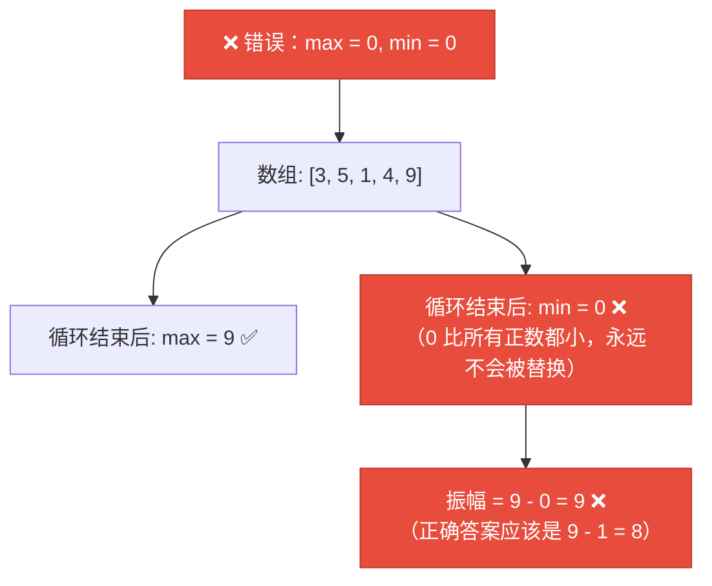
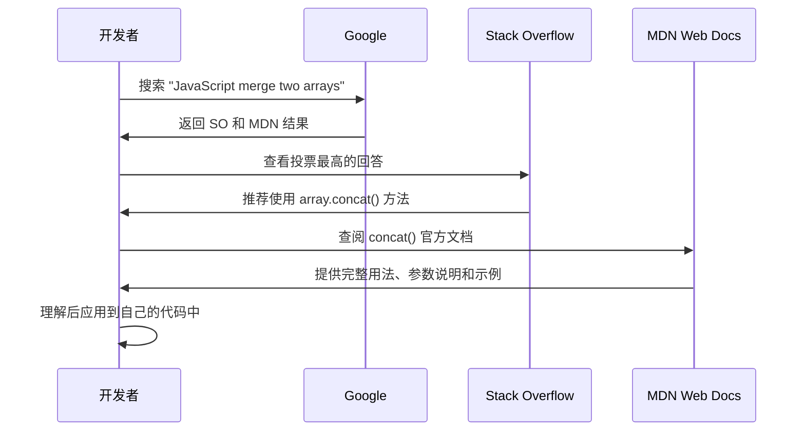
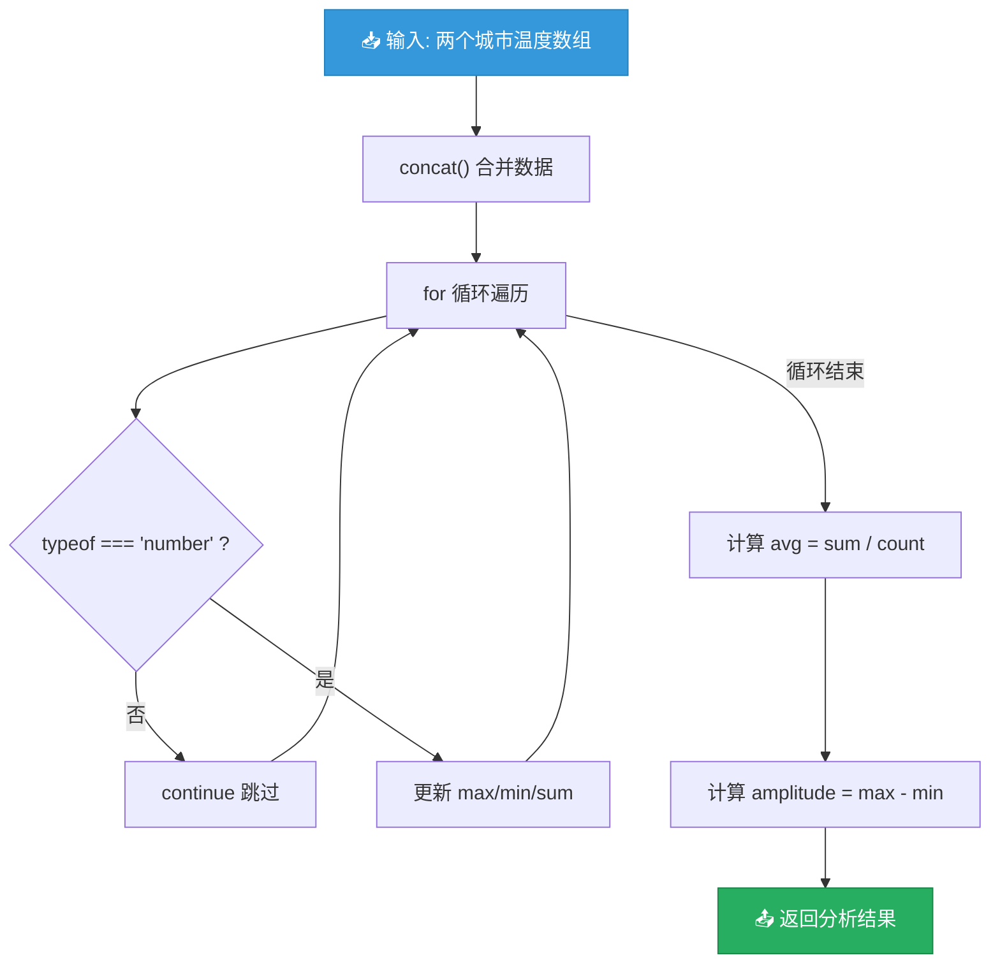

# 使用 Google、Stack Overflow 和 MDN

> 📺 来源：009 Using Google, StackOverflow and MDN.en.srt
> 📂 章节：第 05 章

## 📌 知识脉络
- **前置知识**：四步问题解决框架、JavaScript 基础（函数、数组、循环）、`typeof` 运算符
- **后续扩展**：调试（Debug）技巧、阅读官方文档能力、开源社区参与

## 🎯 概述

本节课通过一个完整的实战案例（计算温度振幅 + 合并两个数组）演示如何在真实开发中使用 **Google**、**Stack Overflow** 和 **MDN Web Docs** 三大搜索研究工具来解决编程问题。

## 核心知识点

### 1. 实战案例：计算温度振幅

> 🧩 **生活类比**：温度振幅就像股票的"波动幅度"——你需要找出最高价和最低价，然后算出它们的差值。

**问题描述**：给定一个温度数组（可能包含错误元素如字符串 `'error'`），计算**最高温度与最低温度的差值（振幅）**。

```js {runnable} {title="temp_amplitude.js"}
// 实战：计算温度振幅
const temperatures = [3, -2, -6, -1, 'error', 9, 13, 17, 15, 14, 9, 5];

function calcTempAmplitude(temps) {
  let max = temps[0]; // 用第一个元素初始化（不能用 0！）
  let min = temps[0];
  
  for (let i = 0; i < temps.length; i++) {
    const curTemp = temps[i];
    
    // 跳过非数字元素（如 'error'）
    if (typeof curTemp !== 'number') continue;
    
    if (curTemp > max) max = curTemp; // 更新最大值
    if (curTemp < min) min = curTemp; // 更新最小值
  }
  
  console.log(`🌡️ 最高温: ${max}°C`);
  console.log(`🌡️ 最低温: ${min}°C`);
  return max - min; // 振幅 = 最高 - 最低
}

const amplitude = calcTempAmplitude(temperatures);
console.log(`📊 温度振幅: ${amplitude}°C`);
```

**🔍 执行追踪：循环遍历温度数组**

| 迭代 (i) | curTemp | typeof | max | min | 动作 |
|----------|---------|--------|-----|-----|------|
| 0 | 3 | number | 3 | 3 | 初始值 |
| 1 | -2 | number | 3 | -2 | 更新 min |
| 2 | -6 | number | 3 | -6 | 更新 min |
| 3 | -1 | number | 3 | -6 | 无变化 |
| 4 | 'error' | string | 3 | -6 | **continue 跳过** |
| 5 | 9 | number | 9 | -6 | 更新 max |
| 6 | 13 | number | 13 | -6 | 更新 max |
| 7 | 17 | number | 17 | -6 | 更新 max |

> 💡 **记忆口诀**：「初始首元素，continue 跳杂质，逐个比大小，振幅等差值」

---

### 2. 为什么 max/min 不能初始化为 0

> 🧩 **生活类比**：想象你在评选班级最矮的同学，但你一开始就参照了一个"虚拟人"的身高 0 厘米。由于所有真人都比 0 高，"虚拟人"永远是最矮的——你的评选从一开始就出错了。



:::code-comparison
```js {title="🚨 错误初始化 (Bug!)"}
// ❌ 用 0 初始化 max 和 min
let max = 0;
let min = 0;

// 如果所有温度都是正数
// min 永远是 0（不是数组中的最小值）
// 如果所有温度都是负数
// max 永远是 0（不是数组中的最大值）
```
```js {title="✨ 正确初始化"}
// ✅ 用数组第一个元素初始化
let max = temps[0];
let min = temps[0];

// 这样 max/min 有了真实的起始参照
// 后续比较才能正确找出最大/最小值
```
:::

---

### 3. 搜索工具实战：合并两个数组

> 🧩 **生活类比**：你有两副不同的扑克牌，需要合在一起洗牌。你不知道怎么做，于是 Google 搜索"如何合并扑克牌"——Stack Overflow 告诉你"把两副叠在一起然后洗"——MDN 告诉你具体的洗牌方法文档。

当函数需要接收两个温度数组时，我们需要搜索"如何合并两个数组"：



```js {runnable} {title="merge_arrays.js"}
// 使用 concat() 合并两个数组 —— 通过搜索学到的！
const temps1 = [3, 5, 1];
const temps2 = [9, 0, 5];

// concat() 不会修改原数组，而是返回新数组
const allTemps = temps1.concat(temps2);
console.log('合并后:', allTemps); // [3, 5, 1, 9, 0, 5]

// 改进后的函数：接收两个数组
function calcTempAmplitudeNew(t1, t2) {
  const temps = t1.concat(t2); // 合并两个数组
  
  let max = temps[0];
  let min = temps[0];
  
  for (let i = 0; i < temps.length; i++) {
    if (typeof temps[i] !== 'number') continue;
    if (temps[i] > max) max = temps[i];
    if (temps[i] < min) min = temps[i];
  }
  
  return max - min;
}

const amplitude = calcTempAmplitudeNew(temps1, temps2);
console.log(`📊 合并后温度振幅: ${amplitude}°C`); // 9
```

**📊 三大搜索工具对比：**

| 工具 | 最佳场景 | 特点 | 使用频率 |
|------|---------|------|---------|
| **Google** | 初步搜索，不知道用什么方法时 | 最广泛，可找到各种资源 | ⭐⭐⭐⭐⭐ |
| **Stack Overflow** | 具体代码问题的解决方案 | 有投票系统，质量参差不齐 | ⭐⭐⭐⭐ |
| **MDN Web Docs** | 查阅 API 的官方说明和用法 | 最权威，示例丰富 | ⭐⭐⭐⭐⭐ |

> **💼 业务场景**：Jonas 强调 MDN 是他学习 JavaScript 最重要的资源——很多你在课程中学到的知识，他都是从 MDN 上首先学到的。MDN 的侧边栏列出了每种数据类型的所有方法，是探索 JavaScript 能力的"百科全书"。

---

## 🛠️ 代码实战与真实场景

> **💼 业务场景**：你需要构建一个天气分析工具，处理多个城市的温度数据，计算整体温度振幅。

```js {runnable} {title="weather_analyzer.js"}
// 天气分析工具 — 处理多城市温度数据
function analyzeWeather(city1Temps, city2Temps) {
  const allTemps = city1Temps.concat(city2Temps);
  
  let max = allTemps[0];
  let min = allTemps[0];
  let sum = 0;
  let validCount = 0;
  
  for (let i = 0; i < allTemps.length; i++) {
    if (typeof allTemps[i] !== 'number') continue;
    
    if (allTemps[i] > max) max = allTemps[i];
    if (allTemps[i] < min) min = allTemps[i];
    sum += allTemps[i];
    validCount++;
  }
  
  const avg = sum / validCount;
  const amplitude = max - min;
  
  return { max, min, avg: Math.round(avg * 10) / 10, amplitude, dataPoints: validCount };
}

const beijing = [2, 5, -3, 8, 'error', 12, 7];
const shanghai = [15, 18, 12, 20, 16, 'error', 14];

const result = analyzeWeather(beijing, shanghai);
console.log('🌍 双城天气分析:');
console.log(`  🌡️ 最高温: ${result.max}°C`);
console.log(`  🌡️ 最低温: ${result.min}°C`);
console.log(`  📊 平均温: ${result.avg}°C`);
console.log(`  📈 温度振幅: ${result.amplitude}°C`);
console.log(`  📋 有效数据点: ${result.dataPoints}`);
```



**📊 输入输出示例：**

| 城市 | 温度数据 | 有效数据点 |
|------|---------|-----------|
| 北京 | [2, 5, -3, 8, 'error', 12, 7] | 6 |
| 上海 | [15, 18, 12, 20, 16, 'error', 14] | 6 |
| **合并结果** | max=20, min=-3, amplitude=23 | 12 |

## 💡 关键要点
- ✅ **Google 搜索**是开发者每天使用最多的工具——搜索"JavaScript + 你要做的事"
- ✅ **Stack Overflow** 适合找具体问题的代码解决方案，注意看投票最高的回答
- ✅ **MDN Web Docs** 是 JavaScript 最权威的文档，学习新方法的首选资源
- ✅ `typeof` 配合 `continue` 可以跳过数组中的无效数据
- ✅ `concat()` 方法合并数组但**不修改原数组**，返回新数组

## ⚠️ 常见误区
- ⚠️ **误区 1：用 0 初始化 max/min**。如果数组全是正数，min 永远是 0（不是真正的最小值）；如果全是负数，max 永远是 0。应该用 `temps[0]` 初始化。
- ⚠️ **误区 2：concat 会修改原数组**。真相是 `concat()` 返回新数组，原数组不变。如果需要修改原数组，应该用 `push()` 或展开运算符 `[...arr1, ...arr2]`。

## 🐛 报错实验室

**❌ 错误做法：不过滤错误数据**
```js
const temps = [3, 5, 'error', 9];
let max = temps[0]; // 3

for (let i = 0; i < temps.length; i++) {
  if (temps[i] > max) max = temps[i]; // ❌ 字符串 'error' 参与比较
}
console.log(max); // 输出什么？
```
**浏览器输出：**
```
error  // 字符串 'error' 在比较中被认为"大于"数字 9
// 因为 JS 在 > 比较时会做类型转换，'error' > 9 的结果取决于隐式转换
```
**🔑 解读**：当字符串与数字进行 `>` 比较时，JavaScript 尝试将字符串转为数字（得到 `NaN`），`NaN > 9` 为 `false`。但不同场景下可能产生不同的意外结果。使用 `typeof` 检查 + `continue` 可以安全跳过非数字元素。

---

## 📖 词汇速查表 (Cheat Sheet)

| 中文术语 | 英文术语 | 简明释义 | 速查代码 | 📚 官方文档 |
|---------|---------|---------|---------|------------|
| 数组合并 | Array.concat() | 将多个数组合并为一个新数组 | `[1,2].concat([3,4])` | [MDN](https://developer.mozilla.org/en-US/docs/Web/JavaScript/Reference/Global_Objects/Array/concat) |
| 类型检测 | typeof | 返回值的类型字符串 | `typeof 42 // 'number'` | [MDN](https://developer.mozilla.org/en-US/docs/Web/JavaScript/Reference/Operators/typeof) |
| 跳过当前迭代 | continue | 跳过循环当前迭代的剩余代码 | `if (...) continue;` | [MDN](https://developer.mozilla.org/en-US/docs/Web/JavaScript/Reference/Statements/continue) |
| 温度振幅 | Temperature Amplitude | 最高温与最低温的差值 | `max - min` | — |

---

## 🧪 学习验证

### 📝 动手练习

**练习 1：查找所有大于平均值的温度**
```js {runnable} {title="above_average.js"}
// 找出温度数组中所有高于平均值的温度
const temps = [5, 10, 15, 20, 25, 30];

function findAboveAverage(arr) {
  // 1. 计算平均值
  // 2. 筛选出大于平均值的元素
  // 提示：先算 sum，再算 avg，最后用循环筛选
}

console.log(findAboveAverage(temps)); // 应输出 [20, 25, 30]
```
<details><summary>💡 参考答案</summary>

```js
function findAboveAverage(arr) {
  let sum = 0;
  for (let i = 0; i < arr.length; i++) {
    sum += arr[i];
  }
  const avg = sum / arr.length;
  
  const result = [];
  for (let i = 0; i < arr.length; i++) {
    if (arr[i] > avg) result.push(arr[i]);
  }
  return result;
}
// avg = 17.5, 所以 20, 25, 30 > 17.5
```
**解题思路**：分两步——先遍历算平均值，再遍历找出大于平均值的元素。
</details>

**练习 2：合并并去重**
```js {runnable} {title="merge_unique.js"}
// 合并两个数组并去除重复元素
const arr1 = [1, 3, 5, 7];
const arr2 = [3, 5, 8, 10];

function mergeUnique(a, b) {
  // 提示：先 concat 合并，然后遍历检查是否重复
}

console.log(mergeUnique(arr1, arr2)); // [1, 3, 5, 7, 8, 10]
```
<details><summary>💡 参考答案</summary>

```js
function mergeUnique(a, b) {
  const merged = a.concat(b);
  const result = [];
  for (let i = 0; i < merged.length; i++) {
    let isDuplicate = false;
    for (let j = 0; j < result.length; j++) {
      if (merged[i] === result[j]) {
        isDuplicate = true;
        break;
      }
    }
    if (!isDuplicate) result.push(merged[i]);
  }
  return result;
}
```
**解题思路**：先 `concat` 合并，然后用嵌套循环检查每个元素是否已在结果数组中。（后续课程会学到更优雅的 `Set` 方式）
</details>

### ❓ 理解检测

:::quiz {correct="C"}
**1. 为什么 Jonas 认为 MDN 是最重要的学习资源？**
- A) 因为 MDN 有视频教程
- B) 因为 MDN 是付费的高级文档
- C) 因为 MDN 是 JavaScript 最权威、最完整的官方文档，且免费

> **解析**：MDN（Mozilla Developer Network）是 JavaScript、HTML、CSS 的**非官方但最权威**的文档网站。Jonas 表示他大量的 JavaScript 知识来自 MDN。它免费、示例丰富、持续更新。
:::

:::quiz {correct="B"}
**2. 在温度振幅函数中，为什么 max 和 min 应该用 `temps[0]` 初始化？**
- A) 因为 0 是一个特殊的 JavaScript 值
- B) 因为用 0 初始化可能导致 min 或 max 永远不被更新
- C) 因为 temps[0] 总是最大的值

> **解析**：如果用 `0` 初始化 `min`，而数组全是正数，那么 `min` 永远停留在 `0`（真实最小值永远大于 0）。用 `temps[0]` 初始化确保 max/min 有一个真实的起始参照。
:::

:::quiz {correct="A"}
**3. `concat()` 方法的特性是？**
- A) 返回新数组，不修改原数组
- B) 直接修改原数组
- C) 只能合并两个数组

> **解析**：`concat()` 是**不可变方法**——它返回一个包含所有元素的新数组，原数组保持不变。它实际上可以接收多个参数来合并多个数组。
:::

### 🔧 代码填空

:::fill-blank
// 合并两个数组
const merged = arr1.___concat___(arr2);

// 跳过非数字元素
if (___typeof___ curTemp !== 'number') ___continue___;

// 用数组第一个元素初始化 max
let max = temps[___0___];
:::
