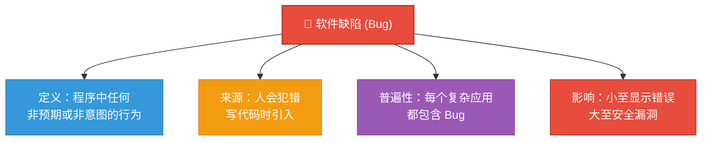
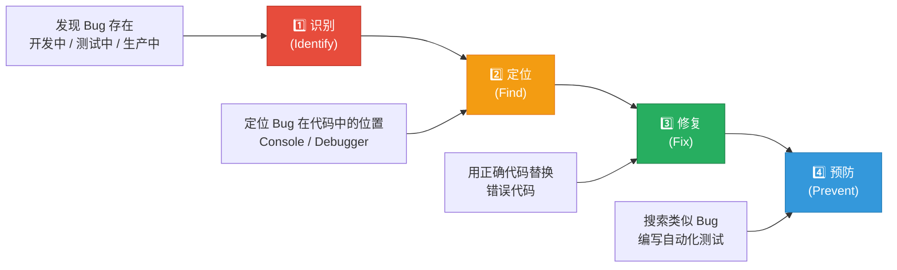
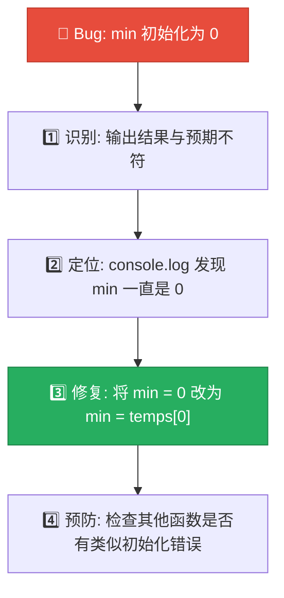

# 调试：修复错误

> 📺 来源：010 Debugging (Fixing Errors).en.srt
> 📂 章节：第 05 章

## 📌 知识脉络
- **前置知识**：JavaScript 基础语法、函数、条件判断、问题解决框架
- **后续扩展**：使用 Console 和 Breakpoints 实战调试、自动化测试、错误处理（try/catch）

## 🎯 概述

本节课介绍**调试（Debugging）** 的基本概念和流程。调试是发现、定位并修复代码中的**软件缺陷（Bug）** 的系统化过程。Jonas 将调试分为四步：识别 → 定位 → 修复 → 预防，并强调调试是开发者日常工作中不可避免的核心技能。

## 核心知识点

### 1. 什么是 Bug？

> 🧩 **生活类比**：Bug 就像打字时的错别字——你输入的不是你想表达的。就像"买菜"打成"卖菜"，虽然只差一个字，但意思完全相反。程序中的 Bug 也是如此——代码的行为与你的预期不符。

**"Bug"一词的起源**：1940年代，哈佛大学的计算机中发现了一只**真正的虫子（Bug）** 卡在继电器中，导致程序出错。从此，"Bug"成为软件缺陷的代名词。



> 💡 **记忆口诀**：「Bug 不可耻，人人都会写；重要的是能找到它、修好它」

---

### 2. 调试四步流程

> 🧩 **生活类比**：调试就像医生看病——先发现症状（识别 Bug），然后做检查定位病因（定位 Bug），接着对症下药（修复 Bug），最后建议健康生活方式预防复发（预防 Bug）。



**🔍 执行追踪：调试流程详解**

| 步骤 | 名称 | 做什么 | 工具 | 注意事项 |
|------|------|--------|------|----------|
| ① | 识别 (Identify) | 发现 Bug 存在 | 测试、用户反馈 | 开发阶段发现比生产阶段好 |
| ② | 定位 (Find) | 找到 Bug 在哪行代码 | Console、Debugger | 小 Bug 用 console.log，复杂 Bug 用断点 |
| ③ | 修复 (Fix) | 替换错误代码为正确代码 | — | 通常是最简单的步骤 |
| ④ | 预防 (Prevent) | 防止同类 Bug 再次出现 | 代码搜索、自动测试 | 检查项目中是否有相同错误 |

**📊 Bug 发现阶段对比：**

| 发现阶段 | 严重性 | 影响范围 | 修复成本 |
|----------|--------|---------|---------|
| 开发中发现 | ⭐ 低 | 仅开发者 | 💰 低 |
| 测试中发现 | ⭐⭐ 中 | 测试团队 | 💰💰 中 |
| 上线后发现 | ⭐⭐⭐ 高 | 真实用户 | 💰💰💰 高 |

> 💡 **记忆口诀**：「识定修防四步走，Bug 出现不用愁」

---

### 3. 案例：反转函数的 Bug

> 🧩 **生活类比**：如果你让翻译软件翻译"Hello"，结果不是"你好"而是乱码，你知道翻译功能有 Bug——你看到了错误的输出（识别），现在需要找到翻译引擎中的错误（定位）。

```js {runnable} {title="reverse_bug.js"}
// 演示：发现反转函数中的 Bug
function reverseBuggy(arr) {
  // ❌ Bug: 交换逻辑有误，结果是"打乱"而非"反转"
  const result = [];
  for (let i = 0; i < arr.length; i++) {
    result[i] = arr[arr.length - i]; // Bug 在这里！索引越界
  }
  return result;
}

function reverseCorrect(arr) {
  // ✅ 正确实现
  const result = [];
  for (let i = 0; i < arr.length; i++) {
    result[i] = arr[arr.length - 1 - i]; // 减 1 才对！
  }
  return result;
}

const testArr = [1, 2, 3, 4, 5];
console.log('❌ Buggy:', reverseBuggy(testArr));
console.log('✅ Correct:', reverseCorrect(testArr));
console.log('\n🔑 Bug: arr[arr.length - i] → 当 i=0 时越界!');
console.log('   修复: arr[arr.length - 1 - i]');
```

> **💼 业务场景**：在真实项目中，修复 Bug 本身通常很快，但**找到 Bug 在哪里**才是最耗时的。这就是为什么 Debugger 工具如此重要——下节课将详细讲解。

---

## 🛠️ 代码实战与真实场景

> **💼 业务场景**：模拟一个简单的调试流程追踪系统。

```js {runnable} {title="debug_tracker.js"}
// 调试流程追踪器
function debugProcess(bugDescription) {
  const process = {
    bug: bugDescription,
    steps: [],
  };
  
  // 第一步：识别
  process.steps.push({
    phase: '1️⃣ 识别',
    action: `发现 Bug: "${bugDescription}"`,
    status: '✅ 已确认',
  });
  
  // 第二步：定位
  process.steps.push({
    phase: '2️⃣ 定位',
    action: '使用 console.log 和 debugger 定位到具体代码行',
    status: '✅ 已定位',
  });
  
  // 第三步：修复
  process.steps.push({
    phase: '3️⃣ 修复',
    action: '用正确的代码替换有 Bug 的代码',
    status: '✅ 已修复',
  });
  
  // 第四步：预防
  process.steps.push({
    phase: '4️⃣ 预防',
    action: '搜索项目中是否有类似的错误模式',
    status: '✅ 已检查',
  });
  
  return process;
}

const debug = debugProcess('温度振幅计算中 min 初始化为 0 导致结果错误');
console.log(`🐛 Bug 报告: ${debug.bug}\n`);
debug.steps.forEach(step => {
  console.log(`${step.phase}: ${step.action}`);
  console.log(`   状态: ${step.status}\n`);
});
```



**📊 输入输出示例：**

| Bug 描述 | 定位方式 | 修复方案 | 预防措施 |
|----------|---------|---------|---------|
| min 初始化错误 | console.log | `min = temps[0]` | 检查其他函数的初始化 |
| 数组越界 | debugger 断点 | 修改索引计算 | 添加边界检查 |
| 类型错误 | typeof 检查 | 添加类型守卫 | 编写类型测试 |

## 💡 关键要点
- ✅ **Bug 是正常的**——每个程序都有 Bug，不要因此感到沮丧
- ✅ 调试的四个步骤：**识别 → 定位 → 修复 → 预防**
- ✅ **生产环境的 Bug 最危险**——尽量在开发阶段发现并修复
- ✅ 修复 Bug 通常很简单，**最难的是找到 Bug 在哪里**
- ✅ 修复后要**检查是否有相同模式的错误**存在于其他地方

## ⚠️ 常见误区
- ⚠️ **误区 1：只要代码能运行就没有 Bug**。真相是：Bug 不一定导致崩溃，可能只是输出错误的结果。功能看起来"正常"但结果错误是最隐蔽的 Bug。
- ⚠️ **误区 2：修好一个 Bug 就完事了**。真相是：相同的错误模式可能在项目其他地方重复出现。修复后应搜索整个项目确认。

## 🐛 报错实验室

**❌ 错误做法：不按流程调试，盲目修改**
```js
// 发现结果不对，直接改代码试试
function calcArea(width, height) {
  return width + height; // 面积应该用乘法 ❌
}

console.log(calcArea(5, 3)); // 输出 8，但期望 15
// 新手反应：改成 width * height
// 高手做法：先用 console.log 确认 width 和 height 的值
//          再确认公式是否正确
```
**浏览器输出：**
```
8  // 期望 15，发现 + 应该是 *
```
**🔑 解读**：虽然这个例子很简单，但核心观点是：即使你"觉得"知道 Bug 在哪里，也应该先**用 console.log 验证你的假设**，再修改代码。在复杂项目中，"直觉"往往是错的。

---

## 📖 词汇速查表 (Cheat Sheet)

| 中文术语 | 英文术语 | 简明释义 | 速查代码 | 📚 官方文档 |
|---------|---------|---------|---------|------------|
| 软件缺陷 | Bug | 程序中的非预期行为 | — | — |
| 调试 | Debugging | 发现并修复代码缺陷的过程 | `console.log()` / `debugger` | [MDN](https://developer.mozilla.org/en-US/docs/Learn/JavaScript/First_steps/What_went_wrong) |
| 断点 | Breakpoint | 暂停代码执行以检查状态 | Chrome Sources 面板 | [Chrome DevTools](https://developer.chrome.com/docs/devtools/javascript/) |
| 控制台 | Console | 浏览器的开发者工具输出界面 | `F12` / `Ctrl+Shift+J` | [MDN](https://developer.mozilla.org/en-US/docs/Web/API/console) |

---

## 🧪 学习验证

### 📝 动手练习

**练习 1：找出 Bug 并修复**
```js {runnable} {title="find_the_bug.js"}
// 这个函数应该返回数组中所有偶数的总和
// 但它有一个 Bug！找出并修复它

function sumEvenNumbers(arr) {
  let sum = 0;
  for (let i = 0; i <= arr.length; i++) { // 🐛 Bug 在这行！
    if (arr[i] % 2 === 0) {
      sum += arr[i];
    }
  }
  return sum;
}

console.log(sumEvenNumbers([1, 2, 3, 4, 5, 6])); // 期望 12 (2+4+6)
```
<details><summary>💡 参考答案</summary>

```js
// Bug: i <= arr.length 应改为 i < arr.length
// 当 i === arr.length 时，arr[i] 是 undefined
// undefined % 2 === 0 恰好为 false，所以不会报错但可能导致 NaN
function sumEvenNumbers(arr) {
  let sum = 0;
  for (let i = 0; i < arr.length; i++) { // ✅ 修复: <= 改为 <
    if (arr[i] % 2 === 0) {
      sum += arr[i];
    }
  }
  return sum;
}
```
**解题思路**：数组索引从 0 到 `length - 1`，循环条件应该是 `<` 而非 `<=`，否则最后一次迭代会访问 `undefined`。
</details>

**练习 2：调试追踪日志**
```js {runnable} {title="debug_log.js"}
// 用 console.log 追踪这个函数的执行过程，找出为什么结果不对
function multiply(a, b) {
  console.log('输入:', a, b);        // 调试点 1
  const result = a + b;              // 🐛 这里应该是 * 不是 +
  console.log('结果:', result);       // 调试点 2
  return result;
}

console.log('最终:', multiply(5, 3)); // 期望 15，实际 8
```
<details><summary>💡 参考答案</summary>

```js
function multiply(a, b) {
  const result = a * b; // 修复: + 改为 *
  return result;
}
// console.log 帮我们确认了输入正确（5, 3），
// 问题出在计算过程中（用了 + 而不是 *）
```
**解题思路**：console.log 是最基本的调试工具——通过打印输入和输出，快速缩小 Bug 范围。
</details>

### ❓ 理解检测

:::quiz {correct="B"}
**1. 调试的四个步骤中，通常最困难的是哪一步？**
- A) 修复（Fix）
- B) 定位（Find）
- C) 预防（Prevent）

> **解析**：Jonas 指出，修复 Bug 通常是**最简单**的部分——难的是**找到 Bug 在代码的哪个位置**。这就是 Debugger 工具存在的原因。
:::

:::quiz {correct="A"}
**2. 在什么阶段发现 Bug 的代价最大？**
- A) 生产环境（用户正在使用时）
- B) 开发阶段
- C) 代码审查阶段

> **解析**：**生产环境**的 Bug 影响真实用户，修复成本最高。因此 Jonas 强调尽早通过测试发现 Bug 的重要性。
:::

:::quiz {correct="C"}
**3. 修复 Bug 后为什么要进行"预防"步骤？**
- A) 为了写文档
- B) 为了通知项目经理
- C) 因为相同的错误模式可能在代码的其他位置出现

> **解析**：修复一处 Bug 后，相同的逻辑错误可能在项目其他地方重复出现。搜索整个项目确保"同类 Bug 全部修复"是防止回归的关键步骤。
:::

### 🔧 代码填空

:::fill-blank
// 调试四步流程
// 1. ___识别___: 发现 Bug 存在
// 2. ___定位___: 找到 Bug 在代码的哪个位置
// 3. ___修复___: 用正确代码替换错误代码
// 4. ___预防___: 搜索并消除同类 Bug
:::
