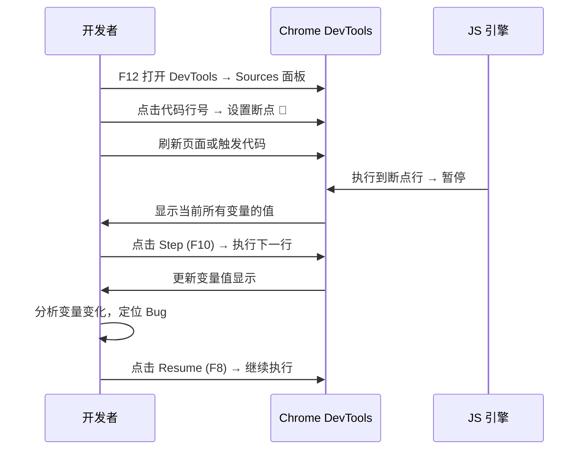
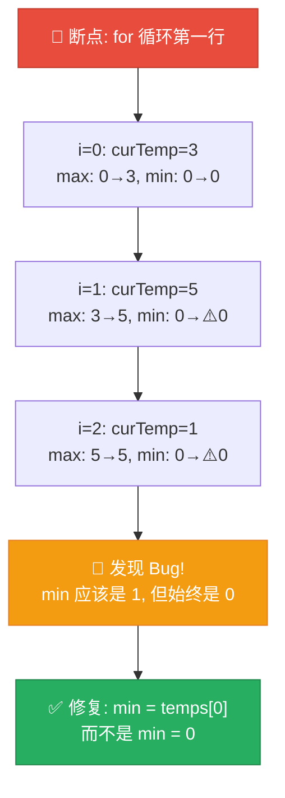

# 使用 Console 和 Breakpoints 调试

> 📺 来源：011 Debugging with the Console and Breakpoints.en.srt
> 📂 章节：第 05 章

## 📌 知识脉络
- **前置知识**：调试四步流程（识别→定位→修复→预防）、函数、循环、`console.log()`
- **后续扩展**：Chrome DevTools 高级调试、Node.js 调试、自动化测试（Jest / Mocha）

## 🎯 概述

本节课是**调试实战课**，通过两个真实案例演示如何使用 **`console.log()`** 进行快速调试，以及如何使用 **Chrome DevTools 的 Breakpoints（断点）** 进行逐行分析。还介绍了 JavaScript 的内置 `debugger` 语句。

## 核心知识点

### 1. console.log() 调试法

> 🧩 **生活类比**：`console.log()` 调试法就像在迷宫的关键路口放路标——你在代码的关键位置打印变量值，帮助你追踪程序的执行路径和数据变化。

```js {runnable} {title="console_debug.js"}
// 案例：温度单位转换函数
// Bug: 转换结果不正确

const measureKelvin = function () {
  const measurement = {
    type: 'temp',
    unit: 'celsius',
    value: 10,  // 实际项目中来自 prompt() 输入
  };
  
  // 🔍 调试点 1: 检查输入值
  console.log('调试 → measurement:', measurement);
  console.log('调试 → value:', measurement.value);
  console.log('调试 → typeof value:', typeof measurement.value);
  
  // Bug 场景: prompt() 返回的是字符串 "10" 而非数字 10
  // 修复: 使用 Number() 转换
  const kelvin = measurement.value + 273; // 如果 value 是 '10'，结果是 '10273'
  
  // 🔍 调试点 2: 检查计算结果
  console.log('调试 → kelvin:', kelvin);
  
  return kelvin;
};

const result = measureKelvin();
console.log(`转换结果: ${result}K`);
```

**🔍 执行追踪：通过 console.log 定位 Bug**

| 调试点 | 打印内容 | 正常值 | Bug 时的值 | 发现问题 |
|--------|---------|--------|-----------|---------|
| ① | `measurement.value` | `10` (number) | `"10"` (string) | 类型错误！ |
| ② | `typeof value` | `"number"` | `"string"` | 确认是类型问题 |
| ③ | `kelvin` | `283` | `"10273"` | 字符串拼接不是加法! |

> 💡 **记忆口诀**：「log 一下值，log 一下类型，Bug 无处藏」

---

### 2. Chrome DevTools Breakpoints（断点调试）

> 🧩 **生活类比**：如果 `console.log` 是在迷宫的路口贴路标，那么 Breakpoints 就是在路口设一个"暂停按钮"——程序跑到这里会停下来，你可以四处看看当前的状态，然后决定是继续走还是一步步走。

**使用断点调试的步骤**：



**断点调试面板的关键按钮**：

| 按钮 | 快捷键 | 功能 | 使用场景 |
|------|--------|------|---------|
| ▶️ Resume | F8 | 继续执行到下一个断点 | 快速跳到下一个关注点 |
| ⏭️ Step Over | F10 | 执行下一行（不进入函数） | 逐行追踪 |
| ⬇️ Step Into | F11 | 进入函数内部 | 需要深入调试函数 |
| ⬆️ Step Out | Shift+F11 | 跳出当前函数 | 当前函数已调试完毕 |

---

### 3. 实战：用断点调试循环中的 Bug

> 🧩 **生活类比**：在循环中使用断点就像在工厂流水线上按下"暂停"——你可以检查每一个流过的产品（每次迭代的变量值），发现哪一步出了问题。

```js {runnable} {title="breakpoint_debug.js"}
// Bug 案例：max/min 初始化为 0 导致 min 永远是 0

const temperatures = [3, 5, 1, 9, 4];

function calcTempAmplitudeBug(temps) {
  let max = 0; // 🐛 Bug: 应该用 temps[0]
  let min = 0; // 🐛 Bug: 应该用 temps[0]
  
  for (let i = 0; i < temps.length; i++) {
    const curTemp = temps[i];
    
    // debugger; // 取消注释可自动触发断点
    
    if (curTemp > max) max = curTemp;
    if (curTemp < min) min = curTemp;
    
    // 模拟断点调试的输出
    console.log(`迭代 ${i}: curTemp=${curTemp}, max=${max}, min=${min}`);
  }
  
  console.log(`\n最终: max=${max}, min=${min}`);
  return max - min;
}

console.log('❌ 有 Bug 的结果:');
const buggyAmplitude = calcTempAmplitudeBug(temperatures);
console.log(`振幅 = ${buggyAmplitude}\n`);

// ✅ 修复版本
function calcTempAmplitudeFixed(temps) {
  let max = temps[0]; // ✅ 修复
  let min = temps[0]; // ✅ 修复
  
  for (let i = 0; i < temps.length; i++) {
    if (temps[i] > max) max = temps[i];
    if (temps[i] < min) min = temps[i];
  }
  return max - min;
}

console.log('✅ 修复后的结果:');
const fixedAmplitude = calcTempAmplitudeFixed(temperatures);
console.log(`振幅 = ${fixedAmplitude}`);
```

**断点调试过程可视化**：



> 💡 **记忆口诀**：「循环里的 Bug 最刁钻，断点一设见真章」

---

### 4. `debugger` 语句

> 🧩 **生活类比**：`debugger` 语句就像在代码中埋了一个"地雷"——程序运行到这里时，会自动"引爆"Chrome 的调试面板，你不需要手动设置断点。

```js {runnable} {title="debugger_statement.js"}
// debugger 语句：在代码中直接设置断点
function inspect(value) {
  // 当浏览器遇到 debugger 时，自动打开调试面板
  // debugger;  // 取消注释后，在浏览器中运行会自动暂停
  
  console.log('当前值:', value);
  console.log('类型:', typeof value);
  return value;
}

// 使用示例
console.log('💡 debugger 关键字使用方法:');
console.log('   1. 在代码中写 debugger;');
console.log('   2. 浏览器运行到该行时自动暂停');
console.log('   3. DevTools 自动打开 Sources 面板');
console.log('   4. 你可以查看所有变量的当前值');
console.log('   5. 调试完毕后删除 debugger 语句');

inspect(42);
```

**📊 console.log vs Breakpoints vs debugger 对比：**

| 特性 | `console.log()` | Breakpoints (UI) | `debugger` 语句 |
|------|----------------|-------------------|----------------|
| 设置位置 | 代码中 | Chrome DevTools | 代码中 |
| 暂停执行 | ❌ | ✅ | ✅ |
| 查看所有变量 | ❌ 只看打印的 | ✅ | ✅ |
| 逐行执行 | ❌ | ✅ | ✅ |
| 适合场景 | 简单 Bug | 复杂循环/函数 | 需要精确定位 |
| 使用后需清理 | ✅ 删除 log | ❌ 自动清除 | ✅ 删除语句 |

---

## 🛠️ 代码实战与真实场景

> **💼 业务场景**：你在开发一个电商网站的购物车功能，发现总价计算不正确。使用调试技术定位问题。

```js {runnable} {title="cart_debug.js"}
// 电商购物车 Bug 调试实战
function calculateCart(items) {
  let totalPrice = 0;
  let totalItems = 0;
  
  for (let i = 0; i < items.length; i++) {
    const item = items[i];
    const itemTotal = item.price * item.quantity;
    
    // 🔍 调试日志
    console.log(`[${i}] ${item.name}: ¥${item.price} × ${item.quantity} = ¥${itemTotal}`);
    
    totalPrice += itemTotal;
    totalItems += item.quantity;
  }
  
  console.log(`\n📋 购物车汇总:`);
  console.log(`  总商品数: ${totalItems}`);
  console.log(`  总价: ¥${totalPrice}`);
  
  return { totalPrice, totalItems };
}

const cartItems = [
  { name: 'JavaScript 教程', price: 99, quantity: 1 },
  { name: '机械键盘', price: 299, quantity: 1 },
  { name: 'USB 数据线', price: 15, quantity: 3 },
];

calculateCart(cartItems);
```

**📊 输入输出示例：**

| 商品 | 单价 | 数量 | 小计 |
|------|------|------|------|
| JavaScript 教程 | ¥99 | 1 | ¥99 |
| 机械键盘 | ¥299 | 1 | ¥299 |
| USB 数据线 | ¥15 | 3 | ¥45 |
| **合计** | — | **5** | **¥443** |


## 💡 关键要点
- ✅ **`console.log()`** 是最基本的调试工具——打印变量值和类型来追踪问题
- ✅ **Breakpoints** 让你暂停执行、查看所有变量、逐行分析——适合复杂 Bug
- ✅ **`debugger`** 语句可以直接在代码中触发断点——无需在 DevTools 中手动设置
- ✅ **循环中的 Bug** 最适合用断点调试——你可以逐次迭代检查变量变化
- ✅ 调试完成后，记得**删除所有调试代码**（console.log、debugger）

## ⚠️ 常见误区
- ⚠️ **误区 1：调试就是加 console.log**。真相是：对于复杂问题（特别是循环和嵌套函数），Breakpoints 断点调试远比 console.log 高效。
- ⚠️ **误区 2：把 debugger 语句留在代码中提交**。真相是：`debugger` 只用于开发时调试，提交代码前必须删除，否则用户的浏览器会暂停执行。

## 🐛 报错实验室

**❌ 错误做法：不检查 prompt() 返回值的类型**
```js
// prompt() 总是返回字符串！
const value = prompt('请输入温度:'); // 用户输入 10
console.log(typeof value); // "string" ← 不是 "number"!

const kelvin = value + 273; // "10" + 273 = "10273" ❌
console.log(kelvin); // "10273" 而非 283
```
**浏览器输出：**
```
string
10273
```
**🔑 解读**：`prompt()` 函数**总是返回字符串**。即使用户输入数字 `10`，得到的也是字符串 `"10"`。使用 `+` 运算符时，JavaScript 会将数字 `273` 转为字符串进行拼接。修复：`const kelvin = Number(value) + 273;`

---

## 📖 词汇速查表 (Cheat Sheet)

| 中文术语 | 英文术语 | 简明释义 | 速查代码 | 📚 官方文档 |
|---------|---------|---------|---------|------------|
| 控制台日志 | console.log() | 在控制台打印调试信息 | `console.log(x)` | [MDN](https://developer.mozilla.org/en-US/docs/Web/API/console/log_static) |
| 断点 | Breakpoint | 暂停代码执行的标记点 | Sources 面板点行号 | [Chrome DevTools](https://developer.chrome.com/docs/devtools/javascript/breakpoints/) |
| 调试器语句 | debugger | 在代码中触发断点的关键字 | `debugger;` | [MDN](https://developer.mozilla.org/en-US/docs/Web/JavaScript/Reference/Statements/debugger) |
| 单步执行 | Step Over | 执行下一行代码 | F10 | [Chrome DevTools](https://developer.chrome.com/docs/devtools/javascript/reference/) |
| 用户输入 | prompt() | 弹出输入对话框 | `prompt('message')` | [MDN](https://developer.mozilla.org/en-US/docs/Web/API/Window/prompt) |

---

## 🧪 学习验证

### 📝 动手练习

**练习 1：用 console.log 调试**
```js {runnable} {title="debug_exercise1.js"}
// 这个函数应该返回数组中大于 threshold 的元素个数
// 但结果不对，用 console.log 找出 Bug

function countAbove(arr, threshold) {
  let count = 1; // 🐛 Bug 在这里！
  for (let i = 0; i < arr.length; i++) {
    if (arr[i] > threshold) {
      count++;
    }
  }
  return count;
}

// 添加 console.log 调试点来定位问题
console.log(countAbove([1, 5, 8, 3, 10], 4)); // 期望 3 (5, 8, 10)
```
<details><summary>💡 参考答案</summary>

```js
// Bug: count 初始值应该是 0，不是 1
function countAbove(arr, threshold) {
  let count = 0; // ✅ 修复: 1 改为 0
  for (let i = 0; i < arr.length; i++) {
    if (arr[i] > threshold) {
      count++;
    }
  }
  return count;
}
```
**解题思路**：通过在循环前后添加 `console.log('count:', count)` 可以发现 count 的初始值就已经是 1，导致最终结果多 1。
</details>

**练习 2：模拟断点调试**
```js {runnable} {title="debug_exercise2.js"}
// 手动模拟断点调试：在每次迭代中记录变量状态
function findMax(arr) {
  let max = arr[0];
  const debugLog = [];
  
  for (let i = 1; i < arr.length; i++) {
    const before = max;
    if (arr[i] > max) max = arr[i];
    
    debugLog.push({
      iteration: i,
      current: arr[i],
      maxBefore: before,
      maxAfter: max,
      changed: before !== max,
    });
  }
  
  // 打印"断点调试日志"
  console.log('🔍 断点调试日志:');
  debugLog.forEach(log => {
    const icon = log.changed ? '🔄' : '➡️';
    console.log(`  ${icon} i=${log.iteration}: arr[i]=${log.current}, max: ${log.maxBefore}→${log.maxAfter}`);
  });
  
  return max;
}

findMax([3, 7, 2, 9, 1, 5]);
```
<details><summary>💡 参考答案</summary>

```js
// 输出:
// 🔍 断点调试日志:
//   🔄 i=1: arr[i]=7, max: 3→7
//   ➡️ i=2: arr[i]=2, max: 7→7
//   🔄 i=3: arr[i]=9, max: 7→9
//   ➡️ i=4: arr[i]=1, max: 9→9
//   ➡️ i=5: arr[i]=5, max: 9→9
// 最终 max = 9
```
**解题思路**：断点调试的精髓在于"暂停并观察"。这个练习通过代码模拟了断点调试的过程，让你看到每次迭代中 `max` 的变化。
</details>

### ❓ 理解检测

:::quiz {correct="B"}
**1. 在 Chrome DevTools 中设置断点的位置在哪个面板？**
- A) Console 面板
- B) Sources 面板
- C) Network 面板

> **解析**：断点设置在 **Sources（源代码）面板**。在该面板中找到你的 JS 文件，点击行号即可设置/取消断点。Console 面板用于查看输出，Network 面板用于查看网络请求。
:::

:::quiz {correct="C"}
**2. `debugger` 语句的作用是什么？**
- A) 自动修复 Bug
- B) 打印变量值到控制台
- C) 在代码执行到该行时自动暂停，触发 DevTools 的调试面板

> **解析**：`debugger` 相当于在代码中"硬编码"了一个断点。当浏览器执行到 `debugger;` 语句时，会**自动暂停**并打开 DevTools 的调试界面，让你检查变量状态。
:::

:::quiz {correct="A"}
**3. `prompt()` 函数返回值的类型始终是？**
- A) String（字符串）
- B) Number（数字，如果用户输入的是数字）
- C) 取决于用户输入的内容

> **解析**：`prompt()` **总是返回字符串**，不管用户输入什么。如果需要数字，必须手动用 `Number()` 或 `parseInt()` 转换。这是一个非常常见的 Bug 来源。
:::

### 🔧 代码填空

:::fill-blank
// 在代码中直接触发断点
___debugger___;

// 打印变量值和类型用于调试
console.___log___('value:', x, 'type:', ___typeof___ x);

// 在 Chrome DevTools 中逐行执行的快捷键
// Step Over: ___F10___
:::
