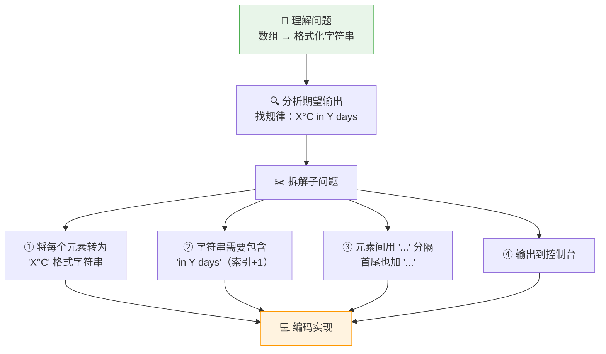
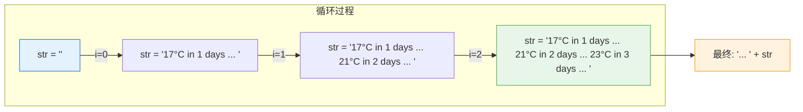
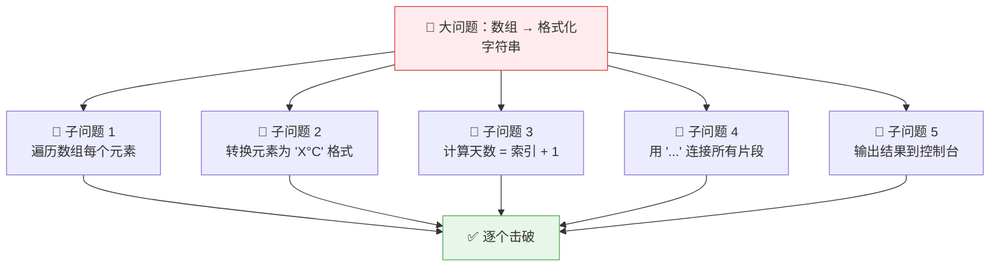
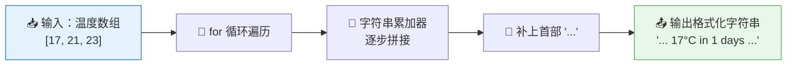

# 编程挑战 #1：天气预报字符串生成器

> 📺 来源：012 CHALLENGE #1.en.srt
> 📂 章节：第 05 章

## 📌 知识脉络
- **前置知识**：数组（Array）基础与索引、`for` 循环遍历数组、模板字面量（Template Literal）、字符串拼接
- **后续扩展**：高阶数组方法（`map`、`join`、`reduce`）、函数式编程思维、ES6 解构与展开运算符

## 🎯 概述

本节是一道**编程挑战**，要求你编写一个函数 `printForecast`，将一组温度数值数组转换为格式化的天气预报字符串并输出到控制台。核心考察的是**问题分解能力**——如何将一个看似复杂的任务拆解为可管理的子问题，然后逐个击破。

---

## 🏆 挑战任务

### 📋 Tasks（任务清单）

1. 创建函数 `printForecast`，接收一个温度数组作为参数
2. 将数组中的每个元素转换为 `"...X°C in Y days..."` 格式的字符串片段
3. 其中 `X` 是温度值，`Y` 是该元素在数组中的索引 + 1（代表"几天后"）
4. 所有片段用 `" ... "` 连接，首尾也加上 `" ... "`
5. 将最终拼接好的字符串输出到控制台（`console.log`）

### 📊 Test Data（测试数据集）

```js
// 测试数据 1
const data1 = [17, 21, 23];
// 期望输出: "... 17°C in 1 days ... 21°C in 2 days ... 23°C in 3 days ..."

// 测试数据 2
const data2 = [12, 5, -5, 0, 4];
// 期望输出: "... 12°C in 1 days ... 5°C in 2 days ... -5°C in 3 days ... 0°C in 4 days ... 4°C in 5 days ..."
```

---

## 🛠️ 实战沙盒

> ⚠️ **请先独立完成挑战，不要偷看下方的解法！**

```js {runnable} {title="challenge1.js"}
// 🏆 编程挑战 #1：天气预报字符串生成器
// 提示 1：函数需要接收一个数组参数
// 提示 2：使用 for 循环遍历数组
// 提示 3：用一个"累加器"变量来逐步构建字符串（类似累加求和的思路）
// 提示 4：每个元素的格式是 `${arr[i]}°C in ${i + 1} days`
// 提示 5：别忘了开头的 "... "

const data1 = [17, 21, 23];
const data2 = [12, 5, -5, 0, 4];

// 在这里写你的 printForecast 函数 👇


// 测试调用
// printForecast(data1);
// printForecast(data2);
```

---

<details><summary>💡 Jonas 官方解法拆解</summary>

### 🧠 解题思考链路（四步问题分解法）

Jonas 在本节课中展示了**开发者思维**的核心方法论——先理解问题、再拆解子问题、最后逐步编码：



### 核心思路：字符串累加器模式

> 🧩 **生活类比**：就像计算数组总和时用一个 `sum` 变量从 0 开始累加，这里用一个 `str` 变量从**空字符串 `""`** 开始，每次循环"拼接"新内容上去，就像串珠子一样把一颗颗珠子穿到绳子上。



### 完整解法代码

```js
const data1 = [17, 21, 23];
const data2 = [12, 5, -5, 0, 4];

function printForecast(arr) {
  let str = '';                          // ① 字符串累加器，从空字符串开始
  for (let i = 0; i < arr.length; i++) {
    str += `${arr[i]}°C in ${i + 1} days ... `;  // ② 每次循环追加格式化片段
  }
  console.log('... ' + str);             // ③ 在开头补上 "... " 后输出
}

printForecast(data1);
// "... 17°C in 1 days ... 21°C in 2 days ... 23°C in 3 days ... "
printForecast(data2);
// "... 12°C in 1 days ... 5°C in 2 days ... -5°C in 3 days ... 0°C in 4 days ... 4°C in 5 days ... "
```

### 🔍 执行追踪（data1 = [17, 21, 23]）

| 迭代 | `i` | `arr[i]` | `i + 1` | 当前 `str` 的值 |
|------|-----|----------|---------|-----------------|
| 初始 | — | — | — | `""` |
| 第 1 次 | 0 | 17 | 1 | `"17°C in 1 days ... "` |
| 第 2 次 | 1 | 21 | 2 | `"17°C in 1 days ... 21°C in 2 days ... "` |
| 第 3 次 | 2 | 23 | 3 | `"17°C in 1 days ... 21°C in 2 days ... 23°C in 3 days ... "` |
| 输出 | — | — | — | `"... 17°C in 1 days ... 21°C in 2 days ... 23°C in 3 days ... "` |

### 关键技巧：字符串累加 ≈ 数字累加

:::code-comparison
```js {title="🔢 数字累加求和（已学）"}
let sum = 0;               // 累加器初始化为 0
for (let i = 0; i < arr.length; i++) {
  sum += arr[i];            // 每次加一个数
}
console.log(sum);           // 输出总和
```
```js {title="📝 字符串累加拼接（本课）"}
let str = '';               // 累加器初始化为空字符串
for (let i = 0; i < arr.length; i++) {
  str += `${arr[i]}°C in ${i + 1} days ... `;  // 每次拼一段
}
console.log('... ' + str);  // 输出完整字符串
```
:::

> 💡 **记忆口诀**：「数字加零始，字符串空起；循环逐个累，输出一整体」

</details>

---

## 核心知识点

### 1. 问题分解法（Problem Decomposition）

> 🧩 **生活类比**：面对一道复杂的大菜谱，优秀的厨师不会手忙脚乱地同时处理所有食材。他会先**拆解步骤**——备菜、调酱、热锅、烹炒、装盘——然后逐步完成。编程也一样，大问题拆成小问题，逐个解决。



**开发者思维三步法**：
1. **理解问题**：明确输入是什么、输出是什么、有什么规律
2. **拆解子问题**：把大问题分解为可独立解决的小任务
3. **逐步编码**：先写最简单的硬编码版本，再逐步改进为动态版本

---

### 2. 字符串累加器模式（String Accumulator Pattern）

> 🧩 **生活类比**：想象你在做一条手链，桌上有一堆散落的珠子（数组元素）。你手里拿着一条空线（空字符串），每拿一颗珠子就穿到线上（字符串拼接），最后在两头系上扣子（首尾的 `"..."`），手链就完成了。

这是将数组元素逐个拼接为字符串的经典模式：

```js {runnable} {title="accumulator_pattern.js"}
// 字符串累加器模式演示
const temperatures = [17, 21, 23];

let result = '';  // 累加器：空字符串（相当于数字累加中的 0）

for (let i = 0; i < temperatures.length; i++) {
  // 每次循环，往累加器上"追加"一段格式化文本
  result += `${temperatures[i]}°C in ${i + 1} days ... `;
}

// 补上开头的 "... " 后输出
console.log('... ' + result);
```

**📊 数字累加 vs 字符串累加：**

| 特性 | 数字累加 | 字符串累加 |
|------|---------|-----------|
| 累加器初始值 | `let sum = 0` | `let str = ''` |
| 累加操作 | `sum += number` | `str += text` |
| "零值"概念 | 数字 `0`（加任何数不变） | 空字符串 `''`（拼任何字符串不变） |
| 最终结果 | 一个数字 | 一个完整字符串 |

**🔍 执行追踪：**

| 步骤 | `i` | `temperatures[i]` | `i + 1` | `result` 的值 |
|------|-----|--------------------|---------|---------------|
| 初始 | — | — | — | `""` |
| 循环 1 | 0 | 17 | 1 | `"17°C in 1 days ... "` |
| 循环 2 | 1 | 21 | 2 | `"17°C in 1 days ... 21°C in 2 days ... "` |
| 循环 3 | 2 | 23 | 3 | `"17°C in 1 days ... 21°C in 2 days ... 23°C in 3 days ... "` |
| 输出 | — | — | — | `"... 17°C in 1 days ... 21°C in 2 days ... 23°C in 3 days ... "` |

> 💡 **记忆口诀**：「空弦起步拼，循环逐段追；首尾加装饰，一气呵成美」

---

### 3. 从硬编码到动态化的演进

> 🧩 **生活类比**：盖房子时，建筑师会先搭一个小模型（硬编码原型），确认结构合理后，再按图纸盖真正的楼（动态化代码）。

Jonas 在解题中展示了一个重要的编程技巧：**先写硬编码版本验证思路，再重构为通用方案**。

:::code-comparison
```js {title="🚨 硬编码版本（仅适用于 3 个元素）"}
const data1 = [17, 21, 23];

// 手动写死每个索引位置
const output = `... ${data1[0]}°C in 1 days ... ${data1[1]}°C in 2 days ... ${data1[2]}°C in 3 days ...`;

console.log(output);
// 问题：如果数组有 5 个元素就不行了！
```
```js {title="✨ 动态化版本（适用于任意长度数组）"}
function printForecast(arr) {
  let str = '';
  for (let i = 0; i < arr.length; i++) {
    str += `${arr[i]}°C in ${i + 1} days ... `;
  }
  console.log('... ' + str);
}
// 无论数组多长，都能正确处理！
printForecast([17, 21, 23]);
printForecast([12, 5, -5, 0, 4]);
```
:::

---

## 🛠️ 代码实战与真实场景

> **💼 业务场景**：你是一名气象应用开发者，需要将后端返回的温度数组渲染为用户友好的预报文本。

```js {runnable} {title="weather_app.js"}
// 🌤️ 天气预报应用 - 将温度数组转为可读文本

function printForecast(arr) {
  let str = '';
  for (let i = 0; i < arr.length; i++) {
    str += `${arr[i]}°C in ${i + 1} days ... `;
  }
  console.log('... ' + str);
}

// 测试数据
const beijingTemps = [17, 21, 23];
const tokyoTemps = [12, 5, -5, 0, 4];

console.log('🇨🇳 北京未来天气预报：');
printForecast(beijingTemps);

console.log('\n🇯🇵 东京未来天气预报：');
printForecast(tokyoTemps);

// 扩展：也可以处理更短或更长的数组
console.log('\n🌍 伦敦未来天气预报：');
printForecast([8, 10, 12, 14, 11, 9, 7]);
```

**📊 输入输出示例：**

| 输入数组 | 输出字符串 | 说明 |
|---------|-----------|------|
| `[17, 21, 23]` | `"... 17°C in 1 days ... 21°C in 2 days ... 23°C in 3 days ... "` | 3 天预报 |
| `[12, 5, -5, 0, 4]` | `"... 12°C in 1 days ... 5°C in 2 days ... -5°C in 3 days ... 0°C in 4 days ... 4°C in 5 days ... "` | 5 天预报，含负温 |
| `[30]` | `"... 30°C in 1 days ... "` | 单天预报也能正常工作 |



---

## 💡 关键要点

- ✅ **先理解问题再动手编码** —— 花时间分析输入输出的规律，比直接写代码更高效
- ✅ **拆解子问题** —— 将大任务分解为可独立解决的小模块，逐个击破
- ✅ **字符串累加 ≈ 数字累加** —— 空字符串 `""` 就是字符串世界的"零"，用 `+=` 逐步拼接
- ✅ **索引 + 1 = 天数** —— 数组索引从 0 开始，但展示给用户时通常需要 +1
- ✅ **先硬编码后动态化** —— 先用硬编码验证思路，再用循环改写为通用方案

## ⚠️ 常见误区

- ⚠️ **误区 1：忘记初始化累加器**——没有 `let str = ''` 就直接 `str += ...`，会得到 `undefined17°C...` 因为未声明的变量默认值是 `undefined`
- ⚠️ **误区 2：在循环内用 `console.log`**——这会每次循环输出一行，而不是拼成一个完整字符串再输出
- ⚠️ **误区 3：天数直接用 `i` 而不是 `i + 1`**——索引从 0 开始，"0 天后"对用户来说没有意义

## 🐛 报错实验室

**❌ 错误写法：忘记初始化 str**
```js
function printForecast(arr) {
  // ❌ 没有 let str = '';
  for (let i = 0; i < arr.length; i++) {
    str += `${arr[i]}°C in ${i + 1} days ... `;
  }
  console.log('... ' + str);
}
printForecast([17, 21, 23]);
```
**浏览器报错：**
```
Uncaught ReferenceError: str is not defined
```
**🔑 解读**：变量 `str` 在使用前没有用 `let` / `const` / `var` 声明。`+=` 运算符需要先读取 `str` 的当前值再追加，但 `str` 根本不存在，所以抛出引用错误。修复方法：在循环前加 `let str = '';`。

---

## 📖 词汇速查表 (Cheat Sheet)

| 中文术语 | 英文术语 | 简明释义 | 速查代码 | 📚 官方文档 |
|---------|---------|---------|---------|-----------| 
| 模板字面量 | Template Literal | 用反引号包裹、支持 `${}` 插值的字符串 | `` `${x}°C` `` | [MDN](https://developer.mozilla.org/zh-CN/docs/Web/JavaScript/Reference/Template_literals) |
| 字符串拼接 | String Concatenation | 用 `+` 或 `+=` 将多个字符串连接为一个 | `str += 'hello'` | [MDN](https://developer.mozilla.org/zh-CN/docs/Web/JavaScript/Reference/Operators/Addition) |
| 数组长度 | Array.length | 返回数组中元素的数量 | `arr.length` | [MDN](https://developer.mozilla.org/zh-CN/docs/Web/JavaScript/Reference/Global_Objects/Array/length) |
| for 循环 | for Loop | 按条件重复执行代码块 | `for (let i=0; i<n; i++)` | [MDN](https://developer.mozilla.org/zh-CN/docs/Web/JavaScript/Reference/Statements/for) |
| 累加器模式 | Accumulator Pattern | 用变量逐步积累结果的编程模式 | `let sum = 0; sum += x;` | — |

---

## 🧪 学习验证

### 📝 动手练习

**练习 1：购物清单生成器**

编写函数 `printShoppingList`，接收一个商品名数组，输出格式化的购物清单字符串。

```js {runnable} {title="exercise1.js"}
// 练习 1：购物清单生成器
// 输入: ["苹果", "牛奶", "面包"]
// 输出: "📝 购物清单：1. 苹果 | 2. 牛奶 | 3. 面包 |"

const items = ["苹果", "牛奶", "面包"];

// 在这里写你的代码 👇

```

<details><summary>💡 参考答案</summary>

```js
function printShoppingList(arr) {
  let str = '';
  for (let i = 0; i < arr.length; i++) {
    str += `${i + 1}. ${arr[i]} | `;
  }
  console.log('📝 购物清单：' + str);
}

printShoppingList(["苹果", "牛奶", "面包"]);
// "📝 购物清单：1. 苹果 | 2. 牛奶 | 3. 面包 | "
```
**解题思路**：与天气预报完全相同的累加器模式——空字符串起步，循环中追加编号和商品名，最后在开头加上标题。

</details>

**练习 2：倒计时字符串**

编写函数 `countdown`，接收一个数字 `n`，输出从 n 到 1 的倒计时字符串。

```js {runnable} {title="exercise2.js"}
// 练习 2：倒计时字符串
// 输入: 5
// 输出: "🚀 5... 4... 3... 2... 1... 发射！"

// 在这里写你的代码 👇

```

<details><summary>💡 参考答案</summary>

```js
function countdown(n) {
  let str = '';
  for (let i = n; i >= 1; i--) {
    str += `${i}... `;
  }
  console.log('🚀 ' + str + '发射！');
}

countdown(5);
// "🚀 5... 4... 3... 2... 1... 发射！"
countdown(3);
// "🚀 3... 2... 1... 发射！"
```
**解题思路**：同样的累加器模式，只是循环方向从大到小（`i--`）。在最终输出时，头部加火箭 Emoji，尾部加"发射！"。

</details>

### ❓ 理解检测

:::quiz {correct="B"}
**1. 字符串累加器初始化时应该赋什么值？**
- A) `let str = 0;`
- B) `let str = '';`
- C) `let str = null;`

> **解析**：字符串累加器应初始化为**空字符串 `''`**，它是字符串拼接的"零值"——拼接任何字符串都不会受影响。用 `0` 会导致输出开头多一个 `"0"`，用 `null` 会出现 `"null..."` 前缀。
:::

:::quiz {correct="C"}
**2. 以下代码的输出是什么？`for (let i = 0; i < 3; i++) { console.log(i + 1); }`**
- A) 0, 1, 2
- B) 1, 2, 3, 4
- C) 1, 2, 3

> **解析**：循环从 `i = 0` 到 `i = 2`（共 3 次），每次输出 `i + 1`，所以结果是 `1, 2, 3`。
:::

:::quiz {correct="A"}
**3. 为什么 Jonas 建议先写硬编码版本再动态化？**
- A) 帮助理解输出格式的规律，验证思路是否正确
- B) 因为硬编码性能更好
- C) 因为动态代码更难调试

> **解析**：先硬编码可以快速验证你对问题的理解是否正确——如果硬编码的输出符合预期，就说明你对格式的理解没问题，然后再用循环将其推广为通用方案。
:::

### 🔧 代码填空

:::fill-blank
function printForecast(arr) {
  let str = ___''___;
  for (let i = 0; i < arr.___length___; i++) {
    str ___+=___ `${arr[i]}°C in ${___i + 1___} days ... `;
  }
  console.log('... ' + str);
}
:::
