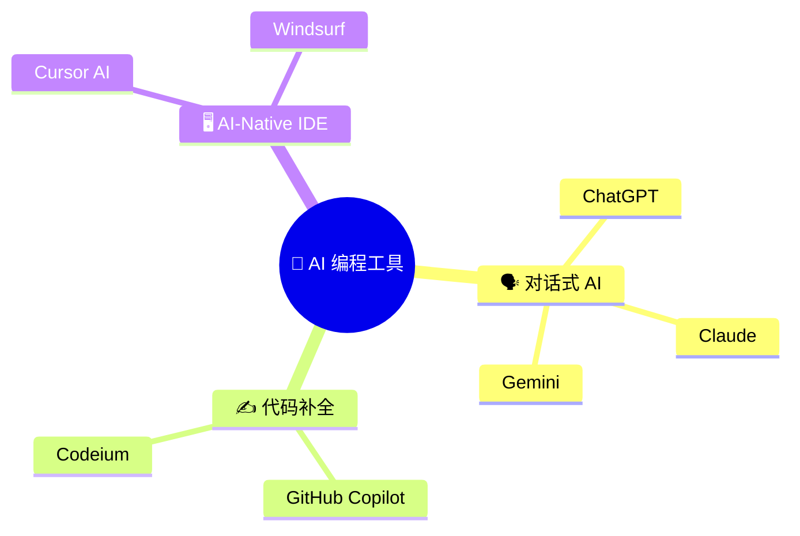
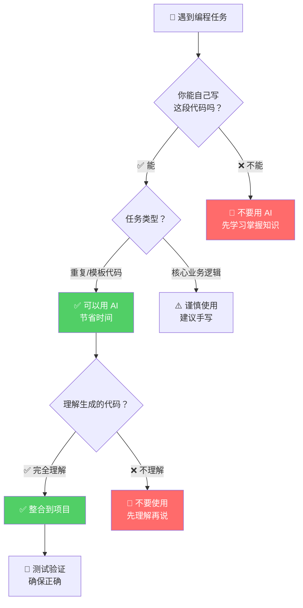
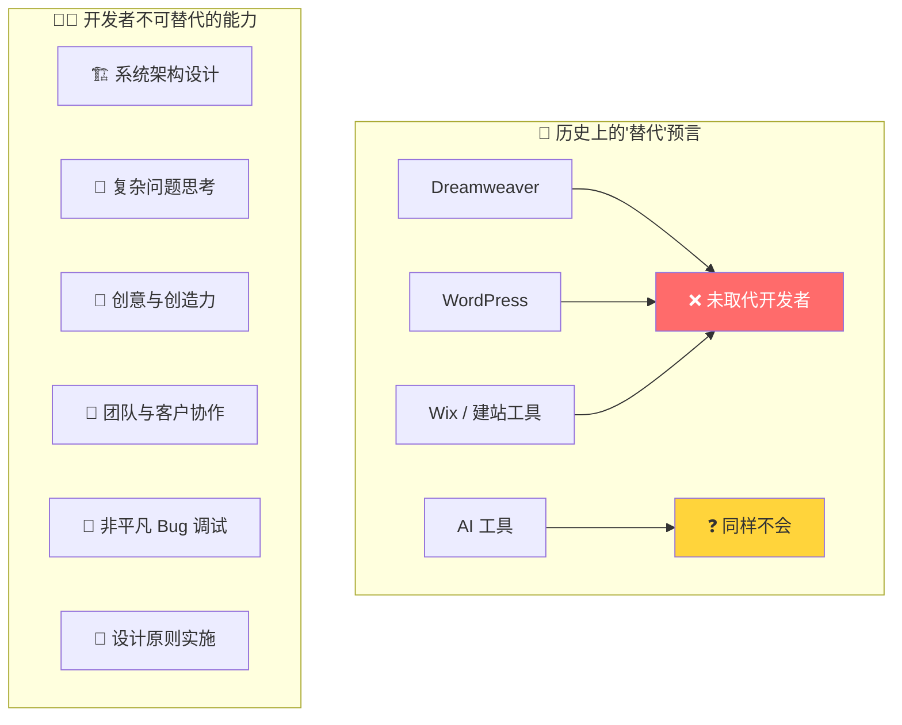
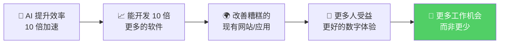
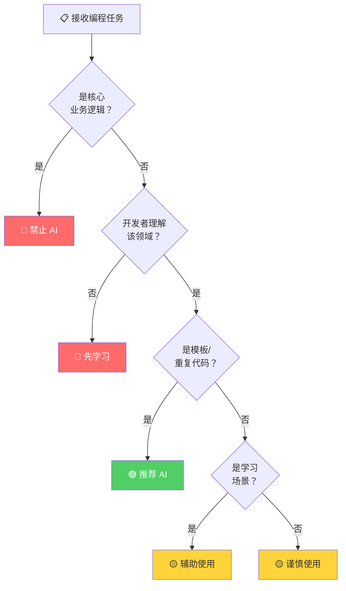

# AI 工具的崛起（ChatGPT、Copilot、Cursor AI 等）

> 📺 来源：013 The Rise of AI Tools (ChatGPT, Copilot, Cursor AI, etc.).en.srt
> 📂 章节：第 05 章

## 📌 知识脉络
- **前置知识**：基本的编程概念与开发环境搭建、问题解决思维（第 007 节）
- **后续扩展**：使用 AI 解决编程挑战（第 014 节）、实际编码实践中的 AI 辅助工作流

## 🎯 概述
本节课探讨了 AI 工具（如 ChatGPT、GitHub Copilot、Cursor AI 等）在 Web 开发领域的崛起。Jonas 从实用主义角度出发，阐明了 **何时该用 AI**、**如何正确使用 AI**、以及 **AI 是否会取代开发者** 三大核心问题，帮助初学者建立对 AI 辅助编程的正确认知。

## 核心知识点

### 1. AI 编程工具全景图

> 🧩 **生活类比**：AI 编程工具就像厨房里的各种电器——搅拌机、烤箱、洗碗机。它们能大幅提高效率，但你仍然需要一位厨师来决定做什么菜、怎么搭配食材、怎么调味。电器替代不了厨师的创意和判断力。

当前主流的 AI 编程工具主要分为三大类：



| 类型 | 代表工具 | 使用方式 | 适合场景 |
|------|---------|---------|---------|
| 对话式 AI | ChatGPT、Claude | 问答交互，粘贴代码分析 | 学习概念、调试理解 |
| 代码补全 | GitHub Copilot | 编辑器内实时建议 | 加速重复编码 |
| AI-Native IDE | Cursor AI | 集成在编辑器中 | 全流程 AI 辅助开发 |

**🔍 执行追踪：AI 工具的典型使用流程**

```
步骤 1: 开发者遇到编程问题 → 思考解决方案
步骤 2: 心中已有大致思路   → 向 AI 描述需求
步骤 3: AI 生成代码建议    → 开发者审查代码
步骤 4: 确认代码正确且理解 → 整合进项目
步骤 5: 测试验证功能       → 完成任务
```

> 💡 **记忆口诀**：**「先想后问，审后再用」**——先自己思考，再问 AI；审查通过后，才能使用。

---

### 2. AI 使用的黄金法则：何时该用，何时不该用

> 🧩 **生活类比**：使用 AI 就像使用计算器学数学。如果你连基本的加减乘除原理都不懂，直接用计算器只会让你永远学不会。但如果你已经掌握了原理，用计算器来加速计算则完全合理。

Jonas 提出了清晰的 AI 使用指南：



**核心原则总结：**

| 原则 | 说明 | 示例 |
|------|------|------|
| 🟢 能写才用 | 只在你**已经能自己实现**的情况下使用 AI | 你知道需要 `for` 循环遍历数组，让 AI 帮你写出来 |
| 🟢 理解才用 | 必须**完全理解**生成的代码 | 逐行审查 AI 代码，确认逻辑正确 |
| 🟢 验证才用 | 必须确保代码 **100% 正确** | 运行测试，检查边界情况 |
| 🔴 学习阶段慎用 | 初学者不应依赖 AI 跳过学习 | 先手写代码掌握基础，再用 AI 加速 |
| 🔴 核心逻辑不用 | 关键业务逻辑最好自己写 | 支付系统、用户认证等不要让 AI 代劳 |

> 💡 **记忆口诀**：**「AI 是助手，不是替身」**——AI 帮你跑得更快，但方向必须你自己选。

---

### 3. AI 的正确使用场景

> 🧩 **生活类比**：AI 就像一个非常聪明的实习生。你可以让它帮你整理文件、查找资料、起草初稿，但最终的决策和质量把控必须由你来负责。

AI 工具最适合的两大使用场景：

**场景一：加速重复性任务**

```js {runnable} {title="boilerplate_example.js"}
// ✅ 适合 AI 的场景：生成模板代码
// 比如创建一个标准的表单验证函数框架

function validateForm(formData) {
  const errors = {};

  // 检查用户名
  if (!formData.username || formData.username.trim() === '') {
    errors.username = '用户名不能为空';
  }

  // 检查邮箱格式
  if (!formData.email || !formData.email.includes('@')) {
    errors.email = '请输入有效的邮箱地址';
  }

  // 检查密码长度
  if (!formData.password || formData.password.length < 8) {
    errors.password = '密码至少需要 8 个字符';
  }

  return {
    isValid: Object.keys(errors).length === 0,
    errors,
  };
}

// 测试
const testData = {
  username: 'Jonas',
  email: 'jonas@example.com',
  password: '12345678',
};

console.log(validateForm(testData));
// { isValid: true, errors: {} }
```

**场景二：辅助学习**


---

### 4. AI 不会取代开发者

> 🧩 **生活类比**：历史上，自动取款机（ATM）出现时，人们预言银行柜员会消失。结果呢？银行反而开了更多分支机构，柜员转向了更复杂的客户服务。AI 对开发者的影响也类似——它改变了工作内容，但不会消灭岗位。

Jonas 给出了几个关键论点：



**📊 AI vs 人类开发者能力对比：**

| 维度 | AI 表现 | 人类开发者 |
|------|---------|-----------|
| 模板/重复代码 | ⭐⭐⭐⭐⭐ 极强 | ⭐⭐ 耗时 |
| 系统架构设计 | ⭐⭐ 有限 | ⭐⭐⭐⭐⭐ 核心优势 |
| 复杂调试 | ⭐⭐ 容易幻觉 | ⭐⭐⭐⭐ 经验驱动 |
| 创造性方案 | ⭐⭐⭐ 受限于训练数据 | ⭐⭐⭐⭐⭐ 灵感无限 |
| 客户沟通协作 | ⭐ 无法胜任 | ⭐⭐⭐⭐⭐ 不可替代 |
| 代码质量判断 | ⭐⭐⭐ 部分场景 | ⭐⭐⭐⭐⭐ 全局把控 |

Jonas 特别指出 AI 的一个致命弱点：

> **AI 在调试跨多个函数/文件的非平凡问题时，经常「幻觉」出看似合理但完全无效的解决方案，甚至会让代码越改越糟。**

---

### 5. AI 时代的积极展望

> 🧩 **生活类比**：如果说以前每个工人一天能砌 100 块砖，挖掘机出现后一天能挖 1000 块的量。结果不是工人失业了，而是我们建了更多更好的建筑。AI 对软件开发的作用也是如此。



**核心观点：**
- 当前世界需要的软件**远超**人类开发者的产能
- AI 帮助自动化无聊的部分，让开发者**专注于真正重要的事**
- 学习编程培养的**逻辑和推理能力**在未来只会更加重要

---

## 🛠️ 代码实战与真实场景

> **💼 业务场景**：你是一名初级前端开发者，团队正在讨论是否引入 AI 工具提升效率。你需要制定一个 AI 工具使用策略文档，明确哪些场景推荐使用 AI、哪些场景禁止使用。

```js {runnable} {title="ai_usage_strategy.js"}
// AI 工具使用策略评估器
// 根据任务特征判断是否适合使用 AI 辅助

function evaluateAIUsage(task) {
  const result = {
    taskName: task.name,
    recommendation: '',
    reason: '',
    riskLevel: '',
  };

  // 规则 1：核心业务逻辑 —— 禁止使用 AI
  if (task.isCoreLogic) {
    result.recommendation = '🔴 禁止使用 AI';
    result.reason = '核心业务逻辑需要开发者完全掌控';
    result.riskLevel = '高';
    return result;
  }

  // 规则 2：开发者不理解该领域 —— 禁止使用
  if (!task.developerUnderstands) {
    result.recommendation = '🔴 禁止使用 AI';
    result.reason = '先学习掌握相关知识再考虑使用 AI';
    result.riskLevel = '高';
    return result;
  }

  // 规则 3：模板/重复代码 —— 推荐使用
  if (task.isBoilerplate) {
    result.recommendation = '🟢 推荐使用 AI';
    result.reason = '节省重复编码时间，但需审查';
    result.riskLevel = '低';
    return result;
  }

  // 规则 4：学习新技术 —— 可辅助使用
  if (task.isLearning) {
    result.recommendation = '🟡 辅助使用 AI';
    result.reason = '用于提问学习，但必须自己动手实践';
    result.riskLevel = '中';
    return result;
  }

  // 默认：谨慎使用
  result.recommendation = '🟡 谨慎使用 AI';
  result.reason = '需确认理解代码后方可整合';
  result.riskLevel = '中';
  return result;
}

// 测试不同场景
const tasks = [
  { name: '生成表单验证模板', isCoreLogic: false, developerUnderstands: true, isBoilerplate: true, isLearning: false },
  { name: '实现支付系统加密', isCoreLogic: true, developerUnderstands: true, isBoilerplate: false, isLearning: false },
  { name: '学习 Promise 概念', isCoreLogic: false, developerUnderstands: false, isBoilerplate: false, isLearning: true },
  { name: '编写 CSS 布局代码', isCoreLogic: false, developerUnderstands: true, isBoilerplate: true, isLearning: false },
];

tasks.forEach(task => {
  const result = evaluateAIUsage(task);
  console.log(`📋 ${result.taskName}`);
  console.log(`   ${result.recommendation}`);
  console.log(`   原因：${result.reason}`);
  console.log(`   风险等级：${result.riskLevel}`);
  console.log('---');
});
```



**📊 输入输出示例：**

| 任务 | 核心逻辑？ | 开发者理解？ | 重复代码？ | 推荐 |
|------|:---------:|:-----------:|:---------:|------|
| 生成表单验证模板 | ❌ | ✅ | ✅ | 🟢 推荐使用 AI |
| 实现支付系统加密 | ✅ | ✅ | ❌ | 🔴 禁止使用 AI |
| 学习 Promise 概念 | ❌ | ❌ | ❌ | 🔴 先学习掌握 |
| 编写 CSS 布局代码 | ❌ | ✅ | ✅ | 🟢 推荐使用 AI |

## 💡 关键要点
- ✅ AI 是**辅助工具**，不是替代品——它帮助你更快完成任务，但不能替代你的思考
- ✅ **只在你已经能自己实现的情况下**使用 AI，否则你永远无法成长
- ✅ 始终**审查、理解并验证** AI 生成的代码，再整合到项目中
- ✅ **核心业务逻辑**（如支付、认证）应避免使用 AI，由开发者手动编写
- ✅ 学习编程培养的**逻辑思维和推理能力**是 AI 无法替代的，且在未来更加重要

## ⚠️ 常见误区
- ⚠️ **误区 1**：「AI 这么厉害，我直接用它写的代码就好了」——AI 生成的代码**经常有 Bug**，且未必是最优解。不理解的代码一旦出错，你根本无法修复。
- ⚠️ **误区 2**：「AI 要取代开发者了，学编程没用了」——历史上 Dreamweaver、WordPress、Wix 等工具都曾被预言将取代开发者，但从未实现。AI 改变的是**工作内容**，而非消灭岗位。
- ⚠️ **误区 3**：「初学者应该尽早使用 AI 来加速学习」——在基础阶段依赖 AI 会导致你**跳过关键的思维训练**，形成无法独立编程的依赖心理。

## 🐛 报错实验室

> 主动展示 AI 使用不当可能导致的问题

**❌ 错误做法：盲目复制 AI 代码**
```js
// AI 建议的代码（看似正确，实际有隐患）
function isAdult(age) {
  return age >= 18; // AI 没有处理非数字输入
}

// 当传入意外输入时
console.log(isAdult("18"));     // true（字符串和数字比较，意外通过）
console.log(isAdult(undefined)); // false（没有报错提示）
console.log(isAdult(null));      // false（静默失败，没有任何警告）
```

**浏览器报错：**
```
无报错！这就是最危险的地方——代码静默产生错误结果
```

**🔑 解读**：AI 生成的代码往往只考虑「正常路径（Happy Path）」，忽略了边界情况和输入校验。如果你不审查，这些**隐性 Bug** 会潜伏在代码中，直到生产环境出问题才被发现。

**✅ 正确做法：审查后补充防御性代码**
```js
function isAdult(age) {
  // 防御性校验：确保输入是有效数字
  if (typeof age !== 'number' || Number.isNaN(age)) {
    throw new TypeError(`期望数字类型，收到 ${typeof age}: ${age}`);
  }
  if (age < 0 || age > 150) {
    throw new RangeError(`年龄超出合理范围: ${age}`);
  }
  return age >= 18;
}
```

---

## 📖 词汇速查表 (Cheat Sheet)

| 中文术语 | 英文术语 | 简明释义 | 相关概念 | 📚 官方文档 |
|---------|---------|---------|---------|-----------|
| 人工智能 | Artificial Intelligence (AI) | 模拟人类智能的计算机系统 | 机器学习、深度学习 | [MDN - AI](https://developer.mozilla.org/en-US/docs/Glossary/AI) |
| 大语言模型 | Large Language Model (LLM) | 通过大量文本训练的 AI 模型 | ChatGPT、Claude | — |
| 代码补全 | Code Completion | IDE 中自动建议代码片段 | Copilot、IntelliSense | — |
| 模板代码 | Boilerplate Code | 项目中重复出现的标准代码结构 | 表单验证、CRUD 操作 | — |
| 幻觉 | Hallucination | AI 生成看似合理但实际错误的内容 | 错误调试建议 | — |
| 核心业务逻辑 | Core Business Logic | 应用中最关键的功能实现 | 支付、认证、数据处理 | — |
| 防御性编程 | Defensive Programming | 预防性地处理异常输入和边界情况 | 输入校验、类型检查 | [MDN - TypeError](https://developer.mozilla.org/zh-CN/docs/Web/JavaScript/Reference/Global_Objects/TypeError) |

---

## 🧪 学习验证

### 📝 动手练习

**练习 1：创建 AI 使用决策函数**

编写一个函数，接收任务描述对象，返回是否推荐使用 AI 辅助的建议。

```js {runnable} {title="exercise1.js"}
// 创建一个 shouldUseAI 函数
// 参数：{ complexity: 'low'|'medium'|'high', isRepetitive: boolean, developerKnows: boolean }
// 返回一个包含 recommend（布尔值）和 reason（字符串）的对象

// 在这里写你的代码
```

<details><summary>💡 参考答案</summary>

```js
function shouldUseAI(task) {
  // 高复杂度且是核心逻辑 → 不推荐
  if (task.complexity === 'high' && !task.isRepetitive) {
    return { recommend: false, reason: '高复杂度非重复任务，建议手动编写' };
  }

  // 开发者不理解该领域 → 不推荐
  if (!task.developerKnows) {
    return { recommend: false, reason: '先学习掌握相关知识' };
  }

  // 重复性低复杂度任务 → 推荐
  if (task.isRepetitive && task.complexity === 'low') {
    return { recommend: true, reason: '重复性模板任务，AI 可显著提效' };
  }

  // 其他情况 → 可考虑
  return { recommend: true, reason: '可以使用，但需仔细审查生成的代码' };
}

console.log(shouldUseAI({ complexity: 'low', isRepetitive: true, developerKnows: true }));
// { recommend: true, reason: '重复性模板任务，AI 可显著提效' }
```

**解题思路**：根据 Jonas 提出的原则，按优先级排列判断条件——先排除不适合的场景（高复杂度、不理解领域），再识别最适合的场景（重复性低复杂度），最后处理中间情况。

</details>

**练习 2：审查 AI 代码练习**

以下是 AI 生成的一段代码，找出其中的问题并修复。

```js {runnable} {title="exercise2.js"}
// AI 生成的代码：计算数组的平均值
function calculateAverage(numbers) {
  let sum = 0;
  for (let i = 0; i <= numbers.length; i++) {
    sum += numbers[i];
  }
  return sum / numbers.length;
}

// 测试
console.log(calculateAverage([10, 20, 30])); // 应该返回 20
console.log(calculateAverage([])); // 应该怎么处理？
```

<details><summary>💡 参考答案</summary>

```js
function calculateAverage(numbers) {
  // 🐛 修复 1：处理空数组边界情况
  if (!Array.isArray(numbers) || numbers.length === 0) {
    return 0; // 或抛出错误
  }

  let sum = 0;
  // 🐛 修复 2：i <= numbers.length 改为 i < numbers.length
  // 原代码会越界访问 numbers[numbers.length]，得到 undefined
  // undefined + 数字 = NaN，导致结果为 NaN
  for (let i = 0; i < numbers.length; i++) {
    sum += numbers[i];
  }
  return sum / numbers.length;
}

console.log(calculateAverage([10, 20, 30])); // 20  ✅
console.log(calculateAverage([]));            // 0   ✅（不再是 NaN）
```

**解题思路**：AI 代码中有两个典型错误：(1) `<=` 应为 `<`，这是经典的**越界访问（Off-by-one Error）**；(2) 没有处理空数组，会导致除以 0 返回 `NaN`。这正好体现了 Jonas 强调的——AI 代码需要**仔细审查**才能使用。

</details>

### ❓ 理解检测

:::quiz {correct="B"}
**1. 根据 Jonas 的建议，什么情况下可以使用 AI 生成的代码？**
- A) 只要 AI 生成的代码能运行就可以直接使用
- B) 只在你自己也能写出这段代码的情况下，用 AI 来加速
- C) 在学习初期大量使用 AI 可以更快入门
- D) AI 代码可以直接用于核心业务逻辑以提高效率

> **解析**：Jonas 明确指出，AI 代码的使用前提是你**已经具备编写该代码的能力**，AI 只是帮你更快地实现。如果你自己都不知道怎么写，就无法审查和修复 AI 的错误。
:::

:::quiz {correct="C"}
**2. Jonas 认为 AI 最大的弱点是什么？**
- A) 不能生成 JavaScript 代码
- B) 运行速度太慢
- C) 在调试跨文件的复杂问题时容易产生「幻觉」，让代码越改越糟
- D) 不支持现代编程语言

> **解析**：Jonas 通过亲身经历指出，即使是最先进的 AI 模型，在面对**跨多个函数/文件的非平凡调试任务**时，经常会「幻觉」出无效的解决方案，反复修改反而让代码质量持续下降。
:::

:::quiz {correct="A"}
**3. 下列哪个说法最符合 Jonas 对「AI 会取代开发者吗」的回答？**
- A) 不会取代，AI 会帮助开发者更高效地构建更多软件
- B) 会取代，因为 AI 已经能写出完美的代码
- C) 短期内不会，但 5 年内开发者岗位将消失
- D) 只会取代前端开发者，后端开发者是安全的

> **解析**：Jonas 的核心观点是 **AI 将帮助开发者，而非取代开发者**。开发者在系统架构、创意思考、团队协作和复杂调试方面的能力是 AI 无法替代的。AI 反而可能催生更多软件需求，创造更多就业机会。
:::

### 🔧 代码填空

:::fill-blank
// 使用 AI 的黄金法则
const aiUsageRules = {
  // 只在你 ___能自己写___ 这段代码时才用 AI
  prerequisite: 'can write it yourself',
  // 必须完全 ___理解___ 生成的代码
  review: 'understand the code',
  // 确保代码 ___100%___ 正确
  verify: 'ensure correctness',
  // ___核心业务逻辑___ 不应使用 AI
  forbidden: 'core business logic',
};
:::
