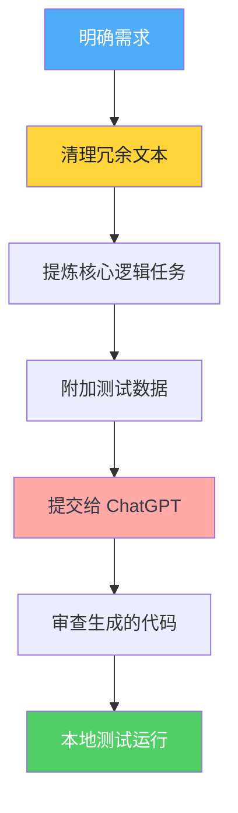

# 用 AI 解决编程挑战

> 📺 来源：014 Solving CHALLENGE #2 With AI.en.srt
> 📂 章节：第 05 章

## 📌 知识脉络
- **前置知识**：数组基础、函数编写、JavaScript 基本语法
- **后续扩展**：在开发中结合 AI 提高效率、阅读并审查他人（或 AI）编写的代码、利用 AI 进行代码查点与测试覆盖

## 🎯 概述
本节课演示了如何使用 AI（如 ChatGPT）来解决实际的编程挑战。Jonas 展示了如何通过提供清洗过的业务逻辑和测试数据，让 ChatGPT 生成 JavaScript 代码，包括核心实现逻辑、特定功能的增强（如将数字索引转换为了具体的星期名称）以及增加错误边界处理，同时也演示了如何利用 AI 解释未曾学过的 JavaScript 内置方法（如 `filter` 和 `reduce`）。

## 核心知识点

### 1. 将业务需求转化为 AI 提示（Prompt）
> 🧩 **生活类比**：给 AI 下达指令就像在餐厅向厨师点菜。如果你只说“给我做顿饭”，厨师可能不明白你的口味；如果你明确告诉他“我要一份西红柿炒鸡蛋，不要放葱，少盐少油，外加一碗白米饭”，厨师就能精准做出你想要的菜肴。

当我们把编程问题交给 AI 时，提示（Prompt）越详细越好。最好包括：
- **函数签名（签名与要求）**：函数名、参数类型、返回值类型。
- **业务逻辑（Business Logic）**：需要计算什么？边界条件是什么？
- **测试数据（Test Data）**：给 AI 提供真实的输入数据示例。

**🔍 执行追踪：AI 提示编写工作流**


> 💡 **记忆口诀**：**「需求清，数据明，AI 代码才靠谱」**——清理杂音、提供明确输入输出，AI 才能精准作答。

---

### 2. 迭代式优化 AI 代码（Iterative Refinement）
> 🧩 **生活类比**：让 AI 写代码就像请裁缝做衣服。第一版可能只是“合适”，你需要通过不断的“试穿”和“修改”（比如衣服稍微收腰、袖子稍微改短），最终才能达到完美的贴合度。

在第一次让 AI 生成代码后，通常我们需要进行后续的迭代以满足确切的业务场景。

**示例迭代过程：**
1. **初版需求**：计算总小时数、平均小时数、是否全职，以及工作最长的是第几天（返回索引）。
2. **第一次迭代（增强可读性）**：AI 返回的 `maxDay` 是一个数字索引（如 `4`），但在实际业务中，我们希望显示为具体的星期名称（如 `"Friday"`）。
3. **第二次迭代（添加防御性编程）**：分析函数需要正好接收 7 天的数据，如果输入少于 7 天或不是数组，应该报错。

_（注：原字幕中演示了 AI 生成了包含 `reduce` 和 `filter` 方法的代码，讲师将这些原本尚未讲授的知识留作后续学习或者让 AI 直接解释）_

---

### 3. 使用 AI 作为学习助手 (Learning Assistant)
当 AI 生成了你尚未学过的代码（如高级数组方法 `filter` 或 `reduce`、或者是陌生的概念如“回调函数 callback”）时，不要盲目复制并跳过。

> **💼 业务场景**：你在看资深工程师的代码，发现了一个不认识的方法，你可以直接把方法名丢给 AI。

你可以这样向 AI 提问：
- *"What does the filter method do?"* (filter 方法是做什么的？)
- *"Why is it useful? Give me a few examples."* (它为什么有用？给我几个例子。)
- *"Explain the filter method in simple terms to a JavaScript beginner."* (用简单的语言向 JavaScript 初学者解释 filter 方法。)

这正是 Jonas 所倡导的核心理念：**不要用 AI 逃避学习，而是用 AI 加速学习**。

---

## 🛠️ 代码实战与真实场景

> **💼 业务场景**：你需要编写一个分析自由职业者一周工作小时数的工具函数 `analyzeWorkWeek`。该函数需要接收一个包含 7 天工作小时数的数组，并计算出总小时数、是否全职（>= 35小时）、平均每天的小时数以及工作最长的是星期几。当提供的数组数据长度不是 7 时，需要抛出明确的错误。

我们在课程中通过向 ChatGPT 提供提示，最终获得了如下（由 AI 生成并经过审查的）代码：

```js {runnable} {title="analyzeWorkWeek.js"}
// 最终迭代后 AI 生成的代码

function analyzeWorkWeek(dailyHours) {
  // 1. 防御性编程：检查是否为数组且长度正好为 7
  if (!Array.isArray(dailyHours) || dailyHours.length !== 7) {
    throw new Error('Input must be an array of exactly 7 daily work hours.');
  }

  // 2. 将索引映射为实际的工作日名称
  const daysOfWeek = ['Monday', 'Tuesday', 'Wednesday', 'Thursday', 'Friday', 'Saturday', 'Sunday'];

  // 3. 计算总小时数 (使用 reduce，后续章节会深入讲解)
  const totalHours = dailyHours.reduce((sum, hours) => sum + hours, 0);

  // 4. 计算工作天数 (使用 filter 过滤掉工作时间为 0 的天数)
  const daysWorked = dailyHours.filter(hours => hours > 0).length;

  // 5. 计算平均每天的工作时间 (如果有工作)
  const averageHours = daysWorked > 0 ? totalHours / daysWorked : 0;

  // 6. 确定是否全职
  const isFullTime = totalHours >= 35;

  // 7. 寻找工作时间最长的那一天，并获取对应的星期名称
  const maxHours = Math.max(...dailyHours);
  const maxDayIndex = dailyHours.indexOf(maxHours);
  const maxDay = daysOfWeek[maxDayIndex];

  // 8. 返回包含所有信息的对象
  return {
    totalHours,
    averageHours,
    daysWorked,
    isFullTime,
    maxDay
  };
}

// ============== 测试数据 ==============
const testData1 = [7.5, 8, 6.5, 0, 8.5, 4, 0]; 
// 总计 34.5 (非全职), max: 第4号索引(8.5, 星期五)

const testData2 = [7.5, 8, 6.5, 0, 9, 4, 0];
// 作者将 8.5 改为 9 测试全职: 35 (全职)

try {
  console.log("=== 分析测试数据集 1 ===");
  console.log(analyzeWorkWeek(testData1));
  
  console.log("\n=== 分析测试数据集 2 (全职测试) ===");
  console.log(analyzeWorkWeek(testData2));

  console.log("\n=== 分析测试数据集 3 (错误边界测试) ===");
  const badData = [8, 8, 8, 8, 8]; // 只有 5 天
  console.log(analyzeWorkWeek(badData)); // 这里会抛出错误
} catch (error) {
  console.error("❌ 发生错误:", error.message);
}
```

**📊 输入输出示例：**
| 输入 (dailyHours) | 输出 | 说明 |
|------|------|------|
| `[7.5, 8, 6.5, 0, 8.5, 4, 0]` | `{totalHours: 34.5, isFullTime: false, maxDay: 'Friday', ...}` | 总计未满 35 小时，返回 false，最长工作时间是星期五 |
| `[7.5, 8, 6.5, 0, 9, 4, 0]` | `{totalHours: 35, isFullTime: true, maxDay: 'Friday', ...}` | 总计刚好 35 小时，返回 true |
| `[8, 8, 8, 8, 8]` | `Error: Input must be an array of exactly 7...` | 数据长度只有 5，未通过防御性校验 |


## 💡 关键要点
- ✅ **提示的质量决定代码的质量**：不要泛泛而谈，将具体的数据结构要求、核心算法逻辑和期待返回的数据形态详细告诉 AI。
- ✅ **迭代优化是常态**：我们无需一次性想完美。先让 AI 提供一个基座代码，然后再对其进行修改，比如本例中增强 `maxDay` 的可读性以及添加输入验证。
- ✅ **防御性编程至关重要**：我们添加了强制数组长度为 7 的校验逻辑，避免错误的数据污染业务结果，这对提升应用的强健性非常重要。
- ✅ **使用 AI 作为你的导师**：如果你不理解 AI 给出的代码（如 `filter`, `reduce`, callback等），继续追问它，要求其用初学者能懂的话给出例子和解释。
- ✅ **警惕本能依赖**：永远不要为了应付课程的练习挑战而要求 AI 直接给你答案。这违背了学习的初衷。在使用这类工具之前，你必须先自己吃透背后的开发思想。

## ⚠️ 常见误区
- ⚠️ **误区 1**：**直接将未经测试的 AI 代码合并进生产环境**。如果不经过如本文一样的单元测试来比对不同数据集（尤其是错误数据集），隐形 Bug 会引起极其难以排查的问题。
- ⚠️ **误区 2**：**把课程训练挑战当成“工作外包”**。有些学习者会让 AI 代写每一个课后练习。如果这么做，你失去了宝贵的逻辑推理训练时间，最终在面试或者白板手写时将会原形毕露。

## 🐛 报错实验室
> 在上面，当我们传入长度不是 7 的数组时触发了我们手工设定的报错。下面这个报错展示的是如果你试图执行不存在的 AI 未经声明的方法时：

**❌ 错误写法：**
```js
const data = [1, 2, 3];
// 假设你让 AI 写了一个很潮的高级方法，结果你的运行环境不支持，或者你忘记引入相关的工具库或拼错了内置方法名。
const total = data.reduc((sum, val) => sum + val, 0); 
```
**浏览器报错：**
```
Uncaught TypeError: data.reduc is not a function
```
**🔑 解读**：这通常说明你在对不存在的属性（或者原本不包含该方法的对象）发起呼叫。这里是因为将 `reduce` 错拼成了 `reduc`，你需要仔细地审查和重跑测试来排查这类的拼写或者环境类的问题。

---

## 📖 词汇速查表 (Cheat Sheet)
| 中文术语 | 英文术语 | 简明释义 | 速查代码 | 📚 官方文档 |
|---------|---------|---------|---------|-----------|
| 回调函数 | Callback | 被作为实参传入另一函数，并在该外部函数内被调用，用以完成某些任务的函数 | `array.filter(num => num > 0)` | [MDN - Callback function](https://developer.mozilla.org/zh-CN/docs/Glossary/Callback_function) |
| 过滤器 | `filter()` | 创建一个新数组, 其包含通过所提供函数实现的测试的所有元素。 | `arr.filter(el => el !== 0)` | [MDN - Array.prototype.filter()](https://developer.mozilla.org/zh-CN/docs/Web/JavaScript/Reference/Global_Objects/Array/filter) |
| 归约器 / 聚合 | `reduce()` | 对数组中的每个元素执行一个由您提供的 reducer 函数，将其结果汇总为单个返回值 | `arr.reduce((acc, cur) => acc + cur, 0)` | [MDN - Array.prototype.reduce()](https://developer.mozilla.org/zh-CN/docs/Web/JavaScript/Reference/Global_Objects/Array/reduce) |

---

## 🧪 学习验证

### 📝 动手练习

**练习 1：要求 AI （或自己）增加额外的输入校验逻辑**
```js {runnable} {title="exercise1.js"}
// 在原有逻辑上增加一项要求：
// 除了要确保 dailyHours 长度为 7 以外，还需确保里面的每一个元素都必须是 大于等于 0 的数字，否则抛出错误。

function analyzeWorkWeek(dailyHours) {
  // --- 在此写入你的防御校验代码 ---
  
  
  // --------------------------------
  
  return "数据校验通过！";
}

try {
  console.log(analyzeWorkWeek([8, 8, "8", 8, 8, 8, 8])); // 应该报错，"8" 是字符串
  console.log(analyzeWorkWeek([8, 8, -2, 8, 8, 8, 8]));  // 应该报错，-2 不是有效时间
  console.log(analyzeWorkWeek([8, 8, 8, 8, 8, 0, 0]));   // 数据校验通过！
} catch (error) {
  console.error(error.message);
}
```
<details><summary>💡 参考答案</summary>

```js
function analyzeWorkWeek(dailyHours) {
  if (!Array.isArray(dailyHours) || dailyHours.length !== 7) {
    throw new Error('Input must be an array of exactly 7 daily work hours.');
  }
  
  // 遍历每一天的数据，如果存在任意一个非数字，且该数字为小于0或者是 NaN 的情况则抛错
  // 使用了 some 数组方法来检测是否存在违规数据
  const hasInvalidData = dailyHours.some(
     hours => typeof hours !== 'number' || isNaN(hours) || hours < 0
  );
  
  if (hasInvalidData) {
      throw new Error('每项数据必须都是大于或等于 0 的数字！');
  }
  
  return "数据校验通过！";
}
```
**解题思路**：除了在提示词中交代边界条件并利用 AI 完成逻辑外，你自己审查时也可以利用 `typeof` 配合之前讲过的一些运算方法或高级数组方法（未来会深度探讨 `some` 方法）快速完成防御。
</details>

### ❓ 理解检测

:::quiz {correct="C"}
**1. 关于使用 AI 辅助编程，Jonas 的核心建议是什么？**
- A) 我们应当无脑去复制粘贴 AI 为我们重构的所有代码，这样写代码最快。
- B) 在自己学习任何语法前先让 AI 写出来再去理解是最好的捷径。
- C) 用 AI 来加速一些基础性工作，同时在遇到未学过的内容时将 AI 当做导师向其提问来帮助自己学习。
- D) 让教学和课程视频全部都变得不再重要。

> **解析**：视频的核心精神在于，AI 是你的效率工具也是你的私人助教，它并不能替你进行核心学习与内化，必须明确“先懂再用”的设计精神，而且碰到看不懂的高深语法时大胆发问，通过它去解析背后机制。
:::

:::quiz {correct="B"}
**2. 为什么讲师要在二次迭代中向 ChatGPT 要求修改 `maxDay` 逻辑？**
- A) 因为原答案完全无法执行，是彻彻底底的语法错误。
- B) 原来的代码返回了数字索引（如 4），讲师希望返回用户友好的实际文本（如 "Friday"）
- C) 原来的方法执行效率低下，时间复杂度太高。
- D) 需要让 `maxDay` 这个变量兼容所有类型的时区运算。

> **解析**：这就是常说的“对人友好（human-readable）”优化，让程序既要跑得通还要表现得符合使用常识。
:::

:::quiz {correct="C"}
**3. 课程最后是如何处理函数传入长度不足 7 的参数的情况的？**
- A) 抛出异常：`Cannot read property of undefined` 
- B) 任其执行，最后可能出现 `true` 并打印结果。
- C) 要求 AI 在函数顶端强制添加校验逻辑，如果长度非 7 返回自定义错误阻断运行。
- D) 利用递归来填满 7 个位置的数据。

> **解析**：此过程展现了边界错误（Error Boundary）以及防御性编程（Defensive Programming）的最佳实践。程序不仅仅要处理“对的数据（Happy path）”，它有责任正确拒绝“不对的垃圾数据（Bad Data）”。
:::

### 🔧 代码填空

:::fill-blank
// 我们想询问 AI 一个关于方法的概念。你可以这么写 prompt（提示词）：
"What ___does___ the filter method ___do___?
Explain the filter method ___in___ simple terms ___to___ a JavaScript beginner."
:::

### 🎯 章节挑战（仅章节最后一课生成）
> 👏 恭喜你完成了第 05 章！

**终极目标：构建你的工作流**
结合第 05 章（开发者思维）学习的技能，不要光写代码，而是模拟真正的工程师去应对新问题。

1. **构思一个简单工具**：比如“摄氏度与华氏度互转小工具与天气建议”。
2. **拆解并搜索（Google/MDN）**：去查明白数学公式和如何截取小数点后两位的方法。
3. **解决 Bug（Debugging）**：尝试在手写时故意让语法报错或使用断点查看值。
4. **引入 AI 协助（AI Pair-programming）**：尝试直接把该任务扔给 ChatGPT，观察其结果，要求 AI 给代码增加防御性检测并解释你看不懂的部分。
5. **内化精髓**：最后，关闭电脑上所有的参考页面，看看自己能否独立把逻辑顺畅地重写一遍！
