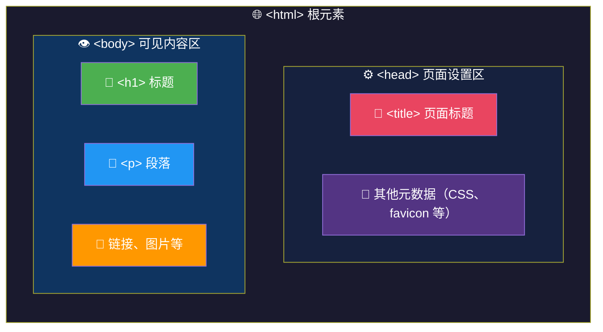
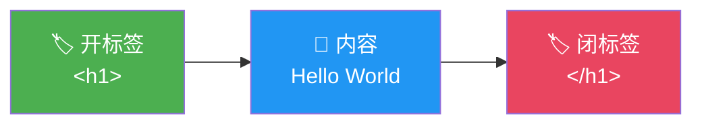
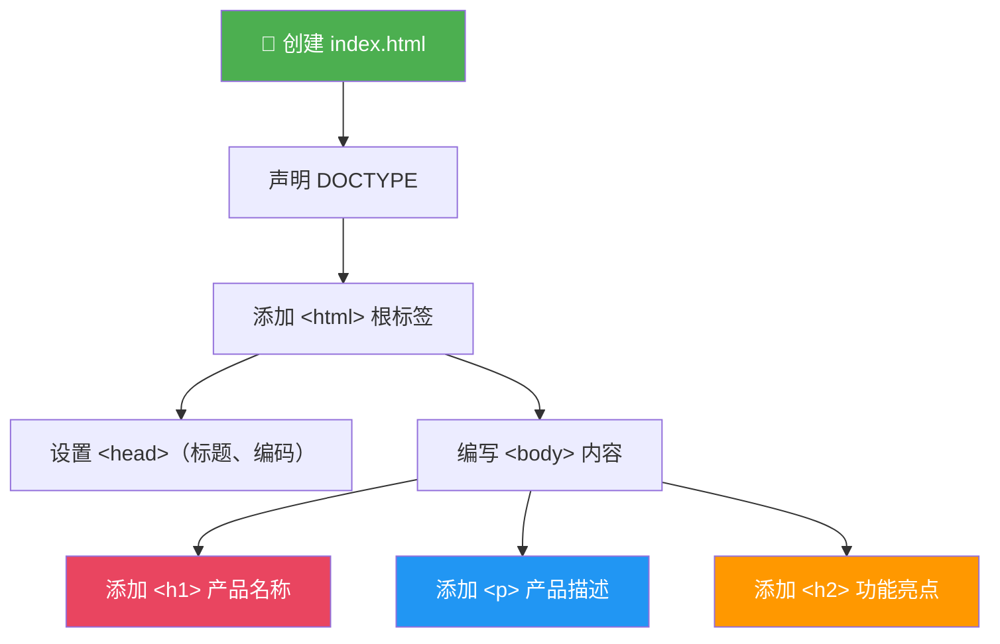

# HTML 基础结构与元素

> 📺 来源：002 Basic HTML Structure and Elements.en.srt
> 📂 章节：第 06 章

## 📌 知识脉络
- **前置知识**：VS Code 编辑器基础操作、文件创建与保存、Live Server 插件使用
- **后续扩展**：HTML 属性/类/ID、CSS 样式、DOM 操作中的元素选取

## 🎯 概述

本节课介绍 HTML（超文本标记语言/HyperText Markup Language）的基本结构。你将学会如何构建一个标准的 HTML 文档骨架，理解元素（Element）由开标签和闭标签组成的语法，以及 `<head>` 和 `<body>` 两大区域的用途区别。通过标题（Heading）和段落（Paragraph）元素，你会亲手写出第一个网页。

## 核心知识点

### 1. HTML 文档的基本骨架

> 🧩 **生活类比**：把 HTML 文档想象成一封正式的信件——信封上的标注（收件人、地址）就像 `<head>`，是给邮局看的"元信息"；而内信纸上你写的正文内容就像 `<body>`，是给读者看的"真正内容"。

HTML 文档的标准结构如下：



**基本代码结构：**

```html
<!DOCTYPE html>
<html lang="en">
<head>
    <meta charset="UTF-8" />
    <meta name="viewport" content="width=device-width, initial-scale=1.0" />
    <title>Learning HTML and CSS</title>  <!-- 浏览器标签页显示的标题 -->
</head>
<body>
    <!-- 这里放用户可见的内容 -->
    <h1>JavaScript is fun, but so is HTML and CSS</h1>
    <p>You can learn JavaScript without HTML and CSS...</p>
</body>
</html>
```

> 💡 **VS Code 快捷技巧**：在空白 HTML 文件中输入 `!` 然后按 `Tab` 键，即可自动生成完整的 HTML5 骨架代码！

**关键结构规则：**

| 区域 | 标签 | 用途 | 是否直接可见 |
|------|------|------|:----------:|
| 文档声明 | `<!DOCTYPE html>` | 声明文档类型为 HTML5 | ❌ |
| 根元素 | `<html>` | 包裹整个页面 | ❌ |
| 头部 | `<head>` | 页面设置（标题、样式、编码） | ❌ |
| 主体 | `<body>` | 所有用户可见内容 | ✅ |

---

### 2. 元素与标签（Elements & Tags）

> 🧩 **生活类比**：HTML 元素就像一对书立（开标签和闭标签），中间夹着的书就是内容。缺少任何一个书立，书就会倒。

HTML 元素由三部分组成：



```html
<!-- 元素 = 开标签 + 内容 + 闭标签 -->
<h1>JavaScript is fun</h1>
<!--  ↑ 开标签   ↑ 内容    ↑ 闭标签（注意 / 斜杠） -->
```

**🔍 执行追踪：** 当浏览器解析 HTML 时的处理过程：

| 步骤 | 浏览器行为 | 结果 |
|:----:|-----------|------|
| ① | 遇到 `<h1>` 开标签 | 创建一个标题元素节点 |
| ② | 读取文本内容 `JavaScript is fun` | 将文本添加为该元素的子节点 |
| ③ | 遇到 `</h1>` 闭标签 | 关闭该元素，应用浏览器默认样式（加粗、大字号） |

---

### 3. 常用 HTML 元素：标题与段落

> 🧩 **生活类比**：标题 `<h1>` ~ `<h6>` 就像报纸版面——头版大标题是 `<h1>`，栏目小标题是 `<h3>`，脚注提示是 `<h6>`。重要性和字号逐级递减。

HTML 提供 6 级标题元素，字号和重要性逐级递减：

```js {runnable} {title="headings_demo.html"}
// 这段代码展示的是 HTML 标题层级（在浏览器中效果更直观）
// 以下用 document.write 模拟输出
document.write('<h1>H1 — 最大的标题（每页只用一个）</h1>');
document.write('<h2>H2 — 二级标题</h2>');
document.write('<h3>H3 — 三级标题</h3>');
document.write('<h6>H6 — 最小的标题（甚至比正文还小）</h6>');
document.write('<p>P — 这是一个段落元素</p>');
```

**📊 标题层级对比：**

| 元素 | 典型用途 | 浏览器默认样式 |
|------|---------|---------------|
| `<h1>` | 页面主标题（每页仅一个） | 最大、加粗 |
| `<h2>` | 章节标题 | 较大、加粗 |
| `<h3>` ~ `<h5>` | 子标题 | 逐渐缩小 |
| `<h6>` | 最小标题 | 比正文 `<p>` 还小 |
| `<p>` | 正文段落 | 正常大小、无加粗 |

> 💡 **记忆口诀**：**H**eading 1~6 = 标题六兄弟，老大 `h1` 最显眼，老六 `h6` 最低调；**P**aragraph = 正文"平民"。

---

## 🛠️ 代码实战与真实场景

> **💼 业务场景**：你是一名前端开发者，需要为公司新产品创建一个落地页（Landing Page）的基本 HTML 结构。



```js {runnable} {title="landing_page.html"}
// 模拟一个简单的产品落地页结构
const htmlStructure = `
<!DOCTYPE html>
<html lang="zh-CN">
<head>
    <meta charset="UTF-8">
    <title>TaskFlow — 智能任务管理</title>
</head>
<body>
    <h1>TaskFlow</h1>
    <p>让团队协作更高效的智能任务管理工具。</p>
    <h2>核心功能</h2>
    <p>自动任务分配、实时进度追踪、智能优先级排序。</p>
    <h2>为什么选择我们？</h2>
    <p>超过 10,000 个团队的信赖之选。</p>
</body>
</html>
`;

console.log('=== HTML 文档结构 ===');
console.log(htmlStructure);
console.log('✅ 这就是一个完整的 HTML5 页面骨架！');
```

**📊 输入输出示例：**

| 编写的 HTML | 浏览器渲染结果 | 说明 |
|------------|--------------|------|
| `<h1>TaskFlow</h1>` | **大号加粗文字** | 页面主标题 |
| `<p>让团队协作更高效...</p>` | 正常大小文字 | 段落内容 |
| `<h2>核心功能</h2>` | **中号加粗文字** | 二级标题 |

## 💡 关键要点
- ✅ 每个 HTML 文档必须有 `<html>`、`<head>`、`<body>` 三层结构
- ✅ `<head>` 存放页面元信息（标题、编码等），`<body>` 存放可见内容
- ✅ 元素由开标签 `<tag>` + 内容 + 闭标签 `</tag>` 三部分组成
- ✅ VS Code 中输入 `! + Tab` 可快速生成 HTML5 骨架
- ✅ `<h1>` ~ `<h6>` 是标题元素，`<p>` 是段落元素

## ⚠️ 常见误区
- ⚠️ **忘记闭标签**：写了 `<h1>Hello` 却漏掉 `</h1>`，虽然浏览器可能"容错渲染"，但这是不规范的行为，在复杂页面中会导致不可预测的布局问题
- ⚠️ **`<head>` 和 `<body>` 混淆**：把 `<title>` 写在 `<body>` 里或把可见内容写在 `<head>` 中。记住：`<head>` = 设置，`<body>` = 内容
- ⚠️ **滥用 `<h1>`**：一个页面应该只有一个 `<h1>` 主标题，多个 `<h1>` 不利于 SEO 和可访问性

## 🐛 报错实验室

**❌ 错误写法：**
```html
<html>
<body>
    <h1>Hello World
    <p>This paragraph has no closing tag
</body>
```
**浏览器行为：**
```
浏览器不会报错（HTML 容错性强），但会产生意外的嵌套关系：
段落文字可能被浏览器当作 <h1> 的一部分来渲染，导致段落也变成大号加粗字体。
```
**🔑 解读**：HTML 不像 JavaScript 会抛出异常，浏览器会尝试"猜测"你的意图进行修复。但这种自动修复往往不符合预期，所以**始终确保标签成对出现**。

---

## 📖 词汇速查表 (Cheat Sheet)

| 中文术语 | 英文术语 | 简明释义 | 速查代码 | 📚 官方文档 |
|---------|---------|---------|---------|-----------|
| 超文本标记语言 | HTML | 描述网页内容结构的标记语言 | `<html>...</html>` | [MDN](https://developer.mozilla.org/zh-CN/docs/Web/HTML) |
| 元素 | Element | 由开标签+内容+闭标签组成的 HTML 单元 | `<p>text</p>` | [MDN](https://developer.mozilla.org/zh-CN/docs/Glossary/Element) |
| 标题 | Heading | 6 级标题元素 h1~h6 | `<h1>Title</h1>` | [MDN](https://developer.mozilla.org/zh-CN/docs/Web/HTML/Element/Heading_Elements) |
| 段落 | Paragraph | 文本段落元素 | `<p>text</p>` | [MDN](https://developer.mozilla.org/zh-CN/docs/Web/HTML/Element/p) |
| 文档类型 | DOCTYPE | 声明 HTML 版本 | `<!DOCTYPE html>` | [MDN](https://developer.mozilla.org/zh-CN/docs/Glossary/Doctype) |

---

## 🧪 学习验证

### 📝 动手练习

**练习 1：创建个人简介页**
```js {runnable} {title="exercise1.html"}
// 请创建一个包含以下内容的 HTML 字符串：
// 1. <h1> 标签显示你的名字
// 2. <p> 标签显示一段自我介绍
// 3. <h2> 标签显示"我的爱好"
// 4. <p> 标签列出你的爱好

// 在下方编写你的代码：
const myPage = `

`;

console.log(myPage);
```
<details><summary>💡 参考答案</summary>

```js
const myPage = `
<!DOCTYPE html>
<html lang="zh-CN">
<head>
    <title>个人简介</title>
</head>
<body>
    <h1>张三</h1>
    <p>我是一名前端开发者，热爱编程和设计。</p>
    <h2>我的爱好</h2>
    <p>编程、阅读、徒步旅行。</p>
</body>
</html>
`;
console.log(myPage);
```
**解题思路**：按照 HTML 标准骨架结构 `html > head + body`，在 `body` 中使用 `<h1>` 作为主标题、`<p>` 写正文、`<h2>` 做子标题。
</details>

**练习 2：修复 HTML 结构错误**
```js {runnable} {title="exercise2.html"}
// 以下 HTML 存在结构错误，请找出并修复
const brokenHTML = `
<html>
<head>
    <h1>这不应该在 head 里</h1>
<body>
    <title>错位的标题</title>
    <p>缺少闭标签的段落
    <h2>另一个标题</h3>
</body>
`;

// 请写出修复后的正确版本：
const fixedHTML = `

`;

console.log('修复后的 HTML：');
console.log(fixedHTML);
```
<details><summary>💡 参考答案</summary>

```js
const fixedHTML = `
<!DOCTYPE html>
<html lang="zh-CN">
<head>
    <title>正确的标题</title>
</head>
<body>
    <h1>这应该在 body 里</h1>
    <p>闭合的段落</p>
    <h2>另一个标题</h2>
</body>
</html>
`;
console.log('修复后的 HTML：');
console.log(fixedHTML);
```
**解题思路**：
1. `<h1>` 是可见内容，应在 `<body>` 而非 `<head>` 中
2. `<title>` 是元信息，应在 `<head>` 中
3. `<p>` 缺少闭标签 `</p>`
4. `<h2>` 与 `</h3>` 不匹配，应使用 `</h2>`
5. 缺少 `</html>` 和 `<!DOCTYPE html>`
</details>

### ❓ 理解检测

:::quiz {correct="B"}
**1. `<head>` 元素中应该放什么内容？**
- A) 用户可以在网页上看到的文字和图片
- B) 页面设置信息，如标题、字符编码、CSS 样式链接
- C) JavaScript 的 console.log 输出
- D) 只能放 `<h1>` 标题

> **解析**：`<head>` 是页面的"幕后设置区"，存放 `<title>`（标签页标题）、`<meta>`（字符编码）、CSS 链接等元信息。所有用户可见的内容应该放在 `<body>` 中。
:::

:::quiz {correct="C"}
**2. 以下哪个是正确的 HTML 元素写法？**
- A) `<p>Hello World`
- B) `<p>Hello World<p>`
- C) `<p>Hello World</p>`
- D) `</p>Hello World<p>`

> **解析**：完整的 HTML 元素由**开标签** `<p>` + **内容** + **闭标签** `</p>` 组成。闭标签必须带有 `/` 斜杠。选项 A 缺少闭标签，B 的第二个标签缺少 `/`，D 的开闭标签顺序颠倒。
:::

:::quiz {correct="A"}
**3. 如何在 VS Code 中快速生成 HTML5 基础结构？**
- A) 输入 `!` 然后按 Tab 键
- B) 输入 `html5` 然后按 Enter
- C) 使用快捷键 Ctrl + H
- D) 右键选择 "Generate HTML"

> **解析**：VS Code 内置 Emmet 快捷指令，输入 `!` 后按 `Tab` 会自动展开为完整的 HTML5 文档骨架，包含 `<!DOCTYPE html>`、`<html>`、`<head>` 和 `<body>` 等必要结构。
:::

### 🔧 代码填空

:::fill-blank
<!DOCTYPE ___html___>
<___html___  lang="en">
<head>
    <___title___>My Page</___title___>
</head>
<___body___>
    <h1>Hello World</h1>
</___body___>
</html>
:::
