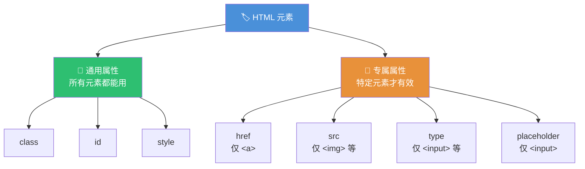
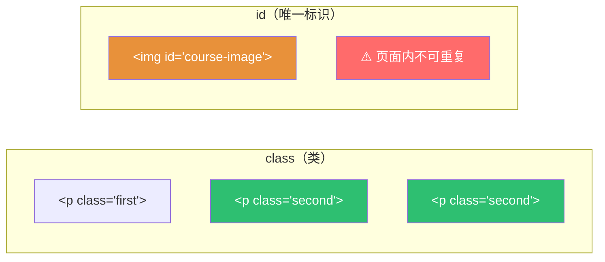
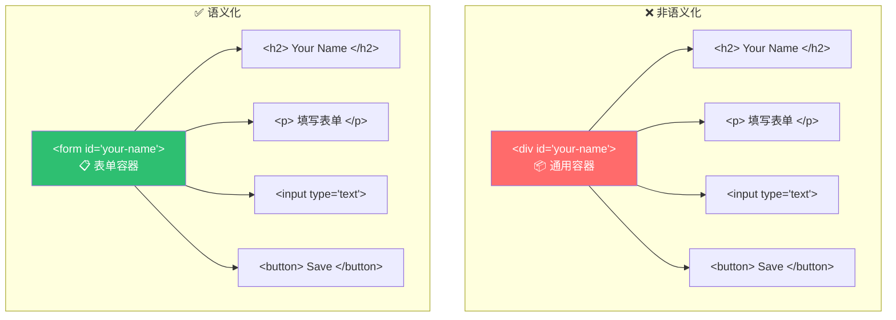
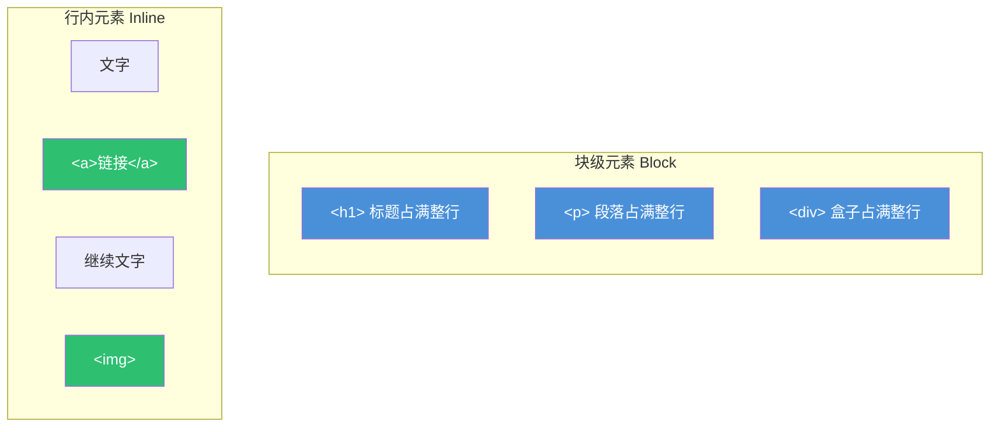
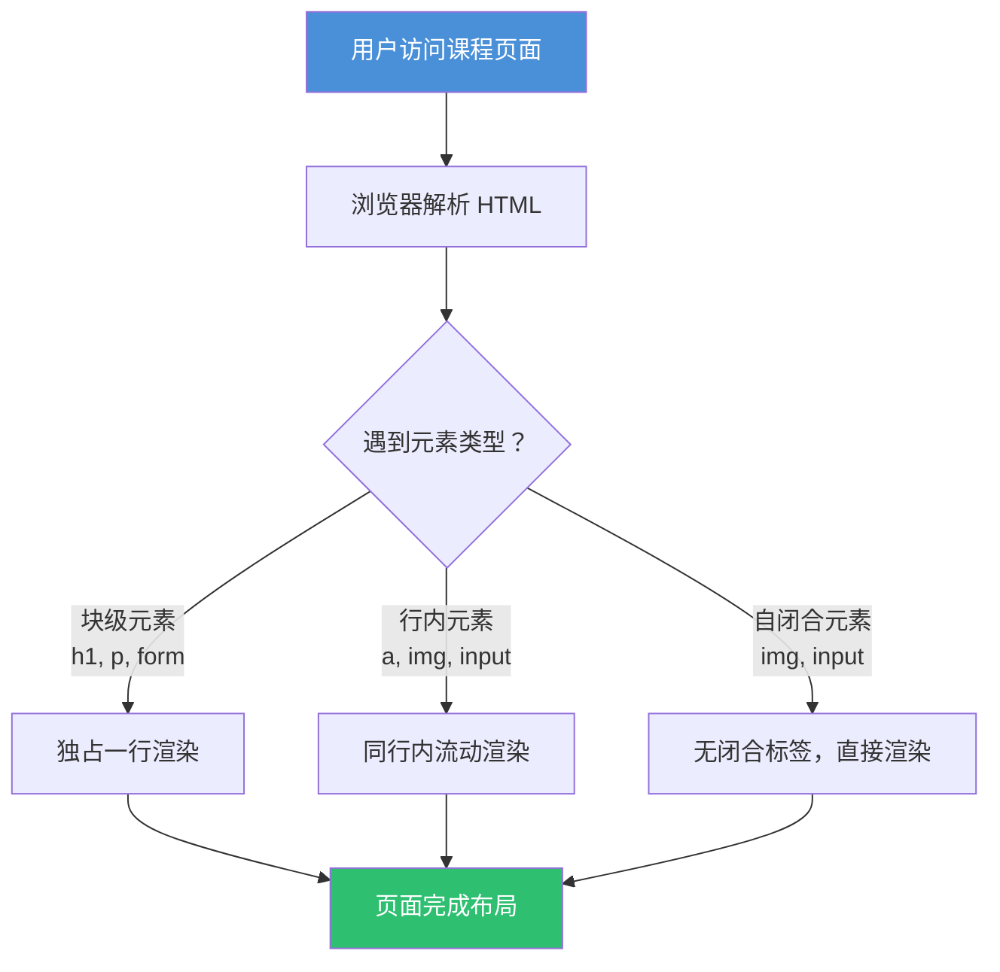

# HTML 属性、类与 ID

> 📺 来源：003 Attributes, Classes and IDs.en.srt
> 📂 章节：第 06 章

## 📌 知识脉络
- **前置知识**：HTML 基本结构与元素（标签、嵌套）、块级元素与行内元素的区别
- **后续扩展**：CSS 选择器与样式应用、JavaScript DOM 操作中的元素选取

## 🎯 概述

本节课深入讲解 HTML 属性（Attributes）的用法，包括特定元素的专属属性（如 `href`、`src`）以及所有元素通用的 **类（Class）** 和 **ID** 属性。同时介绍表单元素（`<input>`、`<button>`、`<form>`）的创建，以及语义化 HTML 的重要性。

## 核心知识点

### 1. HTML 属性（Attributes）

> 🧩 **生活类比**：把 HTML 元素想象成一本书，标签名是书名，而属性就是书的「ISBN、作者、出版社」等附加信息——它们**描述和定制**这本书的特性。

HTML 属性用于为元素提供额外信息或配置其行为。不同元素支持不同的属性。



#### 锚点元素 `<a>` 与 `href` 属性

`<a>` 是一个**行内元素（Inline Element）**，它不会独占一行，而是与周围文本在同一行内流动。

```html
<p>You can learn more about it <a href="https://www.udemy.com">on Udemy</a>.</p>
```

> 💡 **记忆口诀**：**行内不换行、块级占满行** —— `<a>` 是行内元素，`<h2>` 是块级元素。

#### 图片元素 `` 与 `src` 属性

`` 是**自闭合元素（Self-closing Element）**，没有闭合标签，因为图片不需要包裹"文字内容"。

```html
<!-- ① 使用网络图片地址 -->


<!-- ② 使用本地文件路径 -->

```

> ⚠️ 注意：末尾的 `/` 不是必须的，`` 和 `` 效果相同。

**🔍 执行追踪：属性匹配关系**

| 步骤 | 操作 | 结果 |
|------|------|------|
| ① | 在 `<a>` 上使用 `href` | ✅ 有效，创建超链接 |
| ② | 在 `` 上使用 `src` | ✅ 有效，显示图片 |
| ③ | 在 `` 上使用 `href` | ❌ 无效，`href` 不是 `` 的属性 |
| ④ | 在 `<a>` 上使用 `src` | ❌ 无效，`src` 不是 `<a>` 的属性 |

---

### 2. 类（Class）与 ID

> 🧩 **生活类比**：**class** 就像学校的「班级」——可以有很多学生属于同一个班级；**id** 就像「身份证号」——每个人独一无二，不能重复。

类和 ID 是两种通用属性，用于给 HTML 元素起"名字"，以便在 CSS 中选取并设置样式，或在 JavaScript 中选取并操作它们。



```html
<!-- ① 使用 class —— 可复用 -->
<p class="first">第一段文字</p>
<p class="second">第二段文字</p>

<!-- ② 使用 id —— 必须唯一 -->

```

**📊 Class vs ID 对比：**

| 特征 | Class（类） | ID（唯一标识） |
|------|------------|--------------|
| 语法 | `class="name"` | `id="name"` |
| 可重复 | ✅ 可以在多个元素上使用相同 class | ❌ 同一页面内必须唯一 |
| CSS 选择器 | `.name` | `#name` |
| 实际使用频率 | ⭐⭐⭐ 非常高 | ⭐ 较少使用 |
| 最佳实践 | **推荐使用** | 只在确实需要唯一标识时使用 |

> 💡 **记忆口诀**：**class 多用，id 少碰** —— 实际开发中几乎总是使用 class 来选取和样式化元素。

**CSS 命名约定**：在 CSS 和 HTML 中使用**短横线命名法（kebab-case）**，而在 JavaScript 中使用**驼峰命名法（camelCase）**：

```js {runnable} {title="naming_conventions.js"}
// CSS / HTML 中的命名约定（短横线分隔）
// class="course-image"
// id="your-name"

// JavaScript 中的命名约定（驼峰式）
const courseImage = document.getElementById('course-image');
const yourName = document.getElementById('your-name');

console.log('CSS 用短横线：course-image');
console.log('JS 用驼峰式：courseImage');
```

---

### 3. 表单元素与语义化 HTML

> 🧩 **生活类比**：`<div>` 就像一个**没有标签的纯白纸箱**，里面装什么都行但你不知道它是什么；`<form>` 就像一个**标注了「申请表」的文件夹**——内容一目了然。

#### 通用盒子 `<div>` vs 语义化容器 `<form>`



#### 表单核心元素

```html
<form id="your-name">
  <h2>Your Name</h2>
  <p>Please fill in this form</p>
  
  <!-- ① input：自闭合元素，type 指定输入类型 -->
  <input type="text" placeholder="Your name" />
  
  <!-- ② button：有闭合标签，因为需要包裹按钮文字 -->
  <button>Save</button>
</form>
```

**`<input>` 的 `type` 属性可选值：**

| type 值 | 用途 | 示例 |
|---------|------|------|
| `text` | 普通文本输入 | 用户名、地址 |
| `email` | 邮箱输入（带格式校验） | 注册邮箱 |
| `password` | 密码输入（内容隐藏） | 登录密码 |
| `checkbox` | 复选框 | 同意协议 |
| `button` | 按钮 | 提交动作 |
| `file` | 文件上传 | 头像上传 |

**📊 输入输出示例：**

| 代码 | 页面表现 | 说明 |
|------|---------|------|
| `<input type="text" placeholder="名字">` | 显示带灰色提示文字的输入框 | `placeholder` 是提示文本 |
| `<input type="email">` | 提交时自动校验邮箱格式 | 浏览器内置验证 |
| `<button>Save</button>` | 显示可点击按钮 | 需要 JS 才能实现功能 |

> **💼 业务场景**：电商网站的注册页面，需要收集用户的姓名、邮箱和密码，就是用 `<form>` 配合不同 `type` 的 `<input>` 来构建的。

---

### 4. 行内元素 vs 块级元素

> 🧩 **生活类比**：**块级元素**像**独立成段的标题**，自动占满整行并换行显示；**行内元素**像**句子中的加粗词语**，和前后文字在同一行内流动。



---

## 🛠️ 代码实战与真实场景

> **💼 业务场景**：为一个在线课程平台搭建课程介绍页面，包含课程图片、描述段落和用户注册表单。

```html {runnable} {title="course_page.html"}
<!DOCTYPE html>
<html>
<head>
  <title>课程介绍页</title>
</head>
<body>
  <h1>JavaScript 完全指南</h1>

  <!-- 课程图片，使用 id 唯一标识 -->
  

  <!-- 使用 class 区分不同段落 -->
  <p class="intro">这是一门面向零基础学习者的 JavaScript 课程。</p>
  <p class="highlight">掌握现代 JS，从变量到异步编程一网打尽。</p>

  <!-- 语义化表单 -->
  <form id="register-form">
    <h2>立即注册</h2>
    <p>请填写以下信息开始学习：</p>
    <input type="text" placeholder="你的姓名" />
    <input type="email" placeholder="电子邮箱" />
    <button>开始学习</button>
  </form>
</body>
</html>
```



**📊 输入输出示例：**

| 输入（HTML 代码） | 输出（页面效果） | 说明 |
|------------------|-----------------|------|
| `<p class="intro">文本</p>` | 一个带 `intro` 类名的段落 | 可用 `.intro` 在 CSS 中选中 |
| `` | 显示课程横幅图片 | 可用 `#course-banner` 唯一选中 |
| `<input type="email" placeholder="邮箱">` | 带提示文字的邮箱输入框 | 提交时自动校验格式 |

## 💡 关键要点

- ✅ HTML 属性为元素提供附加信息，不同元素有不同的专属属性（`href` 属于 `<a>`，`src` 属于 ``）
- ✅ `class` 可以在多个元素上复用，`id` 在同一页面内必须唯一
- ✅ 实际开发中**优先使用 class** 来选取和样式化元素，很少使用 id
- ✅ 使用语义化标签（如 `<form>` 代替 `<div>`）让页面结构更有意义，利于 SEO 和可访问性
- ✅ `` 和 `<input>` 是自闭合元素，不需要闭合标签

## ⚠️ 常见误区

- ⚠️ **误区 1**：在同一页面中多次使用同一个 `id`。**正确做法**：`id` 必须唯一，要复用请使用 `class`。
- ⚠️ **误区 2**：把 `href` 用在 `` 上或把 `src` 用在 `<a>` 上。**正确做法**：属性要和对应的元素匹配。
- ⚠️ **误区 3**：用 `<div>` 包裹一切。**正确做法**：使用语义化标签（`<form>`、`<nav>`、`<header>`、`<main>` 等），只在没有合适语义标签时才用 `<div>`。

## 🐛 报错实验室

> 主动展示错误写法及浏览器行为，帮助你理解常见问题

**❌ 错误写法：重复使用同一 id**
```html
<p id="intro">第一段</p>
<p id="intro">第二段</p>  <!-- ❌ id 重复 -->
```
**浏览器行为：**
```
HTML 验证器警告：Duplicate ID "intro"
JavaScript 中 document.getElementById('intro') 只返回第一个匹配元素，
第二个元素将无法被正确选取。
```
**🔑 解读**：虽然浏览器不会直接报错崩溃，但重复 id 会导致 JavaScript 选取行为不可预测，且不符合 HTML 规范。W3C 验证器会发出警告。

---

**❌ 错误写法：给 `` 添加闭合标签并包裹内容**
```html
这是图片描述</img>   <!-- ❌ img 不能有子内容 -->
```
**浏览器行为：**
```
浏览器会忽略 </img>，"这是图片描述" 文字会显示在图片旁边，
但不会成为图片的一部分。
```
**🔑 解读**：`` 是**空元素（Void Element）**，不能包含子内容。如果需要给图片添加说明文字，应使用 `<figure>` 和 `<figcaption>`。

---

## 📖 词汇速查表 (Cheat Sheet)

| 中文术语 | 英文术语 | 简明释义 | 速查代码 | 📚 官方文档 |
|---------|---------|---------|---------|-----------|
| 属性 | Attribute | 添加到元素开标签中的额外信息 | `<a href="...">`| [MDN](https://developer.mozilla.org/zh-CN/docs/Web/HTML/Attributes) |
| 类 | Class | 可复用的元素标识符，用于 CSS 选取 | `<p class="first">` | [MDN](https://developer.mozilla.org/zh-CN/docs/Web/HTML/Global_attributes/class) |
| ID | ID | 唯一的元素标识符 | `` | [MDN](https://developer.mozilla.org/zh-CN/docs/Web/HTML/Global_attributes/id) |
| 行内元素 | Inline Element | 不换行、与前后文字同行流动的元素 | `<a>`, ``, `<input>` | [MDN](https://developer.mozilla.org/zh-CN/docs/Glossary/Inline-level_content) |
| 块级元素 | Block Element | 独占一行的元素 | `<h1>`, `<p>`, `<div>` | [MDN](https://developer.mozilla.org/zh-CN/docs/Glossary/Block-level_content) |
| 自闭合元素 | Void Element | 没有闭合标签的元素 | ``, `<input />` | [MDN](https://developer.mozilla.org/zh-CN/docs/Glossary/Void_element) |
| 语义化 HTML | Semantic HTML | 使用有含义的标签描述内容结构 | `<form>`, `<nav>` | [MDN](https://developer.mozilla.org/zh-CN/docs/Glossary/Semantics) |
| 表单 | Form | 用于收集用户输入的容器元素 | `<form>...</form>` | [MDN](https://developer.mozilla.org/zh-CN/docs/Web/HTML/Element/form) |
| 输入框 | Input | 用户输入数据的交互元素 | `<input type="text">` | [MDN](https://developer.mozilla.org/zh-CN/docs/Web/HTML/Element/input) |
| 占位文本 | Placeholder | 输入框内的灰色提示文字 | `placeholder="提示"` | [MDN](https://developer.mozilla.org/zh-CN/docs/Web/HTML/Element/input#placeholder) |

---

## 🧪 学习验证

### 📝 动手练习

**练习 1：创建一个个人简介卡片**

使用 `class` 和 `id` 创建一个包含头像、姓名和简介的个人卡片。

```html {runnable} {title="exercise1.html"}
<!-- 在这里写你的代码 -->
<!-- 要求：
  1. 创建一个 <div>（或更语义化的 <article>）作为卡片容器，给它一个 class="profile-card"
  2. 添加一张图片，给它 id="avatar"
  3. 添加一个 <h2> 显示姓名，class="user-name"
  4. 添加一个 <p> 显示简介，class="user-bio"
-->
```

<details><summary>💡 参考答案</summary>

```html
<article class="profile-card">
  
  <h2 class="user-name">张三</h2>
  <p class="user-bio">前端开发工程师，热爱 JavaScript 和开源社区。</p>
</article>
```
**解题思路**：使用 `<article>` 比 `<div>` 更语义化，因为每张个人卡片是一个独立的内容单元。图片用 `id` 因为一张卡片只有一个头像，而姓名和简介用 `class` 因为页面可能有多张卡片。
</details>

**练习 2：创建一个联系我们表单**

创建一个包含姓名、邮箱和消息输入的联系表单。

```html {runnable} {title="exercise2.html"}
<!-- 在这里写你的代码 -->
<!-- 要求：
  1. 使用 <form> 元素（不要用 <div>）
  2. 给 form 一个 id="contact-form"
  3. 添加三个 input：类型分别为 text、email 和一个 textarea
  4. 添加一个提交按钮
  5. 每个 input 都要有 placeholder 属性
-->
```

<details><summary>💡 参考答案</summary>

```html
<form id="contact-form">
  <h2>联系我们</h2>
  <input type="text" placeholder="你的姓名" />
  <input type="email" placeholder="你的邮箱" />
  <textarea placeholder="请输入你的消息..."></textarea>
  <button>发送消息</button>
</form>
```
**解题思路**：使用 `<form>` 而非 `<div>` 是语义化的最佳实践。`<textarea>` 不是自闭合元素，它有闭合标签。每个输入都加了 `placeholder` 来引导用户输入。
</details>

### ❓ 理解检测

:::quiz {correct="B"}
**1. 以下关于 `class` 和 `id` 的说法，哪一个是正确的？**
- A) `id` 可以在同一页面中多次使用，`class` 只能使用一次
- B) `class` 可以在多个元素上复用，`id` 在同一页面中必须唯一
- C) `class` 和 `id` 功能完全相同，可以互换使用

> **解析**：`class` 的设计目的就是让多个元素共享同一个名称以便统一样式化，而 `id` 必须在整个页面中保持唯一性。在实际开发中，class 的使用频率远高于 id。
:::

:::quiz {correct="C"}
**2. 为什么应该使用 `<form>` 而不是 `<div>` 来包裹输入框和按钮？**
- A) `<form>` 渲染速度更快
- B) `<div>` 无法包含 `<input>` 和 `<button>`
- C) `<form>` 是语义化的，它明确告诉浏览器和搜索引擎这是一个表单区域

> **解析**：`<form>` 和 `<div>` 在视觉上看起来一样，但 `<form>` 具有语义含义。搜索引擎（如 Google）可以理解 `<form>` 内是用户输入区域，这对 SEO 和无障碍访问（Accessibility）都有益处。这就是**语义化 HTML（Semantic HTML）**的核心理念。
:::

:::quiz {correct="A"}
**3. `` 元素为什么没有闭合标签？**
- A) 因为它是自闭合（Void）元素，不需要包裹任何子内容
- B) 这是 HTML 的一个 Bug
- C) 只有旧版浏览器才不需要闭合标签

> **解析**：`` 属于**空元素（Void Element）**，它的内容通过 `src` 属性指定，不需要在标签之间放入任何文本或子元素。类似的自闭合元素还有 `<input>`、`<br>`、`<hr>` 等。
:::

### 🔧 代码填空

:::fill-blank
<!-- 给段落添加一个可复用的标识 -->
<p ___class___="highlight">这是高亮文本</p>

<!-- 给图片添加一个唯一标识 -->


<!-- 创建一个文本输入框 -->
<input ___type___="text" ___placeholder___="请输入内容" />
:::
