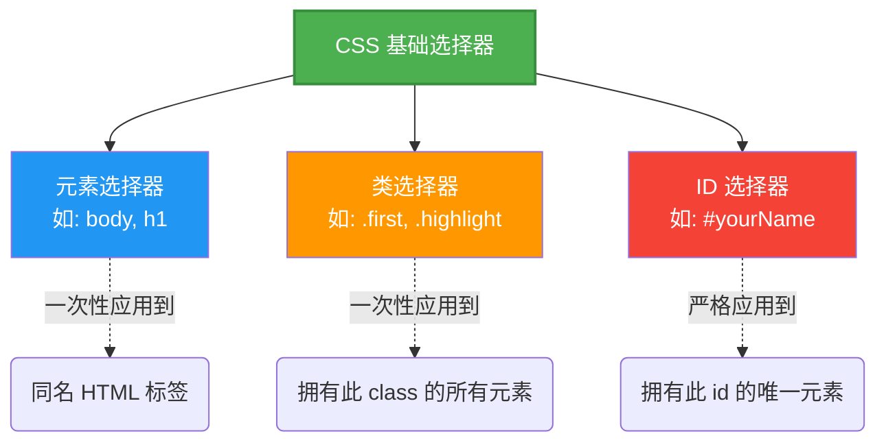

# Basic Styling with CSS

> 📺 来源：004 Basic Styling with CSS.en.srt
> 📂 章节：第 06 章

## 📌 知识脉络
- **前置知识**：HTML 基础结构、DOM 元素关系（父子节点）、使用 `class` 和 `id` 属性命名元素。
- **后续扩展**：CSS 盒模型（Box Model）、CSS 布局系统（Flexbox/Grid）、响应式网页设计。

## 🎯 概述
本节课我们将正式步入 CSS（层叠样式表）的美丽世界。我们将学习 CSS 的基本语法、如何在 HTML 中链接外部样式表，并掌握如何通过元素、类（Class）和 ID 选择器精准控制网页中的颜色、字体与基本排版。

## 核心知识点

### 1. CSS 基本语法与内联样式 (Inline Styles)
> 🧩 **生活类比**：内联样式就像给一个人直接穿上一件特定的衣服，这件衣服只对他自己有效，不影响其他人。

最简单但**极不推荐**的添加 CSS 方式是使用 HTML 标签的 `style` 属性。在 CSS 的语法宇宙里，一条完整的规则包含**属性（Property）**与**指定的值（Value）**。

```html {runnable} {title="01_inline.html"}
<!-- 这里的 style 属性包含了 CSS 声明：属性名: 属性值; -->
<body style="background-color: green;">
  <h1>Hello CSS</h1>
</body>
```

**🔍 执行追踪：** 
① 浏览器解析到 `<body>` 标签。
② 读取到 `style` 属性中的内联 CSS。
③ 识别出背景色（`background-color`）属性并赋予绿色（`green`），最终渲染网页背景。

> 💡 **记忆口诀**：CSS 声明公式 = `属性名: 属性值;`（Property : Value;）

---

### 2. 外部样式表与三种主要选择器 (External Stylesheet & Selectors)
> 🧩 **生活类比**：外部样式表就像学校颁布的统一着装标准手册（独立的文档），只要班级订阅（引用）了这本手册，所有人都会自动按规定穿校服。类选择器是给"学生会"这部分人特定衣服，ID 选择器则是给"校长"这一唯一的人定制服装。

为了将网页的**内容结构（HTML）**与**视觉展示（CSS）**彻底分离，我们需要创建独立的 `.css` 文件，并通过 `<link>` 标签将其连接到 HTML 文件中。这就是"层叠样式表"的最佳实践。

我们需要使用**选择器（Selectors）**来选定要添加样式的目标。有三种最基本的选择器：

1. **元素选择器 (Element Selector)**：直接写 HTML 标签名。
2. **类选择器 (Class Selector)**：使用点号 `.` 开头，可用于多个元素。
3. **ID 选择器 (ID Selector)**：使用井号 `#` 开头，在一个 HTML 页面中必须是**唯一**的。



:::code-comparison
```html {title="🚨 混合了结构的内联写法 (The Naive Way)"}
<!-- 都在同一个文件内，难以维护且无法复用 -->
<p style="color: red;">第一段红字</p>
<p style="color: red;">第二段也是红字</p>
```
```html {title="✨ 结构与样式分离 (The Refactored Way)"}
<!-- index.html 中引入样式 -->
<head>
  <link rel="stylesheet" href="style.css">
</head>
<body>
  <p class="first">第一段红字</p>
  <p class="first">第二段也是红字</p>
</body>

/* style.css 只负责外观 */
.first {
  color: red;
}
```
:::

**📊 概念对比（类和 ID）：**
| 特性 | 类选择器 (Class) | ID 选择器 (ID) |
|------|-----------------|----------------|
| 语法标识 | 点号 `.` (例如 `.first`) | 井号 `#` (例如 `#yourName`) |
| 复用性 | 很高，一个页面中可以出现无限多次 | **极低，每种 ID 在一页内只能使用一次** |
| 单元素多选 | 一个元素可以有多个类（用空格隔开）| 一个元素只能有一个 ID |
| 适用场景 | 按钮、卡片格式、需强调的几段文字等群体性特征 | 页面的主导航栏、唯一的表单容器等全局唯一元素 |

---

### 3. CSS 属性继承与简写属性 (Inheritance & Shorthand)

并非所有 CSS 属性都需要针对每个元素独立设置。**字体相关属性**（如 `font-family`, `font-size`, `color` 等）通常具有向下**继承（Inherited）**的特性。如果你给父元素设定了字体，里面所有的子元素会自动应用该字体，无需重写。

相对应的，有些属性（如 `border`）则是非继承的。此外，像 `border` 这样的属性被称为**简写属性（Shorthand Property）**，它允许你在同一行内同时定义多个参数值。

```css
/* 设置在 body 上的字体属性会被里面的 h1, p 等子元素继承 */
body {
  font-family: Arial, sans-serif;
}

/* border 是一种简写属性：宽度 样式 颜色 */
#yourName {
  border: 5px solid #444; 
}
```

---

## 🛠️ 代码实战与真实场景

> **💼 业务场景**：你正在为一个新用户的个人资料页面构建布局结构，你需要用外部样式表隔离地去调整它的网页字体、高亮部分重要文字，并且给底部的个人信息表单加一个边框。

```html {runnable} {title="index.html"}
<!DOCTYPE html>
<html lang="en">
<head>
  <meta charset="UTF-8">
  <title>Styling Demo</title>
  <!-- 使用 link 标签引入外部 CSS -->
  <link rel="stylesheet" href="style.css">
</head>
<body>
  <h1>User Profile</h1>
  <p class="first">Hello, I am learning CSS today!</p>
  <p class="first second">Selectors are fun to use.</p>
  <p>Standard paragraph here.</p>
  
  <form id="contactForm">
    <label>Name:</label>
    <input type="text">
  </form>
</body>
</html>
```

```css {runnable} {title="style.css"}
/* 全局页面样式会被继承 */
body {
  background-color: #f0f8ff; /* 极其淡的蓝色 */
  font-family: Arial, sans-serif; /* 字体种类会被继承 */
}

/* 覆盖继承：自带样式的 h1 可以被重写 */
h1 {
  font-size: 40px;
}

/* 类选择器：只影响带有 .first 类的段落文字变红 */
.first {
  color: red;
}

/* ID 选择器：仅影响唯一的联系表单 */
#contactForm {
  background-color: #e0e0e0; /* 灰底 */
  border: 5px solid #444;    /* 组合简写：5像素厚 实线 暗灰色 */
}
```

**📊 输入输出示例：**
| CSS 规则添加 | 渲染表现（输出） | 说明 |
|-------------|----------------|------|
| `body { font-family: Arial; }` | 整个页面的所有段落、标题变成了无衬线字体。 | 基于相关 CSS 属性的「可继承性」。 |
| `.first { color: red; }` | 携带 `class="first"` 的两段话变红，另一段无此类的段落依然是黑色。 | 类选择器实现精准化、批量的样式控制。 |
| `border: 5px solid #444;` | 表单外围出现深灰色的闭合实线框。 | 结合宽度、样式、颜色的复合属性写法。 |

## 💡 关键要点
- ✅ CSS 主要由选定目标的**选择器（Selector）**和声明样式属性的**声明块（Declaration Block）**构成。
- ✅ **结构与表现分离**是现代 Web 的准则，必须创建外部 `.css` 文件并使用 `<link rel="stylesheet" href="style.css">` 引入。
- ✅ **类选择器用点号（`.`）开头，可无限次复用**；**ID 选择器用井号（`#`）开头，必须页面内唯一**。
- ✅ 字体、颜色相关的 CSS 属性通常会自动被子元素**继承**；而排版、边框相关的属性则不会继承。

## ⚠️ 常见误区
- ⚠️ 误区 1：在写链接 CSS 文件时使用了 `<a>`（Anchor 锚点）标签。`<a>` 是用来做页面内部或外部跳转的超链接；引入辅助文件资源必须要在 `<head>` 内使用 `<link>` 单标签，它不会在页面上显示为可点击项。
- ⚠️ 误区 2：在 CSS 的赋值里随手用到 JavaScript/HTML 中的等号（`=`）。CSS 规则永远是使用冒号（`:`）连接属性和值！

## 🐛 报错实验室
> 了解典型的书写失误

**❌ 错误写法：**
```html
<head>
  <style>
    .my-box {
      color = blue;  /* 致命错误：使用了等号 */
    }
  </style>
</head>
```
**浏览器报错（表面现象）：**
```
不仅此代码不生效，在浏览器的元素审查控制台（F12）中，会看到该规则被删除线划去，并提示：Invalid property value (无效的属性值)。
```
**🔑 解读**：遇到无效的声明被划线时，首先检查你的括号、冒号 `:`（而不是等号 `=`）和分号 `;` 是否拼写完整且全部是英文字符。

---

## 📖 词汇速查表 (Cheat Sheet)
| 中文术语 | 英文术语 | 简明释义 | 速查代码 | 📚 官方文档 |
|---------|---------|---------|---------|-----------|
| 层叠样式表 | CSS | 描述网页展示格式与色彩的规范 | `body { ... }` | [MDN CSS 基础](https://developer.mozilla.org/zh-CN/docs/Web/CSS) |
| 类选择器 | Class Selector | 根据 HTML 属性 class 选中多个节点 | `.my-class { ... }` | [MDN 类选择器](https://developer.mozilla.org/zh-CN/docs/Web/CSS/Class_selectors) |
| ID 选择器 | ID Selector | 根据唯一的 id 选中对应的那一个节点 | `#my-id { ... }` | [MDN ID 选择器](https://developer.mozilla.org/zh-CN/docs/Web/CSS/ID_selectors) |
| 属性继承 | Inheritance | 后代元素自动获得父元素的设定（如字体） | - | [MDN CSS 继承](https://developer.mozilla.org/zh-CN/docs/Web/CSS/Inheritance) |
| 简写属性 | Shorthand property | 允许用单行写法替代数行拆分写法的属性总称 | `border: 1px solid red;` | [MDN 简写属性](https://developer.mozilla.org/zh-CN/docs/Web/CSS/Shorthand_properties) |

---

## 🧪 学习验证

### 📝 动手练习

**练习 1：为博客润色外观**
假设你的 HTML 中有一个带 `id="main-title"` 的一级标题，还有两个带 `class="warning"` 的强调段落。请写出 CSS：
1. 让标题的字体大小变为 `40px`。
2. 让两个警告段落附带 `2px` 的红色红线边框，且背景变成淡黄色（`#ffe`）。

```css {runnable} {title="exercise1.css"}
/* 在这里写你的 CSS 代码 */
```
<details><summary>💡 参考答案</summary>

```css
#main-title {
  font-size: 40px;
}

.warning {
  border: 2px solid red;
  background-color: #ffe;
}
```
**解题思路**：识别唯一标识符使用 `#` 号选中；识别可共享标识符使用 `.` 选中；利用 `border` 简写将各种边框属性融为一体。
</details>

### ❓ 理解检测

:::quiz {correct="C"}
**1. 关于如果在 HTML 页面中正确分离引入外部文件 `style.css`，下列哪个选项是标准做法？**
- A) `<style src="style.css"></style>`
- B) `<a href="style.css">引入样式</a>`
- C) `<link rel="stylesheet" href="style.css">`

> **解析**：外部 CSS 必须要在 head 标签内使用单标签 `<link>` 提供，同时一定要带有 `rel="stylesheet"` 说明文件关系，再以 `href` 给定资源路径。
:::

:::quiz {correct="B"}
**2. 为什么通常我们只需要在 `body` 规则中设置 `font-family`，所有的段落和标题就都会自动运用该字体？**
- A) 因为 `body` 在解析优先级上无视一切。
- B) 因为诸如字体、颜色等 CSS 表现类属性默认具备「CSS 的可向下的继承性 (Inheritance)」。
- C) 因为浏览器默认重写每一个自带标签。

> **解析**：CSS 拥有瀑布下放般的继承链，大部分字体排版相关的属性都会自动传递给各种子级元素，以此极大提高了页面基础基调配置的便利性。
:::

:::quiz {correct="A"}
**3. 下面哪个是一条结构正确合法的 CSS 声明（Declaration）？**
- A) `color: red;`
- B) `border = 5px solid black;`
- C) `.box { padding: 10px; }`

> **解析**：A 是独立的有效声明片段；B 不可以存在等号连接；C 整体叫 CSS 规则或代码块框架，并非一条单纯的"声明"。
:::

### 🔧 代码填空

:::fill-blank
/* 使用恰当的选择器前缀来选中带有 ID 标记 "hero" 的区域： */
___#___hero {
  ___background-color___: yellow;
}
:::
