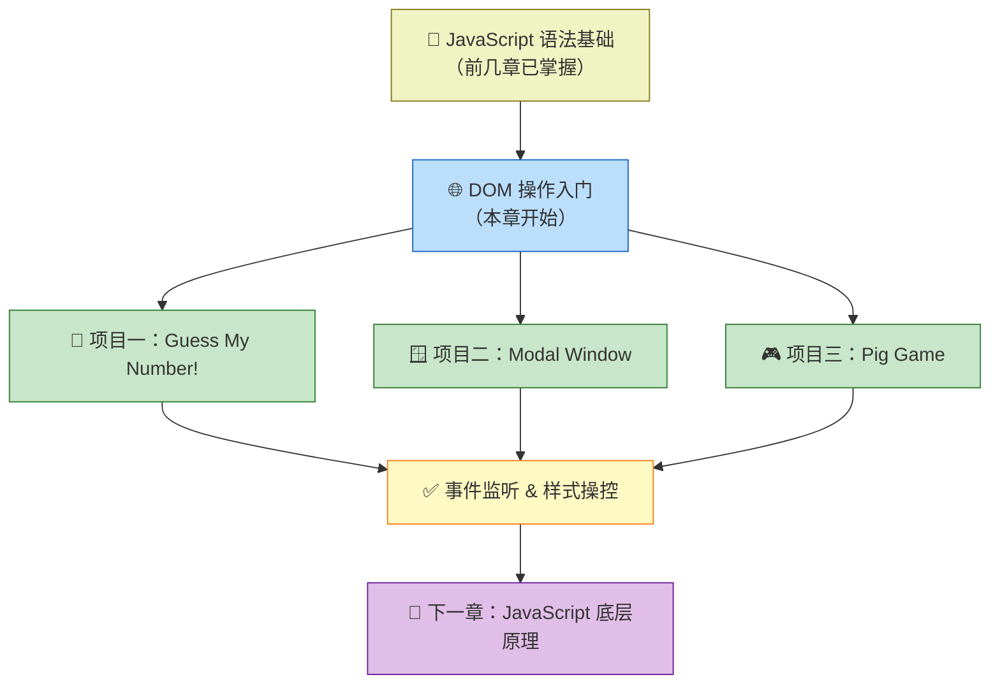
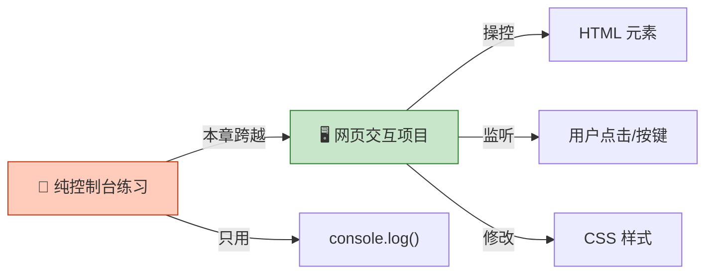
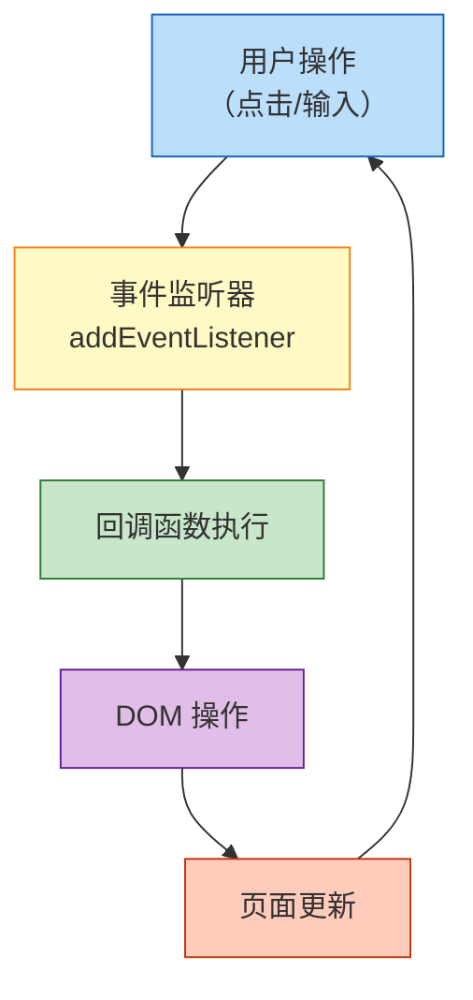

# 章节导读：DOM 与事件基础

> 📺 来源：001 Section Intro.en.srt
> 📂 章节：第 7 章

## 📌 知识脉络
- **前置知识**：JavaScript 基础语法（变量、函数、条件语句）、HTML/CSS 基本结构
- **后续扩展**：高级 DOM 操作、事件委托（Event Delegation）、异步 JavaScript（Async/Await）

## 🎯 概述

本章将带你进入 JavaScript 与网页交互的世界 —— **DOM 操作（DOM Manipulation）**。在此之前，我们只学习了 JavaScript 语言本身的语法；从本章开始，我们将让 JavaScript 真正与网页"对话"，构建 **三个完整的视觉交互项目**。

## 核心知识点

### 1. 本章学习路线图

> 🧩 **生活类比**：就像学了做菜的基本刀工后，终于要上灶台炒一盘真正的菜了。之前我们学的语法是"刀工"，而 DOM 操作就是"掌勺"。



本章包含三个循序渐进的实战项目：

| # | 项目名称 | 核心知识点 | 难度 |
|---|---------|-----------|------|
| 1 | 🎲 Guess My Number! | DOM 选择、事件监听、CSS 样式操控 | ⭐⭐ |
| 2 | 🪟 Modal Window | CSS 类操作、键盘事件监听 | ⭐⭐⭐ |
| 3 | 🎮 Pig Game | 复杂游戏状态管理、玩家切换逻辑 | ⭐⭐⭐⭐ |

### 2. 从"纯语法"到"真实项目"的思维跳跃

> 🧩 **生活类比**：学了交通规则之后，第一次上路练车 —— 紧张但兴奋。本章就是你的"第一次上路"。



**🔍 执行追踪：学习阶段转变**

| 阶段 | 做了什么 | 输出形式 |
|------|---------|---------|
| 第 1~6 章 | 学习变量、函数、数组、对象 | 控制台输出 `console.log()` |
| **第 7 章起** | 操作 DOM，监听事件，修改样式 | **真实网页界面** |

> 💡 **记忆口诀**：语法是骨架，DOM 是肌肉 —— 有了肌肉才能"动"起来。

---

## 🛠️ 代码实战与真实场景

> **💼 业务场景**：想象你正在开发一个简单的网页游戏，用户通过输入框猜测随机数字，页面实时反馈猜测结果。这就是 DOM 操作的典型应用场景。

```js {runnable} {title="dom_preview.js"}
// 预览：本章你将学会的 DOM 操作
// 选取元素
const message = document.querySelector('.message');

// 修改文本内容
message.textContent = '🎉 开始猜数字！';

// 监听按钮点击
document.querySelector('.check').addEventListener('click', function () {
  console.log('按钮被点击了！');
});

// 修改 CSS 样式
document.querySelector('body').style.backgroundColor = '#60b347';
```



**📊 输入输出示例：**
| 操作 | DOM API | 效果 |
|------|---------|------|
| 选取元素 | `document.querySelector('.message')` | 获取类名为 message 的元素 |
| 改文本 | `element.textContent = '新文本'` | 页面文字更新 |
| 监听事件 | `element.addEventListener('click', fn)` | 点击时执行函数 |
| 改样式 | `element.style.backgroundColor = 'red'` | 背景色变红 |

## 💡 关键要点
- ✅ 本章是从"纯语法"到"实际项目开发"的关键转折点
- ✅ 将通过三个递进难度的项目学习 DOM 操作
- ✅ DOM 操作让 JavaScript 能够与网页元素交互
- ✅ 事件监听是用户交互的核心机制

## ⚠️ 常见误区
- ⚠️ 误区 1：认为 JavaScript 只能在控制台输出 —— 实际上 JS 的核心价值就在于操控网页 DOM
- ⚠️ 误区 2：急于跳过基础直接做复杂项目 —— 本章的三个项目是精心设计的递进路线，不要跳步

## 🐛 报错实验室
> 主动展示错误写法及报错信息，教你看懂错误提示

**❌ 错误写法：**
```js
// 选择一个不存在的元素
const el = document.querySelector('.不存在的类名');
el.textContent = '你好';
```
**浏览器报错：**
```
Uncaught TypeError: Cannot set properties of null (setting 'textContent')
```
**🔑 解读**：`querySelector` 找不到匹配元素时返回 `null`，对 `null` 设置属性会报 TypeError。务必确保选择器与 HTML 中的类名/ID 严格匹配。

---

## 📖 词汇速查表 (Cheat Sheet)
| 中文术语 | 英文术语 | 简明释义 | 速查代码 | 📚 官方文档 |
|---------|---------|---------|---------|-----------|
| 文档对象模型 | DOM | 浏览器将 HTML 解析为树状对象结构 | `document` | [MDN](https://developer.mozilla.org/zh-CN/docs/Web/API/Document_Object_Model) |
| DOM 操作 | DOM Manipulation | 通过 JS 动态修改网页内容/样式/结构 | `document.querySelector()` | [MDN](https://developer.mozilla.org/zh-CN/docs/Web/API/Document/querySelector) |
| 事件监听 | Event Listener | 监听用户交互（如点击、按键） | `.addEventListener()` | [MDN](https://developer.mozilla.org/zh-CN/docs/Web/API/EventTarget/addEventListener) |

---

## 🧪 学习验证

### 📝 动手练习

**练习 1：你的第一个 DOM 操作**
```js {runnable} {title="exercise1.js"}
// 尝试在浏览器控制台中运行以下代码
// 1. 选取页面的 body 元素
// 2. 将背景色设为你喜欢的颜色
// 在这里写你的代码
```
<details><summary>💡 参考答案</summary>

```js
document.querySelector('body').style.backgroundColor = '#2196F3';
```
**解题思路**：使用 `document.querySelector('body')` 选取 body 元素，然后通过 `.style.backgroundColor` 修改其背景色。
</details>

**练习 2：列举本章三个项目的名称和你最期待的一个**
```js {runnable} {title="exercise2.js"}
// 将三个项目名称存入数组，并打印你最期待的项目
const projects = []; // 填入三个项目名称
console.log(`我最期待的项目是：${projects[0]}`);
```
<details><summary>💡 参考答案</summary>

```js
const projects = ['Guess My Number!', 'Modal Window', 'Pig Game'];
console.log(`我最期待的项目是：${projects[2]}`); // 选你自己最期待的
```
**解题思路**：用字符串数组存储项目名称，通过索引访问特定项目。
</details>

### ❓ 理解检测

:::quiz {correct="B"}
**1. 本章的核心主题是什么？**
- A) JavaScript 基础语法入门
- B) DOM 操作与事件处理
- C) Node.js 后端开发
- D) CSS 动画设计

> **解析**：本章专注于 DOM 操作（DOM Manipulation），让 JavaScript 与网页元素交互，实现用户界面的动态效果。
:::

:::quiz {correct="C"}
**2. 本章包含几个实战项目？**
- A) 1 个
- B) 2 个
- C) 3 个
- D) 5 个

> **解析**：本章包含三个项目：Guess My Number!、Modal Window 和 Pig Game，难度逐步递增。
:::

:::quiz {correct="A"}
**3. 在学习 DOM 操作之前，我们的 JavaScript 输出主要依靠什么？**
- A) console.log() 控制台输出
- B) alert() 弹窗
- C) document.write()
- D) 直接在 HTML 中写

> **解析**：前几章我们主要通过 `console.log()` 在控制台查看代码运行结果，本章开始才真正操作网页 DOM 元素。
:::

### 🔧 代码填空

:::fill-blank
// DOM 操作三步曲
// 1. 选取元素
const element = document.___querySelector___('.my-class');
// 2. 添加事件监听
element.___addEventListener___('click', function() {
  // 3. 修改内容
  element.___textContent___ = '被点击了！';
});
:::
