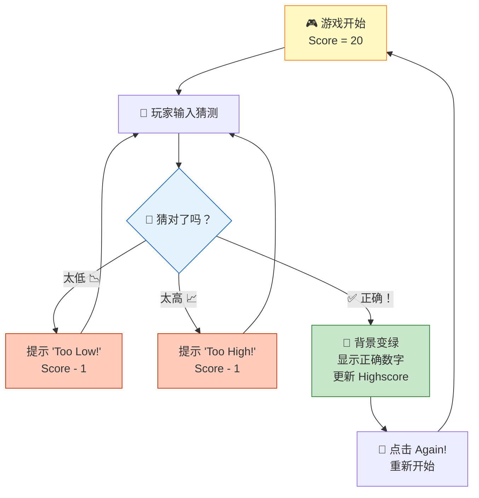
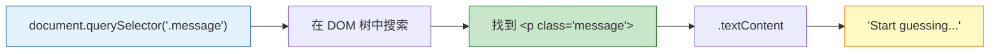
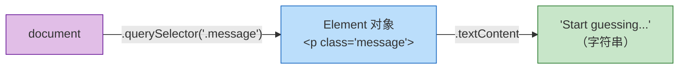
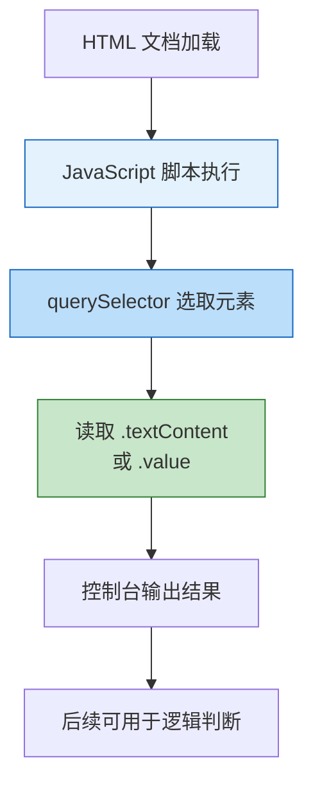

# PROJECT #1：Guess My Number! 项目概览

> 📺 来源：003 PROJECT #1 Guess My Number!.en.srt
> 📂 章节：第 7 章

## 📌 知识脉络
- **前置知识**：HTML/CSS 基础结构、JavaScript 变量与函数、`console.log()` 使用
- **后续扩展**：DOM 深度操作、事件监听器（addEventListener）、CSS 样式动态控制、游戏状态管理

## 🎯 概述

本节课正式启动第一个 DOM 实战项目 —— **Guess My Number!（猜数字游戏）**。该游戏采用复古 80 年代风格设计，玩家需要在 1~20 之间猜测一个秘密数字，每次猜错分数递减，猜对则触发胜利效果。本节将展示项目的完整功能演示，并完成第一步：**使用 `document.querySelector()` 选取 DOM 元素**。

## 核心知识点

### 1. 项目功能解析

> 🧩 **生活类比**：就像一台老式街机游戏 —— 投币（输入猜测）、看结果（太高/太低）、得分（越快越高分）、记录最高分。



**项目核心功能清单：**

| 功能 | 描述 | 涉及的 DOM 操作 |
|------|------|----------------|
| 猜测验证 | 比较用户输入与秘密数字 | 读取输入框的值 |
| 消息反馈 | 显示"太高/太低/正确" | 修改文本内容 |
| 分数递减 | 每次猜错扣 1 分 | 修改文本内容 |
| 胜利效果 | 背景变绿 + 显示数字 | 修改 CSS 样式 |
| 最高分 | 记录历史最佳成绩 | 修改文本内容 |
| 重新开始 | 重置游戏状态 | 批量修改 DOM |

### 2. 使用 `document.querySelector()` 选取元素

> 🧩 **生活类比**：`querySelector` 就像一个"精确抓取器"—— 你告诉它你要找什么特征（类名/ID），它就从整个页面中精确抓取那个元素，就像在一堆积木中挑出特定颜色的那块。

在 HTML 中，每个界面元素都有类名（class）或 ID 来标识它们。JavaScript 通过 `document.querySelector()` 方法，使用**与 CSS 完全相同的选择器语法**来定位这些元素。

```js {runnable} {title="querySelector_demo.js"}
// 选取 class 为 "message" 的元素（使用 . 前缀）
const messageEl = document.querySelector('.message');
console.log(messageEl); // <p class="message">Start guessing...</p>

// 读取元素的文本内容
console.log(document.querySelector('.message').textContent);
// 输出: "Start guessing..."
```



**🔍 执行追踪：选择器执行流程**

| 步骤 | 代码 | 发生了什么 | 结果 |
|------|------|-----------|------|
| ① | `document.querySelector('.message')` | 在文档中搜索 class="message" 的元素 | 返回 `<p>` 元素对象 |
| ② | `.textContent` | 从元素对象上读取文本内容属性 | 返回字符串 `"Start guessing..."` |

> 💡 **记忆口诀**：**选元素用 `querySelector`**，类名加 `.`，ID 加 `#`，语法跟 CSS 一模一样！

### 3. 点操作符的链式使用

> 🧩 **生活类比**：连续使用 `.` 就像"开锁 → 开抽屉 → 取东西"的连贯动作 —— 先解锁大门（`document`），再打开特定的抽屉（`.querySelector()`），最后取出里面的东西（`.textContent`）。

```js {runnable} {title="chaining_demo.js"}
// 点操作符从左到右依次执行
console.log(document.querySelector('.message').textContent);

// 等价拆解：
// 步骤 1: document.querySelector('.message') → 得到元素对象
// 步骤 2: 元素对象.textContent → 得到文本字符串
```



**📊 选择器类型对比：**

| 选择器类型 | 语法 | CSS 等价 | 示例 |
|-----------|------|---------|------|
| 类选择器 | `'.message'` | `.message { }` | `document.querySelector('.message')` |
| ID 选择器 | `'#score'` | `#score { }` | `document.querySelector('#score')` |
| 元素选择器 | `'p'` | `p { }` | `document.querySelector('p')` |

> **💼 业务场景**：在真实的电商网站中，购物车页面的商品数量、总价、折扣信息等，都是通过 `querySelector` 精确定位到对应的 DOM 元素后进行实时更新的。

---

## 🛠️ 代码实战与真实场景

> **💼 业务场景**：假设你正在开发一个简易的"待办事项"应用，需要从页面上读取用户已输入的任务标题，并在控制台打印出来。

```js {runnable} {title="real_world_demo.js"}
// 场景：从页面读取信息并展示
// 1. 选取标题元素
const title = document.querySelector('.app-title');
console.log('应用标题:', title.textContent);

// 2. 选取输入框的值（注意：输入框用 .value 而非 .textContent）
const input = document.querySelector('.guess');
console.log('输入框的值:', input.value);

// 3. 选取得分元素
const score = document.querySelector('.score');
console.log('当前得分:', score.textContent);
```



**📊 输入输出示例：**
| HTML 元素 | 选择器 | 属性 | 输出值 |
|-----------|--------|------|--------|
| `<p class="message">Start guessing...</p>` | `.message` | `.textContent` | `"Start guessing..."` |
| `<span class="score">20</span>` | `.score` | `.textContent` | `"20"` |
| `<input type="number" class="guess">` | `.guess` | `.value` | `""` (空) |

## 💡 关键要点
- ✅ `document.querySelector()` 使用 CSS 选择器语法来选取 DOM 元素
- ✅ 类选择器用 `.className`，ID 选择器用 `#idName`
- ✅ `.textContent` 属性用于读取或设置元素的文本内容
- ✅ 点操作符 `.` 从左到右链式执行，每一步返回一个新的对象
- ✅ 项目开发的第一步通常是：了解 HTML 结构 → 确定要操控的元素

## ⚠️ 常见误区
- ⚠️ 误区 1：忘记在类名前加 `.` —— `querySelector('message')` ≠ `querySelector('.message')`。不加点号会被当作标签选择器，匹配 `<message>` 标签（并不存在）
- ⚠️ 误区 2：混淆 `.textContent` 和 `.value` —— 普通元素（如 `<p>`、`<span>`）用 `.textContent`，而输入框（`<input>`）用 `.value`

## 🐛 报错实验室
> 主动展示错误写法及报错信息，教你看懂错误提示

**❌ 错误写法：**
```js
// 忘记加 . 前缀 — 选择器无法匹配
const el = document.querySelector('message');
console.log(el.textContent);
```
**浏览器报错：**
```
Uncaught TypeError: Cannot read properties of null (reading 'textContent')
```
**🔑 解读**：`querySelector('message')` 会去找 `<message>` 标签而不是 `class="message"` 的元素。找不到时返回 `null`，对 `null` 读取属性就会报 `TypeError`。**解决方法**：确保类选择器以 `.` 开头 → `querySelector('.message')`。

---

## 📖 词汇速查表 (Cheat Sheet)
| 中文术语 | 英文术语 | 简明释义 | 速查代码 | 📚 官方文档 |
|---------|---------|---------|---------|-----------|
| 查询选择器 | querySelector | 使用 CSS 选择器语法选取首个匹配元素 | `document.querySelector('.class')` | [MDN](https://developer.mozilla.org/zh-CN/docs/Web/API/Document/querySelector) |
| 文本内容 | textContent | 获取或设置元素的纯文本内容 | `el.textContent` | [MDN](https://developer.mozilla.org/zh-CN/docs/Web/API/Node/textContent) |
| 文档对象 | document | 代表整个 HTML 页面的入口对象 | `document` | [MDN](https://developer.mozilla.org/zh-CN/docs/Web/API/Document) |
| 点操作符 | Dot Notation | 用于访问对象的属性或方法 | `obj.prop` | [MDN](https://developer.mozilla.org/zh-CN/docs/Web/JavaScript/Reference/Operators/Property_accessors) |

---

## 🧪 学习验证

### 📝 动手练习

**练习 1：选取并读取元素文本**
```js {runnable} {title="exercise1.js"}
// 假设 HTML 中有：<h1 class="title">JavaScript 猜数字游戏</h1>
// 请选取该元素并打印其文本内容
// 在这里写你的代码
```
<details><summary>💡 参考答案</summary>

```js
const titleText = document.querySelector('.title').textContent;
console.log(titleText); // "JavaScript 猜数字游戏"
```
**解题思路**：使用 `.title` 类选择器定位 `<h1>` 元素，然后通过 `.textContent` 读取文本。
</details>

**练习 2：区分 .textContent 和 .value**
```js {runnable} {title="exercise2.js"}
// 假设 HTML 中有：
// <span class="score">20</span>
// <input type="number" class="guess" value="15">
// 请分别获取 score 的文本和 guess 的值
// 在这里写你的代码
```
<details><summary>💡 参考答案</summary>

```js
const scoreText = document.querySelector('.score').textContent;
console.log('分数:', scoreText); // "20"

const guessValue = document.querySelector('.guess').value;
console.log('猜测值:', guessValue); // "15"
```
**解题思路**：`<span>` 等普通元素用 `.textContent`，`<input>` 输入框用 `.value`。这是一个关键的区别！
</details>

### ❓ 理解检测

:::quiz {correct="B"}
**1. `document.querySelector('.message')` 中的 `.` 前缀代表什么？**
- A) 它是一个方法调用的语法
- B) 它表示按 CSS 类名（class）进行选择
- C) 它表示按 ID 进行选择
- D) 它是可选的装饰符号

> **解析**：`.` 前缀表示类选择器（class selector），与 CSS 中的写法完全一致。`#` 前缀则表示 ID 选择器。
:::

:::quiz {correct="A"}
**2. `querySelector` 找不到匹配元素时会返回什么？**
- A) `null`
- B) `undefined`
- C) 空字符串 `""`
- D) 抛出错误

> **解析**：当 `querySelector` 找不到任何匹配的元素时，它会返回 `null`，而不是报错。因此使用返回值前最好先检查是否为 `null`。
:::

:::quiz {correct="C"}
**3. 以下哪行代码能正确读取 `<input class="guess">` 中用户输入的值？**
- A) `document.querySelector('.guess').textContent`
- B) `document.querySelector('.guess').innerHTML`
- C) `document.querySelector('.guess').value`
- D) `document.querySelector('.guess').text`

> **解析**：对于 `<input>` 元素，用户输入的值存储在 `.value` 属性中，而非 `.textContent`。`.textContent` 用于普通元素（如 `<p>`、`<span>`）。
:::

### 🔧 代码填空

:::fill-blank
// 选取 class 为 "score" 的元素并读取其文本
const score = document.___querySelector___('___. score___').___textContent___;
console.log(score);
:::
