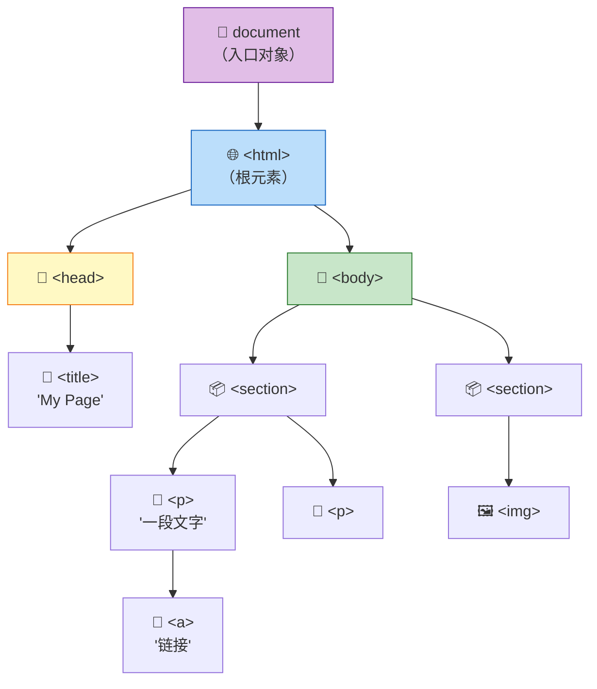
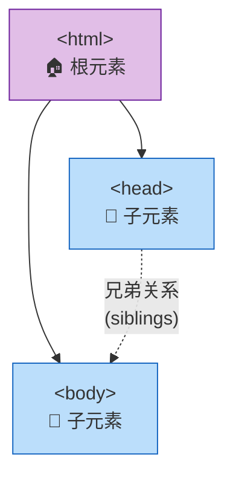
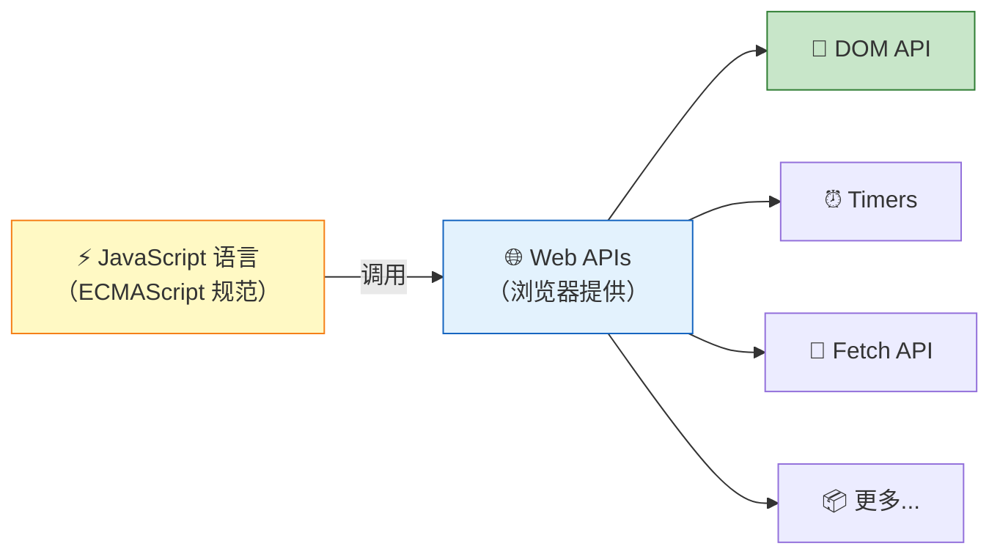
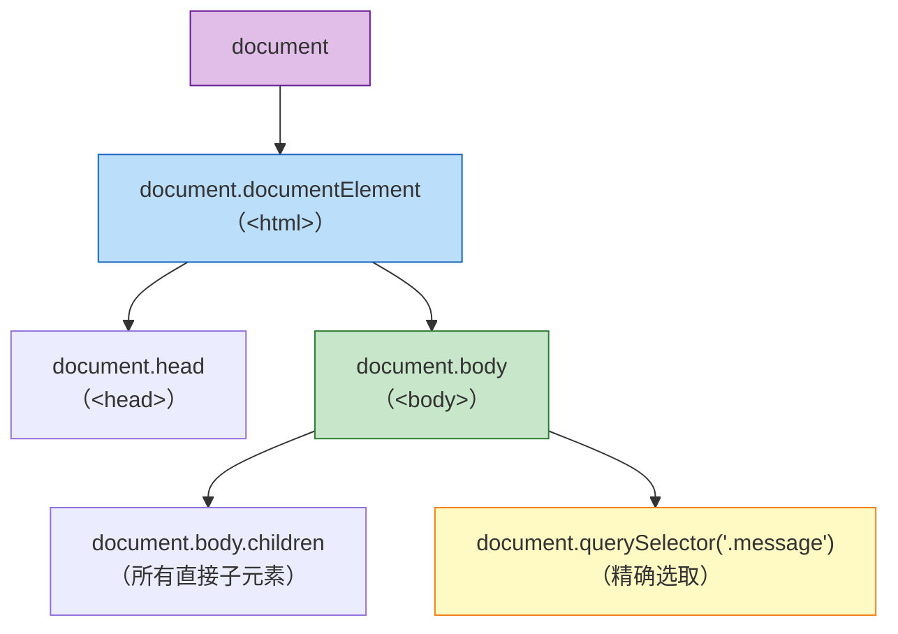

# 什么是 DOM 和 DOM 操作

> 📺 来源：004 What's the DOM and DOM Manipulation.en.srt
> 📂 章节：第 7 章

## 📌 知识脉络
- **前置知识**：HTML 文档基本结构（`<html>`、`<head>`、`<body>`）、`document.querySelector()` 的初步使用
- **后续扩展**：DOM 元素的增删改查、事件监听与处理、浏览器渲染原理（Repaint / Reflow）

## 🎯 概述

本节课从理论层面彻底讲清 **DOM（Document Object Model，文档对象模型）** 是什么。DOM 是浏览器将 HTML 解析后生成的一棵树状结构，它充当了 HTML 文档与 JavaScript 代码之间的桥梁。通过 DOM，我们可以用 JavaScript 访问和操控页面上的所有元素、属性和样式。此外还澄清了一个关键误区：**DOM 不是 JavaScript 语言的一部分，而是浏览器提供的 Web API**。

## 核心知识点

### 1. DOM 是什么？—— 树状结构的文档表示

> 🧩 **生活类比**：DOM 就像一棵家族族谱树 —— HTML 文档中的每个标签就是族谱中的一个人，标签之间的嵌套关系就是"父子关系"和"兄弟关系"。`document` 对象是树的根节点，相当于整个家族的"始祖"。

**DOM 的核心定义：**
- **全称**：Document Object Model（文档对象模型）
- **本质**：浏览器将 HTML 文档解析后自动生成的**对象树状结构**
- **作用**：连接 HTML 与 JavaScript，让 JS 可以读写页面内容



**🔍 执行追踪：DOM 树的构建过程**

| 步骤 | 浏览器动作 | 结果 |
|------|-----------|------|
| ① | 下载 HTML 文件 | 获得纯文本 HTML 代码 |
| ② | 解析（Parse）HTML | 构建 DOM 树 |
| ③ | 每个 HTML 元素 → 一个节点对象 | 包含属性、方法、子元素引用 |
| ④ | 文本内容、注释 → 也成为节点 | DOM 完整表示 HTML 的所有内容 |
| ⑤ | `document` 对象就绪 | JS 可以通过 `document` 开始操作 |

> 💡 **记忆口诀**：**DOM = 文档的镜像树**。HTML 里有什么，DOM 里就有什么 —— 元素、文本、注释，一个不少。

### 2. DOM 树中的家族关系

> 🧩 **生活类比**：想象一棵倒置的家族树 —— `<html>` 是"祖父母"，`<head>` 和 `<body>` 是两个"孩子"，它们彼此是"兄弟姐妹"。`<body>` 里面的 `<section>` 是"孙辈"。



**📊 DOM 关系术语对照表：**

| DOM 术语 | 英文 | 含义 | HTML 示例 |
|---------|------|------|-----------|
| 父元素 | Parent | 直接包裹的外层元素 | `<body>` 是 `<section>` 的父元素 |
| 子元素 | Child | 直接嵌套的内层元素 | `<section>` 是 `<body>` 的子元素 |
| 兄弟元素 | Sibling | 同级、同父的元素 | `<head>` 和 `<body>` 是兄弟 |
| 后代元素 | Descendant | 所有层级的内层元素 | `<a>` 是 `<body>` 的后代 |

### 3. DOM ≠ JavaScript —— 它是 Web API

> 🧩 **生活类比**：JavaScript 是"厨师"，DOM 是"餐厅提供的厨具和食材"。厨师自身不包含这些工具，但餐厅（浏览器）自动为你准备好了，你拿来就能用。



**关键澄清：**
- ❌ `document.querySelector()` **不是** JavaScript 语言的一部分
- ✅ 它是**浏览器 Web API** 提供的方法
- ✅ Web API 本身也是用 JavaScript 编写的，浏览器自动提供，无需导入
- ✅ 有官方 DOM 规范，所有浏览器都按同一标准实现，因此跨浏览器行为一致

> **💼 业务场景**：在真实的企业级项目中，了解 DOM 是 Web API（而非 JS 语言本身）的一部分非常重要 —— 因为 Node.js 服务器端没有 DOM，你不能在后端代码中直接使用 `document.querySelector()`。

---

## 🛠️ 代码实战与真实场景

> **💼 业务场景**：在搭建一个新闻网站时，前端开发者需要动态更新标题、正文内容和图片。这些都需要先理解 DOM 树的结构，再用 JavaScript 精准定位并修改元素。

```js {runnable} {title="dom_exploration.js"}
// 探索 DOM 树结构

// 1. document 是入口
console.log(document); // 整个 DOM 树

// 2. 获取根元素
console.log(document.documentElement); // <html>

// 3. 获取 head 和 body
console.log(document.head); // <head>
console.log(document.body); // <body>

// 4. 获取子元素列表
console.log(document.body.children); // body 的所有直接子元素

// 5. 获取特定元素
const message = document.querySelector('.message');
console.log(message.textContent); // 读取文本
console.log(message.parentElement); // 查看父元素
```



**📊 输入输出示例：**
| 代码 | 返回值类型 | 说明 |
|------|-----------|------|
| `document` | `Document` 对象 | DOM 的最顶层入口 |
| `document.documentElement` | `Element` | `<html>` 根元素 |
| `document.body` | `Element` | `<body>` 元素 |
| `document.querySelector('.x')` | `Element` 或 `null` | 首个匹配 `.x` 的元素 |

## 💡 关键要点
- ✅ DOM = Document Object Model，是 HTML 文档的树状对象表示
- ✅ DOM 由浏览器自动创建，在 HTML 页面加载完成后即可使用
- ✅ `document` 对象是进入 DOM 的入口，所有操作从它开始
- ✅ DOM 中的术语遵循家族关系：父（parent）、子（child）、兄弟（sibling）
- ✅ DOM 不属于 JavaScript 语言本身，而是浏览器提供的 Web API

## ⚠️ 常见误区
- ⚠️ 误区 1：认为 DOM 是 JavaScript 的一部分 —— 实际上 DOM 是 Web API，由浏览器（而非 JS 引擎）提供
- ⚠️ 误区 2：认为 DOM 只包含 HTML 元素 —— 实际上文本节点、注释节点等也是 DOM 树的一部分
- ⚠️ 误区 3：在 Node.js 环境中使用 `document` —— 服务端没有 DOM，会报 `ReferenceError`

## 🐛 报错实验室
> 尝试在 Node.js 环境中使用 DOM API

**❌ 错误写法：**
```js
// 在 Node.js 中运行（没有浏览器环境）
const el = document.querySelector('.message');
```
**终端报错：**
```
ReferenceError: document is not defined
```
**🔑 解读**：`document` 是浏览器 Web API 提供的全局对象，在 Node.js 服务端环境中不存在。DOM 操作只能在浏览器中执行。如果需要在服务端操作 HTML，可以使用 `jsdom` 等第三方库。

---

## 📖 词汇速查表 (Cheat Sheet)
| 中文术语 | 英文术语 | 简明释义 | 速查代码 | 📚 官方文档 |
|---------|---------|---------|---------|-----------|
| 文档对象模型 | DOM | 浏览器将 HTML 解析为的树状对象结构 | `document` | [MDN](https://developer.mozilla.org/zh-CN/docs/Web/API/Document_Object_Model) |
| Web API | Web API | 浏览器内建的、可被 JS 调用的接口库 | — | [MDN](https://developer.mozilla.org/zh-CN/docs/Web/API) |
| 文档对象 | document | DOM 树的顶层入口对象 | `document` | [MDN](https://developer.mozilla.org/zh-CN/docs/Web/API/Document) |
| 查询选择器 | querySelector | 用 CSS 选择器语法选取 DOM 元素 | `document.querySelector('.x')` | [MDN](https://developer.mozilla.org/zh-CN/docs/Web/API/Document/querySelector) |
| 子元素 | Child Element | 直接嵌套在另一元素内部的元素 | `el.children` | [MDN](https://developer.mozilla.org/zh-CN/docs/Web/API/Element/children) |
| 父元素 | Parent Element | 直接包裹某元素的外层元素 | `el.parentElement` | [MDN](https://developer.mozilla.org/zh-CN/docs/Web/API/Node/parentElement) |

---

## 🧪 学习验证

### 📝 动手练习

**练习 1：绘制 DOM 树**
```js {runnable} {title="exercise1.js"}
// 给定以下 HTML 结构，在纸上画出对应的 DOM 树
// <html>
//   <head><title>DOM 练习</title></head>
//   <body>
//     <h1>标题</h1>
//     <p>第一段 <a href="#">链接</a></p>
//     <p>第二段</p>
//   </body>
// </html>

// 然后用代码验证你的理解：
console.log(document.body.children.length); // body 有几个直接子元素？
```
<details><summary>💡 参考答案</summary>

```
DOM 树：
document
  └── html
       ├── head
       │    └── title → "DOM 练习"
       └── body
            ├── h1 → "标题"
            ├── p → "第一段"
            │    └── a → "链接"
            └── p → "第二段"
```
`document.body.children.length` 的值为 **3**（h1、第一个p、第二个p）。

**解题思路**：按 HTML 的嵌套层级逐层展开，注意 `<a>` 是 `<p>` 的子元素而非 `<body>` 的直接子元素。
</details>

**练习 2：探索 document 对象**
```js {runnable} {title="exercise2.js"}
// 在浏览器控制台中运行以下代码，观察输出
console.log('HTML 根元素:', document.documentElement.tagName);
console.log('Body 子元素数量:', document.body.children.length);
console.log('页面标题:', document.title);
// 尝试修改页面标题
document.title = '我修改了标题！';
```
<details><summary>💡 参考答案</summary>

```js
console.log('HTML 根元素:', document.documentElement.tagName); // "HTML"
console.log('Body 子元素数量:', document.body.children.length); // 取决于页面
console.log('页面标题:', document.title); // 原始标题

document.title = '我修改了标题！';
// 浏览器标签页的标题会立即改变
```
**解题思路**：`document.title` 既可以读取也可以设置页面标题，修改后浏览器标签页会实时更新。
</details>

### ❓ 理解检测

:::quiz {correct="C"}
**1. DOM 是由谁创建的？**
- A) JavaScript 引擎
- B) 开发者手动创建
- C) 浏览器自动创建
- D) HTML 编辑器

> **解析**：DOM 是浏览器在加载 HTML 文件后自动解析生成的树状结构，开发者不需要手动创建。
:::

:::quiz {correct="B"}
**2. DOM 属于以下哪个范畴？**
- A) JavaScript 语言规范（ECMAScript）的一部分
- B) 浏览器提供的 Web API
- C) Node.js 内建模块
- D) CSS 规范的一部分

> **解析**：DOM 是浏览器实现的 Web API，不属于 ECMAScript 规范。JavaScript 语言本身不包含 `document` 对象等 DOM 相关功能。
:::

:::quiz {correct="A"}
**3. 以下哪项内容不会出现在 DOM 树中？**
- A) JavaScript 变量的值
- B) HTML 注释
- C) 文本节点
- D) HTML 属性

> **解析**：DOM 树包含 HTML 文档中的所有内容（元素、文本、注释、属性），但 JavaScript 代码中定义的变量不是 DOM 的一部分。
:::

### 🔧 代码填空

:::fill-blank
// DOM 的核心入口是 ___document___ 对象
// 获取 <html> 根元素用 document.___documentElement___
// 获取 <body> 元素用 document.___body___
// 精确选取 class="score" 的元素用 document.querySelector('___. score___')
:::
