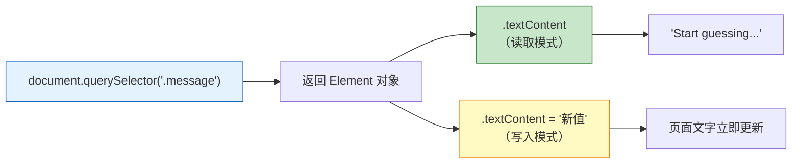
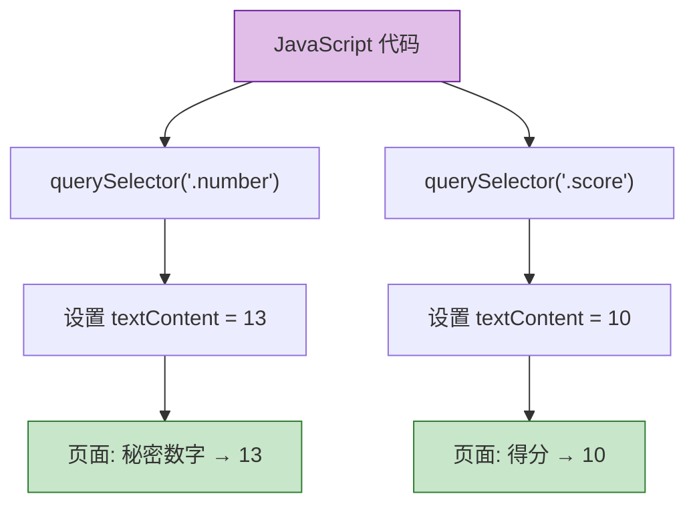
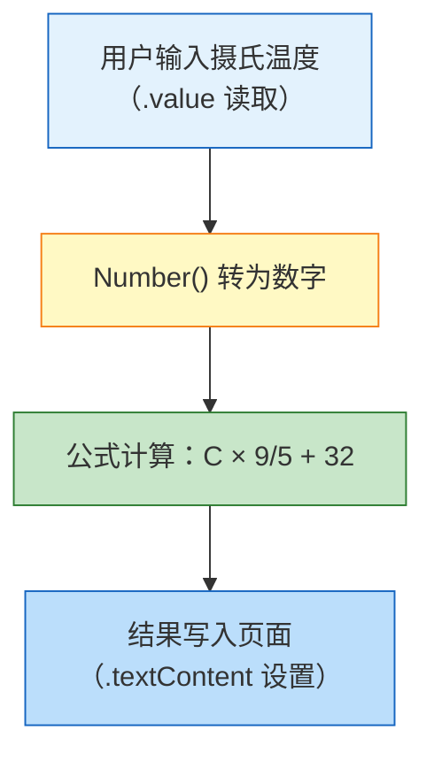

# 选取与操控 DOM 元素

> 📺 来源：005 Selecting and Manipulating Elements.en.srt
> 📂 章节：第 7 章

## 📌 知识脉络
- **前置知识**：`document.querySelector()` 基本用法、DOM 树的概念、HTML class 属性
- **后续扩展**：事件监听（addEventListener）、DOM 元素动态增删、`querySelectorAll()` 批量选取

## 🎯 概述

本节课在上一节"读取"DOM 元素的基础上，进一步学习如何**修改（Set）** DOM 元素的内容。核心操作包括：用 `.textContent` 设置文本内容、用 `.value` 设置输入框的值。讲师通过实际修改"猜数字"项目的界面元素演示了 DOM 操作的双向性 —— **既能读，也能写**。

## 核心知识点

### 1. 用 `.textContent` 读写元素文本

> 🧩 **生活类比**：`.textContent` 就像一块可以反复擦写的白板 —— 你可以读上面现在写了什么（get），也可以擦掉旧内容写上新内容（set）。

```js {runnable} {title="textContent_demo.js"}
// ===== 读取文本 =====
// 获取 class="message" 元素当前的文本
console.log(document.querySelector('.message').textContent);
// 输出: "Start guessing..."

// ===== 设置文本 =====
// 将文本修改为新内容
document.querySelector('.message').textContent = '🎉 Correct Number!';

// 再次读取 —— 已经变成新内容
console.log(document.querySelector('.message').textContent);
// 输出: "🎉 Correct Number!"
```



**🔍 执行追踪：读写操作的时序**

| 步骤 | 代码 | `.textContent` 的值 | 页面显示 |
|------|------|---------------------|---------|
| ① | `console.log(el.textContent)` | `"Start guessing..."` | Start guessing... |
| ② | `el.textContent = '🎉 Correct Number!'` | `"🎉 Correct Number!"` | 🎉 Correct Number! |
| ③ | `console.log(el.textContent)` | `"🎉 Correct Number!"` | 🎉 Correct Number! |

> 💡 **记忆口诀**：**等号左边是写，不带等号是读** —— `el.textContent` 读值，`el.textContent = '...'` 写值。

### 2. 同时操控多个元素

> 🧩 **生活类比**：就像在超市的价签上同时换几个商品的标价 —— 每个标签（元素）独立操作，但方法（`.textContent`）完全一样。

```js {runnable} {title="multiple_elements.js"}
// 同时操控"秘密数字"和"得分"两个元素

// 修改 class="number" 的元素（秘密数字显示区）
document.querySelector('.number').textContent = 13;

// 修改 class="score" 的元素（得分显示区）
document.querySelector('.score').textContent = 10;

// 验证修改结果
console.log('秘密数字:', document.querySelector('.number').textContent); // "13"
console.log('得分:', document.querySelector('.score').textContent);       // "10"
```



### 3. 输入框的 `.value` 属性

> 🧩 **生活类比**：普通元素（`<p>`、`<span>`）像墙上贴着的告示牌，用 `.textContent` 读写；而输入框（`<input>`）像一个可以填写的表格空栏，用 `.value` 读写 —— 两种不同的"容器"用不同的方式操作。

```js {runnable} {title="input_value.js"}
// 输入框 <input class="guess"> 使用 .value 而非 .textContent

// 读取输入框的值（初始为空）
console.log(document.querySelector('.guess').value); // ""

// 设置输入框的值
document.querySelector('.guess').value = 23;

// 再次读取 —— 值已更新
console.log(document.querySelector('.guess').value); // "23"
```

**📊 `.textContent` vs `.value` 对比表：**

| 特性 | `.textContent` | `.value` |
|------|---------------|---------|
| 适用元素 | `<p>`、`<span>`、`<div>`、`<h1>` 等 | `<input>`、`<textarea>`、`<select>` |
| 用途 | 读/写元素的纯文本 | 读/写表单控件的当前值 |
| 返回类型 | 字符串 | 字符串（⚠️ 即使输入的是数字） |
| 示例 | `el.textContent = '你好'` | `input.value = 42` |

> **💼 业务场景**：一个登录表单中，用户名输入框用 `.value` 获取用户输入的文字，而"欢迎回来"提示语用 `.textContent` 设置动态问候信息。

**🔍 执行追踪：`.value` 的读写时序**

| 步骤 | 操作 | `.value` 的值 | 输入框显示 |
|------|------|--------------|-----------|
| ① | 页面加载，输入框为空 | `""` | （空白） |
| ② | JS 执行 `input.value = 23` | `"23"` | 23 |
| ③ | 用户手动删除并输入 5 | `"5"` | 5 |

> 💡 **记忆口诀**：**"看得见的标签用 textContent，能打字的框框用 value"**。

---

## 🛠️ 代码实战与真实场景

> **💼 业务场景**：你正在开发一个简易的"温度转换器"——用户在输入框输入摄氏温度，页面自动显示转换后的华氏温度。

```js {runnable} {title="temperature_converter.js"}
// 模拟温度转换器的 DOM 操作

// 1. 设置初始提示文本
document.querySelector('.message').textContent = '请输入摄氏温度进行转换';

// 2. 从输入框读取用户输入
const celsius = document.querySelector('.guess').value;
console.log('用户输入的摄氏温度:', celsius);

// 3. 转换并显示结果（假设用户输入了 25）
document.querySelector('.guess').value = 25; // 模拟用户输入
const inputValue = Number(document.querySelector('.guess').value);
const fahrenheit = inputValue * 9 / 5 + 32;

// 4. 将结果写到页面上
document.querySelector('.number').textContent = fahrenheit;
document.querySelector('.message').textContent = `${inputValue}°C = ${fahrenheit}°F`;

console.log(`转换结果: ${inputValue}°C = ${fahrenheit}°F`);
```



**📊 输入输出示例：**
| 输入（摄氏度） | 输出（华氏度） | DOM 操作 |
|---------------|---------------|---------|
| 0 | 32 | `.number.textContent = 32` |
| 25 | 77 | `.number.textContent = 77` |
| 100 | 212 | `.number.textContent = 212` |
| -40 | -40 | `.number.textContent = -40` |

## 💡 关键要点
- ✅ `.textContent` 用于读写普通元素的纯文本内容
- ✅ `.value` 用于读写输入框（`<input>`）的当前值
- ✅ DOM 操作是双向的 —— 既能从元素中读取数据，也能向元素写入数据
- ✅ 修改 `.textContent` 或 `.value` 后，页面会立即更新
- ✅ `.value` 返回的始终是字符串，需要用 `Number()` 转换才能做数学运算

## ⚠️ 常见误区
- ⚠️ 误区 1：对 `<input>` 使用 `.textContent` —— 输入框没有可见的文本子节点，必须用 `.value`
- ⚠️ 误区 2：忘记 `.value` 返回的是字符串 —— `'23' + 1` 结果是 `'231'` 而不是 `24`，需要先转为数字

## 🐛 报错实验室
> 主动展示错误写法及报错信息，教你看懂错误提示

**❌ 错误写法：**
```js
// 忘记 .textContent —— 直接给整个元素赋值
document.querySelector('.message') = 'Hello!';
```
**浏览器报错：**
```
Uncaught ReferenceError: Invalid left-hand side in assignment
```
**🔑 解读**：`querySelector` 返回的是一个 DOM 元素对象，你不能用 `=` 直接替换整个对象。你需要设置它的 `.textContent` 属性：`document.querySelector('.message').textContent = 'Hello!'`。

---

## 📖 词汇速查表 (Cheat Sheet)
| 中文术语 | 英文术语 | 简明释义 | 速查代码 | 📚 官方文档 |
|---------|---------|---------|---------|-----------|
| 文本内容 | textContent | 读/写元素的纯文本 | `el.textContent = '新文本'` | [MDN](https://developer.mozilla.org/zh-CN/docs/Web/API/Node/textContent) |
| 值 | value | 读/写表单控件的当前值 | `input.value` | [MDN](https://developer.mozilla.org/zh-CN/docs/Web/HTML/Element/input#value) |
| 查询选择器 | querySelector | 用 CSS 选择器选取首个匹配元素 | `document.querySelector('.x')` | [MDN](https://developer.mozilla.org/zh-CN/docs/Web/API/Document/querySelector) |
| 数字转换 | Number() | 将字符串转为数字类型 | `Number('23')` → `23` | [MDN](https://developer.mozilla.org/zh-CN/docs/Web/JavaScript/Reference/Global_Objects/Number) |

---

## 🧪 学习验证

### 📝 动手练习

**练习 1：读写元素文本**
```js {runnable} {title="exercise1.js"}
// 1. 选取 class="message" 的元素，读取当前文本并打印
// 2. 将文本改为"游戏开始！"
// 3. 再次读取并打印，验证修改成功
// 在这里写你的代码
```
<details><summary>💡 参考答案</summary>

```js
console.log(document.querySelector('.message').textContent);
// 输出原始文本

document.querySelector('.message').textContent = '游戏开始！';

console.log(document.querySelector('.message').textContent);
// 输出: "游戏开始！"
```
**解题思路**：先读再写再读，验证 DOM 操作的双向性。
</details>

**练习 2：批量修改页面元素**
```js {runnable} {title="exercise2.js"}
// 同时修改以下元素：
// 1. class="number" 的文本改为 7
// 2. class="score" 的文本改为 15
// 3. class="guess" 的值设为 7
// 在这里写你的代码
```
<details><summary>💡 参考答案</summary>

```js
document.querySelector('.number').textContent = 7;
document.querySelector('.score').textContent = 15;
document.querySelector('.guess').value = 7;
```
**解题思路**：普通显示元素用 `.textContent`，输入框用 `.value`。
</details>

### ❓ 理解检测

:::quiz {correct="B"}
**1. 以下哪行代码可以正确设置 `<p class="msg">` 的文本？**
- A) `document.querySelector('.msg') = '新文本'`
- B) `document.querySelector('.msg').textContent = '新文本'`
- C) `document.querySelector('.msg').value = '新文本'`
- D) `document.querySelector('.msg').text = '新文本'`

> **解析**：对于普通元素设置文本，必须使用 `.textContent` 属性。直接给元素赋值会报错，`.value` 用于输入框。
:::

:::quiz {correct="C"}
**2. `document.querySelector('.guess').value` 返回什么类型的值？**
- A) 数字（Number）
- B) 布尔值（Boolean）
- C) 字符串（String）
- D) 对象（Object）

> **解析**：`.value` 始终返回字符串类型，即使输入框的 type 是 "number"。例如输入 23，`.value` 返回的是 `"23"` 而非 `23`。
:::

:::quiz {correct="A"}
**3. 以下代码的输出是什么？**
```js
document.querySelector('.score').textContent = 15;
const result = document.querySelector('.score').textContent + 5;
console.log(result);
```
- A) `"155"`
- B) `20`
- C) `15`
- D) 报错

> **解析**：`.textContent` 返回字符串 `"15"`，字符串 `"15" + 5` 触发字符串拼接，结果为 `"155"`。
:::

### 🔧 代码填空

:::fill-blank
// 读取消息文本
const msg = document.querySelector('.message').___textContent___;
// 读取输入框的值
const guess = document.querySelector('.guess').___value___;
// 将输入框的值转为数字
const num = ___Number___(guess);
:::
