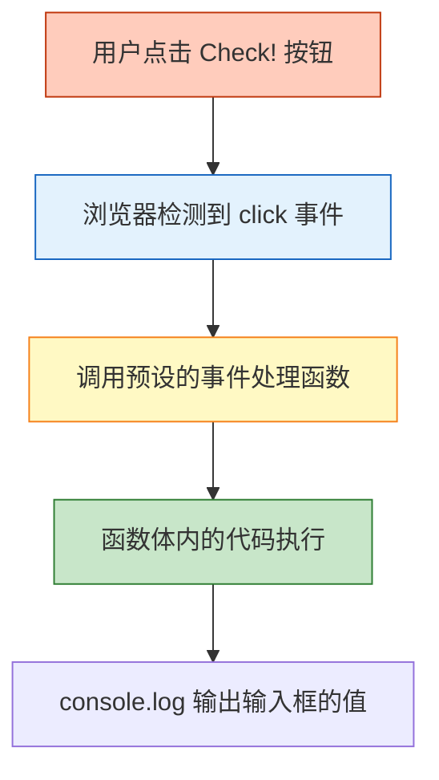
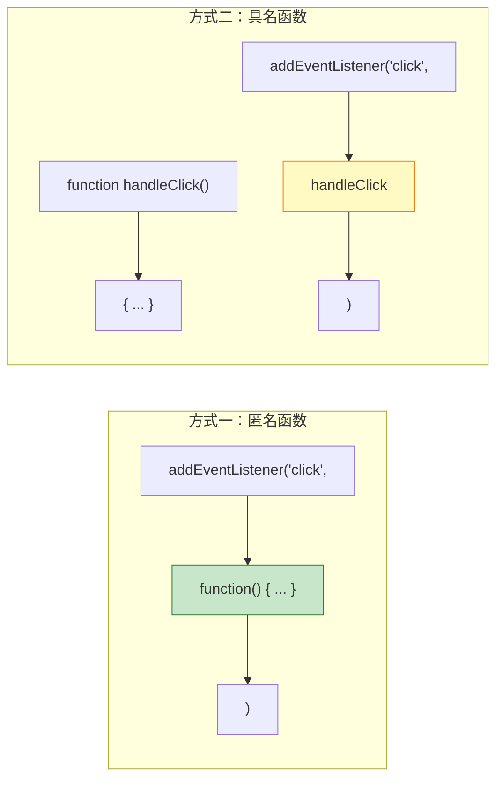
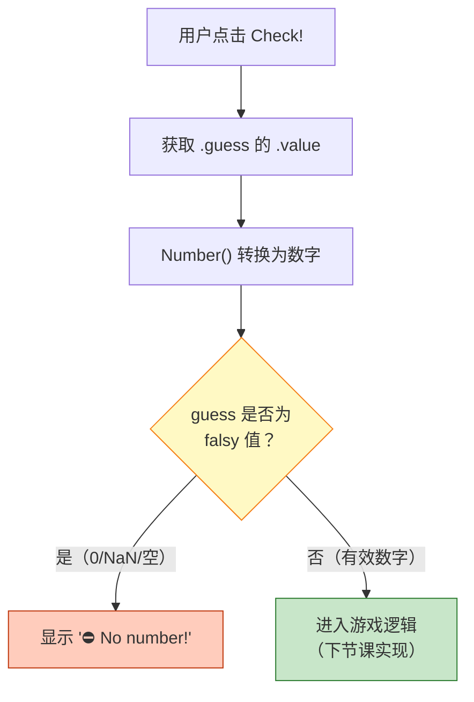
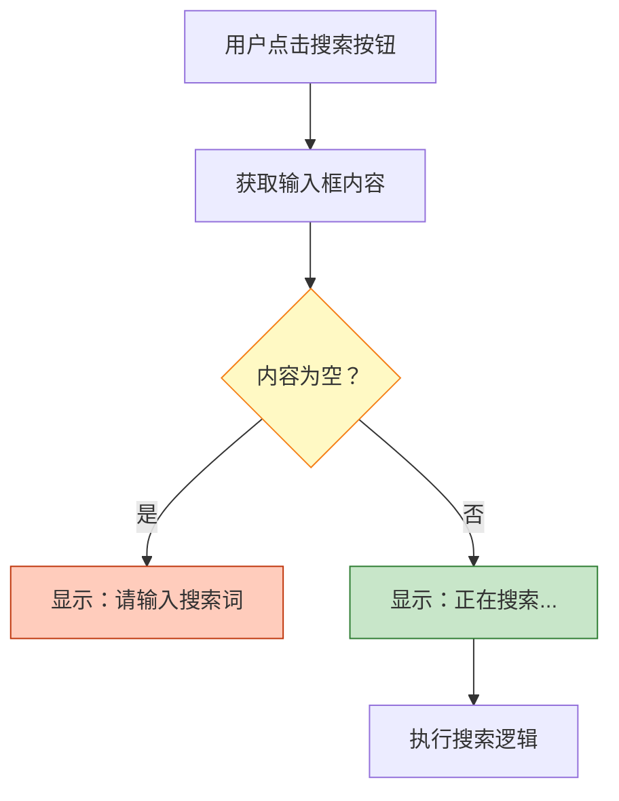

# 处理点击事件

> 📺 来源：006 Handling Click Events.en.srt
> 📂 章节：第 7 章

## 📌 知识脉络
- **前置知识**：`document.querySelector()` 选取元素、`.textContent` 和 `.value` 读写、函数表达式
- **后续扩展**：游戏完整逻辑实现、更多事件类型（键盘事件、表单提交）、事件对象（Event Object）

## 🎯 概述

本节课首次引入 **事件监听器（Event Listener）** 机制。核心是 `addEventListener` 方法，它能让我们"监听"用户的操作（如点击按钮），并在事件发生时执行指定的回调函数。讲师演示了如何监听"Check!"按钮的点击事件、获取输入框中的猜测值，以及处理"无输入"的边界情况。

## 核心知识点

### 1. 事件与事件监听器

> 🧩 **生活类比**：`addEventListener` 就像给门铃装了一个"有人按就自动开门"的装置 —— 你不需要自己一直盯着门（轮询），而是预先设定好"铃响→开门"的规则，铃响了装置自动执行。

**事件（Event）** 是页面上发生的"事情"，比如鼠标点击、键盘按键、页面加载等。**事件监听器** 是一段预设好的代码，当特定事件发生时，浏览器会自动调用它。

```js {runnable} {title="event_listener_basic.js"}
// 基本语法：element.addEventListener('事件类型', 处理函数)

document.querySelector('.check').addEventListener('click', function () {
  console.log(document.querySelector('.guess').value);
});
```



**🔍 执行追踪：addEventListener 的工作机制**

| 步骤 | 时机 | 发生了什么 |
|------|------|-----------|
| ① | 脚本加载时 | `addEventListener` 被调用，注册事件处理函数（但**不执行**函数体） |
| ② | 页面等待中 | 什么也不做，等待用户操作 |
| ③ | 用户点击按钮 | 浏览器触发 `click` 事件 |
| ④ | 事件触发瞬间 | 浏览器自动调用注册的处理函数 |
| ⑤ | 函数执行 | 获取输入值，打印到控制台 |

> 💡 **记忆口诀**：**"注册不调用，点击才执行"** —— `addEventListener` 只是注册，真正的调用权在浏览器手中。

### 2. 匿名函数作为事件处理器

> 🧩 **生活类比**：匿名函数就像告诉外卖平台"送到后直接放门口" —— 你不需要给这条指令起一个名字，它只在此场景下使用一次。

```js {runnable} {title="anonymous_handler.js"}
// 方式一：匿名函数（直接定义，没有名字）
document.querySelector('.check').addEventListener('click', function () {
  console.log('按钮被点击了！');
});

// 方式二：具名函数（可复用）
function handleClick() {
  console.log('按钮被点击了！');
}
document.querySelector('.check').addEventListener('click', handleClick);
// ⚠️ 注意：传的是 handleClick，不是 handleClick()
// 加了括号会立即执行！
```



**📊 匿名函数 vs 具名函数对比：**

| 特性 | 匿名函数 | 具名函数 |
|------|---------|---------|
| 是否有名字 | ❌ 没有 | ✅ 有函数名 |
| 可复用性 | ❌ 只在此处使用 | ✅ 可在多处调用 |
| 传入 addEventListener | `function() { ... }` | `handleClick`（⚠️ 不加括号） |
| 适用场景 | 简单、一次性的处理逻辑 | 复杂逻辑或需要多处复用 |

### 3. 获取并验证用户输入

> 🧩 **生活类比**：就像商店收银员收到钱后首先要验钞 —— 在使用用户输入之前，必须先检查它是否有效（非空、格式正确等）。

```js {runnable} {title="input_validation.js"}
document.querySelector('.check').addEventListener('click', function () {
  // 1. 获取输入值并转为数字
  const guess = Number(document.querySelector('.guess').value);
  console.log(guess, typeof guess);

  // 2. 检查是否有输入（第一道防线）
  if (!guess) {
    // guess 为 0（空输入转换后为 0，0 是 falsy 值）
    document.querySelector('.message').textContent = '⛔ No number!';
  }
});
```



**🔍 执行追踪：`!guess` 的真值判断**

| 输入框内容 | `Number(value)` | `guess` 的值 | Truthy/Falsy | `!guess` | 执行分支 |
|-----------|----------------|-------------|-------------|---------|---------|
| （空白） | `Number("")` | `0` | Falsy | `true` | 显示"⛔ No number!" |
| `"5"` | `Number("5")` | `5` | Truthy | `false` | 进入游戏逻辑 |
| `"abc"` | `Number("abc")` | `NaN` | Falsy | `true` | 显示"⛔ No number!" |

> 💡 **记忆口诀**：**"先验空，再逻辑"** —— 处理用户输入的第一步永远是检查输入是否有效。

---

## 🛠️ 代码实战与真实场景

> **💼 业务场景**：你正在开发一个简易搜索框。用户在输入框中键入关键词，点击"搜索"按钮后，页面显示搜索结果（或提示"请输入搜索词"）。

```js {runnable} {title="search_box.js"}
// 搜索框功能示例

document.querySelector('.btn-search').addEventListener('click', function () {
  // 获取搜索词
  const keyword = document.querySelector('.search-input').value;

  // 验证输入
  if (!keyword) {
    document.querySelector('.result').textContent = '⛔ 请输入搜索关键词！';
    return; // 提前返回，不继续执行
  }

  // 显示搜索结果
  document.querySelector('.result').textContent =
    `🔍 正在搜索：「${keyword}」...`;
  console.log(`用户搜索了: ${keyword}`);
});
```



**📊 输入输出示例：**
| 用户输入 | 点击后页面显示 | 控制台输出 |
|---------|--------------|-----------|
| （空白） | ⛔ 请输入搜索关键词！ | （无） |
| `"JavaScript"` | 🔍 正在搜索：「JavaScript」... | `用户搜索了: JavaScript` |
| `"DOM"` | 🔍 正在搜索：「DOM」... | `用户搜索了: DOM` |

## 💡 关键要点
- ✅ `addEventListener('click', fn)` 将点击事件与处理函数绑定
- ✅ 事件处理函数在注册时**不会执行**，只有事件触发时才由浏览器调用
- ✅ 传入 `addEventListener` 的函数**不加括号** —— 传的是函数值，不是函数调用结果
- ✅ 处理用户输入的第一步永远是**验证有效性**（是否为空、是否合法）
- ✅ `Number("")` 返回 `0`，`0` 是 falsy 值，因此 `!0` 为 `true`

## ⚠️ 常见误区
- ⚠️ 误区 1：在 `addEventListener` 中立即调用函数 —— `addEventListener('click', handleClick())` 会在注册时就执行函数并把返回值传入，正确写法是 `addEventListener('click', handleClick)`
- ⚠️ 误区 2：忘记将 `.value` 转为数字 —— `.value` 总是返回字符串，直接用于数学比较可能产生意外结果

## 🐛 报错实验室
> 主动展示错误写法及报错信息，教你看懂错误提示

**❌ 错误写法：**
```js
// 错误：加了括号，函数会立即执行
document.querySelector('.check').addEventListener('click', console.log('点击了'));
```
**浏览器行为：**
```
页面加载时直接打印 "点击了"
之后点击按钮没有任何反应
```
**🔑 解读**：`console.log('点击了')` 立即执行并返回 `undefined`，相当于 `addEventListener('click', undefined)`。正确做法是用函数包裹：
```js
addEventListener('click', function() { console.log('点击了') })
```

---

## 📖 词汇速查表 (Cheat Sheet)
| 中文术语 | 英文术语 | 简明释义 | 速查代码 | 📚 官方文档 |
|---------|---------|---------|---------|-----------|
| 事件监听器 | addEventListener | 在元素上注册事件处理函数 | `el.addEventListener('click', fn)` | [MDN](https://developer.mozilla.org/zh-CN/docs/Web/API/EventTarget/addEventListener) |
| 点击事件 | click event | 用户点击元素时触发 | `'click'` | [MDN](https://developer.mozilla.org/zh-CN/docs/Web/API/Element/click_event) |
| 事件处理函数 | Event Handler | 事件触发时自动执行的回调函数 | `function() { ... }` | [MDN](https://developer.mozilla.org/zh-CN/docs/Web/Events/Event_handlers) |
| 匿名函数 | Anonymous Function | 没有名字的函数表达式 | `function() { }` | [MDN](https://developer.mozilla.org/zh-CN/docs/Web/JavaScript/Reference/Functions) |
| 取反运算符 | NOT operator (!) | 将 truthy 转为 false，falsy 转为 true | `!value` | [MDN](https://developer.mozilla.org/zh-CN/docs/Web/JavaScript/Reference/Operators/Logical_NOT) |

---

## 🧪 学习验证

### 📝 动手练习

**练习 1：监听按钮点击并修改文本**
```js {runnable} {title="exercise1.js"}
// 选取 class="check" 的按钮
// 监听点击事件
// 点击时将 class="message" 的文本改为 "按钮被点击了！"
// 在这里写你的代码
```
<details><summary>💡 参考答案</summary>

```js
document.querySelector('.check').addEventListener('click', function () {
  document.querySelector('.message').textContent = '按钮被点击了！';
});
```
**解题思路**：三步走 —— ① querySelector 选取按钮，② addEventListener 监听 click，③ 在回调函数中修改 .message 的 textContent。
</details>

**练习 2：输入验证**
```js {runnable} {title="exercise2.js"}
// 点击按钮后：
// 1. 获取输入框 (.guess) 的值
// 2. 如果为空，显示 "请先输入数字！"
// 3. 如果有值，显示 "你输入了: [值]"
// 在这里写你的代码
```
<details><summary>💡 参考答案</summary>

```js
document.querySelector('.check').addEventListener('click', function () {
  const guess = Number(document.querySelector('.guess').value);

  if (!guess) {
    document.querySelector('.message').textContent = '请先输入数字！';
  } else {
    document.querySelector('.message').textContent = `你输入了: ${guess}`;
  }
});
```
**解题思路**：先用 `Number()` 转换输入值，再用 `!guess` 检查是否为 falsy 值（0/NaN），根据结果分支处理。
</details>

### ❓ 理解检测

:::quiz {correct="C"}
**1. `addEventListener` 的第二个参数应该传入什么？**
- A) 一个字符串
- B) 一个数字
- C) 一个函数
- D) 一个 DOM 元素

> **解析**：第二个参数是事件处理函数（event handler），当事件触发时浏览器会自动调用它。函数本质上也是一个值，可以作为参数传递。
:::

:::quiz {correct="B"}
**2. 以下代码中，`handleClick` 函数何时被执行？**
```js
document.querySelector('.btn').addEventListener('click', handleClick);
```
- A) 脚本加载时立即执行
- B) 用户点击 `.btn` 元素时执行
- C) 页面渲染完成后执行
- D) 永远不会执行

> **解析**：`addEventListener` 只是注册函数，不会立即调用。只有当用户点击 `.btn` 元素触发 `click` 事件时，浏览器才会调用 `handleClick`。
:::

:::quiz {correct="A"}
**3. `Number("")` 的返回值是什么？**
- A) `0`
- B) `NaN`
- C) `undefined`
- D) `""`

> **解析**：`Number("")` 将空字符串转换为 `0`。而 `Number("abc")` 才会返回 `NaN`。`0` 是 falsy 值，这就是为什么空输入时 `!guess` 为 `true`。
:::

### 🔧 代码填空

:::fill-blank
// 监听 Check 按钮的点击事件
document.querySelector('.check').___addEventListener___('___click___', function () {
  // 获取输入值并转为数字
  const guess = ___Number___(document.querySelector('.guess').value);
  // 如果没有输入
  if (___!guess___) {
    document.querySelector('.message').textContent = '⛔ No number!';
  }
});
:::
