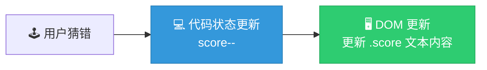
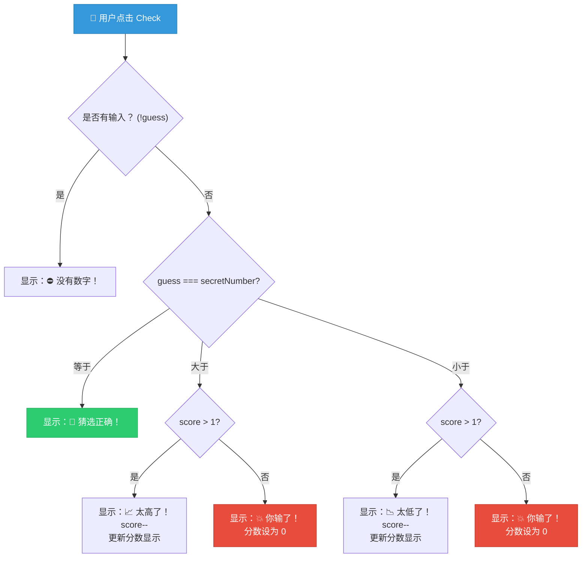

# 实现游戏核心逻辑

> 📺 来源：007 Implementing the Game Logic.en.srt
> 📂 章节：第 07 章

## 📌 知识脉络
- **前置知识**：DOM 元素选择与文本修改、点击事件监听（Event Listener）、`if...else if` 条件判断
- **后续扩展**：CSS 样式操作（DOM 样式操作）、高分记录（Highscore）逻辑、代码重构（DRY 原则）

## 🎯 概述
本节课的核心是利用条件判断实现“猜数字”游戏的完整逻辑分支。我们将学习如何生成随机的秘密数字，引入**状态变量（State Variable）**来管理游戏分数，并处理猜中、猜高、猜低以及游戏失败（分数归零）等多种场景。

## 核心知识点

### 1. 生成随机数字与作用域隔离
> 🧩 **生活类比**：在一场有主持人的猜数字游戏中，主持人必须在游戏**开始前**就把神秘数字写在纸上，而不是每次玩家开口猜的时候，主持人都重新想一个新数字。

在代码中，我们不能将生成秘密数字的逻辑写在点击事件的函数内部，否则每次点击按钮都会生成一个新的秘密数字，游戏就毫无意义了。

```js
// 必须在事件监听器外部生成神秘数字（只生成一次）
const secretNumber = Math.trunc(Math.random() * 20) + 1;

// 仅在开发测试阶段显示秘密数字
document.querySelector('.number').textContent = secretNumber;

document.querySelector('.check').addEventListener('click', function() {
  const guess = Number(document.querySelector('.guess').value);
  // ... 比较逻辑
});
```

**📊 `Math.random()` 到 1-20 整数的演变表：**

| 代码片段 | 返回值范围 | 说明 |
|------|------|------|
| `Math.random()` | `0.000...` 到 `0.999...` | 生成 0 到 1 之间（不含 1）的随机小数 |
| `Math.random() * 20` | `0.000...` 到 `19.999...` | 放大 20 倍 |
| `Math.trunc(...)` | `0` 到 `19` | 截断小数部分，保留整数 |
| `Math.trunc(...) + 1` | `1` 到 `21`（实际上不会到 21，因为 trunc 的结果最大是 19，加 1 后范围是 1 到 20） | 加 1 使得范围变为 1 到 20 |

> 💡 **记忆口诀**：先随机，后放大，截小数，再加一。

---

### 2. 状态变量（State Variable）与数据驱动
> 🧩 **生活类比**：玩街机游戏时，虽然屏幕上显示了你的得分（DOM），但游戏主板的内存里一定也存着你的真实分数（State）。不能仅靠“看着屏幕念分数”来判断输赢。

我们将分数保存在 JavaScript 代码中的一个变量里，而不是每次都去读取 DOM 里的文本。这种变量被称为**状态变量（State Variable）**。



```js
// 初始状态变量定义
let score = 20;

document.querySelector('.check').addEventListener('click', function() {
  const guess = Number(document.querySelector('.guess').value);
  
  // 当猜错时...
  if (guess !== secretNumber) {
    if (score > 1) {
      score--; // 更新代码中的状态
      document.querySelector('.score').textContent = score; // 同步到 DOM
    } else {
      document.querySelector('.message').textContent = '💥 你输了！';
      document.querySelector('.score').textContent = 0;
    }
  }
});
```

**🔍 执行追踪（猜测错误的场景）：**
1. 初始 `score` 为 20
2. 玩家猜错，判断 `score > 1` (20 > 1) 成立
3. `score--`，`score` 变为 19
4. 执行 `document.querySelector('.score').textContent = 19`
5. （重复 18 次后）当 `score` 为 1 时，玩家再次猜错
6. 判断 `score > 1` (1 > 1) 不成立，进入 `else` 分支
7. 显示“💥 你输了！”，分数文本重置为 0

---

## 🛠️ 代码实战与真实场景

> **💼 业务场景**：实现“猜数字”游戏的完整比较逻辑。包含边界检查（没有输入）、猜中、猜高、猜低，以及生命值扣除到 0 时的失败判定。

```js {runnable} {title="game_logic.js"}
// 生成秘密数字（1 到 20）
const secretNumber = Math.trunc(Math.random() * 20) + 1;
// 状态变量：分数
let score = 20;

document.querySelector('.check').addEventListener('click', function () {
  const guess = Number(document.querySelector('.guess').value);

  // 场景 1：没有输入
  if (!guess) {
    document.querySelector('.message').textContent = '⛔ 没有数字！';
  
  // 场景 2：玩家胜利
  } else if (guess === secretNumber) {
    document.querySelector('.message').textContent = '🎉 猜选正确！';
  
  // 场景 3：猜得太高
  } else if (guess > secretNumber) {
    if (score > 1) {
      document.querySelector('.message').textContent = '📈 太高了！';
      score--;
      document.querySelector('.score').textContent = score;
    } else {
      document.querySelector('.message').textContent = '💥 你输了！';
      document.querySelector('.score').textContent = 0;
    }

  // 场景 4：猜得太低
  } else if (guess < secretNumber) {
    if (score > 1) {
      document.querySelector('.message').textContent = '📉 太低了！';
      score--;
      document.querySelector('.score').textContent = score;
    } else {
      document.querySelector('.message').textContent = '💥 你输了！';
      document.querySelector('.score').textContent = 0;
    }
  }
});
```



## 💡 关键要点
- ✅ 秘密数字必须在事件监听器**外部**生成，保证整个游戏过程中只有唯一一个正确答案。
- ✅ **状态变量（State Variable）**是应用中非常重要的概念，所有相关数据（如分数、秘密数字）应存储在代码变量中，而不只是在 DOM 中显示。
- ✅ `score--` 是 `score = score - 1` 的简写，常用于递减操作。
- ✅ 嵌套 `if...else` 语句可用于处理多层逻辑分支，例如在“猜错”的前提下再判断“分数是否大于 1”。

## ⚠️ 常见误区
- ⚠️ **误区 1：在点击事件中生成随机数**。如果把 `Math.random()` 放到 `addEventListener` 回调函数中，每次点击都会换一个新答案，玩家永远摸不透。
- ⚠️ **误区 2：使用 `const` 声明分数**。因为分数在游戏过程中会减少（被重新赋值），所以必须使用 `let score = 20`，如果使用 `const` 会报错。

## 🐛 报错实验室
> 错误地将不断变化的数据用 `const` 声明，是新手使用状态变量时的通病。

**❌ 错误写法：**
```js
const score = 20;

document.querySelector('.check').addEventListener('click', function () {
  // ... 其他逻辑
  score--; // 尝试修改常量
});
```
**浏览器报错：**
```
TypeError: Assignment to constant variable.
```
**🔑 解读**：`const` 声明的变量是不可修改（Immutable）的。`score--` 本质上是给 `score` 重新赋值，因此必须将声明方式改为 `let`。

---

## 📖 词汇速查表 (Cheat Sheet)

| 中文术语 | 英文术语 | 简明释义 | 速查代码 | 📚 官方文档 |
|---------|---------|---------|---------|-----------|
| 截断小数 | Math.trunc() | 去除数字的小数部分，仅保留整数 | `Math.trunc(19.99) // 19` | [MDN](https://developer.mozilla.org/en-US/docs/Web/JavaScript/Reference/Global_Objects/Math/trunc) |
| 随机数 | Math.random() | 生成 0 到 1 之间的伪随机小数 | `Math.random()` | [MDN](https://developer.mozilla.org/en-US/docs/Web/JavaScript/Reference/Global_Objects/Math/random) |
| 状态变量 | State Variable | 在代码内存中持有应用状态的数据 | `let score = 20;` | — |

---

## 🧪 学习验证

### 📝 动手练习

**练习 1：生成指定范围内的随机整数**
```js {runnable} {title="exercise1.js"}
// 编写一个函数，接收两个参数 min 和 max
// 返回包含 min 和 max 的随机整数
function getRandomInt(min, max) {
  // 在这里写你的代码
}

console.log(getRandomInt(5, 10)); // 可能输出 5, 6, 7, 8, 9, 10 中的任意一个
```
<details><summary>💡 参考答案</summary>

```js
function getRandomInt(min, max) {
  return Math.trunc(Math.random() * (max - min + 1)) + min;
}
```
**解题思路**：`Math.random()` 生成 0~0.99，乘以 `(max - min + 1)` 将范围扩展。`Math.trunc` 取整后范围变为 `0` 到 `max - min`。最后加上 `min`，将整个区间平移至 `min` 到 `max`。
</details>

**练习 2：重构重复代码的思考**
仔细观察本节课实战中的“猜得太高”和“猜得太低”两段代码。
```js {runnable} {title="exercise2.js"}
// 你能发现如下两个代码块之间的相似之处吗？
// 如何用一句人类语言描述可以怎么合并它们？

// 代码块A：
} else if (guess > secretNumber) {
    if (score > 1) {
      document.querySelector('.message').textContent = '📈 太高了！';
      score--;
      document.querySelector('.score').textContent = score;
    } else { // ... }
}

// 代码块B：
} else if (guess < secretNumber) {
    if (score > 1) {
      document.querySelector('.message').textContent = '📉 太低了！';
      score--;
      document.querySelector('.score').textContent = score;
    } else { // ... }
}
```
<details><summary>💡 参考答案</summary>

除了输出的提示文本（'📈 太高了！' 或 '📉 太低了！'），以及入口的条件 (`guess > secretNumber` vs `guess < secretNumber`) 外，其余所有的业务逻辑（判定 `score > 1`、自减、更新 DOM、失败提示）是完全一模一样的（违反了 DRY 原则）。
**重构思路**：可以将条件合并为 `guess !== secretNumber`（只要猜错了），然后在内部专门决定要显示哪句提示语，以此来消除整块冗余的逻辑结构。后面章节会教大家如何利用这种思路重构代码。
</details>

### ❓ 理解检测

:::quiz {correct="C"}
**1. 关于状态变量（State Variable），下列说法正确的是？**
- A) 我们应该每次都从 HTML DOM 元素中读取数据并进行计算
- B) 状态变量必须用 `const` 声明以防被意外修改
- C) 它是在 JavaScript 代码中保存应用数据的一种方式，以便代码随时知晓当前的进度（如分数）

> **解析**：正确做法是将应用的数据作为状态保存在代码变量中，当发生变化后，再将新的状态“镜像”更新到 DOM 界面中。这种代码与显示分离的思想在现代应用开发中至关重要。
:::

:::quiz {correct="A"}
**2. 若我们要生成 1 到 50 的随机整数，正确的代码是？**
- A) `Math.trunc(Math.random() * 50) + 1`
- B) `Math.trunc(Math.random() * 51)`
- C) `Math.random(1, 50)`

> **解析**：`Math.random() * 50` 产生 `0` 到 `49.99` 的数值，经过 `Math.trunc` 截断后为 `0` 到 `49`，加 1 后范围正是 `1` 到 `50`。
:::

:::quiz {correct="B"}
**3. 为什么秘密数字 `secretNumber` 需要在事件监听器外部声明？**
- A) 因为它是一个常量（`const`）
- B) 以确保游戏每次运行只生成一个固定的神秘数字
- C) 因为事件监听器内无法使用 `Math.random()`

> **解析**：事件监听器会在每次尝试时执行。如果把逻辑放内部，每次验证按钮点击后答案都在随之改变，游戏将由于缺乏固定的判断标准而无法游玩。
:::

### 🔧 代码填空

:::fill-blank
// 玩家猜错了，扣除 1 分
let score = 20;

if (guess !== secretNumber) {
  ___score--___; // 或 score = score - 1
  document.querySelector('.score').___textContent___ = score;
}
:::
