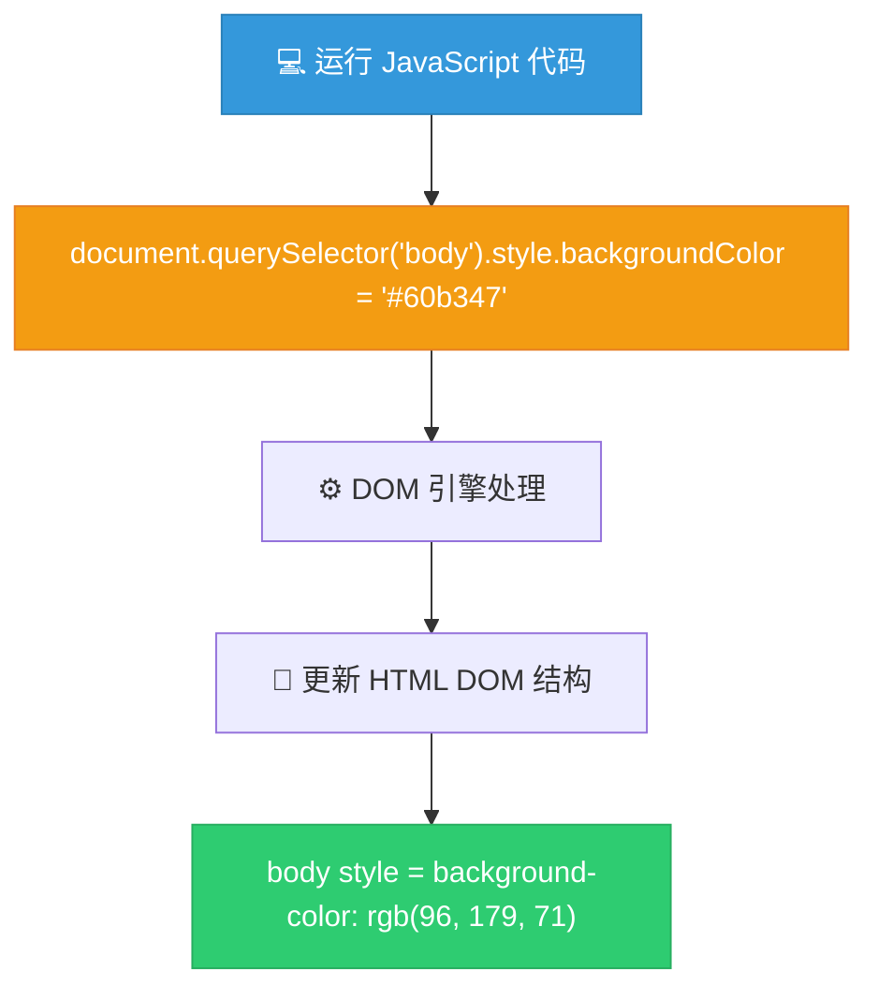

# 操纵 CSS 样式

> 📺 来源：008 Manipulating CSS Styles.en.srt
> 📂 章节：第 07 章

## 📌 知识脉络
- **前置知识**：DOM 元素选择 (`document.querySelector`)、元素的文本内容操作 (`textContent`)
- **后续扩展**：通过操作 CSS 类来切换复杂样式 (`classList.add / remove`)

## 🎯 概述
本节课我们将学习如何使用 JavaScript 动态修改网页的 CSS 样式。我们将学到最重要的三个规则：使用 `.style` 属性、采用小驼峰命名法（Camel Case）表示 CSS 属性名，以及所有样式值必须作为字符串传递，并带上必要的单位。

## 核心知识点

### 1. 样式属性的三大核心规则
> 🧩 **生活类比**：如果 CSS 是一份“装修规范白皮书”，JavaScript 就是那个现场拿着对讲机的“包工头”。包工头下达指令时有自己的沟通术语（小驼峰命名法），且必须把话说满（必须带上包含单位的字符串）。

在 JavaScript 中修改样式与在 CSS 文件中编写规则有三点显著不同：
1. **必须通过 `.style` 访问**：不能直接修改属性，必须先进入到元素的 `style` 对象中。
2. **小驼峰命名法（Camel Case）**：在 CSS 中带有连字符（`-`）的属性（如 `background-color`），在 JS 中必须写成驼峰形式（`backgroundColor`）。
3. **值必须是字符串**：即使是一个数字宽度，也必须写成带单位的字符串，如 `'30rem'`，不能直接传 `30`。

```js
// 选择 body 元素，不需要带点号（点号是给 class 用的）
document.querySelector('body').style.backgroundColor = '#60b347'; // 正确：驼峰写法 + 字符串包裹
```

**📊 CSS 到 JavaScript 属性映射表：**

| CSS 书写方式 | JavaScript 书写方式 | 错误写法（会报错或无效） |
|-------------|--------------------|------------------------|
| `background-color: #60b347;` | `.style.backgroundColor = '#60b347'` | `.style.background-color` |
| `font-size: 20px;` | `.style.fontSize = '20px'` | `.style.fontSize = 20` |
| `margin-top: 5rem;` | `.style.marginTop = '5rem'` | `.style.marginTop = '5';` |
| `width: 30rem;` | `.style.width = '30rem'` | `.style.width = 30` |

> 💡 **记忆口诀**：点 style，去减号大写字母，值加引号带单位。

---

### 2. 内联样式的本质（Behind the Scenes）
> 🧩 **生活类比**：在 CSS 文件中写样式，就像在图纸上统一规划房间的颜色；而在 JS 中直接修改样式，就像在某个特定的墙面上直接贴上了一张“覆盖贴纸”。

当我们在 JavaScript 中使用 `.style` 修改元素样式时，我们并非修改了实际的 CSS 文件。实际上，这是直接在 HTML 标签上注入了**内联样式（Inline Styles）**。



**🔍 执行追踪：**
1. 开发者在 JS 中执行：`document.querySelector('.number').style.width = '30rem';`
2. 浏览器找到 class 为 `number` 的元素。
3. 浏览器在该 HTML 元素上插入 `style` 属性。
4. HTML 在开发者工具中变为 `<div class="number" style="width: 30rem;">12</div>`。
5. 因内联样式的优先级极高，这会直接覆盖 CSS 文件中原有的宽度设置。

---

## 🛠️ 代码实战与真实场景

> **💼 业务场景**：我们需要在“猜数字”游戏中，当玩家猜中正确的秘密数字（获胜）时，将整个页面的背景修改为代表胜利的绿色，同时将猜中的神秘数字的显示框左右拉宽，以提供更强烈的视觉反馈。

```js {runnable} {title="victory_style.js"}
// 假设这是游戏赢了的条件分支
if (guess === secretNumber) {
  // 1. 显示获胜文本
  document.querySelector('.message').textContent = '🎉 猜选正确！';
  
  // 2. 将整个页面的背景色改为绿色（修改 body 元素）
  document.querySelector('body').style.backgroundColor = '#60b347';
  
  // 3. 将居中的神秘数字框变宽（从 15rem 变为 30rem）
  document.querySelector('.number').style.width = '30rem';
}
```

## 💡 关键要点
- ✅ 访问元素的 CSS 属性必须经过 `.style` 属性层级。
- ✅ 任何包含连字符的 CSS 属性在 JavaScript 中必须转换为**小驼峰命名法（Camel Case）**。
- ✅ 所有的样式值都**必须作为字符串**赋值，哪怕它只包含一个数字时也必须如此，并强制包含原始 CSS 单位（如 `px`, `rem`, `%` 等）。
- ✅ JS 操作样式本质上是添加了最高优先级的**内联样式**，这并不会改变你的原版 `.css` 文件的内容。

## ⚠️ 常见误区
- ⚠️ **误区 1：在属性名中直接写破折号**。在 JS 中写 `element.style.background-color` 是语法错误，因为 `-` 会被解析成减法运算符。
- ⚠️ **误区 2：忘记给数值加单位字符串**。写 `element.style.width = 30` 在绝大多数情况下都不起作用，浏览器不知道你指的是 30px、30rem 还是 30%。必须加上引号和单位 `'30rem'`。

## 🐛 报错实验室
> 在学习阶段，忘记 CSS 属性在 JS 中的正确写法是导致样式无法渲染的最大原因。

**❌ 错误写法：**
```js
document.querySelector('body').style.background-color = '#60b347';
```
**浏览器报错：**
```
Uncaught ReferenceError: Invalid left-hand side in assignment
```
**🔑 解读**：在 JavaScript 中，连字符 `-` 就是减法运算符。当你写 `style.background-color` 时，JS 引擎试图执行“`style.background` 减去 `color` 变量的值”，而算术运算结果不能作为等号左边被赋值，因此导致了无效左值赋值错误（Invalid left-hand side in assignment）。务必改为小驼峰命名法 `backgroundColor`。

---

## 📖 词汇速查表 (Cheat Sheet)

| 中文术语 | 英文术语 | 简明释义 | 速查代码 | 📚 官方文档 |
|---------|---------|---------|---------|-----------|
| 样式对象 | style | 代表元素上的所有内联样式声明的对象 | `.style` | [MDN](https://developer.mozilla.org/en-US/docs/Web/API/HTMLElement/style) |
| 小驼峰命名法 | Camel Case | 第一个单词首字母小写，后续单词首字母大写 | `backgroundColor` | — |
| 内联样式 | Inline Styles | 直接写在 HTML 标签属性中的 CSS 样式 | `style="color: red;"` | — |

---

## 🧪 学习验证

### 📝 动手练习

**练习 1：利用 JS 修改一个元素的排版边界**
```js {runnable} {title="exercise1.js"}
// 假设你有一个 class 为 `box` 的元素。
// 请编写代码，使用 JS 将它的上外边距（margin-top）修改为 5 倍的 rem 距离。

// 在这里写你的代码
```
<details><summary>💡 参考答案</summary>

```js
document.querySelector('.box').style.marginTop = '5rem';
```
**解题思路**：首先选中元素 `document.querySelector('.box')`，访问 `.style` 属性。需要修改上边距 `margin-top`，必须转化为小驼峰 `marginTop`。最后，确保赋值的内容是一个包含单位的字符串 `'5rem'`。
</details>

**练习 2：动态修饰按钮**
```js {runnable} {title="exercise2.js"}
// 选取一个页面上名为 'button' 的 HTML 标签。
// 请将这个按钮的背景色改成黑色（'#000'），字体大小改为 '24px'，以及字体颜色改成白色（'white'）。

// 操作背景色
// 操作字体颜色
// 操作字体大小
```
<details><summary>💡 参考答案</summary>

```js
const btn = document.querySelector('button');
btn.style.backgroundColor = '#000';
btn.style.color = 'white';
btn.style.fontSize = '24px';
```
**解题思路**：如果有多个样式要改，最好先把元素存入一个变量 `btn`。然后分别针对 `backgroundColor`、`color`、`fontSize` 赋予包含相应单位的字符串值。
</details>

### ❓ 理解检测

:::quiz {correct="A"}
**1. 在 JavaScript 中修改 CSS 样式时产生的结果是如何体现在 DOM 里的？**
- A) 以内联样式（Inline Styles）的形式（`style="..."`）直接加被选中的 HTML 标签上
- B) JavaScript 引擎会去修改项目里的 `.css` 文件源代码
- C) 它会生成一个新的 `<style>` 标签并插入到 HTML `<head>` 里面

> **解析**：通过 `.style` 操作会直接把 CSS 作为内联样式套在目标 HTML 元素标签上，并不会触碰你的外部样式表内容。
:::

:::quiz {correct="C"}
**2. 若我们要用 JS 把某个元素的字体大小设置为 20 像素，正确的写法是？**
- A) `document.querySelector('.text').style.font-size = '20px';`
- B) `document.querySelector('.text').style.fontSize = 20;`
- C) `document.querySelector('.text').style.fontSize = '20px';`

> **解析**：A 错误是因为带有连字符；B 错误是因为值必须是字符串，且不能缺失单位。C 的驼峰加上带有单位的字符串是完美的。
:::

:::quiz {correct="B"}
**3. 当我们要选中整个网页的核心可见内容区（`body`）并改掉其背景时，我们应该传入 `querySelector` 哪个字符串选择器？**
- A) `'.body'`
- B) `'body'`
- C) `'#body'`

> **解析**：由于 `body` 属于原生的 HTML 元素标签名称（并不是 CSS 类或者 ID），因此在 CSS 选择器语法里直接传入元素名称字符串 `'body'` 即可，不需要任何点号或井号作为前缀。
:::

### 🔧 代码填空

:::fill-blank
// 玩家因为猜错过多输掉了游戏，你想让背景变成红色 ('red') 并调整大标题 ('h1') 的文字为粉红 ('pink')
document.querySelector('body').___style___.backgroundColor = 'red';
document.querySelector('h1').style.___color___ = 'pink';
:::
