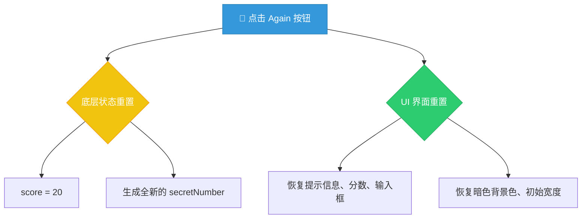

# 🏆 挑战 #1：实现游戏重置功能

> 📺 来源：009 CHALLENGE #1.en.srt
> 📂 章节：第 07 章

## 📌 知识脉络
- **前置知识**：事件监听器 (`addEventListener`)、CSS 样式修改 (`.style`)、DOM 文本操作 (`textContent` 和 `value`)、状态变量（State Variable）的概念
- **后续扩展**：高分记录保留机制（Highscore）、不同项目间的数据隔离机制

## 🎯 概述
这是本项目中的第一个独立代码挑战！在本节课中，你需要实现“再玩一次”（Again）按钮的完整功能。该功能允许玩家在不刷新浏览器页面的情况下，将游戏的 UI 界面和底层的代码状态全部“恢复出厂设置”。

## 核心知识点

### 1. 代码状态恢复 vs 页面刷新
> 🧩 **生活类比**：在一块黑板上画画，画错了想重来。页面刷新就像是直接换一块全新的黑板；而**代码层面的状态恢复**就像用黑板擦把你画错的地方擦掉，保留角落里记分牌上的其他内容（比如历史最高分）。

如果我们简单粗暴地通过刷新页面来重置游戏，由于当前没有连接数据库等外部存储机制，我们将丢失 JS 内存中的所有的历史数据（比如玩家在此前创下的 Highscore 高分记录）。因此，我们必须**手动使用 JavaScript 代码将一切恢复原状**。



**🔍 执行追踪（重置过程）：**
1. 玩家获胜，背景变绿，方块变宽。
2. 玩家点击 Again 按钮。
3. `score` 变量被重置为 20。
4. `secretNumber` 经历 `Math.trunc(Math.random() * 20) + 1` 获取到全新的随机数。
5. 显示文本与样式被逐个还原至初始状态。

---

### 2. 匿名事件处理函数 (Anonymous Function)
> 🧩 **生活类比**：有些工具你只会用并在固定在某个特定的操作台上，不需要给它在库房贴上专门的名字标签；而有些通用工具你要在多个房间用，就需要贴上名字好好保管。

在事件监听的第二个实参中，我们传入了一个没有定义函数名的函数，这种函数被称为**匿名函数（Anonymous Function）**。

```js
// 这是一个普通的命名函数
function resetGame() { /* ... */ }

// 这个是没有名字的匿名函数，通常作为参数“即插即用”
document.querySelector('.again').addEventListener('click', function() {
  // 这是匿名函数的函数体
});
```

**📊 状态重置前后对比表：**

| 元素 / 变量 | 游戏进行中或获胜后状态 | 点击 Again 后应恢复的初始状态 |
|------------|-----------------------|-------------------------|
| `score` 变量 | 随时变动（比如 13） | `20` |
| `secretNumber` | 已经被猜出的旧数字 | 全新生成的 1-20 随机整数 |
| `.message` 文本 | 🎉 猜选正确！等 | 💬 开始猜测... (Start guessing...) |
| `.score` 文本 | 13 | `20` |
| `.number` 文本 | 12 | `?` |
| `.guess` 值 | '12' | `''` (空字符串) |
| `.body` 背景色 | `#60b347` (绿色) | `#222` (深灰色) |
| `.number` 宽度 | `30rem` | `15rem` |

> 💡 **记忆口诀**：状态清零换新数，文案清空换颜色。

---

## 🛠️ 代码实战与真实场景

> **💼 业务场景**：你需要根据上述的对比表，编写“Again”按钮的点击事件监听器，并在其内部手动将所有的变量、文本和样式全部恢复到游戏刚启动时的状态。

### 📋 挑战任务拆解 (Tasks)
1. 选择处于 class 为 `again` 的按钮，并绑定 `click` 事件处理函数。
2. 在该函数中，重置 `score` 到 20 并为 `secretNumber` 生成新的随机数。
3. 恢复 `.message`, `.number`, `.score` 的初始文本结构，并将 `.guess` 输入框置空。
4. 将背景颜色恢复成 `#222`，将数字方块宽度恢复到 `15rem`。

### 👨‍💻 挑战考场沙盒（请先独立尝试）

```js {runnable} {title="challenge_sandbox.js"}
// 【考前提示】
// 因为我们需要在事件监听器中重新给神秘数字赋值，所以你需要将原先放置在外部顶级作用链中、用 const 声明的 secretNumber 改为 let。
// let secretNumber = Math.trunc(Math.random() * 20) + 1;
// let score = 20;

// 👇 请在下方写入你的挑战代码：
document.querySelector('.again').addEventListener('click', function () {
  // 1. 恢复状态变量
  
  
  // 2. 恢复 DOM 文本和输入框
  
  
  // 3. 恢复 CSS 样式
  
});
```

<details><summary>💡 Jonas 官方解法揭秘（点击展开）</summary>

```js
document.querySelector('.again').addEventListener('click', function () {
  // 1. 恢复状态变量：重新生成秘密数字，分数回归 20
  score = 20;
  secretNumber = Math.trunc(Math.random() * 20) + 1;
  
  // 2. 恢复 DOM 文本和输入框的值
  document.querySelector('.message').textContent = '开始猜测...';
  // 这里巧妙利用了同步好的变量，而不是写死的 '20'
  document.querySelector('.score').textContent = score; 
  document.querySelector('.number').textContent = '?';
  document.querySelector('.guess').value = ''; // 将 input 的 value 设为空字符串
  
  // 3. 恢复 CSS 样式：背景变灰，宽度缩小
  document.querySelector('body').style.backgroundColor = '#222';
  document.querySelector('.number').style.width = '15rem';
});
```
**🧠 思考链路追踪**：
- `score` 是提前定义好的 `let` 变量，无需加 `let` 再次声明，直接赋值即可。`secretNumber` 同理，但不要忘记把最顶部原来的 `const` 调整为 `let`。
- 不要尝试刷新页面 `location.reload()`，这会被判定为“作弊”做法，因为未来将要加入用于保存历史最高分的其他变量。
- `input` 元素获取内容的是其专属的 `value` 属性，所以清空的正确方式是为其赋值一个空字符串 `''`。
</details>

## 💡 关键要点
- ✅ 恢复出厂设置不等于刷新浏览器，在单页面应用体验下，我们通常使用 JavaScript 手动维护与重置内存状态体系。
- ✅ 在事件监听器中充当回调用途且无需额外名字的函数，被称为匿名函数（Anonymous Function）。
- ✅ 重置表单输入控件（如文本框 `<input class="guess" />`）的最佳实践是将其 `value` 赋值为 `''`（空字符串）。
- ✅ 当发现某个原本被假定不需要变化的常量在业务迭代后存在重新赋值机制时，必须追查并将其底层的 `const` 声明重构为 `let`。

## ⚠️ 常见误区
- ⚠️ **误区 1：再次用 `let` 声明**。在重置代码中写 `let score = 20`。这会在事件处理块的作用域内创建一个全新的影子变量（Shadowing），而**没有真正修改到外部代表游戏状态的全局 `score` 变量**。应当直接用 `score = 20` 覆盖原有变量的值。
- ⚠️ **误区 2：企图通过重写 `textContent` 来清空表单输入框**。`<input>` 属于特定表单结构标签，它的显示内容保存在特有的 `value` 属性上。对其写 `textContent` 将不起任何直接效果。

## 🐛 报错实验室
> 在重置 `secretNumber` 时，非常容易遭遇到常量不可动态修改的报错。

**❌ 错误写法：**
```js
// 在代码最顶部的声明
const secretNumber = Math.trunc(Math.random() * 20) + 1;

// 在 again 事件中试图给它换个新数字
document.querySelector('.again').addEventListener('click', function () {
  secretNumber = Math.trunc(Math.random() * 20) + 1; 
});
```
**浏览器报错：**
```
Uncaught TypeError: Assignment to constant variable.
```
**🔑 解读**：`const` 意味着一旦你给它赋予了初始目标，其内存地址的指向就被引擎锁死了。一开始我们认为 `secretNumber` 在单次游戏中不会改变，所以使用 `const` 是合理的；但后来为了完成“再玩一次”的功能逻辑，其生命周期变长了。我们需在重新开启新游戏环节给该变量喂入新值，因此必须返回文件顶部，将其声明的关键字从 `const` 松绑为 `let` 允许读写。

---

## 📖 词汇速查表 (Cheat Sheet)

| 中文术语 | 英文术语 | 简明释义 | 速查代码 | 📚 官方文档 |
|---------|---------|---------|---------|-----------|
| 匿名函数 | Anonymous Function | 没有明确绑定单独标识符的函数块 | `function() { ... }` | [MDN](https://developer.mozilla.org/en-US/docs/Web/JavaScript/Reference/Functions#anonymous_functions) |
| 空字符串 | Empty String | 不包含任何字符节点的字符串，常用于表单重置 | `''` | — |
| 值属性 | value | 用于获取或直接设置表单控件（例如 `<input>`）的内容文本 | `.value = ''` | [MDN](https://developer.mozilla.org/en-US/docs/Web/API/HTMLInputElement/value) |

---

## 🧪 学习验证

### 📝 动手练习

**练习 1：利用状态数据同步更新 UI（数据驱动雏形）**
```js {runnable} {title="exercise1.js"}
// 假设有如下简单的角色扮演 HTML：
// <p class="lives">3</p>  
// <button class="hit">命中受伤</button>

// 请在不刷新界面的前提下，完成点击“命中受伤”按钮让剩余生命值减少，并反映在段落上。
let lives = 3;

document.querySelector('.hit').addEventListener('click', function() {
  // 1. 在代码中减少生命值数据
  // 2. 将新的生命数据写回到 DOM 目标区域内
  // 在这填写代码：

});
```
<details><summary>💡 参考答案</summary>

```js
document.querySelector('.hit').addEventListener('click', function() {
  lives--;
  document.querySelector('.lives').textContent = lives;
});
```
**解题思路**：首先应在内存状态的源头（`lives` 变量）处理逻辑变更，随后将算出的最新值同步至最终的呈现视窗层（DOM）。
</details>

**练习 2：深入排查块级作用域覆盖漏洞（Scope Shadowing）**
```js {runnable} {title="exercise2.js"}
// 追踪以下程序，为什么用户在点击重新开始按钮后，外围真正的得分体系拿到的值仍然不是 20？
// (控制台会输出什么？)

let score = 5;

document.querySelector('.reset').addEventListener('click', function() {
  let score = 20; 
});
```
<details><summary>💡 参考答案</summary>

原先全局或顶层作用链维护的一个 `score` 确实是 `5`。但是在花括号代码块里使用带关键字的 `let score = 20` 宣告式，强制在这个小型的子作用域内制造了一个崭新的但恰好也叫 `score` 的区域性占位变量。这个新生变量会把对外部 `score` 的访问权无情遮蔽拦截掉（即 Shadowing）。故而在局部赋值时，外围那个货真价实的全局分值岿然不动。只需去其首部的 `let`，留下纯粹的重新赋值语句 `score = 20;` 即可解开此坑。
</details>

### ❓ 理解检测

:::quiz {correct="A"}
**1. 关于清空 `<input class="guess" />` 表单控件结构最通用有效的动作是？**
- A) `document.querySelector('.guess').value = '';`
- B) `document.querySelector('.guess').textContent = '';`
- C) `document.querySelector('.guess').innerHTML = '';`

> **解析**：`<input>` 为孤立的自闭合标签容器，并不含有闭合标记所以不存在常规文本内容机制；它依赖宿主自身赋予它的 `value` 属性去记录和显示交互用户的输入字串。
:::

:::quiz {correct="B"}
**2. 为什么课上传授我们要手动逐项编排代码复原一切样板的初始状态，而坚决摒弃使用页面对象自带的 `location.reload()` 方法一把梭哈？**
- A) 因为 `location.reload()` 服务器响应慢拖卡浏览器。
- B) 因为硬性粗暴重载会让 JavaScript 已经储存在其内部引擎的所有变量内存被清扫一空，那些如 Highscore （跨多局的最高连续分数）的数据也因此永久消失了。
- C) 因为浏览器原生态不支持按钮控制页面强制刷新指令。

> **解析**：如果你打算一次只草草体验一把就结束倒也无妨。但我们的目标是要把它构建成一个成熟支持长期刷新最高纪录的留存游戏！这就必然依托我们在生命期不中断的体系下靠内存持续维持重要跨局状态信息的连续流动，严禁破坏性重刷。
:::

:::quiz {correct="C"}
**3. 假定需要把一条定义的数据从初始 `const` 封印修改为灵活的 `let` 形式，它所反应出的底层需求变更动机是什么？**
- A) 此举通常意味将其拓展为支持全局跨文件的全能访问权限。
- B) 此举意为着它开始拥有转换数据类型（如数字变数组）的特异机制。
- C) 在业务流设计评估中确认了该变量在其未来生存期内存址肯定有极大且明确的被替换/动态覆盖的实际场景需求。

> **解析**：`const` 的本质保障并非绝对不可变质变构（对于复合对象来说），而是其被赋予的起始指针引用锚点处于不可二次指向别处的锁定态。释放并剥离改为 `let` 即彻底打通了后续被整包剥夺换取其它对象占位的业务灵活性自由度。
:::

### 🔧 代码填空

:::fill-blank
// 重置恢复按钮必须负责重新抽签获取一次暗桩挑战数据环节
___let___ secretNumber = 12; // 因为这里不再是终生一球的机制，首部需解放为变动锁

document.querySelector('.again').addEventListener('click', ___function___() {
  secretNumber = Math.trunc(Math.random() * 20) + 1; // 落地生成真随机数的覆写点
  document.querySelector('.number').___textContent___ = '?';  
});
:::
