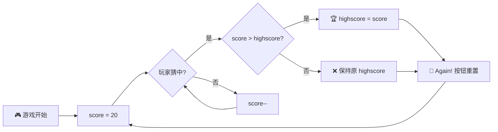
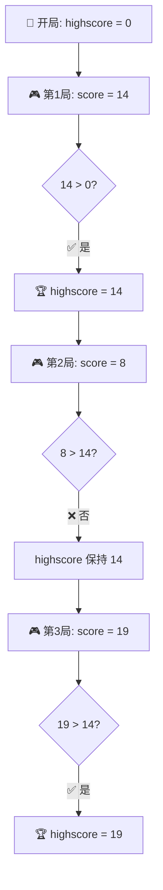

# 实现最高分功能 (Implementing Highscores)

> 📺 来源：`010 Implementing Highscores.en.srt`
> 📂 章节：第 07 章

## 📌 知识脉络
- **前置知识**：DOM 操作基础（`querySelector`、`textContent`）、事件监听（`addEventListener`）、条件判断（`if/else`）、游戏逻辑实现（得分变量管理）
- **后续扩展**：DRY 原则代码重构、本地存储（`localStorage`）持久化数据、状态管理模式

## 🎯 概述

本节课为 "Guess My Number!" 游戏添加**最高分（Highscore）功能**。核心思路是：每次玩家赢得游戏时，将当前得分与历史最高分进行比较，如果超越，则更新最高分。这个功能让游戏有了"挑战自我"的重玩动力，同时也是一次经典的**变量状态管理**练习。

## 核心知识点

### 1. 最高分变量的初始化策略

> 🧩 **生活类比**：最高分就像你跑步的个人最佳纪录（PB）。第一次跑完马拉松，无论花了多长时间，那都是你的 PB —— 因为之前没有记录可比较。所以把初始值设为 `0`，任何有效得分都会自动成为新纪录。

为了追踪最高分，我们需要一个**独立于单局游戏外**的变量：

```js
let highscore = 0;
```



**为什么初始值是 `0` 而不是 `null` 或 `-1`？**

因为游戏的 `score` 始终为正整数（最低为 1 —— 一次就猜中的情况），所以任何有效得分都会大于 `0`，这保证了**第一局游戏的得分一定会成为最高分**。

---

### 2. 最高分更新逻辑的放置位置

> 🧩 **生活类比**：颁奖典礼只在比赛结束时举行，而不是比赛进行中。同理，高分的检查和更新只应发生在**玩家赢得游戏的那一刻**。

最高分检查必须放在**玩家猜中正确数字**的代码分支内：

```js
// ✅ 正确位置：在玩家猜对的 if 分支内
if (guess === secretNumber) {
  // 显示 "Correct Number!" 消息
  document.querySelector('.message').textContent = '🎉 Correct Number!';

  // 🏆 检查并更新最高分
  if (score > highscore) {
    highscore = score;
    document.querySelector('.highscore').textContent = highscore;
  }
}
```

**🔍 执行追踪：**

假设初始 `highscore = 0`，第一局 `score = 14`：

| 步骤 | 表达式 | 值 | 说明 |
|------|--------|-----|------|
| ① | `guess === secretNumber` | `true` | 玩家猜对了 |
| ② | `score > highscore` | `14 > 0 → true` | 当前得分高于历史最高 |
| ③ | `highscore = score` | `highscore = 14` | 更新最高分变量 |
| ④ | `.highscore.textContent = 14` | DOM 更新 | 页面显示新最高分 |

第二局 `score = 12`：

| 步骤 | 表达式 | 值 | 说明 |
|------|--------|-----|------|
| ① | `guess === secretNumber` | `true` | 玩家猜对了 |
| ② | `score > highscore` | `12 > 14 → false` | ❌ 未超越历史最高 |
| ③ | 不执行更新 | `highscore` 保持 `14` | 最高分不变 |

第三局 `score = 18`：

| 步骤 | 表达式 | 值 | 说明 |
|------|--------|-----|------|
| ① | `guess === secretNumber` | `true` | 玩家猜对了 |
| ② | `score > highscore` | `18 > 14 → true` | ✅ 新纪录！ |
| ③ | `highscore = score` | `highscore = 18` | 更新为 18 |

> 💡 **记忆口诀**：**"赢了才比，大了才换"** —— 先确认赢了游戏（`guess === secretNumber`），才进行比较；只有当前得分**大于**历史最高分，才执行替换。

---

### 3. "Again!" 按钮与最高分的生存关系

> 🧩 **生活类比**：体育场的记分牌在每场比赛开始时会清零，但**名人堂的纪录**从不重置。`score` 是记分牌，`highscore` 是名人堂。

```mermaid
flowchart TD
    subgraph 🔄 Again按钮重置
        R1["score = 20 ✅ 重置"]
        R2["secretNumber = 新随机数 ✅ 重置"]
        R3["message = 'Start guessing...' ✅ 重置"]
        R4["DOM 样式复原 ✅ 重置"]
    end
    subgraph 🏆 保留不动
        K1["highscore ❌ 不重置"]
        K2["页面上的 Highscore 显示 ❌ 不重置"]
    end
    style K1 fill:#2d5016,stroke:#4ade80,color:#fff
    style K2 fill:#2d5016,stroke:#4ade80,color:#fff
```

点击 "Again!" 按钮会重置 `score`、`secretNumber` 和 DOM 元素，但**不会**触碰 `highscore` 变量。这就是为什么高分可以跨多局保持——它在 "Again!" 的事件处理函数**之外**声明，且在重置逻辑中**从未被赋新值**。

**⚠️ 但页面刷新会丢失所有数据**，因为 `highscore` 存储在内存中（JavaScript 变量），不是持久化存储。要实现跨会话保存，需要使用 `localStorage`（后续章节会学到）。

---

## 🛠️ 代码实战与真实场景

> **💼 业务场景**：你正在开发一个在线答题系统，用户每次答完一轮题目后获得分数。系统需要记录并显示用户的历史最高分，每次答题结束后自动比较更新。

```js {runnable} {title="highscore_demo.js"}
// 模拟最高分功能
let highscore = 0;

function playRound() {
  // 模拟一局游戏的得分（1-20之间随机）
  const score = Math.trunc(Math.random() * 20) + 1;

  console.log(`📊 本局得分: ${score}`);
  console.log(`🏆 当前最高分: ${highscore}`);

  // 核心逻辑：比较并更新最高分
  if (score > highscore) {
    highscore = score;
    console.log(`🎉 新纪录！最高分更新为: ${highscore}`);
  } else {
    console.log(`❌ 未打破纪录，最高分仍为: ${highscore}`);
  }
  console.log('---');
}

// 模拟玩 5 局
for (let i = 1; i <= 5; i++) {
  console.log(`=== 第 ${i} 局 ===`);
  playRound();
}
```



**📊 输入输出示例：**

| 局数 | 本局得分 (score) | 当前最高分 (highscore) | 是否更新？ | 更新后最高分 |
|------|-----------------|----------------------|-----------|------------|
| 第 1 局 | 14 | 0 | ✅ 是 | 14 |
| 第 2 局 | 8 | 14 | ❌ 否 | 14 |
| 第 3 局 | 19 | 14 | ✅ 是 | 19 |
| 第 4 局 | 17 | 19 | ❌ 否 | 19 |
| 第 5 局 | 20 | 19 | ✅ 是 | 20 |

## 💡 关键要点
- ✅ 最高分变量（`highscore`）必须声明在**游戏循环之外**，使其跨局存活
- ✅ 初始值设为 `0`，保证第一局得分必定成为新纪录
- ✅ 比较逻辑只在**玩家获胜**时执行，而非每次猜测时
- ✅ "Again!" 按钮重置游戏状态但**保留**最高分
- ✅ 页面刷新会丢失最高分（内存变量的局限性）

## ⚠️ 常见误区
- ⚠️ **误区 1**：在 "Again!" 按钮的事件处理中重置了 `highscore`。这会导致每次重开游戏时最高分清零，失去了高分功能的意义。`highscore` 应该在整个页面生命周期内只被**更大的值**覆盖。
- ⚠️ **误区 2**：使用 `>=` 而非 `>` 来比较得分。如果用 `score >= highscore`，即使打平也会"更新"最高分。虽然结果值相同，但从语义上说"打平"不应算作"打破纪录"，使用 `>` 更精确。
- ⚠️ **误区 3**：忘记同时更新 DOM 显示。更新了 `highscore` 变量但没有更新 `.highscore` 元素的 `textContent`，会导致页面上的最高分显示不变，用户看不到更新。

## 🐛 报错实验室

**❌ 错误写法：**
```js
// 将 highscore 声明在事件处理函数内部
document.querySelector('.check').addEventListener('click', function () {
  let highscore = 0; // ⛔ 每次点击都重新声明！
  if (score > highscore) {
    highscore = score; // 永远成立，因为 highscore 每次都从 0 开始
  }
});
```

**浏览器报错：**
```
（无报错，但逻辑错误）
每次点击按钮, highscore 都被重置为 0
导致任何得分都会成为"最高分"
最高分功能完全失效
```

**🔑 解读**：`let highscore = 0` 放在事件处理函数内部，每次点击都会重新执行，`highscore` 永远从 `0` 开始。正确做法是将其声明在**全局作用域**或**事件处理函数外部**，使其跨多次点击保持状态。

---

## 📖 词汇速查表 (Cheat Sheet)

| 中文术语 | 英文术语 | 简明释义 | 速查代码 | 📚 官方文档 |
|---------|---------|---------|---------|-----------|
| 最高分 | Highscore | 多轮游戏中的历史最高得分 | `let highscore = 0;` | — |
| 查询选择器 | querySelector | 通过 CSS 选择器获取 DOM 元素 | `document.querySelector('.highscore')` | [MDN](https://developer.mozilla.org/zh-CN/docs/Web/API/Document/querySelector) |
| 文本内容 | textContent | 获取或设置元素的文本内容 | `el.textContent = highscore` | [MDN](https://developer.mozilla.org/zh-CN/docs/Web/API/Node/textContent) |
| 变量作用域 | Variable Scope | 变量在程序中可被访问的范围 | `let x = 0;` (全局 vs 函数内) | [MDN](https://developer.mozilla.org/zh-CN/docs/Glossary/Scope) |
| 条件语句 | if statement | 根据条件执行不同代码分支 | `if (score > highscore) { ... }` | [MDN](https://developer.mozilla.org/zh-CN/docs/Web/JavaScript/Reference/Statements/if...else) |

---

## 🧪 学习验证

### 📝 动手练习

**练习 1：为猜数字游戏添加"最低猜测次数"追踪**

实现一个 `bestAttempts` 变量，记录赢得游戏所用的**最少猜测次数**（`20 - score + 1` 即为猜测次数）。

```js {runnable} {title="exercise1.js"}
// 在这里实现"最少猜测次数"追踪
let bestAttempts = Infinity; // 提示：用 Infinity 作为初始值

function checkBestAttempts(score) {
  const attempts = 20 - score + 1;
  // 你的代码：比较并更新 bestAttempts
  // 然后输出结果
}

// 测试
checkBestAttempts(18); // 3 次猜中
checkBestAttempts(15); // 6 次猜中
checkBestAttempts(19); // 2 次猜中 → 应该更新！
```

<details><summary>💡 参考答案</summary>

```js
let bestAttempts = Infinity;

function checkBestAttempts(score) {
  const attempts = 20 - score + 1;
  console.log(`🎯 本局猜测次数: ${attempts}`);

  if (attempts < bestAttempts) {
    bestAttempts = attempts;
    console.log(`🏆 新纪录！最少猜测次数更新为: ${bestAttempts}`);
  } else {
    console.log(`当前最少猜测次数仍为: ${bestAttempts}`);
  }
}

checkBestAttempts(18); // 3 次 — 新纪录！
checkBestAttempts(15); // 6 次 — 未打破
checkBestAttempts(19); // 2 次 — 新纪录！
```

**解题思路**：与最高分相反，这里追踪的是**最小值**，所以初始值用 `Infinity`（任何正整数都比 `Infinity` 小），比较用 `<` 而非 `>`。

</details>

**练习 2：实现最高分的 localStorage 持久化**

```js {runnable} {title="exercise2.js"}
// 实现一个能跨页面刷新保留最高分的版本
// 提示：使用 localStorage.setItem() 和 localStorage.getItem()

// 初始化最高分（从 localStorage 读取，如果没有则为 0）
let highscore = // 你的代码

function updateHighscore(score) {
  if (score > highscore) {
    highscore = score;
    // 你的代码：同时保存到 localStorage
    console.log(`🏆 最高分已保存: ${highscore}`);
  }
}

// 测试
updateHighscore(15);
updateHighscore(12);
updateHighscore(20);
console.log(`最终最高分: ${highscore}`);
```

<details><summary>💡 参考答案</summary>

```js
// 从 localStorage 读取，首次访问返回 null，用 || 0 兜底
let highscore = Number(localStorage.getItem('highscore')) || 0;
console.log(`📦 从 localStorage 恢复最高分: ${highscore}`);

function updateHighscore(score) {
  if (score > highscore) {
    highscore = score;
    localStorage.setItem('highscore', highscore); // 持久化保存
    console.log(`🏆 最高分已保存: ${highscore}`);
  } else {
    console.log(`未更新，当前最高分: ${highscore}`);
  }
}

updateHighscore(15); // 🏆 15
updateHighscore(12); // 未更新
updateHighscore(20); // 🏆 20
```

**解题思路**：`localStorage.getItem()` 返回字符串或 `null`，用 `Number()` 转换后 `|| 0` 处理首次访问的 `null` 情况。每次更新最高分时同步调用 `setItem()` 保存。

</details>

### ❓ 理解检测

:::quiz {correct="B"}
**1. 为什么 `highscore` 变量的初始值设为 `0`？**
- A) 因为 JavaScript 变量默认值是 0
- B) 因为这样第一局的任何有效得分都会自动成为最高分
- C) 因为 0 是唯一能用于比较的数字
- D) 因为最高分不能是负数

> **解析**：游戏中 `score` 的最小有效值为 1（一次就猜中时得分为 20，逐次递减但至少为 1）。将 `highscore` 初始化为 `0`，保证 `score > highscore` 在第一局必定为 `true`，从而第一局得分自动成为最高分。
:::

:::quiz {correct="C"}
**2. 最高分检查逻辑应该放在代码的什么位置？**
- A) 每次用户点击 "Check!" 按钮时
- B) 在 "Again!" 按钮的事件处理函数中
- C) 在用户猜对数字的 if 分支内
- D) 在页面加载完成时

> **解析**：只有当玩家猜对了（`guess === secretNumber`），当前这局游戏才算"结束"，此时的 `score` 才是最终得分，才有比较最高分的意义。在其他位置检查是不合逻辑的。
:::

:::quiz {correct="A"}
**3. 点击 "Again!" 按钮后，以下哪个说法是正确的？**
- A) `score` 被重置为 20，但 `highscore` 保持不变
- B) `score` 和 `highscore` 都被重置为初始值
- C) `highscore` 被保存到 localStorage
- D) 页面刷新后 `highscore` 仍然保留

> **解析**："Again!" 按钮的事件处理函数会重置 `score`、`secretNumber`、DOM 元素等，但**不会**触碰 `highscore`。同时，当前课程中没有使用 `localStorage`，所以页面刷新后所有数据都会丢失。
:::

### 🔧 代码填空

:::fill-blank
// 声明最高分变量
let highscore = ___0___;

// 在玩家获胜时检查最高分
if (guess === secretNumber) {
  if (___score___ > ___highscore___) {
    highscore = score;
    document.querySelector('.highscore').___textContent___ = highscore;
  }
}
:::
