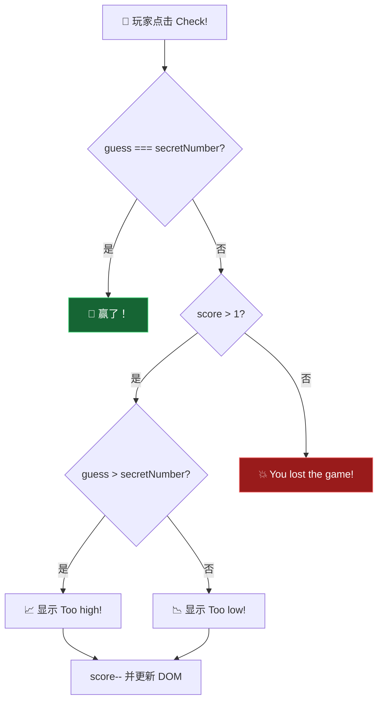
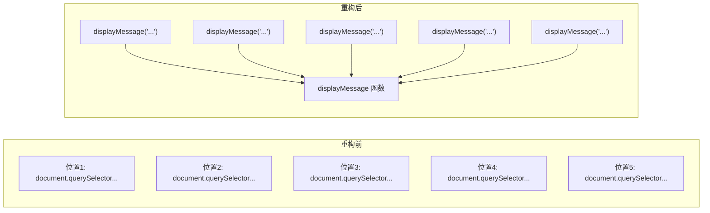
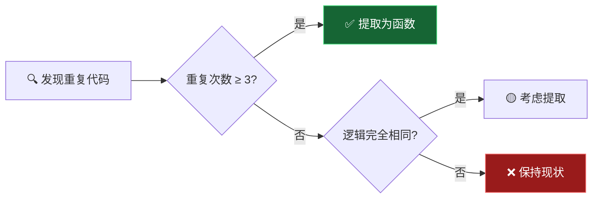
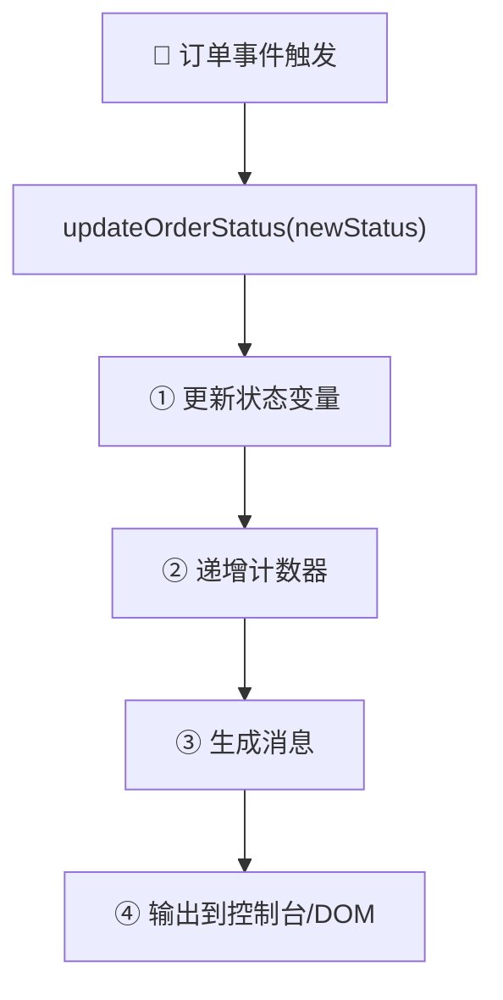

# 代码重构：DRY 原则 (Refactoring Our Code: The DRY Principle)

> 📺 来源：`011 Refactoring Our Code The DRY Principle.en.srt`
> 📂 章节：第 07 章

## 📌 知识脉络
- **前置知识**：`if/else` 条件判断、三元运算符（Ternary Operator）、DOM 操作（`querySelector`、`textContent`）、函数声明与调用
- **后续扩展**：模块化开发、设计模式（DRY/KISS/SOLID）、高阶函数抽象、事件委托

## 🎯 概述

本节课对 "Guess My Number!" 游戏代码进行**重构（Refactoring）**，重点演示 **DRY 原则（Don't Repeat Yourself）** 的两大实战手法：①**合并相似的条件分支**，②**将重复代码提取为函数**。重构不改变程序行为，只让代码更简洁、更易读、更易维护。

## 核心知识点

### 1. 合并重复的条件分支

> 🧩 **生活类比**：你去银行办理业务，被叫到 3 号窗口。无论你是要存钱还是取钱，都要先进行身份验证 —— 这个"身份验证"步骤是共同的。如果银行为"存钱"和"取钱"各设一个独立的验证流程，就是冗余。合理的做法是先统一验证，再分流。

在原始代码中，"猜测过高"和"猜测过低"两个分支的逻辑几乎完全相同，唯一的区别是显示的提示文字：

:::code-comparison
```js {title="🚨 初版冗余写法 (The Naive Way)"}
// 分支1: 猜的太高
if (guess > secretNumber) {
  if (score > 1) {
    document.querySelector('.message').textContent = '📈 Too high!';
    score--;
    document.querySelector('.score').textContent = score;
  } else {
    document.querySelector('.message').textContent = '💥 You lost the game!';
    document.querySelector('.score').textContent = 0;
  }
}

// 分支2: 猜的太低（几乎完全重复！）
if (guess < secretNumber) {
  if (score > 1) {
    document.querySelector('.message').textContent = '📉 Too low!';
    score--;
    document.querySelector('.score').textContent = score;
  } else {
    document.querySelector('.message').textContent = '💥 You lost the game!';
    document.querySelector('.score').textContent = 0;
  }
}
```
```js {title="✨ DRY 重构写法 (The Refactored Way)"}
// 合并为一个分支：猜错了（不等于正确答案）
if (guess !== secretNumber) {
  if (score > 1) {
    // 用三元运算符决定提示文字
    document.querySelector('.message').textContent =
      guess > secretNumber ? '📈 Too high!' : '📉 Too low!';
    score--;
    document.querySelector('.score').textContent = score;
  } else {
    document.querySelector('.message').textContent =
      '💥 You lost the game!';
    document.querySelector('.score').textContent = 0;
  }
}
```
:::



**🔍 执行追踪：**

假设 `secretNumber = 15`，玩家猜 `20`：

| 步骤 | 表达式 | 值 | 说明 |
|------|--------|-----|------|
| ① | `guess !== secretNumber` | `20 !== 15 → true` | 猜错了，进入分支 |
| ② | `score > 1` | `true`（假设 score=18） | 还有机会 |
| ③ | `guess > secretNumber` | `20 > 15 → true` | 三元运算符求值 |
| ④ | 显示 `'📈 Too high!'` | — | 条件为 true，取第一个值 |
| ⑤ | `score--` | `score = 17` | 扣分 |

> 💡 **记忆口诀**：**"猜错是一家，高低三元分"** —— `guess !== secretNumber` 统一处理猜错的情况，只用三元运算符分出具体的"高"还是"低"。

---

### 2. 将重复代码提取为函数

> 🧩 **生活类比**：你家里有 5 个房间，每个房间都有独立的空调遥控器。与其每次走到每个房间去按遥控器，不如装一个智能家居中心 —— 你只需喊一声"设置温度 24 度"，中心就会帮你操控所有房间。把重复代码提取为函数就像建造这个"中心控制器"。

代码中 `document.querySelector('.message').textContent = ...` 至少出现了 **5 次**。每次都写完整的 DOM 操作代码，冗长且不直观。解决方案是将其封装为一个函数：

:::code-comparison
```js {title="🚨 重复代码散落各处"}
// 出现位置 1
document.querySelector('.message').textContent =
  'Start guessing...';
// 出现位置 2
document.querySelector('.message').textContent =
  '⛔ No number!';
// 出现位置 3
document.querySelector('.message').textContent =
  '🎉 Correct Number!';
// 出现位置 4
document.querySelector('.message').textContent =
  guess > secretNumber ? '📈 Too high!' : '📉 Too low!';
// 出现位置 5
document.querySelector('.message').textContent =
  '💥 You lost the game!';
```
```js {title="✨ 提取为 displayMessage 函数"}
// 定义函数（一次定义，多处调用）
const displayMessage = function (message) {
  document.querySelector('.message').textContent = message;
};

// 使用位置 1
displayMessage('Start guessing...');
// 使用位置 2
displayMessage('⛔ No number!');
// 使用位置 3
displayMessage('🎉 Correct Number!');
// 使用位置 4
displayMessage(
  guess > secretNumber ? '📈 Too high!' : '📉 Too low!'
);
// 使用位置 5
displayMessage('💥 You lost the game!');
```
:::



**函数封装的三大好处：**

| 好处 | 说明 | 示例 |
|------|------|------|
| 🔄 消除重复 | 相同的 DOM 操作只写一次 | 5 行 → 1 个函数 + 5 次调用 |
| 📖 提升可读性 | 函数名即含义，一读就懂 | `displayMessage('...')` 比 `document.querySelector(...)` 直观 |
| 🛠️ 集中维护 | 修改选择器只需改一处 | 假如类名从 `.message` 改为 `.msg`，只改函数内部 |

**📊 概念对比：**

| 维度 | 直接写 DOM 操作 | 提取为函数 |
|------|-----------------|-----------|
| 代码行数 | 5 × 整行 = 大量重复 | 1 个函数 + 5 次简短调用 |
| 修改选择器 | 需改 5 处 | 只改 1 处（函数内部） |
| 阅读理解 | 需读完整行才知道在做什么 | 函数名直接告诉你 |
| 出错风险 | 容易漏改某处 | 统一入口，不会遗漏 |

> **💼 业务场景**：在真实项目中，`displayMessage` 可能还需要添加动画效果、错误日志或国际化翻译。如果代码散落在 5 个地方，每个地方都要改一遍；封装为函数后，只需在函数内部加一行即可全局生效。

---

### 3. DRY 原则的适用边界

> 🧩 **生活类比**：厨房做菜，切葱和切蒜的动作很像，但你不会为此发明一个"万能切刀机"。过度抽象和不抽象一样有害。DRY 原则要求消除**无意义的重复**，而非消除一切相似性。



**适合提取为函数的场景：**
- 相同的 DOM 操作出现 3 次以上
- 相同的计算逻辑被多处使用（如生成随机数）
- 未来可能需要统一修改的功能

**不建议过度提取的场景：**
- 仅出现 1-2 次的简单操作
- 逻辑看似相似但含义不同的代码
- 提取后反而降低可读性的情况

---

## 🛠️ 代码实战与真实场景

> **💼 业务场景**：你在维护一个电商后台订单管理系统，发现"更新订单状态"的 DOM 操作重复出现在多个事件处理器中。运用 DRY 原则进行重构。

```js {runnable} {title="dry_refactoring_demo.js"}
// ========== 重构前：重复代码散落各处 ==========
console.log('=== 重构前（模拟多处重复） ===');

// 模拟 DOM 操作的函数（在真实环境中是 document.querySelector）
const state = { status: '', count: 0, message: '' };

// 处理"已支付"事件
state.status = '已支付';
state.count = state.count + 1;
state.message = `订单状态更新为: ${state.status}`;
console.log(state.message);

// 处理"已发货"事件（几乎完全相同的代码！）
state.status = '已发货';
state.count = state.count + 1;
state.message = `订单状态更新为: ${state.status}`;
console.log(state.message);

// 处理"已完成"事件（又是重复！）
state.status = '已完成';
state.count = state.count + 1;
state.message = `订单状态更新为: ${state.status}`;
console.log(state.message);

// ========== 重构后：提取为函数 ==========
console.log('\n=== 重构后（DRY 原则） ===');

const state2 = { status: '', count: 0, message: '' };

// 封装为函数
function updateOrderStatus(newStatus) {
  state2.status = newStatus;
  state2.count = state2.count + 1;
  state2.message = `订单状态更新为: ${state2.status}`;
  console.log(state2.message);
}

// 简洁的调用
updateOrderStatus('已支付');
updateOrderStatus('已发货');
updateOrderStatus('已完成');

console.log(`\n📊 总共更新了 ${state2.count} 次`);
```



**📊 输入输出示例：**

| 调用 | 参数 | state.status | state.count | 输出消息 |
|------|------|-------------|-------------|---------|
| `updateOrderStatus('已支付')` | `'已支付'` | `'已支付'` | `1` | `订单状态更新为: 已支付` |
| `updateOrderStatus('已发货')` | `'已发货'` | `'已发货'` | `2` | `订单状态更新为: 已发货` |
| `updateOrderStatus('已完成')` | `'已完成'` | `'已完成'` | `3` | `订单状态更新为: 已完成` |

## 💡 关键要点
- ✅ DRY 原则的核心：相同逻辑只写**一次**，通过函数调用复用
- ✅ 合并相似条件分支时，用三元运算符处理**唯一不同的部分**
- ✅ 函数命名要**自解释**——`displayMessage` 比内联的 DOM 操作更清晰
- ✅ 重构不改变程序行为，只改善代码结构
- ✅ 重构后必须**全面测试**所有场景，确保功能不变

## ⚠️ 常见误区
- ⚠️ **误区 1**：把所有看似相似的代码都强行合并。如果两段代码只是"长得像"但代表不同的业务含义，强行合并反而会降低代码的可维护性。DRY 消除的是**同一业务逻辑的重复**，而非一切视觉重复。
- ⚠️ **误区 2**：重构时忘记删除旧代码。合并分支或提取函数后，如果保留了旧的重复代码（哪怕注释掉），会混淆后续开发者。确保重构完成后清理干净。
- ⚠️ **误区 3**：提取函数时参数设计不当。比如 `displayMessage` 如果不接受参数而是直接在内部写死消息文本，就失去了复用价值。函数应该把**变化的部分**作为参数。

## 🐛 报错实验室

**❌ 错误写法：**
```js
// 重构时遗漏了条件分支的闭合大括号
if (guess !== secretNumber) {
  if (score > 1) {
    displayMessage(guess > secretNumber ? '📈 Too high!' : '📉 Too low!');
    score--;
    document.querySelector('.score').textContent = score;
  } else {
    displayMessage('💥 You lost the game!');
    document.querySelector('.score').textContent = 0;
  }
// ⛔ 缺少了 if (guess !== secretNumber) 的闭合 }
```

**浏览器报错：**
```
Uncaught SyntaxError: Unexpected end of input
```

**🔑 解读**：重构时删除旧代码或合并分支，很容易不小心多删或少删一个 `}`。浏览器告诉你代码在"意料之外的地方结束了"，意味着某个代码块没有正确闭合。重构后一定要仔细检查大括号的配对。

---

## 📖 词汇速查表 (Cheat Sheet)

| 中文术语 | 英文术语 | 简明释义 | 速查代码 | 📚 官方文档 |
|---------|---------|---------|---------|-----------|
| DRY 原则 | Don't Repeat Yourself | 避免重复代码的编程原则 | 提取函数 / 合并条件 | — |
| 重构 | Refactoring | 不改变行为，改善代码结构 | — | — |
| 三元运算符 | Ternary Operator | `条件 ? 值A : 值B` 简写条件 | `x > 0 ? 'pos' : 'neg'` | [MDN](https://developer.mozilla.org/zh-CN/docs/Web/JavaScript/Reference/Operators/Conditional_operator) |
| 严格不等于 | Strict Inequality | `!==` 检查值和类型是否不等 | `guess !== secretNumber` | [MDN](https://developer.mozilla.org/zh-CN/docs/Web/JavaScript/Reference/Operators/Strict_inequality) |
| 函数声明 | Function Declaration | 定义可复用的代码块 | `function fn(param) { ... }` | [MDN](https://developer.mozilla.org/zh-CN/docs/Web/JavaScript/Reference/Statements/function) |
| 函数表达式 | Function Expression | 将函数赋值给变量 | `const fn = function() {};` | [MDN](https://developer.mozilla.org/zh-CN/docs/Web/JavaScript/Reference/Operators/function) |

---

## 🧪 学习验证

### 📝 动手练习

**练习 1：提取 displayScore 和 displayNumber 函数**

课程中只提取了 `displayMessage`。请你也将"更新分数"和"显示数字"的 DOM 操作封装为函数。

```js {runnable} {title="exercise1.js"}
// 在这里定义 displayScore 和 displayNumber 函数
// 然后用它们替换直接的 DOM 操作

// 你的代码：定义 displayScore 函数
// 你的代码：定义 displayNumber 函数

// 测试调用
// displayScore(18);
// displayNumber(7);
```

<details><summary>💡 参考答案</summary>

```js
const displayScore = function (score) {
  document.querySelector('.score').textContent = score;
};

const displayNumber = function (number) {
  document.querySelector('.number').textContent = number;
};

// 使用示例
displayScore(18);      // 替代 document.querySelector('.score').textContent = 18;
displayNumber(7);      // 替代 document.querySelector('.number').textContent = 7;
```

**解题思路**：与 `displayMessage` 完全相同的提取模式 —— 将 `document.querySelector('...')` 和 `.textContent = ...` 包进函数，把变化的值作为参数传入。

</details>

**练习 2：用 DRY 原则重构温度转换器**

以下代码有明显的重复，请重构它：

```js {runnable} {title="exercise2.js"}
// 重构前：三个几乎相同的函数
function celsiusToFahrenheit(c) {
  const result = c * 9 / 5 + 32;
  console.log(`${c}°C = ${result}°F`);
  return result;
}

function celsiusToKelvin(c) {
  const result = c + 273.15;
  console.log(`${c}°C = ${result}K`);
  return result;
}

// 你的任务：创建一个统一的 convertTemp 函数
// convertTemp(celsius, targetUnit)
// targetUnit 可以是 'F' 或 'K'

// 测试
celsiusToFahrenheit(100); // 212°F
celsiusToKelvin(0); // 273.15K
```

<details><summary>💡 参考答案</summary>

```js
function convertTemp(celsius, targetUnit) {
  let result, unitSymbol;

  if (targetUnit === 'F') {
    result = celsius * 9 / 5 + 32;
    unitSymbol = '°F';
  } else if (targetUnit === 'K') {
    result = celsius + 273.15;
    unitSymbol = 'K';
  } else {
    console.log('⛔ 不支持的单位');
    return;
  }

  console.log(`${celsius}°C = ${result}${unitSymbol}`);
  return result;
}

convertTemp(100, 'F'); // 100°C = 212°F
convertTemp(0, 'K');   // 0°C = 273.15K
convertTemp(37, 'F');  // 37°C = 98.6°F
```

**解题思路**：两个函数的结构完全相同（计算 + 输出 + 返回），唯一的区别是计算公式和单位符号。用第二个参数 `targetUnit` 区分，在函数内部用 `if/else` 选择公式。

</details>

### ❓ 理解检测

:::quiz {correct="C"}
**1. 以下哪种重构手法最适合处理"猜测过高"和"猜测过低"两个分支的重复代码？**
- A) 将两个分支的代码都提取为独立函数
- B) 使用 switch 语句替代 if/else
- C) 合并为一个 `guess !== secretNumber` 分支，用三元运算符区分不同部分
- D) 使用数组存储所有可能的消息文本

> **解析**：两个分支的代码 95% 相同，唯一的区别是提示消息。最自然的重构是合并为一个"猜错了"的分支，然后用三元运算符 `guess > secretNumber ? '📈 Too high!' : '📉 Too low!'` 来决定不同的提示文字。
:::

:::quiz {correct="B"}
**2. 将 `document.querySelector('.message').textContent = msg` 提取为 `displayMessage(msg)` 函数的主要好处是什么？**
- A) 提升代码运行性能
- B) 消除重复代码，提高可读性和可维护性
- C) 防止 XSS 攻击
- D) 让 DOM 操作变得异步

> **解析**：提取函数不会影响性能，也与安全或异步无关。它的核心好处是**消除重复**——相同的 DOM 操作只在函数内写一次；**提高可读性**——`displayMessage('...')` 比完整的 `document.querySelector(...)` 链更容易理解；**提高可维护性**——如果需要修改选择器，只改一处。
:::

:::quiz {correct="A"}
**3. 关于重构，以下哪个说法是正确的？**
- A) 重构只改变代码结构，不改变程序的外部行为
- B) 重构的主要目的是让程序运行得更快
- C) 重构必须在项目完成后才能进行
- D) 所有重复的代码都必须被提取为函数

> **解析**：重构的定义就是"在不改变程序外部行为的前提下，调整代码的内部结构"。它的目的是提高可读性和可维护性，而非性能优化。重构应该随时进行（而非等到项目完成），且不是所有重复都需要提取——要根据重复次数和业务含义来判断。
:::

### 🔧 代码填空

:::fill-blank
// 定义显示消息的函数
const displayMessage = function (___message___) {
  document.querySelector('.message').___textContent___ = ___message___;
};

// 合并条件分支
if (guess ___!==___ secretNumber) {
  displayMessage(
    guess > secretNumber ___?___ '📈 Too high!' ___:___ '📉 Too low!'
  );
}
:::
