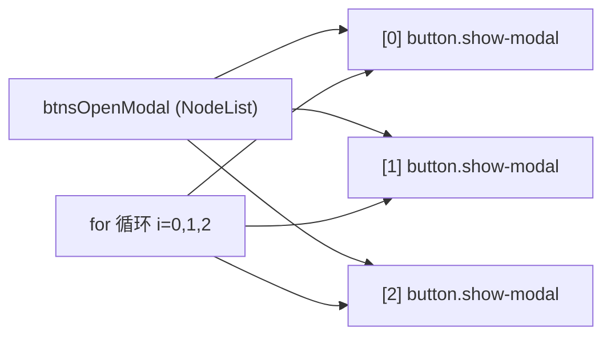
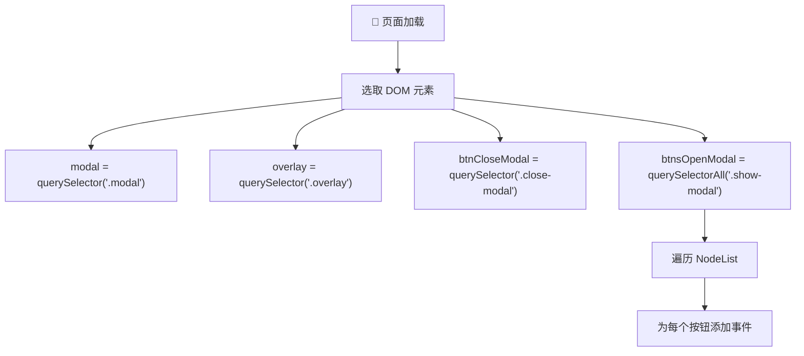

# 项目 #2：模态窗口 (PROJECT #2: Modal Window)

> 📺 来源：`012 PROJECT #2 Modal Window.en.srt`
> 📂 章节：第 07 章

## 📌 知识脉络
- **前置知识**：DOM 选择器（`querySelector`）、事件监听（`addEventListener`）、CSS `display: none` 隐藏元素
- **后续扩展**：CSS 类操作（`classList.add/remove`）、键盘事件（`keydown`）、CSS 过渡动画（`transition`）、事件冒泡与委托

## 🎯 概述

本节课开启第二个 DOM 操作项目 —— **模态窗口（Modal Window）**。这是 Web 开发中最常见的 UI 组件之一。核心学习点包括：使用 `querySelectorAll` 选取多个同类元素、将 DOM 选择结果存储到变量中以便复用、以及使用 `for` 循环遍历 `NodeList`。模态窗口的 HTML 结构已预置在页面中，通过 CSS 类 `hidden` 控制显示/隐藏。

## 核心知识点

### 1. 项目结构与 CSS 隐藏机制

> 🧩 **生活类比**：模态窗口就像剧院的幕布 —— 幕布一直在台上，只是观众看不见后面的布景。拉开幕布（移除 `hidden` 类）布景就显示了，放下幕布（添加 `hidden` 类）布景就隐藏了。你不需要每次演出时重新搭建布景。

模态窗口的 HTML 结构已经存在于页面中，并不需要通过 JavaScript 动态创建：

```html
<!-- 三个触发按钮 -->
<button class="show-modal">Show modal 1</button>
<button class="show-modal">Show modal 2</button>
<button class="show-modal">Show modal 3</button>

<!-- 模态窗口（默认隐藏） -->
<div class="modal hidden">
  <button class="close-modal">&times;</button>
  <h1>I'm a modal window 😍</h1>
  <p>内容文本...</p>
</div>

<!-- 背景遮罩（默认隐藏） -->
<div class="overlay hidden"></div>
```

```css
/* hidden 类的 CSS 定义 */
.hidden {
  display: none;
}
```

```mermaid
flowchart TD
    subgraph 🖥️ 页面结构
        A["按钮 1: Show modal"] 
        B["按钮 2: Show modal"]
        C["按钮 3: Show modal"]
        D["div.modal.hidden 🙈"]
        E["div.overlay.hidden 🙈"]
    end
    A -->|"点击"| F["移除 hidden 类"]
    B -->|"点击"| F
    C -->|"点击"| F
    F --> G["div.modal 👀 可见"]
    F --> H["div.overlay 👀 可见"]
    style D fill:#991b1b,stroke:#f87171,color:#fff
    style E fill:#991b1b,stroke:#f87171,color:#fff
    style G fill:#166534,stroke:#4ade80,color:#fff
    style H fill:#166534,stroke:#4ade80,color:#fff
```

**为什么不用 JavaScript 动态创建 HTML？**

对于简单的模态窗口，HTML 已经写好并通过 CSS 隐藏是更高效的做法 —— 省去了 `createElement`、`appendChild` 等复杂操作。JavaScript 只负责**切换可见性**（添加/移除 CSS 类）。

---

### 2. DOM 元素选择与变量存储

> 🧩 **生活类比**：你去图书馆找一本书。第一次需要走到书架上翻找（DOM 查询）。如果你之后还要反复翻这本书，更好的做法是把它借走放在桌上（存入变量），而不是每次都跑回书架找。

与上一个项目不同，本项目在文件开头**统一选择**所有需要的 DOM 元素并存储到变量中：

```js
'use strict';

// ① 一次性选择所有需要的 DOM 元素
const modal = document.querySelector('.modal');
const overlay = document.querySelector('.overlay');
const btnCloseModal = document.querySelector('.close-modal');
const btnsOpenModal = document.querySelectorAll('.show-modal');
```

**🔍 执行追踪：**

| 变量名 | 选择器 | 选中的元素 | 元素数量 |
|--------|--------|-----------|---------|
| `modal` | `.modal` | `<div class="modal hidden">` | 1 个 |
| `overlay` | `.overlay` | `<div class="overlay hidden">` | 1 个 |
| `btnCloseModal` | `.close-modal` | `<button class="close-modal">` | 1 个 |
| `btnsOpenModal` | `.show-modal` | `NodeList[button, button, button]` | 3 个 |

**📊 querySelector vs querySelectorAll 对比：**

| 方法 | 返回值 | 匹配多个时 | 无匹配时 |
|------|--------|-----------|---------|
| `querySelector()` | 单个 Element | 只返回**第一个** | 返回 `null` |
| `querySelectorAll()` | NodeList | 返回**全部** | 返回空 NodeList |

> 💡 **记忆口诀**：**"querySelector 独生子，querySelectorAll 一家人"** —— 前者只找第一个，后者找齐全部。

---

### 3. NodeList 与 for 循环遍历

> 🧩 **生活类比**：`NodeList` 就像一串珍珠项链 —— 它把所有同类的 DOM 元素串在了一起。你可以像数珍珠一样，用 `for` 循环逐个访问每一颗。

`querySelectorAll` 返回的不是数组（Array），而是 **NodeList** —— 一种类数组对象。它有 `.length` 属性和数字索引，可以用 `for` 循环遍历：

```js {runnable} {title="nodelist_demo.js"}
// 模拟 NodeList 遍历
const buttons = ['Show modal 1', 'Show modal 2', 'Show modal 3'];

// 用 for 循环遍历（与真实 NodeList 遍历方式相同）
for (let i = 0; i < buttons.length; i++) {
  console.log(`按钮 ${i}: ${buttons[i]}`);
}
```

在真实项目中，遍历 NodeList 为每个按钮添加事件：

```js
// 遍历 NodeList，为每个按钮添加点击事件
for (let i = 0; i < btnsOpenModal.length; i++) {
  console.log(btnsOpenModal[i].textContent);
  // 后续课程将在这里添加事件监听器
}
```



**补充说明：** `for` 循环体只有一行代码时，可以省略大括号 `{}`：

```js
// 有大括号（标准写法）
for (let i = 0; i < btnsOpenModal.length; i++) {
  console.log(btnsOpenModal[i].textContent);
}

// 无大括号（单行简写）
for (let i = 0; i < btnsOpenModal.length; i++)
  console.log(btnsOpenModal[i].textContent);
```

> **💼 业务场景**：在真实的电商网站中，你可能有多个"加入购物车"按钮分布在不同的商品卡片上。使用 `querySelectorAll('.add-to-cart')` 选中所有按钮，然后用 `for` 循环为每一个添加事件监听器，这就是 `querySelectorAll` + 循环的典型应用。

---

## 🛠️ 代码实战与真实场景

> **💼 业务场景**：构建一个产品页面，有多个"查看详情"按钮，点击后应显示对应的详情弹窗。第一步是选取所有按钮并验证它们的信息。

```js {runnable} {title="select_elements_demo.js"}
// 模拟项目初始化：选取并验证所有 DOM 元素
// （这里用对象模拟 DOM 行为）

const mockDOM = {
  querySelector: function(selector) {
    const elements = {
      '.modal': { className: 'modal hidden', textContent: 'Modal Window' },
      '.overlay': { className: 'overlay hidden', textContent: '' },
      '.close-modal': { className: 'close-modal', textContent: '×' },
    };
    return elements[selector] || null;
  },
  querySelectorAll: function(selector) {
    if (selector === '.show-modal') {
      return [
        { textContent: 'Show modal 1', className: 'show-modal' },
        { textContent: 'Show modal 2', className: 'show-modal' },
        { textContent: 'Show modal 3', className: 'show-modal' },
      ];
    }
    return [];
  }
};

// 选取元素
const modal = mockDOM.querySelector('.modal');
const overlay = mockDOM.querySelector('.overlay');
const btnCloseModal = mockDOM.querySelector('.close-modal');
const btnsOpenModal = mockDOM.querySelectorAll('.show-modal');

// 验证选取结果
console.log('✅ modal:', modal ? modal.className : '❌ 未找到');
console.log('✅ overlay:', overlay ? overlay.className : '❌ 未找到');
console.log('✅ btnCloseModal:', btnCloseModal ? btnCloseModal.textContent : '❌ 未找到');
console.log(`✅ btnsOpenModal: 共 ${btnsOpenModal.length} 个按钮`);

// 遍历所有打开按钮
for (let i = 0; i < btnsOpenModal.length; i++) {
  console.log(`  📌 按钮 ${i + 1}: "${btnsOpenModal[i].textContent}"`);
}
```



**📊 输入输出示例：**

| 选择器 | 方法 | 返回值类型 | 结果 |
|--------|------|-----------|------|
| `.modal` | `querySelector` | Element | `<div class="modal hidden">` |
| `.overlay` | `querySelector` | Element | `<div class="overlay hidden">` |
| `.close-modal` | `querySelector` | Element | `<button class="close-modal">` |
| `.show-modal` | `querySelectorAll` | NodeList (3) | 三个 button 元素 |
| `.nonexistent` | `querySelector` | null | `null` |

## 💡 关键要点
- ✅ 模态窗口的 HTML 预置在页面中，通过 CSS `hidden` 类**隐藏**，JavaScript 只负责切换可见性
- ✅ 项目开头**统一选取**所有需要的 DOM 元素并存入变量，避免重复查询
- ✅ `querySelectorAll` 返回 **NodeList**，可用 `for` 循环遍历
- ✅ `querySelector` 匹配多个元素时只返回**第一个**，需要全部时用 `querySelectorAll`

## ⚠️ 常见误区
- ⚠️ **误区 1**：用 `querySelector` 选取多个同类元素。当页面上有多个 `.show-modal` 按钮时，`querySelector('.show-modal')` 只返回第一个，后两个被忽略。必须使用 `querySelectorAll`。
- ⚠️ **误区 2**：选择器类名拼写不一致。在 HTML 中是 `show-modal`，但在 JS 中写成了 `open-modal`，导致返回 `null`。选择器的类名必须与 HTML 中大小写、连字符**完全一致**。
- ⚠️ **误区 3**：将 NodeList 当作真正的数组。NodeList 没有 `push`、`map`、`filter` 等数组方法（现代浏览器中 `forEach` 可用）。如需使用数组方法，需先用 `Array.from()` 转换。

## 🐛 报错实验室

**❌ 错误写法：**
```js
// 选择器类名写错
const btnsOpenModal = document.querySelectorAll('.open-modal');
console.log(btnsOpenModal.length); // 0

// 尝试遍历空 NodeList 不会报错，但也不会执行任何操作
for (let i = 0; i < btnsOpenModal.length; i++) {
  console.log(btnsOpenModal[i].textContent); // 永远不会执行
}
```

**浏览器报错：**
```
（无报错，但行为异常）
btnsOpenModal.length 为 0
for 循环体不执行
页面上没有任何按钮响应点击
```

**🔑 解读**：`querySelectorAll` 在找不到匹配元素时不会抛错，只会返回一个空的 NodeList（`length === 0`）。这导致 bug 很难发现 —— 代码"正常运行"但什么都没做。养成习惯在开发时 `console.log` 选择结果来验证。

---

## 📖 词汇速查表 (Cheat Sheet)

| 中文术语 | 英文术语 | 简明释义 | 速查代码 | 📚 官方文档 |
|---------|---------|---------|---------|-----------|
| 模态窗口 | Modal Window | 覆盖在页面上的弹窗组件 | — | — |
| 遮罩层 | Overlay | 模态窗口背后的半透明遮罩 | `<div class="overlay">` | — |
| 全部选择器 | querySelectorAll | 选取所有匹配的 DOM 元素 | `document.querySelectorAll('.cls')` | [MDN](https://developer.mozilla.org/zh-CN/docs/Web/API/Document/querySelectorAll) |
| 节点列表 | NodeList | `querySelectorAll` 的返回类型 | `nodeList[0]`, `nodeList.length` | [MDN](https://developer.mozilla.org/zh-CN/docs/Web/API/NodeList) |
| 严格模式 | Strict Mode | 启用更严格的 JS 语法检查 | `'use strict';` | [MDN](https://developer.mozilla.org/zh-CN/docs/Web/JavaScript/Reference/Strict_mode) |
| 显示属性 | display | CSS 属性，控制元素是否渲染 | `display: none;` | [MDN](https://developer.mozilla.org/zh-CN/docs/Web/CSS/display) |

---

## 🧪 学习验证

### 📝 动手练习

**练习 1：选取并统计页面上的所有链接**

```js {runnable} {title="exercise1.js"}
// 假设页面上有多个链接
// 用 querySelectorAll 选取它们，并输出每个链接的 href 和文本

// 模拟 DOM
const links = [
  { href: 'https://example.com', textContent: 'Example' },
  { href: 'https://mdn.dev', textContent: 'MDN' },
  { href: 'https://github.com', textContent: 'GitHub' },
];

// 你的代码：用 for 循环遍历并输出每个链接信息
```

<details><summary>💡 参考答案</summary>

```js
const links = [
  { href: 'https://example.com', textContent: 'Example' },
  { href: 'https://mdn.dev', textContent: 'MDN' },
  { href: 'https://github.com', textContent: 'GitHub' },
];

console.log(`📊 页面共有 ${links.length} 个链接：`);
for (let i = 0; i < links.length; i++) {
  console.log(`  ${i + 1}. 「${links[i].textContent}」→ ${links[i].href}`);
}
```

**解题思路**：`querySelectorAll('a')` 返回所有 `<a>` 标签的 NodeList，用 `for` 循环遍历，通过索引 `[i]` 访问每个元素的 `href` 和 `textContent` 属性。

</details>

**练习 2：实现元素存在性验证工具**

```js {runnable} {title="exercise2.js"}
// 创建一个函数，接收选择器字符串，返回选取结果和数量
// 如果未找到，输出警告

function checkElement(selector) {
  // 你的代码
  // 提示：如果结果为 null 或空 NodeList，输出警告
}

// 测试
// checkElement('.modal');       // ✅ 找到 1 个
// checkElement('.show-modal');  // ✅ 找到 3 个
// checkElement('.nonexistent'); // ⚠️ 未找到
```

<details><summary>💡 参考答案</summary>

```js
function checkElement(selector) {
  // 先尝试 querySelectorAll 获取全部匹配
  const elements = document.querySelectorAll(selector);

  if (elements.length === 0) {
    console.warn(`⚠️ 选择器 "${selector}" 未匹配到任何元素！`);
    return null;
  }

  console.log(`✅ 选择器 "${selector}" 匹配到 ${elements.length} 个元素`);
  for (let i = 0; i < elements.length; i++) {
    console.log(`  [${i}] ${elements[i].tagName}.${elements[i].className}`);
  }
  return elements;
}

// 在浏览器控制台中测试：
// checkElement('.modal');       // ✅ 找到 1 个
// checkElement('.show-modal');  // ✅ 找到 3 个
// checkElement('.nonexistent'); // ⚠️ 未找到
```

**解题思路**：统一使用 `querySelectorAll`，通过 `length` 判断是否找到元素。这样无论目标是单个还是多个元素，都能正确处理。

</details>

### ❓ 理解检测

:::quiz {correct="B"}
**1. `document.querySelectorAll('.show-modal')` 返回的是什么类型？**
- A) Array（数组）
- B) NodeList（节点列表）
- C) HTMLCollection
- D) Object（普通对象）

> **解析**：`querySelectorAll` 返回的是 **NodeList**，它是类数组对象，有 `length` 属性和数字索引，但不具备数组的 `push`、`map` 等方法。注意与 `getElementsByClassName` 返回的 HTMLCollection 不同。
:::

:::quiz {correct="C"}
**2. 模态窗口为什么初始不可见？**
- A) 因为它的 HTML 代码被注释掉了
- B) 因为 JavaScript 在页面加载时将其隐藏
- C) 因为它有 `hidden` CSS 类，该类设置了 `display: none`
- D) 因为它被绝对定位到了屏幕外

> **解析**：模态窗口的 `<div>` 标签自带 `hidden` 类，而 CSS 中 `.hidden { display: none; }` 将其从页面渲染中完全移除。JavaScript 后续通过添加/移除这个类来切换可见性。
:::

:::quiz {correct="A"}
**3. 以下哪种做法更推荐？**
- A) 在文件开头统一选取 DOM 元素存入变量，后续复用变量
- B) 每次需要操作元素时都调用 `querySelector` 重新选取
- C) 将选择器字符串存入变量，每次操作时传入
- D) 使用全局变量存储 HTML 字符串

> **解析**：统一选取并存入变量有两大好处：①**性能更优** —— DOM 查询只执行一次；②**代码更清晰** —— 变量名比选择器字符串更直观。每次都调用 `querySelector` 是不必要的重复操作。
:::

### 🔧 代码填空

:::fill-blank
// 选取单个元素
const modal = document.___querySelector___('.modal');

// 选取多个同类元素
const btnsOpenModal = document.___querySelectorAll___('.show-modal');

// 遍历 NodeList
for (let i = 0; i < btnsOpenModal.___length___; i++) {
  console.log(btnsOpenModal[___i___].textContent);
}
:::
