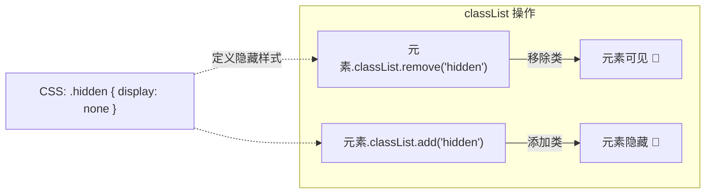
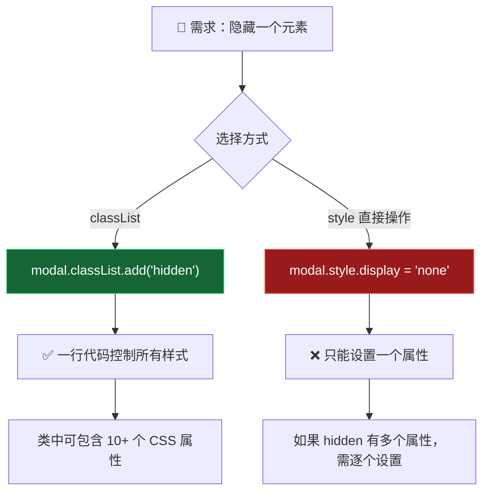
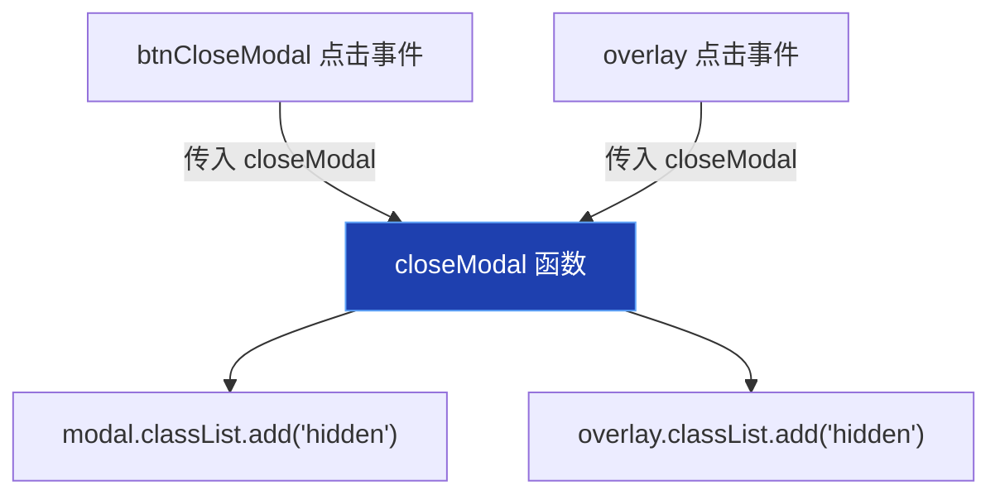
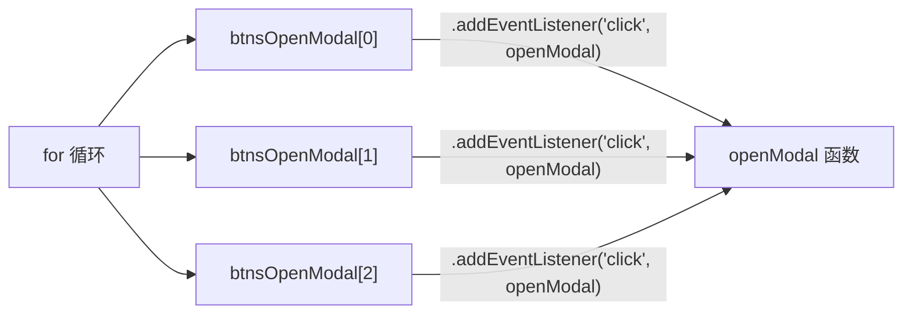
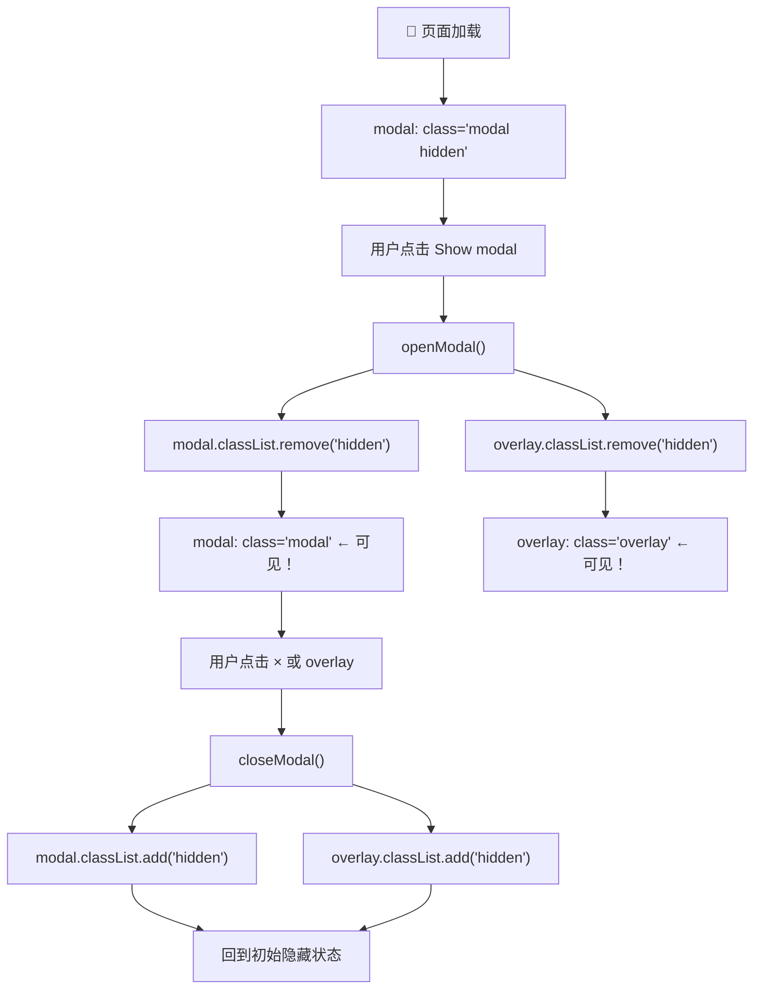

# 使用 CSS 类操作 (Working With Classes)

> 📺 来源：`013 Working With Classes.en.srt`
> 📂 章节：第 07 章

## 📌 知识脉络
- **前置知识**：DOM 选择器（`querySelector`/`querySelectorAll`）、事件监听（`addEventListener`）、`for` 循环遍历 NodeList、CSS `display` 属性
- **后续扩展**：`classList.contains()` 判断类是否存在、键盘事件（`keydown`/`keyup`）、CSS 过渡动画与类切换配合、事件委托模式

## 🎯 概述

本节课实现模态窗口的**打开与关闭**功能。核心知识点是通过 `classList.add()` 和 `classList.remove()` 操作 CSS 类来控制元素的显示/隐藏。这是 Web 开发中**最主流的样式操控方式**，比直接修改 `style` 属性更优雅、更高效。此外，还涉及将事件处理逻辑提取为**命名函数**以实现多处复用。

## 核心知识点

### 1. classList API：添加与移除类

> 🧩 **生活类比**：CSS 类就像手机的"勿扰模式"开关。打开勿扰模式（添加 `hidden` 类），所有通知都被屏蔽（元素隐藏）；关闭勿扰模式（移除 `hidden` 类），通知恢复（元素显示）。你不需要逐个关闭每个 App 的通知，一个开关搞定一切。

```js
// 打开模态窗口：移除 hidden 类
const openModal = function () {
  modal.classList.remove('hidden');     // 模态窗口显示
  overlay.classList.remove('hidden');   // 背景遮罩显示
};

// 关闭模态窗口：添加 hidden 类
const closeModal = function () {
  modal.classList.add('hidden');        // 模态窗口隐藏
  overlay.classList.add('hidden');      // 背景遮罩隐藏
};
```



**⚠️ 注意**：`classList.add()` 和 `classList.remove()` 中的类名**不需要**加 `.` 前缀。`.hidden` 是 CSS 选择器语法，而 `classList` 操作的是纯类名 `'hidden'`。

**🔍 执行追踪：**

点击 "Show modal" 按钮：

| 步骤 | 操作 | modal 的 class | overlay 的 class | 页面效果 |
|------|------|----------------|------------------|---------|
| 初始 | — | `modal hidden` | `overlay hidden` | 两者都不可见 |
| ① | `modal.classList.remove('hidden')` | `modal` | `overlay hidden` | 模态窗口出现 |
| ② | `overlay.classList.remove('hidden')` | `modal` | `overlay` | 背景遮罩出现 |

点击关闭按钮：

| 步骤 | 操作 | modal 的 class | overlay 的 class | 页面效果 |
|------|------|----------------|------------------|---------|
| ① | `modal.classList.add('hidden')` | `modal hidden` | `overlay` | 模态窗口消失 |
| ② | `overlay.classList.add('hidden')` | `modal hidden` | `overlay hidden` | 背景遮罩消失 |

> 💡 **记忆口诀**：**"remove 就是秀，add 就是藏"** —— `remove('hidden')` 移除隐藏类让元素登场，`add('hidden')` 添加隐藏类让元素退场。

---

### 2. classList vs style 直接操作

> 🧩 **生活类比**：假设你要把房间布置成"派对模式"——灯光调暗、音乐打开、窗帘拉上。用 `style` 就像手动一个一个去做；用 `classList` 就像按下预设好的"派对模式"按钮，一键完成所有设置。



**📊 两种方式对比：**

| 维度 | `classList` 操作 | `style` 直接操作 |
|------|-----------------|-----------------|
| 语法 | `el.classList.add('hidden')` | `el.style.display = 'none'` |
| 批量修改 | ✅ 一个类包含多个 CSS 属性 | ❌ 每个属性需单独设置 |
| 样式与逻辑分离 | ✅ 样式定义在 CSS 中 | ❌ 样式写在 JS 中 |
| 可维护性 | ✅ 改 CSS 即可，JS 不动 | ❌ 每处都要改 JS |
| 适用场景 | 大多数场景（推荐） | 需要动态计算的样式（如动画位置） |

```js
// ❌ 如果 hidden 类有多个属性，style 方式要逐个设置
modal.style.display = 'none';
modal.style.opacity = '0';
modal.style.visibility = 'hidden';
modal.style.transform = 'translateY(-100px)';

// ✅ classList 方式一行搞定
modal.classList.add('hidden');
// CSS 中: .hidden { display: none; opacity: 0; visibility: hidden; transform: translateY(-100px); }
```

> **💼 业务场景**：在真实项目中，一个 `hidden` 类可能同时控制 `display: none`、`opacity: 0`、`transform: scale(0)` 和 `transition` 动画。使用 `classList` 只需一行 JS 代码即可切换所有这些样式，而用 `style` 则需要 4+ 行。

---

### 3. 命名函数与事件处理器复用

> 🧩 **生活类比**：匿名函数就像一个没有名字的临时工——只能干一次活。命名函数就像正式员工——有名字，哪个部门需要都可以调过去干活。当多个事件都需要执行同样的操作时，你需要一个"正式员工"。

关闭模态窗口的操作需要在**两个地方**触发：点击关闭按钮（×）和点击背景遮罩。如果用匿名函数，代码会重复：

:::code-comparison
```js {title="🚨 重复的匿名函数"}
// 关闭按钮
btnCloseModal.addEventListener('click', function () {
  modal.classList.add('hidden');
  overlay.classList.add('hidden');
});

// 背景遮罩（完全重复！）
overlay.addEventListener('click', function () {
  modal.classList.add('hidden');
  overlay.classList.add('hidden');
});
```
```js {title="✨ 提取为命名函数"}
// 定义一次
const closeModal = function () {
  modal.classList.add('hidden');
  overlay.classList.add('hidden');
};

// 复用多次
btnCloseModal.addEventListener('click', closeModal);
overlay.addEventListener('click', closeModal);
```
:::



**⚠️ 关键陷阱：传入函数引用 vs 调用函数**

```js
// ✅ 正确：传入函数引用（不加括号）
btnCloseModal.addEventListener('click', closeModal);

// ❌ 错误：调用函数（加了括号）—— 页面加载时立即执行！
btnCloseModal.addEventListener('click', closeModal());
```

加了 `()` 会**立即调用**函数并把返回值（`undefined`）传给 `addEventListener`，而不是把函数本身传进去。

---

### 4. 为多个按钮批量绑定事件

使用 `for` 循环遍历 NodeList，为每个 "Show modal" 按钮绑定 `openModal` 事件：

```js
// 为所有打开按钮绑定事件
for (let i = 0; i < btnsOpenModal.length; i++) {
  btnsOpenModal[i].addEventListener('click', openModal);
}
```



---

## 🛠️ 代码实战与真实场景

> **💼 业务场景**：你正在开发一个任务管理应用。每个任务卡片都有一个"完成"按钮，点击后需要为该任务卡片添加一个 `completed` 类（显示删除线和半透明效果）。再次点击则移除该类。

```js {runnable} {title="classlist_demo.js"}
// 模拟 classList 操作（纯 JS 环境没有真实 DOM，这里用对象模拟）
class MockElement {
  constructor(name) {
    this.name = name;
    this.classes = new Set();
  }
  get classList() {
    const self = this;
    return {
      add(cls) {
        self.classes.add(cls);
        console.log(`  ➕ ${self.name}.classList.add('${cls}') → [${[...self.classes]}]`);
      },
      remove(cls) {
        self.classes.delete(cls);
        console.log(`  ➖ ${self.name}.classList.remove('${cls}') → [${[...self.classes]}]`);
      },
      contains(cls) {
        return self.classes.has(cls);
      },
      toggle(cls) {
        if (self.classes.has(cls)) {
          self.classes.delete(cls);
          console.log(`  🔄 ${self.name}.classList.toggle('${cls}') → 移除 → [${[...self.classes]}]`);
        } else {
          self.classes.add(cls);
          console.log(`  🔄 ${self.name}.classList.toggle('${cls}') → 添加 → [${[...self.classes]}]`);
        }
      }
    };
  }
}

// 模拟模态窗口操作
const modal = new MockElement('modal');
const overlay = new MockElement('overlay');

// 初始状态：都有 hidden 类
modal.classList.add('hidden');
overlay.classList.add('hidden');

console.log('\n=== 打开模态窗口 ===');
modal.classList.remove('hidden');
overlay.classList.remove('hidden');

console.log('\n=== 关闭模态窗口 ===');
modal.classList.add('hidden');
overlay.classList.add('hidden');

console.log('\n=== toggle 演示 ===');
const task = new MockElement('task-card');
task.classList.toggle('completed'); // 添加
task.classList.toggle('completed'); // 移除
task.classList.toggle('completed'); // 再添加
```



**📊 输入输出示例：**

| 操作 | classList 方法 | 执行前 class | 执行后 class | 元素状态 |
|------|---------------|-------------|-------------|---------|
| 打开模态 | `remove('hidden')` | `modal hidden` | `modal` | 可见 |
| 关闭模态 | `add('hidden')` | `modal` | `modal hidden` | 隐藏 |
| 切换完成 | `toggle('completed')` | `task` | `task completed` | 有删除线 |
| 再次切换 | `toggle('completed')` | `task completed` | `task` | 无删除线 |

## 💡 关键要点
- ✅ **`classList.add/remove`** 是操控样式的首选方式，比直接修改 `style` 属性更优雅
- ✅ 类名参数**不加 `.` 前缀**——`'hidden'` 而非 `'.hidden'`
- ✅ 一个 CSS 类可以包含**多个属性**，`classList` 操作相当于一键批量切换
- ✅ 多个事件需要相同逻辑时，提取为**命名函数**传入 `addEventListener`
- ✅ 传入事件处理器时**不加括号**——`closeModal` 而非 `closeModal()`

## ⚠️ 常见误区
- ⚠️ **误区 1**：在 `classList.add()` 中加了 `.` 前缀。`classList.add('.hidden')` 会添加一个叫 `".hidden"` 的类（含点号），而不是 `hidden`。正确写法是 `classList.add('hidden')`。
- ⚠️ **误区 2**：传入事件处理器时加了 `()`。`addEventListener('click', closeModal())` 会立即执行 `closeModal` 并把返回值（`undefined`）作为处理器，导致点击时什么也不会发生。
- ⚠️ **误区 3**：只隐藏了模态窗口但忘记同时隐藏遮罩层。如果只执行 `modal.classList.add('hidden')` 而遗漏了 `overlay.classList.add('hidden')`，页面会被半透明遮罩覆盖且无法点击。

## 🐛 报错实验室

**❌ 错误写法：**
```js
// classList 方法名拼写错误
modal.classlist.add('hidden'); // ⛔ classlist 首字母小写
```

**浏览器报错：**
```
Uncaught TypeError: Cannot read properties of undefined (reading 'add')
```

**🔑 解读**：`classList` 是正确的拼写（大写 L），而 `classlist`（全小写）是 `undefined`。JavaScript 区分大小写，`classList` 是 DOM 元素的内置属性名，必须严格匹配。

---

## 📖 词汇速查表 (Cheat Sheet)

| 中文术语 | 英文术语 | 简明释义 | 速查代码 | 📚 官方文档 |
|---------|---------|---------|---------|-----------|
| 类列表 | classList | 操作元素 CSS 类的 API | `el.classList.add('x')` | [MDN](https://developer.mozilla.org/zh-CN/docs/Web/API/Element/classList) |
| 添加类 | classList.add | 为元素添加一个或多个 CSS 类 | `el.classList.add('hidden')` | [MDN](https://developer.mozilla.org/zh-CN/docs/Web/API/DOMTokenList/add) |
| 移除类 | classList.remove | 从元素移除一个或多个 CSS 类 | `el.classList.remove('hidden')` | [MDN](https://developer.mozilla.org/zh-CN/docs/Web/API/DOMTokenList/remove) |
| 切换类 | classList.toggle | 有则移除、无则添加 | `el.classList.toggle('active')` | [MDN](https://developer.mozilla.org/zh-CN/docs/Web/API/DOMTokenList/toggle) |
| 函数表达式 | Function Expression | 将函数赋值给变量 | `const fn = function() {}` | [MDN](https://developer.mozilla.org/zh-CN/docs/Web/JavaScript/Reference/Operators/function) |
| 事件监听器 | addEventListener | 为元素绑定事件处理函数 | `el.addEventListener('click', fn)` | [MDN](https://developer.mozilla.org/zh-CN/docs/Web/API/EventTarget/addEventListener) |

---

## 🧪 学习验证

### 📝 动手练习

**练习 1：实现深色模式切换**

```js {runnable} {title="exercise1.js"}
// 模拟一个深色模式切换按钮
// 点击按钮 → 如果 body 没有 'dark-mode' 类就添加，有就移除

const body = { classes: new Set(), classList: null };
body.classList = {
  add(c) { body.classes.add(c); },
  remove(c) { body.classes.delete(c); },
  contains(c) { return body.classes.has(c); },
  toggle(c) {
    if (body.classes.has(c)) { body.classes.delete(c); return false; }
    else { body.classes.add(c); return true; }
  }
};

function toggleDarkMode() {
  // 你的代码：使用 classList 切换 dark-mode 类
  // 输出当前模式
}

// 测试
toggleDarkMode(); // 应输出：深色模式已开启
toggleDarkMode(); // 应输出：深色模式已关闭
toggleDarkMode(); // 应输出：深色模式已开启
```

<details><summary>💡 参考答案</summary>

```js
function toggleDarkMode() {
  const isDark = body.classList.toggle('dark-mode');
  console.log(isDark ? '🌙 深色模式已开启' : '☀️ 深色模式已关闭');
  console.log(`  当前 class: [${[...body.classes]}]`);
}

toggleDarkMode(); // 🌙 深色模式已开启
toggleDarkMode(); // ☀️ 深色模式已关闭
toggleDarkMode(); // 🌙 深色模式已开启
```

**解题思路**：`classList.toggle()` 是最简洁的方案——它返回 `true`（添加了类）或 `false`（移除了类），可以直接用来判断当前状态。

</details>

**练习 2：创建通用的 showElement 和 hideElement 工具函数**

```js {runnable} {title="exercise2.js"}
// 创建两个工具函数，接收元素对象，控制其显示/隐藏
// 要求：同时处理模态窗口和遮罩层

function showElement(element) {
  // 你的代码
}

function hideElement(element) {
  // 你的代码
}

// 测试（模拟）
const mockEl = { name: 'test', classes: new Set(['hidden']) };
console.log(`初始: classes = [${[...mockEl.classes]}]`);
// showElement(mockEl); → 移除 hidden
// hideElement(mockEl); → 添加 hidden
```

<details><summary>💡 参考答案</summary>

```js
function showElement(element) {
  element.classList.remove('hidden');
}

function hideElement(element) {
  element.classList.add('hidden');
}

// 在模态窗口项目中使用
const openModal = function () {
  showElement(modal);
  showElement(overlay);
};

const closeModal = function () {
  hideElement(modal);
  hideElement(overlay);
};
```

**解题思路**：将 `classList.add/remove('hidden')` 封装为语义化的工具函数，提高代码可读性。`showElement` 和 `hideElement` 比直接的 `classList` 操作更容易理解意图。

</details>

### ❓ 理解检测

:::quiz {correct="B"}
**1. 为什么推荐使用 `classList` 操作而非直接修改 `style` 属性？**
- A) `classList` 操作性能更高
- B) 一个 CSS 类可以包含多个属性，`classList` 可以一行代码批量切换
- C) `style` 属性不支持 `display: none`
- D) `classList` 可以跨浏览器兼容

> **解析**：核心优势在于 CSS 类是"属性集合"——一个 `hidden` 类可能同时定义 `display: none`、`opacity: 0`、`transform` 等多个属性。用 `classList.add('hidden')` 一行代码就能切换所有这些样式，而用 `style` 则需要逐个设置。此外，样式定义保留在 CSS 中，实现了样式与逻辑分离。
:::

:::quiz {correct="C"}
**2. 以下哪种写法会导致事件处理器失效？**
- A) `btn.addEventListener('click', closeModal)`
- B) `btn.addEventListener('click', function() { closeModal(); })`
- C) `btn.addEventListener('click', closeModal())`
- D) `btn.addEventListener('click', () => closeModal())`

> **解析**：选项 C 中 `closeModal()` 加了括号，会**立即执行**函数并将返回值（`undefined`）传给 `addEventListener`。这意味着点击时没有可执行的函数。A 传入函数引用、B 和 D 用包装函数延迟调用，都是正确的。
:::

:::quiz {correct="A"}
**3. `classList.add('hidden')` 和 `classList.add('.hidden')` 的区别是什么？**
- A) 前者添加名为 `hidden` 的类，后者添加名为 `.hidden` 的类（含点号，不正确）
- B) 两者完全等价
- C) 前者是 CSS 选择器语法，后者是 classList 语法
- D) 后者会自动识别并移除点号

> **解析**：`classList` 操作的是纯类名，**不需要**加 CSS 选择器的 `.` 前缀。如果写 `classList.add('.hidden')`，会在元素上添加一个名为 `".hidden"`（包含点号）的类，这与 CSS 中定义的 `.hidden` 不匹配，样式不会生效。
:::

### 🔧 代码填空

:::fill-blank
// 打开模态窗口
const openModal = function () {
  modal.classList.___remove___('hidden');
  overlay.classList.___remove___('hidden');
};

// 关闭模态窗口
const closeModal = function () {
  modal.classList.___add___('hidden');
  overlay.classList.___add___('hidden');
};

// 绑定事件（不加括号！）
btnCloseModal.addEventListener('click', ___closeModal___);
overlay.addEventListener('click', ___closeModal___);
:::
