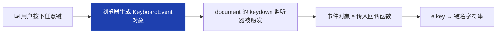
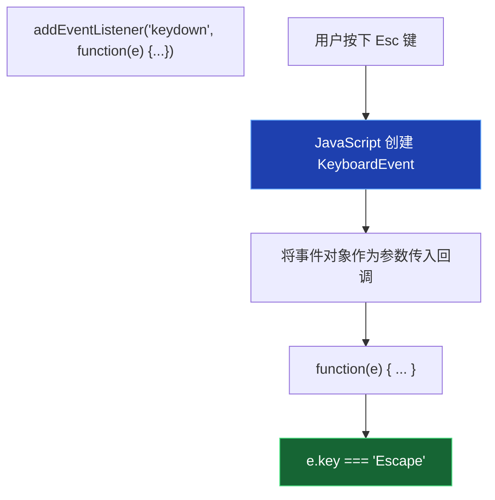
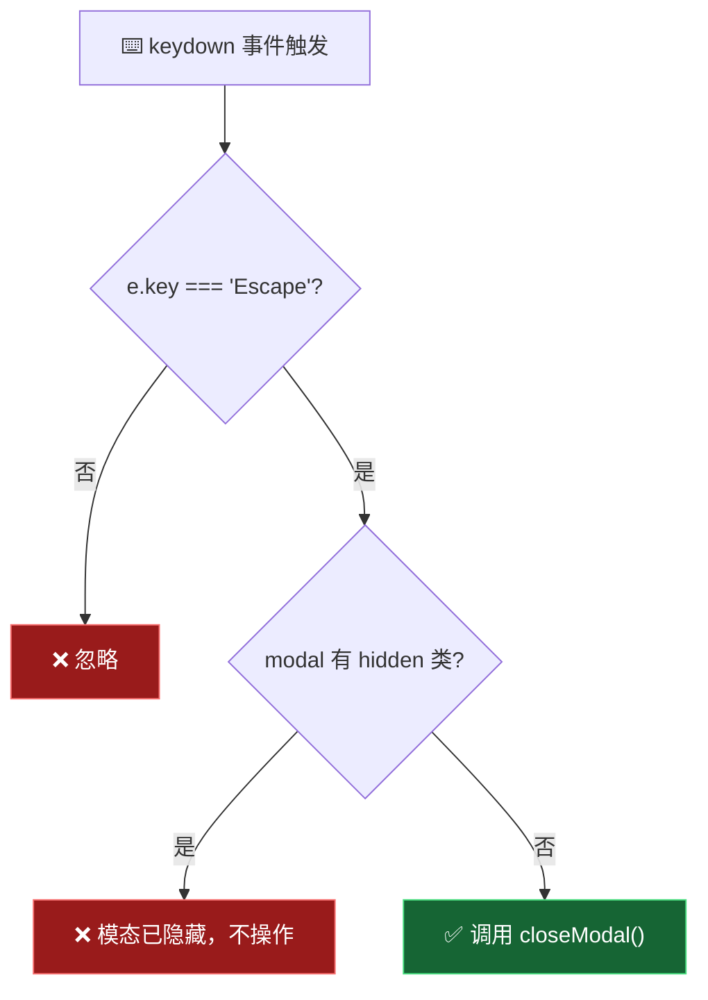
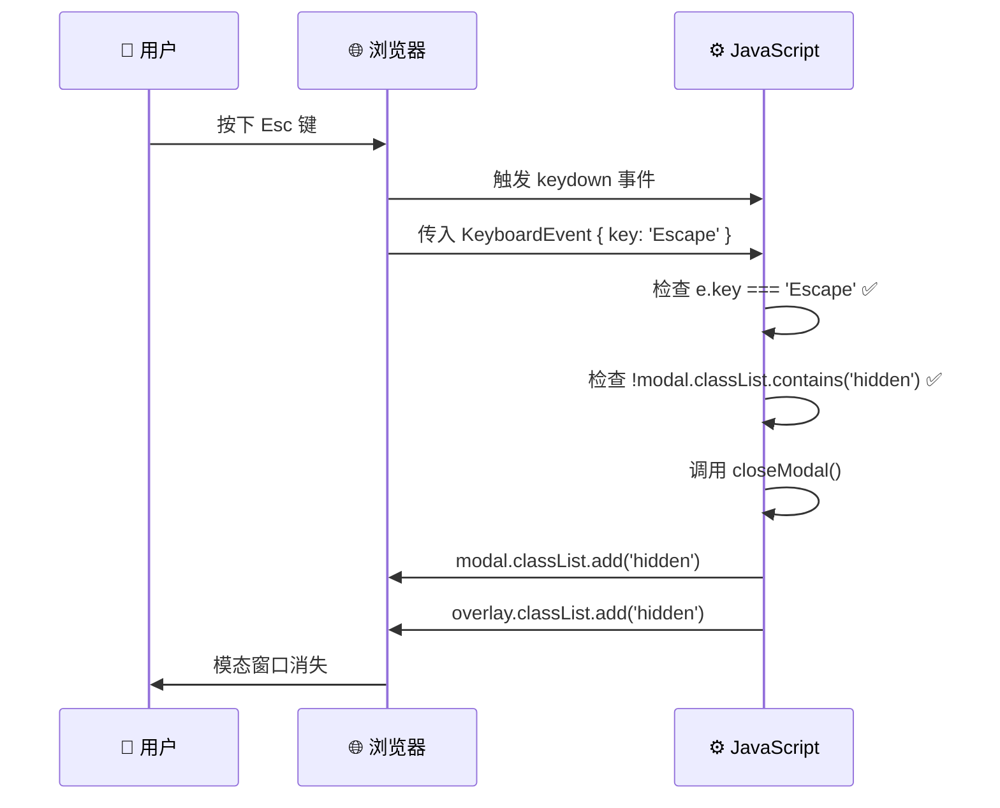

# 处理 Esc 键盘事件 (Handling an Esc Keypress Event)

> 📺 来源：`014 Handling an Esc Keypress Event.en.srt`
> 📂 章节：第 07 章

## 📌 知识脉络
- **前置知识**：`addEventListener` 事件监听、`classList.add/remove/contains` 类操作、函数定义与调用、逻辑非运算符 `!`
- **后续扩展**：键盘事件高级处理（`keyup`/`keypress`）、事件对象（Event Object）详解、事件冒泡与捕获、`e.preventDefault()` 阻止默认行为

## 🎯 概述

本节课为模态窗口添加**鍵盘 Esc 关闭**功能。核心学习点包括：全局键盘事件的监听方式、**事件对象（Event Object）** 的概念与使用、`classList.contains()` 判断类是否存在，以及使用 `&&` 运算符合并多个条件判断。

## 核心知识点

### 1. 键盘事件的监听方式

> 🧩 **生活类比**：点击事件像"门铃"——有人按了你家具体哪个门铃你就知道。键盘事件像"门岗对讲机"——整栋楼共用一个，不管哪层楼的人按了，门岗都能听到并识别是谁。所以键盘事件**不绑定在特定元素上**，而是绑定在 `document` 上。

键盘事件有三种类型：

| 事件类型 | 触发时机 | 使用频率 |
|---------|---------|---------|
| `keydown` | 按键**按下**时触发 | ⭐ 最常用 |
| `keyup` | 按键**松开**时触发 | 较少用 |
| `keypress` | 按键按下并产生字符时 | ⚠️ 已废弃 |

```js
// 监听全局键盘按下事件
document.addEventListener('keydown', function (e) {
  console.log(e.key); // 输出按下的键名
});
```



**为什么绑定在 `document` 上？**

键盘事件是**全局事件**——按键按下时没有"目标元素"的概念（除非焦点在 input 中）。`document` 是整个页面文档的根节点，在它上面监听可以**捕获所有键盘操作**。

---

### 2. 事件对象（Event Object）

> 🧩 **生活类比**：当你接到一个电话，来电显示不仅告诉你"有人打电话了"（事件发生），还显示来电号码、来电时间、是否为陌生号码等信息（事件对象）。`e` 就是这个"来电显示"。

每当事件发生时，JavaScript 引擎会自动创建一个**事件对象**并传给事件处理函数。开发者通过给函数添加参数来接收它：

```js
document.addEventListener('keydown', function (e) {
  // e 是 JavaScript 自动传入的事件对象
  console.log(e);       // 完整的 KeyboardEvent 对象
  console.log(e.key);   // "Escape"、"Enter"、"a" 等
  console.log(e.code);  // "Escape"、"Enter"、"KeyA" 等
});
```



**🔍 执行追踪：** 按下不同键时的 `e.key` 值

| 按键 | `e.key` 值 | `e.code` 值 |
|------|-----------|------------|
| Esc | `"Escape"` | `"Escape"` |
| Enter | `"Enter"` | `"Enter"` |
| 空格 | `" "` | `"Space"` |
| A 键 | `"a"` / `"A"` | `"KeyA"` |
| Shift | `"Shift"` | `"ShiftLeft"` |
| Ctrl | `"Control"` | `"ControlLeft"` |

> 💡 **记忆口诀**：**"e 是信封，key 是信纸"** —— 事件对象 `e` 像一个装满信息的信封，`e.key` 就是里面最关键的那张信纸——告诉你到底按了哪个键。

---

### 3. classList.contains() 检查类是否存在

> 🧩 **生活类比**：`classList.contains()` 就像检查你的购物车里是否已经有某件商品——如果有就不再添加，如果没有就可以加入。它返回 `true` 或 `false`。

```js
// 检查模态窗口是否被隐藏
modal.classList.contains('hidden'); // true → 隐藏中 / false → 显示中
```

在 Esc 事件处理中，我们需要确保**只在模态窗口可见时才关闭它**：

```js
document.addEventListener('keydown', function (e) {
  if (e.key === 'Escape' && !modal.classList.contains('hidden')) {
    closeModal();
  }
});
```

**🔍 执行追踪：**

| 场景 | `e.key` | `modal` 有 `hidden`? | `contains('hidden')` | `!contains(...)` | 结果 |
|------|---------|---------------------|---------------------|------------------|------|
| 按 Esc，模态已显示 | `'Escape'` | 否 | `false` | `true` | ✅ 关闭模态 |
| 按 Esc，模态已隐藏 | `'Escape'` | 是 | `true` | `false` | ❌ 不执行 |
| 按 Enter，模态已显示 | `'Enter'` | 否 | — | — | ❌ 不执行 |



---

### 4. 条件合并：从嵌套 if 到 &&

两个嵌套的 `if` 可以用 `&&` 运算符合并为一个条件：

:::code-comparison
```js {title="🚨 嵌套 if（冗余）"}
if (e.key === 'Escape') {
  if (!modal.classList.contains('hidden')) {
    closeModal();
  }
}
```
```js {title="✨ && 合并（简洁）"}
if (e.key === 'Escape' && !modal.classList.contains('hidden')) {
  closeModal();
}
```
:::

两种写法**逻辑完全相同**，但 `&&` 版本更简洁。`&&` 具有**短路求值**特性——如果 `e.key !== 'Escape'`，第二个条件不会被评估。

**📊 概念对比：调用 closeModal() vs 传入 closeModal**

| 情境 | 写法 | 是否加 `()` | 原因 |
|------|------|:-----------:|------|
| 事件处理器参数 | `addEventListener('click', closeModal)` | ❌ 不加 | 传入**函数引用**，让浏览器在事件发生时调用 |
| 手动调用函数 | `closeModal()` | ✅ 加 | 在此处**立即执行**函数 |

> **💼 业务场景**：在实际的后台管理系统中，很多弹窗（确认删除、表单编辑、预览图片）都需要支持 Esc 关闭。掌握 `keydown` + `classList.contains()` 的组合是基础技能。

---

## 🛠️ 代码实战与真实场景

> **💼 业务场景**：你在开发一个图片画廊应用，点击图片会弹出大图预览（Lightbox）。用户需要能通过 Esc 键关闭预览，同时支持左右箭头键切换图片。

```js {runnable} {title="keyboard_event_demo.js"}
// 模拟键盘事件处理系统
const keyActions = {
  Escape: '🚪 关闭弹窗',
  ArrowLeft: '⬅️ 上一张图片',
  ArrowRight: '➡️ 下一张图片',
  Enter: '✅ 确认选择',
};

// 模拟事件处理
function handleKeyDown(key) {
  console.log(`⌨️ 按下: ${key}`);

  if (keyActions[key]) {
    console.log(`  → 执行: ${keyActions[key]}`);
  } else {
    console.log(`  → 无绑定操作，忽略`);
  }
}

// 模拟一系列按键
const keySequence = ['a', 'Escape', 'ArrowLeft', 'ArrowRight', 'Enter', 'Shift'];
console.log('=== 模拟键盘操作序列 ===\n');
for (let i = 0; i < keySequence.length; i++) {
  handleKeyDown(keySequence[i]);
}

// 模拟 classList.contains 检查
console.log('\n=== 模拟 Esc 关闭逻辑 ===');
let isModalVisible = true;

function simulateEscPress() {
  const key = 'Escape';
  console.log(`⌨️ 按下 ${key}`);
  console.log(`  模态窗口可见? ${isModalVisible}`);

  if (key === 'Escape' && isModalVisible) {
    isModalVisible = false;
    console.log('  ✅ 执行 closeModal() → 模态已关闭');
  } else if (key === 'Escape' && !isModalVisible) {
    console.log('  ❌ 模态已隐藏，不操作');
  }
}

simulateEscPress(); // 第一次：关闭
simulateEscPress(); // 第二次：不操作
```



**📊 输入输出示例：**

| 按键 | 模态可见? | `e.key === 'Escape'` | `!contains('hidden')` | 操作 |
|------|----------|---------------------|----------------------|------|
| Esc | ✅ 是 | `true` | `true` | 关闭模态 |
| Esc | ❌ 否 | `true` | `false` | 无操作 |
| Enter | ✅ 是 | `false` | — | 无操作 |
| A | ❌ 否 | `false` | — | 无操作 |

## 💡 关键要点
- ✅ 键盘事件绑定在 `document` 上，因为它是**全局事件**
- ✅ `keydown` 是最常用的键盘事件类型，在按键**按下时**触发
- ✅ 事件对象 `e` 由 JavaScript 引擎**自动创建并传入**回调函数
- ✅ `e.key` 返回按键名称字符串（如 `'Escape'`、`'Enter'`）
- ✅ `classList.contains()` 用于检查元素是否拥有某个 CSS 类

## ⚠️ 常见误区
- ⚠️ **误区 1**：将键盘事件绑定到 `modal` 元素上。`div` 元素默认不接收键盘事件（除非设置了 `tabindex`），必须绑定到 `document` 上。
- ⚠️ **误区 2**：使用已废弃的 `keypress` 事件或 `e.keyCode`。`keypress` 已被标记为废弃，`e.keyCode` 也不推荐使用。现代标准是 `keydown` + `e.key`。
- ⚠️ **误区 3**：忘记检查模态窗口是否可见就直接关闭。如果模态已经隐藏，调用 `closeModal()` 虽然不会报错，但会执行不必要的 DOM 操作。加上 `!contains('hidden')` 检查是好习惯。

## 🐛 报错实验室

**❌ 错误写法：**
```js
// 忘记给回调函数添加参数 e
document.addEventListener('keydown', function () {
  console.log(e.key); // ⛔ e 未定义！
});
```

**浏览器报错：**
```
Uncaught ReferenceError: e is not defined
```

**🔑 解读**：事件对象虽然由 JavaScript 自动创建，但必须通过**函数参数**来接收它。如果参数列表为空 `function ()`，函数内部就没有变量引用这个事件对象。正确写法是 `function (e)` 或任何参数名如 `function (event)`。

---

## 📖 词汇速查表 (Cheat Sheet)

| 中文术语 | 英文术语 | 简明释义 | 速查代码 | 📚 官方文档 |
|---------|---------|---------|---------|-----------|
| 键盘按下事件 | keydown | 按键被按下时触发 | `document.addEventListener('keydown', fn)` | [MDN](https://developer.mozilla.org/zh-CN/docs/Web/API/Element/keydown_event) |
| 事件对象 | Event Object | 包含事件信息的对象 | `function (e) { e.key }` | [MDN](https://developer.mozilla.org/zh-CN/docs/Web/API/Event) |
| 键盘事件 | KeyboardEvent | 键盘操作的事件对象 | `e.key`, `e.code` | [MDN](https://developer.mozilla.org/zh-CN/docs/Web/API/KeyboardEvent) |
| 包含判断 | classList.contains | 检查元素是否有某类 | `el.classList.contains('hidden')` | [MDN](https://developer.mozilla.org/zh-CN/docs/Web/API/DOMTokenList/contains) |
| 逻辑与 | && (AND) | 两个条件都为 true 才为 true | `a && b` | [MDN](https://developer.mozilla.org/zh-CN/docs/Web/JavaScript/Reference/Operators/Logical_AND) |
| 逻辑非 | ! (NOT) | 取反布尔值 | `!true === false` | [MDN](https://developer.mozilla.org/zh-CN/docs/Web/JavaScript/Reference/Operators/Logical_NOT) |

---

## 🧪 学习验证

### 📝 动手练习

**练习 1：实现多快捷键支持**

为页面添加键盘快捷键：`Escape` 关闭弹窗、`Enter` 确认操作、`?` 显示帮助。

```js {runnable} {title="exercise1.js"}
// 模拟快捷键处理器
function handleShortcut(key) {
  // 你的代码：根据 key 执行不同操作
  // Escape → "关闭弹窗"
  // Enter → "确认操作"
  // ? → "显示帮助"
  // 其他 → "未绑定快捷键"
}

// 测试
handleShortcut('Escape');
handleShortcut('Enter');
handleShortcut('?');
handleShortcut('a');
```

<details><summary>💡 参考答案</summary>

```js
function handleShortcut(key) {
  if (key === 'Escape') {
    console.log('🚪 关闭弹窗');
  } else if (key === 'Enter') {
    console.log('✅ 确认操作');
  } else if (key === '?') {
    console.log('❓ 显示帮助面板');
  } else {
    console.log(`⚙️ "${key}" 未绑定快捷键`);
  }
}

handleShortcut('Escape'); // 🚪 关闭弹窗
handleShortcut('Enter');  // ✅ 确认操作
handleShortcut('?');      // ❓ 显示帮助面板
handleShortcut('a');      // ⚙️ "a" 未绑定快捷键
```

**解题思路**：用 `if/else if` 链根据 `e.key` 的值分发不同操作。在真实项目中，也可以用对象映射（`{ Escape: fn1, Enter: fn2 }`）来替代长链式条件判断。

</details>

**练习 2：实现带条件检查的安全 Esc 关闭**

```js {runnable} {title="exercise2.js"}
// 实现：只有在模态可见时，按 Esc 才关闭
// 同时输出操作日志

let modalVisible = false;

function openModal() {
  modalVisible = true;
  console.log('📭 模态窗口已打开');
}

function closeModal() {
  modalVisible = false;
  console.log('📪 模态窗口已关闭');
}

function handleKeyDown(key) {
  // 你的代码
}

// 测试序列
openModal();
handleKeyDown('Enter');   // 不应关闭
handleKeyDown('Escape');  // 应关闭
handleKeyDown('Escape');  // 模态已关闭，不应操作
```

<details><summary>💡 参考答案</summary>

```js
let modalVisible = false;

function openModal() {
  modalVisible = true;
  console.log('📭 模态窗口已打开');
}

function closeModal() {
  modalVisible = false;
  console.log('📪 模态窗口已关闭');
}

function handleKeyDown(key) {
  console.log(`⌨️ 按下: ${key} | 模态可见: ${modalVisible}`);
  if (key === 'Escape' && modalVisible) {
    closeModal();
  } else if (key === 'Escape' && !modalVisible) {
    console.log('  ❌ 模态已隐藏，忽略 Esc');
  } else {
    console.log(`  ❌ "${key}" 不触发关闭`);
  }
}

openModal();
handleKeyDown('Enter');   // 不应关闭
handleKeyDown('Escape');  // 应关闭
handleKeyDown('Escape');  // 模态已关闭，不应操作
```

**解题思路**：关键是 `&&` 连接两个条件——`key === 'Escape'` **且** `modalVisible === true`。这确保了只有"按对键"且"该关的时候"才执行关闭。

</details>

### ❓ 理解检测

:::quiz {correct="A"}
**1. 键盘事件为什么要绑定在 `document` 上而非某个按钮上？**
- A) 键盘事件是全局事件，需要在文档级别监听才能捕获所有按键
- B) 因为按钮元素不支持 `addEventListener`
- C) 这是 JavaScript 的硬性规定
- D) 绑定在按钮上会导致性能问题

> **解析**：键盘事件（`keydown`/`keyup`）不像 `click` 那样有明确的目标元素。当用户按下键盘时，如果没有焦点元素（如 input），事件会在 `document` 级别触发。因此绑定在 `document` 上可以全局捕获所有键盘操作。
:::

:::quiz {correct="C"}
**2. 事件处理函数中的参数 `e` 是如何获得值的？**
- A) 开发者需要手动创建并传入
- B) 它是一个全局变量
- C) JavaScript 引擎在事件发生时自动创建并传入回调函数
- D) 从 `addEventListener` 的返回值获取

> **解析**：开发者只需在函数参数列表中声明即可（如 `function(e)`），JavaScript 引擎会在事件发生时**自动创建**一个事件对象并**作为参数传入**回调函数。参数名可以是任意的（`e`、`event`、`evt` 等），但惯例使用 `e`。
:::

:::quiz {correct="B"}
**3. `if (e.key === 'Escape' && !modal.classList.contains('hidden'))` 这行代码的含义是？**
- A) 如果按了 Esc 键，或者模态窗口不含 hidden 类
- B) 如果按了 Esc 键，并且模态窗口不含 hidden 类（即模态可见）
- C) 如果按了 Esc 键，并且模态窗口含有 hidden 类（即模态隐藏）
- D) 如果没按 Esc 键，并且模态窗口含有 hidden 类

> **解析**：`&&` 是逻辑与——两个条件都为 `true` 才执行。`!modal.classList.contains('hidden')` 中的 `!` 取反，意思是"不包含 hidden 类"，即模态窗口当前是**可见**的。合起来就是"按了 Esc 且模态可见时才关闭"。
:::

### 🔧 代码填空

:::fill-blank
// 监听全局键盘事件
document.addEventListener('___keydown___', function (___e___) {
  // 检查是否按了 Esc 键，且模态窗口当前可见
  if (e.___key___ === 'Escape' && !modal.classList.___contains___('hidden')) {
    ___closeModal___();
  }
});
:::
