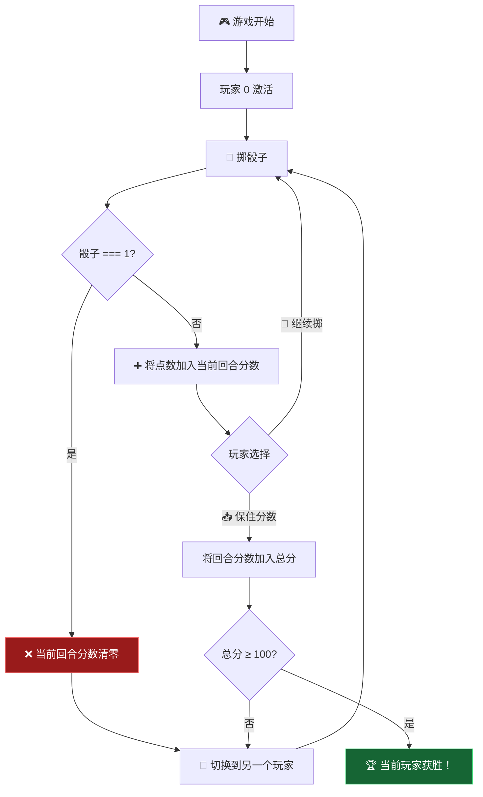
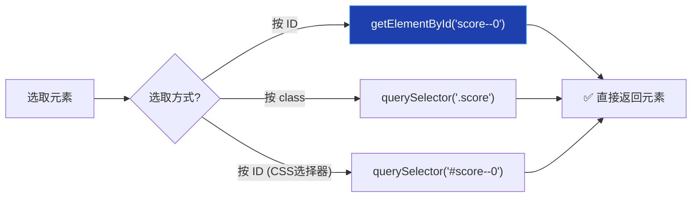
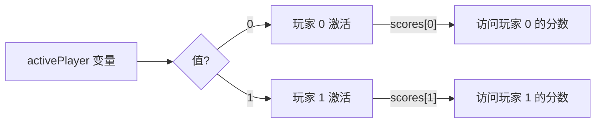
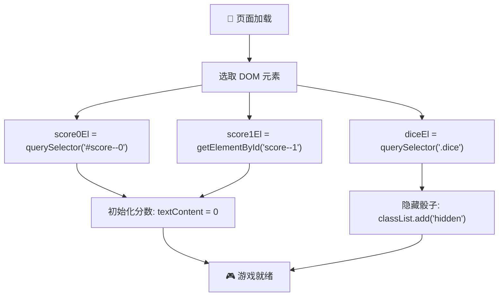

# 项目 #3：猪猪骰子游戏 (PROJECT #3: Pig Game)

> 📺 来源：`015 PROJECT #3 Pig Game.en.srt`
> 📂 章节：第 07 章

## 📌 知识脉络
- **前置知识**：DOM 选择器（`querySelector`、`getElementById`）、`classList` 操作、`textContent` 属性设置、事件监听
- **后续扩展**：骰子投掷逻辑、活跃玩家切换、保持分数功能、游戏重置机制、流程图驱动开发

## 🎯 概述

本节课开启第三个 DOM 操作项目 —— **Pig Game（猪猪骰子游戏）**。这是一个双人回合制骰子游戏：玩家轮流掷骰子累积分数，掷到 1 则失去当前回合分数并换人。核心学习点包括：使用 `getElementById` 按 ID 选取元素、初始化游戏状态、使用**流程图（Flowchart）** 规划游戏逻辑。

## 核心知识点

### 1. 游戏规则与流程图

> 🧩 **生活类比**：Pig Game 就像"贪心"考验——你可以一直掷骰子攒分（贪心），但随时可能掷到 1 而血本无归（代价）。你也可以选择"保住"当前分数（保守）。这模拟了现实中"风险与回报"的决策过程。



**游戏规则摘要：**

| 操作 | 效果 |
|------|------|
| 🎲 Roll Dice | 掷骰子，2-6 加入当前回合分数；掷到 1 则回合分数清零并换人 |
| 📥 Hold | 将当前回合分数加入总分，然后换人 |
| 🔄 New Game | 重置所有分数和状态 |
| 🏆 获胜条件 | 总分率先达到 100 分 |

---

### 2. getElementById vs querySelector

> 🧩 **生活类比**：`querySelector` 像搜索引擎——你输入任何关键词（CSS 选择器）都能找到结果。`getElementById` 像邮局查号台——你报出具体的"ID 编号"，它直接给你对应的信息，更快但功能更单一。

本项目中玩家分数元素使用了 **ID** 而非 **class**，因为每个分数是唯一的：

```html
<p class="score" id="score--0">43</p>  <!-- 玩家 0 的总分 -->
<p class="score" id="score--1">24</p>  <!-- 玩家 1 的总分 -->
```

两种选取方式对比：

```js
// 方式 1：querySelector（需要 # 前缀表示 ID）
const score0El = document.querySelector('#score--0');

// 方式 2：getElementById（直接传 ID 名称，不加 #）
const score1El = document.getElementById('score--1');
```

**📊 两种方法对比：**

| 维度 | `querySelector` | `getElementById` |
|------|----------------|------------------|
| 参数格式 | CSS 选择器（`'#score--0'`） | 纯 ID 名（`'score--0'`） |
| 前缀要求 | 需要 `#` | ❌ 不需要 |
| 选取范围 | ID / class / 标签 / 组合选择器 | 仅 ID |
| 性能 | 稍慢 | ⚡ 稍快 |
| 灵活性 | ✅ 更灵活 | ❌ 仅限 ID |
| 推荐场景 | 大多数场景 | 明确需要按 ID 选取时 |



> 💡 **记忆口诀**：**"querySelector 万能钥匙加 #，getElementById 精准定位免 #"** —— 前者用 CSS 语法所以需要 `#`；后者本身就知道在找 ID，所以不需要。

---

### 3. 初始化游戏状态（Starting Conditions）

> 🧩 **生活类比**：游戏初始化就像棋盘的开局摆放——每颗棋子必须在正确的位置，计分板归零，计时器清零。如果跳过这一步，游戏就会从混乱的状态开始。

```js
'use strict';

// 选取元素
const score0El = document.querySelector('#score--0');
const score1El = document.getElementById('score--1');
const diceEl = document.querySelector('.dice');

// 初始条件
score0El.textContent = 0;  // 玩家 0 分数归零
score1El.textContent = 0;  // 玩家 1 分数归零
diceEl.classList.add('hidden');  // 隐藏骰子图片
```

**🔍 执行追踪：**

| 步骤 | 代码 | DOM 变化 | 页面效果 |
|------|------|---------|---------|
| ① | `score0El.textContent = 0` | `<p id="score--0">0</p>` | 左侧显示 0 |
| ② | `score1El.textContent = 0` | `<p id="score--1">0</p>` | 右侧显示 0 |
| ③ | `diceEl.classList.add('hidden')` | `` | 骰子消失 |

**为什么赋值 `0`（数字）而不是 `'0'`（字符串）？**

`textContent` 接收字符串，但 JavaScript 会**自动将数字转为字符串**（隐式类型转换）。写 `0` 和 `'0'` 效果相同，但语义上分数是数字，所以用 `0` 更合理。

---

### 4. 为什么玩家编号是 0 和 1？

> 🧩 **生活类比**：电脑是"从 0 开始计数"的世界——数组的第一个元素是 `[0]`，第二个是 `[1]`。所以两个玩家命名为 Player 0 和 Player 1，而非 Player 1 和 Player 2。这样可以直接将玩家编号作为数组索引使用。



这样设计的好处在后续课程中会充分体现——可以用 `scores[activePlayer]` 直接访问当前玩家的分数，无需额外的条件判断。

> **💼 业务场景**：在真实的多人游戏应用中（如在线棋牌室），使用流程图先规划游戏逻辑再编码是标准实践。流程图帮助团队对齐理解，也便于后续维护和扩展功能。

---

## 🛠️ 代码实战与真实场景

> **💼 业务场景**：你正在开发一个在线竞答游戏的前端，两队轮流答题，需要初始化双方的分数显示和游戏状态。

```js {runnable} {title="game_init_demo.js"}
// 模拟 Pig Game 初始化过程
const gameState = {
  scores: [0, 0],
  currentScore: 0,
  activePlayer: 0,
  playing: true,
};

// 模拟 DOM 元素
const elements = {
  'score--0': { textContent: '43' },
  'score--1': { textContent: '24' },
  dice: { classes: new Set(['dice']) },
};

console.log('=== 初始化前 ===');
console.log(`玩家 0 分数显示: ${elements['score--0'].textContent}`);
console.log(`玩家 1 分数显示: ${elements['score--1'].textContent}`);
console.log(`骰子 class: [${[...elements.dice.classes]}]`);

// 初始化
function init() {
  gameState.scores = [0, 0];
  gameState.currentScore = 0;
  gameState.activePlayer = 0;
  gameState.playing = true;

  elements['score--0'].textContent = 0;
  elements['score--1'].textContent = 0;
  elements.dice.classes.add('hidden');

  console.log('\n✅ 初始化完成！');
}

init();

console.log('\n=== 初始化后 ===');
console.log(`玩家 0 分数显示: ${elements['score--0'].textContent}`);
console.log(`玩家 1 分数显示: ${elements['score--1'].textContent}`);
console.log(`骰子 class: [${[...elements.dice.classes]}]`);
console.log(`游戏状态:`, gameState);
```



**📊 输入输出示例：**

| 操作 | 初始化前 | 初始化后 |
|------|---------|---------|
| 玩家 0 分数 | `43` | `0` |
| 玩家 1 分数 | `24` | `0` |
| 骰子可见性 | 可见 | 隐藏（含 `hidden` 类） |
| 当前回合分数 | 未定义 | `0` |
| 激活玩家 | 未定义 | `0`（玩家 0） |

## 💡 关键要点
- ✅ 在编写复杂游戏逻辑前，先用**流程图**规划整体逻辑
- ✅ `getElementById` 直接传 ID 名称（不加 `#`），比 `querySelector` 稍快
- ✅ 玩家编号从 `0` 开始（不是 `1`），方便后续用作数组索引
- ✅ 游戏初始化时需要同时重置**数据状态**和 **DOM 显示**
- ✅ 将元素选取放在文件顶部，存入变量，避免重复查询

## ⚠️ 常见误区
- ⚠️ **误区 1**：在 `getElementById` 中加了 `#` 前缀。`getElementById('#score--0')` 会查找 ID 为 `"#score--0"` 的元素（不存在），返回 `null`。正确写法是 `getElementById('score--0')`。
- ⚠️ **误区 2**：忘记初始化游戏状态。页面刷新后 HTML 中的分数不是 0（如 `43` 和 `24`），如果不在 JS 中手动设为 `0`，游戏会从错误的分数开始。
- ⚠️ **误区 3**：混淆玩家编号。后续代码中使用 `scores[activePlayer]` 来访问分数数组，如果玩家编号是 1 和 2 而数组索引是 0 和 1，就会产生偏移错误。

## 🐛 报错实验室

**❌ 错误写法：**
```js
// getElementById 加了 # 前缀
const score0El = document.getElementById('#score--0');
score0El.textContent = 0; // ⛔ score0El 是 null！
```

**浏览器报错：**
```
Uncaught TypeError: Cannot set properties of null (setting 'textContent')
```

**🔑 解读**：`getElementById('#score--0')` 查找 ID 字面值为 `"#score--0"` 的元素（HTML 中不存在），返回 `null`。然后在 `null` 上访问 `.textContent` 就会报错。记住 `getElementById` 的参数是**纯 ID 名**，不需要 CSS 选择器语法。

---

## 📖 词汇速查表 (Cheat Sheet)

| 中文术语 | 英文术语 | 简明释义 | 速查代码 | 📚 官方文档 |
|---------|---------|---------|---------|-----------|
| 按 ID 获取 | getElementById | 通过 ID 选取唯一元素 | `document.getElementById('myId')` | [MDN](https://developer.mozilla.org/zh-CN/docs/Web/API/Document/getElementById) |
| 流程图 | Flowchart | 用图形表示程序逻辑流程 | diagrams.net 在线绘制 | — |
| 文本内容 | textContent | 设置/获取元素的文本 | `el.textContent = 0` | [MDN](https://developer.mozilla.org/zh-CN/docs/Web/API/Node/textContent) |
| 严格模式 | Strict Mode | `'use strict'` 开启严格检查 | `'use strict';` | [MDN](https://developer.mozilla.org/zh-CN/docs/Web/JavaScript/Reference/Strict_mode) |
| CSS display | display: none | 完全隐藏元素 | `.hidden { display: none }` | [MDN](https://developer.mozilla.org/zh-CN/docs/Web/CSS/display) |

---

## 🧪 学习验证

### 📝 动手练习

**练习 1：使用两种方式选取同一元素并验证**

```js {runnable} {title="exercise1.js"}
// 模拟两种选取方式的结果
// 你的任务：说明下面两种方式的区别

// 方式 1
// const el1 = document.querySelector('#score--0');

// 方式 2
// const el2 = document.getElementById('score--0');

// 问题：el1 和 el2 选取的是同一个元素吗？
// 两种方式的参数有什么不同？

console.log('方式 1: querySelector("#score--0") → 需要 # 前缀');
console.log('方式 2: getElementById("score--0") → 不需要 # 前缀');
console.log('结果: 两者选取的是同一个元素 ✅');
console.log('区别: querySelector 使用 CSS 选择器语法，getElementById 使用纯 ID 名');
```

<details><summary>💡 参考答案</summary>

```js
// 两种方式选取的是同一个 DOM 元素
const el1 = document.querySelector('#score--0');  // CSS 选择器，需要 #
const el2 = document.getElementById('score--0');  // 纯 ID 名，不加 #

console.log(el1 === el2); // true — 完全是同一个元素

// 性能差异：getElementById 稍快，因为浏览器内部
// 有 ID → Element 的哈希映射表，可以 O(1) 查找
// querySelector 需要解析 CSS 选择器后再查找
```

**解题思路**：两种方式的唯一区别是语法格式。`querySelector` 采用 CSS 选择器语法（ID 用 `#`，class 用 `.`），`getElementById` 是专用 API，只接受纯 ID 名。

</details>

**练习 2：封装一个 initGame 函数**

```js {runnable} {title="exercise2.js"}
// 创建一个 initGame 函数，设置所有初始值
// 包括：两个玩家的分数、当前回合分数、骰子隐藏状态

const game = {
  scores: [43, 24],
  currentScore: 15,
  activePlayer: 1,
  playing: false,
};

function initGame() {
  // 你的代码：重置所有状态
}

console.log('重置前:', JSON.stringify(game));
initGame();
console.log('重置后:', JSON.stringify(game));
```

<details><summary>💡 参考答案</summary>

```js
const game = {
  scores: [43, 24],
  currentScore: 15,
  activePlayer: 1,
  playing: false,
};

function initGame() {
  game.scores = [0, 0];
  game.currentScore = 0;
  game.activePlayer = 0;
  game.playing = true;
  console.log('✅ 游戏已重置');
}

console.log('重置前:', JSON.stringify(game));
// { scores: [43, 24], currentScore: 15, activePlayer: 1, playing: false }

initGame();
// ✅ 游戏已重置

console.log('重置后:', JSON.stringify(game));
// { scores: [0, 0], currentScore: 0, activePlayer: 0, playing: true }
```

**解题思路**：将所有状态重置逻辑封装进 `initGame`，后续游戏重置（点击 New Game 按钮）时只需调用此函数即可。

</details>

### ❓ 理解检测

:::quiz {correct="B"}
**1. `document.getElementById('score--0')` 和 `document.querySelector('#score--0')` 的区别？**
- A) 前者更灵活，可以选取 class 和 ID
- B) 前者只能选 ID 且参数不加 #，后者更灵活但参数需要 CSS 选择器语法
- C) 两者完全相同，没有任何区别
- D) 后者性能更好

> **解析**：`getElementById` 专用于 ID 选取，参数是纯 ID 名（不加 `#`），性能略优。`querySelector` 接受任意 CSS 选择器，更灵活但参数需遵循 CSS 语法（ID 加 `#`，class 加 `.`）。两者选取相同 ID 时返回同一个元素。
:::

:::quiz {correct="C"}
**2. 为什么 Pig Game 的玩家编号是 0 和 1 而不是 1 和 2？**
- A) 因为 JavaScript 不支持数字 1 和 2
- B) 因为 HTML 中的 ID 必须从 0 开始
- C) 因为数组索引从 0 开始，这样玩家编号可以直接用作数组索引
- D) 因为游戏规则要求从 0 开始

> **解析**：JavaScript 数组的索引从 0 开始。如果用 `scores = [0, 0]` 存储两个玩家的分数，`scores[0]` 是玩家 0 的分数，`scores[1]` 是玩家 1 的分数。如果编号从 1 开始，就需要 `scores[activePlayer - 1]`，多了一步减法，不直观。
:::

:::quiz {correct="A"}
**3. 在编写复杂游戏逻辑前，应该首先做什么？**
- A) 用流程图规划游戏的逻辑流程
- B) 直接开始编写代码，边写边改
- C) 先完成所有 CSS 样式
- D) 先编写测试用例

> **解析**：对于 Pig Game 这样有多条件分支的游戏，先绘制流程图可以厘清"掷骰子 → 判断点数 → 累加或切换 → 保存或继续"的完整逻辑。这比直接编码更高效，也减少了返工的风险。
:::

### 🔧 代码填空

:::fill-blank
// 按 ID 选取元素（两种方式）
const score0El = document.___querySelector___('#score--0');
const score1El = document.___getElementById___('score--1');

// 初始化分数
score0El.___textContent___ = 0;
score1El.textContent = ___0___;

// 隐藏骰子
diceEl.classList.___add___('hidden');
:::
