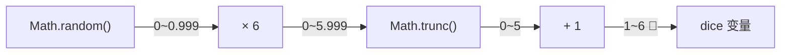
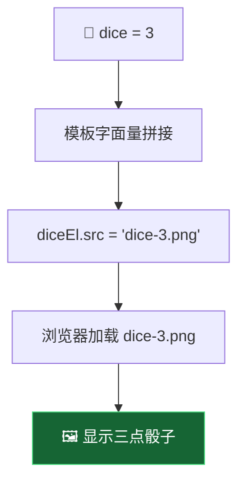
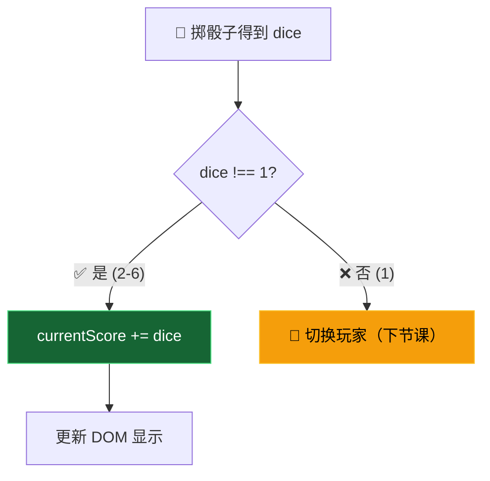
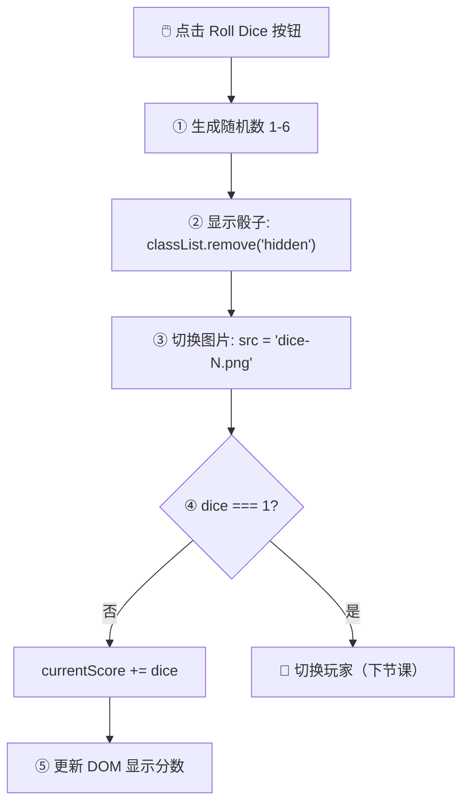

# 掷骰子功能 (Rolling the Dice)

> 📺 来源：`016 Rolling the Dice.en.srt`
> 📂 章节：第 07 章

## 📌 知识脉络
- **前置知识**：`Math.random()` 和 `Math.trunc()` 生成随机整数、`addEventListener` 事件绑定、`classList.remove` 显示隐藏元素、变量作用域（全局 vs 局部）
- **后续扩展**：活跃玩家切换机制、`src` 属性动态加载图片、Hold 功能实现、游戏状态管理

## 🎯 概述

本节课为 Pig Game 实现核心的**掷骰子功能**。包含三个关键步骤：生成 1-6 的随机数、根据随机数**动态切换骰子图片**（通过修改 `img` 元素的 `src` 属性）、以及将骰子点数累加到**当前回合分数**中。同时引入了 `+=` 加法赋值运算符和变量声明位置对逻辑的影响。

## 核心知识点

### 1. 生成随机骰子点数（1-6）

> 🧩 **生活类比**：`Math.random()` 像一个永远给你 0.xxx 小数的老虎机。你需要"放大"（×6）→"截断"（`Math.trunc` 去掉小数）→"偏移"（+1）才能得到想要的 1-6 整数。

```js
// 生成 1-6 的随机整数
const dice = Math.trunc(Math.random() * 6) + 1;
```

**🔍 执行追踪：**

| 步骤 | 表达式 | 示例值 | 范围 |
|------|--------|-------|------|
| ① | `Math.random()` | `0.7382...` | [0, 1) |
| ② | `× 6` | `4.4292...` | [0, 6) |
| ③ | `Math.trunc(...)` | `4` | {0, 1, 2, 3, 4, 5} |
| ④ | `+ 1` | `5` | {1, 2, 3, 4, 5, 6} ✅ |



> 💡 **记忆口诀**：**"随机乘范围，截断加最小"** —— `Math.random() * 范围总数`，`Math.trunc` 截断小数，`+ 最小值` 偏移起点。

---

### 2. 动态切换骰子图片（src 属性）

> 🧩 **生活类比**：`src` 属性就像地址导航——你告诉浏览器"去这个地址取图片"。改变 `src` 就像改变导航目的地，浏览器会自动加载新图片。

骰子图片的文件名遵循 `dice-{数字}.png` 的命名规则：

```
dice-1.png  dice-2.png  dice-3.png
dice-4.png  dice-5.png  dice-6.png
```

利用**模板字面量**，可以根据随机数动态设置图片路径：

```js
// 先显示骰子（移除 hidden 类）
diceEl.classList.remove('hidden');

// 动态设置图片源
diceEl.src = `dice-${dice}.png`;
```



**🔍 不同骰子值对应的图片：**

| dice 值 | `src` 属性值 | 显示图片 |
|---------|-------------|---------|
| 1 | `dice-1.png` | ⚀ |
| 2 | `dice-2.png` | ⚁ |
| 3 | `dice-3.png` | ⚂ |
| 4 | `dice-4.png` | ⚃ |
| 5 | `dice-5.png` | ⚄ |
| 6 | `dice-6.png` | ⚅ |

> **💼 业务场景**：这种"根据数据动态切换图片"的技术在电商中非常常见——用户选择不同颜色/尺码时，商品图片会自动切换为对应变体的图片。

---

### 3. currentScore 变量的声明位置

> 🧩 **生活类比**：如果你把计分板放在比赛场内，每次重新开球时计分板都会被踩坏归零。正确做法是把计分板挂在场外高处——比赛过程中不受影响，只有你手动去改它时才会变化。`currentScore` 就是这个"场外计分板"。

```js
// ⛔ 错误：在事件处理函数内部声明
btnRoll.addEventListener('click', function () {
  let currentScore = 0; // 每次点击都重置为 0！
  currentScore += dice;  // 永远只有当次骰子的值
});

// ✅ 正确：在全局（事件处理函数外部）声明
let currentScore = 0;
btnRoll.addEventListener('click', function () {
  currentScore += dice;  // 正确累加！
});
```

```mermaid
flowchart TD
    subgraph 🚨 错误：函数内声明
        A1["点击1: let currentScore = 0"] --> B1["currentScore += 3 → 3"]
        C1["点击2: let currentScore = 0"] --> D1["currentScore += 5 → 5"]
        E1["每次都从0开始 ❌"]
    end
    subgraph ✅ 正确：函数外声明
        A2["let currentScore = 0（只执行一次）"]
        A2 --> B2["点击1: currentScore += 3 → 3"]
        B2 --> D2["点击2: currentScore += 5 → 8"]
        D2 --> F2["正确累加 ✅"]
    end
    style E1 fill:#991b1b,stroke:#f87171,color:#fff
    style F2 fill:#166534,stroke:#4ade80,color:#fff
```

---

### 4. += 加法赋值运算符

`currentScore += dice` 是 `currentScore = currentScore + dice` 的简写：

**📊 赋值运算符汇总：**

| 运算符 | 等价写法 | 示例 | 结果 |
|--------|---------|------|------|
| `+=` | `a = a + b` | `score += 5` | 加 5 |
| `-=` | `a = a - b` | `score -= 1` | 减 1 |
| `*=` | `a = a * b` | `score *= 2` | 乘 2 |
| `/=` | `a = a / b` | `score /= 2` | 除 2 |
| `++` | `a = a + 1` | `score++` | 自增 1 |
| `--` | `a = a - 1` | `score--` | 自减 1 |

---

### 5. 掷到 1 的判断分支

```js
if (dice !== 1) {
  // 不是 1：累加到当前回合分数
  currentScore += dice;
  current0El.textContent = currentScore;
} else {
  // 是 1：切换到下一个玩家（下节课实现）
}
```



---

## 🛠️ 代码实战与真实场景

> **💼 业务场景**：你在开发一个健身 App 的"每日运动挑战"功能。用户每次完成一个小运动，系统给出 1-10 的随机积分。积分需要在整个挑战期间累加显示。

```js {runnable} {title="rolling_dice_demo.js"}
// 模拟掷骰子和分数累加
let currentScore = 0;
const rolls = [];

function rollDice() {
  const dice = Math.trunc(Math.random() * 6) + 1;
  rolls.push(dice);

  console.log(`🎲 掷出: ${dice}`);

  if (dice !== 1) {
    currentScore += dice;
    console.log(`  ➕ 当前回合累计: ${currentScore}`);
    // 模拟更新 DOM：diceEl.src = `dice-${dice}.png`
    console.log(`  🖼️ 显示图片: dice-${dice}.png`);
  } else {
    console.log(`  💥 掷到 1！当前回合分数清零，轮到下一位玩家`);
    currentScore = 0;
  }
  return dice;
}

// 模拟 7 次掷骰子
console.log('=== 模拟 Pig Game 掷骰子 ===\n');
for (let i = 1; i <= 7; i++) {
  console.log(`--- 第 ${i} 次 ---`);
  rollDice();
  console.log('');
}

console.log(`📊 掷骰记录: [${rolls.join(', ')}]`);
console.log(`📊 最终当前回合分数: ${currentScore}`);
```



**📊 输入输出示例：**

| 掷骰次数 | dice 值 | currentScore (前) | 操作 | currentScore (后) | 图片 |
|---------|---------|------------------|------|------------------|------|
| 第 1 次 | 4 | 0 | `+= 4` | 4 | `dice-4.png` |
| 第 2 次 | 6 | 4 | `+= 6` | 10 | `dice-6.png` |
| 第 3 次 | 2 | 10 | `+= 2` | 12 | `dice-2.png` |
| 第 4 次 | 1 | 12 | 清零 | 0 | `dice-1.png` |
| 第 5 次 | 5 | 0 | `+= 5` | 5 | `dice-5.png` |

## 💡 关键要点
- ✅ `Math.trunc(Math.random() * 6) + 1` 生成 1-6 的随机整数
- ✅ 通过修改 `img` 元素的 `src` 属性可以**动态切换图片**
- ✅ 模板字面量 `` `dice-${dice}.png` `` 让图片路径的拼接简洁直观
- ✅ `currentScore` 必须声明在**事件处理函数外部**，否则每次点击都会重置
- ✅ `+=` 运算符是 `a = a + b` 的简写

## ⚠️ 常见误区
- ⚠️ **误区 1**：在事件处理函数内部用 `let` 声明 `currentScore`。每次点击都会重新声明并初始化为 0，导致分数无法累加。必须声明在函数外部的全局/模块作用域中。
- ⚠️ **误区 2**：忘记先移除 `hidden` 类再设置 `src`。如果不执行 `diceEl.classList.remove('hidden')`，即使 `src` 被正确设置，骰子图片也不会显示（因为 `display: none` 仍然生效）。
- ⚠️ **误区 3**：随机数公式写成 `Math.trunc(Math.random() * 6)`（不加 1）。结果范围是 0-5 而非 1-6，会导致加载不存在的 `dice-0.png` 图片。

## 🐛 报错实验室

**❌ 错误写法：**
```js
// 模板字面量用了普通引号
diceEl.src = 'dice-${dice}.png'; // ⛔ 普通字符串不会插值！
```

**浏览器报错：**
```
GET http://localhost:8080/dice-${dice}.png 404 (Not Found)
```

**🔑 解读**：模板字面量必须使用**反引号** `` ` `` 而非普通引号 `'` 或 `"`。普通引号中的 `${dice}` 会被当作字面字符串"$开头花括号dice花括号"，浏览器会试图加载一个名为 `dice-${dice}.png` 的文件（不存在），导致 404 错误。

---

## 📖 词汇速查表 (Cheat Sheet)

| 中文术语 | 英文术语 | 简明释义 | 速查代码 | 📚 官方文档 |
|---------|---------|---------|---------|-----------|
| 随机数 | Math.random | 返回 [0, 1) 的随机浮点数 | `Math.random()` | [MDN](https://developer.mozilla.org/zh-CN/docs/Web/JavaScript/Reference/Global_Objects/Math/random) |
| 截断取整 | Math.trunc | 去掉数字的小数部分 | `Math.trunc(4.7) → 4` | [MDN](https://developer.mozilla.org/zh-CN/docs/Web/JavaScript/Reference/Global_Objects/Math/trunc) |
| 图片源属性 | src | 设置 img 元素的图片路径 | `imgEl.src = 'photo.jpg'` | [MDN](https://developer.mozilla.org/zh-CN/docs/Web/HTML/Element/img#src) |
| 模板字面量 | Template Literal | 用反引号包裹，支持 `${}` 插值 | `` `dice-${n}.png` `` | [MDN](https://developer.mozilla.org/zh-CN/docs/Web/JavaScript/Reference/Template_literals) |
| 加法赋值 | += | `a += b` 等价于 `a = a + b` | `score += 5` | [MDN](https://developer.mozilla.org/zh-CN/docs/Web/JavaScript/Reference/Operators/Addition_assignment) |

---

## 🧪 学习验证

### 📝 动手练习

**练习 1：实现一个随机头像生成器**

```js {runnable} {title="exercise1.js"}
// 创建一个函数，每次调用时生成 1-10 的随机数
// 并用模板字面量拼接出头像路径 "avatar-{N}.png"

function getRandomAvatar() {
  // 你的代码
}

// 测试 5 次
for (let i = 0; i < 5; i++) {
  console.log(getRandomAvatar());
}
```

<details><summary>💡 参考答案</summary>

```js
function getRandomAvatar() {
  const num = Math.trunc(Math.random() * 10) + 1;
  const path = `avatar-${num}.png`;
  console.log(`🎭 随机头像: ${path}`);
  return path;
}

for (let i = 0; i < 5; i++) {
  getRandomAvatar();
}
```

**解题思路**：与骰子完全相同的模式——`Math.trunc(Math.random() * 范围) + 最小值` 生成随机数，模板字面量拼接路径。

</details>

**练习 2：实现带上限的分数累加器**

```js {runnable} {title="exercise2.js"}
// 每次调用 addPoints() 会生成 1-6 的随机积分
// 累加到 totalScore，但如果单次积分为 1，则 totalScore 清零
// 当 totalScore 达到 20 以上时，输出 "🏆 达标！"

let totalScore = 0;

function addPoints() {
  // 你的代码
}

// 运行直到达标或清零 5 次
let resets = 0;
while (totalScore < 20 && resets < 5) {
  addPoints();
  if (totalScore === 0) resets++;
}
```

<details><summary>💡 参考答案</summary>

```js
let totalScore = 0;

function addPoints() {
  const points = Math.trunc(Math.random() * 6) + 1;
  console.log(`🎲 得到: ${points}`);

  if (points !== 1) {
    totalScore += points;
    console.log(`  累计: ${totalScore}`);
    if (totalScore >= 20) {
      console.log('  🏆 达标！');
    }
  } else {
    totalScore = 0;
    console.log('  💥 清零！');
  }
}

let resets = 0;
while (totalScore < 20 && resets < 5) {
  addPoints();
  if (totalScore === 0) resets++;
}
```

**解题思路**：这就是 Pig Game 的简化版——骰子 1 清零，其他累加，达到目标分数获胜。`while` 循环模拟多次掷骰。

</details>

### ❓ 理解检测

:::quiz {correct="B"}
**1. 为什么 `currentScore` 必须声明在事件处理函数外部？**
- A) 因为函数内部不能使用 `let`
- B) 因为函数每次被调用时，内部声明的变量会被重新初始化
- C) 因为函数内部的变量不能存储数字
- D) 因为 JavaScript 禁止在回调函数中声明变量

> **解析**：事件处理函数在每次点击时都会被调用。如果 `currentScore` 在函数内部用 `let currentScore = 0` 声明，每次调用都会重新执行这行代码，将其重置为 0。声明在外部则只初始化一次，后续点击中变量值得以保留和累加。
:::

:::quiz {correct="C"}
**2. `diceEl.src = `dice-${dice}.png`` 的作用是什么？**
- A) 创建一个新的 img 元素
- B) 下载骰子图片到本地
- C) 动态修改 img 元素显示的图片，使其根据 dice 值加载对应的文件
- D) 在控制台输出图片路径

> **解析**：修改 `img` 元素的 `src` 属性会让浏览器重新加载并显示指定路径的图片。模板字面量 `` `dice-${dice}.png` `` 根据 `dice` 变量（1-6）动态拼接出对应的文件名（如 `dice-3.png`），实现"掷到几就显示几"的效果。
:::

:::quiz {correct="A"}
**3. `Math.trunc(Math.random() * 6) + 1` 的取值范围是？**
- A) 1 到 6 的整数
- B) 0 到 6 的整数
- C) 1 到 5 的整数
- D) 0 到 5 的整数

> **解析**：`Math.random()` 范围 [0, 1)，乘 6 后范围 [0, 6)，`Math.trunc` 截断后范围 {0,1,2,3,4,5}，最后 +1 范围变为 {1,2,3,4,5,6}。
:::

### 🔧 代码填空

:::fill-blank
// 生成 1-6 随机骰子
const dice = Math.___trunc___(Math.___random___() * 6) + 1;

// 显示骰子图片
diceEl.classList.___remove___('hidden');
diceEl.___src___ = `dice-${dice}.png`;

// 累加分数
if (dice !== 1) {
  currentScore ___+=___ dice;
}
:::
