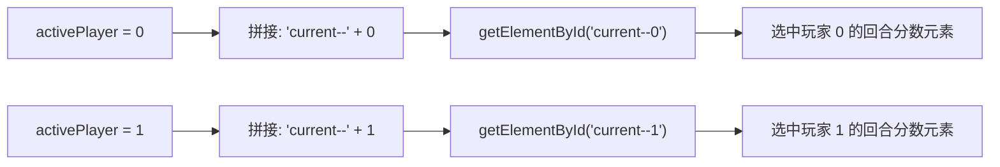
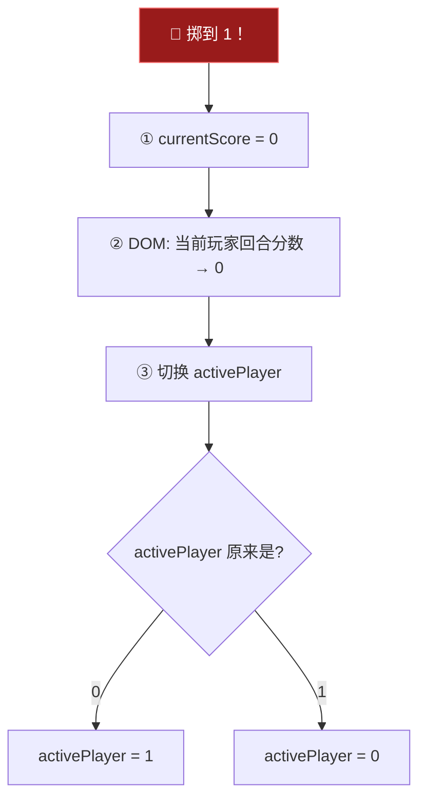
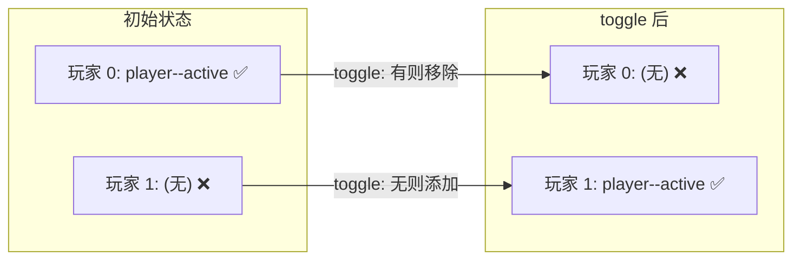
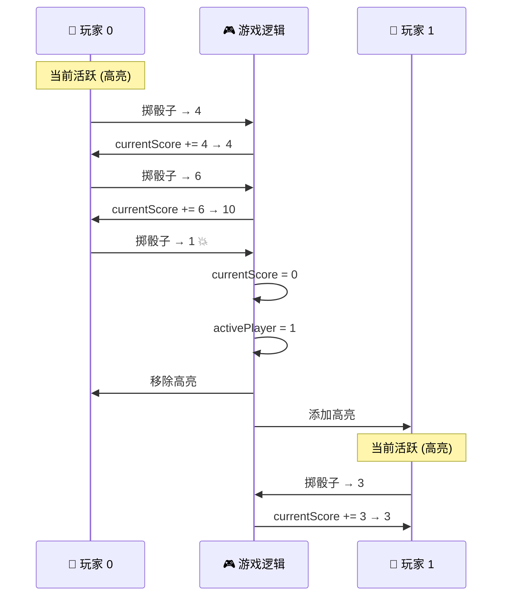

# 切换活跃玩家 (Switching the Active Player)

> 📺 来源：`017 Switching the Active Player.en.srt`
> 📂 章节：第 07 章

## 📌 知识脉络
- **前置知识**：三元运算符、`getElementById` 动态选取元素、`classList.add/remove`、`currentScore` 变量管理
- **后续扩展**：Hold（保住分数）功能、游戏获胜判断、`classList.toggle` 切换类、游戏重置

## 🎯 概述

本节课实现 Pig Game 的**玩家切换机制**。当骰子掷到 1 时，需要：①清零当前回合分数、②切换活跃玩家编号、③用**动态 ID 拼接**更新正确玩家的 DOM 元素、④用 `classList.toggle` 切换玩家的视觉高亮。核心技巧是将玩家编号（0/1）嵌入 ID 字符串来动态选取 DOM 元素。

## 核心知识点

### 1. 动态 ID 拼接选取元素

> 🧩 **生活类比**：你在酒店前台，告诉服务员"请打扫 {楼层}{房号} 的房间"。楼层和房号是变量，拼接后得到具体房间号如 "3-05"。同理，将 `activePlayer` 拼入 ID 名，得到 `current--0` 或 `current--1`。

```js
// 根据活跃玩家动态选取元素
document.getElementById(`current--${activePlayer}`).textContent = currentScore;
```



**为什么这比硬编码更好？**

:::code-comparison
```js {title="🚨 硬编码：需要 if/else 判断"}
if (activePlayer === 0) {
  current0El.textContent = currentScore;
} else {
  current1El.textContent = currentScore;
}
```
```js {title="✨ 动态拼接：一行搞定"}
document.getElementById(
  `current--${activePlayer}`
).textContent = currentScore;
```
:::

**🔍 执行追踪：**

| activePlayer | 拼接结果 | 选中元素 | 操作 |
|-------------|---------|---------|------|
| `0` | `'current--0'` | 玩家 0 的回合分数 | 设置 textContent |
| `1` | `'current--1'` | 玩家 1 的回合分数 | 设置 textContent |

> 💡 **记忆口诀**：**"ID 拼变量，一行选两人"** —— 利用模板字面量把玩家编号变量拼入 ID 名，避免为每个玩家写重复代码。

---

### 2. 玩家切换逻辑

> 🧩 **生活类比**：乒乓球发球权切换——如果轮到"这边"（0），下一个就是"那边"（1）；如果轮到"那边"（1），下一个就是"这边"（0）。用三元运算符就能表达这种"非此即彼"的翻转。

切换活跃玩家时需要完成三个步骤（顺序很重要）：

```js
// 掷到 1 时触发的切换逻辑
// ① 重置当前回合分数变量
currentScore = 0;

// ② 将当前玩家的 DOM 显示归零（在切换前执行！）
document.getElementById(`current--${activePlayer}`).textContent = 0;

// ③ 切换活跃玩家编号
activePlayer = activePlayer === 0 ? 1 : 0;
```



**⚠️ 顺序陷阱**：步骤 ② 必须在步骤 ③ **之前**执行。因为步骤 ② 需要知道"当前是谁"来清零他的 DOM 显示。如果先切换了玩家，就会清错人的分数。

**🔍 执行追踪：**

假设 `activePlayer = 0`，`currentScore = 13`，掷到 1：

| 步骤 | 代码 | 变量变化 | DOM 变化 |
|------|------|---------|---------|
| ① | `currentScore = 0` | `currentScore: 13 → 0` | — |
| ② | `getElementById('current--0').textContent = 0` | — | 玩家 0 的回合分数显示 `0` |
| ③ | `activePlayer = 0 === 0 ? 1 : 0` | `activePlayer: 0 → 1` | — |

---

### 3. classList.toggle 切换视觉高亮

> 🧩 **生活类比**：`toggle` 就像房间的灯光开关 —— 灯亮着就关掉，灯灭了就打开。对两个玩家**同时 toggle** 同一个类，就能保证始终只有一个玩家被高亮。

```js
// 同时对两个玩家 toggle player--active 类
player0El.classList.toggle('player--active');
player1El.classList.toggle('player--active');
```



**为什么 toggle 比 add/remove 更适合这里？**

| 方法 | 玩家切换需要的代码量 |
|------|------------------|
| add + remove | 4 行：先 remove 旧玩家的类，再 add 新玩家的类 |
| toggle × 2 | 2 行：两个玩家同时 toggle，自动正确切换 |

```js
// ❌ 用 add/remove 需要更多代码
player0El.classList.remove('player--active');
player1El.classList.add('player--active');
// 但还要考虑反方向...

// ✅ toggle 自动处理两个方向
player0El.classList.toggle('player--active');
player1El.classList.toggle('player--active');
```

**📊 toggle 在不同状态下的行为：**

| 调用 | 玩家 0 原状态 | 玩家 0 后状态 | 玩家 1 原状态 | 玩家 1 后状态 |
|------|-------------|-------------|-------------|-------------|
| 第 1 次 toggle | 有 `active` | ❌ 移除 | 无 `active` | ✅ 添加 |
| 第 2 次 toggle | 无 `active` | ✅ 添加 | 有 `active` | ❌ 移除 |

> **💼 业务场景**：`classList.toggle` 在实际项目中用途广泛——深色/浅色模式切换、侧边栏展开/收起、选项卡的激活/非激活状态、复选框的选中/取消等。

---

## 🛠️ 代码实战与真实场景

> **💼 业务场景**：你在开发一个回合制对战游戏的 UI，两个玩家面板需要交替高亮，同时各自的得分需要动态更新。

```js {runnable} {title="switch_player_demo.js"}
// 模拟玩家切换系统
let activePlayer = 0;
let currentScore = 0;
const scores = [0, 0];

// 模拟 DOM
const dom = {
  'current--0': 0,
  'current--1': 0,
  player0Active: true,
  player1Active: false,
};

function displayState() {
  console.log(`  👤 活跃玩家: ${activePlayer}`);
  console.log(`  📊 回合分数: ${currentScore}`);
  console.log(`  🏠 P0 当前: ${dom['current--0']} | P1 当前: ${dom['current--1']}`);
  console.log(`  🎨 P0 高亮: ${dom.player0Active} | P1 高亮: ${dom.player1Active}`);
}

function switchPlayer() {
  // ① 清零当前回合分数
  currentScore = 0;
  
  // ② 清零当前玩家的 DOM 显示
  dom[`current--${activePlayer}`] = 0;
  
  // ③ 切换玩家编号
  activePlayer = activePlayer === 0 ? 1 : 0;
  
  // ④ toggle 视觉高亮
  dom.player0Active = !dom.player0Active;
  dom.player1Active = !dom.player1Active;
}

function rollDice() {
  const dice = Math.trunc(Math.random() * 6) + 1;
  console.log(`\n🎲 掷出: ${dice}`);
  
  if (dice !== 1) {
    currentScore += dice;
    dom[`current--${activePlayer}`] = currentScore;
    console.log(`  ➕ 加分，回合累计: ${currentScore}`);
  } else {
    console.log(`  💥 掷到 1！切换玩家`);
    switchPlayer();
  }
  displayState();
}

// 模拟 8 次掷骰
console.log('=== Pig Game 玩家切换演示 ===');
displayState();
for (let i = 0; i < 8; i++) {
  rollDice();
}
```



**📊 输入输出示例：**

| 操作 | dice | activePlayer | currentScore | P0 DOM | P1 DOM | P0 高亮 | P1 高亮 |
|------|------|-------------|-------------|--------|--------|---------|---------|
| 初始 | — | 0 | 0 | 0 | 0 | ✅ | ❌ |
| 掷骰 | 4 | 0 | 4 | 4 | 0 | ✅ | ❌ |
| 掷骰 | 6 | 0 | 10 | 10 | 0 | ✅ | ❌ |
| 掷骰 | 1 | 0→1 | 0 | 0 | 0 | ❌ | ✅ |
| 掷骰 | 5 | 1 | 5 | 0 | 5 | ❌ | ✅ |

## 💡 关键要点
- ✅ 利用模板字面量 `` `current--${activePlayer}` `` **动态拼接** ID 名，避免重复代码
- ✅ 三元运算符 `activePlayer === 0 ? 1 : 0` 实现 0/1 之间的切换
- ✅ `classList.toggle` 同时对两个元素操作，保证**始终只有一个**被高亮
- ✅ 切换前必须**先清零当前玩家的 DOM 显示**，再改变 `activePlayer` 的值
- ✅ `currentScore` 在切换时必须重置为 `0`

## ⚠️ 常见误区
- ⚠️ **误区 1**：先切换 `activePlayer` 再清零 DOM 显示。这会导致清错玩家的分数——本该清玩家 0 的分数，结果清了玩家 1 的。
- ⚠️ **误区 2**：用 `if/else` 硬编码两个玩家的切换逻辑。虽然能工作，但不如动态 ID 拼接简洁。如果未来扩展到 3-4 人游戏，硬编码会变得非常冗长。
- ⚠️ **误区 3**：只 toggle 一个玩家的高亮类。必须同时对两个玩家 toggle，才能保证一个添加时另一个移除，维持"互斥高亮"效果。

## 🐛 报错实验室

**❌ 错误写法：**
```js
// 动态 ID 拼接时使用了普通字符串
document.getElementById('current--activePlayer').textContent = 0;
// ⛔ 查找的是 ID 为 "current--activePlayer" 的元素（不存在！）
```

**浏览器报错：**
```
Uncaught TypeError: Cannot set properties of null (setting 'textContent')
```

**🔑 解读**：普通字符串 `'current--activePlayer'` 不会将 `activePlayer` 变量的值插入。必须使用模板字面量 `` `current--${activePlayer}` `` 才能实现变量插值。

---

## 📖 词汇速查表 (Cheat Sheet)

| 中文术语 | 英文术语 | 简明释义 | 速查代码 | 📚 官方文档 |
|---------|---------|---------|---------|-----------|
| 切换类 | classList.toggle | 有则移除，无则添加 | `el.classList.toggle('active')` | [MDN](https://developer.mozilla.org/zh-CN/docs/Web/API/DOMTokenList/toggle) |
| 三元运算符 | Ternary Operator | `条件 ? 真值 : 假值` | `x === 0 ? 1 : 0` | [MDN](https://developer.mozilla.org/zh-CN/docs/Web/JavaScript/Reference/Operators/Conditional_operator) |
| 模板字面量 | Template Literal | 反引号 + `${}` 插值 | `` `id-${n}` `` | [MDN](https://developer.mozilla.org/zh-CN/docs/Web/JavaScript/Reference/Template_literals) |
| 按 ID 获取 | getElementById | 通过 ID 获取唯一元素 | `document.getElementById('id')` | [MDN](https://developer.mozilla.org/zh-CN/docs/Web/API/Document/getElementById) |

---

## 🧪 学习验证

### 📝 动手练习

**练习 1：实现 3 人轮换机制**

```js {runnable} {title="exercise1.js"}
// 扩展为 3 个玩家的轮换：0 → 1 → 2 → 0 → ...
let activePlayer = 0;

function switchToNextPlayer() {
  // 你的代码：实现 0→1→2→0 的循环切换
}

// 测试
for (let i = 0; i < 6; i++) {
  console.log(`当前玩家: ${activePlayer}`);
  switchToNextPlayer();
}
```

<details><summary>💡 参考答案</summary>

```js
let activePlayer = 0;

function switchToNextPlayer() {
  activePlayer = (activePlayer + 1) % 3;
  // 或者用三元：activePlayer = activePlayer === 2 ? 0 : activePlayer + 1;
}

for (let i = 0; i < 6; i++) {
  console.log(`当前玩家: ${activePlayer}`);
  switchToNextPlayer();
}
// 输出: 0, 1, 2, 0, 1, 2
```

**解题思路**：`% 3`（取模运算）是循环切换的通用方案：`(0+1)%3=1`、`(1+1)%3=2`、`(2+1)%3=0`，完美实现循环。

</details>

**练习 2：实现互斥高亮效果**

```js {runnable} {title="exercise2.js"}
// 模拟 classList.toggle 的互斥效果
const tabs = [
  { name: 'Tab A', active: true },
  { name: 'Tab B', active: false },
  { name: 'Tab C', active: false },
];

function switchTab(index) {
  // 你的代码：将 index 对应的 tab 设为 active，其他设为 false
}

function displayTabs() {
  tabs.forEach(t => console.log(`  ${t.active ? '✅' : '❌'} ${t.name}`));
}

console.log('初始:'); displayTabs();
switchTab(1);
console.log('\n切换到 Tab B:'); displayTabs();
switchTab(2);
console.log('\n切换到 Tab C:'); displayTabs();
```

<details><summary>💡 参考答案</summary>

```js
function switchTab(index) {
  for (let i = 0; i < tabs.length; i++) {
    tabs[i].active = (i === index);
  }
}

console.log('初始:'); displayTabs();
switchTab(1);
console.log('\n切换到 Tab B:'); displayTabs();
switchTab(2);
console.log('\n切换到 Tab C:'); displayTabs();
```

**解题思路**：遍历所有 tab，只有当索引匹配时设为 `true`，其他全部设为 `false`。这是"互斥选择"的通用模式。

</details>

### ❓ 理解检测

:::quiz {correct="C"}
**1. `activePlayer = activePlayer === 0 ? 1 : 0` 这行代码的效果是什么？**
- A) 将 activePlayer 始终设为 0
- B) 将 activePlayer 始终设为 1
- C) 如果 activePlayer 是 0 则变为 1，如果是 1 则变为 0
- D) 检查 activePlayer 是否等于 0，但不修改它

> **解析**：三元运算符先判断 `activePlayer === 0`，为 `true` 则返回 `1`，为 `false` 则返回 `0`。返回值赋给 `activePlayer`，实现了 0↔1 的来回切换。
:::

:::quiz {correct="B"}
**2. 为什么切换玩家时 DOM 清零操作必须在修改 `activePlayer` 之前执行？**
- A) JavaScript 要求变量修改必须按顺序执行
- B) 需要在知道"当前是谁"的情况下清零正确玩家的 DOM
- C) 否则 `classList.toggle` 会失效
- D) 因为 DOM 操作比变量赋值慢

> **解析**：`getElementById(`current--${activePlayer}`)` 使用 `activePlayer` 来选取元素。如果先切换了 `activePlayer`（从 0 变 1），然后再清零 DOM，就会错误地清零玩家 1 的分数而非玩家 0 的。
:::

:::quiz {correct="A"}
**3. 对两个元素同时调用 `classList.toggle('player--active')` 为什么能保证互斥高亮？**
- A) 因为初始状态只有一个元素有该类，toggle 会让它们永远处于相反状态
- B) 因为 toggle 会自动检测其他元素是否有相同的类
- C) 因为 DOM 不允许两个元素有相同的类名
- D) 因为 toggle 内部有互斥锁机制

> **解析**：初始时只有玩家 0 有 `player--active` 类。toggle 玩家 0 时移除该类，toggle 玩家 1 时添加该类。下次再 toggle，玩家 0 又得到了类（添加），玩家 1 失去了类（移除）。两者始终处于相反状态。
:::

### 🔧 代码填空

:::fill-blank
// 清零当前玩家的回合分数显示
document.getElementById(`current--___${activePlayer}___`).textContent = 0;

// 切换活跃玩家
activePlayer = activePlayer === 0 ___?___ 1 ___:___ 0;

// 切换视觉高亮
player0El.classList.___toggle___('player--active');
player1El.classList.___toggle___('player--active');
:::
