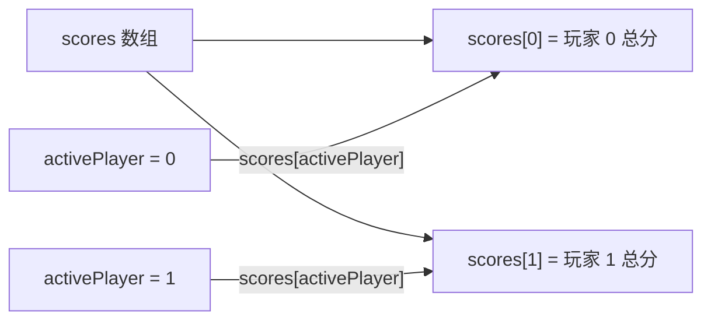
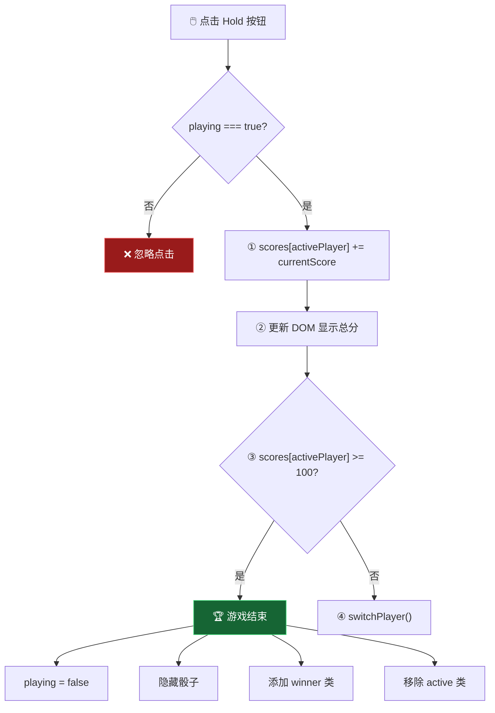
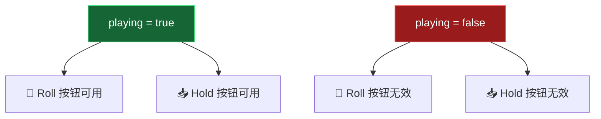
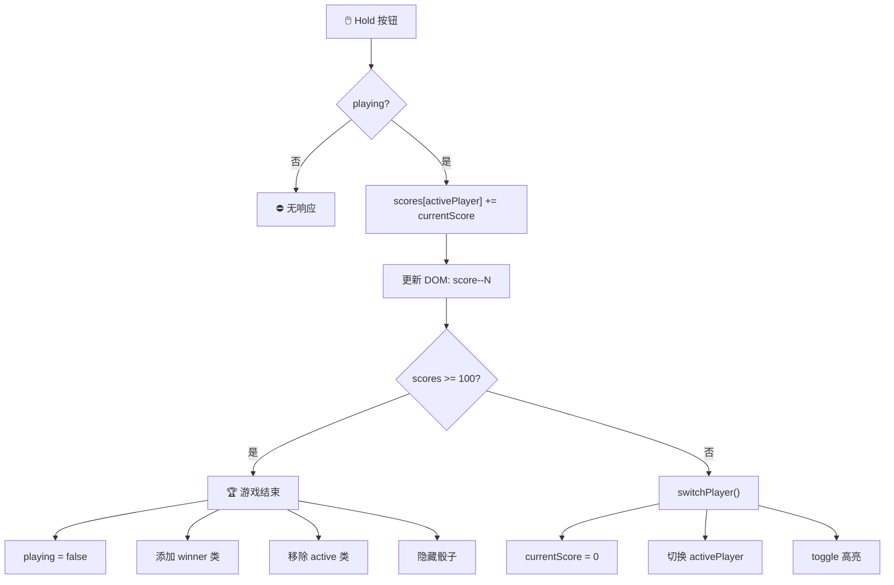

# 保住当前分数 (Holding Current Score)

> 📺 来源：`018 Holding Current Score.en.srt`
> 📂 章节：第 07 章

## 📌 知识脉络
- **前置知识**：数组基础（存取元素）、活跃玩家切换、`classList.add/remove`、动态 ID 拼接、事件监听
- **后续扩展**：游戏重置（New Game）功能、状态变量模式（State Pattern）、`localStorage` 持久化游戏进度

## 🎯 概述

本节课实现 Pig Game 的两大核心功能：**Hold（保住分数）** 和**获胜判断**。Hold 将当前回合分数加入总分数组 `scores[activePlayer]` 并切换玩家；获胜判断检查总分是否 ≥ 100。此外引入了**状态变量 `playing`** 来控制游戏是否可继续操作，防止获胜后仍能掷骰子或保分。

## 核心知识点

### 1. 用数组存储双方总分

> 🧩 **生活类比**：`scores` 数组就像一个分格文件盒——`scores[0]` 是玩家 0 的格子，`scores[1]` 是玩家 1 的格子。`activePlayer` 变量就是你伸手的方向——它告诉你该往哪个格子里放分数。

```js
// 声明总分数组（两个玩家各自的累计总分）
const scores = [0, 0];
// scores[0] = 玩家 0 总分
// scores[1] = 玩家 1 总分
```



**为什么用数组而不是两个变量？**

| 方案 | 代码 | 扩展性 |
|------|------|--------|
| 两个变量 | `score0 += currentScore; score1 += currentScore;` 需 if/else 判断 | ❌ 3人游戏需再改 |
| 数组 | `scores[activePlayer] += currentScore;` 一行搞定 | ✅ N人游戏无需改动 |

---

### 2. Hold 功能的完整逻辑

> 🧩 **生活类比**：Hold 就像把手里的零钱存进银行。"零钱"是 `currentScore`（随时可能因掷到 1 而丢失），"银行账户"是 `scores[activePlayer]`（安全持久的总分）。存完钱后轮到下一位客户（切换玩家）。

```js
btnHold.addEventListener('click', function () {
  if (playing) {
    // ① 将回合分数加入活跃玩家的总分
    scores[activePlayer] += currentScore;

    // ② 更新 DOM 显示总分
    document.getElementById(`score--${activePlayer}`).textContent =
      scores[activePlayer];

    // ③ 判断是否获胜（总分 ≥ 100）
    if (scores[activePlayer] >= 100) {
      // 🏆 游戏结束
      playing = false;
      diceEl.classList.add('hidden');

      document
        .querySelector(`.player--${activePlayer}`)
        .classList.add('player--winner');
      document
        .querySelector(`.player--${activePlayer}`)
        .classList.remove('player--active');
    } else {
      // ④ 未获胜，切换玩家
      switchPlayer();
    }
  }
});
```



**🔍 执行追踪：**

假设 `activePlayer = 0`，`currentScore = 25`，`scores = [80, 45]`：

| 步骤 | 代码 | 变量变化 | DOM 变化 |
|------|------|---------|---------|
| ① | `scores[0] += 25` | `scores = [105, 45]` | — |
| ② | `getElementById('score--0').textContent = 105` | — | 玩家 0 总分显示 105 |
| ③ | `105 >= 100` → `true` | — | — |
| 🏆 | `playing = false` | `playing: true → false` | — |
| 🏆 | `diceEl.classList.add('hidden')` | — | 骰子消失 |
| 🏆 | `classList.add('player--winner')` | — | 玩家 0 背景变深色 |
| 🏆 | `classList.remove('player--active')` | — | 移除高亮 |

> 💡 **记忆口诀**：**"Hold 三步走：加分、判赢、换人"** —— 先把回合分数加到总分，然后检查是否赢了，没赢就切换玩家。

---

### 3. 状态变量 `playing` 控制游戏流程

> 🧩 **生活类比**：`playing` 就像游乐场的"运营中/已关闭"告示牌。告示牌写着"运营中"（`true`）时，所有设施可以使用；写着"已关闭"（`false`）时，即使你按按钮也不会有反应。

```js
let playing = true; // 初始：游戏进行中

// 两个按钮都受 playing 控制
btnRoll.addEventListener('click', function () {
  if (playing) {
    // ... 掷骰子逻辑
  }
});

btnHold.addEventListener('click', function () {
  if (playing) {
    // ... 保分逻辑
  }
});
```



**为什么用 `if (playing)` 而不是 `if (playing === true)`？**

因为 `playing` 本身就是布尔值。在 `if` 条件中，布尔值直接被求值为 `true` 或 `false`，不需要再与 `true` 比较。`if (playing)` 和 `if (playing === true)` 完全等价，但前者更简洁。

**📊 状态变量的使用场景：**

| 场景 | 状态变量 | 作用 |
|------|---------|------|
| 游戏是否进行中 | `playing` | 控制按钮是否响应点击 |
| 表单是否提交中 | `isSubmitting` | 防止重复提交 |
| 弹窗是否打开 | `isModalOpen` | 控制 Esc 键行为 |
| 数据是否加载中 | `isLoading` | 显示加载动画 |

> **💼 业务场景**：在电商网站中，"提交订单"按钮在用户点击后应设置 `isSubmitting = true` 来禁用按钮，防止重复下单。这与 Pig Game 中 `playing = false` 禁用操作的逻辑完全相同。

---

### 4. 获胜时的 DOM 操作

获胜时需要添加 `player--winner` 类（深色背景）并移除 `player--active` 类（高亮背景），避免两个样式冲突：

```js
// 添加获胜样式
document.querySelector(`.player--${activePlayer}`).classList.add('player--winner');

// 移除活跃玩家样式（防止与 winner 样式冲突）
document.querySelector(`.player--${activePlayer}`).classList.remove('player--active');
```

**⚠️ 常见 Bug**：`querySelector` 需要 `.` 前缀（CSS 选择器语法），而 `getElementById` 不需要。忘加 `.` 会导致选取失败返回 `null`。

---

### 5. 将切换玩家提取为函数

由于切换玩家逻辑在两处使用（掷到 1 时和 Hold 后未获胜时），应提取为独立函数：

```js
const switchPlayer = function () {
  document.getElementById(`current--${activePlayer}`).textContent = 0;
  currentScore = 0;
  activePlayer = activePlayer === 0 ? 1 : 0;
  player0El.classList.toggle('player--active');
  player1El.classList.toggle('player--active');
};
```

---

## 🛠️ 代码实战与真实场景

> **💼 业务场景**：你在开发一个在线投票系统。每位用户可以多次投票给不同选项（累加分数），当某选项的总票数达到阈值时宣布获胜，同时锁定投票按钮。

```js {runnable} {title="hold_score_demo.js"}
// 模拟 Hold 功能和获胜判断
let activePlayer = 0;
let currentScore = 0;
let playing = true;
const scores = [0, 0];
const WINNING_SCORE = 30; // 用小值方便演示

function switchPlayer() {
  currentScore = 0;
  activePlayer = activePlayer === 0 ? 1 : 0;
  console.log(`  🔄 切换到玩家 ${activePlayer}`);
}

function rollDice() {
  if (!playing) { console.log('  ⛔ 游戏已结束'); return; }
  const dice = Math.trunc(Math.random() * 6) + 1;
  if (dice !== 1) {
    currentScore += dice;
    console.log(`  🎲 掷出 ${dice}，回合累计: ${currentScore}`);
  } else {
    console.log(`  🎲 掷出 1！💥 回合分数清零`);
    switchPlayer();
  }
}

function hold() {
  if (!playing) { console.log('  ⛔ 游戏已结束'); return; }
  scores[activePlayer] += currentScore;
  console.log(`  📥 Hold! 玩家 ${activePlayer} 总分: ${scores[activePlayer]}`);

  if (scores[activePlayer] >= WINNING_SCORE) {
    playing = false;
    console.log(`  🏆🏆🏆 玩家 ${activePlayer} 获胜！总分: ${scores[activePlayer]}`);
  } else {
    switchPlayer();
  }
}

// 模拟一场游戏
console.log('=== Pig Game 完整模拟 ===\n');

let round = 1;
while (playing && round <= 20) {
  console.log(`--- 回合 ${round} (玩家 ${activePlayer}) ---`);
  // 掷 1-3 次骰子
  const rolls = Math.trunc(Math.random() * 3) + 1;
  for (let i = 0; i < rolls && playing; i++) {
    rollDice();
    if (currentScore === 0) break; // 掷到 1 了
  }
  if (currentScore > 0 && playing) {
    hold();
  }
  round++;
}

console.log(`\n📊 最终比分: 玩家0 = ${scores[0]}, 玩家1 = ${scores[1]}`);
```



**📊 输入输出示例：**

| 回合 | 操作 | activePlayer | currentScore | scores | 结果 |
|------|------|-------------|-------------|--------|------|
| 1 | Roll: 4, 6 | 0 | 10 | [0, 0] | — |
| 1 | Hold | 0 | 0 | [10, 0] | 切换到玩家 1 |
| 2 | Roll: 2, 1 | 1 | 0 | [10, 0] | 掷到 1，切换 |
| 3 | Roll: 5, 5, 6 | 0 | 16 | [10, 0] | — |
| 3 | Hold | 0 | 0 | [26, 0] | 切换到玩家 1 |
| ... | ... | ... | ... | ... | ... |
| N | Hold (总分≥100) | 0 | 0 | [103, 45] | 🏆 玩家 0 获胜！ |

## 💡 关键要点
- ✅ 用**数组** `scores[activePlayer]` 存储总分，动态索引避免 if/else
- ✅ Hold 的三步逻辑：**加分 → 判赢 → 换人**
- ✅ `playing` 状态变量控制按钮响应，防止游戏结束后继续操作
- ✅ 获胜后同时 `add('player--winner')` 和 `remove('player--active')`
- ✅ `switchPlayer` 提取为命名函数，在掷到 1 和 Hold 后两处复用

## ⚠️ 常见误区
- ⚠️ **误区 1**：`querySelector` 中忘记 `.` 前缀。`querySelector(`player--${activePlayer}`)` 缺少点号会返回 `null`，必须写 `querySelector(`.player--${activePlayer}`)` 。
- ⚠️ **误区 2**：获胜后没有将 `playing` 设为 `false`。游戏会"永无止境"——玩家赢了之后还能继续掷骰和保分，破坏游戏逻辑。
- ⚠️ **误区 3**：Hold 后直接切换玩家而不检查是否获胜。应该先判断 `scores[activePlayer] >= 100`，如果获胜就结束游戏，否则才切换玩家。顺序颠倒会导致"已经赢了却轮到对方"的 Bug。

## 🐛 报错实验室

**❌ 错误写法：**
```js
// querySelector 选取 class 时忘加点号
document.querySelector(`player--${activePlayer}`).classList.add('player--winner');
```

**浏览器报错：**
```
Uncaught TypeError: Cannot read properties of null (reading 'classList')
```

**🔑 解读**：`querySelector('player--0')` 会查找**标签名**为 `player--0` 的元素（不存在），返回 `null`。要按 class 选取必须加 `.` 前缀：`querySelector('.player--0')`。这是 `querySelector`（CSS 选择器语法）和 `getElementById`（纯 ID 名）的核心区别。

---

## 📖 词汇速查表 (Cheat Sheet)

| 中文术语 | 英文术语 | 简明释义 | 速查代码 | 📚 官方文档 |
|---------|---------|---------|---------|-----------|
| 状态变量 | State Variable | 记录系统当前状态的布尔/枚举变量 | `let playing = true;` | — |
| 加法赋值 | += | `a += b` 等于 `a = a + b` | `scores[0] += 10` | [MDN](https://developer.mozilla.org/zh-CN/docs/Web/JavaScript/Reference/Operators/Addition_assignment) |
| 数组索引 | Array Index | 用 `[N]` 访问数组第 N 个元素 | `scores[activePlayer]` | [MDN](https://developer.mozilla.org/zh-CN/docs/Web/JavaScript/Reference/Global_Objects/Array#通过索引访问数组元素) |
| 大于等于 | >= | 比较运算符 | `score >= 100` | [MDN](https://developer.mozilla.org/zh-CN/docs/Web/JavaScript/Reference/Operators/Greater_than_or_equal) |
| 布尔类型 | Boolean | true 或 false | `let playing = true;` | [MDN](https://developer.mozilla.org/zh-CN/docs/Web/JavaScript/Reference/Global_Objects/Boolean) |

---

## 🧪 学习验证

### 📝 动手练习

**练习 1：实现带上限保护的累加器**

```js {runnable} {title="exercise1.js"}
// 创建一个 holdScore 函数
// 将 currentPoints 加入 totalPoints
// 如果 totalPoints 达到 50 以上，输出"达标"并锁定

let totalPoints = 0;
let locked = false;

function holdScore(currentPoints) {
  // 你的代码
}

// 测试
holdScore(15); // 总分 15
holdScore(20); // 总分 35
holdScore(18); // 总分 53 → 达标！
holdScore(10); // 已锁定，不操作
```

<details><summary>💡 参考答案</summary>

```js
let totalPoints = 0;
let locked = false;

function holdScore(currentPoints) {
  if (locked) {
    console.log(`⛔ 已锁定，无法继续累加`);
    return;
  }

  totalPoints += currentPoints;
  console.log(`📥 +${currentPoints} → 总分: ${totalPoints}`);

  if (totalPoints >= 50) {
    locked = true;
    console.log(`🏆 达标！总分 ${totalPoints}，系统已锁定`);
  }
}

holdScore(15); // 📥 +15 → 总分: 15
holdScore(20); // 📥 +20 → 总分: 35
holdScore(18); // 📥 +18 → 总分: 53 → 🏆 达标！
holdScore(10); // ⛔ 已锁定
```

**解题思路**：与 Pig Game 的 `playing` 变量完全相同——`locked` 控制后续操作是否可执行。

</details>

**练习 2：双人分数追踪器（数组版）**

```js {runnable} {title="exercise2.js"}
// 用数组存储两人分数，实现 addScore 和 checkWinner 函数
const scores = [0, 0];
let activePlayer = 0;
let gameOver = false;

function addScore(points) {
  // 你的代码：加分 + 检查获胜 + 切换玩家
}

// 测试
addScore(30);
addScore(45);
addScore(40);
addScore(60); // 玩家 1 总分 = 105，应获胜
addScore(10); // 游戏已结束
```

<details><summary>💡 参考答案</summary>

```js
const scores = [0, 0];
let activePlayer = 0;
let gameOver = false;

function addScore(points) {
  if (gameOver) {
    console.log('⛔ 游戏已结束');
    return;
  }

  scores[activePlayer] += points;
  console.log(`玩家 ${activePlayer}: +${points} → 总分 ${scores[activePlayer]}`);

  if (scores[activePlayer] >= 100) {
    gameOver = true;
    console.log(`🏆 玩家 ${activePlayer} 获胜！`);
  } else {
    activePlayer = activePlayer === 0 ? 1 : 0;
    console.log(`🔄 切换到玩家 ${activePlayer}`);
  }
}

addScore(30);  // 玩家 0: 30
addScore(45);  // 玩家 1: 45
addScore(40);  // 玩家 0: 70
addScore(60);  // 玩家 1: 105 → 🏆
addScore(10);  // ⛔ 游戏已结束
```

**解题思路**：这就是 Pig Game Hold 功能的简化版——`scores[activePlayer]` 动态索引、`gameOver` 状态控制、三元运算符切换玩家。

</details>

### ❓ 理解检测

:::quiz {correct="B"}
**1. `scores[activePlayer] += currentScore` 这行代码的作用是什么？**
- A) 将 currentScore 赋值给 scores 数组
- B) 将 currentScore 加到当前活跃玩家的总分上
- C) 将 scores 数组的所有元素都加上 currentScore
- D) 创建一个新的 scores 数组元素

> **解析**：`scores[activePlayer]` 通过 `activePlayer`（0 或 1）动态索引到对应玩家的总分。`+=` 将 `currentScore` 加到该总分上并重新赋值。例如 `activePlayer = 0` 时，等价于 `scores[0] = scores[0] + currentScore`。
:::

:::quiz {correct="C"}
**2. 为什么获胜判断不用 `>` 而用 `>=`？**
- A) JavaScript 不支持 `>` 运算符
- B) 这两者效果完全一样
- C) 如果玩家刚好得到 100 分，用 `>` 会漏判为未获胜
- D) `>=` 的性能比 `>` 更好

> **解析**：如果获胜条件是"达到 100 分"，那么恰好 100 分的情况应该判为获胜。`> 100` 会要求总分超过 100 才算赢，导致 100 分时不触发获胜逻辑。`>= 100` 正确覆盖了"等于 100"和"大于 100"两种情况。
:::

:::quiz {correct="A"}
**3. `playing` 状态变量的主要目的是什么？**
- A) 防止游戏结束后玩家仍能操作 Roll 和 Hold 按钮
- B) 控制骰子图片的显示
- C) 记录当前是哪个玩家
- D) 存储游戏的最终得分

> **解析**：`playing = false` 后，Roll 和 Hold 按钮的事件处理器中 `if (playing)` 条件不满足，内部逻辑不会执行。这确保了游戏结束后不会再有任何游戏操作发生，是一种常见的"状态门控"模式。
:::

### 🔧 代码填空

:::fill-blank
// Hold: 将回合分数加到总分
scores[___activePlayer___] ___+=___ currentScore;

// 更新 DOM
document.getElementById(`score--${activePlayer}`).textContent = scores[___activePlayer___];

// 判断获胜
if (scores[activePlayer] ___>=___ 100) {
  ___playing___ = false;
}
:::
