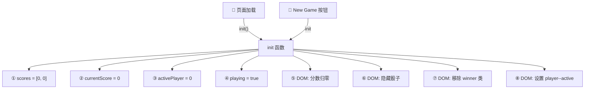
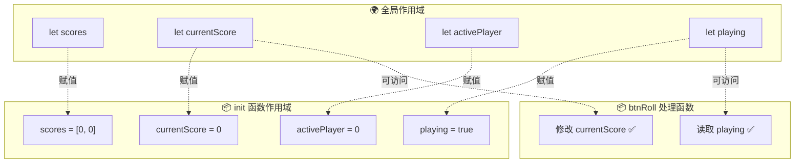
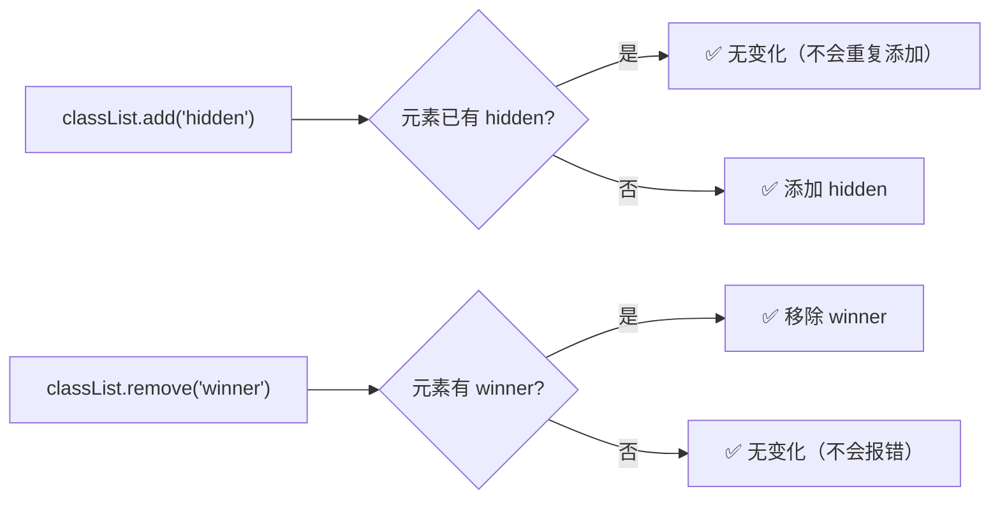
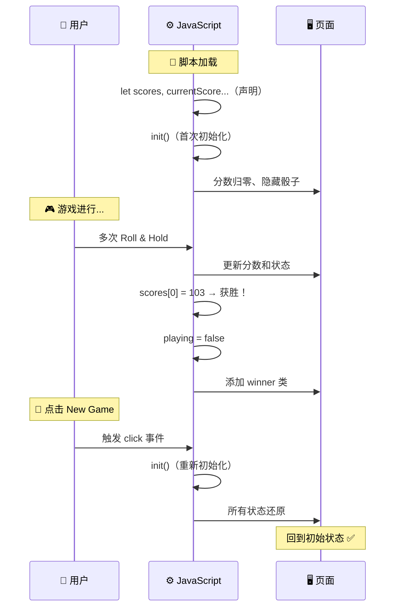

# 重置游戏 (Resetting the Game)

> 📺 来源：`019 Resetting the Game.en.srt`
> 📂 章节：第 07 章

## 📌 知识脉络
- **前置知识**：`classList.add/remove`、变量声明与赋值的区别、函数提取与复用、状态变量 `playing`、数组操作
- **后续扩展**：JavaScript 作用域（Scope）深度解析、闭包（Closure）、模块化开发、高阶函数

## 🎯 概述

本节课实现 Pig Game 的最后一个功能 —— **New Game（重置游戏）** 按钮。核心知识点是将所有初始化逻辑封装为 `init` 函数，在页面加载时调用一次，在玩家点击 New Game 按钮时再次调用。同时深入讲解了**变量声明位置与作用域**的关系——为什么变量必须在函数外部声明、在函数内部赋值。

## 核心知识点

### 1. 将初始化逻辑封装为 init 函数

> 🧩 **生活类比**：`init` 函数就像"棋盘复位器"。不管你是第一次打开棋盘（页面加载），还是玩完一局后想要重来（点击 New Game），都只需按一下复位按钮，所有棋子自动回到起始位置。

在没有 `init` 函数时，初始化代码散落在文件顶部：

:::code-comparison
```js {title="🚨 重构前：初始化代码散落"}
// 文件顶部多处散落的初始化代码
let scores = [0, 0];
let currentScore = 0;
let activePlayer = 0;
let playing = true;

score0El.textContent = 0;
score1El.textContent = 0;
diceEl.classList.add('hidden');

// ❌ New Game 按钮需要复制所有这些代码
btnNew.addEventListener('click', function () {
  scores = [0, 0];
  currentScore = 0;
  // ... 又要重复一遍...
});
```
```js {title="✨ 重构后：封装为 init 函数"}
// 声明变量（无初始值）
let scores, currentScore, activePlayer, playing;

// 统一初始化函数
const init = function () {
  scores = [0, 0];
  currentScore = 0;
  activePlayer = 0;
  playing = true;
  score0El.textContent = 0;
  score1El.textContent = 0;
  diceEl.classList.add('hidden');
  // ... 所有初始化逻辑集中在此
};

// 页面加载时调用
init();

// New Game 按钮复用同一函数
btnNew.addEventListener('click', init);
```
:::



---

### 2. 变量声明 vs 变量赋值（作用域前瞻）

> 🧩 **生活类比**：声明变量就像在公司通讯录上**登记你的名字**——这决定了谁能找到你、在多大范围内能联系到你。赋值是给你的工位上**放一台电脑**——可以反复更换。如果名字只登记在某个部门（函数）的通讯录上，其他部门就找不到你。

```js
// ✅ 正确：在函数外部声明（全局可访问）
let scores, currentScore, activePlayer, playing;

const init = function () {
  // 在函数内部赋值（不是重新声明）
  scores = [0, 0];        // 赋值，不是 let scores = [0, 0]
  currentScore = 0;
  activePlayer = 0;
  playing = true;
};
```



**⚠️ 如果在函数内部用 `let` 声明会怎样？**

```js
const init = function () {
  let scores = [0, 0];    // ⛔ 创建了一个新的局部变量！
  let playing = true;      // ⛔ 与外部的 playing 无关！
};

// init() 执行后...
console.log(playing); // ReferenceError: playing is not defined
```

函数内部用 `let` 会创建**局部变量**，只在函数内部可用。函数执行完毕后，局部变量就被销毁了。外部代码（如其他事件处理器）无法访问。

**📊 声明 vs 赋值对比：**

| 操作 | 语法 | 效果 |
|------|------|------|
| 声明 + 赋值 | `let x = 10;` | 创建新变量并赋初始值 |
| 仅声明 | `let x;` | 创建变量，值为 `undefined` |
| 仅赋值 | `x = 10;` | 给已存在的变量赋新值 |

**🔍 执行追踪：**

| 时机 | `scores` | `playing` | `currentScore` | 说明 |
|------|---------|-----------|---------------|------|
| 脚本加载 | `undefined` | `undefined` | `undefined` | 变量已声明但未赋值 |
| `init()` 执行后 | `[0, 0]` | `true` | `0` | init 赋了初始值 |
| 游戏结束时 | `[103, 45]` | `false` | `0` | 游戏过程中被修改 |
| 点击 New Game | `[0, 0]` | `true` | `0` | init 重新赋值 |

> 💡 **记忆口诀**：**"外面挂牌子，里面换内容"** —— `let` 声明在外面（全局可访问），赋值在 `init` 里面（可反复重置）。

---

### 3. init 函数的完整 DOM 重置

重置游戏不仅要重置变量，还要还原所有 DOM 元素的状态：

```js
const init = function () {
  // 重置数据状态
  scores = [0, 0];
  currentScore = 0;
  activePlayer = 0;
  playing = true;

  // 重置 DOM 显示
  score0El.textContent = 0;
  score1El.textContent = 0;
  current0El.textContent = 0;
  current1El.textContent = 0;

  // 隐藏骰子
  diceEl.classList.add('hidden');

  // 移除获胜样式（两个玩家都移除，因为不知道谁赢了）
  player0El.classList.remove('player--winner');
  player1El.classList.remove('player--winner');

  // 确保玩家 0 为活跃玩家
  player0El.classList.add('player--active');
  player1El.classList.remove('player--active');
};
```

**💡 关于 `classList.add` 的幂等性**：如果元素已经有某个类，再次 `add` 不会添加重复的类。同样，`remove` 一个不存在的类也不会报错。这使得 `init` 函数可以安全地被多次调用。



---

### 4. 将 init 传入事件监听器

```js
// 方式 1：直接传函数引用（推荐）
btnNew.addEventListener('click', init);

// 方式 2：匿名函数包装（也可以但冗余）
btnNew.addEventListener('click', function () {
  init();
});
```

方式 1 更简洁——`init` 本身就是一个函数值，直接作为参数传入即可。无需额外包一层匿名函数。

> **💼 业务场景**：在 SaaS 应用中，"重置筛选条件"按钮的功能与此完全相同——清空所有筛选器的值、恢复默认排序、隐藏筛选结果。将这些操作封装为 `resetFilters` 函数，页面加载和点击重置按钮时各调用一次。

---

## 🛠️ 代码实战与真实场景

> **💼 业务场景**：你在开发一个在线计时器应用。需要实现"重置"功能——一键恢复所有设置到初始状态。

```js {runnable} {title="reset_game_demo.js"}
// 模拟 Pig Game 完整的 init 和游戏循环

// ① 在全局作用域声明变量（无初始值）
let scores, currentScore, activePlayer, playing;

// ② init 函数：统一初始化
const init = function () {
  scores = [0, 0];
  currentScore = 0;
  activePlayer = 0;
  playing = true;
  console.log('🔄 游戏已初始化');
  console.log(`  scores: [${scores}], currentScore: ${currentScore}`);
  console.log(`  activePlayer: ${activePlayer}, playing: ${playing}`);
};

// ③ 页面加载时调用
console.log('=== 页面加载 ===');
init();

// ④ 模拟一局游戏
console.log('\n=== 模拟游戏过程 ===');
scores[0] = 85;
scores[1] = 60;
currentScore = 18;
activePlayer = 0;
console.log(`游戏进行中... scores: [${scores}], currentScore: ${currentScore}`);

// 模拟 Hold → 获胜
scores[activePlayer] += currentScore;
console.log(`Hold! 玩家 ${activePlayer} 总分: ${scores[activePlayer]}`);
if (scores[activePlayer] >= 100) {
  playing = false;
  console.log(`🏆 玩家 ${activePlayer} 获胜！游戏结束`);
}

// ⑤ 模拟点击 New Game
console.log('\n=== 点击 New Game ===');
init();
console.log('✅ 可以开始新一局游戏');
```



**📊 输入输出示例：**

| 时机 | scores | currentScore | activePlayer | playing | DOM 状态 |
|------|--------|-------------|-------------|---------|---------|
| 页面加载 → init() | `[0, 0]` | `0` | `0` | `true` | 分数 0、骰子隐藏 |
| 游戏进行中 | `[85, 60]` | `18` | `0` | `true` | 分数显示中 |
| Hold → 获胜 | `[103, 60]` | `0` | `0` | `false` | winner 样式、骰子隐藏 |
| New Game → init() | `[0, 0]` | `0` | `0` | `true` | 一切归零 ✅ |

## 💡 关键要点
- ✅ 将所有初始化逻辑封装为 `init` 函数，**页面加载**和 **New Game** 按钮共用
- ✅ 变量在**函数外部声明**（`let scores;`），在 `init` 内部**赋值**（`scores = [0, 0]`）
- ✅ `classList.add` / `remove` 是**幂等操作**——重复添加或移除不会报错
- ✅ 将函数引用直接传入 `addEventListener`——`btnNew.addEventListener('click', init)` 不加括号
- ✅ `init` 必须同时重置**数据状态**和 **DOM 显示**

## ⚠️ 常见误区
- ⚠️ **误区 1**：在 `init` 函数内部用 `let` 重新声明变量。`let scores = [0, 0]` 会创建一个局部变量，函数结束后即销毁，外部代码无法访问。正确做法是在外部声明 `let scores;`，在 `init` 内只写 `scores = [0, 0]`。
- ⚠️ **误区 2**：只重置变量不重置 DOM。虽然 `scores = [0, 0]` 重置了数据，但页面上仍显示旧的分数和获胜样式。必须同时更新 `textContent` 和 `classList`。
- ⚠️ **误区 3**：将 `init` 函数传入事件监听器时加了括号。`addEventListener('click', init())` 会立即执行 `init` 并将返回值（`undefined`）传给事件监听器，导致按钮点击时无反应。

## 🐛 报错实验室

**❌ 错误写法：**
```js
const init = function () {
  let playing = true;  // ⛔ 局部变量！
  let scores = [0, 0]; // ⛔ 局部变量！
};

init();

btnRoll.addEventListener('click', function () {
  if (playing) { // ⛔ playing 未定义（不是 init 里的那个）
    // ...
  }
});
```

**浏览器报错：**
```
Uncaught ReferenceError: playing is not defined
    at HTMLButtonElement.<anonymous> (script.js:XX)
```

**🔑 解读**：`init` 函数内部用 `let` 声明的 `playing` 和 `scores` 是**局部变量**，只在 `init` 执行期间存在。外部事件处理器（`btnRoll`）的作用域中没有这些变量，尝试访问时抛出 `ReferenceError`。解决方案：在 `init` 外部声明变量，在 `init` 内部只做赋值。

---

## 📖 词汇速查表 (Cheat Sheet)

| 中文术语 | 英文术语 | 简明释义 | 速查代码 | 📚 官方文档 |
|---------|---------|---------|---------|-----------|
| 初始化 | Initialization | 将变量和状态设为初始值 | `function init() { ... }` | — |
| 变量声明 | Variable Declaration | 创建一个新变量 | `let x;` | [MDN](https://developer.mozilla.org/zh-CN/docs/Web/JavaScript/Reference/Statements/let) |
| 变量赋值 | Variable Assignment | 给已有变量设值 | `x = 10;` | — |
| 作用域 | Scope | 变量可被访问的范围 | 全局 / 函数 / 块 | [MDN](https://developer.mozilla.org/zh-CN/docs/Glossary/Scope) |
| 幂等 | Idempotent | 重复操作产生相同结果 | `classList.add('x')` 多次 | — |

---

## 🧪 学习验证

### 📝 动手练习

**练习 1：创建带重置功能的计数器**

```js {runnable} {title="exercise1.js"}
// 创建 init 函数初始化计数器
// 创建 increment 和 reset 函数

// 你的代码：在外部声明变量
// let count;

// 你的代码：init 函数

// 测试
// init();           // count = 0
// increment();      // count = 1
// increment();      // count = 2
// reset();          // count = 0（使用 init 重置）
// increment();      // count = 1
```

<details><summary>💡 参考答案</summary>

```js
let count;

const init = function () {
  count = 0;
  console.log(`🔄 计数器已重置: ${count}`);
};

const increment = function () {
  count++;
  console.log(`➕ 计数: ${count}`);
};

const reset = init; // reset 就是 init 的另一个名字

init();       // 🔄 计数器已重置: 0
increment();  // ➕ 计数: 1
increment();  // ➕ 计数: 2
increment();  // ➕ 计数: 3
reset();      // 🔄 计数器已重置: 0
increment();  // ➕ 计数: 1
```

**解题思路**：`count` 在全局声明，`init` 中赋值为 0。`reset` 可以直接引用 `init` 函数，因为它们做的事完全一样。

</details>

**练习 2：实现完整的游戏状态管理器**

```js {runnable} {title="exercise2.js"}
// 创建一个游戏状态管理器
// 支持 init, addScore, checkWinner, reset

let scores, activePlayer, gameActive;
const WINNING = 50;

function init() {
  // 你的代码
}

function addScore(points) {
  // 你的代码：加分 + 检查获胜 + 切换玩家
}

// 测试
init();
addScore(20);
addScore(15);
addScore(35); // 玩家 0: 55 → 获胜！
addScore(10); // 应提示游戏已结束
console.log('\n--- 重置 ---');
init();       // 重新开始
addScore(10);
```

<details><summary>💡 参考答案</summary>

```js
let scores, activePlayer, gameActive;
const WINNING = 50;

function init() {
  scores = [0, 0];
  activePlayer = 0;
  gameActive = true;
  console.log('🔄 游戏初始化完成');
}

function addScore(points) {
  if (!gameActive) {
    console.log('⛔ 游戏已结束，请先重置');
    return;
  }

  scores[activePlayer] += points;
  console.log(`玩家 ${activePlayer}: +${points} → 总分 ${scores[activePlayer]}`);

  if (scores[activePlayer] >= WINNING) {
    gameActive = false;
    console.log(`🏆 玩家 ${activePlayer} 获胜！总分: ${scores[activePlayer]}`);
  } else {
    activePlayer = activePlayer === 0 ? 1 : 0;
    console.log(`🔄 切换到玩家 ${activePlayer}`);
  }
}

init();
addScore(20);  // 玩家 0: 20
addScore(15);  // 玩家 1: 15
addScore(35);  // 玩家 0: 55 → 🏆
addScore(10);  // ⛔ 游戏已结束
console.log('\n--- 重置 ---');
init();
addScore(10);  // 玩家 0: 10
```

**解题思路**：这就是 Pig Game 的完整缩影——`init` 函数重置一切，`gameActive` 状态变量门控操作，数组 `scores[activePlayer]` 动态索引，三元运算符切换玩家。

</details>

### ❓ 理解检测

:::quiz {correct="C"}
**1. 为什么 `init` 函数内的变量不能用 `let` 声明？**
- A) `init` 函数内不允许使用 `let`
- B) `let` 只能在文件顶部使用
- C) `let` 会创建局部变量，函数外部无法访问
- D) `let` 声明的变量性能更差

> **解析**：在函数内部用 `let` 声明的变量具有**函数作用域**，只在函数执行期间存在。外部的事件处理器需要访问 `scores`、`playing` 等变量，因此必须在函数外部声明（全局作用域），在 `init` 内部只做赋值。
:::

:::quiz {correct="B"}
**2. `btnNew.addEventListener('click', init)` 和 `btnNew.addEventListener('click', init())` 的区别是什么？**
- A) 没有区别，两者完全相同
- B) 前者在按钮被点击时才执行 init，后者在代码加载时立即执行 init
- C) 后者的性能更好
- D) 前者会导致语法错误

> **解析**：`init`（不加括号）传入的是**函数引用**，点击时由 JavaScript 引擎调用。`init()`（加括号）会**立即执行**函数，然后将返回值（`undefined`）传给事件监听器。后者导致按钮点击时没有可执行的函数。
:::

:::quiz {correct="A"}
**3. `classList.add` 和 `classList.remove` 的幂等性意味着什么？**
- A) 对一个已有某类的元素再次 add 该类不会重复添加，remove 不存在的类不会报错
- B) 这些方法只能调用一次
- C) 它们会自动检测并删除重复的类
- D) 每次调用都会触发浏览器重绘

> **解析**：幂等性意味着**重复操作产生相同结果**。`classList.add('hidden')` 对已有 `hidden` 类的元素再次调用时，不会添加第二个 `hidden`。`classList.remove('winner')` 对没有 `winner` 类的元素调用时，不会报错。这使得 `init` 函数可以安全地在任何状态下调用。
:::

### 🔧 代码填空

:::fill-blank
// 在函数外部声明变量（无初始值）
___let___ scores, currentScore, activePlayer, playing;

// init 函数中只做赋值（不加 let）
const init = function () {
  ___scores___ = [0, 0];
  currentScore = 0;
  activePlayer = ___0___;
  playing = ___true___;
};

// 页面加载时调用
___init___();

// New Game 按钮（不加括号！）
btnNew.addEventListener('click', ___init___);
:::

---

## 🎯 章节挑战

恭喜你完成了第 07 章的全部内容！🎉 你已经用 JavaScript 构建了三个完整的 DOM 操作项目：

| 项目 | 核心技能 |
|------|---------|
| 🔢 Guess My Number | DOM 选取、事件监听、随机数、条件判断、CSS 样式操作 |
| 🪟 Modal Window | `querySelectorAll`、`classList` 操作、键盘事件、事件对象 |
| 🎲 Pig Game | 数组、动态 ID、状态变量、函数复用、`init` 封装 |

**综合挑战**：尝试为 Pig Game 添加以下功能（可选）：
1. 允许玩家在游戏开始前**自定义获胜分数**（输入框 + 验证）
2. 添加**游戏计时器**——显示游戏已进行的时间
3. 使用 `localStorage` 保存**历史战绩**（赢/输次数）
