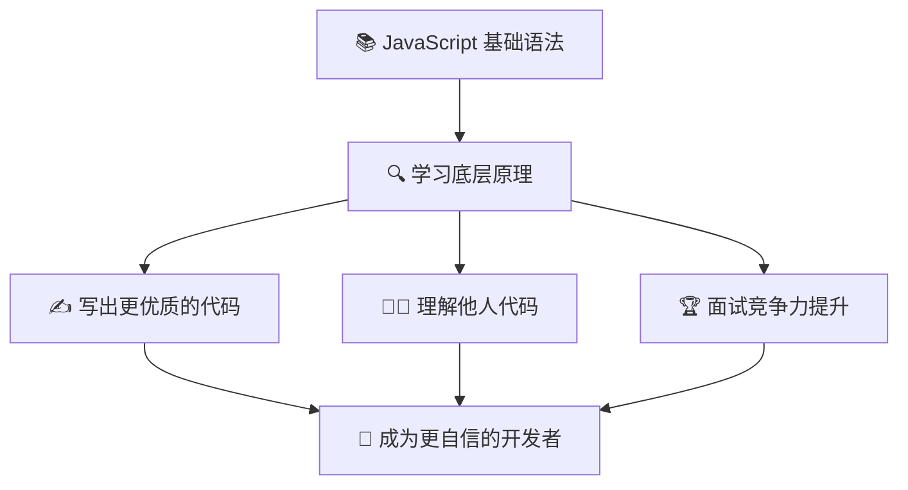
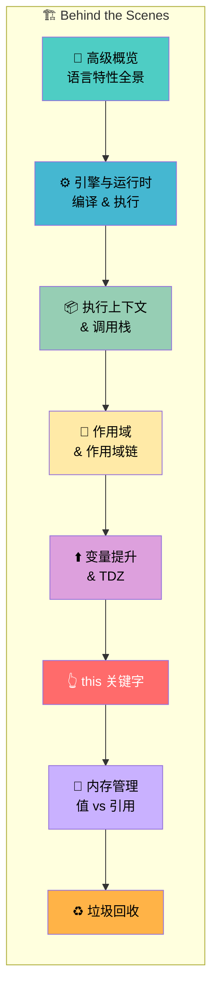

# 章节导读：JavaScript 幕后工作原理

> 📺 来源：001 Section Intro.en.srt
> 📂 章节：第 08 章

## 📌 知识脉络
- **前置知识**：JavaScript 基础语法（变量、函数、控制流）、基本数据类型与操作符
- **后续扩展**：执行上下文与调用栈、作用域链、变量提升、`this` 关键字、内存管理与垃圾回收

## 🎯 概述

本章节将带你深入 JavaScript 的"幕后世界"，从底层机制出发，揭示你在前几章学到的所有基础语法在引擎层面是**如何实际运行**的。掌握这些底层知识不仅能帮助你写出更优质的代码、更快地定位 Bug，还能让你在面试和团队协作中脱颖而出。

## 核心知识点

### 1. 为什么要学习 JavaScript 底层原理？

> 🧩 **生活类比**：学开车只需会方向盘和油门就能上路，但真正的好司机了解发动机、变速箱的工作原理——遇到故障时不慌，做出更安全的驾驶决策。JavaScript 底层知识就是你的"引擎手册"。



理解底层原理带来三大核心优势：

1. **代码质量提升**：知道引擎如何处理你的代码后，你能做出更合理的设计决策
2. **代码阅读能力**：能更快理解开源项目或同事写的复杂代码
3. **竞争力差异化**：许多初级开发者只会写代码但不理解底层机制，掌握这些知识让你脱颖而出

**🔍 执行追踪：**

以下是本章知识点的学习路径：

| 步骤 | 学习内容 | 核心收获 |
|:---:|---------|---------|
| ① | JavaScript 高级概览 | 语言定位与特性全景 |
| ② | 引擎与运行时 | 代码如何被解析执行 |
| ③ | 执行上下文与调用栈 | 代码的执行环境 |
| ④ | 作用域与作用域链 | 变量的可见性规则 |
| ⑤ | 变量提升与 TDZ | 声明前访问的行为 |
| ⑥ | `this` 关键字 | 动态绑定机制 |
| ⑦ | 内存管理与垃圾回收 | 值 vs 引用、自动清理 |

> 💡 **记忆口诀**：**引执作提 this 内存** — 引擎 → 执行上下文 → 作用域 → 提升 → this → 内存管理，这就是本章的知识递进链。

---

### 2. 本章学习路线图

> 🧩 **生活类比**：就像装修房子，你得先了解水电管线（底层结构）才能做好设计。本章就是带你看清 JavaScript 这栋"代码大厦"里隐藏的管线走向。



本章涵盖的主题是 JavaScript 中**最核心的底层机制**，理解它们将为后续学习闭包（Closures）、原型继承（Prototypal Inheritance）、Event Loop 等高级概念打下坚实基础。

> **💼 业务场景**：在大型 Web 应用中排查性能瓶颈或内存泄漏时，如果你不理解调用栈、作用域链和垃圾回收的工作方式，就只能靠"猜"来调试。掌握底层原理后，你可以精准定位问题来源。

---

## 🛠️ 代码实战与真实场景

> **💼 业务场景**：假设你在调试一个电商网站中的"购物车总价计算错误"问题。理解执行上下文、作用域链和 `this` 绑定如何工作，能帮助你快速定位是哪个函数的变量取到了错误的值。

```js {runnable} {title="behind_the_scenes_preview.js"}
// 本章将深入讲解以下每个概念的底层机制

// 1. 执行上下文 — 每次函数调用都创建一个
function calculateTotal(items) {
  // 2. 作用域 — 变量在哪里可见？
  let total = 0;
  
  for (const item of items) {
    // 3. 变量提升 — 为什么 var 和 let 行为不同？
    total += item.price * item.quantity;
  }
  
  return total;
}

// 4. this 关键字 — 指向谁？
const cart = {
  items: [
    { name: '键盘', price: 299, quantity: 1 },
    { name: '鼠标', price: 99, quantity: 2 },
  ],
  getTotal() {
    // this 在这里指向 cart 对象
    return calculateTotal(this.items);
  },
};

console.log(`购物车总价：¥${cart.getTotal()}`);
// 5. 内存管理 — 这些对象什么时候被回收？
```

**📊 输入输出示例：**

| 输入 | 输出 | 说明 |
|------|------|------|
| `cart.getTotal()` | `497` | 299×1 + 99×2 |
| 空购物车 `[]` | `0` | 无商品时返回 0 |

## 💡 关键要点
- ✅ JavaScript 底层知识是**区分普通开发者和优秀开发者**的关键分水岭
- ✅ 本章覆盖：引擎、执行上下文、调用栈、作用域、变量提升、`this`、内存管理
- ✅ 理论知识不等于枯燥 — 它直接影响你写代码和调试的能力
- ✅ 许多初级开发者跳过底层知识，掌握它们能让你在面试和工作中脱颖而出

## ⚠️ 常见误区
- ⚠️ **"底层原理不重要，只要会用就行"**：恰恰相反，不理解底层原理会导致你无法定位复杂 Bug，也写不出高性能代码
- ⚠️ **"看一遍就必须全部理解"**：底层知识需要反复消化，首次学习时理解 70-80% 已经是非常好的成绩

## 🐛 报错实验室

> 在后续课程中你将遇到以下类型的错误，提前了解它们：

**❌ 错误写法：**
```js
// 在声明之前访问 let 变量
console.log(myVar);
let myVar = 'hello';
```
**浏览器报错：**
```
ReferenceError: Cannot access 'myVar' before initialization
```
**🔑 解读**：这就是本章将讲解的**暂时性死区（TDZ）**。用 `let`/`const` 声明的变量在声明语句执行前处于 TDZ 中，访问会抛出引用错误。理解 TDZ 是理解变量提升机制的关键一环。

---

## 📖 词汇速查表 (Cheat Sheet)

| 中文术语 | 英文术语 | 简明释义 | 速查代码 | 📚 官方文档 |
|---------|---------|---------|---------|-----------|
| 执行上下文 | Execution Context | 代码运行时的环境信息封装 | — | [MDN](https://developer.mozilla.org/en-US/docs/Web/JavaScript/Reference/Operators/this#description) |
| 调用栈 | Call Stack | 管理函数执行顺序的 LIFO 栈结构 | — | [MDN](https://developer.mozilla.org/en-US/docs/Glossary/Call_stack) |
| 作用域链 | Scope Chain | 变量查找时的逐层上溯机制 | — | [MDN](https://developer.mozilla.org/en-US/docs/Glossary/Scope) |
| 变量提升 | Hoisting | 声明被"移动"到作用域顶部的行为 | `var x;` | [MDN](https://developer.mozilla.org/en-US/docs/Glossary/Hoisting) |
| 暂时性死区 | Temporal Dead Zone | `let`/`const` 声明前不可访问的区域 | — | [MDN](https://developer.mozilla.org/en-US/docs/Web/JavaScript/Reference/Statements/let#temporal_dead_zone_tdz) |
| 垃圾回收 | Garbage Collection | 引擎自动释放不再使用的内存 | — | [MDN](https://developer.mozilla.org/en-US/docs/Web/JavaScript/Memory_management) |

---

## 🧪 学习验证

### 📝 动手练习

**练习 1：列出你的学习目标**
```js {runnable} {title="exercise1.js"}
// 列出你希望通过本章学到的 3 个核心概念
const learningGoals = [
  // 在这里填写你的学习目标
  '理解_____',
  '掌握_____',
  '能解释_____',
];
console.log('我的学习目标：');
learningGoals.forEach((goal, i) => console.log(`${i + 1}. ${goal}`));
```
<details><summary>💡 参考答案</summary>

```js
const learningGoals = [
  '理解 JavaScript 引擎如何解析和执行代码',
  '掌握作用域链和变量查找机制',
  '能解释 this 关键字在不同场景中的指向',
];
console.log('我的学习目标：');
learningGoals.forEach((goal, i) => console.log(`${i + 1}. ${goal}`));
```
**解题思路**：根据本章要覆盖的知识点，选择你最想深入理解的方面。没有标准答案，关键是在学完整章后回顾检查自己是否达成了目标。
</details>

**练习 2：知识自查**
```js {runnable} {title="exercise2.js"}
// 在学习本章前，先测试自己对以下概念的理解程度
const concepts = {
  '执行上下文': '不了解 / 听过 / 能解释',
  '调用栈': '不了解 / 听过 / 能解释',
  '作用域链': '不了解 / 听过 / 能解释',
  '变量提升': '不了解 / 听过 / 能解释',
  'this 关键字': '不了解 / 听过 / 能解释',
  '垃圾回收': '不了解 / 听过 / 能解释',
};

// 修改每个值为你当前的理解程度
for (const [concept, level] of Object.entries(concepts)) {
  console.log(`${concept}: ${level}`);
}
```
<details><summary>💡 参考答案</summary>

```js
const concepts = {
  '执行上下文': '听过',
  '调用栈': '能解释',
  '作用域链': '不了解',
  '变量提升': '听过',
  'this 关键字': '听过',
  '垃圾回收': '不了解',
};

for (const [concept, level] of Object.entries(concepts)) {
  console.log(`${concept}: ${level}`);
}
```
**解题思路**：这道练习没有固定答案。在学完整章后，你可以再次运行这段代码，将所有值改为"能解释"——这就是你的学习成果！
</details>

### ❓ 理解检测

:::quiz {correct="C"}
**1. 学习 JavaScript 底层原理最大的实际好处是什么？**
- A) 可以使代码运行速度提升 10 倍
- B) 面试时能回答所有问题
- C) 帮助你写出更优质的代码、理解他人代码并更高效地调试
- D) 可以修改 JavaScript 引擎的源代码

> **解析**：底层知识的核心价值在于让你真正**理解**代码的运行机制，从而在编码和调试中做出更明智的决策。它不会直接让代码"快 10 倍"，也不意味着能回答所有面试题，但它确实是全方位提升开发能力的基础。
:::

:::quiz {correct="B"}
**2. 以下哪项不是本章将要讲解的主题？**
- A) 执行上下文与调用栈
- B) Promise 与异步编程
- C) 作用域链
- D) 变量提升与暂时性死区

> **解析**：Promise 与异步编程属于后续章节（Asynchronous JavaScript）的内容。本章聚焦于同步代码的底层执行机制。
:::

:::quiz {correct="A"}
**3. 为什么说掌握底层原理能让你"脱颖而出"？**
- A) 许多初级开发者跳过了这部分知识
- B) 这些知识只能在高级课程中学到
- C) 底层原理每年都在变化

> **解析**：Jonas 特别强调，许多初级开发者因为觉得理论枯燥而跳过底层知识。这意味着掌握它们的人在面试和实际工作中具有明显的竞争优势。
:::

### 🔧 代码填空

:::fill-blank
// 本章将讲解的核心底层概念
const coreTopics = [
  '执行上下文 (___Execution Context___)',
  '调用栈 (___Call Stack___)',
  '___作用域链___ (Scope Chain)',
  '变量提升 (___Hoisting___)',
];
:::
