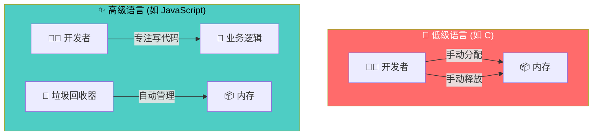
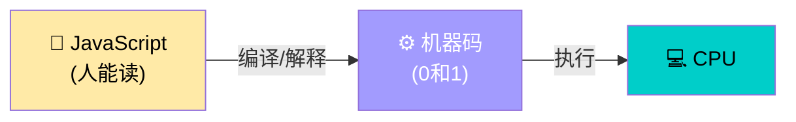
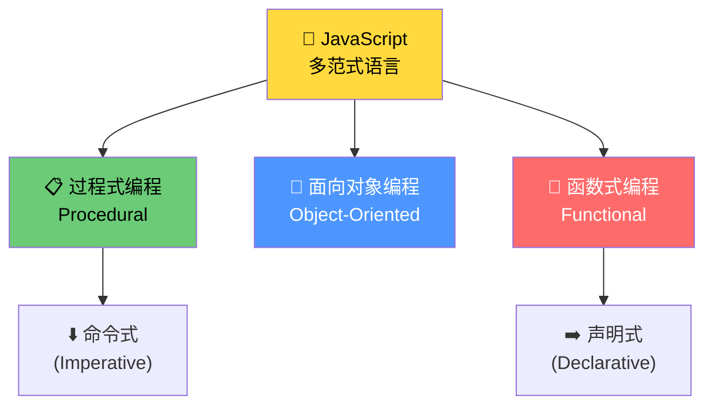
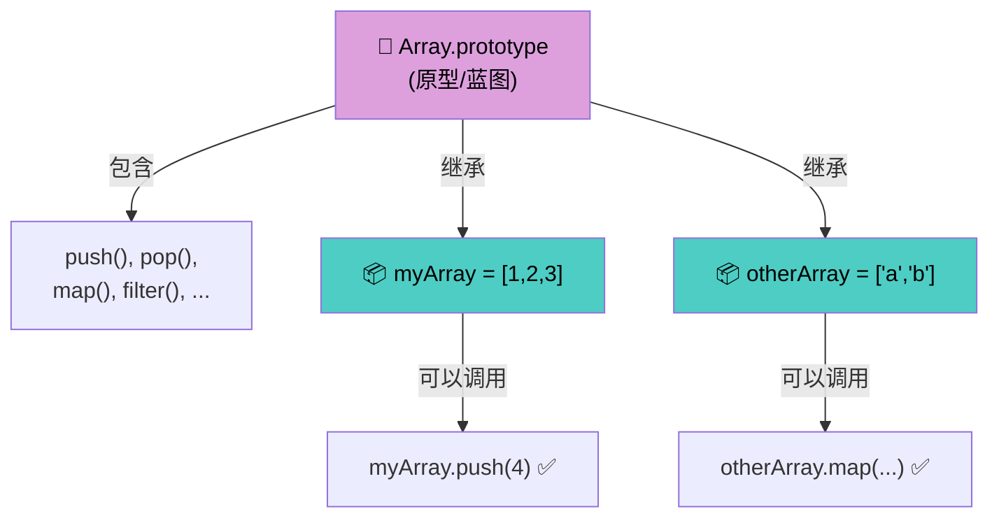
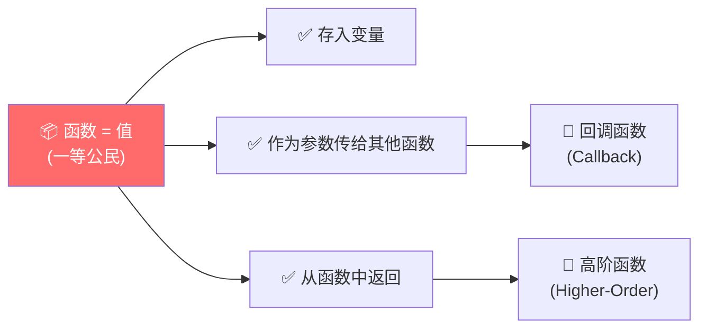
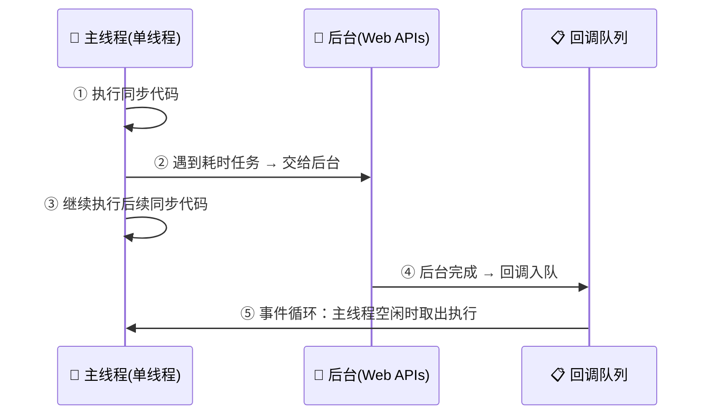

# JavaScript 高级概览

> 📺 来源：003 An High-Level Overview of JavaScript.en.srt
> 📂 章节：第 08 章

## 📌 知识脉络
- **前置知识**：JavaScript 基础语法（变量、函数、数组）、基本数据类型
- **后续扩展**：JavaScript 引擎与运行时、执行上下文、原型继承、Event Loop

## 🎯 概述

本节从宏观视角全面介绍 JavaScript 的九大核心特性：**高级语言**、**垃圾回收**、**解释/即时编译**、**多范式**、**基于原型的面向对象**、**一等函数**、**动态类型**、**单线程**和**非阻塞事件循环并发模型**。这些特性共同定义了 JavaScript 作为一门现代编程语言的本质。

## 核心知识点

### 1. 高级语言与垃圾回收（High-Level & Garbage-Collected）

> 🧩 **生活类比**：低级语言像手动挡汽车——你需要自己管理每一个档位（内存）；高级语言像自动挡汽车——换挡（内存管理）由系统自动完成，你只需专注于驾驶方向。



高级语言（如 JavaScript、Python）提供了大量**抽象（Abstraction）**，让开发者不需要手动管理硬件资源（CPU、内存等）。这使得语言更容易学习和使用，但代价是程序永远不会像 C 语言那样极致优化。

**垃圾回收（Garbage Collection）** 是 JavaScript 引擎内置的算法，它会自动移除不再使用的旧对象，防止内存被无用数据占满。

**🔍 执行追踪：**

| 步骤 | C 语言 | JavaScript |
|:---:|--------|-----------|
| ① | `malloc(size)` 手动申请内存 | `const obj = {}` 自动分配 |
| ② | 使用内存中的数据 | 使用对象中的数据 |
| ③ | `free(ptr)` 手动释放内存 | 🧹 垃圾回收器自动释放 |

> 💡 **记忆口诀**：**高级 = 自动挡，垃圾回收 = 自动取垃圾的清洁工**

---

### 2. 解释型 / 即时编译（Interpreted / Just-In-Time Compiled）

> 🧩 **生活类比**：计算机只懂 0 和 1（机器码），就像一个只懂英语的老外。我们写的 JavaScript 代码就像中文，需要一个"翻译官"——这就是 **编译（Compile）** 或 **解释（Interpret）**。



计算机处理器只理解机器码（0 和 1），所以每种编程语言最终都需要将人类可读的代码转换为机器码。JavaScript 的这个转换过程发生在 **JavaScript 引擎** 内部——详细机制将在下一节展开。

---

### 3. 多范式语言（Multi-Paradigm）

> 🧩 **生活类比**：有些厨师只会中餐或西餐，但 JavaScript 是一位"全能厨师"——中餐（过程式）、西餐（面向对象）、日料（函数式）都能做，你想用哪种烹饪风格都行。



**编程范式（Paradigm）** = 组织和构建代码的方法论与思维模式。

| 范式 | 核心思想 | JavaScript 示例 |
|------|---------|----------------|
| 过程式（Procedural） | 线性组织代码，用函数分块 | `function doSomething() {}` |
| 面向对象（OOP） | 用对象封装数据和行为 | `class User { ... }` |
| 函数式（FP） | 用纯函数和不可变数据 | `arr.map(x => x * 2)` |

> **💼 业务场景**：在大型前端项目中，你可能会混合使用 OOP（组件类）和 FP（数据转换管道），JavaScript 的多范式特性让这一切自然流畅。

---

### 4. 基于原型的面向对象（Prototype-Based OOP）

> 🧩 **生活类比**：原型继承就像饼干模具——原型（Prototype）是模具，你用它"压"出来的每块饼干（实例）都继承了模具的形状（方法），但可以加不同的糖霜（自己的数据）。



JavaScript 中几乎所有东西都是对象（除了原始值如 number、string 等）。数组之所以能使用 `push` 方法，是因为每个数组都从 `Array.prototype`（原型蓝图）**继承**了这些方法。

```js {runnable} {title="prototype_demo.js"}
const myArray = [1, 2, 3];

// 你创建的数组可以调用 push —— 因为它从原型继承了这个方法
myArray.push(4);
console.log(myArray); // [1, 2, 3, 4]

// 验证：push 确实来自原型
console.log(myArray.__proto__ === Array.prototype); // true
console.log(typeof Array.prototype.push); // "function"
```

> 💡 **记忆口诀**：**原型 = 蓝图，实例 = 从蓝图继承能力的产品**

---

### 5. 一等函数（First-Class Functions）

> 🧩 **生活类比**：在 JavaScript 中，函数就像平民百姓一样享有和变量相同的"公民权"——可以被存进变量、可以作为参数传递、甚至可以被另一个函数"生产"出来返回。



```js {runnable} {title="first_class_functions.js"}
// 函数存入变量
const greet = function(name) {
  return `你好，${name}！`;
};

// 函数作为参数传递（回调模式）
function processUser(name, callback) {
  const message = callback(name);
  console.log(message);
}

processUser('张三', greet); // "你好，张三！"

// 函数返回函数
function createMultiplier(factor) {
  return function(num) {
    return num * factor;
  };
}

const double = createMultiplier(2);
console.log(double(5)); // 10
```

不是所有语言都支持一等函数，JavaScript 的这一特性使得**函数式编程**成为可能。

---

### 6. 动态类型（Dynamically-Typed）

> 🧩 **生活类比**：静态类型语言像给每个抽屉贴了固定标签（"只放袜子"），而 JavaScript 的动态类型就是所有抽屉都没标签——什么东西想放就放，放进去后才知道是什么类型。

```js {runnable} {title="dynamic_typing.js"}
// 不需要声明变量的类型
let x = 23;        // x 现在是 number
console.log(typeof x); // "number"

x = 'hello';       // x 现在变成了 string（同一个变量！）
console.log(typeof x); // "string"

x = true;           // 又变成了 boolean
console.log(typeof x); // "boolean"
```

**📊 概念对比（静态 vs 动态类型）：**

| 特征 | 静态类型（如 TypeScript） | 动态类型（JavaScript） |
|------|------------------------|---------------------|
| 类型声明 | `let x: number = 23` | `let x = 23` |
| 类型变更 | ❌ 编译报错 | ✅ 随时可变 |
| Bug 发现时机 | 编译时 | 运行时 |
| 代表语言 | Java, C++, TypeScript | JavaScript, Python |

> ⚠️ 动态类型的灵活性是一把双刃剑——方便但也容易隐藏类型相关的 Bug。这也是 **TypeScript** 诞生的原因。

---

### 7. 单线程与非阻塞事件循环并发模型

> 🧩 **生活类比**：JavaScript 像一个只有一个窗口的银行（单线程）。如果一位客户要办超耗时的业务（网络请求），银行不会让后面所有人等着，而是让这位客户去旁边填表（后台处理），填好后再叫号回来（事件循环）。



关键概念拆解：

| 术语 | 含义 |
|------|------|
| **单线程（Single-Thread）** | JavaScript 一次只能执行一件事 |
| **线程（Thread）** | CPU 中执行指令的通道 |
| **非阻塞（Non-Blocking）** | 耗时任务不会卡住主线程 |
| **事件循环（Event Loop）** | 将后台完成的任务放回主线程执行的机制 |

> 💡 **记忆口诀**：**单线程不怕忙，耗时丢后台，做完叫循环，队列排队来**

---

## 🛠️ 代码实战与真实场景

> **💼 业务场景**：你正在构建一个社交媒体应用的「用户信息卡片」组件。需要用到 JavaScript 的多种核心特性：OOP 建模用户、一等函数处理回调、动态类型处理不同数据。

```js {runnable} {title="js_features_demo.js"}
// 1️⃣ 多范式：用面向对象 + 函数式混合构建
class UserCard {
  constructor(name, age) {
    this.name = name;
    this.age = age;
  }
  
  // 2️⃣ 原型继承：所有 UserCard 实例共享此方法
  greet() {
    return `👋 我是 ${this.name}，今年 ${this.age} 岁`;
  }
}

// 3️⃣ 一等函数：传递函数作为参数
function displayUsers(users, formatter) {
  users.forEach(user => {
    console.log(formatter(user));
  });
}

const users = [
  new UserCard('小明', 25),
  new UserCard('小红', 22),
  new UserCard('小李', 28),
];

// 4️⃣ 函数作为参数传入
displayUsers(users, user => user.greet());

// 5️⃣ 动态类型：变量值可以灵活变化
let result = users.length;    // number
console.log(`共 ${result} 位用户`);
result = users.map(u => u.name); // 变成了 array
console.log('用户列表:', result);
```


**📊 输入输出示例：**

| 输入 | 输出 | 说明 |
|------|------|------|
| `new UserCard('小明', 25).greet()` | `👋 我是 小明，今年 25 岁` | 原型方法调用 |
| `typeof users.length` | `"number"` | 动态类型检测 |
| `users.map(u => u.name)` | `['小明', '小红', '小李']` | 一等函数 + 函数式编程 |

## 💡 关键要点
- ✅ JavaScript 是**高级语言**，不需要手动管理内存，垃圾回收器自动清理
- ✅ JavaScript 是**多范式语言**，支持过程式、面向对象和函数式编程
- ✅ JavaScript 通过**原型继承**实现面向对象，数组方法都来自 `Array.prototype`
- ✅ **一等函数**让函数可以像变量一样传递，这是函数式编程的基础
- ✅ JavaScript 是**单线程**的，通过**事件循环**实现非阻塞并发

## ⚠️ 常见误区
- ⚠️ **"JavaScript 是纯解释型语言"**：现代 JavaScript 引擎（如 V8）使用**即时编译（JIT）**，编译与解释同时进行
- ⚠️ **"动态类型 = 没有类型"**：变量始终有类型，只是类型不固定在变量上，而是跟随值变化
- ⚠️ **"单线程 = 慢"**：单线程配合事件循环，JavaScript 可以高效处理大量并发 I/O 操作

## 🐛 报错实验室

> 动态类型带来的典型运行时错误

**❌ 错误写法：**
```js
let data = '100';
const result = data + 50;  // 期望 150
console.log(result);       // 实际输出："10050"（字符串拼接！）
```
**浏览器报错：**
```
没有报错！这是一个静默Bug（Silent Bug），更加危险。
```
**🔑 解读**：动态类型让 `data` 可以是任何类型。当 `string + number` 时，JavaScript 会自动将数字转为字符串进行拼接，而不是数学加法。这就是为什么 TypeScript 等类型系统能帮助提前发现此类问题。

---

## 📖 词汇速查表 (Cheat Sheet)

| 中文术语 | 英文术语 | 简明释义 | 速查代码 | 📚 官方文档 |
|---------|---------|---------|---------|-----------|
| 垃圾回收 | Garbage Collection | 自动释放不再使用的内存 | — | [MDN](https://developer.mozilla.org/en-US/docs/Web/JavaScript/Memory_management) |
| 即时编译 | JIT Compilation | 运行时动态编译代码为机器码 | — | [MDN](https://developer.mozilla.org/en-US/docs/Glossary/Just-In-Time_Compilation) |
| 编程范式 | Paradigm | 组织代码结构的方法论 | — | — |
| 一等函数 | First-Class Functions | 函数可以像变量一样使用 | `const fn = () => {}` | [MDN](https://developer.mozilla.org/en-US/docs/Glossary/First-class_Function) |
| 原型 | Prototype | 对象继承的蓝图/模板 | `Array.prototype` | [MDN](https://developer.mozilla.org/en-US/docs/Learn/JavaScript/Objects/Object_prototypes) |
| 动态类型 | Dynamic Typing | 变量类型在运行时确定 | `typeof x` | [MDN](https://developer.mozilla.org/en-US/docs/Web/JavaScript/Reference/Operators/typeof) |
| 事件循环 | Event Loop | 非阻塞并发的核心机制 | — | [MDN](https://developer.mozilla.org/en-US/docs/Web/JavaScript/Event_loop) |
| 单线程 | Single-Thread | 同一时间只执行一个任务 | — | — |

---

## 🧪 学习验证

### 📝 动手练习

**练习 1：识别 JavaScript 特性**
```js {runnable} {title="exercise1.js"}
// 下面的代码展示了哪些 JavaScript 核心特性？
// 在注释中标注每一行涉及的特性

const numbers = [10, 20, 30]; // 特性: ______
const doubled = numbers.map(n => n * 2); // 特性: ______
console.log(doubled); // [20, 40, 60]
```
<details><summary>💡 参考答案</summary>

```js
const numbers = [10, 20, 30]; // 特性: 原型继承（数组从 Array.prototype 继承方法）
const doubled = numbers.map(n => n * 2); // 特性: 一等函数（箭头函数作为参数）+ 函数式编程
console.log(doubled); // [20, 40, 60]
// 还涉及: 高级语言（不需要手动管理内存）、动态类型（numbers 自动推断为 Array 类型）
```
**解题思路**：几乎每一行 JavaScript 代码都同时涉及多个核心特性。`map` 方法来自原型继承，传入箭头函数体现了一等函数特性，整体风格是函数式编程。
</details>

**练习 2：动态类型探索**
```js {runnable} {title="exercise2.js"}
// 验证动态类型：观察同一个变量存储不同类型的值
let mystery = 42;
console.log(`值: ${mystery}, 类型: ${typeof mystery}`);

mystery = 'hello world';
console.log(`值: ${mystery}, 类型: ${typeof mystery}`);

mystery = [1, 2, 3];
console.log(`值: ${mystery}, 类型: ${typeof mystery}`);

mystery = null;
console.log(`值: ${mystery}, 类型: ${typeof mystery}`);
// ❓ null 的 typeof 结果是什么？是不是 "null"？
```
<details><summary>💡 参考答案</summary>

```js
let mystery = 42;
console.log(`值: 42, 类型: number`);

mystery = 'hello world';
console.log(`值: hello world, 类型: string`);

mystery = [1, 2, 3];
console.log(`值: 1,2,3, 类型: object`); // 数组的 typeof 是 "object"

mystery = null;
console.log(`值: null, 类型: object`); // 这是 JS 著名的 Bug！
```
**解题思路**：`typeof null` 返回 `"object"` 是 JavaScript 语言诞生之初的一个历史遗留 Bug，一直保留至今以维持向后兼容性。数组的 `typeof` 也是 `"object"`，需要用 `Array.isArray()` 来精确判断。
</details>

### ❓ 理解检测

:::quiz {correct="A"}
**1. JavaScript 使用什么机制自动管理内存？**
- A) 垃圾回收（Garbage Collection）
- B) 手动释放（Manual Deallocation）
- C) 引用计数法（Reference Counting）— 仅此一种
- D) 不管理，让操作系统处理

> **解析**：JavaScript 引擎内置了垃圾回收（GC）算法，最常见的是**标记-清除（Mark-and-Sweep）**。虽然引用计数也曾是 GC 策略之一，但现代引擎以标记-清除为主。开发者无需手动释放内存。
:::

:::quiz {correct="C"}
**2. 以下哪项最能体现"一等函数"的含义？**
- A) 函数必须用 `function` 关键字声明
- B) 函数执行时创建新的作用域
- C) 函数可以作为参数传递给其他函数
- D) 函数只能通过调用来执行

> **解析**：一等函数的核心含义是函数被视为普通值——可以赋值给变量、作为参数传递、从函数中返回。选项 C 是最直接的体现。
:::

:::quiz {correct="B"}
**3. JavaScript 是单线程语言，为什么还能处理异步任务？**
- A) JavaScript 实际上是多线程的
- B) 通过事件循环（Event Loop）将耗时任务交给后台处理
- C) 因为计算机 CPU 是多核的
- D) 浏览器会为每个任务创建新线程

> **解析**：JavaScript 代码确实在单线程中执行，但浏览器/Node.js 提供了 Web APIs / C++ APIs 来在后台处理耗时操作。事件循环负责将完成的任务回调放回主线程执行。
:::

### 🔧 代码填空

:::fill-blank
// JavaScript 九大核心特性
const jsFeatures = {
  level: '___高级___',           // High-level
  memory: '___垃圾回收___',     // Garbage-collected
  compilation: 'JIT 编译',       // Just-in-time compiled
  paradigm: '___多范式___',     // Multi-paradigm
  oop: '基于原型',              // Prototype-based
  functions: '___一等函数___',  // First-class functions
  typing: '___动态类型___',     // Dynamically-typed
  thread: '单线程',             // Single-threaded
  concurrency: '事件循环',      // Event loop
};
:::
