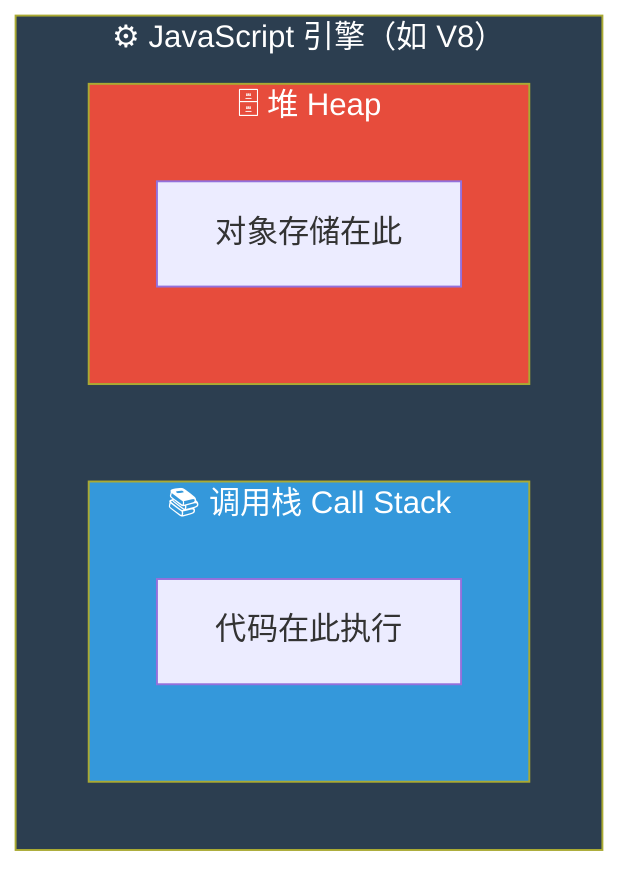
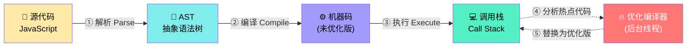
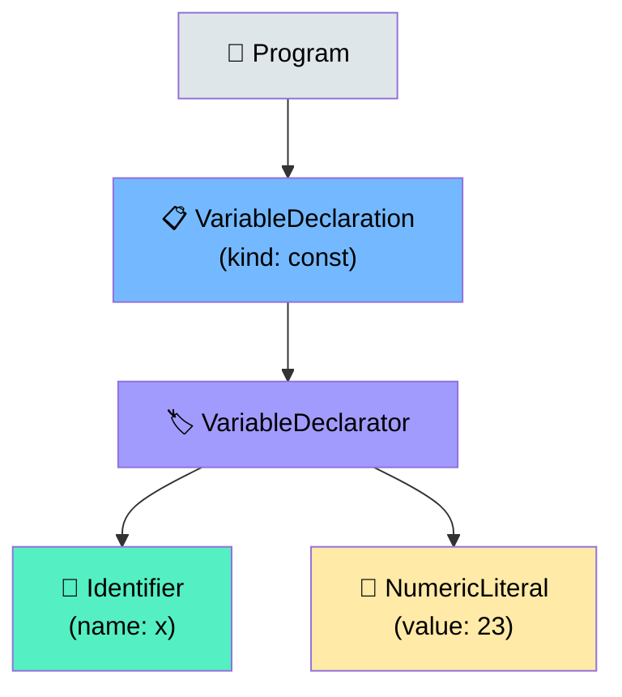
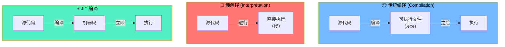
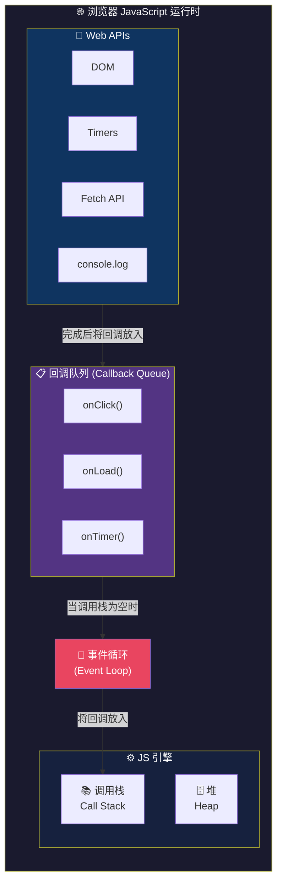
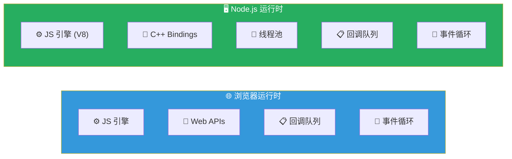
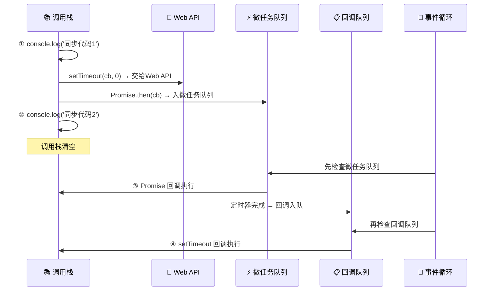

# JavaScript 引擎与运行时

> 📺 来源：004 The JavaScript Engine and Runtime.en.srt
> 📂 章节：第 08 章

## 📌 知识脉络
- **前置知识**：JavaScript 高级概览（高级语言、垃圾回收、JIT 编译概念）
- **后续扩展**：执行上下文与调用栈、作用域链、Event Loop 深入

## 🎯 概述

本节深入解析 JavaScript 引擎（Engine）的内部结构——**调用栈（Call Stack）** 和 **堆（Heap）**，以及代码从源码到机器码的完整编译流程：**解析（Parsing）→ AST → 编译（Compilation）→ 执行（Execution）→ 优化（Optimization）**。同时介绍 JavaScript **运行时（Runtime）** 的全景架构，包括 Web APIs、回调队列和事件循环。

## 核心知识点

### 1. JavaScript 引擎的内部结构

> 🧩 **生活类比**：JavaScript 引擎就像一座工厂——**调用栈（Call Stack）** 是生产线（按顺序执行），**堆（Heap）** 是仓库（存放原材料/对象）。没有工厂就没有产品，没有引擎就没有 JavaScript。



每个 JavaScript 引擎都包含两个核心组件：

| 组件 | 英文 | 职责 |
|------|------|------|
| **调用栈** | Call Stack | 代码实际执行的地方（通过执行上下文） |
| **堆** | Heap | 存储程序中所有对象的非结构化内存池 |

最知名的 JavaScript 引擎包括 Google 的 **V8**（驱动 Chrome 和 Node.js）、Mozilla 的 **SpiderMonkey**（驱动 Firefox）和 Apple 的 **JavaScriptCore**（驱动 Safari）。

> 💡 **记忆口诀**：**栈管执行，堆管存储** — Call Stack 是流水线，Heap 是仓库。

---

### 2. 从源码到机器码：编译流水线

> 🧩 **生活类比**：想象把一篇中文文章翻译成英文并出版。先要**解析**原文理解语法结构（AST），再**翻译/编译**成英文（机器码），最后**印刷发行/执行**。现代 JS 引擎甚至在读者还没读完时就在后台偷偷润色优化！



**🔍 执行追踪：**

| 阶段 | 步骤 | 发生了什么 | 所在线程 |
|:---:|:---:|---------|:------:|
| ① | 解析（Parse） | 代码被拆分为有意义的片段（token），构建 AST | 主线程 |
| ② | 编译（Compile） | AST 被编译为机器码（未优化的初版） | 主线程 |
| ③ | 执行（Execute） | 机器码在调用栈中立即执行 | 主线程 |
| ④ | 分析 | 引擎识别热点代码（频繁执行的部分） | 后台线程 |
| ⑤ | 优化替换 | 优化后的机器码替换旧版，无需停止执行 | 后台线程 |

#### AST（抽象语法树）示例

```js
const x = 23;
```

这行简单代码生成的 AST 结构大致如下：



> ⚠️ **AST 与 DOM 树无关**！AST 是代码的语法结构表示，DOM 树是 HTML 文档的结构表示，两者完全不同。

---

### 3. 编译 vs 解释 vs JIT 编译

> 🧩 **生活类比**：
> - **编译（Compilation）**= 先把整本书翻译完再出版 → 读者直接读成品书
> - **解释（Interpretation）**= 现场同声传译，翻一句读一句 → 慢但即时
> - **JIT 编译**= 先快速口头翻译让你马上能读，同时后台慢慢打磨出精装版替换 → 兼顾速度和质量



**📊 三种模式对比：**

| 特征 | 传统编译 | 纯解释 | JIT 编译 |
|------|---------|--------|---------|
| 转换时机 | 执行前全部编译 | 运行时逐行转换 | 运行时全部编译 |
| 中间产物 | 生成可执行文件 | 无文件 | 无可执行文件 |
| 执行速度 | 🚀 最快 | 🐌 最慢 | ⚡ 很快 |
| 代表语言 | C, C++ | 早期 JavaScript | 现代 JavaScript |

> **💼 业务场景**：Google Maps 这样的重型 Web 应用，如果使用纯解释方式，拖动地图每次都要等一秒——完全不可接受。JIT 编译让 JavaScript 的性能接近编译型语言。

---

### 4. JavaScript 运行时（Runtime）全景

> 🧩 **生活类比**：JavaScript 引擎是"心脏"，但光有心脏不能活——运行时就是整个"身体"，包含心脏（引擎）、手脚（Web APIs）、消化系统（回调队列）和神经中枢（事件循环）。



运行时的四大组件协作流程：

1. **引擎**：解析编译并执行 JavaScript 代码
2. **Web APIs**：浏览器提供的额外功能（DOM 操作、定时器、网络请求等），**不是 JavaScript 语言本身的一部分**
3. **回调队列**：存放等待执行的回调函数
4. **事件循环**：当调用栈为空时，从回调队列取出回调放入调用栈执行

#### 浏览器 vs Node.js 运行时对比



| 组件 | 浏览器运行时 | Node.js 运行时 |
|------|------------|---------------|
| 引擎 | V8 / SpiderMonkey 等 | V8 |
| 外部功能 | Web APIs (DOM, Fetch...) | C++ Bindings + 线程池 |
| 回调队列 | ✅ | ✅ |
| 事件循环 | ✅ | ✅ |

---

## 🛠️ 代码实战与真实场景

> **💼 业务场景**：理解事件循环如何工作——当用户点击按钮触发网络请求时，运行时的各组件如何协作。

```js {runnable} {title="runtime_demo.js"}
// 模拟运行时组件的协作过程

console.log('① 同步代码 → 调用栈立即执行');

// setTimeout 交给 Web API 处理，不阻塞调用栈
setTimeout(() => {
  console.log('④ 定时器回调 → 从回调队列通过事件循环进入调用栈');
}, 0);

// Promise 使用微任务队列（优先于回调队列）
Promise.resolve().then(() => {
  console.log('③ Promise 微任务 → 优先于宏任务执行');
});

console.log('② 同步代码 → 调用栈继续执行');

// 输出顺序：① → ② → ③ → ④
// 这就是事件循环的实际工作方式！
```



**📊 输入输出示例：**

| 代码 | 执行顺序 | 说明 |
|------|:-------:|------|
| `console.log('①')` | 1️⃣ | 同步代码，立即执行 |
| `console.log('②')` | 2️⃣ | 同步代码，继续执行 |
| `Promise.then(...)` | 3️⃣ | 微任务，优先于宏任务 |
| `setTimeout(...)` | 4️⃣ | 宏任务，最后执行 |

## 💡 关键要点
- ✅ JavaScript 引擎由**调用栈**（执行代码）和**堆**（存储对象）组成
- ✅ 现代 JavaScript 使用 **JIT 编译** — 编译后立即执行，无中间文件
- ✅ 编译流水线：**解析 → AST → 编译 → 执行 → 后台优化**
- ✅ 运行时 = 引擎 + Web APIs + 回调队列 + 事件循环
- ✅ Web APIs **不是 JavaScript 语言本身的一部分**，是浏览器/Node.js 提供的额外功能

## ⚠️ 常见误区
- ⚠️ **"AST 和 DOM 树是同一个东西"**：完全不同！AST 是代码的语法结构，DOM 是 HTML 文档的结构
- ⚠️ **"JavaScript 是纯解释型语言"**：现代引擎使用 JIT 编译，性能远超纯解释
- ⚠️ **"setTimeout(fn, 0) 会立即执行"**：即使延迟为 0，回调仍需等调用栈清空后才能通过事件循环执行

## 🐛 报错实验室

> 解析阶段如何捕获语法错误

**❌ 错误写法：**
```js
// 语法错误在解析（Parsing）阶段就会被捕获
const x = ;  // 缺少值
```
**浏览器报错：**
```
SyntaxError: Unexpected token ';'
```
**🔑 解读**：JavaScript 引擎在**解析阶段**（构建 AST 之前）就会检查语法。当代码不符合语法规则时，整个脚本都不会执行——连第一行 `console.log` 都不会运行。这就是为什么语法错误（SyntaxError）和运行时错误（TypeError/ReferenceError）的表现完全不同。

---

## 📖 词汇速查表 (Cheat Sheet)

| 中文术语 | 英文术语 | 简明释义 | 速查代码 | 📚 官方文档 |
|---------|---------|---------|---------|-----------|
| 调用栈 | Call Stack | 管理代码执行顺序的 LIFO 栈 | — | [MDN](https://developer.mozilla.org/en-US/docs/Glossary/Call_stack) |
| 堆 | Heap | 存储对象的非结构化内存区域 | — | [MDN](https://developer.mozilla.org/en-US/docs/Web/JavaScript/Memory_management#data_structures) |
| 抽象语法树 | AST | 代码的树形语法结构表示 | — | — |
| 即时编译 | JIT Compilation | 运行时编译并立即执行 | — | [MDN](https://developer.mozilla.org/en-US/docs/Glossary/Just-In-Time_Compilation) |
| 运行时 | Runtime | 执行 JS 代码所需的全部环境 | — | — |
| Web APIs | Web APIs | 浏览器提供的功能接口 | `setTimeout()` | [MDN](https://developer.mozilla.org/en-US/docs/Web/API) |
| 回调队列 | Callback Queue | 等待执行的回调函数队列 | — | — |
| 事件循环 | Event Loop | 协调调用栈和回调队列的机制 | — | [MDN](https://developer.mozilla.org/en-US/docs/Web/JavaScript/Event_loop) |

---

## 🧪 学习验证

### 📝 动手练习

**练习 1：预测执行顺序**
```js {runnable} {title="exercise1.js"}
// 预测以下代码的输出顺序，然后运行验证
console.log('A');

setTimeout(() => console.log('B'), 0);

console.log('C');

// 你的预测：A → ? → ?
```
<details><summary>💡 参考答案</summary>

```js
// 输出顺序：A → C → B
console.log('A');           // ① 同步 → 立即执行
setTimeout(() => console.log('B'), 0); // ③ 宏任务 → 最后执行
console.log('C');           // ② 同步 → 继续执行
```
**解题思路**：即使 `setTimeout` 的延迟是 0ms，回调也不会立即执行。它被交给 Web API 处理，完成后放入回调队列，等调用栈清空后才通过事件循环执行。
</details>

**练习 2：识别运行时组件**
```js {runnable} {title="exercise2.js"}
// 标注每行代码涉及的运行时组件

// 涉及哪个组件？_______
document.querySelector('.btn');

// 涉及哪个组件？_______
const obj = { name: '测试' };

// 涉及哪个组件？_______
setTimeout(() => {}, 1000);

// 涉及哪个组件？_______
function add(a, b) { return a + b; }
add(1, 2);

console.log('练习完成！');
```
<details><summary>💡 参考答案</summary>

```js
document.querySelector('.btn');     // Web API (DOM API)
const obj = { name: '测试' };      // 堆 (Heap) — 对象存储在堆中
setTimeout(() => {}, 1000);         // Web API (Timer API) + 回调队列
function add(a, b) { return a + b; }
add(1, 2);                          // 调用栈 (Call Stack) — 函数执行
```
**解题思路**：DOM 操作和定时器属于 Web APIs，对象存储在堆中，函数调用在调用栈中执行。理解每行代码涉及哪个组件是深入理解运行时架构的基础。
</details>

### ❓ 理解检测

:::quiz {correct="B"}
**1. JavaScript 引擎的两个核心组件是什么？**
- A) DOM 和 BOM
- B) 调用栈（Call Stack）和堆（Heap）
- C) 回调队列和事件循环
- D) 编译器和解释器

> **解析**：每个 JavaScript 引擎（如 V8）都包含调用栈（代码执行的地方）和堆（对象存储的地方）。DOM/BOM 是 Web APIs，回调队列和事件循环是运行时的组件。
:::

:::quiz {correct="C"}
**2. 在 JIT 编译中，代码的编译和执行是什么关系？**
- A) 先全部编译，生成 .exe 文件，再执行
- B) 完全不编译，逐行解释执行
- C) 编译后立即执行，无中间可执行文件
- D) 每次执行前都重新编译一次

> **解析**：JIT（Just-In-Time）编译的核心是"即时"——代码被编译为机器码后立即执行，不生成独立的可执行文件。引擎还会在后台持续优化热点代码。
:::

:::quiz {correct="A"}
**3. Web APIs 与 JavaScript 语言的关系是什么？**
- A) Web APIs 不是 JavaScript 语言本身的一部分，是浏览器提供的
- B) Web APIs 是 JavaScript 核心语法
- C) Web APIs 只在 Node.js 中可用
- D) 所有 Web APIs 都存储在调用栈中

> **解析**：`setTimeout`、DOM 操作、`fetch` 等都是浏览器环境提供的 Web APIs，通过 `window` 全局对象暴露给 JavaScript 使用。JavaScript 语言规范（ECMAScript）本身不包含这些内容。
:::

### 🔧 代码填空

:::fill-blank
// JIT 编译流水线
const jitPipeline = [
  '① 解析源代码 → 生成 ___AST___',
  '② 将 AST ___编译___ 为机器码',
  '③ 在 ___调用栈___ 中立即执行',
  '④ 后台线程持续 ___优化___ 热点代码',
];
:::
