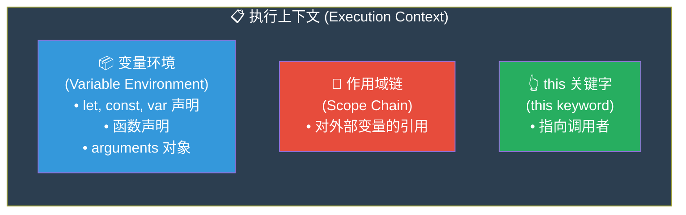
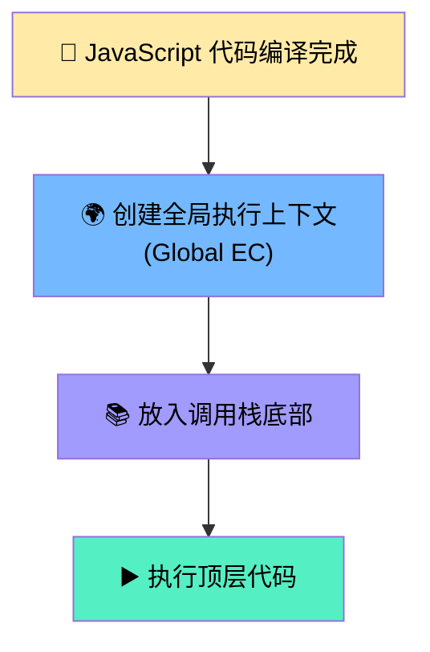
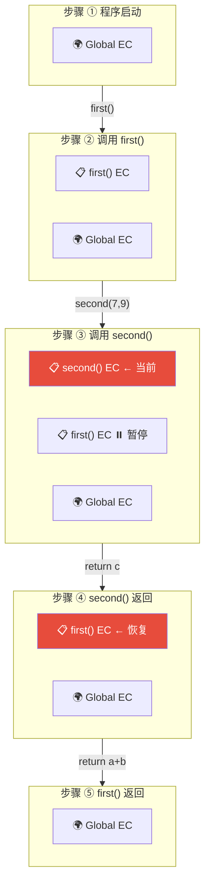
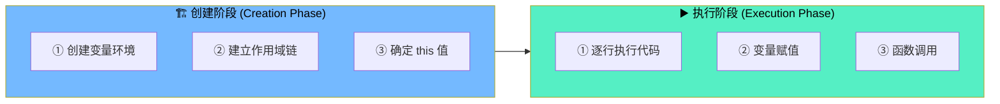
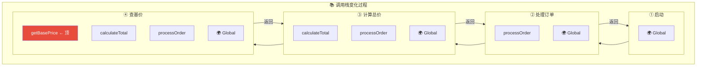

# 执行上下文与调用栈

> 📺 来源：005 Execution Contexts and The Call Stack.en.srt
> 📂 章节：第 08 章

## 📌 知识脉络
- **前置知识**：JavaScript 引擎结构（调用栈 + 堆）、JIT 编译流水线
- **后续扩展**：作用域与作用域链、变量提升（Hoisting）与 TDZ、闭包（Closures）

## 🎯 概述

本节深入讲解 JavaScript 代码执行的核心机制：**执行上下文（Execution Context）** 是代码运行的"环境容器"，每次函数调用都会创建一个；**调用栈（Call Stack）** 则是管理这些执行上下文的 LIFO 栈结构，确保代码执行顺序永不混乱。理解这两个概念是掌握作用域、`this` 和闭包的基础。

## 核心知识点

### 1. 什么是执行上下文（Execution Context）？

> 🧩 **生活类比**：执行上下文就像一个"任务信封"——你接到一个任务（函数调用），信封里装着你需要的所有工具和信息（变量、函数引用、`this`）。任务完成后，信封被丢弃。



执行上下文包含三个核心组成部分：

| 组件 | 英文 | 作用 | 创建时机 |
|------|------|------|---------|
| **变量环境** | Variable Environment | 存储 `let`/`const`/`var` 声明、函数声明、`arguments` | 创建阶段 |
| **作用域链** | Scope Chain | 引用外部（父级）作用域的变量 | 创建阶段 |
| **this 关键字** | this Keyword | 指向当前上下文的调用对象 | 创建阶段 |

> ⚠️ **箭头函数的特殊性**：箭头函数**没有自己的 `arguments` 对象和 `this` 关键字**，它们使用最近的普通函数父级的 `arguments` 和 `this`。

**🔍 执行追踪：**

```js
const name = 'Jonas';

function first() {
  const a = 1;
  const b = second(7, 9);
  return a + b;
}

function second(x, y) {
  const c = 2;
  return c;
}

const x = first();
```

| 执行上下文 | 变量环境 | 说明 |
|-----------|---------|------|
| **全局 EC** | `name = 'Jonas'`, `first = <fn>`, `second = <fn>`, `x = <unknown>` | 顶层代码 |
| **first() EC** | `a = 1`, `b = <unknown>` | 调用 first() 时创建 |
| **second() EC** | `c = 2`, `arguments = [7, 9]` | 调用 second() 时创建 |

> 💡 **记忆口诀**：**执行上下文 = 变量环境 + 作用域链 + this** — 三位一体的"代码运行环境袋"。

---

### 2. 全局执行上下文（Global Execution Context）

> 🧩 **生活类比**：全局执行上下文就像一栋大楼的"大堂"——所有人进入大楼（程序启动）都要先来大堂，全局变量和函数就像大堂里的公共设施，人人都可以使用。



关键特征：
- **有且仅有一个**全局执行上下文（每个页面/模块一个）
- 所有**非函数内部**的代码（顶层代码）都在这里执行
- 在程序整个生命周期中**始终存在**，只有关闭浏览器标签页时才被销毁
- 包含全局变量声明和函数声明

---

### 3. 调用栈（Call Stack）的工作机制

> 🧩 **生活类比**：调用栈就像一摞披萨盒——每叫一个外卖（函数调用），就在最上面放一个盒子。吃完一个（函数返回）就拿走最上面的盒子，露出下一个。你永远只能操作最上面那个盒子（当前正在执行的函数）。



**🔍 执行追踪（完整流程）：**

```js
const name = 'Jonas';

function first() {
  const a = 1;
  const b = second(7, 9);
  return a + b; // ← ⑤ second() 返回后继续
}

function second(x, y) {
  const c = 2;
  return c; // ← ④ 返回 → EC 出栈
}

const x = first(); // ← ② 调用 → 创建 first() EC
```

| 步骤 | 动作 | 调用栈状态（顶→底） | 说明 |
|:---:|------|-------------------|------|
| ① | 程序启动 | `[Global]` | 全局 EC 入栈 |
| ② | 调用 `first()` | `[first, Global]` | first EC 入栈，成为当前 |
| ③ | 调用 `second(7,9)` | `[second, first, Global]` | second EC 入栈，first **暂停** |
| ④ | `second()` 返回 | `[first, Global]` | second EC 出栈，first **恢复** |
| ⑤ | `first()` 返回 | `[Global]` | first EC 出栈 |
| ⑥ | 程序空闲 | `[Global]` | 全局 EC 始终存在 |

> ⚠️ **关键：JavaScript 是单线程的！** 当 `second()` 在执行时，`first()` 被完全暂停。同一时刻只有栈顶的执行上下文在运行。

> 💡 **记忆口诀**：**调用就压栈，返回就弹栈，栈顶在执行，底层在等待**

---

### 4. 执行上下文的创建阶段 vs 执行阶段

> 🧩 **生活类比**：就像演出前的"布景"（创建阶段：搭好舞台、准备道具）和"开演"（执行阶段：演员按剧本表演）。



| 阶段 | 时机 | 内容 |
|------|------|------|
| **创建阶段** | 函数被调用，代码执行前 | 创建变量环境（变量声明提升）、建立作用域链、确定 `this` |
| **执行阶段** | 创建阶段完成后 | 逐行执行代码、给变量赋值、调用函数 |

> **💼 业务场景**：在大型 SPA 应用中，每个组件方法调用都会创建新的执行上下文。理解这个机制能帮你预判变量查找路径，快速定位"变量未定义"或"this 指向错误"的 Bug。

---

## 🛠️ 代码实战与真实场景

> **💼 业务场景**：模拟一个简单的订单处理系统，通过调用栈追踪函数执行流程。

```js {runnable} {title="call_stack_demo.js"}
// 订单处理系统 — 追踪调用栈的变化

function processOrder(orderId) {
  console.log(`📋 [调用栈: processOrder] 开始处理订单 #${orderId}`);
  const total = calculateTotal(orderId);
  console.log(`📋 [调用栈: processOrder] 订单 #${orderId} 总价: ¥${total}`);
  return total;
}

function calculateTotal(orderId) {
  console.log(`  📋 [调用栈: calculateTotal > processOrder] 计算中...`);
  const basePrice = getBasePrice(orderId);
  const tax = basePrice * 0.13; // 13% 增值税
  console.log(`  📋 [调用栈: calculateTotal > processOrder] 基价:¥${basePrice} 税:¥${tax}`);
  return basePrice + tax;
}

function getBasePrice(orderId) {
  console.log(`    📋 [调用栈: getBasePrice > calculateTotal > processOrder] 查询价格...`);
  // 模拟数据库查询
  const prices = { 1001: 299, 1002: 599, 1003: 199 };
  const price = prices[orderId] || 0;
  console.log(`    📋 [调用栈: getBasePrice 返回] 价格: ¥${price}`);
  return price;
  // ← getBasePrice EC 出栈
}

// 顶层代码在全局执行上下文中运行
console.log('🌍 [全局执行上下文] 程序启动');
const orderTotal = processOrder(1001);
console.log(`🌍 [全局执行上下文] 最终结果: ¥${orderTotal}`);
```



**📊 输入输出示例：**

| 输入 | 输出 | 说明 |
|------|------|------|
| `processOrder(1001)` | `337.87` | 299 + 299×0.13 = 337.87 |
| `processOrder(1002)` | `676.87` | 599 + 599×0.13 |
| `processOrder(9999)` | `0` | 找不到价格，返回 0 |

## 💡 关键要点
- ✅ **执行上下文**是代码运行的环境容器，包含变量环境、作用域链和 this
- ✅ 每次函数调用都会创建一个**新的执行上下文**
- ✅ **全局执行上下文**在程序启动时创建，贯穿整个生命周期
- ✅ **调用栈**是 LIFO 结构，栈顶是当前执行的上下文，返回时出栈
- ✅ 箭头函数**没有自己的** `arguments` 和 `this`，使用父级的

## ⚠️ 常见误区
- ⚠️ **"每个函数声明都会创建执行上下文"**：错！执行上下文只在函数**被调用**时创建，声明时不会
- ⚠️ **"调用栈中的函数是并行执行的"**：JavaScript 是单线程的，栈中的函数是**顺序执行**的，下面的被暂停
- ⚠️ **"执行上下文出栈后立即被销毁"**：不完全正确。出栈后通常会被垃圾回收，但**闭包**会让部分变量环境保留

## 🐛 报错实验室

> 调用栈溢出——无限递归

**❌ 错误写法：**
```js
function chicken() {
  return egg(); // 鸡调用蛋
}

function egg() {
  return chicken(); // 蛋调用鸡
}

chicken(); // 无限互相调用
```
**浏览器报错：**
```
RangeError: Maximum call stack size exceeded
```
**🔑 解读**：每次函数调用都往调用栈中压入一个新的执行上下文。无限递归意味着不停地压栈但永远不弹栈，最终超出调用栈的容量限制（通常约 10,000-25,000 层）。这就是著名的"栈溢出（Stack Overflow）"。修复方法：确保递归函数有明确的**终止条件**。

---

## 📖 词汇速查表 (Cheat Sheet)

| 中文术语 | 英文术语 | 简明释义 | 速查代码 | 📚 官方文档 |
|---------|---------|---------|---------|-----------|
| 执行上下文 | Execution Context | 代码运行的环境容器 | — | [MDN](https://developer.mozilla.org/en-US/docs/Web/JavaScript/Reference/Operators/this#description) |
| 变量环境 | Variable Environment | 存储当前上下文中的变量声明 | — | — |
| 调用栈 | Call Stack | 管理执行上下文的 LIFO 栈 | — | [MDN](https://developer.mozilla.org/en-US/docs/Glossary/Call_stack) |
| 全局执行上下文 | Global EC | 程序启动时创建的顶层上下文 | — | — |
| arguments 对象 | arguments object | 函数接收的所有参数的类数组 | `arguments[0]` | [MDN](https://developer.mozilla.org/en-US/docs/Web/JavaScript/Reference/Functions/arguments) |
| 栈溢出 | Stack Overflow | 调用栈超出容量限制 | — | — |

---

## 🧪 学习验证

### 📝 动手练习

**练习 1：调用栈追踪**
```js {runnable} {title="exercise1.js"}
// 在每个 console.log 后面标注当前调用栈的状态

function a() {
  console.log('a 开始'); // 调用栈: [a, Global]
  b();
  console.log('a 结束'); // 调用栈: ?
}

function b() {
  console.log('b 开始'); // 调用栈: ?
  c();
  console.log('b 结束'); // 调用栈: ?
}

function c() {
  console.log('c 执行'); // 调用栈: ?
}

a();
```
<details><summary>💡 参考答案</summary>

```js
function a() {
  console.log('a 开始'); // 调用栈: [a, Global]
  b();
  console.log('a 结束'); // 调用栈: [a, Global]（b 已出栈）
}

function b() {
  console.log('b 开始'); // 调用栈: [b, a, Global]
  c();
  console.log('b 结束'); // 调用栈: [b, a, Global]（c 已出栈）
}

function c() {
  console.log('c 执行'); // 调用栈: [c, b, a, Global]（栈最深处）
}

a();
// 输出顺序：a 开始 → b 开始 → c 执行 → b 结束 → a 结束
```
**解题思路**：每次函数调用压栈、返回后出栈。`console.log('b 结束')` 的时候 `c` 已经返回出栈了，但 `b` 和 `a` 仍在栈中。
</details>

**练习 2：执行上下文组件识别**
```js {runnable} {title="exercise2.js"}
// 分析这段代码会创建几个执行上下文？
// 每个执行上下文的变量环境包含什么？

const globalVar = '全局';

function outer(x) {
  const outerVar = '外层';
  
  function inner(y) {
    const innerVar = '内层';
    return x + y;
  }
  
  return inner(10);
}

const result = outer(5);
console.log(result);

// 问题：共创建了几个执行上下文？
// 答：____个
```
<details><summary>💡 参考答案</summary>

```js
// 共创建 3 个执行上下文：
// 1. 全局 EC: { globalVar: '全局', outer: <fn>, result: 15 }
// 2. outer() EC: { x: 5, outerVar: '外层', inner: <fn> }
// 3. inner() EC: { y: 10, innerVar: '内层' }

const result = outer(5); // outer EC 入栈 → inner EC 入栈 → inner 返回出栈 → outer 返回出栈
console.log(result); // 15
```
**解题思路**：全局代码创建全局 EC，`outer(5)` 调用创建 outer EC，`inner(10)` 调用创建 inner EC。虽然代码中定义了两个函数，但只有**被调用**时才创建执行上下文。
</details>

### ❓ 理解检测

:::quiz {correct="B"}
**1. 执行上下文在什么时候被创建？**
- A) 函数被声明时
- B) 函数被调用时
- C) 代码被编译时
- D) 变量被赋值时

> **解析**：函数声明（`function foo() {}`）只是在当前变量环境中注册函数，不会创建新的执行上下文。只有当函数被**调用**（`foo()`）时，引擎才会创建对应的执行上下文并压入调用栈。
:::

:::quiz {correct="C"}
**2. 关于箭头函数的执行上下文，以下哪项正确？**
- A) 箭头函数不会创建执行上下文
- B) 箭头函数的执行上下文与普通函数完全相同
- C) 箭头函数的执行上下文没有自己的 arguments 和 this
- D) 箭头函数没有变量环境

> **解析**：箭头函数**会创建**执行上下文，但其中**不包含自己的 `arguments` 对象和 `this` 关键字**。它们使用从最近的普通函数父级继承的值。
:::

:::quiz {correct="A"}
**3. 调用栈溢出（Stack Overflow）的根本原因是什么？**
- A) 函数递归调用没有终止条件，导致无限压栈
- B) 全局变量过多占满内存
- C) 堆内存不足
- D) 事件循环停止工作

> **解析**：每次函数调用都会在调用栈中压入一个执行上下文。如果函数无限递归调用自己（没有终止条件），栈会不断增长直到超出浏览器限制，抛出 `RangeError`。
:::

### 🔧 代码填空

:::fill-blank
// 执行上下文的三大组成部分
const executionContext = {
  variableEnvironment: '___变量环境___',  // 存储变量和函数声明
  scopeChain: '___作用域链___',           // 引用外部变量
  thisKeyword: '___this 关键字___',       // 指向调用对象
};

// 调用栈的操作
// 函数调用 → ___压栈 / push___
// 函数返回 → ___出栈 / pop___
:::
