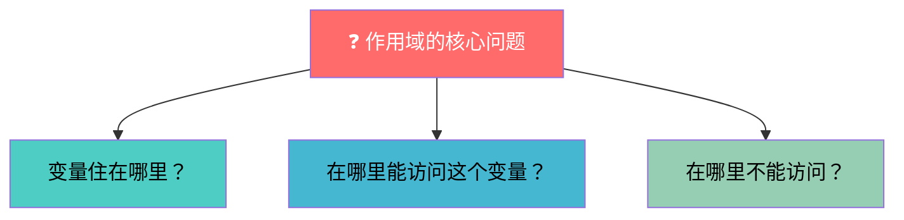
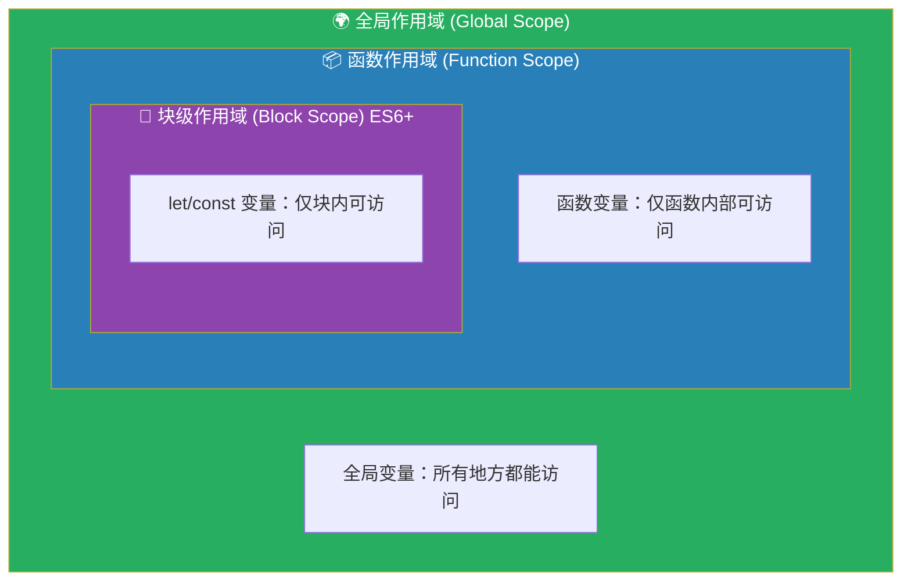
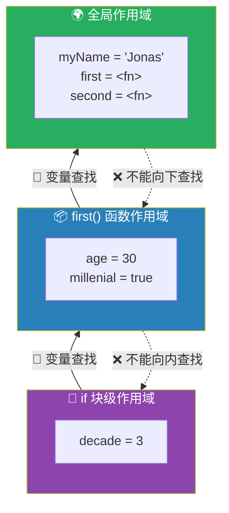
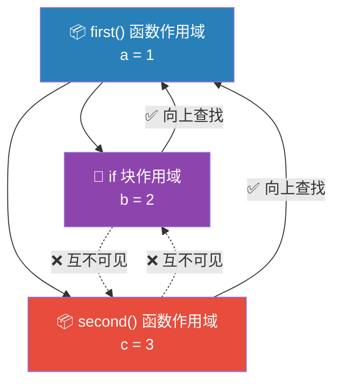
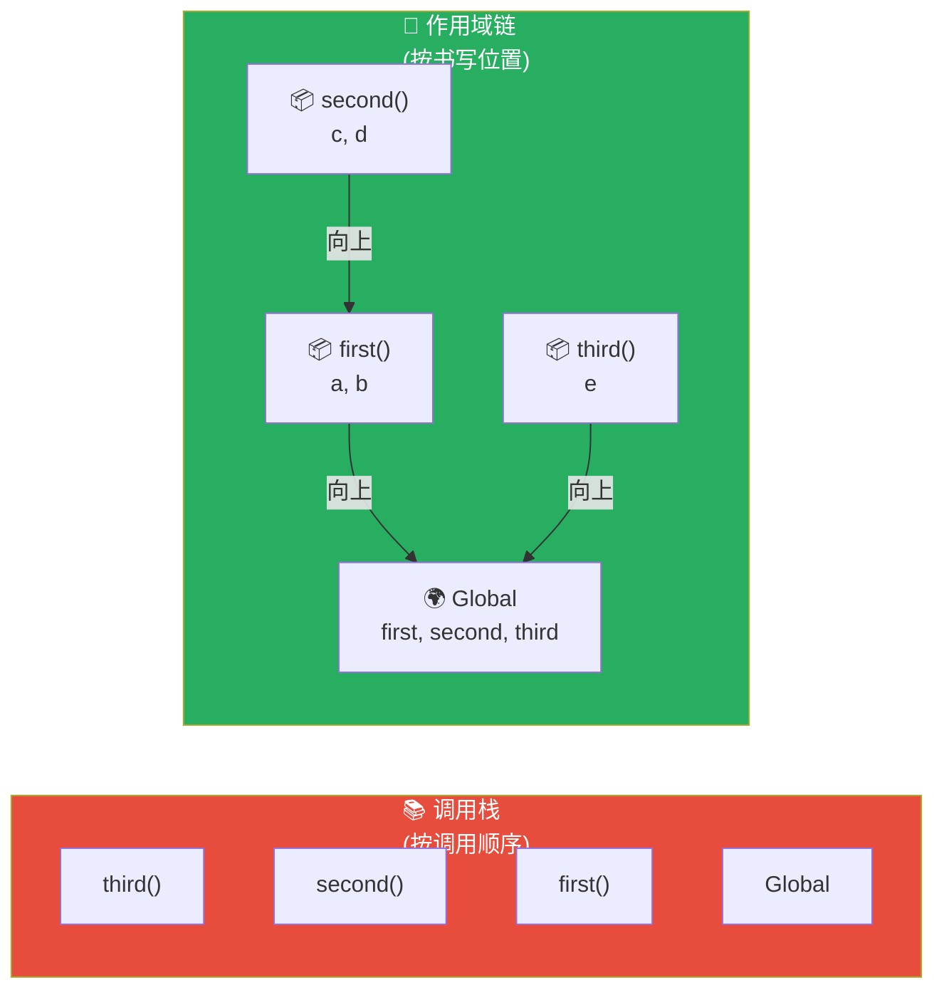
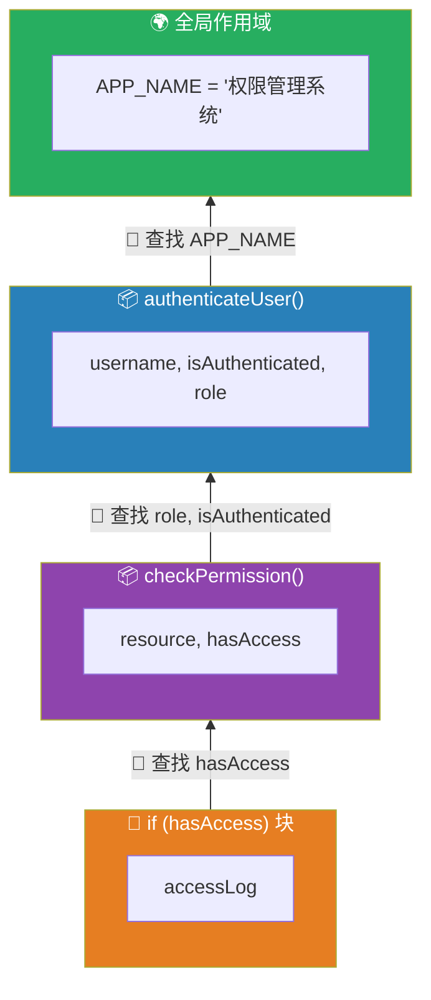

# 作用域与作用域链

> 📺 来源：006 Scope and The Scope Chain.en.srt
> 📂 章节：第 08 章

## 📌 知识脉络
- **前置知识**：执行上下文（变量环境、调用栈）、`let`/`const`/`var` 声明方式
- **后续扩展**：变量提升（Hoisting）与 TDZ、闭包（Closures）、模块作用域

## 🎯 概述

本节全面讲解 JavaScript 的**作用域（Scope）** 机制——决定"变量在哪里可以被访问"的规则体系。涵盖三种作用域类型（全局、函数、块级）、**词法作用域（Lexical Scoping）** 的静态规则、以及**作用域链（Scope Chain）** 的变量查找机制。最重要的是：**作用域链与调用栈无关**，它只取决于代码的书写位置。

## 核心知识点

### 1. 什么是作用域（Scoping）？

> 🧩 **生活类比**：作用域就像一栋公寓大楼的门禁卡系统——你的门禁卡（变量）能打开哪些门（在哪里可以访问），取决于你住在哪一层（代码写在哪里），而不是你从哪里走过来（函数的调用顺序）。



**作用域**回答的核心问题：**变量在哪里可以被访问？**

JavaScript 使用**词法作用域（Lexical Scoping）**——变量的可访问性完全取决于代码的**书写位置**（静态结构），而非运行时的调用关系。

> 💡 **记忆口诀**：**作用域看写在哪，不看调用路径怎么走**

---

### 2. 三种作用域类型

> 🧩 **生活类比**：
> - **全局作用域** = 小区公共花园，所有住户都能进
> - **函数作用域** = 你家客厅，只有家人和被邀请的客人能进
> - **块级作用域** = 你的卧室抽屉，只有你自己能打开



**📊 三种作用域对比：**

| 类型 | 创建条件 | 可访问范围 | var | let/const |
|------|---------|-----------|:---:|:---------:|
| **全局作用域** | 顶层代码 | 所有地方 | ✅ | ✅ |
| **函数作用域** | `function` 声明/表达式 | 仅函数内部 | ✅ | ✅ |
| **块级作用域** | `{}`（if/for/while 等） | 仅块内 | ❌ 逃逸! | ✅ |

```js {runnable} {title="scope_types.js"}
// 🌍 全局作用域
const globalVar = '我是全局的';

function myFunction() {
  // 📦 函数作用域
  const funcVar = '我是函数内的';
  var funcVarVar = '我也是函数内的';
  
  if (true) {
    // 🧱 块级作用域
    const blockLet = '我是块级的 (let/const)';
    var blockVar = '我用 var 声明，会逃出块级！';
    
    console.log(globalVar);  // ✅ 能访问全局
    console.log(funcVar);    // ✅ 能访问外层函数
    console.log(blockLet);   // ✅ 能访问本层
  }
  
  // console.log(blockLet); // ❌ ReferenceError! let/const 出不了块
  console.log(blockVar);   // ✅ var 逃出了块级，在函数作用域中
}

myFunction();
// console.log(funcVar); // ❌ ReferenceError! 函数外无法访问
```

**🔍 执行追踪：**

| 位置 | `globalVar` | `funcVar` | `blockLet` | `blockVar` |
|------|:-----------:|:---------:|:----------:|:----------:|
| 全局 | ✅ | ❌ | ❌ | ❌ |
| 函数内、块外 | ✅ | ✅ | ❌ | ✅ (var 逃逸) |
| 块内 | ✅ | ✅ | ✅ | ✅ |

> ⚠️ **关键区别**：`var` 只认**函数作用域**，会直接穿透块级作用域（if/for 等），这是 `var` 最危险的行为之一。`let`/`const` 则遵守块级作用域。

---

### 3. 作用域链（Scope Chain）

> 🧩 **生活类比**：作用域链像一个"向上问家长"的机制——孩子（内层作用域）找不到玩具（变量），就去问妈妈（外层函数作用域），妈妈也没有就问奶奶（全局作用域）。但奶奶绝不会反过来问孙子（不能向内查找）。



**作用域链的核心规则：**

1. 每个作用域都能访问**所有外层作用域**的变量
2. 查找顺序：当前作用域 → 父级作用域 → ... → 全局作用域
3. **单向性**：只能向上查找，不能向下或平行查找
4. 找到就停，找不到就报 `ReferenceError`

```js {runnable} {title="scope_chain.js"}
const myName = 'Jonas';

function first() {
  const age = 30;
  
  if (age >= 30) {
    const decade = 3;
    // decade 在块级作用域
    // age 通过作用域链从 first() 获取
    // myName 通过作用域链从全局获取
    console.log(`${myName} 已经 ${age} 岁了，这是他的第 ${decade} 个十年`);
  }
  
  // console.log(decade); // ❌ ReferenceError
}

first();
```

> 💡 **记忆口诀**：**作用域链只能向上爬，不能向下挖，平级不串门**

---

### 4. 兄弟作用域不互通

> 🧩 **生活类比**：两个平行的卧室（兄弟作用域）互相锁着门——你在自己房间找不到东西，可以去客厅（父级作用域）找，但不能闯进兄弟的房间。



```js {runnable} {title="sibling_scopes.js"}
function first() {
  const a = 1;
  
  if (true) {
    const b = 2;
    console.log(a); // ✅ 能访问父级的 a
    // console.log(c); // ❌ 不能访问兄弟 second() 的 c
  }
  
  function second() {
    const c = 3;
    console.log(a); // ✅ 能访问父级的 a
    // console.log(b); // ❌ 不能访问兄弟 if 块的 b
  }
  
  second();
}

first();
```

---

### 5. 作用域链 vs 调用栈 — 核心区别

> 🧩 **生活类比**：调用栈是"谁先打电话给谁"的通话记录（运行时顺序），作用域链是"组织架构图上谁是谁的下属"（代码结构位置）。通话顺序不影响组织架构。



```js {runnable} {title="scope_vs_callstack.js"}
// 关键示例：调用顺序 ≠ 作用域链

function first() {
  const a = 'first 的变量';

  function second() {
    const c = 'second 的变量';
    // second 写在 first 内部 → 作用域链：second → first → global
    console.log(a); // ✅ 通过作用域链访问 first 的 a
    third(); // 调用 third（但 third 不在 second 的作用域链中！）
  }

  second();
}

function third() {
  const e = 'third 的变量';
  // third 写在全局 → 作用域链：third → global
  // console.log(a); // ❌ ReferenceError! 虽然是 second 调用了 third，
  //                  //    但 third 不在 first 内部，无法访问 a
  console.log(e);
}

first();
```

**📊 核心对比：**

| 特征 | 调用栈（Call Stack） | 作用域链（Scope Chain） |
|------|--------------------|-----------------------|
| 决定因素 | 函数**调用顺序** | 函数**书写位置** |
| 性质 | 动态（运行时） | 静态（词法/编译时） |
| 方向 | 后进先出（LIFO） | 由内向外（向上查找） |
| 作用 | 管理执行顺序 | 管理变量访问权限 |

> **💼 业务场景**：在 React 中，组件 A 调用了工具函数 `util()`，但 `util()` 无法访问 A 的局部状态——因为 `util` 是全局模块级函数，它的作用域链不包含 A 的作用域，即使是 A 调用了它。

---

## 🛠️ 代码实战与真实场景

> **💼 业务场景**：构建一个用户权限验证系统，通过作用域控制变量可见性。

```js {runnable} {title="scope_demo.js"}
// 用户权限系统 — 作用域链实战

const APP_NAME = '权限管理系统'; // 全局作用域

function authenticateUser(username) {
  const isAuthenticated = true;     // 函数作用域
  const role = 'admin';             // 函数作用域
  
  function checkPermission(resource) {
    // 通过作用域链访问父级的 role 和 isAuthenticated
    const hasAccess = isAuthenticated && role === 'admin';
    
    if (hasAccess) {
      const accessLog = `[${APP_NAME}] ${username} 访问了 ${resource}`;
      console.log(accessLog); // ✅ 块内能访问所有外层变量
      
      return true;
    }
    
    // console.log(accessLog); // ❌ 出了块就访问不了
    return false;
  }
  
  // 调用权限检查
  const canAccessDashboard = checkPermission('仪表盘');
  const canAccessSettings = checkPermission('系统设置');
  
  console.log(`认证状态: ${isAuthenticated}`);
  console.log(`仪表盘权限: ${canAccessDashboard}`);
  console.log(`设置权限: ${canAccessSettings}`);
}

authenticateUser('张管理员');
```



**📊 输入输出示例：**

| 输入 | 输出 | 说明 |
|------|------|------|
| `authenticateUser('张管理员')` | `[权限管理系统] 张管理员 访问了 仪表盘` | 作用域链逐层向上获取变量 |
| `checkPermission('仪表盘')` | `true` | 通过作用域链访问 `role` 判断权限 |

## 💡 关键要点
- ✅ 作用域决定**变量在哪里可以被访问**，JavaScript 使用**词法作用域**（由代码书写位置决定）
- ✅ 三种作用域：**全局**、**函数**、**块级**（ES6+，仅 `let`/`const`）
- ✅ `var` 只认函数作用域，会**穿透块级作用域**
- ✅ 作用域链只能**向上查找**，不能向下或平行（兄弟作用域不互通）
- ✅ **作用域链 ≠ 调用栈**：前者看代码写在哪，后者看函数调用顺序

## ⚠️ 常见误区
- ⚠️ **"在 for 循环里用 var 声明的变量只在循环内可见"**：错！`var` 会逃逸到最近的函数作用域
- ⚠️ **"谁调用了函数，函数就能访问谁的变量"**：错！作用域链由代码书写位置决定，与调用栈无关
- ⚠️ **"全局变量好方便，应该多用"**：全局变量会污染公共命名空间，容易引发命名冲突，应尽量减少使用

## 🐛 报错实验室

> 试图跨作用域访问块级变量

**❌ 错误写法：**
```js
function example() {
  if (true) {
    const secret = '仅块内可见';
  }
  console.log(secret); // 试图在块外访问
}
example();
```
**浏览器报错：**
```
ReferenceError: secret is not defined
```
**🔑 解读**：`const`（和 `let`）声明的变量严格遵守块级作用域。一旦离开 `if` 的 `{}` 大括号，`secret` 就不存在了。如果改用 `var secret`，则不会报错——因为 `var` 会逃逸到函数作用域，但这通常不是你想要的行为。

---

## 📖 词汇速查表 (Cheat Sheet)

| 中文术语 | 英文术语 | 简明释义 | 速查代码 | 📚 官方文档 |
|---------|---------|---------|---------|-----------|
| 作用域 | Scope | 变量可被访问的区域 | — | [MDN](https://developer.mozilla.org/en-US/docs/Glossary/Scope) |
| 词法作用域 | Lexical Scoping | 由代码书写位置决定的作用域规则 | — | [MDN](https://developer.mozilla.org/en-US/docs/Web/JavaScript/Closures#lexical_scoping) |
| 全局作用域 | Global Scope | 顶层代码的作用域，全局可访问 | `window.x` | — |
| 函数作用域 | Function Scope | 函数内部的局部作用域 | `function() {}` | — |
| 块级作用域 | Block Scope | `{}` 大括号内的作用域（ES6+） | `if () { let x }` | [MDN](https://developer.mozilla.org/en-US/docs/Web/JavaScript/Reference/Statements/block) |
| 作用域链 | Scope Chain | 逐层向上查找变量的链路 | — | — |
| 变量查找 | Variable Lookup | 在作用域链中搜索变量的过程 | — | — |

---

## 🧪 学习验证

### 📝 动手练习

**练习 1：预测变量访问结果**
```js {runnable} {title="exercise1.js"}
const a = '全局 a';

function outer() {
  const b = '外层 b';
  
  function inner() {
    const c = '内层 c';
    
    // 预测：这三个变量分别来自哪个作用域？
    console.log(a); // 来自 _____ 作用域
    console.log(b); // 来自 _____ 作用域
    console.log(c); // 来自 _____ 作用域
  }
  
  inner();
  // console.log(c); // 这里能访问 c 吗？
}

outer();
```
<details><summary>💡 参考答案</summary>

```js
const a = '全局 a';

function outer() {
  const b = '外层 b';
  
  function inner() {
    const c = '内层 c';
    
    console.log(a); // 来自 全局 作用域（通过作用域链向上两层）
    console.log(b); // 来自 outer函数 作用域（通过作用域链向上一层）
    console.log(c); // 来自 inner函数 当前作用域（无需查找）
  }
  
  inner();
  // console.log(c); // ❌ ReferenceError！作用域链不能向下查找
}

outer();
```
**解题思路**：`inner` 先在自己的作用域找变量，找不到就沿作用域链向上到 `outer`，再找不到就到全局。`c` 定义在 `inner` 内部，`outer` 无法向下访问。
</details>

**练习 2：var 逃逸陷阱**
```js {runnable} {title="exercise2.js"}
function loopTest() {
  for (var i = 0; i < 3; i++) {
    // var 声明的 i
  }
  console.log('循环结束后 i =', i); // 输出什么？
  
  for (let j = 0; j < 3; j++) {
    // let 声明的 j
  }
  // console.log('循环结束后 j =', j); // 这行会怎样？
}

loopTest();
```
<details><summary>💡 参考答案</summary>

```js
function loopTest() {
  for (var i = 0; i < 3; i++) {}
  console.log('循环结束后 i =', i); // 输出：3 （var 逃逸到函数作用域）
  
  for (let j = 0; j < 3; j++) {}
  // console.log('循环结束后 j =', j); // ❌ ReferenceError（let 被锁在块内）
}
```
**解题思路**：`var` 无视块级作用域，`i` 逃逸到 `loopTest` 函数作用域中，循环结束后仍可访问（值为 3）。`let` 严格遵守块级作用域，`j` 在 `for` 块结束后被销毁。
</details>

### ❓ 理解检测

:::quiz {correct="B"}
**1. JavaScript 使用什么类型的作用域规则？**
- A) 动态作用域（由函数调用位置决定）
- B) 词法作用域（由代码书写位置决定）
- C) 运行时作用域（由执行顺序决定）
- D) 全局作用域（所有变量都是全局的）

> **解析**：JavaScript 使用词法作用域（Lexical Scoping），变量的可访问性在代码编写时就确定了，而非运行时根据调用栈决定。
:::

:::quiz {correct="C"}
**2. 关于 `var` 和 `let` 的作用域差异，以下哪项正确？**
- A) `var` 遵守块级作用域，`let` 不遵守
- B) 两者行为完全一致
- C) `var` 只认函数作用域，会穿透 if/for 等块级作用域
- D) `let` 声明的变量可以在函数外访问

> **解析**：`var` 声明的变量只受函数作用域约束，会"逃逸"出 `if`、`for` 等块级作用域。`let` 和 `const` 则严格遵守块级作用域。
:::

:::quiz {correct="A"}
**3. 作用域链（Scope Chain）与调用栈（Call Stack）的关系是什么？**
- A) 无直接关系——作用域链由代码位置决定，调用栈由调用顺序决定
- B) 作用域链是调用栈的子集
- C) 调用栈决定了作用域链的顺序
- D) 它们是同一个概念的不同名称

> **解析**：这是本节最关键的概念之一：作用域链由词法结构（代码写在哪里）决定，调用栈由运行时函数调用顺序决定，两者完全独立。
:::

### 🔧 代码填空

:::fill-blank
// 作用域链核心规则
// 1. 查找方向：只能 ___向上___ 查找，不能向下
// 2. 兄弟作用域 ___互不可见___
// 3. var 会穿透 ___块级___ 作用域
// 4. 作用域链由代码 ___书写位置___ 决定
:::
