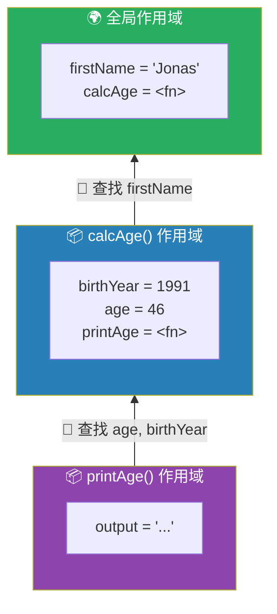
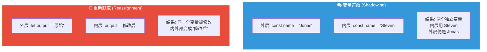
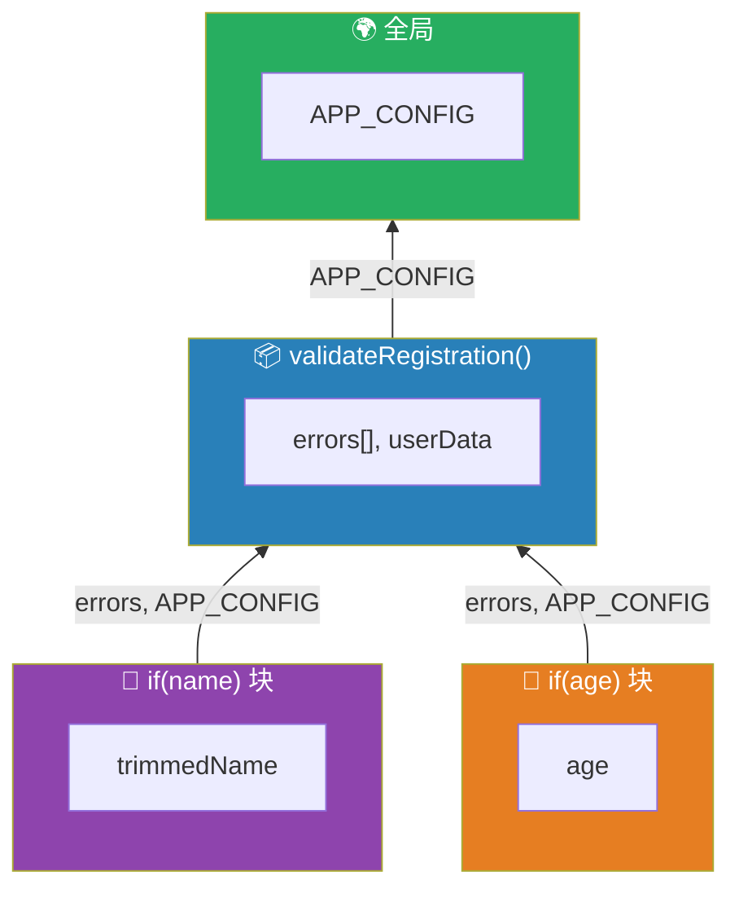

# 作用域实战演练

> 📺 来源：007 Scoping in Practice.en.srt
> 📂 章节：第 08 章

## 📌 知识脉络
- **前置知识**：三种作用域（全局、函数、块级）、作用域链、`let`/`const`/`var` 区别
- **后续扩展**：变量提升（Hoisting）与 TDZ、闭包（Closures）

## 🎯 概述

本节通过大量实战代码验证上一节学到的作用域理论：全局作用域的变量全局可见、函数作用域隔离内部变量、块级作用域仅约束 `let`/`const`（`var` 会逃逸）、作用域链的向上查找机制、同名变量遮蔽（Shadowing）与重新赋值的区别，以及函数在严格模式下的块级作用域行为。

## 核心知识点

### 1. 全局变量与函数作用域

> 🧩 **生活类比**：全局变量像学校广播——全校都能听到；函数内的变量像教室里的私语——只有这间教室的人能听到。

```js {runnable} {title="scope_practice_1.js"}
'use strict';

// 🌍 全局作用域
const firstName = 'Jonas';

function calcAge(birthYear) {
  // 📦 函数作用域
  const age = 2037 - birthYear;
  
  console.log(firstName); // ✅ 通过作用域链找到全局变量
  console.log(age);       // ✅ 当前作用域的变量
  
  return age;
}

calcAge(1991);
// console.log(age); // ❌ ReferenceError: age 在函数作用域内，外部不可访问
```

**🔍 执行追踪：**

| 步骤 | 代码 | 变量查找路径 | 结果 |
|:---:|------|------------|------|
| ① | `calcAge(1991)` | — | 创建 calcAge 执行上下文 |
| ② | `const age = 2037 - 1991` | 当前作用域 | `age = 46` |
| ③ | `console.log(firstName)` | 当前 → 全局 | 找到 `'Jonas'` |
| ④ | `console.log(age)` | 当前作用域 | 找到 `46` |

---

### 2. 嵌套函数与作用域链

> 🧩 **生活类比**：嵌套函数像俄罗斯套娃——内层套娃可以使用外层套娃的空间（变量），但外层不能插手内层的私有空间。

```js {runnable} {title="scope_practice_2.js"}
'use strict';

const firstName = 'Jonas';

function calcAge(birthYear) {
  const age = 2037 - birthYear;
  
  function printAge() {
    // 📦 printAge 作用域
    // 可以访问 age（来自 calcAge 作用域）和 firstName（来自全局）
    const output = `${firstName}, 你今年 ${age} 岁，出生于 ${birthYear}`;
    console.log(output);
  }
  
  printAge();
}

calcAge(1991);
```



---

### 3. 块级作用域：let/const vs var

> 🧩 **生活类比**：`let`/`const` 像带锁的资料柜——只有柜子（块）打开时才能拿到文件。`var` 像直接放在桌面上——整个办公室（函数）的人都能看到。

```js {runnable} {title="scope_practice_3.js"}
'use strict';

function calcAge(birthYear) {
  const age = 2037 - birthYear;
  
  function printAge() {
    const output = `你今年 ${age} 岁`;
    console.log(output);
    
    // 🧱 块级作用域
    if (birthYear >= 1981 && birthYear < 1996) {
      const str = '你是千禧一代 🎉';  // const → 块级作用域
      var millenial = true;             // var → 函数作用域（逃逸！）
      
      console.log(str); // ✅ 在块内 — 正常
    }
    
    // console.log(str);      // ❌ ReferenceError — const 被锁在块内
    console.log(millenial);   // ✅ var 逃逸到 printAge 函数作用域
  }
  
  printAge();
}

calcAge(1991);
```

**🔍 执行追踪：**

| 变量 | 声明方式 | 声明位置 | 可访问范围 |
|------|---------|---------|-----------|
| `str` | `const` | if 块内 | ⬜ 仅 if 块内 |
| `millenial` | `var` | if 块内 | 📦 整个 printAge 函数 |
| `age` | `const` | calcAge 函数 | 📦 calcAge 及其子作用域 |

---

### 4. 函数的块级作用域（严格模式）

> 🧩 **生活类比**：在严格管理的公司（严格模式）里，会议室里的办公设备（函数声明）不能带到走廊（块外）使用。在宽松管理的公司（非严格模式）里可以。

```js {runnable} {title="scope_practice_4.js"}
'use strict';

function demo() {
  if (true) {
    // 在严格模式下，函数声明也是块级作用域的
    function add(a, b) {
      return a + b;
    }
    console.log(add(2, 3)); // ✅ 块内可用 → 5
  }
  
  // console.log(add(2, 3)); // ❌ 严格模式下：ReferenceError
  // 注意：非严格模式下这行是可以执行的！
  console.log('严格模式下，函数声明被锁在块内');
}

demo();
```

**📊 严格模式 vs 非严格模式对比：**

| 特性 | 严格模式 (`'use strict'`) | 非严格模式 |
|------|--------------------------|-----------|
| `function` 在块内声明 | ✅ 块级作用域 | ❌ 函数作用域（逃逸） |
| `let`/`const` 在块内 | ✅ 块级作用域 | ✅ 块级作用域 |
| `var` 在块内 | ❌ 函数作用域（逃逸） | ❌ 函数作用域（逃逸） |

---

### 5. 变量遮蔽（Shadowing）vs 重新赋值

> 🧩 **生活类比**：
> - **遮蔽（Shadowing）** = 内屋新买了一个同名同款的家具，外屋的旧家具还在
> - **重新赋值** = 直接跑到外屋把旧家具替换掉



```js {runnable} {title="scope_practice_5.js"}
'use strict';

function scopeDemo() {
  const firstName = 'Jonas';
  let output = '原始输出';
  
  if (true) {
    // ① 变量遮蔽：创建一个同名的新变量
    const firstName = 'Steven';
    console.log(`块内 firstName: ${firstName}`);  // Steven
    
    // ② 重新赋值：修改外层作用域的变量
    output = '修改后的输出';
  }
  
  // firstName 依然是 Jonas（遮蔽不影响外层）
  console.log(`块外 firstName: ${firstName}`);  // Jonas
  
  // output 被修改了（重新赋值影响外层）
  console.log(`块外 output: ${output}`);  // 修改后的输出
}

scopeDemo();
```

**🔍 执行追踪：**

| 步骤 | 操作 | 外层 `firstName` | 块内 `firstName` | 外层 `output` |
|:---:|------|:----------------:|:----------------:|:-------------:|
| ① | 进入函数 | `'Jonas'` | — | `'原始输出'` |
| ② | 进入块 → 遮蔽 | `'Jonas'`（不变） | `'Steven'`（新变量） | `'原始输出'` |
| ③ | 重新赋值 output | `'Jonas'` | `'Steven'` | `'修改后的输出'` |
| ④ | 离开块 | `'Jonas'` | 💀 被销毁 | `'修改后的输出'` |

> 💡 **记忆口诀**：**同名 const/let = 新变量（遮蔽），直接赋值 = 改旧值（重赋值）**

> **💼 业务场景**：在模块化开发中，不同模块可能使用相同的变量名（如 `config`、`data`）。由于模块各自有独立的作用域，这些同名变量互不干扰——这就是变量遮蔽的实际应用。

---

## 🛠️ 代码实战与真实场景

> **💼 业务场景**：构建一个用户注册表单验证器，综合运用各种作用域知识。

```js {runnable} {title="scope_real_world.js"}
'use strict';

const APP_CONFIG = { minAge: 18, maxNameLength: 20 }; // 全局

function validateRegistration(userData) {
  const errors = []; // 函数作用域 — 收集所有错误
  
  // 验证姓名
  if (userData.name) {
    const trimmedName = userData.name.trim(); // 块级作用域
    
    if (trimmedName.length === 0) {
      errors.push('姓名不能为空');
    } else if (trimmedName.length > APP_CONFIG.maxNameLength) {
      // 通过作用域链访问全局 APP_CONFIG
      errors.push(`姓名不能超过 ${APP_CONFIG.maxNameLength} 个字符`);
    }
  } else {
    errors.push('缺少姓名字段');
  }
  
  // 验证年龄
  if (userData.age !== undefined) {
    const age = Number(userData.age); // 块级作用域
    
    if (isNaN(age)) {
      errors.push('年龄必须是数字');
    } else if (age < APP_CONFIG.minAge) {
      errors.push(`年龄必须大于 ${APP_CONFIG.minAge} 岁`);
    }
  }
  
  // errors 在函数作用域中，所有 if 块都可以通过作用域链访问
  return {
    isValid: errors.length === 0,
    errors,
  };
}

// 测试
const result1 = validateRegistration({ name: 'Jonas', age: 25 });
console.log('有效用户:', result1);

const result2 = validateRegistration({ name: '', age: 15 });
console.log('无效用户:', result2);
```



**📊 输入输出示例：**

| 输入 | 输出 | 说明 |
|------|------|------|
| `{ name: 'Jonas', age: 25 }` | `{ isValid: true, errors: [] }` | 所有验证通过 |
| `{ name: '', age: 15 }` | `{ isValid: false, errors: [...] }` | 姓名空 + 年龄不够 |
| `{ age: 'abc' }` | `{ isValid: false, errors: [...] }` | 缺姓名 + 年龄非数字 |

## 💡 关键要点
- ✅ `const`/`let` **严格遵守块级作用域**，出了块就无法访问
- ✅ `var` **无视块级作用域**，会逃逸到最近的函数作用域
- ✅ 严格模式下，`function` 声明也是**块级作用域**的
- ✅ **变量遮蔽**（同名新变量）和**重新赋值**是完全不同的事情
- ✅ 实际开发中应**始终使用 `const`/`let`**，避免 `var` 的逃逸陷阱

## ⚠️ 常见误区
- ⚠️ **"在 if 块内用 var 声明的变量只在 if 内有效"**：错！`var` 会逃逸到函数作用域
- ⚠️ **"在内层作用域重新声明同名变量会修改外层变量"**：错！用 `const`/`let` 重新声明只会创建新变量（遮蔽），不影响外层

## 🐛 报错实验室

> 块级变量在块外访问

**❌ 错误写法：**
```js
'use strict';

function test() {
  if (true) {
    const message = '只在块内';
    function helper() { return 42; }
  }
  
  console.log(message);  // 试图访问块内变量
  helper();              // 试图调用块内函数
}
test();
```
**浏览器报错：**
```
ReferenceError: message is not defined
```
**🔑 解读**：`const message` 和 `function helper`（严格模式下）都被限制在 `if` 块作用域内。出了 `{}` 大括号就不存在了。解决方案：将变量声明提升到需要访问它的作用域级别，或者使用 `var`（不推荐）。

---

## 📖 词汇速查表 (Cheat Sheet)

| 中文术语 | 英文术语 | 简明释义 | 速查代码 | 📚 官方文档 |
|---------|---------|---------|---------|-----------|
| 变量遮蔽 | Variable Shadowing | 内层同名变量遮住外层同名变量 | `{ const x = 2; }` | [MDN](https://developer.mozilla.org/en-US/docs/Glossary/Scope) |
| 块级作用域 | Block Scope | `{}` 内的 let/const 作用域 | `if () { let x }` | [MDN](https://developer.mozilla.org/en-US/docs/Web/JavaScript/Reference/Statements/block) |
| 严格模式 | Strict Mode | 更严格的 JS 错误检查模式 | `'use strict';` | [MDN](https://developer.mozilla.org/en-US/docs/Web/JavaScript/Reference/Strict_mode) |
| 变量逃逸 | Variable Hoisting (var) | var 声明穿透块级作用域 | `if () { var x }` | [MDN](https://developer.mozilla.org/en-US/docs/Web/JavaScript/Reference/Statements/var) |

---

## 🧪 学习验证

### 📝 动手练习

**练习 1：预测作用域行为**
```js {runnable} {title="exercise1.js"}
'use strict';

const x = 10;

function outer() {
  const x = 20;
  
  function inner() {
    const x = 30;
    console.log('inner x =', x);
  }
  
  inner();
  console.log('outer x =', x);
}

outer();
console.log('global x =', x);

// 预测每行输出什么？
```
<details><summary>💡 参考答案</summary>

```js
// 输出：
// inner x = 30  （使用自己作用域的 x）
// outer x = 20  （使用自己作用域的 x，inner 的 x 是遮蔽，不影响这里）
// global x = 10 （全局 x 从未被修改）
```
**解题思路**：三个 `x` 分别在三个不同的作用域中，互不干扰。每个 `console.log` 使用当前作用域中的 `x`，无需通过作用域链查找。
</details>

**练习 2：var 逃逸与 let 的区别**
```js {runnable} {title="exercise2.js"}
'use strict';

function loopDemo() {
  for (var i = 0; i < 3; i++) {
    setTimeout(() => console.log('var i =', i), 100);
  }
  
  for (let j = 0; j < 3; j++) {
    setTimeout(() => console.log('let j =', j), 200);
  }
}

loopDemo();
// var 和 let 的输出有什么不同？为什么？
```
<details><summary>💡 参考答案</summary>

```js
// var 输出：3, 3, 3（三次都是 3！）
// let 输出：0, 1, 2（依次递增）

// 原因：
// var i 是函数作用域，整个函数只有一个 i
// 循环结束后 i = 3，三个 setTimeout 回调执行时都读到了同一个 i
// 
// let j 是块级作用域，每次循环都创建一个新的 j
// 每个 setTimeout 回调捕获了各自循环中的 j 值
```
**解题思路**：这是 `var` 与 `let` 最经典的陷阱。`var` 在函数作用域中只有一个变量，`let` 在每次循环迭代中都创建新的块级变量。结合闭包（后续章节），`let` 的行为才是大多数场景的正确预期。
</details>

### ❓ 理解检测

:::quiz {correct="C"}
**1. 在 `if` 块内用 `var` 声明的变量，在 `if` 块外能否访问？**
- A) 不能，var 也遵守块级作用域
- B) 取决于是否使用严格模式
- C) 能，var 无视块级作用域，会逃逸到函数作用域
- D) 只有赋值为 undefined 时才能

> **解析**：`var` 不受块级作用域约束，它只认函数作用域。在 `if`/`for`/`while` 块内声明的 `var` 变量，在块外的同一函数中依然可以访问。
:::

:::quiz {correct="A"}
**2. 以下代码中，内层 `name` 和外层 `name` 的关系是什么？**
```js
const name = 'A';
if (true) { const name = 'B'; }
console.log(name); // ?
```
- A) 遮蔽关系——内层创建了新变量，外层不受影响，输出 'A'
- B) 重新赋值——外层被修改为 'B'，输出 'B'
- C) 报错——不能声明同名变量
- D) 输出 undefined

> **解析**：在内层块中用 `const` 声明同名变量，只是创建了一个新的独立变量（变量遮蔽），与外层的 `name` 完全无关。外层 `name` 依然是 `'A'`。
:::

:::quiz {correct="B"}
**3. 严格模式下，在 `if` 块内声明的函数在块外能否调用？**
- A) 能，函数声明总是函数作用域的
- B) 不能，严格模式下函数声明是块级作用域的
- C) 取决于函数是否有返回值
- D) 只有箭头函数不能

> **解析**：在 ES6 严格模式下，`if` 块内的函数声明被视为块级作用域，出了块就无法访问。非严格模式下行为不同（会被提升到函数作用域），但我们应该始终使用严格模式。
:::

### 🔧 代码填空

:::fill-blank
'use strict';

function demo() {
  ___const___ msg = '函数内';  // 块级作用域声明
  
  if (true) {
    ___var___ leaked = true;    // 会逃逸到函数作用域的声明方式
    const blocked = true;       // 被锁在块内
  }
  
  console.log(leaked);   // ✅ 可以访问
  // console.log(blocked); // ❌ ___ReferenceError___
}
:::
