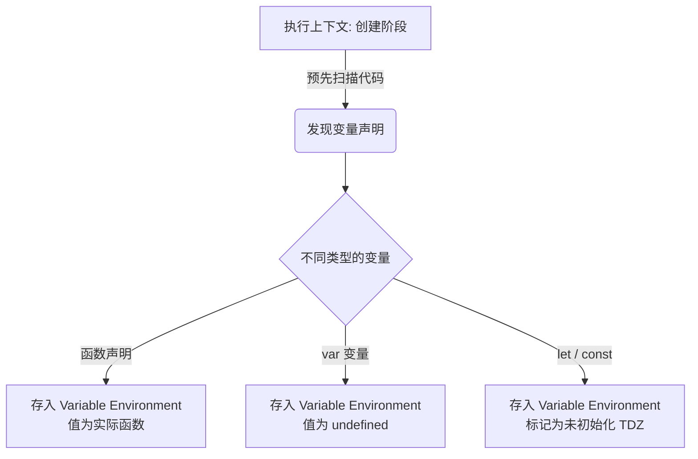
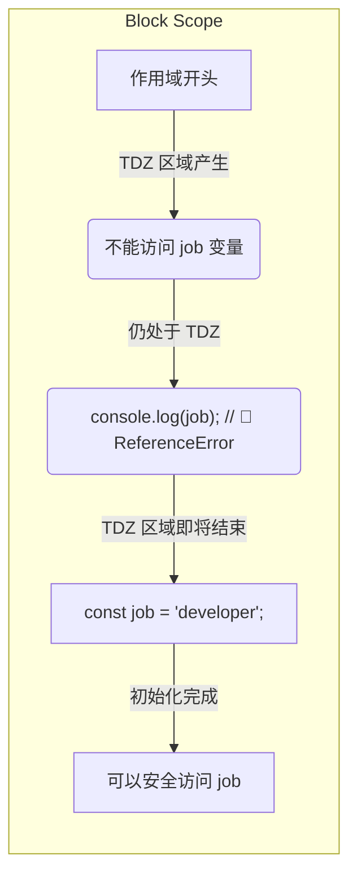

# Variable Environment, Hoisting and The TDZ

> 📺 来源：008 Variable Environment Hoisting and The TDZ.en.srt
> 📂 章节：第 08 章

## 📌 知识脉络
- **前置知识**：执行上下文（Execution Context）、作用域链（Scope Chain）
- **后续扩展**：This 关键字运作机制、闭包（Closures）深入解析

## 🎯 概述
本节深入探讨了 JavaScript 引擎在执行代码前如何扫描并存储变量（Hoisting），详细解析了不同声明方式（`var`, `let`, `const`, 函数）的提升规则，以及为何现代 JavaScript 引入了暂时性死区（Temporal Dead Zone, TDZ）来避免历史遗留问题。

## 核心知识点

### 1. 变量提升（Hoisting）的底层真相
> 🧩 **生活类比**：就像是一场新闻发布会（代码执行），在正式开始前，记者们（JavaScript 引擎）会先拿到一份嘉宾名单（进行代码初始扫描）。他们事先知道了哪些嘉宾（变量）会出场，甚至有些嘉宾的发言内容（函数声明）都已经提前印发给他们了。

表面上看，变量提升就像是代码中的变量被“魔法般地”移动到了它们所在作用域的最顶端；但实际上，**在执行上下文的“创建阶段（Creation Phase）”，JavaScript 引擎会预先扫描代码中所有的变量声明，并且将它们作为属性存入变量环境对象（Variable Environment Object）中。**这才是代码运行背后发生的底层机制。



---

### 2. 不同声明方式的 Hoisting 规则
JavaScript 处理各类型变量提升的机制是截然不同的，这也是其在初学者眼中充满奇怪行为（Weird Behavior）的原因。

**📊 概念对比（Hoisting 规则速查）：**

| 声明方式 | 是否被提升（Hoisted） | 初始值 | 作用域范畴 |
|---------|---------------------|--------|-------|
| `function` 函数声明 | ✅ 是 | **实际函数本身** | 块级作用域（严格模式下） |
| `var` 变量声明 | ✅ 是 | `undefined` | 函数作用域 |
| `let` 和 `const` 声明 | ❌ 否（技术上是，但处于 TDZ） | 未初始化 (`uninitialized`) | 块级作用域 |
| 函数表达式 / 箭头函数 | 取决于使用 `var`, `let` 还是 `const` | 取决于底层变量修饰符 | 取决于底层变量修饰符 |

> **💼 业务场景**：利用正常的 `function` 声明会被提升完整函数的特性，在编写复杂的互相递归调用（Mutual Recursion）业务时，我们可以把所有的纯函数实现在文档末尾定义，把顶部空间留给主业务调度！

---

### 3. 什么是暂时性死区（TDZ, Temporal Dead Zone）？
> 🧩 **生活类比**：犹如你预定了一套尚未建成的期房（变量已经被引擎探知）。虽然这套房子在系统里已经登记了你的名字，但在它建好交钥匙（代码运行到变量实际声明的哪一行）之前，你是绝对拿不到钥匙进去住的。如果你强行想要进入，就会触发物业的警报（报错）。

TDZ 指的是：在一个作用域中，从作用域开始的那一行一直延续到变量被具体显式声明的那一行之间。在这个死区内，我们无法访问目标变量。使用 `let` 和 `const` 声明的变量，在进入作用域时虽然被引擎感知了，但它们会停留在 TDZ 中，直到被正式初始化。



**🤔 为什么存在 TDZ？主要有两大原因：**
1. **更容易捕获 Bug 错误**：用 `var` 提前访问会得到假值 `undefined`，这可能让代码顺畅执行下去却产生离谱结果。TDZ 会直接抛出报错并阻断运行。
2. **保证 `const` 运转正常**：`const` 常量绝对不允许被重新赋值，如果它也像 `var` 一样先被赋值为 `undefined` 然后再赋真实值，就彻底违背了常量的初衷体系。

---

## 🛠️ 代码实战与真实场景

> **💼 业务场景**：我们在一个较大的遗留代码项目中进行维护操作时，可能会因为代码过于庞大而意外地在部分变量声明之前使用了它。不同修饰符会导致完全不同的防线反应：

```js {runnable} {title="hoisting_demo.js"}
// 🔍 1. 函数声明（可以正常调用）
console.log(addDecl(2, 3)); // 输出: 5

// 🔍 2. var 变量声明（值为 undefined）
console.log(me); // 输出: undefined
if (!me) {
    console.log("因为 undefined 是 falsy 值，这行业务代码被意外执行了！⚠️");
}

// 🔍 3. let 变量（触发 TDZ 报错，最安全）
// console.log(job); // 取消此行注释会触发 🚨 ReferenceError: Cannot access 'job' before initialization

var me = 'Jonas';
let job = 'teacher';
const year = 1991;

function addDecl(a, b) {
    return a + b;
}

// 🔍 4. 箭头函数与函数表达式
// console.log(addExpr(2, 3)); // 🚨 ReferenceError （受到 const 约束，处于 TDZ）
// console.log(addArrow(2, 3)); // 🚨 TypeError: addArrow is not a function (var 被提升为 undefined，即 undefined(2, 3))

const addExpr = function(a, b) {
    return a + b;
};

var addArrow = (a, b) => a + b;
```

**🔍 执行追踪：**
1. `addDecl` 函数：代码扫描期间完整提取内容到 Variable Environment 中。
2. `me` (`var`)：扫描时被放入环境变量，强行打上 `undefined` 印记。
3. `job`, `year`, `addExpr` (`let`/`const`)：扫描时识别到了标识符，但被推入 TDZ（标记未初始化）。
4. `addArrow` (`var`)：作为变量仅提取了标识符并标记为 `undefined`。它本质只被看做变量，而不是真正的代码体。

**📊 输入输出示例：**
| 取值行为 | 输出 / 表现结果 | 说明 |
|------|------|------|
| `addDecl()` | 正常计算出 5 | 函数声明被引擎全盘 Hoisting |
| 获取 `me` | `undefined` | var 被提前装载但没有赋予赋予后的值 |
| `addArrow()` | 报错 `TypeError` | 实质试图将 `undefined` 强行作为函数调用执行 |

## 💡 关键要点
- ✅ **变量提升（Hoisting）的本质**并非物理挪动任何代码行，而是在执行上下文的创建阶段引擎对不同声明进行预读取并分别安置在环境变量对象中。
- ✅ **`var` 会导致严重的逻辑缺陷**，因为它会以 `undefined` 状态被提升，进而带来极难寻找的边缘 Bug。这是现代研发坚决摒弃它的原因。
- ✅ **TDZ (暂时性死区)** 是从块作用域的最顶端发端，连续到 `let` / `const` 被显式声明那一行的区域限制，它是 ES6 故意制造的一套严苛自保体系。
- ✅ **任何形式的函数表达式和箭头函数**，只要它是绑定在变量身上，底层提升规矩统率服从它所使用的标识符声明规则（`var`, `let`, `const`）。

## ⚠️ 常见误区
- ⚠️ **误区 1：认为代码行被物理前移翻转到了文件顶部**。这是一种极为粗糙便于入门的设计借口，真正在作用域发酵的是内存调度阶段产生的提前收集错觉。
- ⚠️ **误区 2：以为箭头函数和标准函数在提升时没区别**。这是非常致命的错误。函数表达式不论是不是箭头形式，受约束的是最前面的前缀字眼，遇到 `var` 返回无定义，遇到 `const` 返回作用域死区爆炸。

## 🐛 报错实验室
> 熟悉引擎抱怨的信息机制，可以让我们迅速破除故障迷云

**❌ 错误写法 1：试图在 TDZ 内部挑衅常量**
```js
console.log(age); 
let age = 30;
```
**浏览器报错：**
```
ReferenceError: Cannot access 'age' before initialization
```
**🔑 解读**：这不叫 `age is not defined`！这句精妙的报错代表了引擎在告诉你：“伙计，我是知道未来会有 `age` 的，因为我早就扫描过了！但我严格恪守 TDZ 条例拦截了这次尚未经过初始化的调用！”

**❌ 错误写法 2：把 `var` 提升的函数表达式当成函数去调用**
```js
console.log(multiply(2, 2));
var multiply = function(a, b) { return a * b; };
```
**浏览器报错：**
```
TypeError: multiply is not a function
```
**🔑 解读**：`multiply` 由于是利用 `var` 打头阵的，在内存创建期它已经存在并被赋予了 `undefined` 这个占位符。但是对 `undefined` 使用 `()` 调用符号时，就会抛出极为尴尬且不是预期函数调用的 TypeError 破产错误。

---

## 📖 词汇速查表 (Cheat Sheet)
| 中文术语 | 英文术语 | 简明释义 | 速查代码 | 📚 官方文档 |
|---------|---------|---------|---------|-----------|
| 变量提升 | Hoisting | 变量及函数在代码运作前能被拉取访问的一种设计层现象 | `x = 5; var x;` | [MDN](https://developer.mozilla.org/zh-CN/docs/Glossary/Hoisting) |
| 暂时性死区 | Temporal Dead Zone (TDZ) | 从作用域之始到变量真实写入语句的一段保护真空地带 | `// TDZ区`<br>`let y;` | [MDN](https://developer.mozilla.org/zh-CN/docs/Web/JavaScript/Reference/Statements/let#%E6%9A%82%E6%97%B6%E6%80%A7%E6%AD%BB%E5%8C%BA) |
| 执行上下文 | Execution Context | JavaScript 解析脚本赖以生效的环境依赖全集 | （底层概念） | [MDN](https://developer.mozilla.org/zh-CN/docs/Web/JavaScript/Closures) |

---

## 🧪 学习验证

### 📝 动手练习

**练习 1：危险的 `var` —— 购物车数据消失之谜**
业务侧发现了一个致命漏洞，以下代码导致清空购物车的恶劣事件会在刚进页面就发生。
```js {runnable} {title="exercise1.js"}
// 在不调整结构排版的情况下，请分析为何此处所有购物车商品意外被清除了？
if (!numProducts) {
    deleteShoppingCart();
}

var numProducts = 10;

function deleteShoppingCart() {
    console.log("🚨 所有的商品被清空了！");
}
```
<details><summary>💡 参考答案</summary>

```js
// 解决方案：使用现代标准
const numProducts = 10;
```
**解题思路**：因为 `numProducts` 是被 `var` 初始声明，由于被魔法提升（Hoisted）且赋值为 `undefined`。紧接着在它上方的 `if (!numProducts)` 判断里由于 `undefined` 属于假象伪装（Falsy 值），取反感叹号后便成了绝对为真 `true`，导致 `deleteShoppingCart()` 被直接调用！如果我们将 `var` 改造成 `const` 就会引发立刻的 TDZ 报错，阻止这种不知不觉的深重灾难发生。
</details>

**练习 2：重构规则演练**
推测下面代码依次呈现的结果，以此检测你对提升规则熟稔程度。
```js {runnable} {title="exercise2.js"}
// 这 3 句打印控制台将会迎来什么？
console.log(greet()); 
console.log(sayHi());
console.log(farewell());

function greet() { return 'Hello'; }
var sayHi = function() { return 'Hi'; };
const farewell = () => 'Goodbye';
```

<details><summary>💡 参考答案</summary>

```js
// 预测结果：
// 1. console.log(greet()); 引擎成功打印 'Hello'
// 2. console.log(sayHi()); 崩出故障 TypeError: sayHi is not a function
// 3. console.log(farewell()); (假设强行通过2没断) 会弹出 ReferenceError
```
**解题思路**：
- `greet` 充当标准的 `function` 纯态声明，享有全功能的畅行权利。
- `sayHi` 是用老旧语法 `var` 勾勒的函数化石，只能被可怜巴巴提升为 `undefined`。
- `farewell` 是用现代骨架 `const` 打造，因此强硬地陷入 TDZ，坚决拒绝一切未成熟的提前索取越界动作。
</details>

### ❓ 理解检测

:::quiz {correct="C"}
**1. 关于 Temporal Dead Zone (TDZ)，以下哪一个理解是最准确的？**
- A) 代码书写中如果混用 function 和箭头，产生的合并作用域叫TDZ
- B) `let` 能够安全使用但需要经历一个先填充 `undefined` 再变回自身原形的 TDZ 区间
- C) 从作用域顶端直到 `let` / `const` 真正被分配值的中间部分被称为 TDZ，此处禁止进行任何数据访问
- D) `var` 创建的局部环境也产生极其巨大的 TDZ 所以不能使用

> **解析**：TDZ 主要是针对现代 `let` / `const` 创造的一种时间段保护网，任何尝试在实际声明前去访问该变量的动作在这个断层区间都会遭到阻截，这就是禁止访问保护区。
:::

:::quiz {correct="A"}
**2. JavaScript 创造者最初为什么要给这套语言设计一套提升逻辑（Hoisting）？**
- A) 主要目的是容许常规化“函数声明”能在使用前被唤起运行（支撑 Mutual Recursion 等编程需要）
- B) 为了大幅度加速 JavaScript 并发网络进程执行效率
- C) 为了让绝大部分复杂的 API 回调和对象能在开头暴露自身属性
- D) 因为老旧服务器硬性规定代码要通过顶层去调度解析

> **解析**：设计出这套逻辑最纯粹的目的就是为了那些底层的函数声名能不受限于书写顺序。不过随后也夹杂着一些并不算美好的副作用如对 `var` 的附带处理造成了后来各种开发者踩的坑。
:::

:::quiz {correct="C"}
**3. 下方代码究竟会爆发出哪种结果表现？**
```js
console.log(stranger);
var stranger = "Jonas";
```
- A) 抛出大红色报错语句 ReferenceError 无法读取
- B) 控制台会规规矩矩浮现出 "Jonas"
- C) 爆出 undefined
- D) 因为代码安全警告引擎直接拒绝执行跳过该句

> **解析**：尽管被提升提取上去看到了 `stranger` 这个标识符，然而真正蕴藏它的初始值只停留在这套逻辑附带的薄弱副产品 `undefined` 里，仅有抵达真正的赋值语句 `stranger = ...` 才会真正丰满。
:::

### 🔧 代码填空

:::fill-blank
因为过度滥用 `var` 经常引发难以察觉的代码臭虫（Bug），所以我们在现代 ECMA 开发规范中，强力建议你使用 `___let___` 或 `___const___` 来进行常量管理与变更；因为若有朝一日你在它们定义行所在上方进行强制拦截访问，会因正好落在具有威慑力的 ___TDZ___（填写: 暂时性死区缩写）内而直接在控制台中触发令人瞩目的 ReferenceError 报错以提早纠偏！
:::
