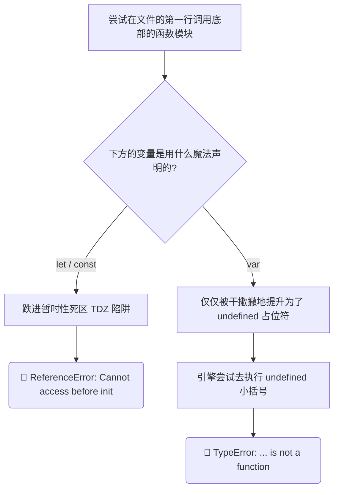

# Hoisting and TDZ in Practice

> 📺 来源：009 Hoisting and TDZ in Practice.en.srt
> 📂 章节：第 08 章

## 📌 知识脉络
- **前置知识**：变量提升理论（Hoisting）、暂时性死区（TDZ）、函数表达式与箭头函数
- **后续扩展**：全局对象（Global Object / window）、`this` 关键字运作机制

## 🎯 概述
本节课我们将通过真实的动手实战，直接观察不同类型的声明代码片段受到 Hoisting 与 TDZ 的影响结果。我们将重点拆解由于滥用 `var` 提升造成的“购物车误清空”业务级 Bug 惨案，并揭示 `var` 声明为何会悄无声息地污染强大的全局属性域 `window` 全局对象。

## 核心知识点

### 1. 不同函数形态的越级调用（实战观察）
> 🧩 **生活类比**：函数声明就像是拥有“最顶级优先通行证”的主管，任何时候都可以被随地呼叫执行。而用 `var` 或者 `let` 约束的匿名函数表达式就像随时找来的外包临时工，有极度严格的入场排队顺序要求。

如果在代码最顶部强制调用尚未定义的函数，系统表现会随声明方式而导致天翻地覆的差异：
- 调用**函数声明（Function Declaration）**：成功顺畅执行！因为连同大括号内在内的所有业务功能都被一起提前搬入 Variable Environment 环境变量里。
- 调用受到 `const`/`let` 约束的**函数表达式/箭头函数**：当场爆发 `ReferenceError` 拦截，因为它们此刻身处绝对禁忌的 TDZ 死区。
- 调用受到 `var` 约束的**函数表达式/箭头函数**：抛出迷惑性极强的 `TypeError`，这是由于 `var` 提供的是 `undefined` 的劣质身份，我们相当于在执行 `undefined()` 操作，对字符串发起括号行为当然会被判定“这不是一个标准函数”。



---

### 2. Best Practices 日常极客编码最佳实践
吸取前人无数在隐形 bug 中熬夜找错误的教训，现代 JavaScript 向我们输出了以下实战自保金科玉律用来终结 Hoisting 带来的副作用：
1. **彻底戒断 `var` 毒品**：编码首选代表契约永恒的 `const` 开展声明，如果是不得不随业务变化自增自减的变数才退两步去运用 `let`。
2. **遵守顶部大清单法则**：只为让脚本的架构看起来一览无余且高度可控，尽量在每个花括号块起始，明面上将一脉相承需要的用料（变量）陈列声明准备好。
3. **先定义后拿去潇洒使用**：请戒掉“随意散乱地拿着用、用到底部才想起写逻辑”的原始丛林习惯！纵然基础的函数声明可以放纵你乱来，也依然请力求把复杂的计算机制部署并罗列到那些调用行为所在的更上游之地，这样对同僚代码复查十分具有美德感。

---

### 3. 全局霸主 Window 与 `var` 的污染特权
> 🧩 **生活类比**：在浏览器环境下，`window` 系统对象就像矗立在小镇广场上一块永不挪走且大家都盯向这边的“巨大数字屏幕”。要是你用了 `var` 在镇长家后院贴条码，竟然会被超广角雷达摄录并同步强制直播在大屏顶部上（属性全城被监听挂载）。唯独 `let` 与 `const` 是高级加密私人信笺，绝不投屏惹众叛亲离。

`var` 的另外一处被诟病历史污点在于：单纯将你在脚本最外核抛出来的毫无保护机制的 `var` 参数，它在浏览器系统会自动同名异分身寄存在那个凌驾一切之上的 `window` 的骨架中！

**📊 概念对比（Window 对象属性侵入区别）：**

| 声明语法钥匙 | 是否直接暴力寄生全局 `window` 对象本身？ | 在 F12 控制台进行验证试验 |
|---------|---------------------|--------|
| `var` | ✅ **极度危险** (是) | `window.x === x` // true 获得确认！ |
| `let` | ❌ 不可能侵入渗透 | `window.y === y` // false 得到拒绝 |
| `const` | ❌ 不可能侵入渗透 | `window.z === z` // false 得到拒绝 |

> **💼 业务场景**：一旦你的业务工程没有经过严格封装控制并顺手在脚本扔出了一个叫做 `var alert = ...` 的参数，浏览器的内核弹窗报警法术将瞬息瘫痪丧生，这是无声无息的毁灭灾难！

---

## 🛠️ 代码实战与真实场景

> **💼 业务场景**：我们来观看一场举世瞩目的“购物车屠杀案”。此时有个新上任的工程师在电商网站写了如下判定机制：如果判断出的商品总数呈伪，它会好心地重启用户堆满财宝的购物中心。但他用了 `var` 来奠定其数值：

```js {runnable} {title="shopping_cart_bug.js"}
// 🚨 意料之外的惊吓：明明大促销日给用户的设定余额是高达 10 ！可页面一旦加载所有藏品不翼而飞。
if (!numProducts) {
    deleteShoppingCart();
}

var numProducts = 10;

function deleteShoppingCart() {
    console.log("🚨 刺耳警报响起：系统的库存商品已经被悉数清空覆灭！");
}
```

:::code-comparison
```js {title="🚨 初版的缺陷剧毒写法 (The Buggy Way)"}
if (!numProducts) { 
    // 大坑：底部的 numProducts 由于被 var 魔导师升起
    // 恰在此行，它徒有其名且化作了 undefined 假态
    // !undefined 取决强扭出了 === true -> 判断门卫直接放行！
    deleteShoppingCart(); 
}
var numProducts = 10; // 虽然在此定下了契约但回天乏术
```
```js {title="✨ 现代的安全护城河 (The Modern Way)"}
// 1. 理性第一：先将所需材料实打实敲下不可更改印记
const numProducts = 10;

// 2. 将检测卫兵部署于声明之后（假设你还是搞乱放到了这之上，TDZ 也会红牌报错阻止你将错就错）
if (!numProducts) { 
    deleteShoppingCart(); 
}
```
:::

**🔍 执行追踪：**
1. 引擎开工预调动，扫描文件。
2. 捕获 `deleteShoppingCart`，封存并整编全套代码操作进入预备池。
3. 发现 `var numProducts`，提拉上阵，但狠狠打下 `undefined` 的原始出厂印记。
4. 正式按代码文理阅读执行，路遇门禁逻辑口 `if (!numProducts)`。
5. 内存被询问，由于手中握着 `undefined`，取反符号感叹号发力，将毫无逻辑意义的不定值变成充满危险指令含义的 `true`！
6. `if` 之门轰然而开，危险大锤落下，一切满档结算尽毁。

**📊 输入输出示例（Bug 复现逻辑矩阵对照）：**
| `numProducts` 底部挂载方式 | 判定时刻变量化身的值 | 引擎真假转化 | 最终触发动作 |
|------|------|------|------|
| `var numProducts = 10` | 游魂态 `undefined` | 变成了强制真谛的 `true` | 🚨 清空商品事件大爆发 |
| `let numProducts = 10` | 系统警觉性 TDZ 锁死状态 | 直接掐腰中断 | 💥 抛出 `ReferenceError`，终止错误执行 |

## 💡 关键要点
- ✅ 看到任何把 `var` 提升的表达式拿来作调用导致的 `TypeError: ... is not a function` 极其经典，希望你今后秒回这是在于系统没办将 `undefined()` 的动作成功转换。
- ✅ **死死绑定 `let` 和终极信度 `const`，弃用 `var` 落后糟粕**，将 `!undefined` 即为逻辑真的奇诡地雷扫荡出你的战场中心！
- ✅ 对外只有一种特权就是 `var` 遗留下来的全局烙印现象：任何 `window.某某` 在控制台被点通，多数是它在作祟引发环境层变幻。
- ✅ 一个被尊重的开发者代码面板总是：先明面上宣告诸神的资源量，随后再进行各类函数魔术或高能结算判定组合。

## ⚠️ 常见误区
- ⚠️ **误区 1：只要使用了箭头小尾巴 `() => {}` 这种酷炫语法，就能随意打破时间死区，在脚本哪里都能畅通无助地任意引用运行**。并不是的，箭头归箭头那只是表现姿态，束缚其生存周期的还是最前方打头的 `var` 等。前缀不对或者用 `const` 阻碍，调用过早必然暴怒报错！
- ⚠️ **误区 2：使用了 `var` 遇到先调用的问题，只会让网页出 Bug 然而绝不会当着用户面卡死打爆程序**。天真的念头！把 `var` 给函数加身却先使出括号重击执行，一样换来红线大字阻击瘫痪代码（TypeError类型异常报错）。

## 🐛 报错实验室
> 前方雷达红灯闪动：一看到这句诊断黑匣子，立刻反射出背后的引擎逻辑。

**❌ 错误写法：不解风情地把虚象推上前线当作战力**
```js
console.log(processOrder(5));

var processOrder = function(qty) { 
    return qty * 10; 
};
```
**浏览器控制台报警大喊：**
```
TypeError: processOrder is not a function
```
**🔑 核心解读机制**：V8 引擎满腹经纶的提前知悉了有 `processOrder` 这么个人物列编队伍，可那仅仅停在 `var` 给它的一个可气标签页 `undefined` 这个位置，引擎执行不休地去硬着头皮敲下 `undefined(5)`？抱歉！既然这既不是内部封装体又不是官方 API，那就只有怒甩一张不识此类型的类型警告文书让你住手！

---

## 📖 词汇速查表 (Cheat Sheet)
| 中文术语 | 英文术语 | 简明释义 | 速查代码 | 📚 官方文档 |
|---------|---------|---------|---------|-----------|
| 类型硬性报错 | TypeError | 尝试用非适配目标来施展特殊指令的内部严谨警告 | `null()` / `undefined()` | [MDN](https://developer.mozilla.org/zh-CN/docs/Web/JavaScript/Reference/Global_Objects/TypeError) |
| 全局对象穹顶 | Global Object / Window | 网页端集大成的根茎控制模块，无情吞并外露 `var` 星座 | `console.log(window.xyz);` | [MDN](https://developer.mozilla.org/zh-CN/docs/Web/API/Window) |
| 最佳实践之道 | Best Practices | 无数先人们被坑得焦头烂额之后熬出的顶级避坑铁律指南 | `const maxLevel = 99;` | |

---

## 🧪 学习验证

### 📝 动手练习

**练习 1：全局污染指纹监测**
请在浏览器的终端中键入验证这段极具隐患的黑魔法代码，检验这三兄弟到底会不会被那无形的手录入名册呢？
```js {runnable} {title="exercise1.js"}
// 这是将变量投掷于文件顶层的操作
var superHero = "Superman";
let archVillain = "Joker";
const superPus = 99;

console.log(window.superHero === superHero);
console.log(window.archVillain === archVillain);
```
<details><summary>💡 参考答案剖析</summary>

```js
// 打印界面浮现的绝对实情：
// true
// false
```
**解题思路**：因为 `var` 带有天生的系统深度耦合性，在最外面它将变量完全暴力的打在了底子层 `window` 之中（成为其附属体）。因此 `window.superHero` 与本身的属性是一致并融汇贯通！不同的是 `let`/`const` 兄弟，在现代保护法下拒绝了这等屈辱的“抛头露面和附着”，`window.archVillain` 得出是 `undefined` 并完全与原数据无关联！
</details>

**练习 2：重写净化遗留糟粕工程**
你的上个外包团队丢给你了他们留下来能发工资却恶臭连连的代码，按照你刚刚学懂的上乘武功把下面逻辑排布为最干净的高手布局版！
```js {runnable} {title="exercise2.js"}
// 这里实在是一团糟的代码流转线，请优化这三句
showGreeting();

var memberCount = 3;

var showGreeting = () => {
   console.log("Welcome our core member #" + memberCount);
};
```

<details><summary>💡 参考答案剖析</summary>

```js
// 经顶级修缮梳理和安全强力提升方案应如右体现：
const memberCount = 3;

const showGreeting = () => {
   console.log("Welcome our core member #" + memberCount);
};

showGreeting();
```
**解题思路**：首先使用“扫盲工具”大刷子将一切隐形雷区触发点 `var` 彻底拔掉清除无迹，更新使用代表安全最高防御基座的 `const` 坐镇！随后秉承所有逻辑声明置放于穹顶之上的思想原则，最后才是真正的调用 `showGreeting()`，将所有的变量从容交递出来避免一切预调用的麻烦干扰，清爽且无懈可击！
</details>

### ❓ 理解检测

:::quiz {correct="D"}
**1. 关于酿造这起“清空购物车全盘重来”大翻车事故，最不可饶恕的关键核心底层逻辑漏洞在什么部分？**
- A) 代码书写本身毫无逻辑了因为 if 条件本来写的就不太对劲呀
- B) 是前端页面自身隐藏的浏览器自我回收机制搞的鬼
- C) 由于代码函数 deleteShoppingCart 抢风头提前挤上导致未定义运行过快出结果
- D) `var` 使参数在判定时刻处在了隐匿身形的 `undefined` 状态，并且这正是个 Falsy，`!undefined` 直接推波助澜得出 `true` 的导火索

> **解析**：完全归咎于早期设计里的 Hoisted 容忍性，在真正的语句没落地前强行将其用在 if 开关判断之上，这种不可预估的假性虚值经过一个感叹号判定就被直接篡改成确凿事实，顺利打开破口进入执行门内酿下错误！
:::

:::quiz {correct="C"}
**2. 为什么提前去强行剥削调用一个被 `var` 捆绑封装的函数表达式时报出的故障不属于“查无此人”的引用报错（ReferenceError）？**
- A) 我们打字打歪了系统查不到匹配的识别名称
- B) 因为箭头不归其管，这是 `var` 无能为力的现象所以归属别的类别
- C) 这个时刻引擎确实扫描到存在这个身形被拉升上来了并且赐予了 `undefined`，所以引擎只会抓急：你让我执行 `undefined` 这个非函数体完全超出它理解，所以属于分类判定失败的类型错误（TypeError）！
- D) 这属于系统尚未识别完全出现的异步迟效

> **解析**：它不再由于深处死区而遭到无法逾越封堵圈（不会 ReferenceError）。取而代之的是执行到了不该发生的数据重构动作——给非函数的体质带上括号企图将其执行运行，这是由于类型属性完全牛头不对马嘴产生的严正类型抗拒！
:::

:::quiz {correct="A"}
**3. 下方阐释中关于掌握掌控最高权力的 window 全局对象来说唯一绝对正确的一条是什么呢？**
- A) 任何未加保护直接用 `var` 打造变量的行为都会无私的在系统顶级枢纽 `window` 当中强制追加产生一个与你变量名吻合的可用节点树属性。
- B) 这属于传说黑盒，必须有高端环境 Node 才能解锁它
- C) 不要听人忽悠，不管是谁用了 `let` 或者 `var` 一样会无差别进行挂载记录没任何差距的
- D) 它根本没什么了不起只要不用到就不存在！

> **解析**：不管何时如果你在页面的非封装直接全局层面写入了 `var name` ，你几乎就是正在下着一盘最危险的棋对全局原装属性（比如 window.name 浏览器专属视窗）发起不可挽回的覆盖覆盖攻坚破坏战！这种连携挂网记录是极其要命的东西。
:::

### 🔧 代码填空

:::fill-blank
为了在企业级的重型维护项目中不会因为奇奇怪怪莫名的变量引发全军覆没大漏洞，我们再建立模型和业务代码流时必需使用新时代的防滚架——安全修饰符 `___const___` 或者应对变数需求偶尔运用 `___let___`！绝对需要立刻舍弃从前那不讲武德总是搞出不可预料破坏的 `___var___` 传统保留写法！将一切规整地排布在最最前面的顶部才是优秀的程序员基本涵养。
:::
