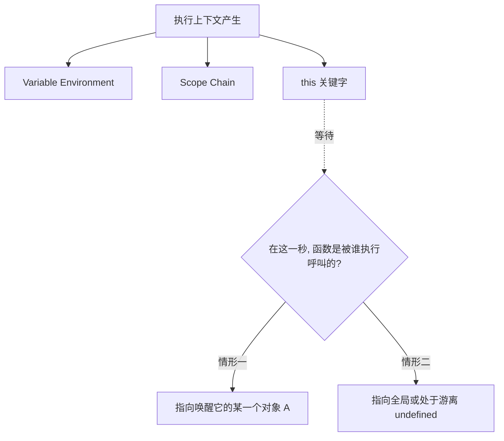

# The `this` Keyword

> 📺 来源：010 The this Keyword.en.srt
> 📂 章节：第 08 章

## 📌 知识脉络
- **前置知识**：执行上下文（Execution Context）、作用域链（Scope Chain）
- **后续扩展**：对象的 `call` / `apply` / `bind` 方法、面向对象编程（OOP）核心概念

## 🎯 概述
本节我们将深入剖析令无数初学者头疼的 `this` 关键字。`this` 是每个执行上下文三大核心要素之一。本章重塑你对它的认知模型：突破静态思维，牢记 `this` 的取值指向**完全取决于函数在运行时是以何种方式被调用的。**

## 核心知识点

### 1. `this` 关键字的核心本质不固定论
> 🧩 **生活类比**：`this` 就像日常交流里的中性代词“我”。如果讲师站在讲台上说“我很开心”，这里的“我”代表讲师；如果是台下的学员说“我也听懂了”，这里的“我”自然无缝切换成了这名学员。究竟“我”（`this`）是指谁，不取决于“我”这个字写在哪里，而是完全取决于**是谁在这个当下开的口发出的声音（发起了调用）**。

在 JavaScript 执行上下文（Execution Context）建立的时刻，会诞生三个核心部件：变量环境、作用域链以及特殊的 `this` 变量。
**它通常被设置指向当前使用该函数的“所有权人（Owner）”。**
**🚨 绝对定律**：`this` 的值永远不是一成不变的（不是静态固定的），并且它只存在于引擎真正将这段函数送去**执行、调用**的那千钧一发之际才被动态结算出来。



---

### 2. 决定 `this` 命运走向的归属法则
不要指望穷举瞎猜，请直接用下方这 4 种函数调用的法则矩阵进行框定判别。它是破解日常 95% 以上困惑迷雾的杀手锏。

**📊 规则速查矩阵：**

| 你的函数触发模式 | 触发语句长啥样 | 底层 `this` 最终指向判定 | 特征备注 |
|---------|---------|---------------------|---------|
| **作为对象方法调用 (Method)** | `jonas.calcAge()` | 调用方法的这个**对象本体**（如 `jonas`） | 这是符合正常人类思维主属关系的体现 |
| **作为纯粹普通函数调用 (Simple Function)** | `calcAge()` | `undefined` （严苛严格模式下） | 如果你敢不开启严格模式，引擎会放纵它直接指向超级外核的全局 `window` 对象 |
| **作为箭头函数调用 (Arrow Function)** | `const f = () => {}` | 直接霸占**上一层的（外层父级作用域）** `this` | 学名叫做词法级 `this`（Lexical this），它本质上**根本没有**构建属于自己的 `this` |
| **作为交互事件监听器触发 (Event Listener)** | `btn.addEventListener(...)` | 当前触发了该操作钩子事件的 **HTML DOM 元素**本身 | 开发前台 UI 控制中最贴向常规逻辑的特例 |

> **💼 业务场景**：日常用 React 等现代脚手架框架编写表单提交事件时，常常要在里层业务处理中用最新的数据渲染界面对象。若是一不小心由于内部回调写错弄丢了 `this` 指引，那么整个 UI 更新的数据管道便会被瞬间折断。

---

### 3. 被诟并极多的常见两宗错误观念
无数踩着坑成长起来的半吊子依旧弄不清楚的点必须在此澄清：
- ❌ **谬误一：`this` 一定是指向并能够取到这个底层函数自我的**。大错特错！坚决不可以去用 `this.something` 在函数内企图控制该函数上的附加定义属性，因为函数绝不会认 `this` 是自己身体的延展。
- ❌ **谬误二：`this` 会取到当前这段代码的变量环境（V.E）。** 更加离谱的错误联想。它仅仅是独立在执行上下文层级内部的某一个三元组件之一，绝不能等于囊括当前局部变数库的那一座城池环境！

---

## 🛠️ 代码实战与真实场景

> **💼 业务场景**：假想我们正在一套雇员人事考核系统中搭建岁数计算体系。为了不将雇员名姓写死，我们试图提取一种方法让每一个雇员能自主结算。

```js {runnable} {title="this_pointer.js"}
// 💡 全局第一条命脉：所有的正规代码强制打上引擎严苛纪律规矩
'use strict';

// 场景 1：最正统的 Method 发动调校
const jonas = {
    name: 'Jonas',
    year: 1989,
    calcAge: function() {
        console.log("方法内部捕捉到的确切 this 原型:", this);
        // this.year 会在这里被极高明地无缝切替转化回 jonas.year 的数字
        return 2037 - this.year; 
    }
};

jonas.calcAge(); 

// 场景 2：剥离了依附的普通散兵函数使用
const simpleFunction = function() {
    console.log("散兵平民函数被抓取到的 this:", this);
}
simpleFunction(); // 由于严苛约束下它是被无依无靠唤醒的，所以只能落得个 undefined 下场

// 场景 3：运用箭头函数
const arrowFunction = () => {
    // 箭头自己是个透明囊，它没有自我生成 this 之机能。遇到呼叫便像扫描雷达一样往外部全局扫描
    // 然后捕获到了全局最为至高无上的权力容器 —— window
    console.log("穿透到母体的箭头 this :", this);
}
arrowFunction();
```

**🔍 执行追踪：**
1. 引擎执行推演至 `jonas.calcAge()`。由于前端有显目的主发号者点号（`.jonas`），这告诉编译器：将里面 `this` 关键字全部实权变身为 `jonas` 数据集自身！
2. 引擎执行抵近 `simpleFunction()`。周围空无一物没有引领前缀，引擎宣判：一个光杆司令而已，加上现在在开启保护阀的 `strict mode`，该函数的该处 `this` 注定贬值为未定值 `undefined`。
3. 引擎抵达 `arrowFunction()`。引擎探测到 `() => {}` 这套简写架构。当即宣布本层不分配任何 `this` 的寄存池！所以执行流透过内部透明结构往外部顶空全局望去，抓下外部本就具备的基础默认物 `window`。

**📊 输入输出示例：**
| 取值行为 | 暴露给外界的表现结论 | 推论分析说明 |
|------|------|------|
| 发条对象：`jonas.calcAge()` | 获取到了整套的对象信息 `{name: "Jonas", year: 1989...}` | `this` 忠尽耿直跟随点左边的东家走！ |
| 游兵行为：`simpleFunction()` | 结果残暴的打印 `undefined` | 严格模式遏止它肆无忌惮地夺取最强全局环境 |
| 穿透寻找：`arrowFunction()` | 它取得了高高在上的 `Window {...}` 对象包裹 | 这是词法继承上游长辈带来的特例 |

## 💡 关键要点
- ✅ 全面放弃看函数是被书写在哪里的静观逻辑！将目光聚集死锁在该函数是如何被**正式开启调度的语法操作上**。
- ✅ 养成良好的自我防重火力习惯：首行置放 `'use strict'` 这套结界符可以扼杀无数诸如同名单刀抢先越界访问污染等无稽隐形灾害。
- ✅ 核心心法熟记胸腔：**所有箭头函数（Arrow Function）天生是被阉割掉自创 `this` 权柄的存在！** 它是靠词法作用域顺手白嫖（抓取）它所在位置长辈代码的现成指代的机制（称之为 Lexical this）。

## ⚠️ 常见误区
- ⚠️ **误区 1：在写了普通逻辑代码里尝试用 `this.value = xxx` 试图自己去创立储存属性**。如果在普通裸调用的前提由于底层已被镇压锁定为 `undefined`（通过使用严格模式时），这个时候对未定义进行 `.` 操作符扩展将会产生惨烈报错崩溃。
- ⚠️ **误区 2：在对象的正常组件书写里为了贪图一时敲击快感去用箭头函数去充当动作实体 `run: () => { console.log(this.name) }`**。既然你用的是缺少自我容器的箭头，代码便会由于眼冒金星找不到这个原本应属对象的层级，而瞎飞往虚无的上一级宇宙环境并取出一个没有名字和记录的幽灵去给你反馈！

## 🐛 报错实验室
> 我们通过一次错误的调用妄想症来激怒防御系统的报错

**❌ 错误写法：不讲规矩便去越权抓数据存储**
```js
'use strict';
const calcSquare = function() {
    this.result = 10 * 10;
};
// 没任何前缀地调它来试下
calcSquare();
```
**浏览器深红字体暴怒阻截：**
```
TypeError: Cannot set properties of undefined (setting 'result')
```
**🔑 解读**：首先这叫裸身平民化调度也就是 `calcSquare()`；其次本系统被你前置打入了 `use strict` 纪律法则约束！结果就是该环境下的 `this` 原地消失变回了最单纯不过的 `undefined` 空洞。紧接着偏偏代码妄图对绝对空洞要求存放名为 `.result` 的赋值塞入行为！引擎唯有暴怒打断这等严重无逻辑的命令传导。

---

## 📖 词汇速查表 (Cheat Sheet)
| 中文术语 | 英文术语 | 简明释义 | 速查代码 | 📚 官方文档 |
|---------|---------|---------|---------|-----------|
| `this` 特殊词 | this keyword | 依据发号施令方才被绑定确认在代码运作前能被赋予特殊身份权限的指针 | `console.log(this)` | [MDN](https://developer.mozilla.org/zh-CN/docs/Web/JavaScript/Reference/Operators/this) |
| 词法绑定特性 | Lexical this | 也就是俗称拼爹找爸爸机制。它取决于包裹你的原定位置周围的环境给予而不是当前者赋予 | `const fn = () => this` | [MDN](https://developer.mozilla.org/zh-CN/docs/Web/JavaScript/Reference/Functions/Arrow_functions) |
| 方法持有者 / 发起操作者 | Owner / Caller | 它指的是打在那个调起的英文点符号（`.`）的左手边的那一股势力归属哪方 | `gameRole.attack()` | |

---

## 🧪 学习验证

### 📝 动手练习

**练习 1：追踪幕后的掌控者**
不用运行请根据理解的规律去口述推理。猜测下面的两次车体模拟行驶记录出来会印上不同的哪个标牌么？为什么？
```js {runnable} {title="exercise1.js"}
const car1 = {
    brand: 'BMW',
    drive: function() {
        console.log(this.brand);
    }
};

const car2 = {
    brand: 'Audi'
};

// 粗暴的手法：我们原样摘下 car1 的发动器装在 car2 身上
car2.drive = car1.drive;

// 开出这两辆车兜一圈瞧瞧
car1.drive();
car2.drive();
```
<details><summary>💡 参考答案</summary>

```js
// 输出的两条记录板为：
// BMW
// Audi
```
**解题思路**：这段代码就是展现这种绝妙神奇之处的最佳实机试验。这充分解释明白了什么叫做“不跟代码字面定死锁死”。 `car1.drive()` 时 `this` 对接的是 `car1`。到了另一头通过窃取技能挂载至 `car2.drive()`，此时此刻按下点拨驱动的人成了 `car2`！那么这个代码库核心运行的身份就会动态幻变转为 Audi 。
</details>

**练习 2：修改破裂不能识别主人的废品按钮**
界面设计师发现下面这套由临时工搭的脚本想要通过点击得知按键名称的意图已破灭崩溃拿不到预期标签的答复。把它修补好吧。
```js
// 渲染给用户见面的 <button> 点我试试 </button>
const button = document.querySelector('button');

button.addEventListener('click', () => {
    console.log("你刚才大力戳下了:", this.tagName);
});
```

<details><summary>💡 参考答案</summary>

```js
// 切不可偷懒，唯有把它拉回到经典沉淀长形的传统 function {} 里接受正反馈
button.addEventListener('click', function() {
    console.log("你刚才大力戳下了:", this.tagName);
});
```
**解题思路**：之所以破裂这根本原因是把带透明穿插能力的箭头操作符挂载成了按钮回调，于是它的底线直落到窗体界线。然而监听事件里的法则定明唯独正宗使用原始版面的 `function() {}` 书写体系，才会使得底层的系统把当时产生风暴的那枚被敲开 `HTML 元素节点（DOM）`，恭恭敬敬地送进大块核心并将其指派赋值给内部特派生生不绝的 `this` 之中！
</details>

### ❓ 理解检测

:::quiz {correct="D"}
**1. 拿捏这个名为 `this` 变量脾气的核心终极秘法应该看什么？**
- A) 我们打字打歪在第一行就在第一行的意思
- B) 是个随时能把所有本地内存调上去取来所用的库总装
- C) 这个属性是被引擎分配死的不可有两全之路的绝对体
- D) 这个关键字极具变动属性，不按下括号的启动键它仅仅是一具空壳毫无方向。一旦启动，那发出的那一秒是谁推它的它指代的就是谁的特权身份

> **解析**：`this` is not static. 不要费心去思考其包裹在哪里定在哪儿，只要聚焦它是靠怎样的组合拳被打出来开跑执行的瞬间就行了，它的命运就此落定。
:::

:::quiz {correct="B"}
**2. 为什么在现代的工程规范提倡里都必须为每一个干净的代码开辟开启绝对强制的“严格模式“（用字眼去开启）？**
- A) 为防止浏览器不能向下容忍旧系统的加载从而开启高级编译
- B) 让一个由于散落在天地间的无所属调用散头函数内的 `this`（原本指引全局窗外超级对象的大灾变），乖乖强迫变成了不危及任何主属体系的 `undefined`
- C) 只为解决箭头函数容易引起内存溢满的 bug
- D) 让 `console.log` 的排布看着更加规整的显示法强加手段

> **解析**：如果不对其不加防范这让其毫无顾忌直接取得那主宰生杀大权的全知超级对象那是难以估量的。严格的铁律就一棒子敲回了本源无色值 `undefined`，断了它祸害苍穹的根。
:::

:::quiz {correct="C"}
**3. 箭头函数自身最鲜明且别具一格的本命特质属于下列何种呈现？**
- A) 有着跟正规体系对着干的指向规矩法纪且能无阻力取参数
- B) 被创立出来就不容更改绝不能和别的组件发生嵌套串通的行为约束机制
- C) 它极尽其所能地剥落了外在虚伪包袱：自身没有、也不产生所谓的 `this` 基因库。这使得它就象一只通天管那般直接倒吸去取借宿的“父亲大人环境”原原本本流传下来的那套底色当作这行当的使用权力牌
- D) 必定会突破所有的物理限界，自动对准最广的 window 去操作它那一切变量

> **解析**：因学术派讲究的特殊设定 "Lexical this" 所制衡。正因为连生成独立这套代码组件权利都没被引擎通过赋予给它，因此它的指引和外界完全交递共享使用着一个！
:::

### 🔧 代码填空

:::fill-blank
务必谨记且刻在灵魂里：把 `this` 从不看成某种不朽而顽固凝固如斯的静物。当脚本运转属于作为隶属点缀被提取驱动运行的 `___方法___`（Method 取名法）形式时它完全倒退指向呼叫执行本职业务的特使对象；要是属于界面交互如单击回车激发的 `___事件监听器___`（或者更懂行可填 Event Listener）操作时，它无缝倒回对准那一发 HTML 操作实体；可是你倒霉只是一介纯素且不加前修饰的无倚无靠自由放纵函数的话，在严格的铁手凝视法条制裁下的最终发配必然会被判做一团迷雾空洞体：那就是什么也没有的 `___undefined___`。
:::
