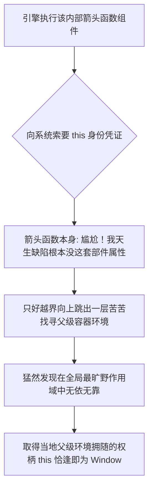

# The `this` Keyword in Practice

> 📺 来源：011 The this Keyword in Practice.en.srt
> 📂 章节：第 08 章

## 📌 知识脉络
- **前置知识**：`this` 关键字四大铁律、执行上下文结构、对象方法调用
- **后续扩展**：普通函数与箭头函数的深度对比、DOM 交互 Event Listeners 里的回调函数运用

## 🎯 概述
本节课通过一系列硬核的控制台代码实战，向你直观证明上节课讲授的 `this` 动态指向理论。我们将观察 `this` 在箭头函数中的词法穿透显影现象，掌握高自由度的“方法借用（Method Borrowing）”技术，并亲手制造一层层剥离依附对象后导致的 `this` 彻底丢失之报错惨案。

## 核心知识点

### 1. 箭头函数中的 Lexical this（词法 this 特性）
> 🧩 **生活类比**：箭头函数就像是一个没有自带身份证明的小孩。当保安（JS引擎）例行盘问他“你是谁（即你的 `this` 究竟是什么）”时，他因无凭无据答不上来，只能转过头指着站在他旁边包裹着他的监护人家长（外层父级作用域）说：“你去问查我老爸的身份吧！”

如果你在没有任何外层函数的全局最空旷作用域下定义了一个箭头函数，并在其中打印观测 `this`，这回你拿到的是高高在上的巨大 `window` 对象。请一定注意这**绝不是**意味着箭头函数天生指代全局它就有特权，而是因为它在自己肚子里**根本没有繁育出属于自己的那套独立的 `this`**，它只能通过作用域链一层层往家门外（Lexical Scope）找长辈借，偏巧最顶层的作用域拿下来正好撞见长辈全局自带的就是那套 `window` 而已。



---

### 2. 揭秘方法调用时的真正自我从属
我们在写着名叫 `jonas` 数据集里安置了一套动作函数 `calcAge: function() { ... }`。在这里使用带指针的 `this.year` 去做加减，远比死板木讷地强写 `jonas.year` 具备强大的长远利益优势，而这也正是大厂代码最佳实践的核心倡导。
**究竟为什么非得用它？**
假如有朝一日模块重构，我们将包裹在外一层的 `jonas` 身份统统更换抹杀，写死的代码便会全部暴毙崩溃连不到属性；而搭载了 `this` 的逻辑是极为清醒灵巧的，它只问：当前是谁在前边儿发动手脚（`.`）点我，我这副逻辑就化身代入为谁内部的数据！

---

### 3. 高阶进阶技巧：方法借用 (Method Borrowing)
> 🧩 **生活类比**：这套逻辑神似在草坪借用隔壁老旧邻居家的豪华除草机器。虽然除草机（运算方法代码本身）是邻居家出金购买并且死死挂在邻居家的仓库表里（写在他对象的属性名册中），但既然现在是我厚着脸皮找他借过来并插在属于我的另一片庭院草皮上通电推起它（按键发号施令的是我本身），这台机器飞快剿灭切除掉的当然是我自家院子里的杂草（`this` 立刻当场倒戈指向了我）。

这是当场验证“`this` 不属于被硬生生物理编排在那个角落死位置上，而是唯令是从只属于当前被执行调用的操作发起指挥者”这条宇宙级真理最绝妙的活体证据。因为普通函数在 JavaScript 中只是普通的可传输介质值（Value），我们可以将一个极度繁琐的系统对象的运算方法当做积木般复制粘贴挂靠到另一个空空如也的对象属性里，马上看看它里面的 `this` 是否依然倒戈向着新的寄生主人。

**📊 数据与属性的转移对比：**

| 执行调度控制语句 | 内部内存实际发生了怎样变迁 | 底层的核弹指示标 `this` 最后听谁的 |
|---------|---------------------|--------|
| `matilda.calcAge = jonas.calcAge;` | 完完全全仅仅是机械地誊抄复制移交了那份方法的代码内存指针图纸给新主子对象而已 | **尚无主人归属感**，压根还没有唤醒它去跑任务 |
| `matilda.calcAge();` | 按下了按钮，真正地接通了电力拉起了函数去火爆进行运算 | 毫无骨气坚决**听命于新供水大主 `matilda` 的这方水土！**精准调取了她内部数据的年龄 |
| `const freeAgent = jonas.calcAge;` | 工具彻底被扯裂所有对象锁链联系，成为了不受制裁的散兵游勇单干独立变量体 | 仍尚无归属主人，静止待发状态 |
| `freeAgent();` | 处于极具严苛法纪保护模式下做了一层毫无靠谱老版主撑腰庇护的无主单发性激活调用 | `undefined` 直接剥除权利判了死刑，并大举抛下严重崩溃乱象爆报错终止代码 |

> **💼 业务场景**：在开发大世界游戏内众多形色人物的不同交战计算模块时段，我们只需挑拣最高神邸的那个位置写下一套令人发指的极其复合计算量的“受到真实击破血量暴击清算代码体法则”，随之只要经由一次性引用挂链，全部借用给万千种路边的杂兵魔兽配置属性（方法借用技术）。这套绝技保证让世界上随便任何一只哪怕是最微小的不起眼怪物都在被砍劈之后，完美依照只属于自己躯壳体内的那一丝脆弱不堪的抗击护甲防御数据来精准丝滑地狂飙失血数字！此举瞬间砍尽大量千篇一律的赘肉逻辑运算体复制动作。

---

## 🛠️ 代码实战与真实场景

> **💼 业务场景**：这套代码展示我们手上已拥有高贵的男主原始信息全套组合装集，而恰巧碰头了极度可怜缺乏功能的配角女孩。动用神奇法门让贫穷配角干脆白嫖男神工具函数的这出高戏怎么上演呢。

```js {runnable} {title="method_borrowing_magic.js"}
'use strict';

const jonas = {
    firstName: 'Jonas',
    year: 1991,
    calcAge: function() {
        console.log("这股内部代码现在从属的主人：", this);
        return 2037 - this.year;
    }
};

const matilda = {
    firstName: 'Matilda',
    year: 2017
};

// 🔍 1. 男主毫无波澜的原汁原味调动执行
console.log("Jonas 的真实骨灰年龄推算:", jonas.calcAge()); 

// 🔍 2. 霸气的方法白嫖大招 (Method Borrowing)
matilda.calcAge = jonas.calcAge;

// 此时点燃启动键发下命令的人乃是 Matilda 这号角色！因此里面的核心 this 就是指着 Matilda 本体数据全貌
console.log("Matilda 凭借挪用法计算出自己的光速年龄:", matilda.calcAge()); 

// 🔍 3. 活活遭受扯脱躯壳对象附着物的散兵调用下作死行为
const lonelyFunction = jonas.calcAge;
// (大胆者可以直接移除下面封印的注释符看看控制端红线遍地哀鸣遍野不可开交的血腥惨变)
// console.log(lonelyFunction); // 先瞧瞧它：徒剩下一段空虚独立没头脑的代码骨架逻辑片段罢了
// lonelyFunction(); // 🚨 底层发出类型强阻错误报盘！
```

**🔍 执行追踪：**
1. 引擎执行 `matilda.calcAge = jonas.calcAge;`。因为常规书写的函数在无尽的 JS 国度底层本就是如假包换享尽恩赐特权的第一公民属性（就是能像基础小数字字符串般毫无排斥地被四处流转赋值接力抛下），故此它这局这仅仅充当了那无情挪走复制一套图纸步骤。
2. 满载代码再次引擎狂奔向下到了 `matilda.calcAge()`。谁去碰了它的触发逆鳞？那自然左边的那个点号发令人—— `matilda` 。随着主子这声令下引擎果敢大笔疾书篡改了一通，用暴君姿态将底层内含有该字眼的内脏统领核心 `this` 一把顶死切替变为 `matilda` 的实质全躯体。继而那可贵的语句 `this.year` 就毫不费力拿走了藏在最底层的数号 `2017` ！
3. 此景跳远点再瞧那 `f = jonas.calcAge` 指挥棒一落。咱们粗暴野鸡地顺手将其核心一套运转剥皮抽骨拖出了原来庇荫安逸的对象保护家区，化身没有依傍的可悲孤独游魂单干兵指令组。
4. 随后对它下狠手的引雷触发 `f()`。到底那是谁点的将？由于左前端空荡荡无物依附没半个大角色撑腰点缀。面对极其注重端容仪纪律且正在监工环境执行的严格严打系统审查面前被无情断论：绝不许给予这些四海流亡讨水喝的乱窜叫花子挂载赏收那些庞大根系 `window` 发配金条。没依附的就统统贬做连鬼都不如的真虚无空位标识 `undefined` 虚像。然后由于代码原本就是顺着老家去强搜带有 `this.year` 读取动作企向，好嘛！这下变成了要生硬地自虚实不明的废界产物上用 `undefined.year` 在深渊搜挂找钱了？这也是它这整盘棋盘大崩溃引线导火索被炸起的根基灾变祸根处。

**📊 输入输出示例（剖解原理直录对峙表）：**
| 执行呼唤命令打出动作 | 开发控制台上浮出的内容字眼 | 背后底层骨架级奥秘解析切入说明 |
|------|------|------|
| `jonas.calcAge()` | 返回一大坨 `{firstName: "Jonas", year: ...}`，后跟随数额定论 46 岁 | 由于 `.` 的这处连接触发点左前锋位置安坐着那大活人 Jonas，万物自然如水般顺滑完美配对无碍 |
| `matilda.calcAge()` | 浮出 `{firstName: "Matilda", year: ...}`，计算推算为仅仅 20 岁月 | 一手叹服人智的极致炫技法术 method borrowing，将最变动灵活不死抠代码块静态规矩的 `this` 引去为所欲为当头棒喝物尽其用 |
| `lnelyFunction()` | 直截断句爆响 `Cannot read property 'year' of undefined` | 这些被活拔出圈四面离散出去又得不到任何一个门派领地保护收纳就妄想干活乱开张发功施咒的脱群底层普通流浪操作指令（被开上封锁链用上了严管严格环境机制的绝望之地情况时只能遭没收身份上下文而覆命死亡） |

## 💡 关键要点
- ✅ 在一栋自己封死结构闭合严密的大型对象运算结构的方法编写区域如果胆敢贪巧图懒不去用灵活自如随时易容变妆顶替数据的 `this.xxx` 而是冥顽固旧全用死局敲定的僵硬变量如 `对象本名.xxx` 来写逻辑的话；那将是最烂不可逆无眼界短寸光目无尊颜。那是背道逆驰那套奉成圭皋干干净净 DRY 行业规范的大重罪！因为装配万能组件这把万能插头 `this` 是极为通灵聪慧的东西即便周遭世事改弦更张（哪怕顶配本主变量被整个彻底除籍去名改掉大换脸等），由于底层指代的跟班死律它这块螺丝照常如脱缰猛虎马力全开跑得比原来更流线！
- ✅ **神鬼挪用技艺方法借用（Method Borrowing）**之所以能在圈内成为通杀各大江湖各大应用组件互插拔能立稳行云流水立足脚的大底气而且极其被仰赖敬仰；这也刚好全仰仗依附那极其深邃善变毫无主次固定的所谓变幻指针法则。这句真谛它仅仅顺带盲从于这一当前那一记扣动指令的发令左前端最高阶发配首长所发号者的当前体态本身。
- ✅ 函数这家伙就仿佛墙头草绝不存在跨生代认主这一根死筋说！不要在前面给它加上依附主环境修饰词任由拔除出体的这种普通常人体流光独单执行变量是没有门面的也没有宏伟的靠山靠板提供给下沉内部的环境依赖上下文背景供求了。任由这种被抽空本该读配自身归属内在依附环境数据的命令在全片开着护航警告的代码跑去执行必会带来尸横遍野全局系统毁灭级灾变！

## ⚠️ 常见误区
- ⚠️ **误区 1：狂热地认作所有使用箭头构造出来简写花架子的功能全具有那逆天“能有自我魔幻引路针 `this` 存在于天际！”**。请马上掐断停滞这个自满思想醒醒吧，一再申声明它并不是这套高深的魔术造物产主源，最残忍真现不过就是它本体打受精形成那刻起就彻底抛弃这等自蕴这等东西的孕育发育了！于是极其可怜的只剩下拼爹这招往包裹自己的外部深沉包囊的孕父囊袋（所谓的只去找父阶作用域去乞讨来充能借用这就是它唯一的词法继承路子了 Lexical 层面借取手段），那是上一级施舍它的不是自身创造长出的！
- ⚠️ **误区 2：觉得使用了方法大借去别处嫁接这种骚动作是会篡权夺位破坏伤到底层原生造主对象数据的。** 放一百个心那 `matilda.calcAge = jonas.calcAge` 哪怕转手了千亿次都没有伤过剥削过初始根对象 Jonas 的原图半截毫发毛絮，不过是当着它的颜面照猫画图死记影抄了那一页逻辑思维印发了一遍给别个了而已！

## 🐛 报错实验室
> 前方高能灾害警灯闪动：见证亲手把深置依附物上的重头数据连结活生生切断导致崩塌破损的凄切残迹

**❌ 错误写法：剥掉层层遮身护罩硬逼出巢去外奔袭执行运算**
```js
'use strict';
const superTank = { shieldPower: 8000, triggerDefense: function() { return this.shieldPower; } };

const loneStarAttack = superTank.triggerDefense;
// 没有任何主体载入带头调配！
loneStarAttack();
```
**浏览器监察台暴怒轰鸣震断输出：**
```
TypeError: Cannot read properties of undefined (reading 'shieldPower')
```
**🔑 底层解密大审判**：`loneStarAttack` 在经过层层脱去了这 `superTank.` 带有强力后台霸主庇佑加成的绝对罩顶，当空降级变成流落市井的一道底层打散散兵草根游走普通指令段。就在严密法网天罗禁令森严监控之势底被降以没收充当无名虚幻者 `undefined` 狗牌印记挂这了。这个时候这虚空缥缈可悲者，去执行原图画好一套带着深挖探囊索取必须依赖有护主的内府核心提取点去读取什么属于自身的防护槽 `this.shieldPower` 数据之时！这无端无状的妄图从一个彻底虚体透明没壳（`undefined`）去强取其下子栏挂件 `shieldPower` 的暴走命令简直属于系统所不屈不可忍容忍的狂肆越限犯错最终触发直接轰盘中止的下场！

---

## 📖 词汇速查表 (Cheat Sheet)
| 中文术语 | 英文术语 | 简明释义 | 速查代码 | 📚 官方文档 |
|---------|---------|---------|---------|-----------|
| 挪用窃天绝招（方法强行借用） | Method Borrowing | 用一击极为精湛极省内存手段单纯直接将其一个复杂对象内部方法库大抄底转贴赋权供于一个新生完全空灵的白板对象身上去利用使用 | `objEmptyHero.hit = objBossCore.hit;` | [MDN](https://developer.mozilla.org/zh-CN/docs/Web/JavaScript/Reference/Functions/Method_definitions) |
| 天神级最高特权函数体系 | First-Class Function | 言下之意其享有将自身庞大的核运算函数就当个卑微底层小土数字字符串一模一样的对待能像流水那般传递随手抓赋于别人身上的流传资格特有底子 | `const copyTool = BigCalcRule;` | [MDN](https://developer.mozilla.org/zh-CN/docs/Glossary/First-class_Function) |

---

## 🧪 学习验证

### 📝 动手练习

**练习 1：方法法阵的撕扯剥离重铸复活抢救行动**
那么好，该怎样靠用无以伦比的天才技法将前置因剥壳脱底发生惨烈 `TypeError` 分崩全剧终倒地的被脱群无主无魂的可悲残断调用器给他再塑血肉重新注气救赎回归生门？（给你一点点明光提示：你难道不能大放佛手为这流落的野核再次铺排搭建一个伟岸光明的寄住容器它么？）
```js {runnable} {title="exercise1.js"}
const holyHero = {
    epicPowerLine: 'Wings of Light Flight',
    showHeroicPower: function() {
        console.log("Look up high, I can deploy", this.epicPowerLine);
    }
};

const brokenIsolatedWeapon = holyHero.showHeroicPower;
// 此间如果你不开眼直接大无畏触发破裂体指令 brokenIsolatedWeapon() 即刻崩溃满屏红血

const shadowVillain = {
    epicPowerLine: 'Abyssal Mind Mind Control'
};

// 全力施展写出一行逆练口诀，凭仗那个坠落废弃的武器中枢让他与 shadowVillain 交接并在其统御身上发出咆哮黑魔法技能威能！
// ...这是留给您重构抢救的代码位...
```
<details><summary>💡 核心真火答案解惑救赎图鉴</summary>

```js
// 修补大还魂抢救大招写下：
shadowVillain.showHeroicPower = brokenIsolatedWeapon;
shadowVillain.showHeroicPower(); // 控制台爆鸣打印响应：Look up high, I can deploy Abyssal Mind Mind Control
```
**解题绝杀破局心路**：既然废兵器 `brokenIsolatedWeapon` 被解除了前头本源宿体引发致使那颗跳动的 `this` 活生生被掏空变成了无根草木的空空荡渺 `undefined`。那么最简单粗暴逆天的反转棋局我们仅仅需要用重造身壳办法给这个孤注一掷的核心二次安投给能够内蕴暗藏携同拥有 `epicPowerLine` 本源属性参数的新反角 `shadowVillain`。再度赋予他这宿主位且触发在调用打点上即完成惊天反转逻辑抢救让他完全新生！
</details>

**练习 2：九重深网千层父级找爹迷宫探索**
这考验着极其深入的领悟，请完全倚靠由于那个无自我生产体系机能且透明无根性 `this` 箭头机制理论体系去寻摸出下面控制端输出吐露的真相金字塔究竟能是啥。
```js {runnable} {title="exercise2.js"}
const ultimateGameBrandName = "Global Huge Space Game";

const miniConsoleBox = {
    ultimateGameBrandName: "Pure Nintendo Red",
    bootPlay: function() {
        const arrowCore = () => {
            console.log("Current Booting the Core Player:", this.ultimateGameBrandName);
        };
        arrowCore();
    }
};

miniConsoleBox.bootPlay();
```

<details><summary>💡 揭密破局最终导读答卷</summary>

```js
// 系统吐落的数据结晶显示：
// Current Booting the Core Player: Pure Nintendo Red
```
**解题抽丝剥茧脑洞追踪链**：这箭头法器 `arrowCore` 天生无我虚相自然没有任何这号名为 `this` 的这把启动金钥匙。它当然就极其顺滑跨过自身的层门往它的上层空间摸了过去。抬头就是抚育它囊括了它的粗大腿主函数法门 `bootPlay() { ... }` 也就是它长辈的老爹本身！妙就妙在 `bootPlay` 它可是规规矩矩极度传统的承继正传的且在下方是用极其守旧正点规章打通点名了在 `miniConsoleBox` 顶身宿主面前召唤开闸操作放行的嫡系原生方法体本身，所以传到上上端那头把持的护家真传嫡系 `this` 就是紧紧捆死的所在环境 `miniConsoleBox` 躯体！于是最后顺藤摸根一捞到底这极具空洞穿墙抓取效能的箭头就这样成功拿取了主神身上的内部私名 Pure Nintendo Red 了！
</details>

### ❓ 理解检测

:::quiz {correct="D"}
**1. 以下有关“神借术”（方法挪借 Method Borrowing）这一开天辟地的实务操作中到底是凭仗这套运作机理内含了什么天大且惊掉下巴的最优巧用玄微妙处所在？**
- A) 靠它就是能够直接一举轰杀篡位并改写全部原始 JS 内的祖上最核心古板基础架构链接图链机制
- B) 把别人的功法这般顺手牵借一回，那些古老起源物对象体内埋下的这段原本代码将被无敌毁灭化永久失效了
- C) 这是个黑科技为了就是偷机钻漏把老旧系统里卡着极度森严守则的（use strict）严格大禁锢门全数打穿给它逃开掉它所有天罚封镇控制链
- D) 因为这该死具有绝对流动无底线自由化可以当数据传导的函数作为载体本质！由于他没死板去框定死某个这死角方位定主是谁的。谁能去挂着牌去借给自个躯壳上呼叫那份无孔不入的万能测绘动态雷达针 `this` 就能全完乖巧顺从为后来者新入主大雇主去干活清点自家的盘面数库去。它让多余死命重贴抄搬千万排复杂代码山变做了最极致环保极省空间的超级共生体！

> **解析**：正是彻底靠着吸纳并盘起 `this` 这个千随万随从不死不僵“如今这把点唤号角打指谁发那就是供出在为谁生”的那样这独一神变特性规矩，这种程序世界的逻辑极度干练复用神化大招才被真正提拔到达最顶级的创世天神操作维度里！
:::

:::quiz {correct="C"}
**2. 若将根连着寄身吸附于宏伟重器里的极度精密核心运算方法粗制暴戾生生折拔被拽出去落单为类似于 `const 单兵野狗 = 原始金山对象.其独家看家护院杀器功能;` 把他甩外围扔荒地上并由一只光干的执行命令头 `单兵野狗();` 给这弃童强打唤醒的绝命行径最终引来他怎样的大破格终局呈现呢？**
- A) 他将毫无破裂且生生运转自如，它早在被强剥分离时刻就在内部被造主系统给烙上了永不断连不可摧破的主归源宿命红线绑定！
- B) 它只能可怜极尽全力飘升越走到了天空端并死死锁定咬合上了那个终有一主巨大苍天上帝核心中枢 window 去拿他去作底本了！
- C) 在那极其教条并实施高压无情控制的监控底面世界环境下（强制统抓的 use strict 禁防令里）因为这种强剥去外头这光杆子丢失了最后一张免死主子的通关靠山牌，审查总系统会直接无情发落抛给它一块透亮最可怜无指凭证破片牌位 `undefined` ！你后续任何凭妄接拿它要数据的都会爆发崩溃！
- D) 系统会弹出一个红得流水的语法禁令大警语告知不要去做如此下三滥且龌龊令人发直的反写规范！

> **解析**：没有前面点主号发令字符护驾光环 `.某方` 作为天选指明身份大阵作背部神护，其立马原形堕入沦散落进最下沉低廉平民游勇群内，加诸无情监管严格重罪伺候那就是将发其打成底空空洞透明躯变归做了化空（引发各类万众经典名句 ... 没法于某从无源死海 undefined 手底读这取那的万全暴怒崩溃连链终曲）。
:::

:::quiz {correct="A"}
**3. 假如你想用极其充满街坊间土到跌渣最生动传神大俗人平白话语去完美精炼地提点且总结这令人折首膜拜的“箭头函数取索 this 无极之神秘抓握奥妙法门原理”你会说出什么金科玉言？**
- A) “爷自己这身板兜底里要个什么都没，这玩意我可产不了，我做啥出啥手都全要看罩我那大老爹（往外跳包层直上所连带的那一环老长辈父亲体系核心场代码底色内涵）当初被给的是啥，他手里抓着捏着攥着的啥我就拿啥！”
- B) “无论生前被那个创造小兵将我拉扯，我死死只能仰望死扣那个天上无穷高处端的大世界霸主（万王之王统领主域 window）！”
- C) “老子平生根本不用不受任外界任何旁路阻隔，我生这副性子便是固死了就锁只信奉在孕我出生这段大括死牢壁厢里的字面死环境而已不能带丝毫换移的呀！”
- D) “简单呐那是！哪家主子引我爆燃的那个头我就倒戈打出那个主人的印旗不问前后出身从流了！”

> **解析**：其完全由于缺失在创造生成时的自赋这般自配体系体质所决定，这就是学说所定那极为霸道的向上词法延展靠父一族之规条了，只能够凭个向上顺眼眼馋找人老辈子那里套口大框兜里的老底传带品物去作自身运作的工具法力而已。
:::

### 🔧 代码填空

:::fill-blank
凡在高级极其顶尖前端架构老兵工匠的魔道神手眼里是早便将普通的基础运用核功能看透当成再随意不过普通一般 `___值___`（或者是更为精准剖底底称呼 Value 属性）此一点奥义而参的透透彻彻了！然后随意肆烂施恩施威就能让某个寄体大件内的核心杀阵逻辑抽扯赋值外挂到外敌体外件上的借神法术那可是在名震江湖上学宫图录被深深写记下了叫做为传说中 `___方法借用___`（或者是填带西语宗文其英文全写法 Method Borrowing 也行）；然而支撑起这一项超高变通流转生花且令人倒抽凉气的复用玄法精髓中枢这可都极全然靠的着了不依靠前文给不按静态盘口写死的一处变位随风游龙一般神秘指示针 `___this___` 的惊天翻覆鬼神倒转伟能！
:::
