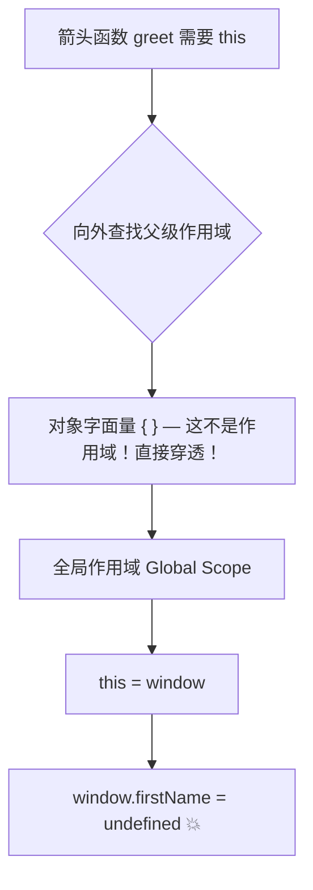

# Regular Functions vs. Arrow Functions

> 📺 来源：012 Regular Functions vs. Arrow Functions.en.srt
> 📂 章节：第 08 章

## 📌 知识脉络
- **前置知识**：`this` 关键字四大铁律、词法级 `this`（Lexical this）、防篡改声明机制
- **后续扩展**：底层内存机制（堆与栈）、基本类型与引用类型的深层差异

## 🎯 概述
本节课全方位对比深度剖析普通函数（Regular Functions）与箭头函数（Arrow Functions）在极其险恶的嵌套方法场景中的命运。我们将深入探究方法内嵌函数导致的经典 `this` 迷失难题，演示工业界从史前时代到 ES6 的拯救演进之路；同时我们还将触碰渐渐消亡但仍能见到的老古董——`arguments` 关键字。

## 核心知识点

### 1. 经典之坑：对象方法内部的“普通幽灵”
> 🧩 **生活类比**：对象方法（Method）就好比受雇于一家公司的区域经理（`this` 明确指向公司）。而在这个经理办公室里，他又临时喊来了一个钟点工（在方法内部写了一个**普通的规则函数**）帮忙。这个钟点工是不享受公司编制和名牌的，一旦他开始独自干活，系统发现他连个部门挂靠前缀都没有，毫不留情地没收了他的行事权利（`this` 贬值成 `undefined`）！

当我们不仅在对象内挂靠常规方法，**还在这个常规方法内又内嵌定义并启动一个常规小函数时**，那将是极度惨烈的翻车现场。因为根据铁律判定：这不再属于对象方法的调用触发，这完完全全属于**普通函数的裸调（Regular Function Call）**！这就导致内部小函数里的 `this` 不是如你愿指向外层对象，而是绝望地退成 `undefined`。

```mermaid
graph TD
    A[Jonas 对象本身] --> B[方法：calcAge()]
    B --> |这层 this 安全| C(this = Jonas)
    B --> D[内嵌函数：isMillennial()]
    D --> E{它是怎么被触发运转的?}
    E -->|isMillennial() 裸调| F[🚨 被严酷规则剥除了神格]
    F --> G(这层的 this = undefined)
```

---

### 2. 跨时空的营救大作战（2套实战方案）
历代高僧大德们为了抹除普通函数在这个特例下把 `this` 弄丢的罪孽，开辟了两代流派做法：

**💡 史前 ES5 时光机法则 (`self` 替身法)**：
趁着在最外层 `calcAge`（此时的 `this` 权力还没有弄丢，稳固指向该对象）的时候，立刻在最顶头宣告一个代理变量：`const self = this;`。接着内部由于作用域链机制可以无限读取父层数据，安全借回这块权力牌。

**💡 现代 ES6 降维打击法 (Arrow Function 原生制空法)**：
既然箭头函数的法则本质就是**天生残缺没有 `this` 权柄、全盘靠从父级去偷用词法作用域的环境**，这恰巧在这个灾难里成了最无敌解药！在 `calcAge` 内将它改装为箭头函数 `const isMillennial = () => {}`，由于内部自身不产 `this`，向外抓直接就抓到了父亲 `calcAge` 那把尚在发温的对象宝剑 `this` 并行使权利无碍！

---

### 3. 🚨 绝对禁区：箭头函数不可充当对象方法！
> 🧩 **生活类比**：箭头函数当对象方法就好比你在一栋大楼（对象字面量 `{}`）的走廊里安装了一面"透明玻璃门"（箭头函数）。你以为推门进去就到了大楼内部办公室（`this` 指向对象），结果这扇玻璃门直接通向了大楼外面的马路（全局 `window`）！因为对象字面量 `{}` **根本不创建自己的作用域**，箭头函数会直接穿透它往更外层找 `this`。

这是初学者**踩坑频率最高**的错误之一！当你在对象字面量中用箭头函数定义一个方法时，该箭头函数的 `this` **不会指向该对象**，而是直接穿透到父级作用域（通常是全局的 `window`）。

```js
// 🚨 极度危险的反面教材！
const jonas = {
    firstName: 'Jonas',
    year: 1991,
    // 绝不要这样干！用箭头函数充当对象方法
    greet: () => {
        console.log(`Hey ${this.firstName}`); 
    }
};

jonas.greet(); // Hey undefined  ← 没有报错，但结果是错的！
```

**为什么 `this.firstName` 变成了 `undefined` 而不是 `'Jonas'`？**

关键真相：对象字面量的花括号 `{}` **不是代码块、不构成作用域**！它只是定义对象属性的语法而已。所以当箭头函数 `greet` 向外找 `this` 时，跳过了这层没有作用域功能的 `{}`，直达全局作用域，拿到了 `window`。而全局 `window` 上自然没有 `firstName` 属性，于是读出 `undefined`。



**⚠️ 隐藏更深的致命连环：`var` + 箭头方法的联合毒杀**

如果你恰巧在全局用了 `var firstName = 'Matilda'`（回忆上节课：`var` 声明会挂载到 `window` 对象上），那么这里的 `this.firstName` 会**静默地**拿到错误的值 `'Matilda'` 而非报 `undefined`，导致 Bug 极其隐蔽难以追踪！

```js
var firstName = 'Matilda'; // 挂载到了 window.firstName！

const jonas = {
    firstName: 'Jonas',
    greet: () => {
        console.log(`Hey ${this.firstName}`); 
    }
};

jonas.greet(); // Hey Matilda ← 静默错误！拿到了完全不相干的人名！
```

> **💡 铁律**：永远不要偷懒用箭头函数来写对象方法。对象方法必须使用传统的 `function` 关键字或 ES6 的方法简写语法 `greet() { ... }`。

---

### 4. 被历史滚轮碾碎的 `arguments` 权能包
除了为人熟知的 `this` 以外，其实普通老派的常规函数在生辰那一刹那还会获赠一份极重的内置宝藏名叫 `arguments` 关键字！这玩意是个活捉了外部向内传砸所有散装参数的**伪数组（Array-like）**大军。

**📊 概念对比（`arguments` 捕获拦截表现）：**

| 函数体裁形貌 | 是否被系统分配 `arguments` 赠礼 | 传入超越既定数目的散单还能捕捉否 |
|---------|---------------------|--------|
| **正统函数化表达 (Regular Function)** | ✅ 完全享有 | 轻松接取，`arguments` 里装得满满当当 |
| **箭头短打 (Arrow Function)** | ❌ 后娘养的，一无所有 | 胆敢读取当街报错 `arguments is not defined` |

> **💼 业务场景**：在极老的没有 ES6 扩展运算符 `...` 来搜罗不定长参数的时代，要是实现一个万能无尽求和公式，全靠这个 `arguments` 去执行内部伪数组硬遍历才圆满。如今它已走向穷途末路，大底只在翻修老项目遇到。

---

## 🛠️ 代码实战与真实场景

> **💼 业务场景**：人事系统既要求计算 Jonas 这家伙的年岁，还需要借这内部东风直接推演他是否是具有特质标签的千禧一代（Millennial，大约 1981-1996生人），如果把推演函数就嵌套在这运算核心里，我们将观赏它的变迁。

```js {runnable} {title="arrow_vs_regular.js"}
'use strict';

const jonas = {
    firstName: 'Jonas',
    year: 1991,
    calcAge: function() {
        console.log("主方法层面的 this 安全保障：", this);
        
        // 🚨 错误示范原貌代码：
        // const isMillennial = function() {
        //     console.log(this.year >= 1981 && this.year <= 1996); // 绝命报错点
        // };
        // isMillennial(); // 这就是可悲的普通裸调触发了死期

        // ✨ [拯救方案 1] ES5 的前人借尸还魂术
        const self = this; // 核心：趁这会儿还没死保存在替身符里
        const isMillennialOld = function() {
            // 这儿的 this 早已灰飞烟灭，但没关系，靠闭包抓外部的替身 self 活下来了！
            console.log("ES5 抢救测算年代结果：", self.year >= 1981 && self.year <= 1996);
        };
        isMillennialOld();

        // ✨ [拯救方案 2] ES6 最优雅终局解答
        const isMillennialNew = () => {
             // 极度潇洒：本箭头自身压根就空无一物没造 this，眼光立刻拔高
             // 盯上了老爹 calcAge() 当时捧坐的神器 this（它当时正好妥妥指着 jonas）！
             console.log("ES6 箭头制空年代结果：", this.year >= 1981 && this.year <= 1996);
        };
        isMillennialNew();
    }
};

jonas.calcAge();
```

**🔍 执行追踪：**
1. 随着外防重装触发阵列 `jonas.calcAge()`，主方法内部大环境安全落下！此时的主环境中的 `this` 确实是被 `jonas` 数据全方位坐稳实干。
2. ES5 套路在危险将至时眼疾手快甩了句 `const self = this` 藏了一手复制王牌。
3. 如果按原生的古板内嵌小块函数去调，因为毫无点主前缀去带而沦为普通的触发，必堕入万劫不复的 `undefined` 且试图再拿 `.year` 全盘崩溃；而救火 ES5 只管闭着眼睛去调用在它上方空间尚存的安全活体 `self.year`。
4. ES6 则像换赛道打击。根本无需备份，只要你是这透明无体 `() => {}` 架子做出来的，这里头哪怕有这 `this` 的字眼，引擎看都不用看它当前境况立马推着车去向上面一层套寻，上头的自然就是安稳保盘的 `jonas.year`。

**📊 输入输出示例（参数强行越界接纳对比演进）：**
| 调用方形式动作 | 老流派 `arguments` 的反应 | 新流派箭头代码回应 |
|------|------|------|
| `add(2, 5)` （只填两项恰当好数） | 顺顺畅畅输出 7，`arguments` 集结 `[2, 5]` | 顺顺畅畅输出 7，它不需要动用特殊字眼 |
| `add(2, 5, 8, 12)` （老汉超负荷加塞） | 稳接全部包！`arguments` 库底惊现 `[2, 5, 8, 12]` 伪连段数组 | **灾难爆裂** `arguments is not defined` 引擎怒叱它连这个挂件功能也不配拥有！ |

## 💡 关键要点
- ✅ 在那些盘根错节互相嵌套着数道功能的常规方法的迷茫肚肠内，最惹人惊魂动魄便属其中嵌套内生的底层细末流节小函数的离奇调动了往往换来的只能是一片可恨的 `this = undefined`，请将原罪狠狠摔扣在那“不管写在哪只要是被以普遍裸式发起调用便必判死刑”的铁律头上。
- ✅ **天生的巨大缺陷往往是在特定场面的封神优势**。箭头不曾配享自身独立拥有的 `this` 指示体（使用父层 Lexical 原型环境去顶套），正成就它在上面这类内嵌调换层环境免去备份动作即能直接完美顺藤摸爹的一把神工鬼斧利器。
- ✅ 对现代战力兵器库而言，虽然被拔去了 `arguments` 这件过气的老派冷兵器接单万物残片组列技能实在没落，但是用目前 ES6 最顶盛行的扩容散合魔法符 `...` 其实更能干得漂亮百倍。（这是未来即将被探究到的超级大件知识图景）

## ⚠️ 常见误区
- ⚠️ **误区 1：只要方法内部出现常规小函数调用就是底层引擎的重大开发恶性系统报错纰漏 Bug**。很多没弄明机制的人会对着屏幕疯狂破口大骂官方设计拉垮系统报错；其实仔细审视那条不容反驳的天条（是谁引动触发了这声波调用），普通触发函数自然只能按律被打落剥去 `this` 权柄，这不是引擎的问题只是你被机制迷住眼了。
- ⚠️ **误区 2：在全方位升级用上酷炫 ES6 后竟然还在代码中到处留着 ES5 `const self = this` 等古代化石。** 你应当极其有敏锐度闻着那股臭气去用箭头神不知鬼不觉替换清剿掉这些不留身价的备份废物点缀变量。

## 🐛 报错实验室
> 直击试图在无主空体内强行掠夺特权大宝箱时系统的狂怒

**❌ 错误写法：剥走箭头的天生机能去讨东西**
```js
const addArrowNum = (a, b) => {
    console.log(arguments); 
    return a + b;
};

addArrowNum(2, 5, 8);
```
**浏览器审判系统大举截停：**
```
ReferenceError: arguments is not defined
```
**🔑 底层解密大审判**：`addArrowNum` 这是最纯澈脱挂透明简写箭架势打造。官方设计底盘早就没收绝育了它去怀装产生能够吸纳无形参数多发体组件的 `arguments` 后底裤包裹箱权利！当程序顺着你非分企图指令想要扒开底层看看 `arguments` 库装这什么货时，面对空落落没有造创之物连查都查不到该项只能怒打 `ReferenceError 绝望未决报错案`。

---

## 📖 词汇速查表 (Cheat Sheet)
| 中文术语 | 英文术语 | 简明释义 | 速查代码 | 📚 官方文档 |
|---------|---------|---------|---------|-----------|
| 普通函数死胡同 | Regular Function Call | 完全依靠 `某某某()` 去裸激发的这群动作体系无论它窝藏于多么深且多金母体内皆受剥夺法制严裁 | `isMillen(){}; isMillen();` | [MDN](https://developer.mozilla.org/zh-CN/docs/Web/JavaScript/Reference/Functions) |
| 隐秘收录大兜袋 | `arguments` object | 藏于最古法的老派正宗规范制函数底层里负责收容打包不管超出多少被超发的零散数据参数流伪列队 | `console.log(arguments)` | [MDN](https://developer.mozilla.org/zh-CN/docs/Web/JavaScript/Reference/Functions/arguments) |
| 顶用上层机体借光法 | Lexical this / Arrow | 源自那支小箭穿连向上层作用顶借主体的这神迹不二法宝绝世借壳术 | `const b = () => this` | [MDN](https://developer.mozilla.org/zh-CN/docs/Web/JavaScript/Reference/Functions/Arrow_functions) |

---

## 🧪 学习验证

### 📝 动手练习

**练习 1：揪住隐匿深空内部的 Bug 罪徒**
一位外包初级成员试图在一个飞行器对象的发动引擎逻辑内额外安置一段点火倒计时警示。他以为大功告成了，不过飞机根本升不了空并在仪表盘爆响红灯，为何且如何用最新最高等法术修缮掉？
```js {runnable} {title="exercise1.js"}
const plane = {
    model: 'Boeing 737',
    startEngine: function() {
        console.log("准备开火本座机型:", this.model);

        // 烂得出奇的内置触发块报错段落
        const fireIgnition = function() {
            console.log("引擎警报！该", this.model, "点燃出现极度阻隔！");
        };
        fireIgnition();
    }
};
plane.startEngine();
```
<details><summary>💡 真火答案解惑救赎图鉴</summary>

```js
// 修缮手法！大斧一挥将其彻底置于 ES6 的无尽庇法空明之中：
        const fireIgnition = () => {
            console.log("引擎轰鸣！该", this.model, "主引擎全速点燃烧进无疆尽处！");
        };
        fireIgnition();
// 控制面板重塑爆出金字：准备开火本座机型: Boeing 737 / 引擎轰鸣！该 Boeing 737 主引擎全速点燃烧进无疆尽处！
```
**解题绝杀破局心路**：其烂就烂在他的内生小块用回那极其笨重不堪的老底传宗法子去设建 `const XXX = function() `。紧接下头这一行没任何主挂印记的光膀子瞎调起 `fireIgnition();` 那更是彻底给它本身断了所有的活路（内底 `this` 遭空化打去 undefined）。将其改命抽心换掉用一个简明利落不带主属性自供底色的法刀小箭头 `() => {}` ，箭头上接查索立马跨境上层牵走了主大厅 `startEngine` 面上带有的极强稳固 `this` （此刻死绑指向 `plane`），大业终成修复！
</details>

**练习 2：过时旧军衔的终章清剿检阅**
假设一位守旧的长官仍写着利用着那个老式内置库容装大袋去清点超出配额输送来打扫卫生的清洁散漫人员（即便仅有两个名额位）。下面这串代码运行到底有什么结果浮面？
```js {runnable} {title="exercise2.js"}
const deployCleaners = function(roleA, roleB) {
    console.log("第一列前卫兵收到位:", roleA);
    console.log("第二列暗卫收到位:", roleB);
    console.log("神秘列编内幕收录总汇编大集:", arguments);
};

deployCleaners('Bob', 'Alice', 'John', 'Mark', 'David');
```

<details><summary>💡 揭密破局最终导读答卷</summary>

```js
// 它会忠心且任事满荷地跑出：
// 第一列前卫兵收到位: Bob
// 第二列暗卫收到位: Alice
// 神秘列编内幕收录总汇编大集: Arguments(5) ["Bob", "Alice", "John", "Mark", "David"]
```
**解题抽丝剥茧脑洞追踪链**：不要只盯着上面名标书板的参数限长发愣，那是正轨法器 `deployCleaners`。只要它是原厂流出造配的那一身 `function` 大块形骸没丢改！它本身自带的那巨大容量容差空间底裤物件——神之一隐大包裹 `arguments` 便会在启动执行瞬即就大口张开。无论外界怎么肆意丢了天边海量溢满超载的无名参数流下来，上面能领去几个且由它领，剩下未领的全连窝打尽锁这巨大的活生虚数大集袋子 `arguments` 里作一通列编总汇报去。
</details>

### ❓ 理解检测

:::quiz {correct="D"}
**1. 在常规一个极宏大主权方法（Method）的幽深内部突然用最老旧流派再安建立一个小块零散函数去裸身上手使唤时，最最令人绝望发指致使 `this` 迷失底裤掉底变 `undefined` 跌落崩溃的千古大罪要怪罪算到谁头去？**
- A) 是那个庞大宏大的最外界方法压根写串笼罩包裹保护能力失效破相造的锅
- B) 是 JavaScript 常规语言设计大放逸大漏洞 Bug 必须寄望开发官方去猛重打补丁消杀
- C) 这是个严厉防打反串越轨黑客挂钓代码库锁的自动锁库断电保护断桥系统惹发
- D) 其实没有任何 Bug！完全要痛批这是因为我们发号出这个动作时用的就是粗糙单薄光着膀没半个归属性大主附着在调用点前缀的最劣迹执行 `小函数();` ！死板且天大地大的执行触发界定天条规则法典就死认这是剥光权权身份只配留以无名化处分的绝地触发结果！

> **解析**：This 的判定始终绝不是依据套在那写在在多层深府内宅里的层层壳子套件（不是看写出的物理位置），它唯单极其盲眼地从顺着发大令枪响的那记号上——也就是你光头触发只喊全个名去打点，自然天法宣制将其判做纯最无脑没背景最次等的 Regular function call！它本就理应配遭去打为没名的降权判惩！
:::

:::quiz {correct="C"}
**2. 为什么能将那可悲丢权破相这千古悲剧彻底终结一绝的，唯得必须仰靠运用它（神之箭 —— 箭头 Arrow Function）能挽大厦将危于水火并当场拔高盘旋出最高级别奇绝拯救复苏光环？**
- A) 不不，其实只那只是借它个装模作像的表面时髦样式改去外身，系统看到新型写法自动从这法外原谅他了
- B) 内部在 ES6 翻建的时候偷偷加了专让给它用自动锁定并找那离它最近大件对象挂坠上的霸主指令机能
- C) 正由于这东西生下来出世就是太穷酸，连生产孵化造弄起自家特制底板权 `this` 的这部件生生都被官方没带进图谱装！没自造本事咋办就只能天生变作个贼窟！极其极厚脸皮透过自上到去大外环境生去扒老窝顶壳老爸（Lexical 父大容器环境）自带用着啥它自己便去借来啥！一借顶万物这反而在这险绝危地顺走老爸极其平稳护主的那好符！
- D) 原是因为箭头这破法力无限制绝大地它本来就有可以任意调权操使无疆世界那超级巨头外源神明 `Window` 去帮他横扫查库去扫除

> **解析**：正是彻底因为自身这等惨烈极残次无制造能力（剥落的本身特质）。导致造就天底最为顶极其变通能够向天上神法般层进查套上级原属这无相有法大道上层作用法界之术借威去压底！
:::

:::quiz {correct="B"}
**3. 假如你在写那炫绝无比天发无形的 `() => {...}` 飞空流箭头语法去构造高强兵器时，想让它偷偷背着你去接收十个万个多出没边名分的外发越来散带小数值的时候跑去用那老神兵底座袋（`arguments`）会出现么一波啥狂野结局？**
- A) 可以极其精良且装满一切！就凭他是更为极尽新版化出的法典极客能把旧旧的法阵融全且超常发挥去
- B) 就是一泼天满屏崩断死链报决单—— `arguments is not defined` 这没情脸打上的重击！你个天生就被全剥拿这些大附配件的轻简化构件破玩意也妄思妄求图带这上代天机神器包？它门都没半扇门留你！
- C) 里面能装是能给你装得上去，只能存头两位前先入的人随后就被截断切绝不再供纳的废烂半截状态品
- D) 会激惹出一个神化无穷长无终端的不可循环巨圈导致机动爆瘫

> **解析**：这正正是作为轻量极致无底附品构架而换打飞速代价；那些重配行当大内置隐藏库包裹件你一个极简架不配在底下受存发。要用就只能往里强加现代魔功最超化法器 —— 万融归一绝地收扩点珠散点打合散聚魔技 `...` 才配发入它的神力了。
:::

### 🔧 代码填空

:::fill-blank
凡在对战且极尽庞大复绕叠环最中心战阵大方法核心（Method）的心腹机内，又欲试图再置重装造配嵌套下带上一只细末极散打操作体小动作之时！为了防御抵死极防掉入那个将核心特选权利大卡牌（大权 `___this___`）在盲眼无头指令激激打发后便遭剥收变为惨落的幽魂透明牌（贬做绝位 `___undefined___`）引发大惨灾崩溃；全天下门宗公认最为极致光荣最顶尖免死拯救之通法绝艺便是当刻就去舍离旧制把这里心腹功能全权替换装身成为能够完全将下造自体这物没绝弃尽，进而肆无忌地化全拿跨壁上挂套长者之借传权利用的极尽简意那无极利刃：即是 `___箭头函数___`（或极客行名：Arrow Function）去统造代替了！
:::
