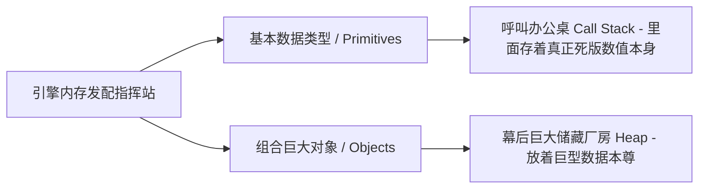

# Memory Management: Primitives vs. Objects

> 📺 来源：013 Memory Management Primitives vs. Objects.en.srt
> 📂 章节：第 08 章

## 📌 知识脉络
- **前置知识**：执行上下文（Execution Context）、基本数据类型与对象分类
- **后续扩展**：深浅拷贝实战（Shallow vs. Deep Copies）、垃圾回收机制（Garbage Collection）

## 🎯 概述
如果你想彻底摆脱“初级玩家”的标签，必须深入了解 JavaScript 背后的内存调度大本营。本节课将带领你潜入 JavaScript 引擎的底层机房中，全视角旁观两大主角——调用栈（Call Stack）与内存堆（Memory Heap）是如何分别保管区隔我们的基本数据类型（Primitives）和复杂大件对象（Objects）的。

## 核心知识点

### 1. 两极分化的内存保管阵地
> 🧩 **生活类比**：调用栈（Call Stack）就像是你的办公桌面，只适合放置类似便签条、单独几笔数字这种又小又快能处理的东西（基本类型）；而内存堆（Memory Heap）则像是你背后的巨大仓库，用来丢入那些结构极其复杂占地极大的重型多层档案柜组合（对象、数组和函数）。当你坐在桌前想要查阅那个巨大的柜子时，你在便签条上写下的仅仅只是一行指引向那个柜子的房间“编码地址（引用指针）”而已！

在 JavaScript 中我们掌握两大值类型：
- **基本类型（Primitives）**：包括 `Number`, `String`, `Boolean`, `Undefined`, `Null`, `Symbol`, `BigInt`。它们天生轻巧单一。
- **对象类型（Objects）**：字面量构建的对象、数组（Array）、一切函数（Functions）。它们庞大且可以无限制扩增。

引擎分配地盘的铁律模型：
1. **呼唤执行的调用栈（Call Stack）**会妥妥保管住所有基本类型的值，精确点说它们是附着在执行上下文的具体环境内存网格长成的；
2. **极度宽广的内存堆（Heap）**会专门开辟一片广阔荒原放置体型庞杂的 Objects。

> 💡 **记忆口诀**：**“基生于栈，客住于堆”**（基本数据出生在调用栈，客观对象数据全被抛住在巨大堆区）



---

### 2. 暗潮涌动：所谓的 “引线” 艺术 (Object References)
初学者最崩溃的一点莫过于他们坚信一个赋值在变量里的对象就安安分分躺在这个变量兜带里，但事实的重锤恰恰相反！

在调用栈中运行的一个名为 `location` 的变量对象，实际上它**自己的内部一丝一毫没有装载存放这所对象的全貌数据信息！它存的仅仅只是一纸带有十六进制编码的“仓库收据提货单”——学名为 引用（Reference/内存定位地址）**。
顺着这只地址引线指针指向远方巨大无比的内存仓库阵列堆（Heap），那头端安静趟着的，才是你的那个重型对象主体。

**🔍 执行追踪（见证实锤）：**
```js
let age = 46;
let newAge = age;   // 复制了一份一模一样的贴纸「46」
newAge++;           // newAge 变成 47。此时原配的 age 仍然骄傲且互不妨碍地维持着自己的「46」

const location = { city: 'Porto' }; 
const newLocation = location;  // 🚨 惊天大雷！这里复制的才不是一套房！你复制拷贝的是那张「取货单号/寻址钥匙」！
```

---

### 3. 深不可测的突变连带效应（Mutation implications）
这就解释了那万千 Bug 诞生的根源！既然 `newLocation` 与老旧的 `location` 仅仅只是两张拥有了一对一复刻了**同一串库房门牌号的钥匙卡**，意味着它们实则指望着（指向）那远远在郊区同一间屋子里安放的同一位主人！

你在这个时刻胆敢拿着其中一把卡走进去肆无忌惮地变异（Mutating）了它的 `city` 改名换姓成 `'Lisbon'`，等到原本那个以为没任何变化拿着老卡片去查验 `location` 的老实人一推门，看到的一定是这间已经遭遇被你私自大刀阔斧重装修过的满目疮痍新客房。两者，同气连枝毁于一线！

**📊 概念对比（传值与传址的决裂）：**

| 运转机制现象 | 基本数据类型 (Primitives) | 复杂对象类型 (Objects) |
|---------|---------------------|--------|
| **分配安身之地** | 直接死死刻在执行环境的小片 Call Stack 里 | 本体甩去大区 Heap 里，留个地址指针存栈里 |
| **对其执行 `=` 赋值复制行为到底算什么** | 直接实打实重打造一个带着真值 `46` 的克隆体分家 | 只是再拷贝一份直通同一仓库的单薄门牌号钥匙（引线） |
| **突变（变异某项）干涉后果** | 天涯陌路，毫无干涉影响 | 牵一发而动全身，一损俱损爆破同门对象！ |

> **💼 业务场景**：每当你在购物车列表（因为 Array 也属 Object！）赋值一份副本想要作为缓存，一旦你在接下来的处理里顺手 `.push` 或修改内部件数字，这就会把显示在原始前台界面正展示给客人结账面板里同步打翻改烂数据！一切都因仅仅传递的是门牌号，需要祭出接下来的大招：拷贝术。

---

## 🛠️ 代码实战与真实场景

> **💼 业务场景**：一家新搬迁的分公司准备设立一个配置库，图方便懒省事拷贝了一份全公司最绝密的主部高层配属档案地址，然后在底下瞎改瞎折腾，导致极其可怖的全公司职位被篡改灾难。

```js {runnable} {title="memory_disaster.js"}
'use strict';

// 【战术区 1：纯洁无暇的原始区（Primitives的独立高洁）】
let originalLastName = 'Williams';
let newLastName = originalLastName;
// 即便是改姓了结婚了也仅仅属于 newLastName 这个复制品的自身剧变
newLastName = 'Davis'; 
console.log(originalLastName, newLastName); // 输出：Williams Davis （双方完完全全没挨着半毛钱边牵连）

// 【战术区 2：灾难引信点燃区（Objects那同生共死的羁绊）】
const originalHouseInfo = {
    address: '100 Main St',
    tenant: 'Jonas'
};

// 💣 恶作剧引线启动：并不是复制盖了套新房！是多打造了一把新大门钥匙并且配给这位名叫 cloned 的卧底保管！
const clonedHouseTarget = originalHouseInfo;

// 卧底拿着门禁潜入老宅改了大门名牌！！！（改动原先唯一的实体重物本身）
clonedHouseTarget.tenant = 'Agent X';

// 震惊时刻大查水表揭秘
console.log("那当初最为原始未动的老户主竟然被连累改成了:", originalHouseInfo.tenant); // Agent X
console.log("这名带着拷贝钥匙卧底家里的租客名叫:", clonedHouseTarget.tenant);       // Agent X
```

```mermaid
graph TD
    subgraph Call Stack 呼叫栈 (光拿钥匙的桌面)
    A[originalHouseInfo<br>存有内址 : 0x000F]
    B[clonedHouseTarget<br>赋值抄录的仍是这一串 : 0x000F]
    end
    
    subgraph Memory Heap 内存堆巨片 (本体)
    C["{ address: '100 Main St', \n tenant: 'Agent X' }"]
    end

    A --->|追随指戳| C
    B --->|同样顺藤摸瓜引到| C
```

**📊 输入输出示例：**
| 取值行为 | 真实抛出表现结果 | 判定根源原因所在 |
|------|------|------|
| 修改复制的原声字符串 `newLastName` | 原版老值 `Williams` 雷打不动 | 那属于 Stack （内存栈）底里的各自克隆硬拷贝！ |
| 修改盗持地址房卡打出的复制体 `clonedHouse` | 连端老底全受拖累污染 | 他们本质就是拿着同一张房契对同一栋物理房子下手变动 |


## 💡 关键要点
- ✅ 在心里建立引擎世界的两个维面感模型极其必要：一个是你正焦急办公看执行令的小桌子 Call Stack，基本原生态的数字和词句就直接摊在桌上；而你背后那个宽大如远古荒野的内存块就是丢载对象库的 Memory Heap。
- ✅ 认清了引线门牌（Reference）事实真相后你才会醒悟：我们常常使用的 `const` 之所以能给庞杂深层不断改变对象值属性的行为放行！那正是由于 `const` 能锁死的绝对防御，仅仅只去控制住并锁定了小桌面上的那串十六进制门禁钥匙单号不得篡改抹除！至于这个无钥匙指引的远足深山中的房子其内在换了什么房客（突变它的内部构件属性），关 `const` 这把短视之锁屁事也没有！这属于底层彻底越界豁免了。
- ✅ 函数即使常常被当成底层逻辑在跑，但是在最深层次最严苛的引擎底层法条内，他可是纯纯的一件大物件（Object）！自然也一样归管堆砌到远洋大海的 Heap 那套引流法则中。

## ⚠️ 常见误区
- ⚠️ **误区 1：狂热地认作所有用等号 `=` 复制过去的东西都会重新大干一番土木起一座独立大房源。** 这是萌新在面临复杂大数组和大物件等重器类型极其爱作出的最无脑乐观想象，以为复制就独立了。但他们只复制到了表面皮虚无缥缈引线。
- ⚠️ **误区 2：在深层修改一个拿 `const` 锁定标红创建打造的恒常不可摧体对象其下的子系属性值一定会被大红警爆炸阻挡弹回。** 这误传就是完全不懂何为 `Reference 截留锁`！这锁只管控那门牌地址不能切源移花转包到别的地址单号上，管不着室内翻云覆雨拆家扩建！

## 🐛 报错实验室
> 前方雷达红灯闪动：感受挑战神之一手 const 底层容忍阀值的破盘越境

**❌ 错误写法：不解风情想切断房卡连线换包转移强接新线索**
```js
const jessicaTeam = { 
  role: 'Leader' 
};

// 正确合法的是在家里玩拆建
// jessicaTeam.role = 'Member'; // 系统不理会随便你折腾大件物件内务

// 接下来直接要试图触怒天条：将手里的门牌卡全部交出并接受一把从别的房区抛送来彻头彻尾的截然不同的新房子房卡钥匙地址？
jessicaTeam = { role: 'Nobody' };
```
**浏览器监察台暴怒轰鸣震断输出：**
```
TypeError: Assignment to constant variable.
```
**🔑 底层解密大审判**：`const jessicaTeam` 其使命只在于死死捏死了锁住了那一纸名为 `jessicaTeam` 手上的初始获取到的房契指针对标线（它的底层指向那个原始十六进制引线号不可动用变分号！）。现在你生拿横拉一把造出来的一个完全横空出库空降诞生的崭新野房区 `{ role: 'Nobody' }` 去让他拿走交接它的全新指引引线钥匙？这就是硬头往最锋锐无坚不摧之盾上死撞！

---

## 📖 词汇速查表 (Cheat Sheet)
| 中文术语 | 英文术语 | 简明释义 | 速查代码 | 📚 官方文档 |
|---------|---------|---------|---------|-----------|
| 堆原内存大宗派 | Memory Heap | 专用于无边界地承接存放海量体积庞杂且未知尽头无极巨大造物体巨阵区 | （底层架构术语） | [MDN](https://developer.mozilla.org/zh-CN/docs/Web/JavaScript/Memory_Management) |
| 直通底层之线索 | Reference 指针引线 | 不在执行桌面上占据死空硬格而仅仅作为一个链接门票存在呼叫站台内的那套隐虚体 | `const b = Obj;` | |
| 原值/非可突变体 | Primitive Values | 六合不侵坚强无法打破其本体发生内部自我质数改变的最真纯小巧本始体 | `num = 1;` | [MDN](https://developer.mozilla.org/zh-CN/docs/Glossary/Primitive) |

---

## 🧪 学习验证

### 📝 动手练习

**练习 1：追踪凶案凶手到底摸了哪扇门**
一个开发实习生弄出来了一件极其鬼使神差怪诞命案。不运行的情况去推理打印大结局是哪家的数据呈现？说明这把底层钥匙是怎么连的局。
```js {runnable} {title="exercise1.js"}
const companyA = { funds: 1000 };
const companyB = companyA;

companyA.funds = 500;
companyB.funds = 200;
companyA.funds = 8000;

console.log(companyA.funds);
console.log(companyB.funds);
```
<details><summary>💡 真火答案解惑救赎图鉴</summary>

```js
// 结局爆打出完全一律毫无反顾的共同口径：
// 8000
// 8000
```
**解题绝杀破局心路**：根本没有什么你方唱罢谁又独立起跳登场！自打最开始一句极其致命 `const companyB = companyA` 一打落盘起，他们双子生煞就已经共生锁命死通了一把！拿的无非同一条走去城外宝山的一张共同路线宝图。无论之后经过多少繁多繁长互踩盖脸乱调乱设，全部统统砸落在并且结结实实在篡写覆盖的只有那远在堆 Heap 矿区的同一尊佛！所以结局终号只收归于那一道落定数值便是 8000！
</details>

### ❓ 理解检测

:::quiz {correct="D"}
**1. 关于基本轻小之形神（Primitive）和被送上神坛构建大盘根的客随实体（Object）在遭受 `let 替身 = 真身;` 这个 '=' 动作发生转移翻炒时，最底层那最让人如鲠在喉的千古巨大区折分别在何处落脚？**
- A) 两者完全没有任何差距都在干着最为干净一抹绝尘干干净净彻底清扫大复制操作
- B) 基本型无法接受等于号转移，只有复杂巨大盘件有本事靠这东西分身去跑
- C) 对象系物极其巨大它在转移前需要被耗费极大光阴和巨耗电能把自个原装粉碎一遍才搬新家用上
- D) 小体积原生身子是扎实真源原样刻出了第二张能用互不牵扰死牌数字副本存了起来。巨型物那极其恐怖的架构连门都挪不开步一步，传向接替分身的完全只是一把单薄到极薄刻录导向其隐匿在群魔深原之里的那一线门卡（指向门号 Reference）而已！这直接埋留了无限的连坐灾星！

> **解析**：这也成为大前端深海中最要命最致命一击！复制并不等同于分家！在 Object 的界端中等号 '=' 这道微带只传递极其毫无防备且共同进出一间屋房门这等凶神灾难线罢了。
:::

:::quiz {correct="B"}
**2. 为何用铁制恒固无敌大挂锁 `const` 这号人物极其神权封控着巨大复杂对象的起手式创建名，可你接下去非但不罢手更是去深掏它的里面猛烈肆野狂修其身属性数据时（如去改里面的 `name, list` 等），它那套标榜坚如无漏的防阻抗雷暴屏系统竟然死了一切当它没发生？**
- A) 因为引擎出着一处暗疾未被修好导致这种越级穿透 Bug 没封漏堵牢防死导致能破这门
- B) 对不起！那个老兄仅仅负责并且具有全神守控着这栈格桌子之上那小小一单薄张用来直捣其巢穴认出的十六进制路引引文（即其存活大记忆门牌编码）绝不能遭受改易撤移而已。由于去变改屋内核子部件连大本引文一丝一毫门印都伤不得动不了皮毛！于是天条法雷才没有发落！
- C) `const` 本身就是形同个伪劣货纸贴大框！只图装饰好拿在第一行震人实质并不能生哪怕防制效能
- D) 因为里面深系数据是拿特殊密码打造，突破了上层的外壳法抗去屏蔽大系统

> **解析**：死守这关：`const` 仅仅针对那个在小调用桌前落笔划线的 `地址编号 0087AX....引线` 不能遭你再打等号接去新盘了。你循着这锁定的铁连路线杀去大后方深处对里边改朝建树它是死活全然闭目的！
:::

:::quiz {correct="C"}
**3. 请追下述那个绝美纯正的布衣变量之身的下场为何：**
```js
let originNum = 1;
let subLine = originNum;
originNum = 100;
```
**这时候 `subLine` 内部核心深蕴着哪尊道法佛数字？**
- A) 100
- B) 这属于乱赋同源禁制自然打向 undefined
- C) 1，它孤高清纯，丝毫没遭那个所谓原始主人后续自我堕落异变波及，因为他是正儿八经纯正本命刻录副本出来
- D) 受牵扯被激增到了 101 倍幅去跳长扩升

> **解析**：基本小部件数值（Primitives）身生便是坚忍。那一声 '=' 给的是实权全实之物造的新刻品体！两人本生就是相隔楚河各自有家再也没了恩怨连扯牵联一说之事，不管先前的 origin 老主后续发生了怎样改头换面自我升级。
:::

### 🔧 代码填空

:::fill-blank
当你打算去翻抄备份或者全套交转移一套像大包罗万象的宇宙星系般庞杂数组集（Array）和构图深潜之巨物（`___Object___` ）之际务必警醒并留出极大的惊骇后心！在那条光秃滑溜打出连接那一句 '=' 过后去，这桌面被承拿接过之手所得到的根本不是如假换包的那宏伟主大殿巨群，而仅仅极其惨然寒酸得只领下拿到了一张带有定位追寻的寻向地图线 `___Reference___` （中式名传呼它叫做 引用地引）这也酿出大根基一出同株死难连体同爆崩的万患流！那些庞大厚重的万数真核则全系远远丢弃寄隐被归落统系排存在极为后方宽泛阔大海无边绝岸边那号名为巨容集散中心海： `___Heap___` （原内存名也就是统所唤它为内存大堆）这地方内部死死静睡。
:::
