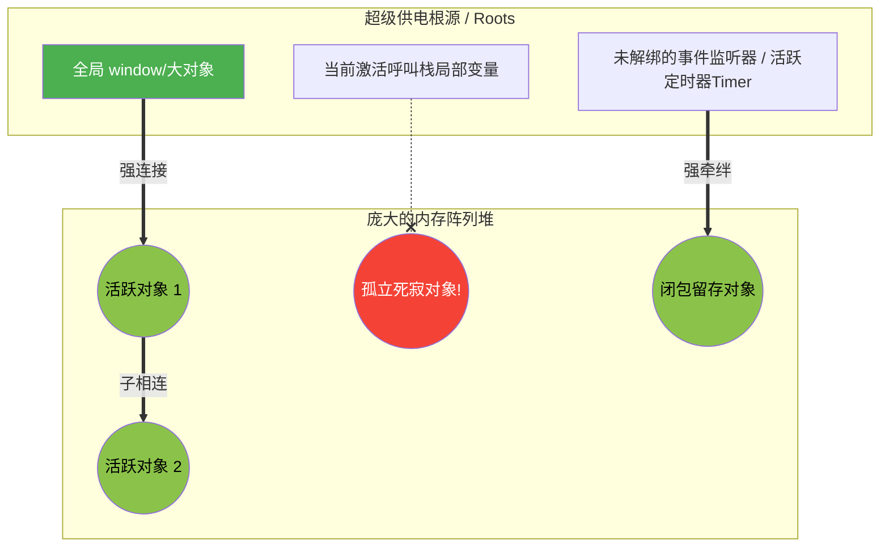

# Memory Management: Garbage Collection

> 📺 来源：015 Memory Management Garbage Collection.en.srt
> 📂 章节：第 08 章

## 📌 知识脉络
- **前置知识**：调用栈与内存堆（Call Stack & Memory Heap）、对象引线模型（Object References）
- **后续扩展**：闭包（Closures）内存留存现象、Event Loop 深度机能解析、原型链（Prototypal Inheritance）

## 🎯 概述
这节课我们要把镜头拉远，从宏观维度探讨 JavaScript 引擎里默默无闻但居功至伟的“保洁大队”——垃圾回收器（Garbage Collection）。你将弄懂大名鼎鼎的“标记-清除算法（Mark-and-Sweep）”是如何判断对象死活的，揭开在开发中极其隐秘且致命的“内存泄漏（Memory Leaks）”元凶面纱，并学习几条防堵泄漏的实用铁律。

## 核心知识点

### 1. 判定生死的神之算法：Mark-and-Sweep（标记-清除）
> 🧩 **生活类比**：想象一座插满盘根错节高压电线的巨大都市（内存堆 Heap）。供电站总闸口（我们称之为 Root/根）源源不断地输送电力。算法的第一步（Mark 标记期）会顺着高压电线一路查过去，凡是电能顺着线路传递能点亮的楼宇对象（哪怕楼连着楼），统统标记为“存活”；而那些因为拔了插头或断了连接线、电根本送不到的孤立老楼，就被认定为“失去活性”。算法第二步（Sweep 清除期）会直接开个大推土机进去，把没有亮灯的老楼全部推平推毁，把占用的昂贵地皮（归还给内存系统）留给以后建新楼用！

现代 JavaScript 引擎依赖**标记与清除算法（Mark-and-Sweep Algorithm）**进行极其高效彻底的废物清理。
**谁是那个供电总闸口（Roots 根节点）？**
1. **全局执行上下文（Global Execution Context）**：挂载在全局域的任何东西永远带电！
2. 当前仍然活跃在调用栈（Call Stack）里头的任何函数所持有的局部资源。
3. **事件监听器（Event Listeners）**、**激活的定时器（Active Timers）**。
4. **闭包（Closures）**牵连拖带住的外部变量环境。



---

### 2. 定时炸弹：可怕的 内存泄漏（Memory Leaks）
> 🧩 **生活类比**：内存泄漏就像是你点了一箱外卖纸盒（创建了占用极其恐怖的大型对象）。你其实已经吃完不想用了，理应让保洁（垃圾回收器）把它们收走扔掉。可是你当时不小心拿一根极细极难扯断的钢丝把纸盒死死绑在了屋子大门把手（例如挂到了不销毁的定时器和高权重的 `window` 全局上）上！保洁阿姨一拖地发现这个垃圾竟然还连着大门（根节点），她根本不敢动它！于是这堆早该发臭丢弃的废物就伴随着你的岁月在房间里永久占着地儿发烂，这就是内存泄漏大灾难！

**内存泄漏指的是：在这个应用逻辑中某个极其庞大占据内存的旧对象明明早已没有任何存在价值意义了，但正是因为开发者个人的错误编码（不经意间在某些高权阶的位置留下了一丝连接指戳着它），导致保洁清扫机（Garbage Collector）把它错当成了在用“活物”，从而始终不将其销毁的翻车灾难！**

制造泄漏的三大极其典型高频手残行为：
1. **老迈废弃的闭环定时器（Timers）**：如果你在一个早已废除不再展示的前台组件里设了个巨大轮询动作 `setInterval` 且走时没掐灭，它内部使用的大对象将万劫长存不灭！
2. **没解绑的事件监听器（Event Listeners）**：对一个大表单页挂了无数滚轮互动与监听，切了页面但没注销钩子函数去抹除挂靠，那牵连进函数的巨大参数集直接锁死！
3. **全局泛滥（Global Variables）**：顺手牵羊把巨大缓存字典存在完全不受销毁的顶头大哥环境 `window` 里！

---

### 3. 未完待续：未来核心版图预告
本节课作为 V8 底层机能解剖专题的绝赞收尾，顺势推开了其余几个必须被你放入未来必征服征程高地的四大深核高阶技术远控航标：
1. **闭包（Closures）**：这绝对是整个篇章最大的杀招和魔法结界，后续将在“A Closer Look at Functions”专项大篇里去深掘。
2. **原型继承（Prototypal Inheritance）**：构建极高复用和全自动级体系的核心手段，将下放入“OOP / 面向对象编程”中解析。
3. **事件大循环（The Event Loop）**：支撑 JavaScript 用可怜的单线程去撬动无限并发异步神话的底层法阵，在异步开发篇必修。
4. **DOM 底层骨架（DOM Behind the Scenes）**：网页页面与代码深度融合互逆机理，移步高级 DOM 交互事件篇再战。

---

## 🛠️ 代码实战与真实场景

> **💼 业务场景**：这是一个极其糟糕充满漏洞的聊天大窗口组件。它模拟了一旦加载便不断膨胀并在关闭时不处理后事所导致的极其严重内存吞噬雪崩事件。

```js {runnable} {title="memory_leak_simulator.js"}
'use strict';

// 这是一个极其耗费电脑效能的虚构巨型结构对象
function createMassiveDataNode() {
    return new Array(100000).fill('Heavy Text Load...');
}

// 🚨 泄漏案犯点 1：把不要命的重型数据直接丢给天神下凡的全局保护库（全局变量）
const GLOBAL_CACHE_DONT_DO_THIS = createMassiveDataNode(); 

function initiateChatRoom() {
    // 尽管这是一方地方小霸王局部变量，但接下来的惨剧连带着把他一块钉死了
    const localChatHistory = createMassiveDataNode();

    // 🚨 泄漏案犯点 2：极其放肆挂起了循环监听打更且事后压根不销毁！
    // 注意：这个不知疲倦的打更人借取拿走了局部 localChatHistory 进行使用，
    // 由于打更人（定时器）自己就是一个系统高等级不可侵犯的 Root，这导致了这巨大的数据被无止尽拖带留存不被回收！
    setInterval(() => {
        console.log(`我还在后台消耗着资源！连带着把那 ${localChatHistory.length} 数据的死尸保得极其神旺活气！`);
    }, 2000);
}

// 模拟了你的用户点击进来了聊天大厅！这一进去，后门地雷被全部踩响炸拉激活
initiateChatRoom();

// 等用户关了聊天室离开这块执行区域以后：
// 你会惊悚地发现下面控制台还在隔 2 秒就不断打印消息。
// 说明原本那本该随用结立马销毁腾位置的本地海量巨阵 `localChatHistory`，彻彻底底永久泄漏挂盘成了清不脱理不掉的幽灵包袱！
```

**🔍 执行追踪：**
1. 巨型 `GLOBAL_CACHE` 被硬丢在统子 `window` 外层内，直接荣登全图超高 Root 供电保护，一尊废鼎也直接变成神佛保护免除清理（Mark 时段强标存活），此乃败笔一。
2. JS 引擎进入执行局 `initiateChatRoom`。此时在栈里捏了一个极肥极大占有海量空间大肉团 `localChatHistory` 数据。
3. 可怕的致命 `setInterval` 定时打点机器随之苏醒挂载！由于挂靠到了底层系统级别调度 API 之上，它同样成为了一方不可招惹的顶级 Root。
4. 函数区运行到极头脱离调用栈返回（Context popped off stack）。本想引擎应该执行保洁扫掉所有局内部局参数腾地儿！
5. 但保洁员（垃圾回收器）打着手电筒顺着光网一查：老天啊！那个局部的肥肉 `localChatHistory` 居然死死被牵拉在一根还没断命且一直存活有供电的无尽循环 `setInterval` 指挥棒引线里头！（这叫做错误挂靠参考，导致闭包锁死）。所以保洁员认定此物有大用、尚活灵活现绝不可打成死胎清扫！泄漏成局无可逆转。

## 💡 关键要点
- ✅ 虽然身为开发人员的我们**极其无奈，在这套机制下我们完全不具能力且死活无法手工强行传唤激活执行（`GC()` / 运行垃圾清扫）**去处理清盘指令，但是我们依然有绝对的职责去截绝制造引发这种清扫死角的代码脏包！
- ✅ **不要乱拿顶级霸王外城挂载位（比如将各种极重的数据变量塞去和 `window` 全局长存）！** 因为全局从不陨灭其这也就伴随着它护罩底下的一切牛马都永不消亡永远占据本该可怜不多的可分配执行运筹空间堆。
- ✅ 在做例如 `React / Vue` 等现代模块拆封的业务构架离场回调（`ComponentWillUnmount` 或 `onUnmounted`）里面时，永远一定要像刻入灵魂里的法则那般顺手去清剿挂靠在自己窗组件下的事件监听器钩子函数（`removeEventListener`）并将大开的定时开关强扭熄灭闭合（`clearInterval` / `clearTimeout`）！此一举动胜比无数外围大优化！

## ⚠️ 常见误区
- ⚠️ **误区 1：狂热地认作所有用 `let / const` 包出来的都会被用完一卷扫跑**。天真极至！你要是顺带把它作成了连襟跟某些永远活不完的高级根源（不灭定时器及绑定在窗口对象上之点击互动指令方法），它照样会被保得一丝毫不用清而变成巨大的废肉漏油库（内存灾崩漏源）！
- ⚠️ **误区 2：在深层代码里总疑神疑鬼这会泄漏那会泄漏疯狂手动赋值个 `= null` 就觉得自己完成释放清空大愿了。** 实则在现代 JavaScript 引擎面前这有时显得极其幼稚落后可笑！引擎拥有极端聪明复杂多代的自动代际分层清剿机制，它比你极容易就断明这断线死物并且清退极快，你要做防的只是注意别乱攀上活根大树而已。

## 🐛 报错实验室
> 直击试图对页面极吃效能滥开发结果遭遇到的无情崩溃反噬（假想型浏览器灾祸极境演示）

**❌ 错误写法：不解风情并极度放任在页面开数百道巨大监控轮播并且死死不销！**
```js
// 滥用乱点按钮狂塞后台监听的毁灭做法
let hugeClickPool = [];
document.querySelector('#addBtn').addEventListener('click', function() {
    const hyperNodeObj = new Array(5000000).fill('Eat your gigabytes~'); // 创建超级重磅物
    hugeClickPool.push(hyperNodeObj); // 把重件丢进了绝对不会自己消失在函数终末的超硬挂钩里
    console.log("挂钩成功啦！咱们后台又重了一分！");
});
```
**浏览器内存拉爆后监察台可能发出的极其虚弱呻吟与停坠报错（由于吃空了运存大部）：**
```
FATAL ERROR: Ineffective mark-compacts near heap limit Allocation failed - JavaScript heap out of memory
```
**🔑 底层解密大审判**：这不是语法打字缺了个分号这等无关痛痒的问题！当你狂点疯狂累填巨型极度消耗储存量的大坨对象且把它们通通硬生接并按去给一个名为 `hugeClickPool` 的挂靠在比极权顶级外延全局还要死硬的长存护命库数组框里时！每一只保洁者（垃圾巡视程序）巡过时都会发觉：由于它们均都被外头那一层绝对最高供电所的线索库组拴住勾拉，均不当作无用死活之杂碎去推除。等长年累积点击不断猛上堆压那极其吃紧且珍贵的深腹 Memory Heap 大库便会被逼顶塞填报爆崩穿线！系统唯有一声哀鸣抽空内存当即猝停全死！

---

## 📖 词汇速查表 (Cheat Sheet)
| 中文术语 | 英文术语 | 简明释义 | 速查代码 | 📚 官方文档 |
|---------|---------|---------|---------|-----------|
| 垃圾保洁超神打扫机制 | Garbage Collection | 巡天查地把孤立毫无挂印连通的大旧大无用残留物一把抹清抹除清盘复原内存效能的后台总执机密行动 | （底层引擎宏观行规不能控） | [MDN](https://developer.mozilla.org/zh-CN/docs/Web/JavaScript/Memory_Management) |
| 画符点查大清理总法决 | Mark-and-Sweep | 极其通俗暴烈的保洁核心决：先顺出处摸摸看哪个挂线了给它标保命符（Mark），完完全无印光落的用大犁耙碾粉推死除收（Sweep）！ | | |
| 内存滴水漫顶级雪崩毁界灾变 | Memory Leaks | 是那极极惨忍原本要死该死该灭的极度大物被不懂事的制作者加装强力保户钩锁住死活不销账遗留千古狂吃系统空位的极其下烂错误作风！ | `setInterval(bigObj)` | [MDN](https://developer.mozilla.org/zh-CN/docs/Web/JavaScript/Memory_Management#内存泄漏) |

---

## 🧪 学习验证

### 📝 动手练习

**练习 1：追踪并缉拿绝命拖油瓶元凶**
新来外包干出的弹窗模块逻辑又成了大问题！一旦你调出一遍这个大弹框不关就退了去别的地儿。过段时间游览器都会卡生卡死。请你当保洁审查出这代码是啥毒勾锁了巨物无法清！并赐上几字天雷真法以斩断挂链以绝后患！
```js {runnable} {title="exercise1.js"}
function displayMassivePromoModal() {
    const hugeRenderingBlobObjects = new Array(500000).fill("Extreme Massive HD Element Pics 🖼️");
    
    // 他图一顺手把关闭窗这档事配丢给了极高层系统大管件 Window 的大小发生重修变动监测回调圈。
    window.addEventListener('resize', function() {
        // 这是内部监控：为了防止窗变形他拿着那批超重巨大高清贴图元素在此反复查实运算
        console.log("我正在带着这套重型装甲元素监测适应变化...", hugeRenderingBlobObjects.length);
    });
}
displayMassivePromoModal(); 
// 当用户早就不看弹窗去别处时发生大悲剧！
```
<details><summary>💡 真火答案解惑救赎图鉴</summary>

```js
// 修缮大卸力绝缘斩线断扣手法必学必看：
function displayMassivePromoModal() {
    const hugeRenderingBlobObjects = new Array(500000).fill("Extreme Massive HD Element Pics 🖼️");
    
    // 【修改第一步：绝不可开这无名毒箭！把动作抽取出成型实名法系功能】
    const resizeHandler = function() {
        console.log("我正在带着这套重型装甲元素监测适应变化...", hugeRenderingBlobObjects.length);
    };
    
    window.addEventListener('resize', resizeHandler);

    // 【修改绝活最后封堵命脉：提供出在出弹框消失时必须一刀强硬扯配劈下斩掉连根线的断联处法！】
    return function destroyModalUnmount() {
         window.removeEventListener('resize', resizeHandler);
         // 此手落锤斩刀砍落之下！高居九外天神坛上的 window 上不再被吊绑这条附拖牵拉那群大死物肥尸参数组的锁链引！
         // 保洁者清查光扫一过立刻将这帮肥物判个斩立绝统销于界消灭。内存大爽回归。
    };
}
```
**解题绝杀破局心路**：一旦沾手并勾拉套圈连上线套挂上了处于绝不停歇、永生不陨的至高存在总阀节点诸如 `window` 下挂事件，亦或永世不会停的极恶霸 `setInterval` 。即便你最原本存放其这些物件的原始环境极其逼仄（原本只应该活在函数生局那极片短瞬间），它们全这团糟也会被强权一并提档吸走变做死守活拉永远不能受罚清算的被保大鬼！唯有强起最硬极手法——极其强力对路对版去摘夺取消其依附之监听器 `removeEventListener`！打出这斩杀才能放开死线任凭其陨灭。
</details>

**练习 2：全局大胖子的永生诅咒**
以下代码在每次接收消息推送时都把数据存进了一个全局数组。请问为何长时间运行后浏览器内存会不断飙升？请写出修复方案。
```js {runnable} {title="exercise2.js"}
const messageArchive = [];

function onNewMessage(msg) {
    messageArchive.push({ text: msg, timestamp: Date.now() });
    console.log(`已归档消息数量: ${messageArchive.length}`);
}

// 模拟每秒收到一条新消息
setInterval(() => onNewMessage('Hello!'), 1000);
```
<details><summary>💡 参考答案</summary>

```js
// 修复方案：设置最大容量上限，超出后清除最旧的记录
const MAX_ARCHIVE_SIZE = 1000;
const messageArchive = [];

function onNewMessage(msg) {
    if (messageArchive.length >= MAX_ARCHIVE_SIZE) {
        messageArchive.shift(); // 移除最早的消息
    }
    messageArchive.push({ text: msg, timestamp: Date.now() });
    console.log(`已归档消息数量: ${messageArchive.length}`);
}
```
**解题思路**：`messageArchive` 作为全局变量永远不会被回收（它是从全局 Root 可达的）。而 `setInterval` 不断向其中 push 新对象，导致数组无限增长。修复方案是设置容量上限，当超出时移除最旧的条目；或者在不需要时用 `clearInterval` 停掉定时器。
</details>

### ❓ 理解检测

:::quiz {correct="D"}
**1. 关于当我们在日常极其勤快刻意且自命极其有前瞻大远见在脚本狂填满全套页面四野开满了极其极其浩大狂野的无穷回调追踪听命钩子事件如 `window.addEventListeners` 与 `setIntervals` 但去关离界面不搞撤消拆钩销毁，将诱致引擎爆裂而面临哪极恶死地场面？**
- A) 将会被游览器内部那防恶自卫保洁扫把立刻当垃圾误杀全清理空
- B) 无事发生因为代码本身会自动对不展示面框内的事件搞全部休眠静停所以啥都带走不产生牵制
- C) 系统内部这极其强大的深底层引擎自然也会跟咱们心意互通在不知情情况知其然主动帮你干了这全脱出摘除的大脏活
- D) 这个动作引线等于极粗暴强横死死把内部本来早早应当抛脱散化清理掉供能腾挪空间给下路大物件之旧极大死物巨占空间的阵对象通盘钉成不可碰活体。当极肥极粗的陈杂尸物把整个底层宽巨大容库（堆/Heap）占胀撑裂至毫无多出一片立地虚位时！引法终焉狂啸：Memory Leaks 也就是大恐慌内存泄溢崩毁！死锁崩盘。

> **解析**：这也成为大前端深海中最要命最致命一击！所有的钩都是死铁拉连，不被人工摘离就不归判死绝清道夫！当废料堆高盖主这套体系也就是这艘船崩漏坠海毁灭之时！
:::

:::quiz {correct="C"}
**2. 那场犹如判官走殿断命查生的威慑审裁动作，极其具有压倒极光环和权决名为 `标记又推除清消 (Mark-and-Sweep)大巡天阵列法决` 的判定准心落眼决生死的铁则是从根本依靠核定探查什么？**
- A) 根据极严格判定每一个存在活件身上标刻的建档出厂光阴时年岁，时间过线到了必抹不留情
- B) 仅看你极极勤奋是否在那个这行打头挂上了强硬 `use strict` 防乱清剿法罩
- C) 它这光芒巡扫仅仅是从绝不可动、死命有源极硬最根头的上端大本根源（Roots，比如那窗外天罩 `window` 与其那打满监听等大钩上端）出端大起点走手；凡顺其千枝万蔓挂相挂印能查摸其下身、尚在有拉通接底能够直传电传令相接而指到（Reachability）的全留大封生口！其余只要不在它这条光芒电网上相挂链无缘孤虚绝迹的所有孤本孤串不论极大多粗极重要统统画×打灭一波全部收网抹去化空还归复原给存原大地！
- D) 只能极细碎地依据查看咱们是否又再拿去使用 `const` 锁圈死了没有决防去打压其命数

> **解析**：在万般精妙的内部保洁这大盘判定世界中，不管你生得多美得多巨金有多么强背景。只求一点大铁局：无根！断扯！不被源接电那即被判定作落废空残。推平回收复造，绝无偏私。这就是 Reachable（大意能寻通抵）所主生造灭大论！
:::

:::quiz {correct="B"}
**3. 以下哪种做法最能有效预防内存泄漏？**
- A) 把所有变量都用 `var` 声明在全局，这样引擎能更快找到并回收它们
- B) 在组件卸载时（如 React 的 `useEffect` 清理函数中）调用 `clearInterval` 和 `removeEventListener`
- C) 每隔几秒手动调用 `gc()` 函数强制触发垃圾回收
- D) 尽量多用闭包把所有数据包裹起来，这样垃圾回收器更不会误删

> **解析**：我们无法手动调用 `gc()`，选项 A 和 D 反而会加剧泄漏风险。正确做法是在组件或功能生命周期结束时，主动清除定时器和事件监听器，切断不再需要的对象与 Root 之间的引用链。
:::

### 🔧 代码填空

:::fill-blank
在大宏观的前方应用阵地编写造列庞巨耗电重装长组件当面临撤走退下防切面之时，除了极其仔细打好断链破连以清摘所有狂吸猛拽保不死了内存巨空洞之死地（亦即去严绝阻断所谓的造就产生 `___内存泄漏___` 英文称作为 Memory Leaks 破天大患漏源）之外。你应当完全卸下极沉强精神负赘负担！不用再犹如那其它偏下段低层源老旧底码学般要强去在底写强写指令自行清推；因为全在极深奥极其宏浩大背景之中有着那一具无形至尊法眼高悬的名为全权自行 `___垃圾收集处理器___` （亦指极负赫名的大代号是 Garbage Collector / 缩作 GC）它极通天明法，时刻轮悬不断动使运转运用其千查万理大筛极清名为极其著名的神绝两板大破除大法条列也叫 `___标记清除___` （或以纯西洋技称直呼神诀 Mark-and-Sweep）全给你暗地平事统全一扫不沾点尘复初真如了！
:::
