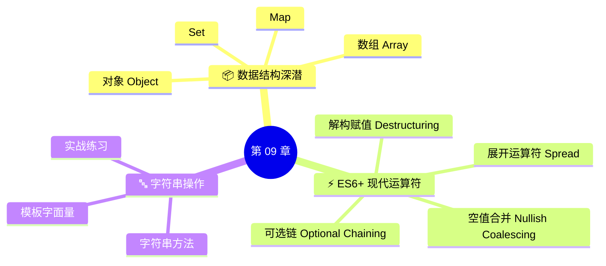

# 章节介绍

> 📺 来源：001 Section Intro.en.srt
> 📂 章节：第 09 章 — 数据结构、现代运算符与字符串

## 🎯 概述

在完成了较长的理论章节之后，本章将继续学习 JavaScript 的核心特性和语法，但这次重点放在**现代 JavaScript（Modern JavaScript）** 上。

## 📌 本章学习路线

本章将深入探讨以下三大核心板块：

### 🗺️ 章节知识要点

| 板块 | 核心内容 | 重要程度 |
|------|---------|:-------:|
| 📦 内置数据结构 | 深入对象（Object）、映射（Map）和数组（Array） | ⭐⭐⭐⭐⭐ |
| ⚡ ES6+ 运算符 | 解构（Destructuring）、可选链（Optional Chaining）等 | ⭐⭐⭐⭐⭐ |
| 🔤 字符串处理 | 字符串方法和实际应用 | ⭐⭐⭐⭐ |

> 💡 这些知识将为后续章节和项目提供坚实而重要的基础。
