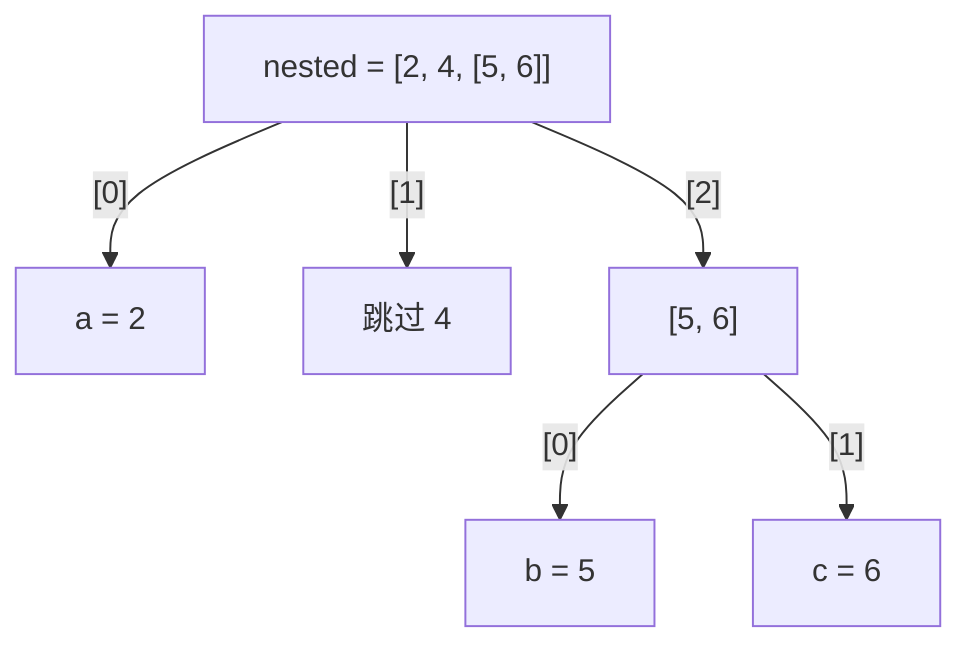
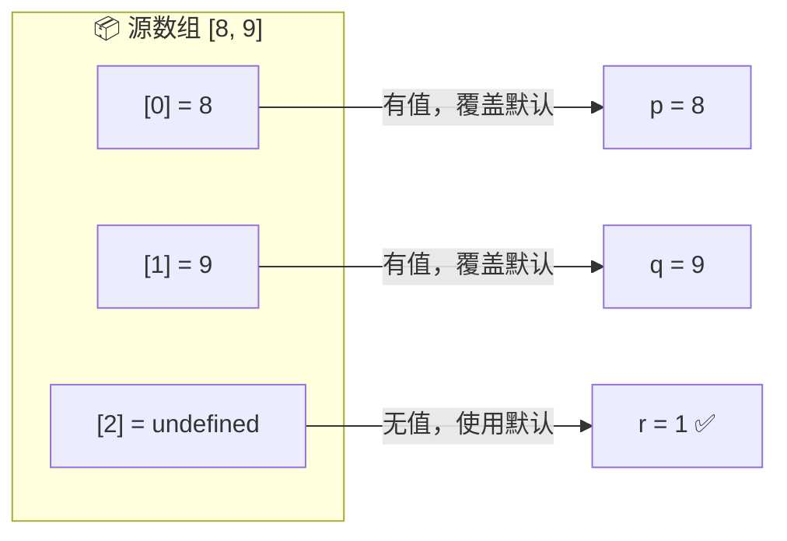
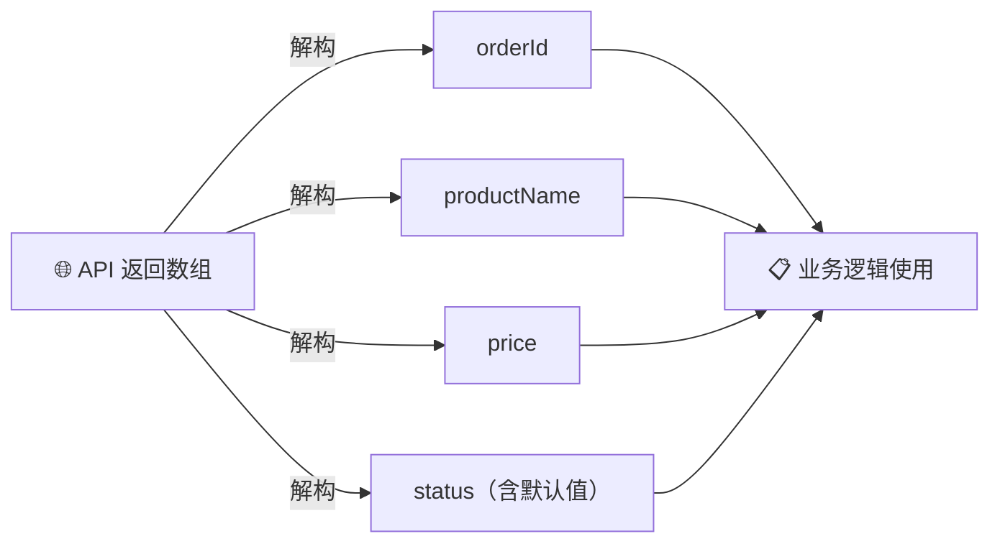

# 解构数组（Destructuring Arrays）

> 📺 来源：003 Destructuring Arrays.en.srt
> 📂 章节：第 09 章

## 📌 知识脉络
- **前置知识**：数组基础（创建、索引访问）、`const` / `let` 声明、函数返回值
- **后续扩展**：解构对象（Destructuring Objects）、展开运算符（Spread Operator）、Rest 参数模式

## 🎯 概述

解构赋值（Destructuring Assignment）是 ES6 引入的一种语法，允许我们将数组中的元素一次性拆分到独立变量中。本节涵盖基础解构、跳过元素、交换变量、从函数返回多值、嵌套解构以及默认值设定。

## 核心知识点

### 1. 基础数组解构

> 🧩 **生活类比**：就像拆开一个包裹盒——盒子里按顺序放着三件物品，你一口气把它们分别放到三个架子上，而不是一件一件取出再放。

没有解构时，我们需要逐一索引访问：

```js
const arr = [2, 3, 4];
const a = arr[0]; // 2
const b = arr[1]; // 3
const c = arr[2]; // 4
```

有了解构赋值，一行搞定：

```js {runnable} {title="destructuring_basic.js"}
const arr = [2, 3, 4];
const [x, y, z] = arr; // x=2, y=3, z=4
console.log(x, y, z); // 2 3 4
```

```mermaid
flowchart LR
    subgraph 📦 原始数组
        A0["arr[0] = 2"]
        A1["arr[1] = 3"]
        A2["arr[2] = 4"]
    end
    A0 -->|解构| X["x = 2"]
    A1 -->|解构| Y["y = 3"]
    A2 -->|解构| Z["z = 4"]
```

> ⚠️ **注意**：解构并不会修改原始数组，它只是将值**复制**到新变量中。

**🔍 执行追踪：**

| 步骤 | 操作 | `x` | `y` | `z` |
|------|------|-----|-----|-----|
| ① | `const [x, y, z] = arr` | `2` | `3` | `4` |

> 💡 **记忆口诀**：**左方括号 = 解构，右方括号 = 数组字面量**。看到 `=` 左边有 `[]`，就是在解构。

---

### 2. 跳过元素

如果只需要数组中的部分元素，可以用逗号占位来**跳过**不需要的位置：

```js {runnable} {title="skip_elements.js"}
const restaurant = {
  categories: ['Italian', 'Pizzeria', 'Vegetarian', 'Organic'],
};

const [first, , third] = restaurant.categories;
console.log(first, third); // "Italian" "Vegetarian"
```

> 🧩 **生活类比**：排队领取三份文件，你只想要第 1 份和第 3 份，中间那份直接跳过不拿。

---

### 3. 交换变量（Switching Variables）

> 🧩 **生活类比**：两个人互换座位——传统方法需要一把空椅子做中转，解构直接互换。

**传统方式**（需要临时变量）：

```js
let main = 'Italian';
let secondary = 'Vegetarian';

const temp = main;
main = secondary;
secondary = temp;
```

**解构方式**（优雅一行）：

```js {runnable} {title="swap_variables.js"}
let main = 'Italian';
let secondary = 'Vegetarian';

[main, secondary] = [secondary, main]; // 直接交换！
console.log(main);      // "Vegetarian"
console.log(secondary);  // "Italian"
```

:::code-comparison
```js {title="🚨 传统交换（需要临时变量）"}
const temp = main;
main = secondary;
secondary = temp;
```
```js {title="✨ 解构交换（一行搞定）"}
[main, secondary] = [secondary, main];
```
:::

```mermaid
flowchart LR
    subgraph 🔃 交换过程
        S1["secondary = 'Vegetarian'"] --> NEW_ARR["[secondary, main]"]
        M1["main = 'Italian'"] --> NEW_ARR
        NEW_ARR -->|解构| M2["main = 'Vegetarian'"]
        NEW_ARR -->|解构| S2["secondary = 'Italian'"]
    end
```

> ⚠️ 交换时不使用 `let` / `const`，因为是**重新赋值**已有变量，不是声明新变量。

---

### 4. 从函数返回多值

函数可以返回数组，调用时立即解构，实现"一个函数返回多个值"的效果：

```js {runnable} {title="function_return.js"}
const restaurant = {
  starterMenu: ['Focaccia', 'Bruschetta', 'Garlic Bread', 'Caprese Salad'],
  mainMenu: ['Pizza', 'Pasta', 'Risotto'],
  // 方法：根据索引下单
  order(starterIndex, mainIndex) {
    return [this.starterMenu[starterIndex], this.mainMenu[mainIndex]];
  },
};

const [starter, mainCourse] = restaurant.order(2, 0);
console.log(starter, mainCourse); // "Garlic Bread" "Pizza"
```

```mermaid
sequenceDiagram
    participant 调用者
    participant restaurant.order()
    调用者->>restaurant.order(): order(2, 0)
    restaurant.order()-->>调用者: ["Garlic Bread", "Pizza"]
    Note over 调用者: 解构为 starter 和 mainCourse
```

---

### 5. 嵌套解构（Nested Destructuring）

数组中包含数组时，可以在解构中再次使用 `[]` 进行**嵌套解构**：

```js {runnable} {title="nested_destructuring.js"}
const nested = [2, 4, [5, 6]];

// 取出 2 和内部数组 [5, 6]（跳过 4）
const [i, , j] = nested;
console.log(i, j); // 2 [5, 6]

// 嵌套解构：直接取出内部值
const [a, , [b, c]] = nested;
console.log(a, b, c); // 2 5 6
```



**🔍 执行追踪：**

| 步骤 | 表达式 | `a` | `b` | `c` |
|------|--------|-----|-----|-----|
| ① | `const [a, , [b, c]] = nested` | `2` | `5` | `6` |

---

### 6. 默认值（Default Values）

当数组长度不确定时（例如从 API 获取数据），可以为解构变量设置默认值，防止出现 `undefined`：

```js {runnable} {title="default_values.js"}
const [p = 1, q = 1, r = 1] = [8, 9];
console.log(p, q, r); // 8 9 1
// r 没有对应元素，使用默认值 1
```



**🔍 执行追踪：**

| 步骤 | `p`（默认=1） | `q`（默认=1） | `r`（默认=1） |
|------|:---:|:---:|:---:|
| 解构 `[8, 9]` | `8` ← 覆盖 | `9` ← 覆盖 | `1` ← 保持默认 |

> 💡 **记忆口诀**：**有值用实值，无值用默认**。默认值只在解构位置为 `undefined` 时生效。

---

## 🛠️ 代码实战与真实场景

> **💼 业务场景**：电商平台从 API 获取订单数据，需要快速提取关键字段。

```js {runnable} {title="real_world_order.js"}
// 模拟 API 返回的订单数据
function getOrderData() {
  return ['ORD-2024-001', 'MacBook Pro', 12999, 'pending'];
}

// 解构提取关键信息
const [orderId, productName, price, status = 'unknown'] = getOrderData();

console.log(`订单号: ${orderId}`);    // "订单号: ORD-2024-001"
console.log(`商品: ${productName}`);   // "商品: MacBook Pro"
console.log(`价格: ¥${price}`);        // "价格: ¥12999"
console.log(`状态: ${status}`);        // "状态: pending"
```



**📊 输入输出示例：**

| API 返回值 | `orderId` | `productName` | `price` | `status` |
|-----------|-----------|---------------|---------|----------|
| `['ORD-001', 'iPhone', 7999, 'shipped']` | `'ORD-001'` | `'iPhone'` | `7999` | `'shipped'` |
| `['ORD-002', 'AirPods', 1299]` | `'ORD-002'` | `'AirPods'` | `1299` | `'unknown'`（默认值） |

---

## 💡 关键要点
- ✅ 解构赋值用 `[a, b, c] = array` 语法一次性从数组提取多个值
- ✅ 跳过不需要的元素，只需在对应位置留空（逗号占位）
- ✅ 交换变量：`[a, b] = [b, a]` — 无需临时变量
- ✅ 函数返回数组后立即解构 = 一个函数返回多个值
- ✅ 嵌套解构：`[a, [b, c]] = [1, [2, 3]]` 可以穿透多层数组

## ⚠️ 常见误区
- ⚠️ **误用 `const` 重新赋值**：交换变量时不能用 `const`（因为是重新赋值），初始声明必须用 `let`
- ⚠️ **忘记跳过元素的逗号**：`const [a, b] = [1, 2, 3]` 只取前两个，但 `const [a, , b] = [1, 2, 3]` 取的是第 1 和第 3 个
- ⚠️ **混淆解构与数组创建**：`=` 左边的 `[]` 是解构模式，右边的 `[]` 才是数组字面量

## 🐛 报错实验室

**❌ 错误写法：**
```js
const [a, b] = [1, 2];
[a, b] = [b, a]; // ❌ TypeError: Assignment to constant variable
```
**浏览器报错：**
```
Uncaught TypeError: Assignment to constant variable.
```
**🔑 解读**：用 `const` 声明的变量不可重新赋值。若需交换，初始声明时用 `let`。

---

## 📖 词汇速查表 (Cheat Sheet)

| 中文术语 | 英文术语 | 简明释义 | 速查代码 | 📚 官方文档 |
|---------|---------|---------|---------|-----------|
| 解构赋值 | Destructuring Assignment | 从数组/对象中提取值赋给变量 | `const [a, b] = [1, 2]` | [MDN](https://developer.mozilla.org/zh-CN/docs/Web/JavaScript/Reference/Operators/Destructuring_assignment) |
| 默认值 | Default Value | 解构时对应位置无值则使用的备用值 | `const [a = 0] = []` | [MDN](https://developer.mozilla.org/zh-CN/docs/Web/JavaScript/Reference/Operators/Destructuring_assignment#默认值) |
| 嵌套解构 | Nested Destructuring | 多层数组/对象的深度解构 | `const [a, [b]] = [1, [2]]` | [MDN](https://developer.mozilla.org/zh-CN/docs/Web/JavaScript/Reference/Operators/Destructuring_assignment) |
| 模板字面量 | Template Literal | 使用反引号的字符串插值 | `` `${name}` `` | [MDN](https://developer.mozilla.org/zh-CN/docs/Web/JavaScript/Reference/Template_literals) |

---

## 🧪 学习验证

### 📝 动手练习

**练习 1：从数组中解构特定元素**
```js {runnable} {title="exercise1.js"}
const colors = ['red', 'green', 'blue', 'yellow', 'purple'];
// 请解构出第 1 个和第 3 个颜色（跳过第 2 个）
// 在这里写你的代码
```
<details><summary>💡 参考答案</summary>

```js
const colors = ['red', 'green', 'blue', 'yellow', 'purple'];
const [first, , third] = colors;
console.log(first, third); // "red" "blue"
```
**解题思路**：用逗号跳过第二个元素即可。
</details>

**练习 2：利用解构交换三个变量**
```js {runnable} {title="exercise2.js"}
let a = 'X', b = 'Y', c = 'Z';
// 请将它们循环交换为：a='Y', b='Z', c='X'
// 在这里写你的代码

console.log(a, b, c); // 应输出 "Y" "Z" "X"
```
<details><summary>💡 参考答案</summary>

```js
let a = 'X', b = 'Y', c = 'Z';
[a, b, c] = [b, c, a];
console.log(a, b, c); // "Y" "Z" "X"
```
**解题思路**：右侧构造新数组 `[b, c, a]`，左侧按顺序解构赋值。
</details>

### ❓ 理解检测

:::quiz {correct="B"}
**1. 以下代码的输出是什么？`const [x, , y] = [10, 20, 30]; console.log(x, y);`**
- A) `10 20`
- B) `10 30`
- C) `20 30`

> **解析**：中间的逗号跳过了索引 1 的元素 `20`，所以 `y` 取到的是索引 2 的 `30`。
:::

:::quiz {correct="C"}
**2. 解构赋值中默认值何时生效？**
- A) 当对应位置的值为 `null` 时
- B) 当对应位置的值为 `0` 时
- C) 当对应位置的值为 `undefined` 时

> **解析**：默认值仅在对应位置的值**严格等于 `undefined`** 时生效。`null` 和 `0` 都是合法值，不会触发默认值。
:::

:::quiz {correct="A"}
**3. 交换变量时 `[a, b] = [b, a]` 前面不需要加 `const` 或 `let` 的原因是什么？**
- A) 因为是对已有变量重新赋值，不是声明新变量
- B) 因为 JavaScript 会自动推断变量类型
- C) 因为解构赋值不需要声明关键字

> **解析**：`a` 和 `b` 已经在之前用 `let` 声明过了，这里只是重新赋值，所以不需要再用声明关键字。
:::

### 🔧 代码填空

:::fill-blank
// 嵌套解构：从 [1, [2, 3]] 中取出所有值
const [a, ___[b, c]___] = [1, [2, 3]];

// 带默认值的解构
const [x = ___0___, y = ___0___] = [42];
// x = 42, y = 0
:::
