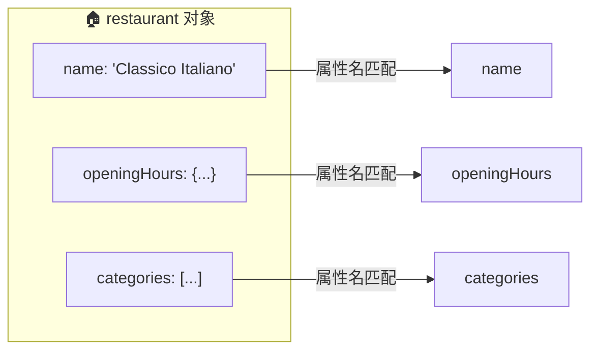
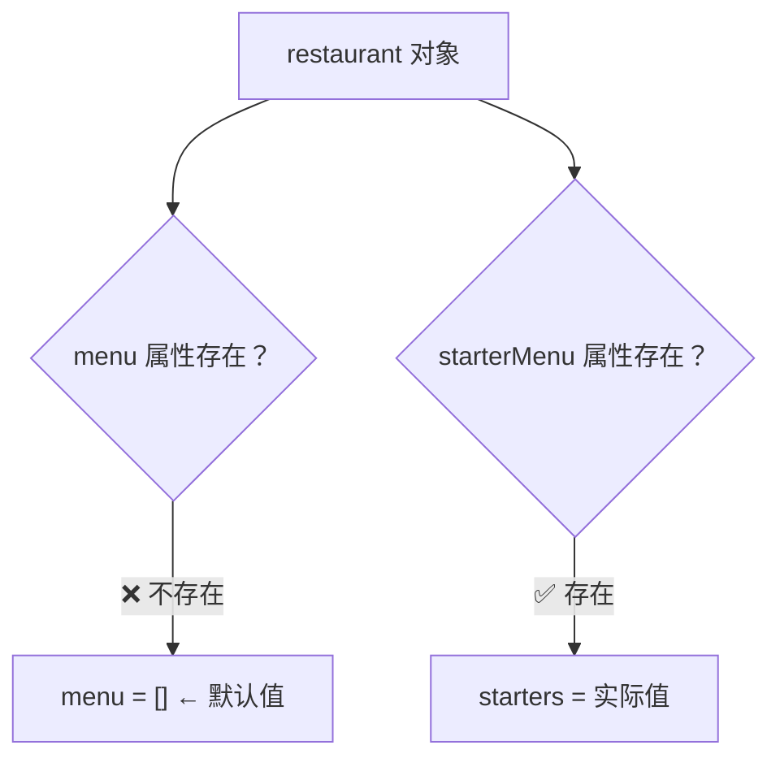
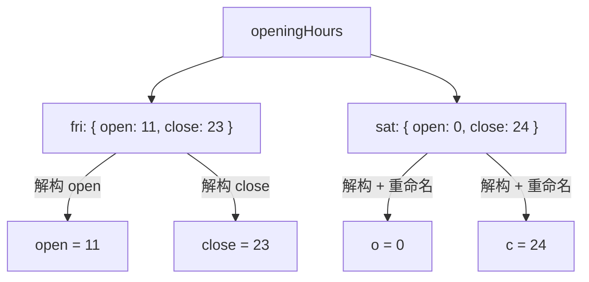
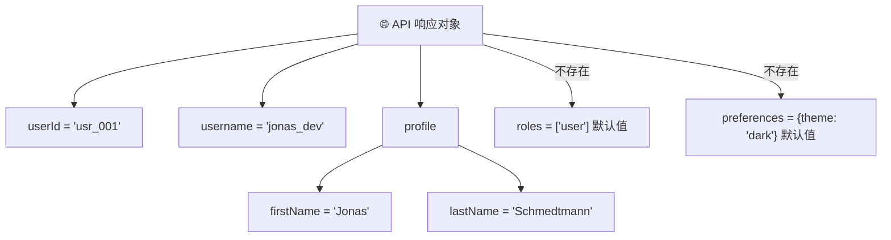

# 解构对象（Destructuring Objects）

> 📺 来源：005 Destructuring Objects.en.srt
> 📂 章节：第 09 章

## 📌 知识脉络
- **前置知识**：对象基础（创建、属性访问）、数组解构（Destructuring Arrays）、`const` / `let` 声明
- **后续扩展**：展开运算符（Spread Operator）、Rest 模式、函数参数默认值

## 🎯 概述

对象解构允许我们从对象中按照**属性名**提取值并赋给变量。与数组解构靠位置不同，对象解构靠的是属性名匹配。本节涵盖基础解构、重命名变量、默认值、变量覆盖、嵌套解构以及实用的函数参数解构技巧。

## 核心知识点

### 1. 基础对象解构

> 🧩 **生活类比**：对象解构就像快递员按照收件人姓名投递包裹——不管包裹在箱子里的顺序如何，只要名字匹配就能准确投递。

```js {runnable} {title="basic_destructuring.js"}
const restaurant = {
  name: 'Classico Italiano',
  categories: ['Italian', 'Pizzeria', 'Vegetarian', 'Organic'],
  starterMenu: ['Focaccia', 'Bruschetta', 'Garlic Bread', 'Caprese Salad'],
  mainMenu: ['Pizza', 'Pasta', 'Risotto'],
  openingHours: {
    thu: { open: 12, close: 22 },
    fri: { open: 11, close: 23 },
    sat: { open: 0, close: 24 },
  },
};

const { name, openingHours, categories } = restaurant;
console.log(name);          // "Classico Italiano"
console.log(openingHours);  // {thu: {...}, fri: {...}, sat: {...}}
console.log(categories);    // ["Italian", "Pizzeria", "Vegetarian", "Organic"]
```



> 💡 **记忆口诀**：**花括号匹配名、方括号匹配位**。对象用 `{}`，数组用 `[]`。

**🔍 执行追踪：**

| 步骤 | 操作 | 变量 | 值 |
|------|------|------|-----|
| ① | 解构 `name` | `name` | `'Classico Italiano'` |
| ② | 解构 `openingHours` | `openingHours` | `{thu: {...}, ...}` |
| ③ | 解构 `categories` | `categories` | `['Italian', ...]` |

---

### 2. 重命名变量

如果想让变量名与属性名不同，使用 `属性名: 新变量名` 语法：

```js {runnable} {title="rename_variables.js"}
const restaurant = {
  name: 'Classico Italiano',
  openingHours: { fri: { open: 11, close: 23 } },
  categories: ['Italian', 'Pizzeria'],
};

const {
  name: restaurantName,       // name → restaurantName
  openingHours: hours,        // openingHours → hours
  categories: tags,           // categories → tags
} = restaurant;

console.log(restaurantName); // "Classico Italiano"
console.log(hours);          // {fri: {open: 11, close: 23}}
console.log(tags);           // ["Italian", "Pizzeria"]
```

> 🧩 **生活类比**：就像给快递上的收件人贴一个"别名标签"——包裹按原名找到你，但你可以用自己更习惯的称呼来放置它。

---

### 3. 默认值

当属性可能不存在时，设置默认值可防止 `undefined`：

```js {runnable} {title="default_values.js"}
const restaurant = {
  name: 'Classico Italiano',
  starterMenu: ['Focaccia', 'Bruschetta'],
};

const { menu = [], starterMenu: starters = [] } = restaurant;
console.log(menu);     // []（属性不存在，使用默认值）
console.log(starters); // ["Focaccia", "Bruschetta"]（属性存在，使用实际值）
```



> 💼 **业务场景**：从 API 获取数据时，某些字段可能缺失，默认值确保代码不会因 `undefined` 崩溃。

---

### 4. 覆盖已有变量（Mutating Variables）

解构到已经存在的变量时，需要将整个表达式用 **圆括号 `()`** 包裹：

```js {runnable} {title="mutate_variables.js"}
let a = 111;
let b = 999;
const obj = { a: 23, b: 7, c: 14 };

// ❌ 错误写法：{ a, b } = obj;  — JavaScript 以为 {} 是代码块！
// ✅ 正确写法：
({ a, b } = obj);
console.log(a, b); // 23 7
```

> ⚠️ **关键点**：当一行代码以 `{` 开头时，JavaScript 会将其解释为**代码块（code block）**，而不是解构赋值。用圆括号包裹即可消除歧义。

---

### 5. 嵌套对象解构（Nested Objects）

深层嵌套的对象也可以逐层解构：

```js {runnable} {title="nested_destructuring.js"}
const restaurant = {
  openingHours: {
    fri: { open: 11, close: 23 },
    sat: { open: 0, close: 24 },
  },
};

// 从 openingHours 中取出 fri，再解构 fri 的 open 和 close
const { fri: { open, close } } = restaurant.openingHours;
console.log(open, close); // 11 23

// 还可以同时重命名
const { sat: { open: o, close: c } } = restaurant.openingHours;
console.log(o, c); // 0 24
```



---

### 6. 函数参数解构（实战级技巧）

> 🧩 **生活类比**：传一个"配置表"给函数，而不是报出一长串独立的数字——就像下单时填一份表格，而不是对服务员逐一口述每个细节。

当函数参数过多时，可以传入一个对象，并在函数定义时直接解构：

```js {runnable} {title="function_params.js"}
const restaurant = {
  starterMenu: ['Focaccia', 'Bruschetta', 'Garlic Bread', 'Caprese Salad'],
  mainMenu: ['Pizza', 'Pasta', 'Risotto'],
  // 函数参数直接解构 + 默认值
  orderDelivery({ starterIndex = 1, mainIndex = 0, time = '20:00', address }) {
    console.log(
      `Order received! ${this.starterMenu[starterIndex]} and ` +
      `${this.mainMenu[mainIndex]} will be delivered to ${address} at ${time}`
    );
  },
};

// 调用时传入一个「配置对象」，顺序无所谓！
restaurant.orderDelivery({
  time: '22:30',
  address: 'Via del Sole, 21',
  mainIndex: 2,
  starterIndex: 2,
});
// "Order received! Garlic Bread and Risotto will be delivered to Via del Sole, 21 at 22:30"

// 只传部分属性，其余使用默认值
restaurant.orderDelivery({
  address: 'Via del Sole, 21',
  starterIndex: 1,
});
// "Order received! Bruschetta and Pizza will be delivered to Via del Sole, 21 at 20:00"
```

```mermaid
sequenceDiagram
    participant 调用者
    participant orderDelivery()
    调用者->>orderDelivery(): 传入 { time, address, ... }
    Note over orderDelivery(): 立即解构为独立变量<br/>缺失属性使用默认值
    orderDelivery()-->>调用者: 输出格式化字符串
```

> 💡 **核心优势**：调用者不需要记住参数顺序，属性名即文档！

---

## 🛠️ 代码实战与真实场景

> **💼 业务场景**：从 REST API 获取用户数据，解构提取需要的字段并设置默认值。

```js {runnable} {title="api_data_extraction.js"}
// 模拟 API 返回的用户对象
const apiResponse = {
  id: 'usr_001',
  username: 'jonas_dev',
  email: 'jonas@example.com',
  profile: {
    firstName: 'Jonas',
    lastName: 'Schmedtmann',
    avatar: 'https://example.com/avatar.jpg',
  },
  // 注意：roles 和 preferences 可能不存在
};

// 解构 + 重命名 + 默认值 + 嵌套
const {
  id: userId,
  username,
  profile: { firstName, lastName, avatar },
  roles = ['user'],              // 默认角色
  preferences = { theme: 'dark' } // 默认偏好
} = apiResponse;

console.log(`用户: ${firstName} ${lastName}`);
console.log(`ID: ${userId}`);
console.log(`角色: ${roles}`);           // ["user"] ← 默认值
console.log(`主题: ${preferences.theme}`); // "dark" ← 默认值
```



**📊 输入输出示例：**

| 传入属性 | 变量 | 值 | 来源 |
|---------|------|-----|------|
| `id: 'usr_001'` | `userId` | `'usr_001'` | 实际值 + 重命名 |
| `profile.firstName` | `firstName` | `'Jonas'` | 嵌套解构 |
| （不存在） | `roles` | `['user']` | 默认值 |

---

## 💡 关键要点
- ✅ 对象解构使用 `{ 属性名 }` 语法，按名匹配而非按位
- ✅ 重命名：`{ oldName: newName }` — 冒号后是新变量名
- ✅ 默认值：`{ prop = 默认值 }` — 属性不存在时启用
- ✅ 覆盖已有变量时需用 `()` 包裹整个表达式
- ✅ 函数参数解构 = 传入对象 + 在参数位直接解构

## ⚠️ 常见误区
- ⚠️ **大括号开头被当作代码块**：已有变量赋值时忘记加圆括号 `({ a, b } = obj)` 会报语法错误
- ⚠️ **混淆重命名与默认值语法**：`{ a: b }` 是重命名（a → b），`{ a = 5 }` 是默认值。两者可组合：`{ a: b = 5 }`

## 🐛 报错实验室

**❌ 错误写法：**
```js
let a = 1, b = 2;
const obj = { a: 10, b: 20 };
{ a, b } = obj; // ❌ SyntaxError
```
**浏览器报错：**
```
Uncaught SyntaxError: Unexpected token '='
```
**🔑 解读**：JavaScript 将 `{` 解释为代码块的开始，而代码块不能跟 `=` 赋值。解决方案：用圆括号包裹 `({ a, b } = obj)`。

---

## 📖 词汇速查表 (Cheat Sheet)

| 中文术语 | 英文术语 | 简明释义 | 速查代码 | 📚 官方文档 |
|---------|---------|---------|---------|-----------|
| 对象解构 | Object Destructuring | 从对象中按属性名提取值 | `const { a, b } = obj` | [MDN](https://developer.mozilla.org/zh-CN/docs/Web/JavaScript/Reference/Operators/Destructuring_assignment#对象解构) |
| 属性重命名 | Property Renaming | 解构时给变量起别名 | `{ name: n } = obj` | [MDN](https://developer.mozilla.org/zh-CN/docs/Web/JavaScript/Reference/Operators/Destructuring_assignment#赋值给新的变量名) |
| 嵌套解构 | Nested Destructuring | 多层对象逐层解构 | `{ a: { b } } = obj` | [MDN](https://developer.mozilla.org/zh-CN/docs/Web/JavaScript/Reference/Operators/Destructuring_assignment) |
| 默认值 | Default Value | 属性不存在时的备用值 | `{ a = 0 } = obj` | [MDN](https://developer.mozilla.org/zh-CN/docs/Web/JavaScript/Reference/Operators/Destructuring_assignment#默认值_2) |

---

## 🧪 学习验证

### 📝 动手练习

**练习 1：从对象中解构并重命名**
```js {runnable} {title="exercise1.js"}
const book = {
  title: 'JavaScript: The Good Parts',
  author: 'Douglas Crockford',
  year: 2008,
  publisher: { name: "O'Reilly", city: 'Sebastopol' },
};
// 请解构出 title（重命名为 bookTitle）、author、publisher.city（重命名为 pubCity）
// 在这里写你的代码
```
<details><summary>💡 参考答案</summary>

```js
const {
  title: bookTitle,
  author,
  publisher: { city: pubCity },
} = book;
console.log(bookTitle); // "JavaScript: The Good Parts"
console.log(author);    // "Douglas Crockford"
console.log(pubCity);   // "Sebastopol"
```
**解题思路**：用 `:` 进行重命名，嵌套对象用 `{ 外层: { 内层 } }` 解构。
</details>

**练习 2：编写一个接受配置对象的函数**
```js {runnable} {title="exercise2.js"}
// 编写 createUser 函数，参数为一个配置对象
// 要求：name 必填，age 默认 18，role 默认 'viewer'
function createUser(/* 在这里用解构接收参数 */) {
  console.log(`${name}, ${age}岁, 角色: ${role}`);
}

createUser({ name: 'Alice', age: 25, role: 'admin' });
// 应输出: "Alice, 25岁, 角色: admin"

createUser({ name: 'Bob' });
// 应输出: "Bob, 18岁, 角色: viewer"
```
<details><summary>💡 参考答案</summary>

```js
function createUser({ name, age = 18, role = 'viewer' }) {
  console.log(`${name}, ${age}岁, 角色: ${role}`);
}
createUser({ name: 'Alice', age: 25, role: 'admin' }); // "Alice, 25岁, 角色: admin"
createUser({ name: 'Bob' });                            // "Bob, 18岁, 角色: viewer"
```
**解题思路**：在函数参数位置直接解构传入的对象，并用 `= 默认值` 设置各属性的默认值。
</details>

### ❓ 理解检测

:::quiz {correct="C"}
**1. 以下代码的输出是什么？**
```js
const { a: x = 10, b: y = 20 } = { a: 5 };
console.log(x, y);
```
- A) `5 undefined`
- B) `10 20`
- C) `5 20`

> **解析**：`a` 存在值 `5`，所以 `x = 5`（不用默认值）。`b` 不存在，`y` 使用默认值 `20`。
:::

:::quiz {correct="B"}
**2. 覆盖已有变量的对象解构为什么需要用圆括号？**
- A) 因为圆括号可以提升解构性能
- B) 因为 `{` 开头会被 JavaScript 解释为代码块
- C) 因为 `let` 和 `const` 不允许重新赋值

> **解析**：JavaScript 解析器在看到行首的 `{` 时会将其当作代码块的开始，加上 `()` 后表达式语境下 `{` 被正确解析为解构。
:::

:::quiz {correct="A"}
**3. 函数参数解构的最大优势是什么？**
- A) 调用者不需要记住参数顺序
- B) 可以减少函数的执行时间
- C) 可以自动校验参数类型

> **解析**：传入对象后按属性名匹配，调用者无需关心参数定义的顺序，可读性极强。
:::

### 🔧 代码填空

:::fill-blank
// 对象解构 + 重命名 + 默认值
const { name: ___userName___, age ___= 18___ } = { name: 'Alice' };

// 嵌套对象解构
const { address: { ___city___ } } = { address: { city: 'Shanghai' } };
:::
