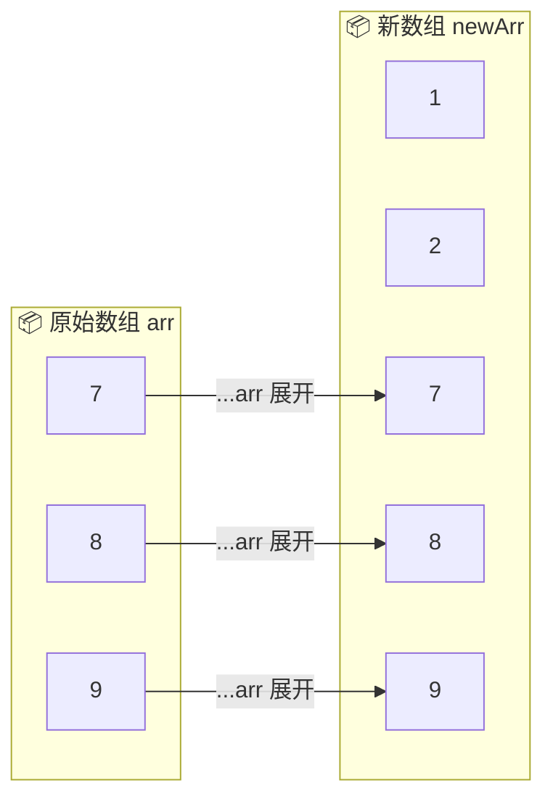
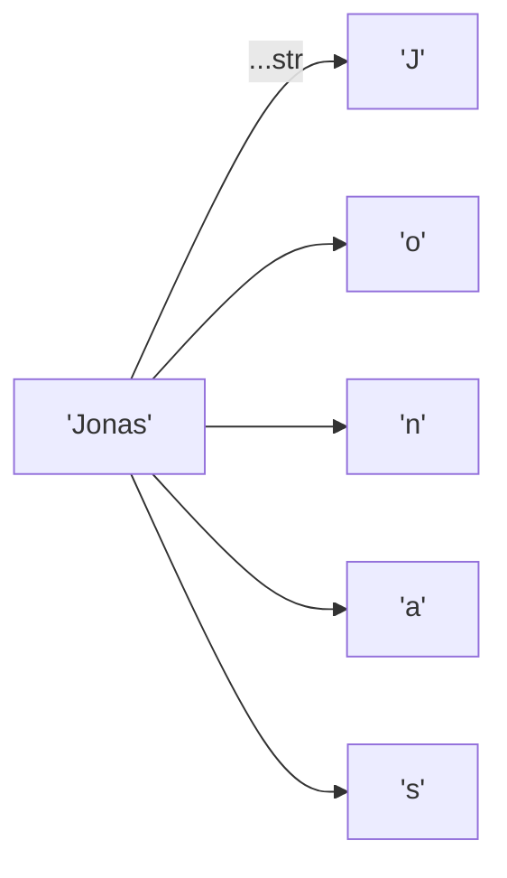
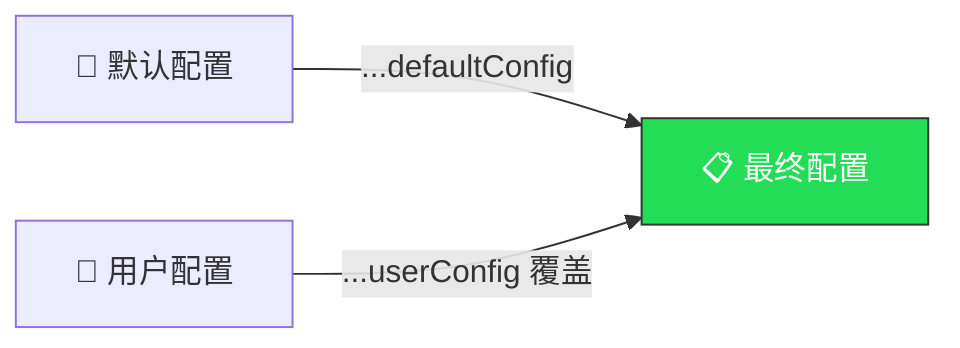

# 展开运算符（The Spread Operator `...`）

> 📺 来源：006 The Spread Operator (...).en.srt
> 📂 章节：第 09 章

## 📌 知识脉络
- **前置知识**：数组基础（创建、合并）、函数参数传递、解构赋值（Destructuring）
- **后续扩展**：剩余模式（Rest Pattern）、对象浅拷贝、迭代器与可迭代对象（Iterables）

## 🎯 概述

展开运算符（Spread Operator）`...` 可以将数组或其他可迭代对象"展开"为独立的元素。它既可以用于构建新数组，也可以将多个参数传入函数。ES2018 起还支持展开对象属性。

## 核心知识点

### 1. 展开数组元素

> 🧩 **生活类比**：展开运算符就像拆开一盒糖果，把每颗糖单独摆在桌上——盒子（数组）本身不变，但每颗糖（元素）被独立取出来了。

**传统方式**（手动取出元素）：

```js
const arr = [7, 8, 9];
const badNewArr = [1, 2, arr[0], arr[1], arr[2]]; // 繁琐！
```

**展开运算符**（一步到位）：

```js {runnable} {title="spread_basic.js"}
const arr = [7, 8, 9];
const newArr = [1, 2, ...arr]; // 展开 arr 的所有元素
console.log(newArr); // [1, 2, 7, 8, 9]

// 打印独立元素（非数组形式）
console.log(...newArr); // 1 2 7 8 9
```



:::code-comparison
```js {title="🚨 手动取出元素"}
const badNewArr = [1, 2, arr[0], arr[1], arr[2]];
```
```js {title="✨ 展开运算符（一行搞定）"}
const newArr = [1, 2, ...arr];
```
:::

**🔍 执行追踪：**

| 表达式 | 结果 |
|--------|------|
| `[1, 2, ...arr]` | `[1, 2, 7, 8, 9]` |
| `console.log(...newArr)` | `1 2 7 8 9`（独立参数） |

> 💡 **记忆口诀**：`...` 在 `=` **右边** = **展开**（拆箱），在 `=` **左边** = **收集**（装箱，即 Rest 模式）。

---

### 2. 拷贝数组（浅拷贝）

展开运算符可以用来创建数组的浅拷贝（Shallow Copy）：

```js {runnable} {title="copy_array.js"}
const mainMenu = ['Pizza', 'Pasta', 'Risotto'];
const mainMenuCopy = [...mainMenu]; // 浅拷贝

mainMenuCopy.push('Gnocci');
console.log(mainMenu);     // ["Pizza", "Pasta", "Risotto"] — 原数组不受影响
console.log(mainMenuCopy); // ["Pizza", "Pasta", "Risotto", "Gnocci"]
```

---

### 3. 合并数组

```js {runnable} {title="merge_arrays.js"}
const starterMenu = ['Focaccia', 'Bruschetta', 'Garlic Bread'];
const mainMenu = ['Pizza', 'Pasta', 'Risotto'];

const fullMenu = [...starterMenu, ...mainMenu];
console.log(fullMenu);
// ["Focaccia", "Bruschetta", "Garlic Bread", "Pizza", "Pasta", "Risotto"]
```

---

### 4. 展开字符串

字符串也是可迭代对象（Iterable），因此可以展开为单个字符：

```js {runnable} {title="spread_string.js"}
const str = 'Jonas';
const letters = [...str, ' ', 'S.'];
console.log(letters); // ["J", "o", "n", "a", "s", " ", "S."]
console.log(...str);  // J o n a s
```



> ⚠️ 展开运算符只能在**构建数组**或**传入函数参数**时使用，不能在模板字面量 `` `${...str}` `` 中使用。

**📊 可迭代对象速查：**

| 类型 | 可迭代？ | 可展开？ |
|------|:-------:|:-------:|
| 数组（Array） | ✅ | ✅ |
| 字符串（String） | ✅ | ✅ |
| Map | ✅ | ✅ |
| Set | ✅ | ✅ |
| 对象（Object） | ❌ | ✅（ES2018+） |

---

### 5. 函数参数传递

展开运算符的核心用途之一是将数组元素作为独立参数传入函数：

```js {runnable} {title="function_args.js"}
const restaurant = {
  orderPasta(ing1, ing2, ing3) {
    console.log(`Here is your delicious pasta with ${ing1}, ${ing2}, and ${ing3}`);
  },
};

const ingredients = ['mushrooms', 'asparagus', 'cheese'];

// 传统方式
restaurant.orderPasta(ingredients[0], ingredients[1], ingredients[2]);

// 展开运算符方式
restaurant.orderPasta(...ingredients);
// 两者输出相同："Here is your delicious pasta with mushrooms, asparagus, and cheese"
```

```mermaid
sequenceDiagram
    participant 调用者
    participant orderPasta()
    Note over 调用者: ingredients = ['mushrooms', 'asparagus', 'cheese']
    调用者->>orderPasta(): ...ingredients 展开为 3 个独立参数
    Note over orderPasta(): ing1='mushrooms', ing2='asparagus', ing3='cheese'
    orderPasta()-->>调用者: 格式化输出
```

---

### 6. 展开对象（ES2018+）

ES2018 起，展开运算符也能用于对象——即使对象不是可迭代的：

```js {runnable} {title="spread_objects.js"}
const restaurant = {
  name: 'Classico Italiano',
  mainMenu: ['Pizza', 'Pasta', 'Risotto'],
};

// 创建新对象 = 展开旧对象 + 新属性
const newRestaurant = { foundedIn: 1998, ...restaurant, founder: 'Giuseppe' };
console.log(newRestaurant);
// {foundedIn: 1998, name: "Classico Italiano", mainMenu: [...], founder: "Giuseppe"}

// 对象浅拷贝
const restaurantCopy = { ...restaurant };
restaurantCopy.name = 'Ristorante Roma';
console.log(restaurant.name);     // "Classico Italiano" — 原对象不受影响
console.log(restaurantCopy.name); // "Ristorante Roma"
```

> 💡 对象的展开运算符替代了以前的 `Object.assign({}, obj)` 语法，更简洁直观。

---

## 🛠️ 代码实战与真实场景

> **💼 业务场景**：构建一个用户配置合并系统——将默认设置与用户自定义设置合并。

```js {runnable} {title="config_merge.js"}
// 默认配置
const defaultConfig = {
  theme: 'light',
  fontSize: 14,
  language: 'zh-CN',
  notifications: true,
};

// 用户自定义配置（覆盖部分默认值）
const userConfig = {
  theme: 'dark',
  fontSize: 16,
};

// 合并：用户配置覆盖默认配置
const finalConfig = { ...defaultConfig, ...userConfig };
console.log(finalConfig);
// { theme: 'dark', fontSize: 16, language: 'zh-CN', notifications: true }
```



**📊 输入输出示例：**

| 属性 | 默认值 | 用户值 | 最终值 | 说明 |
|------|--------|--------|--------|------|
| `theme` | `'light'` | `'dark'` | `'dark'` | 用户覆盖 |
| `fontSize` | `14` | `16` | `16` | 用户覆盖 |
| `language` | `'zh-CN'` | — | `'zh-CN'` | 保留默认 |
| `notifications` | `true` | — | `true` | 保留默认 |

---

## 💡 关键要点
- ✅ `...` 将可迭代对象展开为独立元素
- ✅ 两种使用场景：构建新数组 `[...arr]`、传入函数参数 `fn(...arr)`
- ✅ 可用于浅拷贝数组和对象
- ✅ ES2018+ 支持展开对象属性（`{ ...obj }`）
- ✅ 对象展开时，后面的属性会覆盖前面的同名属性

## ⚠️ 常见误区
- ⚠️ **展开 ≠ 深拷贝**：展开运算符只做**浅拷贝**，嵌套对象仍然共享引用
- ⚠️ **不能在模板字面量中使用**：`` `${...arr}` `` 会报错，模板字面量不是"逗号分隔值"的上下文

## 🐛 报错实验室

**❌ 错误写法：**
```js
const str = 'Hello';
console.log(`Letters: ${...str}`); // ❌ SyntaxError
```
**浏览器报错：**
```
Uncaught SyntaxError: Unexpected token '...'
```
**🔑 解读**：模板字面量中 `${}` 内只能放表达式，不能展开。要拼接字符，先用 `[...str].join(', ')`。

---

## 📖 词汇速查表 (Cheat Sheet)

| 中文术语 | 英文术语 | 简明释义 | 速查代码 | 📚 官方文档 |
|---------|---------|---------|---------|-----------|
| 展开运算符 | Spread Operator | 将可迭代对象展开为独立元素 | `[...arr]` | [MDN](https://developer.mozilla.org/zh-CN/docs/Web/JavaScript/Reference/Operators/Spread_syntax) |
| 可迭代对象 | Iterable | 可被 `for...of` 遍历的对象 | 数组、字符串、Map、Set | [MDN](https://developer.mozilla.org/zh-CN/docs/Web/JavaScript/Reference/Iteration_protocols) |
| 浅拷贝 | Shallow Copy | 仅复制顶层属性，嵌套引用共享 | `{...obj}` | [MDN](https://developer.mozilla.org/zh-CN/docs/Glossary/Shallow_copy) |

---

## 🧪 学习验证

### 📝 动手练习

**练习 1：用展开运算符合并两个数组并添加新元素**
```js {runnable} {title="exercise1.js"}
const fruits = ['🍎', '🍊', '🍋'];
const veggies = ['🥕', '🥦', '🌽'];
// 创建新数组 allFood：先放所有水果，再加 '🍕'，再放所有蔬菜
// 在这里写你的代码
```
<details><summary>💡 参考答案</summary>

```js
const allFood = [...fruits, '🍕', ...veggies];
console.log(allFood); // ["🍎", "🍊", "🍋", "🍕", "🥕", "🥦", "🌽"]
```
**解题思路**：用 `...` 分别展开两个数组，中间插入新元素。
</details>

**练习 2：用展开运算符实现对象的不可变更新**
```js {runnable} {title="exercise2.js"}
const user = { name: 'Alice', age: 25, role: 'viewer' };
// 创建 updatedUser：保留原有属性，但将 role 改为 'admin'，增加 lastLogin
// 在这里写你的代码
```
<details><summary>💡 参考答案</summary>

```js
const updatedUser = { ...user, role: 'admin', lastLogin: '2024-01-15' };
console.log(updatedUser);
// { name: 'Alice', age: 25, role: 'admin', lastLogin: '2024-01-15' }
console.log(user.role); // 'viewer' — 原对象未被修改
```
**解题思路**：展开原对象后，后写的同名属性会覆盖前面的值，实现不可变更新。
</details>

### ❓ 理解检测

:::quiz {correct="B"}
**1. 以下哪项不是可迭代对象（Iterable）？**
- A) 字符串
- B) 普通对象
- C) Set

> **解析**：普通对象（Object）不是可迭代对象，不能被 `for...of` 遍历。但 ES2018+ 允许在 `{...}` 中展开对象属性。
:::

:::quiz {correct="C"}
**2. `console.log(...[1, 2, 3])` 的输出是什么？**
- A) `[1, 2, 3]`
- B) `"1,2,3"`
- C) `1 2 3`

> **解析**：展开运算符将数组元素作为**独立参数**传入 `console.log`，相当于 `console.log(1, 2, 3)`。
:::

:::quiz {correct="A"}
**3. 展开运算符做的是浅拷贝还是深拷贝？**
- A) 浅拷贝
- B) 深拷贝
- C) 取决于数据类型

> **解析**：展开运算符只复制顶层属性。如果属性值是对象/数组，拷贝的是引用而非内容。
:::

### 🔧 代码填空

:::fill-blank
// 展开数组为函数参数
const nums = [3, 7, 1, 9];
const max = Math.max(___...nums___);

// 展开对象并覆盖属性
const config = { theme: 'light', lang: 'en' };
const newConfig = { ___...config___, theme: 'dark' };
:::
