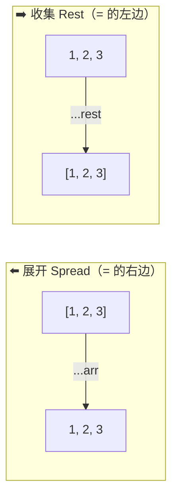
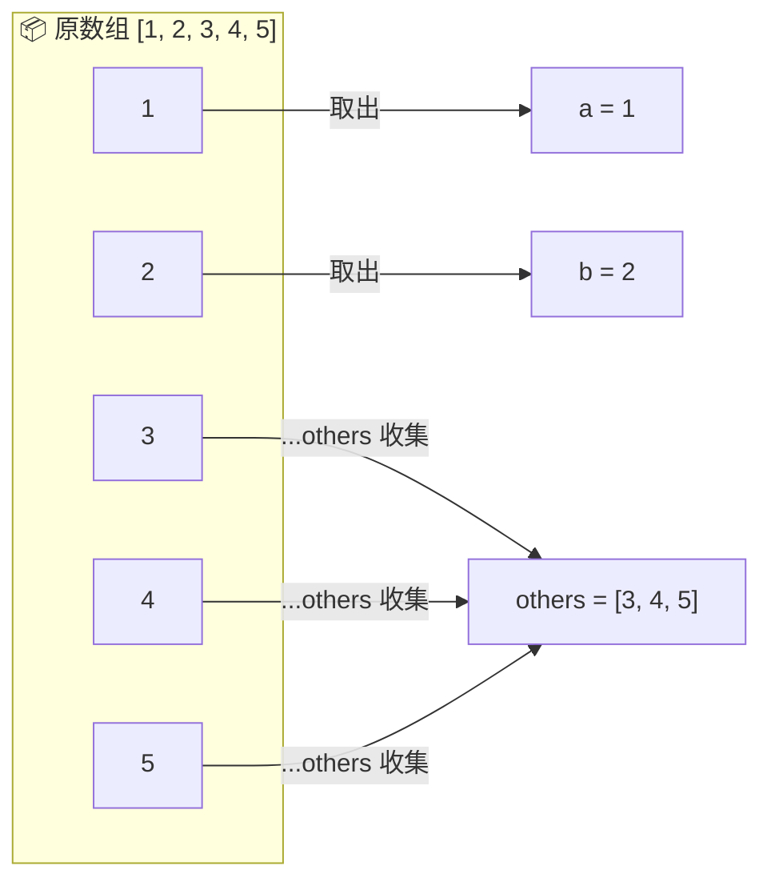
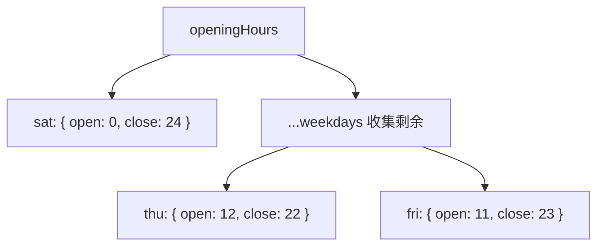
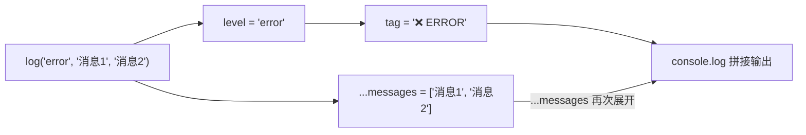

# 剩余模式与剩余参数（Rest Pattern and Parameters）

> 📺 来源：007 Rest Pattern and Parameters.en.srt
> 📂 章节：第 09 章

## 📌 知识脉络
- **前置知识**：展开运算符（Spread Operator）、数组/对象解构、函数参数
- **后续扩展**：短路求值（Short Circuiting）、`for...of` 循环、高阶函数中的回调参数

## 🎯 概述

Rest 模式的语法与展开运算符相同（都是 `...`），但作用完全相反：展开是**拆箱**（把数组/对象元素展开为独立值），Rest 是**装箱**（把剩余的独立值收集为数组/对象）。本节涵盖解构中的 Rest 模式和函数中的剩余参数（Rest Parameters）。

## 核心知识点

### 1. Spread vs Rest — 方向相反

> 🧩 **生活类比**：展开运算符像是把一袋糖果倒在桌上（拆开包装），Rest 模式像是把桌上剩下的糖果全部扫进一个新袋子里（收集打包）。



> 💡 **记忆口诀**：`...` 在赋值号 `=` **右边** = 展开（Spread），在 `=` **左边** = 收集（Rest）。

---

### 2. 数组解构中的 Rest 模式

Rest 模式收集解构后"剩余"的所有元素到一个新数组中：

```js {runnable} {title="rest_array.js"}
const [a, b, ...others] = [1, 2, 3, 4, 5];
console.log(a);      // 1
console.log(b);      // 2
console.log(others); // [3, 4, 5] — 剩余元素被收集
```



**🔍 执行追踪：**

| 步骤 | 变量 | 值 |
|------|------|-----|
| ① | `a` | `1` |
| ② | `b` | `2` |
| ③ | `others`（Rest 收集） | `[3, 4, 5]` |

> ⚠️ Rest 元素**必须是最后一个**，而且每个解构中只能有**一个** Rest 元素。

**🔗 实际示例（结合跳过）：**

```js {runnable} {title="rest_skip.js"}
const restaurant = {
  mainMenu: ['Pizza', 'Pasta', 'Risotto'],
  starterMenu: ['Focaccia', 'Bruschetta', 'Garlic Bread', 'Caprese Salad'],
};

const [pizza, , risotto, ...otherFood] = [
  ...restaurant.mainMenu,
  ...restaurant.starterMenu,
];
console.log(pizza);     // "Pizza"
console.log(risotto);   // "Risotto"（跳过了 Pasta）
console.log(otherFood); // ["Focaccia", "Bruschetta", "Garlic Bread", "Caprese Salad"]
```

> ⚠️ Rest 不包含被跳过的元素——它只收集 Rest 位置**之后**的所有元素。

---

### 3. 对象解构中的 Rest 模式

Rest 模式同样适用于对象解构，收集剩余的**属性**到新对象中：

```js {runnable} {title="rest_object.js"}
const openingHours = {
  thu: { open: 12, close: 22 },
  fri: { open: 11, close: 23 },
  sat: { open: 0, close: 24 },
};

const { sat, ...weekdays } = openingHours;
console.log(sat);      // { open: 0, close: 24 }
console.log(weekdays); // { thu: {...}, fri: {...} } — 只剩工作日
```



---

### 4. 剩余参数（Rest Parameters）

在函数定义中使用 `...` 收集任意数量的参数到一个数组中：

```js {runnable} {title="rest_parameters.js"}
// 接受任意数量的数字并求和
const add = function (...numbers) {
  let sum = 0;
  for (let i = 0; i < numbers.length; i++) {
    sum += numbers[i];
  }
  console.log(sum);
};

add(2, 3);           // 5
add(5, 3, 7, 2);     // 17
add(8, 2, 5, 3, 2, 1, 4); // 25

// 展开数组传入 → 剩余参数收集
const x = [23, 5, 7];
add(...x); // 35 — 展开后又被 Rest 收集
```

```mermaid
sequenceDiagram
    participant 调用者
    participant add()
    Note over 调用者: x = [23, 5, 7]
    调用者->>add(): ...x 展开为 23, 5, 7
    Note over add(): ...numbers 收集为 [23, 5, 7]
    add()->>add(): 计算 sum = 23 + 5 + 7 = 35
    add()-->>调用者: 35
```

> 💡 **Spread ↔ Rest 的完美对称**：调用时用 Spread 展开数组 → 定义时用 Rest 收集回数组。

---

### 5. 必选参数 + 剩余参数

可以将第一个参数设为必选，其余收集为可选参数：

```js {runnable} {title="required_plus_rest.js"}
const restaurant = {
  orderPizza(mainIngredient, ...otherIngredients) {
    console.log(mainIngredient);
    console.log(otherIngredients);
  },
};

restaurant.orderPizza('mushrooms', 'onion', 'olives', 'spinach');
// mainIngredient: "mushrooms"
// otherIngredients: ["onion", "olives", "spinach"]

restaurant.orderPizza('mushrooms');
// mainIngredient: "mushrooms"
// otherIngredients: [] — 没有剩余参数，仍然是空数组
```

> 💼 **业务场景**：这种模式在构建灵活的 API 时非常常见——第一个参数是核心/必须的，后续参数是可选的配置项或数据。

---

## 🛠️ 代码实战与真实场景

> **💼 业务场景**：构建一个日志工具函数，第一个参数为日志级别，剩余参数为要打印的消息。

```js {runnable} {title="logger.js"}
function log(level, ...messages) {
  const prefix = {
    info: 'ℹ️ INFO',
    warn: '⚠️ WARN',
    error: '❌ ERROR',
  };
  const tag = prefix[level] || '📝 LOG';
  console.log(`[${tag}]`, ...messages);
}

log('info', '用户已登录', { userId: 42 });
// [ℹ️ INFO] 用户已登录 { userId: 42 }

log('error', '数据库连接失败', '重试次数:', 3);
// [❌ ERROR] 数据库连接失败 重试次数: 3

log('warn', '内存使用率高');
// [⚠️ WARN] 内存使用率高
```



**📊 输入输出示例：**

| 调用 | `level` | `messages` | 输出 |
|------|---------|-----------|------|
| `log('info', 'OK')` | `'info'` | `['OK']` | `[ℹ️ INFO] OK` |
| `log('error', 'fail', 404)` | `'error'` | `['fail', 404]` | `[❌ ERROR] fail 404` |

---

## 💡 关键要点
- ✅ Rest 模式（`...`）收集剩余元素到数组或对象中
- ✅ 与 Spread 语法相同，但方向相反（Spread 拆、Rest 收）
- ✅ 解构中 Rest 必须放最后，且只能有一个
- ✅ 函数的剩余参数（Rest Parameters）让函数可接受任意数量的参数
- ✅ 没有剩余元素时，Rest 收集结果为空数组 `[]`

## ⚠️ 常见误区
- ⚠️ **Rest 不在末尾**：`const [...others, last] = arr` 报语法错误——Rest 必须放最后
- ⚠️ **混淆 Spread 与 Rest**：看 `...` 在赋值号哪边——右边是展开（Spread），左边或参数位是收集（Rest）

## 🐛 报错实验室

**❌ 错误写法：**
```js
const [...first, last] = [1, 2, 3]; // ❌
```
**浏览器报错：**
```
Uncaught SyntaxError: Rest element must be last element
```
**🔑 解读**：Rest 元素必须位于解构模式的最后位置。如果需要取最后一个元素，可以用 `arr.at(-1)` 或 `arr[arr.length - 1]`。

---

## 📖 词汇速查表 (Cheat Sheet)

| 中文术语 | 英文术语 | 简明释义 | 速查代码 | 📚 官方文档 |
|---------|---------|---------|---------|-----------|
| 剩余模式 | Rest Pattern | 解构中收集剩余元素 | `const [a, ...rest] = arr` | [MDN](https://developer.mozilla.org/zh-CN/docs/Web/JavaScript/Reference/Functions/rest_parameters) |
| 剩余参数 | Rest Parameters | 函数中收集任意数量的参数 | `function f(...args) {}` | [MDN](https://developer.mozilla.org/zh-CN/docs/Web/JavaScript/Reference/Functions/rest_parameters) |
| 展开运算符 | Spread Operator | 展开可迭代对象为独立值 | `[...arr]` | [MDN](https://developer.mozilla.org/zh-CN/docs/Web/JavaScript/Reference/Operators/Spread_syntax) |

---

## 🧪 学习验证

### 📝 动手练习

**练习 1：用 Rest 模式提取首尾元素**
```js {runnable} {title="exercise1.js"}
const scores = [95, 88, 72, 64, 91, 78];
// 请解构出第一个分数（highest）和最后剩余的分数（rest）
// 然后计算 rest 的平均分
// 在这里写你的代码
```
<details><summary>💡 参考答案</summary>

```js
const [highest, ...rest] = scores;
const avg = rest.reduce((sum, s) => sum + s, 0) / rest.length;
console.log(`最高分: ${highest}, 其余平均: ${avg}`);
// "最高分: 95, 其余平均: 78.6"
```
**解题思路**：`[first, ...rest]` 取出第一个，其余全部收集到 `rest` 数组。
</details>

**练习 2：编写一个支持任意配料的汉堡函数**
```js {runnable} {title="exercise2.js"}
// 编写函数 makeBurger，第一个参数为面包类型，其余为配料
// 输出类似："全麦面包汉堡，配料：生菜, 番茄, 芝士"
// 在这里写你的代码
```
<details><summary>💡 参考答案</summary>

```js
function makeBurger(breadType, ...toppings) {
  console.log(`${breadType}汉堡，配料：${toppings.join(', ')}`);
}
makeBurger('全麦面包', '生菜', '番茄', '芝士');
// "全麦面包汉堡，配料：生菜, 番茄, 芝士"
makeBurger('白面包', '培根');
// "白面包汉堡，配料：培根"
```
**解题思路**：第一个参数正常接收，剩余参数用 `...` 收集。
</details>

### ❓ 理解检测

:::quiz {correct="B"}
**1. Rest 模式和 Spread 运算符的区别是什么？**
- A) 语法不同
- B) 位置和作用方向相反
- C) 只能用于不同数据类型

> **解析**：语法都是 `...`，但 Spread 在赋值号右边（展开），Rest 在赋值号左边或函数参数中（收集）。
:::

:::quiz {correct="A"}
**2. `function f(a, b, ...rest) {}` 调用 `f(1, 2, 3, 4)` 时 `rest` 的值是？**
- A) `[3, 4]`
- B) `[1, 2, 3, 4]`
- C) `[2, 3, 4]`

> **解析**：`a=1`、`b=2` 被正常取走，剩余的 `3, 4` 被 Rest 收集为数组 `[3, 4]`。
:::

:::quiz {correct="C"}
**3. 以下哪个写法是合法的？**
- A) `const [...a, b] = [1, 2, 3]`
- B) `const [...a, ...b] = [1, 2, 3]`
- C) `const [a, ...b] = [1, 2, 3]`

> **解析**：Rest 元素必须在最后且只能有一个。选项 C 中 `a=1`，`b=[2,3]`，完全合法。
:::

### 🔧 代码填空

:::fill-blank
// 对象解构 + Rest 模式
const { name, ___...details___ } = { name: 'Alice', age: 25, role: 'admin' };
// name = 'Alice', details = { age: 25, role: 'admin' }

// 函数剩余参数
function sum(___...numbers___) {
  return numbers.reduce((a, b) => a + b, 0);
}
:::
