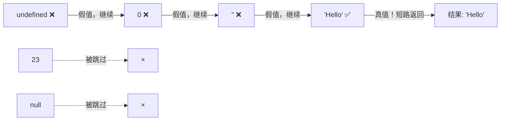
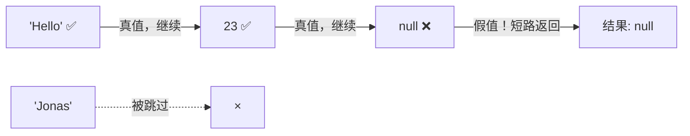
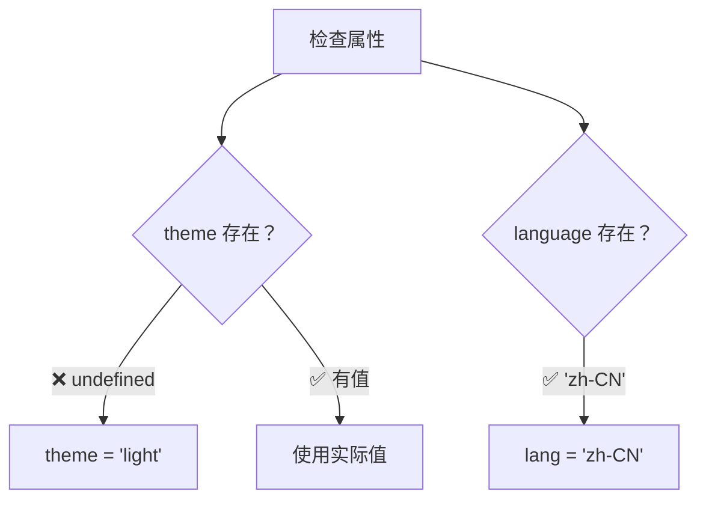

# 短路求值（Short Circuiting — `&&` 和 `||`）

> 📺 来源：008 Short Circuiting (&& and ||).en.srt
> 📂 章节：第 09 章

## 📌 知识脉络
- **前置知识**：布尔值、真值/假值（Truthy/Falsy）、三元运算符
- **后续扩展**：空值合并运算符（Nullish Coalescing Operator `??`）、逻辑赋值运算符

## 🎯 概述

逻辑运算符 `||`（OR）和 `&&`（AND）不仅可以返回布尔值，还可以返回**任意类型**的值。通过"短路求值"机制，它们可以用来设置默认值和替代简单的 `if` 语句。

## 核心知识点

### 1. OR 运算符 `||` 的短路求值

> 🧩 **生活类比**：OR 就像在多家饭馆排队——只要有一家有空位（真值），你就立刻进去坐下，不再看后面的餐馆。

三大规则：
1. 如果第一个操作数是**真值（truthy）**，立即返回它（短路）
2. 如果第一个是**假值（falsy）**，继续看下一个
3. 如果全部都是假值，返回**最后一个**

```js {runnable} {title="or_short_circuit.js"}
console.log(3 || 'Jonas');       // 3（3 是真值，短路）
console.log('' || 'Jonas');      // "Jonas"（'' 是假值，继续）
console.log(true || 0);         // true（true 是真值，短路）
console.log(undefined || null); // null（全假，返回最后一个）

console.log(undefined || 0 || '' || 'Hello' || 23 || null);
// "Hello"（前三个假值被跳过，Hello 是第一个真值）
```



**🔍 执行追踪：**

| 操作数 | 值 | 真/假 | 动作 |
|--------|-----|:-----:|------|
| `undefined` | `undefined` | 假 | 继续 → |
| `0` | `0` | 假 | 继续 → |
| `''` | `''` | 假 | 继续 → |
| `'Hello'` | `'Hello'` | **真** | ⚡ 短路返回 |

---

### 2. 用 OR 设置默认值

```js {runnable} {title="or_default_value.js"}
const restaurant = { name: 'Classico Italiano' };
// 属性不存在 → undefined → 使用默认值
const guests1 = restaurant.numGuests || 10;
console.log(guests1); // 10

// 属性存在 → 23 是真值 → 短路返回
restaurant.numGuests = 23;
const guests2 = restaurant.numGuests || 10;
console.log(guests2); // 23
```

:::code-comparison
```js {title="🚨 繁琐的三元运算符"}
const guests = restaurant.numGuests
  ? restaurant.numGuests
  : 10;
```
```js {title="✨ OR 短路设默认值"}
const guests = restaurant.numGuests || 10;
```
:::

> ⚠️ **陷阱**：当 `numGuests = 0` 时，`0` 是假值，会错误地返回默认值 `10`！此问题将在下一节用 `??` 解决。

---

### 3. AND 运算符 `&&` 的短路求值

> 🧩 **生活类比**：AND 就像安检通道——每一关都必须通过，只要有一关失败（假值），就立刻被拦下，不再检查后续关卡。

规则与 OR 相反：
1. 如果第一个操作数是**假值**，立即返回它（短路）
2. 如果第一个是**真值**，继续看下一个
3. 如果全部都是真值，返回**最后一个**

```js {runnable} {title="and_short_circuit.js"}
console.log(0 && 'Jonas');        // 0（0 是假值，短路）
console.log(7 && 'Jonas');        // "Jonas"（7 是真值，继续，返回最后一个）

console.log('Hello' && 23 && null && 'Jonas');
// null（Hello 真 → 23 真 → null 假 → 短路返回 null）
```



---

### 4. 用 AND 替代简单 if 语句

```js {runnable} {title="and_replace_if.js"}
const restaurant = {
  orderPizza(mainIngredient, ...others) {
    console.log(`主料: ${mainIngredient}, 辅料: ${others.join(', ')}`);
  },
};

// 传统 if 写法
if (restaurant.orderPizza) {
  restaurant.orderPizza('mushrooms', 'spinach');
}

// AND 短路写法（更简洁）
restaurant.orderPizza && restaurant.orderPizza('mushrooms', 'spinach');
```

> ⚠️ **不要滥用**：虽然 AND 可以替代简单的 `if` 检查，但过度使用会降低代码可读性。复杂逻辑仍应使用 `if` 语句。

---

## 🛠️ 代码实战与真实场景

> **💼 业务场景**：电商平台处理用户设置，使用短路求值设置默认选项和条件执行。

```js {runnable} {title="ecommerce_settings.js"}
const userSettings = {
  // theme 未设置
  language: 'zh-CN',
  // notifications 未设置
  currency: 'CNY',
};

// OR 设默认值
const theme = userSettings.theme || 'light';
const notifications = userSettings.notifications || true;
const lang = userSettings.language || 'en';
const currency = userSettings.currency || 'USD';

console.log(`主题: ${theme}`);          // "light"（默认值）
console.log(`通知: ${notifications}`);  // true（默认值）
console.log(`语言: ${lang}`);           // "zh-CN"（实际值）
console.log(`货币: ${currency}`);       // "CNY"（实际值）

// AND 条件执行
const onSale = true;
onSale && console.log('🎉 限时优惠进行中！');
// 输出: "🎉 限时优惠进行中！"
```



**📊 输入输出示例：**

| 属性 | 实际值 | `\|\|` 默认值 | 结果 | 说明 |
|------|--------|:------:|------|------|
| `theme` | `undefined` | `'light'` | `'light'` | 使用默认值 |
| `language` | `'zh-CN'` | `'en'` | `'zh-CN'` | 真值短路 |
| `currency` | `'CNY'` | `'USD'` | `'CNY'` | 真值短路 |

---

## 💡 关键要点
- ✅ `||` 返回第一个**真值**，全假则返回最后一个
- ✅ `&&` 返回第一个**假值**，全真则返回最后一个
- ✅ `||` 可以用于设置默认值（替代三元运算符）
- ✅ `&&` 可以用于条件执行（替代简单 `if`）
- ✅ 逻辑运算符可以返回**任意类型**的值，不仅是布尔值

## ⚠️ 常见误区
- ⚠️ **`0` 和 `''` 的陷阱**：`0 || 10` 返回 `10`，但 `0` 可能是合法值（如客人数量为 0）。用 `??` 解决此问题
- ⚠️ **过度使用短路替代 if**：简洁不等于可读，复杂条件仍应用 `if/else`

## 🐛 报错实验室

**❌ 隐性 Bug（不报错但逻辑错误）：**
```js
const restaurant = { numGuests: 0 };
const guests = restaurant.numGuests || 10;
console.log(guests); // 10 ← 期望 0，但 0 是假值！
```
**🔑 解读**：`0` 是 JavaScript 的六大假值之一，`||` 会跳过它并使用默认值。当 `0` 是合法业务值时，应改用空值合并运算符 `??`。

---

## 📖 词汇速查表 (Cheat Sheet)

| 中文术语 | 英文术语 | 简明释义 | 速查代码 | 📚 官方文档 |
|---------|---------|---------|---------|-----------|
| 短路求值 | Short-circuit Evaluation | 一旦确定结果就停止计算 | `a \|\| b` / `a && b` | [MDN](https://developer.mozilla.org/zh-CN/docs/Web/JavaScript/Reference/Operators/Logical_OR) |
| 假值 | Falsy Value | 转换为布尔时为 false 的值 | `0, '', null, undefined, NaN, false` | [MDN](https://developer.mozilla.org/zh-CN/docs/Glossary/Falsy) |
| 真值 | Truthy Value | 转换为布尔时为 true 的值 | 非假值的所有值 | [MDN](https://developer.mozilla.org/zh-CN/docs/Glossary/Truthy) |
| OR 运算符 | Logical OR | 返回第一个真值或最后一个值 | `a \|\| b` | [MDN](https://developer.mozilla.org/zh-CN/docs/Web/JavaScript/Reference/Operators/Logical_OR) |
| AND 运算符 | Logical AND | 返回第一个假值或最后一个值 | `a && b` | [MDN](https://developer.mozilla.org/zh-CN/docs/Web/JavaScript/Reference/Operators/Logical_AND) |

---

## 🧪 学习验证

### 📝 动手练习

**练习 1：预测短路求值的结果**
```js {runnable} {title="exercise1.js"}
// 预测每行的输出，然后运行验证
console.log(null || undefined || '' || 0 || 'first' || false);
console.log('hello' && 42 && '' && true);
console.log(false || null || 'yes' || 'also yes');
```
<details><summary>💡 参考答案</summary>

```js
console.log(null || undefined || '' || 0 || 'first' || false); // "first"
console.log('hello' && 42 && '' && true);                       // ""
console.log(false || null || 'yes' || 'also yes');              // "yes"
```
**解题思路**：
1. OR：前四个全假，`'first'` 是真值 → 短路返回
2. AND：`'hello'` 真 → `42` 真 → `''` 假 → 短路返回 `''`
3. OR：前两个假，`'yes'` 真 → 短路返回
</details>

**练习 2：用 OR 和 AND 简化代码**
```js {runnable} {title="exercise2.js"}
// 将以下 if/else 改写为短路求值
const user = { name: 'Alice' };

// 原始写法 1：
let displayName;
if (user.nickname) {
  displayName = user.nickname;
} else {
  displayName = user.name;
}

// 原始写法 2：
if (user.greet) {
  user.greet();
}

// 请用短路求值重写上述两段逻辑
```
<details><summary>💡 参考答案</summary>

```js
const displayName = user.nickname || user.name;
user.greet && user.greet();
```
**解题思路**：OR 用于默认值，AND 用于安全调用。
</details>

### ❓ 理解检测

:::quiz {correct="B"}
**1. `'' || 0 || null || undefined` 的结果是什么？**
- A) `''`
- B) `undefined`
- C) `null`

> **解析**：所有值都是假值，OR 运算最终返回最后一个操作数 `undefined`。
:::

:::quiz {correct="A"}
**2. `'hello' && 0 && true` 的结果是什么？**
- A) `0`
- B) `true`
- C) `'hello'`

> **解析**：`'hello'` 真 → 继续；`0` 假 → 短路返回 `0`。
:::

:::quiz {correct="C"}
**3. 为什么 `numGuests || 10` 在 `numGuests = 0` 时有 Bug？**
- A) `0` 不是合法数字
- B) OR 运算符不支持数字类型
- C) `0` 是假值，会被跳过而使用默认值 `10`

> **解析**：`0` 是 JS 的六大假值之一，OR 会将其视为"无值"并跳过，导致合法的 0 被默认值替代。
:::

### 🔧 代码填空

:::fill-blank
// 用 OR 设默认值
const port = process.env.PORT ___||___ 3000;

// 用 AND 安全调用方法
const result = obj.method ___&&___ obj.method();
:::
