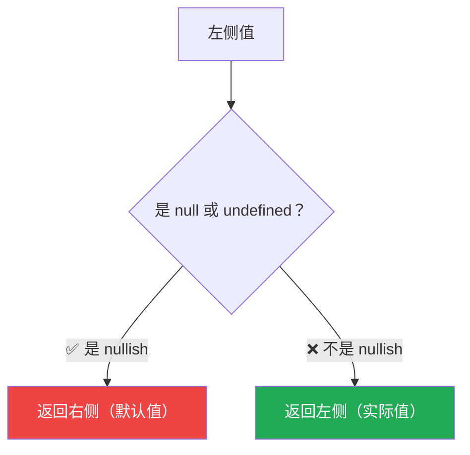

# 空值合并运算符（The Nullish Coalescing Operator `??`）

> 📺 来源：009 The Nullish Coalescing Operator ().en.srt
> 📂 章节：第 09 章

## 📌 知识脉络
- **前置知识**：短路求值（`||` 和 `&&`）、真值/假值（Truthy/Falsy）
- **后续扩展**：逻辑赋值运算符（`||=`, `??=`, `&&=`）、可选链（Optional Chaining `?.`）

## 🎯 概述

`??`（Nullish Coalescing Operator，空值合并运算符）是 ES2020 引入的运算符，它和 `||` 类似，但只将 **`null`** 和 **`undefined`** 视为"空值"，`0` 和 `''` 不再被当作假值跳过。这完美解决了 `||` 在处理合法的 `0` 或空字符串时的 Bug。

## 核心知识点

### 1. 问题回顾：`||` 的缺陷

> 🧩 **生活类比**：`||` 像一个过度敏感的门卫，把所有"看起来可疑的人"（包括穿便衣的合法员工 `0`、`''`）都拦在门外。而 `??` 是精准的门卫，只拦住真正"没有身份证"的人（`null`、`undefined`）。

```js {runnable} {title="or_problem.js"}
const restaurant = { numGuests: 0 };

// OR 运算符的 Bug
const guestsBad = restaurant.numGuests || 10;
console.log(guestsBad); // 10 ← 错误！0 是合法值但被当作假值

// 空值合并运算符的正确结果
const guestsCorrect = restaurant.numGuests ?? 10;
console.log(guestsCorrect); // 0 ← 正确！0 不是 nullish 值
```

---

### 2. `??` 的工作原理

`??` 只在左侧为 **`null`** 或 **`undefined`**（统称"空值/Nullish"）时，才返回右侧的值：

```js {runnable} {title="nullish_coalescing.js"}
// 左侧非 nullish → 直接返回左侧
console.log(0 ?? 10);         // 0
console.log('' ?? 'default'); // ''
console.log(false ?? true);   // false

// 左侧是 nullish → 返回右侧
console.log(null ?? 10);      // 10
console.log(undefined ?? 10); // 10
```



**📊 `||` vs `??` 对比表：**

| 左侧值 | `\|\|` 结果 | `??` 结果 | 说明 |
|---------|:---------:|:--------:|------|
| `undefined` | 默认值 | 默认值 | 两者一致 |
| `null` | 默认值 | 默认值 | 两者一致 |
| `0` | 默认值 ⚠️ | **`0`** ✅ | `??` 更精准 |
| `''` | 默认值 ⚠️ | **`''`** ✅ | `??` 更精准 |
| `false` | 默认值 | **`false`** | `??` 保留 `false` |
| `'hello'` | `'hello'` | `'hello'` | 两者一致 |

**🔍 执行追踪：**

| 表达式 | 左侧值 | 是 Nullish？ | 结果 |
|--------|--------|:----------:|------|
| `0 ?? 10` | `0` | ❌ | `0` |
| `null ?? 10` | `null` | ✅ | `10` |
| `undefined ?? 'hi'` | `undefined` | ✅ | `'hi'` |
| `'' ?? 'default'` | `''` | ❌ | `''` |

> 💡 **记忆口诀**：`||` 看"假不假"（Falsy），`??` 看"有没有"（Nullish = null/undefined）。

---

## 🛠️ 代码实战与真实场景

> **💼 业务场景**：用户设置页面——某些设置项合法值可以是 `0`、`false` 或空字符串。

```js {runnable} {title="user_settings.js"}
const userPrefs = {
  volume: 0,         // 合法：静音
  brightness: 100,
  nickname: '',      // 合法：用户清空了昵称
  autoPlay: false,   // 合法：关闭自动播放
  // theme 未设置
};

// 使用 ?? 正确处理
const volume = userPrefs.volume ?? 50;
const nickname = userPrefs.nickname ?? '匿名用户';
const autoPlay = userPrefs.autoPlay ?? true;
const theme = userPrefs.theme ?? 'dark';

console.log(`音量: ${volume}`);      // 0 ← 正确保留用户设置
console.log(`昵称: "${nickname}"`);  // "" ← 正确保留空字符串
console.log(`自动播放: ${autoPlay}`); // false ← 正确保留
console.log(`主题: ${theme}`);       // "dark" ← 使用默认值
```

```mermaid
flowchart LR
    V["volume: 0"] -->|"?? 50"| R1["0 ✅ 保留"]
    N["nickname: ''"] -->|"?? '匿名'"] R2["'' ✅ 保留"]
    T["theme: undefined"] -->|"?? 'dark'"| R3["'dark' ← 默认值"]
```

**📊 输入输出示例：**

| 属性 | 实际值 | 用 `\|\|` | 用 `??` | 正确？ |
|------|--------|----------|--------|:-----:|
| `volume: 0` | `0` | `50` ❌ | `0` ✅ | `??` 对 |
| `nickname: ''` | `''` | `'匿名'` ❌ | `''` ✅ | `??` 对 |
| `theme` | `undefined` | `'dark'` ✅ | `'dark'` ✅ | 都对 |

---

## 💡 关键要点
- ✅ `??` 只对 `null` 和 `undefined` 生效（Nullish 值）
- ✅ `0`、`''`、`false` 在 `??` 中被视为合法值，不会触发默认值
- ✅ 当需要区分"没有值"和"值为 0 / 空 / false"时，优先使用 `??`
- ✅ ES2020 引入，所有现代浏览器均支持

## ⚠️ 常见误区
- ⚠️ **误用 `||` 处理可能为 `0` 或 `''` 的值**：应改用 `??`
- ⚠️ **以为 `??` 和 `||` 完全相同**：`??` 只检查 nullish，不检查所有 falsy 值

## 🐛 报错实验室

**❌ 逻辑错误（不报错但结果错）：**
```js
const count = 0;
const display = count || '无数据';
console.log(display); // "无数据" ← 期望显示 0！
```
**✅ 正确写法：**
```js
const display = count ?? '无数据';
console.log(display); // 0 ← 正确！
```
**🔑 解读**：`0` 是假值但不是 nullish 值。当业务中 `0` 是合法值时，必须用 `??` 而非 `||`。

---

## 📖 词汇速查表 (Cheat Sheet)

| 中文术语 | 英文术语 | 简明释义 | 速查代码 | 📚 官方文档 |
|---------|---------|---------|---------|-----------|
| 空值合并运算符 | Nullish Coalescing Operator | 左侧为 null/undefined 时返回右侧 | `a ?? b` | [MDN](https://developer.mozilla.org/zh-CN/docs/Web/JavaScript/Reference/Operators/Nullish_coalescing) |
| 空值 | Nullish Values | null 和 undefined | `null`, `undefined` | [MDN](https://developer.mozilla.org/zh-CN/docs/Glossary/Nullish) |
| 假值 | Falsy Values | 0, '', null, undefined, NaN, false | `0 \|\| 10` → `10` | [MDN](https://developer.mozilla.org/zh-CN/docs/Glossary/Falsy) |

---

## 🧪 学习验证

### 📝 动手练习

**练习 1：修复 Bug —— 用 `??` 替换 `||`**
```js {runnable} {title="exercise1.js"}
const config = { timeout: 0, retries: null, verbose: false };

// 以下用 || 的写法都有 Bug，请改为 ??
const timeout = config.timeout || 3000;
const retries = config.retries || 3;
const verbose = config.verbose || true;

console.log(timeout);  // 应为 0，实际是 3000
console.log(retries);  // 应为 3（null 需要默认值）
console.log(verbose);  // 应为 false，实际是 true
```
<details><summary>💡 参考答案</summary>

```js
const timeout = config.timeout ?? 3000;   // 0（保留合法值）
const retries = config.retries ?? 3;      // 3（null 使用默认）
const verbose = config.verbose ?? true;   // false（保留合法值）
```
**解题思路**：所有可能为 `0`、`''` 或 `false` 的合法值场景，都应该用 `??`。
</details>

### ❓ 理解检测

:::quiz {correct="C"}
**1. 以下哪些是 Nullish 值？**
- A) `0`, `''`, `null`, `undefined`
- B) `false`, `null`, `NaN`
- C) `null`, `undefined`

> **解析**：Nullish 值只有两个：`null` 和 `undefined`。`0`、`''`、`false`、`NaN` 是假值（falsy）但不是 nullish。
:::

:::quiz {correct="B"}
**2. `false ?? 'default'` 的结果是什么？**
- A) `'default'`
- B) `false`
- C) `undefined`

> **解析**：`false` 不是 nullish 值（只有 null 和 undefined 才是），所以 `??` 直接返回左侧的 `false`。
:::

:::quiz {correct="A"}
**3. 什么时候应该用 `??` 而不是 `||`？**
- A) 当 `0`、`''` 或 `false` 是合法的业务值时
- B) 当需要更好的性能时
- C) 当操作对象属性时

> **解析**：`??` 的核心价值就是区分"没有值"（null/undefined）和"值为 falsy 但合法"（0、''、false）。
:::

### 🔧 代码填空

:::fill-blank
// 用 ?? 设置默认值
const score = playerScore ___??___ 0;

// ?? 只在值为 null 或 ___undefined___ 时生效
:::
