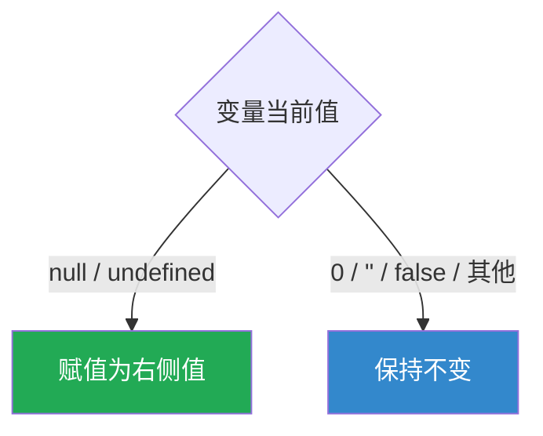
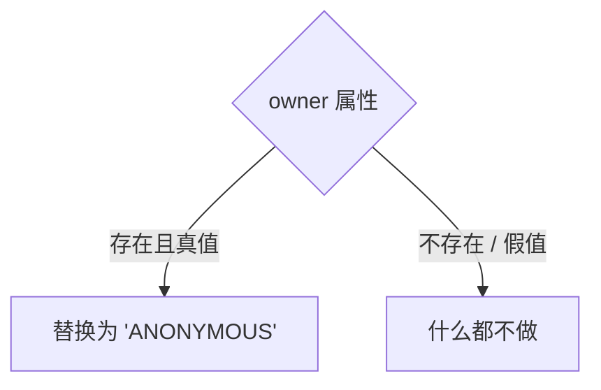
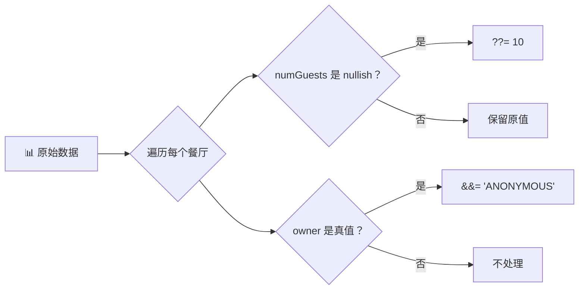

# 逻辑赋值运算符（Logical Assignment Operators）

> 📺 来源：010 Logical Assignment Operators.en.srt
> 📂 章节：第 09 章

## 📌 知识脉络
- **前置知识**：短路求值（`||`、`&&`）、空值合并运算符（`??`）
- **后续扩展**：可选链（Optional Chaining）、`for...of` 循环

## 🎯 概述

ES2021 引入了三个逻辑赋值运算符：`||=`（OR 赋值）、`??=`（空值合并赋值）、`&&=`（AND 赋值）。它们将逻辑运算和赋值合二为一，是设置默认值和条件更新属性的极简写法。

## 核心知识点

### 1. OR 赋值运算符 `||=`

> 🧩 **生活类比**：`||=` 就像"若空则填"——表格的某一栏如果没填，就帮你填上默认值；如果已经填了，就保持不动。

```js {runnable} {title="or_assignment.js"}
const rest1 = { name: 'Capri', numGuests: 20 };
const rest2 = { name: 'La Piazza', owner: 'Giovanni Rossi' };

// 传统写法
// rest1.numGuests = rest1.numGuests || 10;
// rest2.numGuests = rest2.numGuests || 10;

// OR 赋值运算符（等价写法）
rest1.numGuests ||= 10;
rest2.numGuests ||= 10;

console.log(rest1.numGuests); // 20（已有真值，保持不变）
console.log(rest2.numGuests); // 10（undefined 是假值，赋默认值）
```

:::code-comparison
```js {title="🚨 传统 OR 写法"}
rest1.numGuests = rest1.numGuests || 10;
```
```js {title="✨ OR 赋值运算符"}
rest1.numGuests ||= 10;
```
:::

> ⚠️ **`0` 的陷阱**：与 `||` 一样，`||=` 也会把 `0` 当作假值！

```js
rest1.numGuests = 0;
rest1.numGuests ||= 10;
console.log(rest1.numGuests); // 10 ← 错误！0 被覆盖了
```

---

### 2. 空值合并赋值运算符 `??=`

解决 `||=` 在 `0` 和 `''` 上的问题——只在值为 `null` 或 `undefined` 时才赋值：

```js {runnable} {title="nullish_assignment.js"}
const rest1 = { name: 'Capri', numGuests: 0 };
const rest2 = { name: 'La Piazza', owner: 'Giovanni Rossi' };

rest1.numGuests ??= 10;
rest2.numGuests ??= 10;

console.log(rest1.numGuests); // 0（0 不是 nullish，保持不变✅）
console.log(rest2.numGuests); // 10（undefined 是 nullish，赋默认值）
```



**📊 三种赋值运算符对比：**

| 当前值 | `\|\|= 10` | `??= 10` | 说明 |
|--------|:--------:|:-------:|------|
| `undefined` | `10` | `10` | 两者一致 |
| `null` | `10` | `10` | 两者一致 |
| `0` | `10` ⚠️ | **`0`** ✅ | `??=` 更安全 |
| `''` | `10` ⚠️ | **`''`** ✅ | `??=` 更安全 |
| `20` | `20` | `20` | 两者一致 |

> 💡 **记忆口诀**：`||=` 看"假不假"，`??=` 看"有没有"。推荐在设置默认值时优先使用 `??=`。

---

### 3. AND 赋值运算符 `&&=`

只在变量当前值为**真值**时才赋新值——适合"条件更新"场景：

```js {runnable} {title="and_assignment.js"}
const rest1 = { name: 'Capri', numGuests: 20 };
const rest2 = { name: 'La Piazza', owner: 'Giovanni Rossi' };

// 匿名化：如果 owner 存在（真值），替换为 '<ANONYMOUS>'
rest1.owner &&= '<ANONYMOUS>';
rest2.owner &&= '<ANONYMOUS>';

console.log(rest1.owner); // undefined（不存在，什么都没发生）
console.log(rest2.owner); // "<ANONYMOUS>"（存在且真值，被替换）
console.log(rest1);       // { name: 'Capri', numGuests: 20 } — 没有新增 owner
```



> 💡 **关键优势**：相比 `rest1.owner = rest1.owner && '<ANONYMOUS>'`，`&&=` 不会在属性不存在时创建值为 `undefined` 的新属性。

**🔍 执行追踪：**

| 对象 | `owner` 初始值 | `&&=` 后 | 说明 |
|------|:---:|:---:|------|
| `rest1` | `undefined`（不存在） | 不变 | 假值，不赋值 |
| `rest2` | `'Giovanni Rossi'` | `'<ANONYMOUS>'` | 真值，赋新值 |

---

## 🛠️ 代码实战与真实场景

> **💼 业务场景**：批量处理从 API 获取的餐厅数据——设置默认值并匿名化敏感信息。

```js {runnable} {title="batch_processing.js"}
const restaurants = [
  { name: 'Capri', numGuests: 20 },
  { name: 'La Piazza', owner: 'Giovanni', numGuests: 0 },
  { name: 'Bella', owner: 'Maria' },
];

for (const rest of restaurants) {
  rest.numGuests ??= 10;        // 只在没有设置时给默认值
  rest.owner &&= '<ANONYMOUS>'; // 有 owner 则匿名化
}

console.log(restaurants);
// [
//   { name: 'Capri', numGuests: 20 },              — numGuests 保留，无 owner
//   { name: 'La Piazza', owner: '<ANONYMOUS>', numGuests: 0 }, — 0 保留，owner 匿名
//   { name: 'Bella', owner: '<ANONYMOUS>', numGuests: 10 },    — 10 为默认值
// ]
```



**📊 输入输出示例：**

| 餐厅 | 原 `numGuests` | `??= 10` 后 | 原 `owner` | `&&=` 后 |
|------|:-----------:|:---------:|:--------:|:------:|
| Capri | `20` | `20` | — | — |
| La Piazza | `0` | `0` ✅ | `'Giovanni'` | `'<ANONYMOUS>'` |
| Bella | `undefined` | `10` | `'Maria'` | `'<ANONYMOUS>'` |

---

## 💡 关键要点
- ✅ `||=`：当前值为**假值**时赋值（适合设默认值，但注意 `0` 和 `''` 的陷阱）
- ✅ `??=`：当前值为 **null/undefined** 时赋值（最安全的默认值方案）
- ✅ `&&=`：当前值为**真值**时赋新值（适合条件更新）
- ✅ 三者都是 ES2021 语法，现代浏览器均支持
- ✅ `??=` 应该是日常设置默认值的首选

## ⚠️ 常见误区
- ⚠️ **混用 `||=` 和 `??=`**：当合法值可能为 `0`、`''` 或 `false` 时，必须用 `??=`
- ⚠️ **以为 `&&=` 会创建新属性**：若属性不存在或为假值，`&&=` 什么都不做，不会添加新属性

## 🐛 报错实验室

**❌ 逻辑 Bug：**
```js
const settings = { volume: 0 };
settings.volume ||= 50;
console.log(settings.volume); // 50 ← 期望 0！
```
**✅ 正确写法：**
```js
settings.volume ??= 50;
console.log(settings.volume); // 0 ← 正确
```
**🔑 解读**：`0` 是假值但不是 nullish 值。用 `??=` 确保只在 null/undefined 时才设默认值。

---

## 📖 词汇速查表 (Cheat Sheet)

| 中文术语 | 英文术语 | 简明释义 | 速查代码 | 📚 官方文档 |
|---------|---------|---------|---------|-----------|
| OR 赋值 | OR Assignment | 假值时赋值 | `x \|\|= 10` | [MDN](https://developer.mozilla.org/zh-CN/docs/Web/JavaScript/Reference/Operators/Logical_OR_assignment) |
| 空值赋值 | Nullish Assignment | null/undefined 时赋值 | `x ??= 10` | [MDN](https://developer.mozilla.org/zh-CN/docs/Web/JavaScript/Reference/Operators/Nullish_coalescing_assignment) |
| AND 赋值 | AND Assignment | 真值时赋新值 | `x &&= 'new'` | [MDN](https://developer.mozilla.org/zh-CN/docs/Web/JavaScript/Reference/Operators/Logical_AND_assignment) |

---

## 🧪 学习验证

### 📝 动手练习

**练习 1：用逻辑赋值运算符重构**
```js {runnable} {title="exercise1.js"}
const user = { name: 'Alice', email: null, score: 0 };

// 请用逻辑赋值运算符重写以下代码
user.email = user.email || 'unknown@example.com';
user.score = user.score || 100;
user.name = user.name && user.name.toUpperCase();

console.log(user);
// 期望: { name: 'ALICE', email: 'unknown@example.com', score: 0 }
// 但上面用 || 会导致 score 变成 100，请修复
```
<details><summary>💡 参考答案</summary>

```js
user.email ??= 'unknown@example.com'; // null → 赋默认值
user.score ??= 100;                    // 0 不是 nullish，保留！
user.name &&= user.name.toUpperCase(); // 有值则转大写
console.log(user);
// { name: 'ALICE', email: 'unknown@example.com', score: 0 }
```
**解题思路**：`email` 和 `score` 用 `??=` 避免 `0`/`null` 的陷阱，`name` 用 `&&=` 条件更新。
</details>

### ❓ 理解检测

:::quiz {correct="B"}
**1. `x ??= 10` 在什么情况下会赋值？**
- A) 当 x 是假值时
- B) 当 x 是 null 或 undefined 时
- C) 当 x 是真值时

> **解析**：`??=` 是空值合并赋值，只在 `x` 为 null 或 undefined 时赋值。`0`、`''`、`false` 不触发。
:::

:::quiz {correct="C"}
**2. `x &&= 'new'` 在什么情况下会赋值？**
- A) 当 x 是 null 时
- B) 当 x 是假值时
- C) 当 x 是真值时

> **解析**：`&&=` 只在当前值为真值时才赋新值。如果 x 为假值（包括不存在），什么都不做。
:::

:::quiz {correct="A"}
**3. 设置默认值时，以下哪个运算符最安全？**
- A) `??=`
- B) `||=`
- C) `&&=`

> **解析**：`??=` 只对 null/undefined 赋值，不会误覆盖 `0`、`''` 等合法假值，是最安全的默认值方案。
:::

### 🔧 代码填空

:::fill-blank
const config = { timeout: 0, retries: null };

// 只在 null/undefined 时设默认值
config.retries ___??=___ 3;

// 有值时更新
config.timeout ___&&=___ config.timeout * 2;
:::
