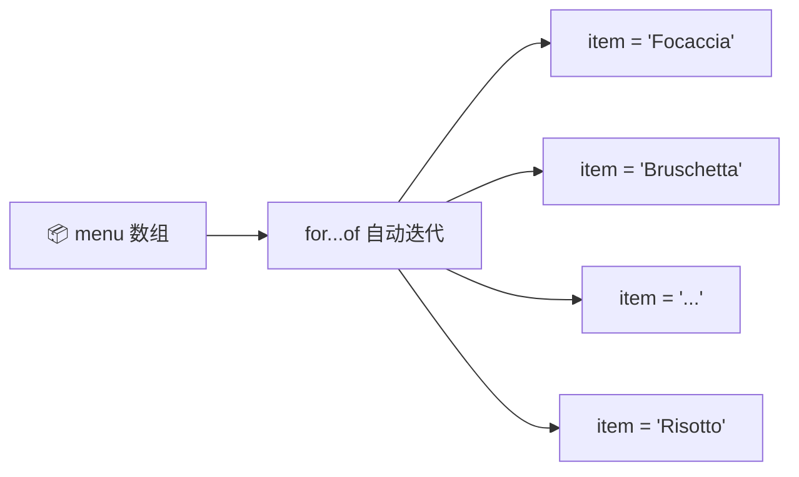
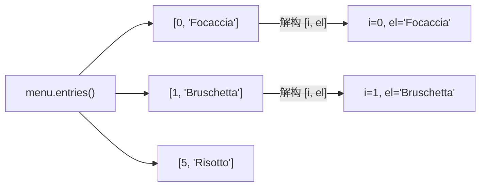
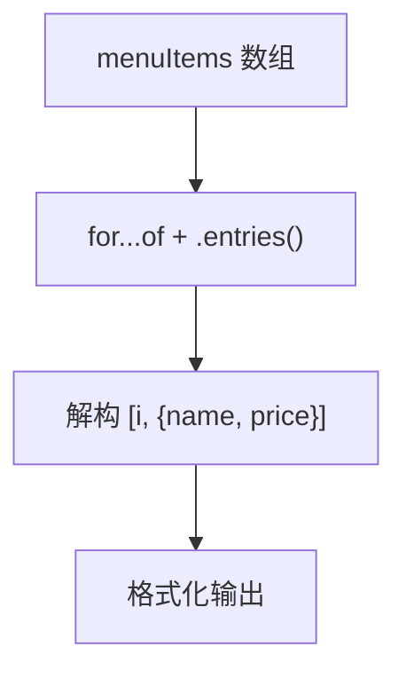

# for-of 循环遍历数组（Looping Arrays: The for-of Loop）

> 📺 来源：012 Looping Arrays The for-of Loop.en.srt
> 📂 章节：第 09 章

## 📌 知识脉络
- **前置知识**：传统 `for` 循环、数组基础、解构赋值
- **后续扩展**：增强对象字面量、`for...in` 循环、数组方法（`forEach`、`map` 等）

## 🎯 概述

ES6 引入了 `for...of` 循环，极大简化了数组遍历——不再需要手动管理计数器、条件和递增。本节讲解基本用法、如何获取索引（`.entries()`），以及与传统 `for` 循环的区别。

## 核心知识点

### 1. 基础 for...of 语法

> 🧩 **生活类比**：传统 `for` 循环像自己驾车——你要管油门（计数器）、看路况（条件）、换挡（递增）。`for...of` 像坐自动驾驶——你只需要看窗外的风景（当前元素）。

```js {runnable} {title="for_of_basic.js"}
const menu = ['Focaccia', 'Bruschetta', 'Garlic Bread', 'Pizza', 'Pasta', 'Risotto'];

for (const item of menu) {
  console.log(item);
}
// Focaccia
// Bruschetta
// Garlic Bread
// Pizza
// Pasta
// Risotto
```

:::code-comparison
```js {title="🚨 传统 for 循环"}
for (let i = 0; i < menu.length; i++) {
  console.log(menu[i]);
}
```
```js {title="✨ for...of 循环"}
for (const item of menu) {
  console.log(item);
}
```
:::



> 💡 **关键特性**：`for...of` 仍然支持 `continue` 和 `break` 关键字（后续的 `forEach` 不支持）。

**🔍 执行追踪：**

| 迭代 | `item` |
|:----:|--------|
| 1 | `'Focaccia'` |
| 2 | `'Bruschetta'` |
| 3 | `'Garlic Bread'` |
| ... | ... |

---

### 2. 获取索引：`.entries()` 方法

`for...of` 默认只给元素值，不给索引。若需索引，使用数组的 `.entries()` 方法：

```js {runnable} {title="entries_method.js"}
const menu = ['Focaccia', 'Bruschetta', 'Garlic Bread', 'Pizza', 'Pasta', 'Risotto'];

// .entries() 返回 [索引, 元素] 的迭代器
for (const [i, el] of menu.entries()) {
  console.log(`${i + 1}: ${el}`);
}
// 1: Focaccia
// 2: Bruschetta
// 3: Garlic Bread
// 4: Pizza
// 5: Pasta
// 6: Risotto
```



> 💡 每次迭代 `.entries()` 产出一个 `[索引, 值]` 的数组，我们用**解构赋值**在循环头部直接拆分。

---

## 🛠️ 代码实战与真实场景

> **💼 业务场景**：渲染一个餐厅菜单列表。

```js {runnable} {title="render_menu.js"}
const menuItems = [
  { name: '意式烤面包', price: 28, category: 'starter' },
  { name: '蒜香面包', price: 22, category: 'starter' },
  { name: '玛格丽特披萨', price: 68, category: 'main' },
  { name: '奶油意面', price: 58, category: 'main' },
];

console.log('=== 🍽️ 今日菜单 ===');
for (const [i, { name, price }] of menuItems.entries()) {
  console.log(`${i + 1}. ${name} — ¥${price}`);
}
```



**📊 输入输出示例：**

| 索引 | `name` | `price` | 输出 |
|:----:|--------|:------:|------|
| 0 | 意式烤面包 | 28 | `1. 意式烤面包 — ¥28` |
| 1 | 蒜香面包 | 22 | `2. 蒜香面包 — ¥22` |

---

## 💡 关键要点
- ✅ `for (const item of arr)` 自动遍历所有元素
- ✅ 不需要计数器、条件和递增——更简洁
- ✅ 支持 `continue` 和 `break`
- ✅ 需要索引时用 `arr.entries()` 配合解构
- ✅ 使用 `const` 声明循环变量即可（每次迭代自动创建新绑定）

## ⚠️ 常见误区
- ⚠️ **混淆 `for...of` 和 `for...in`**：`for...of` 遍历**值**（用于数组），`for...in` 遍历**键/索引**（用于对象）
- ⚠️ **以为不能获取索引**：用 `.entries()` 即可同时获取索引和值

## 🐛 报错实验室

**❌ 错误写法：**
```js
const obj = { a: 1, b: 2 };
for (const item of obj) { } // ❌ TypeError
```
**浏览器报错：**
```
Uncaught TypeError: obj is not iterable
```
**🔑 解读**：普通对象不是可迭代对象，不能直接用 `for...of`。要遍历对象，使用 `Object.keys(obj)` / `Object.values(obj)` / `Object.entries(obj)`。

---

## 📖 词汇速查表 (Cheat Sheet)

| 中文术语 | 英文术语 | 简明释义 | 速查代码 | 📚 官方文档 |
|---------|---------|---------|---------|-----------|
| for...of 循环 | for...of Loop | 遍历可迭代对象的值 | `for (const x of arr)` | [MDN](https://developer.mozilla.org/zh-CN/docs/Web/JavaScript/Reference/Statements/for...of) |
| .entries() | Array.entries() | 返回 [索引, 值] 的迭代器 | `arr.entries()` | [MDN](https://developer.mozilla.org/zh-CN/docs/Web/JavaScript/Reference/Global_Objects/Array/entries) |
| 迭代器 | Iterator | 可逐步访问集合元素的对象 | `arr[Symbol.iterator]()` | [MDN](https://developer.mozilla.org/zh-CN/docs/Web/JavaScript/Reference/Iteration_protocols) |

---

## 🧪 学习验证

### 📝 动手练习

**练习 1：用 for...of 过滤并打印**
```js {runnable} {title="exercise1.js"}
const prices = [120, 35, 88, 15, 200, 42];
// 用 for...of 只打印大于 50 的价格（带序号）
```
<details><summary>💡 参考答案</summary>

```js
for (const [i, price] of prices.entries()) {
  if (price > 50) console.log(`#${i + 1}: ¥${price}`);
}
```
</details>

**练习 2：用 for...of 累加总价**
```js {runnable} {title="exercise2.js"}
const cart = [
  { item: '苹果', price: 8 },
  { item: '牛奶', price: 15 },
  { item: '面包', price: 12 },
];
// 用 for...of 计算购物车总价
```
<details><summary>💡 参考答案</summary>

```js
let total = 0;
for (const { price } of cart) {
  total += price;
}
console.log(`总价: ¥${total}`); // ¥35
```
</details>

### ❓ 理解检测

:::quiz {correct="B"}
**1. `for...of` 和 `for...in` 的主要区别是什么？**
- A) `for...of` 更慢
- B) `for...of` 遍历值，`for...in` 遍历键
- C) `for...in` 不能用于对象

> **解析**：`for...of` 遍历可迭代对象的**值**，`for...in` 遍历对象的**键**（包括继承来的可枚举属性）。
:::

:::quiz {correct="C"}
**2. 如何在 `for...of` 中同时获取索引和值？**
- A) `for (const [i, v] of arr)`
- B) `for (const i, v of arr)`
- C) `for (const [i, v] of arr.entries())`

> **解析**：需要配合 `.entries()` 方法，它返回 `[索引, 值]` 对的迭代器。
:::

:::quiz {correct="A"}
**3. `for...of` 循环能使用 `break` 吗？**
- A) 能
- B) 不能
- C) 只能在嵌套循环中使用

> **解析**：`for...of` 完全支持 `break` 和 `continue`，这是它相比 `forEach` 的优势之一。
:::

### 🔧 代码填空

:::fill-blank
// 遍历数组元素
for (const item ___of___ menu) { }

// 带索引遍历
for (const [i, el] of menu.___entries()___) { }
:::
