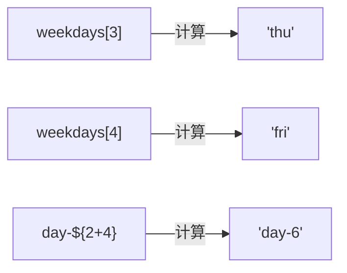
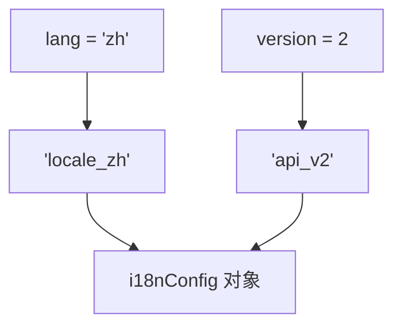

# 增强对象字面量（Enhanced Object Literals）

> 📺 来源：013 Enhanced Object Literals.en.srt
> 📂 章节：第 09 章

## 📌 知识脉络
- **前置知识**：对象基础（创建、方法定义）、计算属性名
- **后续扩展**：可选链（Optional Chaining）、`for...of` + `Object.entries()`

## 🎯 概述

ES6 为对象字面量引入了三个语法增强：**属性简写**（变量名即属性名）、**方法简写**（省略 `function` 关键字）、**计算属性名**（用表达式作属性名）。

## 核心知识点

### 1. 属性简写（Property Shorthand）

> 🧩 **生活类比**：就像填表时，名字栏的标签和你的名字正好一样，系统就不用你重复填了。

当变量名与属性名相同时，可以省略 `: 变量名`：

```js {runnable} {title="property_shorthand.js"}
const openingHours = {
  thu: { open: 12, close: 22 },
  fri: { open: 11, close: 23 },
};

// ES5 写法
const restaurantOld = {
  name: 'Classico Italiano',
  openingHours: openingHours, // 属性名 = 变量名，重复了
};

// ES6 增强写法
const restaurant = {
  name: 'Classico Italiano',
  openingHours, // 自动以变量名作属性名
};

console.log(restaurant.openingHours); // { thu: {...}, fri: {...} }
```

:::code-comparison
```js {title="🚨 ES5 写法（重复）"}
const obj = {
  openingHours: openingHours,
};
```
```js {title="✨ ES6 属性简写"}
const obj = {
  openingHours,
};
```
:::

---

### 2. 方法简写（Method Shorthand）

不再需要 `属性名: function() { }` 的写法：

```js {runnable} {title="method_shorthand.js"}
// ES5 方法定义
const calcOld = {
  add: function (a, b) {
    return a + b;
  },
};

// ES6 方法简写
const calc = {
  add(a, b) {
    return a + b;
  },
};

console.log(calc.add(2, 3)); // 5
```

:::code-comparison
```js {title="🚨 ES5 方法语法"}
order: function(starterIndex, mainIndex) {
  return [this.starterMenu[starterIndex], this.mainMenu[mainIndex]];
}
```
```js {title="✨ ES6 方法简写"}
order(starterIndex, mainIndex) {
  return [this.starterMenu[starterIndex], this.mainMenu[mainIndex]];
}
```
:::

---

### 3. 计算属性名（Computed Property Names）

使用 `[表达式]` 作为属性名——不再局限于手写字面量：

```js {runnable} {title="computed_property_names.js"}
const weekdays = ['mon', 'tue', 'wed', 'thu', 'fri', 'sat', 'sun'];

const openingHours = {
  [weekdays[3]]: { open: 12, close: 22 },              // thu
  [weekdays[4]]: { open: 11, close: 23 },              // fri
  [`day-${2 + 4}`]: { open: 0, close: 24 },            // day-6
};

console.log(openingHours);
// { thu: {...}, fri: {...}, 'day-6': {...} }
```



> 💡 方括号内可以放**任何表达式**——变量、数组索引、模板字面量、函数调用等。

---

## 🛠️ 代码实战与真实场景

> **💼 业务场景**：动态构建国际化配置对象。

```js {runnable} {title="i18n_config.js"}
const lang = 'zh';
const version = 2;

const i18nConfig = {
  [`locale_${lang}`]: '简体中文',
  [`api_v${version}`]: 'https://api.example.com/v2',
  
  // 方法简写
  getLocale() {
    return this[`locale_${lang}`];
  },
};

console.log(i18nConfig.getLocale()); // "简体中文"
console.log(i18nConfig.api_v2);      // "https://api.example.com/v2"
```



**📊 输入输出示例：**

| 表达式 | 计算结果（属性名） | 属性值 |
|--------|:---------:|-------|
| `` `locale_${lang}` `` | `'locale_zh'` | `'简体中文'` |
| `` `api_v${version}` `` | `'api_v2'` | `'https://...'` |

**🔍 执行追踪：**

| 步骤 | 操作 | 结果 |
|------|------|------|
| ① | 计算 `` `locale_${lang}` `` | 属性名 = `'locale_zh'` |
| ② | 计算 `` `api_v${version}` `` | 属性名 = `'api_v2'` |
| ③ | 方法简写定义 `getLocale()` | 可通过 `this` 访问动态属性 |

---

## 💡 关键要点
- ✅ **属性简写**：变量名与属性名相同时，只写变量名即可
- ✅ **方法简写**：省略 `: function`，直接写 `method() {}`
- ✅ **计算属性名**：`[表达式]` 允许动态生成属性名
- ✅ 三种增强纯属语法糖，不影响功能行为

## ⚠️ 常见误区
- ⚠️ **方法简写中的 `this`**：方法简写仍然是普通函数，`this` 绑定不变；但不要改为箭头函数，否则 `this` 会指向外层作用域
- ⚠️ **计算属性名的动态性**：属性名在对象创建时就计算好了，后续修改变量不会影响已创建的属性名

## 🐛 报错实验室

**❌ 错误写法：**
```js
const key = 'name';
const obj = { key: 'Alice' }; // ❌ 属性名是字面量 "key"，不是变量 key 的值
console.log(obj.name); // undefined
console.log(obj.key);  // "Alice"
```
**✅ 正确写法：**
```js
const key = 'name';
const obj = { [key]: 'Alice' }; // ✅ 计算属性名
console.log(obj.name); // "Alice"
```
**🔑 解读**：若想用变量的**值**作属性名，必须用 `[变量]` 方括号语法。

---

## 📖 词汇速查表 (Cheat Sheet)

| 中文术语 | 英文术语 | 简明释义 | 速查代码 | 📚 官方文档 |
|---------|---------|---------|---------|-----------|
| 属性简写 | Property Shorthand | 变量名即属性名 | `{ name }` | [MDN](https://developer.mozilla.org/zh-CN/docs/Web/JavaScript/Reference/Operators/Object_initializer#属性定义) |
| 方法简写 | Method Shorthand | 省略 function 关键字 | `{ fn() {} }` | [MDN](https://developer.mozilla.org/zh-CN/docs/Web/JavaScript/Reference/Functions/Method_definitions) |
| 计算属性名 | Computed Property Names | 用表达式动态生成属性名 | `{ [expr]: val }` | [MDN](https://developer.mozilla.org/zh-CN/docs/Web/JavaScript/Reference/Operators/Object_initializer#计算属性名) |

---

## 🧪 学习验证

### 📝 动手练习

**练习 1：用三种增强语法重构对象**
```js {runnable} {title="exercise1.js"}
const title = 'JavaScript Guide';
const author = 'Jonas';
const category = 'programming';

// 用 ES6 增强语法创建 book 对象，包含：
// 1. title, author, category 属性（简写）
// 2. 一个 getSummary() 方法（方法简写）
// 3. 一个计算属性名 `cat_${category}`
```
<details><summary>💡 参考答案</summary>

```js
const book = {
  title,
  author,
  category,
  getSummary() {
    return `${this.title} by ${this.author}`;
  },
  [`cat_${category}`]: true,
};
```
</details>

### ❓ 理解检测

:::quiz {correct="A"}
**1. `{ openingHours }` 等价于以下哪种写法？**
- A) `{ openingHours: openingHours }`
- B) `{ 'openingHours': undefined }`
- C) `{ [openingHours]: openingHours }`

> **解析**：属性简写 `{ x }` 等价于 `{ x: x }`——属性名和值都是同一个变量。
:::

:::quiz {correct="B"}
**2. `{ [expr]: value }` 中方括号的作用是什么？**
- A) 创建数组
- B) 将表达式的计算结果作为属性名
- C) 解构赋值

> **解析**：`[expr]` 是计算属性名语法，会先计算表达式，然后用其结果作为属性键。
:::

:::quiz {correct="C"}
**3. 以下哪种是 ES6 方法简写？**
- A) `order: (a) => a + 1`
- B) `order: function(a) { return a + 1 }`
- C) `order(a) { return a + 1 }`

> **解析**：方法简写省略了 `: function`，直接写方法名 + 参数列表 + 函数体。
:::

### 🔧 代码填空

:::fill-blank
const name = 'Alice';
const age = 25;

// 属性简写
const user = { ___name___, ___age___ };

// 计算属性名
const key = 'score';
const data = { ___[key]___: 100 };
:::
